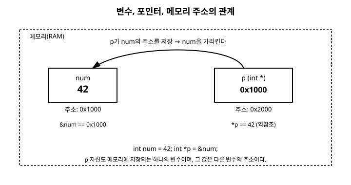

# 11장. 포인터 기초

[◀ 이전: 10장. 문자열](ch10-문자열.md) | [📖 목차](00-목차.md) | [다음: 12장. 포인터 응용 ▶](ch12-포인터응용.md)

---

C 언어를 배우면서 가장 많은 사람이 어려워하는 주제를 하나만 꼽으라면 단연 포인터(pointer)일 것입니다. 하지만 포인터의 개념 자체는 사실 그리 복잡하지 않습니다. "메모리에는 주소가 있고, 그 주소를 저장하는 변수가 있다"는 사실만 정확히 이해하면 나머지는 표기법에 익숙해지는 문제일 뿐입니다. 이번 장에서는 메모리 주소가 무엇인지부터 시작해서, 포인터 변수를 선언하고 사용하는 방법, 그리고 초보자가 자주 저지르는 실수까지 차근차근 살펴보겠습니다.

## 11.1 메모리 주소란 무엇인가

프로그램이 실행되면 운영체제는 그 프로그램에 사용할 메모리(RAM) 공간을 할당합니다. 이 메모리는 하나의 거대한 바이트 배열이라고 생각할 수 있습니다. 그리고 이 배열의 각 칸(바이트)에는 고유한 번호가 붙어 있는데, 이것이 바로 **주소(address)**입니다.

우리가 `int count = 10;` 처럼 변수를 선언하면, 컴파일러는 그 변수를 저장할 메모리 공간을 확보하고 그 공간에 특정 주소를 배정합니다. 프로그래머는 평소에 `count`라는 이름만으로 그 값에 접근하지만, 실제로 컴퓨터 내부에서는 "주소 몇 번지에 있는 값을 읽어라"는 식으로 동작합니다. 즉, 변수 이름은 사람이 이해하기 쉽도록 컴파일러가 제공하는 별명이고, 그 뒤에는 항상 실제 메모리 주소가 존재합니다.

포인터란 바로 이 주소값을 저장하는 변수입니다. 일반 변수가 정수나 문자 같은 "값"을 저장한다면, 포인터 변수는 "다른 변수가 저장된 위치"를 저장합니다.

## 11.2 & 연산자로 주소 확인하기

C에서는 `&` 연산자를 사용해 어떤 변수가 실제로 메모리의 어느 위치에 저장되어 있는지 확인할 수 있습니다. `&`를 변수 이름 앞에 붙이면 "이 변수의 주소"라는 뜻이 됩니다.

```c
#include <stdio.h>

int main(void) {
    int count = 10;
    double price = 999.5;
    char grade = 'A';

    // %p는 주소값을 출력하기 위한 서식 지정자이다
    printf("count의 값: %d, count의 주소: %p\n", count, (void *)&count);
    printf("price의 값: %.1f, price의 주소: %p\n", price, (void *)&price);
    printf("grade의 값: %c, grade의 주소: %p\n", grade, (void *)&grade);

    return 0;
}
```

실행 결과는 실행할 때마다, 그리고 컴퓨터마다 달라집니다. 예를 들어 다음과 비슷한 형태로 출력됩니다.

```
count의 값: 10, count의 주소: 0x7ffe3a2c1c9c
price의 값: 999.5, price의 주소: 0x7ffe3a2c1ca0
grade의 값: A, grade의 주소: 0x7ffe3a2c1c9b
```

여기서 중요한 점은 주소값 자체가 아니라, **모든 변수는 메모리 상의 특정 위치에 존재하며 그 위치는 & 연산자로 알아낼 수 있다**는 사실입니다. `%p` 서식 지정자는 주소를 출력할 때 사용하며, 이식성을 위해 인자를 `(void *)`로 형변환해서 넘기는 것이 관례입니다.

## 11.3 포인터 변수의 선언과 초기화

포인터 변수를 선언하는 문법은 다음과 같습니다.

```c
자료형 *변수이름;
```

예를 들어 정수형 변수의 주소를 저장하고 싶다면 다음처럼 선언합니다.

```c
int *p;   // int형 변수의 주소를 저장할 수 있는 포인터 변수 p
```

여기서 `*`는 "이 변수는 포인터다"라는 표시이고, 앞의 `int`는 "이 포인터가 가리키는 대상이 int형 변수다"라는 뜻입니다. 즉 포인터를 선언할 때 지정하는 자료형은 포인터 자신의 크기가 아니라 **그 포인터가 가리킬 대상의 자료형**을 의미합니다. 이것이 왜 중요한지는 뒤에서 포인터 연산을 다룰 때, 그리고 12장 포인터 응용에서 다시 확인하게 됩니다.

포인터 변수도 다른 변수와 마찬가지로 선언과 동시에 초기화할 수 있습니다.

```c
int num = 42;
int *p = &num;   // p는 num의 주소로 초기화된다
```

주의할 점은 자료형이 서로 일치해야 한다는 것입니다. `int *p`는 `int`형 변수의 주소만 담을 수 있고, `double` 변수의 주소를 담으려면 `double *` 포인터를 사용해야 합니다.

```c
#include <stdio.h>

int main(void) {
    int num = 42;
    int *p = &num;

    double price = 3.14;
    double *pd = &price;

    printf("p가 가리키는 주소: %p\n", (void *)p);
    printf("pd가 가리키는 주소: %p\n", (void *)pd);

    return 0;
}
```

아래 그림은 이 관계를 도식화한 것입니다. `num`이라는 변수는 메모리의 어느 주소(그림에서는 편의상 0x1000으로 표기)에 42라는 값을 저장하고 있고, `p`라는 포인터 변수는 자기 자신의 주소(0x2000)에 num의 주소값인 0x1000을 저장하고 있습니다.



포인터 변수 자체도 결국 메모리 공간을 차지하는 하나의 변수라는 점을 기억해 두시기 바랍니다. 다만 그 안에 들어 있는 값이 일반적인 데이터가 아니라 "다른 변수의 주소"라는 점이 다를 뿐입니다.

## 11.4 * 연산자로 역참조하기

포인터가 가리키고 있는 곳에 실제로 어떤 값이 들어 있는지 확인하려면 `*` 연산자를 사용합니다. 이를 **역참조(dereference)**라고 부릅니다. 선언할 때 사용하는 `*`와 역참조할 때 사용하는 `*`는 기호는 같지만 문맥에 따라 의미가 다르므로 헷갈리지 않도록 주의해야 합니다.

```c
#include <stdio.h>

int main(void) {
    int num = 42;
    int *p = &num;

    printf("num의 값: %d\n", num);
    printf("p가 가리키는 값(*p): %d\n", *p);   // num과 같은 값이 출력된다

    *p = 100;   // p가 가리키는 곳, 즉 num의 값을 100으로 변경
    printf("변경 후 num의 값: %d\n", num);     // 100이 출력된다

    return 0;
}
```

실행 결과는 다음과 같습니다.

```
num의 값: 42
p가 가리키는 값(*p): 42
변경 후 num의 값: 100
```

`*p = 100;`이라는 문장은 "p 자신의 값을 100으로 바꿔라"가 아니라 "p가 가리키고 있는 위치(즉 num)의 값을 100으로 바꿔라"라는 뜻입니다. 이렇게 포인터를 통해 원래 변수의 값을 간접적으로 읽고 쓸 수 있다는 점이 포인터의 핵심 기능이며, 이 성질은 12장 포인터 응용에서 함수에 값을 전달하고 변경하는 방법을 다룰 때 결정적인 역할을 합니다.

정리하면 다음과 같은 관계가 성립합니다.

```c
int num = 42;
int *p = &num;

// 아래 두 식은 항상 같은 값을 나타낸다
num;    // 42
*p;     // 42

// 아래 두 식도 항상 같은 주소를 나타낸다
&num;   // num의 주소
p;      // p에 저장된 값 = num의 주소
```

## 11.5 NULL 포인터

포인터 변수를 선언했지만 아직 특정 변수를 가리키게 하고 싶지 않을 때, 또는 "지금은 아무것도 가리키고 있지 않다"는 상태를 명시적으로 표현하고 싶을 때는 `NULL`을 대입합니다. `NULL`은 `<stddef.h>`나 `<stdio.h>` 등 여러 표준 헤더 파일에서 정의하는 매크로로, 일반적으로 0에 해당하는 특별한 주소값을 의미합니다.

```c
#include <stdio.h>
#include <stddef.h>

int main(void) {
    int *p = NULL;

    if (p == NULL) {
        printf("p는 현재 아무것도 가리키고 있지 않습니다.\n");
    }

    return 0;
}
```

NULL 포인터를 역참조하면(즉 `*p`처럼 사용하면) 프로그램이 비정상 종료됩니다. 대부분의 운영체제에서는 0번지 부근의 메모리에 접근하는 것을 금지해 두었기 때문에, NULL 포인터를 역참조하는 순간 세그멘테이션 오류(segmentation fault) 같은 오류가 발생합니다. 따라서 포인터를 사용하기 전에 NULL 여부를 검사하는 습관은 실무에서 매우 중요합니다. 이 내용은 14장 동적 메모리 할당에서 `malloc` 함수가 실패했을 때 NULL을 반환하는 상황과 함께 다시 다루게 됩니다.

```c
int *p = NULL;

// 아래처럼 사용하기 전에 NULL 검사를 하는 습관을 들이자
if (p != NULL) {
    printf("%d\n", *p);
} else {
    printf("p는 유효하지 않은 포인터입니다.\n");
}
```

## 11.6 포인터의 크기

포인터 변수가 차지하는 메모리 크기는 그것이 가리키는 대상의 자료형과 무관하게, 실행 환경(주로 CPU의 비트 수)에 따라 고정됩니다. `sizeof` 연산자로 직접 확인해 봅시다.

```c
#include <stdio.h>

int main(void) {
    int *pi;
    double *pd;
    char *pc;

    printf("int 포인터의 크기: %zu 바이트\n", sizeof(pi));
    printf("double 포인터의 크기: %zu 바이트\n", sizeof(pd));
    printf("char 포인터의 크기: %zu 바이트\n", sizeof(pc));

    return 0;
}
```

64비트 환경에서는 세 포인터 모두 8바이트로 동일하게 출력됩니다.

```
int 포인터의 크기: 8 바이트
double 포인터의 크기: 8 바이트
char 포인터의 크기: 8 바이트
```

이는 포인터가 실제로 저장하는 것이 "메모리 주소"라는 하나의 숫자값이기 때문입니다. 32비트 환경에서 컴파일하면 포인터의 크기는 보통 4바이트가 됩니다. 반면 포인터가 가리키는 대상의 크기(`int`는 보통 4바이트, `double`은 보통 8바이트)는 자료형에 따라 다르므로, "포인터의 크기"와 "포인터가 가리키는 대상의 크기"를 혼동하지 않도록 주의해야 합니다. 자료형별 정확한 크기는 부록의 자료형 크기 표를 참고하시기 바랍니다.

## 11.7 포인터 관련 흔한 실수

포인터는 강력한 만큼 잘못 사용했을 때의 위험도 큽니다. 초보자가 자주 저지르는 실수 몇 가지를 살펴보겠습니다.

### 초기화하지 않은 포인터 사용

포인터 변수를 선언만 하고 초기화하지 않으면, 그 안에는 어떤 값이 들어 있을지 알 수 없는 **쓰레기값(garbage value)**이 들어 있습니다. 이런 포인터를 역참조하면 프로그램이 어디를 가리키고 있는지 알 수 없으므로 매우 위험합니다.

```c
#include <stdio.h>

int main(void) {
    int *p;          // 초기화하지 않음 - p는 임의의 값을 가지고 있다

    printf("%d\n", *p);   // 위험! 어느 메모리를 건드릴지 예측 불가능하다

    return 0;
}
```

이런 포인터를 흔히 **야생 포인터(wild pointer)**라고 부릅니다. 야생 포인터가 가리키는 임의의 주소에 값을 쓰면 운영체제 오류로 프로그램이 즉시 종료될 수도 있고, 운이 나쁘면 프로그램의 다른 데이터를 조용히 손상시켜서 한참 뒤에야 원인을 알 수 없는 오류로 나타나기도 합니다. 이런 문제를 예방하는 가장 간단한 방법은 포인터를 선언할 때 항상 유효한 주소나 `NULL`로 초기화하는 습관을 들이는 것입니다.

```c
int *p = NULL;   // 안전한 초기화
```

### 자료형이 일치하지 않는 포인터 대입

```c
int num = 10;
double *pd = &num;   // 컴파일 경고 또는 오류: int*를 double*에 대입
```

대부분의 컴파일러는 이런 코드에 대해 경고나 오류를 발생시킵니다. `int`형 변수와 `double`형 변수는 메모리에 저장되는 바이트 수와 표현 방식이 다르기 때문에, 자료형이 다른 포인터로 접근하면 값을 완전히 잘못 해석하게 됩니다.

### 스코프를 벗어난 지역 변수의 주소 반환

```c
int *make_pointer(void) {
    int local_var = 100;
    return &local_var;   // 위험! local_var는 함수가 끝나면 사라진다
}
```

`local_var`는 함수 안에서만 존재하는 지역 변수이므로, 함수가 끝나는 순간 그 메모리는 더 이상 유효하지 않은 것으로 간주됩니다. 이 함수가 반환한 주소를 나중에 역참조하면 이미 사라진 메모리에 접근하게 되어 예측할 수 없는 결과를 낳습니다. 이런 실수는 지역 변수의 스코프(범위)를 정확히 이해하고 있어야 피할 수 있으며, 3장 변수와 자료형과 8장 함수에서 다룬 스코프 개념과 직접 연결됩니다.

### & 연산자와 * 연산자의 혼동

```c
int num = 10;
int *p = &num;

printf("%d\n", &p);   // 의도와 다름: p 자신의 주소가 출력된다
printf("%d\n", *p);   // 의도한 값: num의 값 10이 출력된다
```

`&p`는 "포인터 변수 p 자신의 주소"를 의미하고, `*p`는 "p가 가리키는 대상의 값"을 의미합니다. 이 둘을 헷갈리면 전혀 다른 값을 다루게 되므로, 코드를 작성할 때마다 "지금 내가 주소를 다루고 있는지, 값을 다루고 있는지"를 스스로 확인하는 습관을 들이는 것이 좋습니다.

## 요약

- 메모리의 각 바이트에는 고유한 주소가 있으며, 모든 변수는 특정 주소에 저장된다.
- `&` 연산자는 변수의 주소를 얻어내고, `*` 연산자는 포인터가 가리키는 대상의 값을 얻어낸다(역참조).
- 포인터 변수는 `자료형 *변수이름;` 형태로 선언하며, 이때 자료형은 포인터 자신이 아니라 가리킬 대상의 자료형을 의미한다.
- `*p = 값;`은 p가 가리키는 원본 변수의 값을 바꾸는 것과 같으며, 이 성질이 함수를 통한 값 변경(call by reference 흉내)의 기반이 된다.
- 아무것도 가리키지 않는 포인터는 `NULL`로 초기화하고, 역참조하기 전에 반드시 NULL 여부를 확인해야 한다.
- 포인터 자체의 크기는 실행 환경(32비트/64비트)에 따라 고정되며, 가리키는 대상의 자료형과는 무관하다.
- 초기화하지 않은 포인터(야생 포인터), 자료형 불일치, 스코프를 벗어난 지역 변수의 주소 반환은 대표적인 포인터 관련 실수이다.

## 연습문제

1. `int`형 변수 `x`를 선언하고 값을 20으로 초기화한 뒤, 그 주소를 저장하는 포인터 `p`를 선언하는 프로그램을 작성하시오. `x`의 값, `x`의 주소, `p`의 값, `*p`의 값을 각각 출력하고 어떤 것들이 서로 같은지 확인해 보시오.

2. 포인터 `p`를 이용해 원본 변수 `num`의 값을 두 배로 만드는 프로그램을 작성하시오. 즉 `num`이 15라면 `*p`를 이용한 연산 후 `num`이 30이 되어야 한다.

3. 포인터를 `NULL`로 초기화한 뒤, 역참조하기 전에 `if`문으로 NULL 여부를 검사하고 "포인터가 비어 있습니다"라는 메시지를 출력하는 프로그램을 작성하시오. (실제로 NULL 포인터를 역참조하지는 말 것.)

4. `int`, `double`, `char` 세 가지 자료형에 대해 각각 포인터를 선언하고 `sizeof`로 그 크기를 출력하는 프로그램을 작성한 뒤, 세 포인터의 크기가 왜 서로 같은지 서술하시오.

5. 다음 함수는 지역 변수의 주소를 반환하는 잘못된 코드이다. 어떤 문제가 있는지 설명하고, 이 문제를 해결하려면 어떻게 바꾸어야 할지 서술하시오(직접 수정한 코드를 작성해도 좋다).

```c
int *make_ten(void) {
    int value = 10;
    return &value;
}
```

---

[◀ 이전: 10장. 문자열](ch10-문자열.md) | [📖 목차](00-목차.md) | [다음: 12장. 포인터 응용 ▶](ch12-포인터응용.md)
