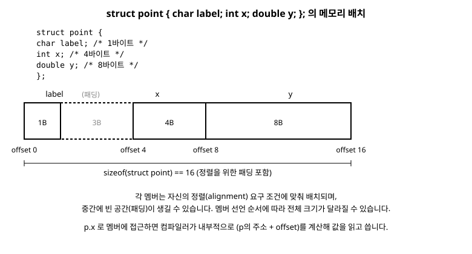

# 13장. 구조체, 공용체, 열거형

[◀ 이전: 12장. 포인터 응용](ch12-포인터응용.md) | [📖 목차](00-목차.md) | [다음: 14장. 동적 메모리 할당 ▶](ch14-동적메모리할당.md)

---

지금까지 다룬 자료형은 모두 "한 가지 종류의 값 하나"를 담는 그릇이었습니다. `int`는 정수 하나, `double`은 실수 하나, 배열은 같은 자료형의 값 여러 개를 담을 뿐입니다. 그런데 현실의 데이터는 그렇게 단순하지 않습니다. 예를 들어 "학생 한 명"을 표현하려면 이름(문자열), 학번(정수), 평균 점수(실수)처럼 서로 다른 자료형의 값들을 하나로 묶어야 합니다.

이번 장에서는 서로 다른 자료형의 데이터를 하나의 단위로 묶는 방법인 구조체(struct)를 배우고, 메모리를 절약하기 위해 여러 멤버가 공간을 공유하는 공용체(union), 그리고 이름이 있는 정수 상수 집합을 표현하는 열거형(enum)을 차례로 살펴봅니다. 구조체는 9장 배열에서 배운 "여러 값을 묶는다"는 개념을 한 단계 확장한 것이라 볼 수 있고, 11장 포인터 기초와 12장 포인터 응용에서 익힌 포인터 지식은 구조체를 실전에서 다룰 때 그대로 활용됩니다.

## 구조체란 무엇인가

구조체는 서로 다른 자료형의 변수들을 하나의 이름 아래 묶어 놓은 사용자 정의 자료형입니다. 배열이 "같은 종류의 상자를 나란히 늘어놓은 것"이라면, 구조체는 "서로 다른 종류의 상자를 한 묶음으로 포장한 것"에 가깝습니다.

학생 정보를 표현하는 구조체를 만들어 보겠습니다.

```c
#include <stdio.h>
#include <string.h>

struct student {
    char name[20];   /* 이름 */
    int id;          /* 학번 */
    double average;  /* 평균 점수 */
};

int main(void) {
    struct student s1;

    strcpy(s1.name, "김도윤");
    s1.id = 20260001;
    s1.average = 92.5;

    printf("이름: %s\n", s1.name);
    printf("학번: %d\n", s1.id);
    printf("평균: %.1f\n", s1.average);

    return 0;
}
```

`struct student { ... };`는 구조체의 "설계도"를 선언(declaration)하는 것일 뿐, 이 자체로는 메모리를 차지하지 않습니다. 실제로 메모리를 차지하는 것은 `struct student s1;`처럼 이 설계도를 바탕으로 변수를 정의(definition)할 때입니다. 이는 마치 붕어빵 틀(구조체 선언)과 실제로 구워낸 붕어빵(구조체 변수)의 관계와 비슷합니다. 틀은 하나지만 그 틀로 여러 개의 붕어빵을 만들 수 있는 것처럼, 구조체 선언 하나로 여러 개의 변수를 만들 수 있습니다.

멤버에 접근할 때는 마침표(`.`) 연산자를 사용합니다. `s1.name`, `s1.id`, `s1.average`처럼 "변수이름.멤버이름" 형태로 씁니다. 문자열 멤버인 `name`에 값을 넣을 때는 `=`를 바로 쓸 수 없고 10장 문자열에서 배운 `strcpy` 같은 함수를 사용해야 한다는 점에 주의하세요. `char` 배열은 대입 연산자로 직접 값을 바꿀 수 없기 때문입니다.

### 선언과 동시에 초기화하기

구조체 변수는 배열처럼 중괄호를 이용해 선언과 동시에 초기화할 수 있습니다.

```c
struct student s2 = {"이서연", 20260002, 88.0};

/* 멤버 이름을 지정하는 방식(C99 이후) - 순서를 몰라도 안전하게 초기화 가능 */
struct student s3 = {.name = "박지훈", .id = 20260003, .average = 95.5};
```

멤버 이름을 지정하는 두 번째 방식은 멤버 순서가 바뀌어도 코드가 깨지지 않는다는 장점이 있어, 멤버가 많은 구조체에서 특히 유용합니다.

## typedef로 별칭 만들기

`struct student` 처럼 매번 `struct` 키워드를 붙여 쓰는 것은 번거롭습니다. `typedef`를 사용하면 구조체에 짧은 별칭을 붙여 마치 `int`나 `double`처럼 사용할 수 있습니다.

```c
#include <stdio.h>

typedef struct {
    char name[20];
    int id;
    double average;
} Student;   /* 이제부터 Student 라는 이름으로 이 구조체를 사용 가능 */

int main(void) {
    Student s1 = {"최민준", 20260004, 90.0};

    printf("%s 학생의 평균은 %.1f점입니다.\n", s1.name, s1.average);

    return 0;
}
```

`typedef struct { ... } Student;` 구문에서는 구조체 자체의 이름(태그)을 생략했습니다. 태그와 typedef 별칭을 모두 붙이고 싶다면 다음처럼 작성합니다.

```c
typedef struct student {
    char name[20];
    int id;
    double average;
} Student;

/* 이제 struct student 와 Student 둘 다 같은 자료형을 가리킴 */
struct student a;
Student b;
```

관례적으로 typedef로 만든 별칭은 첫 글자를 대문자로 쓰는 경우가 많습니다(필수 규칙은 아닙니다). 이 책에서도 이후 예제에서 typedef를 적극 활용하겠습니다.

## 구조체 배열

같은 종류의 구조체 데이터를 여러 개 다루어야 한다면 구조체의 배열을 만들면 됩니다. 학생 여러 명의 정보를 관리하는 예제를 보겠습니다.

```c
#include <stdio.h>

typedef struct {
    char name[20];
    int id;
    double average;
} Student;

int main(void) {
    Student class_a[3] = {
        {"김도윤", 20260001, 92.5},
        {"이서연", 20260002, 88.0},
        {"박지훈", 20260003, 95.5}
    };
    double total = 0.0;

    for (int i = 0; i < 3; i++) {
        printf("%d번 %s: %.1f점\n", i + 1, class_a[i].name, class_a[i].average);
        total += class_a[i].average;
    }

    printf("반 평균: %.2f점\n", total / 3);

    return 0;
}
```

`class_a[i].average` 처럼 배열 인덱스로 구조체 하나를 고른 뒤, 마침표로 그 구조체의 멤버에 접근하는 형태입니다. 9장에서 배운 배열 인덱싱과 이번 장에서 배운 멤버 접근이 그대로 조합된 것뿐이라, 새로울 것은 없습니다.

## 구조체를 가리키는 포인터와 화살표 연산자

구조체도 변수이므로 당연히 주소를 가질 수 있고, 포인터로 가리킬 수 있습니다. 함수에 구조체를 넘길 때 구조체 전체를 복사하는 대신 포인터를 넘기면 큰 구조체를 복사하는 비용을 아낄 수 있어 실전에서 매우 자주 쓰이는 패턴입니다.

```c
#include <stdio.h>

typedef struct {
    char name[20];
    int id;
    double average;
} Student;

void print_student(const Student *p) {
    /* p는 Student 구조체를 가리키는 포인터 */
    printf("이름: %s, 학번: %d, 평균: %.1f\n", p->name, p->id, p->average);
}

void raise_average(Student *p, double bonus) {
    p->average += bonus;  /* 포인터를 통해 원본 구조체 값을 직접 수정 */
}

int main(void) {
    Student s1 = {"김도윤", 20260001, 92.5};

    print_student(&s1);
    raise_average(&s1, 2.0);
    print_student(&s1);

    return 0;
}
```

포인터가 가리키는 구조체의 멤버에 접근할 때는 화살표 연산자(`->`)를 사용합니다. `p->name`은 `(*p).name`과 완전히 같은 의미이지만, `*p.name`이라고 쓰면 `.` 연산자가 `*`보다 먼저 계산되어 전혀 다른 뜻이 되어 버리므로(그리고 대부분 컴파일 오류가 납니다) 반드시 괄호가 필요합니다. 이런 번거로움을 없애기 위해 C는 처음부터 `->`라는 전용 연산자를 제공합니다.

정리하면 다음 두 표현은 완전히 동일합니다.

```c
p->average    /* 화살표 연산자 - 실전에서 훨씬 많이 사용 */
(*p).average  /* 역참조 후 마침표 - 원리를 보여주는 표현 */
```

함수 매개변수에서 `const Student *p`처럼 `const`를 붙이면 "이 함수는 포인터가 가리키는 구조체의 내용을 바꾸지 않겠다"는 약속을 컴파일러에게 알리는 것이며, 실수로 값을 변경하는 코드를 작성하면 컴파일 오류로 미리 잡아낼 수 있습니다. 읽기만 하는 함수라면 이렇게 `const`를 붙이는 습관을 들이는 것이 좋습니다.

## 중첩 구조체

구조체의 멤버로 또 다른 구조체를 포함시킬 수도 있습니다. 이를 중첩 구조체라고 부르며, 현실 세계의 데이터를 계층적으로 표현할 때 유용합니다. 학생이 "주소"라는 별도의 정보 묶음을 갖는 경우를 생각해 보겠습니다.

```c
#include <stdio.h>

typedef struct {
    char city[20];
    char street[40];
} Address;

typedef struct {
    char name[20];
    int id;
    Address home;  /* 구조체 안에 또 다른 구조체를 멤버로 포함 */
} Student;

int main(void) {
    Student s1 = {"김도윤", 20260001, {"서울", "강남대로 100"}};

    printf("%s 학생은 %s %s에 삽니다.\n",
           s1.name, s1.home.city, s1.home.street);

    return 0;
}
```

멤버가 멤버를 갖는 형태이므로 `s1.home.city`처럼 마침표를 두 번 이어서 접근합니다. 만약 `Student`를 포인터로 다룬다면 `p->home.city`처럼 화살표와 마침표를 함께 사용하게 됩니다. 접근하려는 것이 포인터가 가리키는 대상인지, 이미 얻은 구조체 값인지에 따라 `->`와 `.`을 구분해서 사용한다고 기억하면 헷갈리지 않습니다.

## 구조체가 메모리에 배치되는 모습

구조체 변수를 정의하면 멤버들은 선언한 순서대로 메모리에 배치됩니다. 다만 항상 빈틈없이 딱 붙어 배치되는 것은 아닙니다. CPU는 특정 자료형을 특정 배수의 주소에서 읽을 때 더 빠르게 동작하는데, 이를 정렬(alignment)이라고 합니다. 컴파일러는 이 정렬 조건을 맞추기 위해 멤버 사이에 사용하지 않는 빈 공간, 즉 패딩(padding)을 끼워 넣기도 합니다.

다음 구조체를 예로 들어 보겠습니다.

```c
struct point {
    char label;   /* 1바이트 */
    int x;        /* 4바이트 */
    double y;     /* 8바이트 */
};

printf("%zu\n", sizeof(struct point));  /* 13이 아니라 16이 출력되는 경우가 많음 */
```

`char` 1바이트, `int` 4바이트, `double` 8바이트를 단순히 더하면 13바이트이지만, 실제로는 `int`가 4의 배수 주소에, `double`이 8의 배수 주소에 놓이도록 컴파일러가 빈 공간을 끼워 넣기 때문에 16바이트가 되는 경우가 흔합니다. 정확한 크기와 패딩 방식은 컴파일러와 플랫폼마다 다를 수 있으므로, 항상 `sizeof`로 직접 확인하는 습관을 들이는 것이 안전합니다.



이런 패딩 때문에 멤버를 선언하는 순서를 크기가 큰 자료형부터 작은 자료형 순으로 정리하면 전체 구조체 크기를 조금 더 절약할 수 있는 경우도 있습니다. 다만 이 책의 범위에서는 "구조체에는 정렬로 인한 패딩이 생길 수 있다"는 사실을 이해하는 것만으로 충분합니다.

## 공용체(union)

공용체는 구조체와 문법이 거의 똑같지만 근본적으로 다른 목적을 가진 자료형입니다. 구조체는 모든 멤버가 각자의 메모리 공간을 따로 가지지만, 공용체는 모든 멤버가 하나의 메모리 공간을 공유합니다. 즉, 한 번에 오직 하나의 멤버만 유효한 값을 가질 수 있습니다.

```c
#include <stdio.h>

union value {
    int i;
    double d;
    char c[8];
};

int main(void) {
    union value v;

    v.i = 65;
    printf("정수로 사용: %d\n", v.i);

    v.d = 3.14;
    printf("실수로 사용: %.2f\n", v.d);

    /* 이 시점에서 v.i 는 더 이상 65가 아니다! d에 값을 쓰는 순간 공유하던 메모리가 덮어써졌다 */
    printf("이제 v.i 를 읽으면 쓰레기 값: %d\n", v.i);

    printf("공용체 전체 크기: %zu바이트\n", sizeof(union value));

    return 0;
}
```

`union value`의 세 멤버 `i`, `d`, `c`는 각자 다른 자료형이지만, 메모리상에서는 같은 자리를 공유합니다. `sizeof(union value)`는 멤버 크기의 합이 아니라, 가장 큰 멤버(위 예제에서는 8바이트인 `d`와 `c`)의 크기와 같습니다. `v.d`에 값을 저장하는 순간 이전에 저장했던 `v.i`의 값은 의미를 잃습니다.

### 구조체와 공용체의 차이 요약

| 구분 | 구조체(struct) | 공용체(union) |
|---|---|---|
| 메모리 | 멤버마다 독립된 공간 | 모든 멤버가 공간을 공유 |
| 크기 | 멤버 크기의 합 이상(패딩 포함) | 가장 큰 멤버의 크기 |
| 동시 사용 | 모든 멤버를 동시에 사용 가능 | 한 번에 하나의 멤버만 유효 |
| 용도 | 서로 다른 데이터를 한 묶음으로 관리 | 메모리를 절약하며 여러 해석 방식 중 하나를 선택 |

공용체는 메모리가 극도로 제한된 임베디드 환경에서, 혹은 "이 값은 상황에 따라 정수로도, 실수로도 해석될 수 있다"는 식으로 하나의 데이터를 여러 형태로 다뤄야 할 때 사용합니다. 실무에서는 흔히 태그(구분자) 역할을 하는 멤버와 공용체를 짝지어 사용합니다.

```c
#include <stdio.h>

typedef enum { TYPE_INT, TYPE_DOUBLE } ValueType;

typedef struct {
    ValueType type;  /* 지금 어떤 멤버가 유효한지 알려주는 태그 */
    union {
        int i;
        double d;
    } data;
} TaggedValue;

void print_value(TaggedValue v) {
    if (v.type == TYPE_INT) {
        printf("정수 값: %d\n", v.data.i);
    } else {
        printf("실수 값: %.2f\n", v.data.d);
    }
}

int main(void) {
    TaggedValue a = {TYPE_INT, {.i = 10}};
    TaggedValue b = {TYPE_DOUBLE, {.d = 3.5}};

    print_value(a);
    print_value(b);

    return 0;
}
```

이렇게 `type` 같은 태그 멤버로 "지금 공용체 안에 어떤 값이 들어있는지"를 표시해 두면, 공용체를 안전하게 사용할 수 있습니다. 이 패턴은 태그된 공용체(tagged union)라고 부르며 여러 실무 코드에서 흔히 볼 수 있습니다.

## 열거형(enum)

프로그램에는 "요일", "신호등 색", "메뉴 상태"처럼 정해진 몇 가지 값 중 하나만 가지는 데이터가 자주 등장합니다. 이럴 때 단순히 0, 1, 2 같은 정수를 사용하면 코드를 읽는 사람이 "2는 무슨 뜻이지?"라고 헷갈리기 쉽습니다. 열거형은 이런 정수 값들에 의미 있는 이름을 붙여주는 자료형입니다.

```c
#include <stdio.h>

enum weekday { MON, TUE, WED, THU, FRI, SAT, SUN };

int main(void) {
    enum weekday today = WED;

    if (today == SAT || today == SUN) {
        printf("주말입니다.\n");
    } else {
        printf("평일입니다. (코드 값: %d)\n", today);
    }

    return 0;
}
```

`enum weekday`는 `MON`부터 `SUN`까지 7개의 이름 있는 정수 상수를 정의합니다. 특별히 값을 지정하지 않으면 첫 번째 이름부터 0, 1, 2, ... 순서로 자동 부여됩니다. 위 예제에서 `WED`는 2에 해당하므로 `today == WED`는 `today == 2`와 같은 뜻이지만, 코드에는 `WED`라는 이름이 그대로 드러나기 때문에 훨씬 읽기 쉽습니다.

특정 값을 직접 지정할 수도 있고, 이후 이름들은 지정된 값에서 이어서 자동으로 증가합니다.

```c
enum http_status {
    OK = 200,
    NOT_FOUND = 404,
    SERVER_ERROR = 500
};

enum color {
    RED,    /* 0 */
    GREEN,  /* 1 */
    BLUE = 10,
    YELLOW  /* 11, BLUE 다음 값으로 자동 증가 */
};
```

typedef와 함께 사용하면 구조체와 마찬가지로 `enum` 키워드 없이 짧게 사용할 수 있습니다.

```c
#include <stdio.h>

typedef enum { OFF, ON } Switch;

void print_state(Switch s) {
    printf("스위치 상태: %s\n", s == ON ? "켜짐" : "꺼짐");
}

int main(void) {
    Switch lamp = ON;
    print_state(lamp);
    return 0;
}
```

주의할 점은 열거형 값이 결국 내부적으로는 정수라는 사실입니다. `printf`로 열거형 값을 출력할 때는 문자열 이름이 자동으로 나오는 것이 아니라 정수 값이 출력됩니다. 이름 자체를 문자열로 출력하고 싶다면, 위 `print_state` 예제처럼 직접 조건문이나 배열을 이용해 정수 값을 문자열로 변환해 주는 코드를 작성해야 합니다. 또한 C 컴파일러는 대부분 열거형에 범위를 벗어난 정수를 대입해도 엄격하게 막지 않으므로, 열거형이 "완전히 안전한" 자료형은 아니라는 점도 기억해 두면 좋습니다.

## 요약

- 구조체(struct)는 서로 다른 자료형의 값들을 하나의 이름으로 묶은 사용자 정의 자료형이며, 멤버는 마침표(`.`) 연산자로 접근한다.
- `typedef`를 사용하면 `struct 태그이름` 대신 짧은 별칭으로 구조체를 사용할 수 있다.
- 구조체는 배열의 원소가 될 수 있고(`Student list[10]`), 다른 구조체의 멤버로 중첩될 수도 있다.
- 구조체를 가리키는 포인터의 멤버에 접근할 때는 화살표 연산자(`->`)를 사용하며, `p->m`은 `(*p).m`과 같다.
- 구조체 멤버 사이에는 정렬(alignment) 조건 때문에 패딩(padding)이 생길 수 있어, `sizeof`로 계산한 구조체 크기가 멤버 크기의 단순 합과 다를 수 있다.
- 공용체(union)는 모든 멤버가 같은 메모리 공간을 공유하며, 한 번에 하나의 멤버만 유효한 값을 가진다. 크기는 가장 큰 멤버의 크기와 같다.
- 공용체를 안전하게 쓰려면 지금 어떤 멤버가 유효한지 알려주는 태그(구분자) 멤버와 함께 사용하는 것이 좋다.
- 열거형(enum)은 이름 있는 정수 상수들의 집합으로, 코드의 가독성을 높여준다. 값을 지정하지 않으면 0부터 자동으로 증가한다.

## 연습문제

1. 이름(`char name[30]`), 가격(`int price`), 재고 수량(`int stock`)을 멤버로 갖는 `Product` 구조체를 typedef로 정의하고, 구조체 배열에 상품 3개를 저장한 뒤 전체 재고 가치(가격 × 수량의 합)를 계산해 출력하는 프로그램을 작성하세요.

2. `struct rectangle { double width; double height; };`을 정의하고, 이 구조체를 포인터로 받아 넓이를 반환하는 함수 `double area(const struct rectangle *r)`을 작성하세요. 화살표 연산자를 사용해야 합니다.

3. `struct book { char title[50]; struct { char first[20]; char last[20]; } author; };`처럼 저자 이름을 중첩 구조체로 표현하고, 책 정보를 초기화한 뒤 "저자 성 저자 이름 - 제목" 형식으로 출력하는 프로그램을 작성하세요.

4. 정수, 실수, 문자를 저장할 수 있는 공용체와 이를 구분하는 열거형 태그(`TYPE_INT`, `TYPE_DOUBLE`, `TYPE_CHAR`)를 이용해 태그된 공용체 구조체를 만들고, 세 종류의 값을 각각 저장한 변수들을 배열에 담아 순서대로 출력하는 프로그램을 작성하세요.

5. `enum season { SPRING, SUMMER, FALL, WINTER };`을 정의하고, 정수를 입력받아 해당하는 계절 이름을 문자열로 출력하는 함수를 작성하세요. 범위를 벗어난 값이 입력되면 "알 수 없는 계절"을 출력하도록 처리하세요.

---

[◀ 이전: 12장. 포인터 응용](ch12-포인터응용.md) | [📖 목차](00-목차.md) | [다음: 14장. 동적 메모리 할당 ▶](ch14-동적메모리할당.md)
