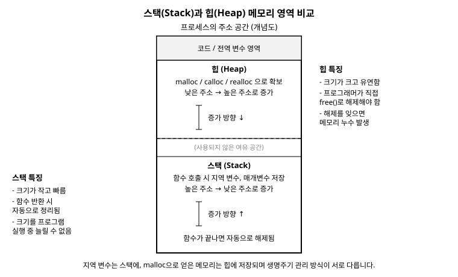

# 14장. 동적 메모리 할당

[◀ 이전: 13장. 구조체, 공용체, 열거형](ch13-구조체와공용체.md) | [📖 목차](00-목차.md) | [다음: 15장. 파일 입출력 ▶](ch15-파일입출력.md)

---

지금까지 작성한 프로그램에서 배열의 크기는 항상 컴파일 시점에 미리 정해져 있었습니다. `int scores[10];`이라고 쓰면 그 배열은 프로그램이 끝날 때까지 항상 10개짜리로 고정됩니다. 그런데 실제 프로그램에서는 "사용자가 입력할 데이터 개수를 미리 알 수 없는" 상황이 훨씬 더 흔합니다. 학생이 몇 명인지, 파일에 줄이 몇 개인지는 프로그램을 실행해 봐야 알 수 있습니다.

이번 장에서는 프로그램이 실행되는 도중에 필요한 만큼 메모리를 요청하고, 다 쓰고 나면 반납하는 동적 메모리 할당(dynamic memory allocation)을 다룹니다. 이는 11장 포인터 기초와 12장 포인터 응용에서 배운 포인터 지식이 실전에서 가장 빛을 발하는 주제이며, 13장 구조체와 공용체에서 만든 구조체를 활용해 유연한 데이터 구조를 만드는 방법도 함께 살펴봅니다.

## 스택과 힙: 두 종류의 메모리 영역

C 프로그램이 사용하는 메모리는 크게 몇 개의 영역으로 나뉘는데, 그중 지금 우리에게 중요한 것은 스택(stack)과 힙(heap) 두 영역입니다.

스택은 함수를 호출할 때마다 자동으로 마련되는 메모리 영역입니다. 함수 안에서 선언한 지역 변수, 매개변수는 모두 스택에 놓입니다. 함수가 끝나고 반환하면 그 함수가 사용하던 스택 공간은 자동으로 정리됩니다. 마치 접시를 쌓아 올리듯(스택이라는 이름 그대로) 함수를 호출할 때 공간이 쌓이고, 함수가 끝나면 위에서부터 자동으로 치워지는 구조입니다. 빠르고 편리하지만, 크기가 제한되어 있고 함수가 끝나는 순간 그 안의 데이터도 함께 사라진다는 한계가 있습니다.

힙은 이와 달리 프로그래머가 직접 "이만큼의 메모리를 달라"고 요청하고, 다 쓴 다음에는 "이제 반납하겠다"고 명시적으로 알려주어야 하는 영역입니다. 함수가 끝나도 힙에 할당한 메모리는 자동으로 사라지지 않으며, 명시적으로 반납하기 전까지 계속 유지됩니다. 그만큼 유연하지만, 관리 책임이 전적으로 프로그래머에게 있다는 점이 스택과의 가장 큰 차이입니다.



이번 장에서 배울 `malloc`, `calloc`, `realloc`, `free` 함수는 모두 이 힙 영역을 다루는 도구입니다.

## malloc: 메모리 요청하기

`malloc` 함수는 지정한 바이트 수만큼 힙에서 메모리를 확보하고, 그 메모리의 시작 주소를 반환합니다. 사용하려면 `<stdlib.h>` 헤더 파일을 포함해야 합니다.

```c
#include <stdio.h>
#include <stdlib.h>

int main(void) {
    int *p = (int *)malloc(sizeof(int));  /* int 하나가 들어갈 공간 요청 */

    if (p == NULL) {
        /* 메모리 확보에 실패하면 malloc은 NULL을 반환한다 */
        printf("메모리 할당 실패\n");
        return 1;
    }

    *p = 42;
    printf("*p = %d\n", *p);

    free(p);  /* 다 사용한 메모리는 반드시 반납 */

    return 0;
}
```

몇 가지 중요한 규칙을 짚어보겠습니다.

첫째, `malloc`은 항상 "몇 바이트"를 인자로 받습니다. `sizeof(int)`처럼 `sizeof` 연산자를 사용해 정확한 바이트 수를 구하는 것이 안전합니다. `int`가 항상 4바이트라고 가정하고 `malloc(4)`처럼 숫자를 직접 쓰는 습관은 플랫폼이 바뀌면 오류의 원인이 되므로 피해야 합니다.

둘째, `malloc`의 반환형은 `void *`입니다. `void *`는 "자료형이 정해지지 않은 포인터"를 의미하며, 이를 사용하려는 자료형의 포인터로 캐스팅(형 변환)해 주는 것이 관례입니다. 위 예제의 `(int *)malloc(...)`이 그 예입니다. C 표준에서는 사실 이 캐스팅이 없어도 컴파일되지만(C++과 다른 점입니다), 코드를 읽는 사람에게 "이 메모리를 무엇으로 쓸 것인지" 명확히 보여주고, C++ 코드와 섞어 쓸 때도 문제가 없도록 캐스팅을 붙이는 것이 좋은 습관입니다.

셋째, `malloc`은 메모리를 확보하지 못하면(예를 들어 시스템에 남은 메모리가 없으면) `NULL`을 반환합니다. 반환된 포인터를 사용하기 전에는 항상 `NULL`인지 검사하는 것이 안전한 코드의 기본입니다. `NULL`을 검사하지 않고 바로 `*p = 42;`처럼 역참조하면, 프로그램이 예기치 않게 종료(크래시)될 수 있습니다.

넷째, 다 사용한 메모리는 `free` 함수로 반드시 반납해야 합니다. 이 부분은 뒤에서 더 자세히 다루겠습니다.

## calloc: 0으로 초기화된 메모리

`calloc`은 `malloc`과 비슷하지만 두 가지 차이가 있습니다. 인자를 "개수"와 "원소 하나의 크기" 두 개로 나누어 받고, 확보한 메모리를 전부 0으로 초기화해 준다는 점입니다.

```c
#include <stdio.h>
#include <stdlib.h>

int main(void) {
    int n = 5;
    int *arr = (int *)calloc(n, sizeof(int));  /* int 5개 크기, 전부 0으로 초기화됨 */

    if (arr == NULL) {
        printf("메모리 할당 실패\n");
        return 1;
    }

    for (int i = 0; i < n; i++) {
        printf("arr[%d] = %d\n", i, arr[i]);  /* 모두 0 출력 */
    }

    free(arr);
    return 0;
}
```

`malloc(n * sizeof(int))`으로도 같은 크기의 메모리를 확보할 수 있지만, 그 값은 이전에 그 메모리를 사용하던 프로그램이 남긴 쓰레기 값으로 채워져 있어 예측할 수 없습니다. 배열을 0으로 시작하고 싶다면 `calloc`을 쓰는 것이 `malloc` 후 직접 반복문으로 0을 채우는 것보다 간결하고, 대체로 더 효율적입니다.

## realloc: 크기 다시 조정하기

이미 할당된 메모리의 크기를 늘리거나 줄이고 싶을 때는 `realloc`을 사용합니다. 동적 배열을 구현할 때 "처음엔 작게 시작했다가 데이터가 늘어나면 공간을 키운다"는 패턴에 자주 쓰입니다.

```c
#include <stdio.h>
#include <stdlib.h>

int main(void) {
    int capacity = 2;
    int *arr = (int *)malloc(capacity * sizeof(int));

    if (arr == NULL) {
        return 1;
    }

    arr[0] = 10;
    arr[1] = 20;

    /* 공간이 부족해져서 크기를 4개로 늘리고 싶다 */
    capacity = 4;
    int *temp = (int *)realloc(arr, capacity * sizeof(int));

    if (temp == NULL) {
        /* realloc 실패 시 원래의 arr는 그대로 유효하다. 실패했다고 arr를 잃으면 안 된다 */
        printf("메모리 확장 실패\n");
        free(arr);
        return 1;
    }
    arr = temp;  /* 성공했을 때만 arr를 새 주소로 갱신 */

    arr[2] = 30;
    arr[3] = 40;

    for (int i = 0; i < capacity; i++) {
        printf("arr[%d] = %d\n", i, arr[i]);
    }

    free(arr);
    return 0;
}
```

여기서 매우 중요한 관용구가 등장합니다. `arr = realloc(arr, ...)`처럼 바로 원래 변수에 결과를 대입하면 안 됩니다. `realloc`이 실패해서 `NULL`을 반환하면, 원래 `arr`가 가리키던 메모리 주소를 잃어버려 그 메모리를 반납할 방법이 없어지기 때문입니다(이런 상황을 메모리 누수라고 부르며 바로 다음 절에서 다룹니다). 그래서 위 예제처럼 항상 `temp`라는 별도의 변수로 결과를 받아 `NULL` 여부를 확인한 뒤, 성공했을 때만 `arr`에 대입하는 것이 안전한 방법입니다.

`realloc`은 내부적으로 기존 메모리 바로 뒤에 공간이 있으면 그 자리에서 확장하고, 공간이 부족하면 다른 위치에 새 메모리를 확보한 뒤 기존 내용을 복사하고 원래 메모리를 반납합니다. 이 과정은 모두 `realloc` 내부에서 자동으로 처리되므로, 우리는 반환된 새 주소만 잘 챙기면 됩니다.

## free: 메모리 반납하기

`malloc`, `calloc`, `realloc`으로 확보한 메모리는 다 사용한 뒤 반드시 `free` 함수로 반납해야 합니다. 스택의 지역 변수와 달리, 힙의 메모리는 프로그래머가 명시적으로 반납하기 전까지는 계속 남아있기 때문입니다.

```c
int *p = (int *)malloc(sizeof(int));
*p = 100;
/* ... p를 사용하는 코드 ... */
free(p);   /* 사용이 끝났으면 반납 */
```

`free`를 호출한다고 해서 포인터 변수 `p` 자체가 사라지는 것은 아닙니다. `p`가 가리키던 메모리를 시스템에 돌려줄 뿐, `p`라는 변수와 그 안에 든 주소값은 그대로 남아 있습니다. 이 때문에 다음 절에서 다룰 위험한 실수들이 생겨납니다.

## 흔한 실수 세 가지

동적 메모리 할당은 강력한 만큼 실수하기도 쉽습니다. 초보자가 특히 자주 저지르는 세 가지 실수를 살펴보겠습니다.

### 메모리 누수(memory leak)

할당받은 메모리를 반납하지 않고 그 메모리를 가리키던 유일한 포인터마저 잃어버리면, 그 메모리는 프로그램이 종료될 때까지 다시는 사용할 수도, 반납할 수도 없는 상태가 됩니다. 이를 메모리 누수라고 합니다.

```c
void leaky_function(void) {
    int *p = (int *)malloc(100 * sizeof(int));
    *p = 1;
    /* free(p)를 호출하지 않고 함수가 끝난다 */
    /* p는 지역 변수이므로 스택에서 사라지지만, p가 가리키던 힙 메모리는 그대로 남는다 */
}   /* <- 여기서 함수가 끝나면 이 100개의 int 공간은 영원히 누수된다 */

int main(void) {
    for (int i = 0; i < 1000; i++) {
        leaky_function();  /* 호출할 때마다 조금씩 메모리가 새어 나간다 */
    }
    return 0;
}
```

이런 짧은 프로그램에서는 큰 문제가 없어 보일 수 있지만, 오래 실행되는 서버 프로그램에서 이런 누수가 반복되면 결국 시스템의 메모리가 고갈되어 프로그램이 멈추거나 시스템 전체가 느려질 수 있습니다. "malloc을 호출했다면, 그 메모리를 반납할 코드도 함께 생각한다"는 습관이 중요합니다.

### 이중 해제(double free)

이미 반납한 메모리를 실수로 한 번 더 `free`하면 프로그램이 예측할 수 없는 방식으로 동작하거나 비정상 종료됩니다.

```c
int *p = (int *)malloc(sizeof(int));
*p = 5;
free(p);
/* ... 다른 코드 ... */
free(p);  /* 위험! 이미 반납한 메모리를 또 반납하려고 시도 */
```

이 문제를 예방하는 간단한 관용구는, `free`를 호출한 직후 포인터에 `NULL`을 대입해 두는 것입니다.

```c
free(p);
p = NULL;   /* p가 더 이상 유효한 메모리를 가리키지 않음을 명시 */

/* 이후 실수로 free(p)를 다시 호출해도 free(NULL)은 아무 일도 하지 않으므로 안전하다 */
free(p);
```

C 표준은 `free(NULL)`을 호출해도 아무 동작도 하지 않고 안전하게 무시하도록 정의하고 있으므로, 이 관용구는 실전에서 매우 유용합니다.

### 댕글링 포인터(dangling pointer)

메모리를 반납한 뒤에도 그 주소를 가리키던 포인터를 계속 사용하면, 이미 반납되어 다른 용도로 재사용될 수 있는 메모리에 접근하게 됩니다. 이런 포인터를 댕글링 포인터(dangling pointer, "매달린 포인터")라고 부릅니다.

```c
int *p = (int *)malloc(sizeof(int));
*p = 10;
free(p);

printf("%d\n", *p);  /* 위험! p는 이미 반납된 메모리를 가리키는 댕글링 포인터 */
*p = 20;              /* 더 위험! 반납된 메모리에 값을 쓰려는 시도 */
```

`free(p)`를 호출해도 `p`에 저장된 주소값 자체는 바뀌지 않기 때문에, 아무런 경고 없이 컴파일되고 어쩌면 우연히 실행도 될 수 있습니다. 하지만 그 메모리는 이미 시스템에 반납되어 언제든 다른 목적으로 재사용될 수 있는 상태이므로, 그 값을 읽거나 쓰는 것은 정의되지 않은 동작(undefined behavior)입니다. 이 실수 역시 `free` 직후 `p = NULL;`을 대입해 두면, 이후 실수로 `*p`를 사용하려는 순간 프로그램이 즉시 멈추어(NULL 포인터 역참조는 대부분의 시스템에서 바로 감지되는 오류이므로) 문제를 훨씬 빨리 발견할 수 있습니다.

세 가지 실수를 표로 정리하면 다음과 같습니다.

| 실수 | 원인 | 예방법 |
|---|---|---|
| 메모리 누수 | free를 호출하지 않고 포인터를 잃어버림 | malloc과 free를 항상 짝지어 생각하기 |
| 이중 해제 | 같은 메모리를 두 번 반납 | free 직후 포인터에 NULL 대입 |
| 댕글링 포인터 | 반납된 메모리를 계속 참조 | free 직후 포인터에 NULL 대입 |

## 동적 배열 만들기

컴파일 시점에는 배열 크기를 알 수 없고, 실행 중 사용자 입력에 따라 크기가 정해지는 경우 동적 메모리 할당이 꼭 필요합니다.

```c
#include <stdio.h>
#include <stdlib.h>

int main(void) {
    int n;
    printf("성적을 몇 명 입력하시겠습니까? ");
    scanf("%d", &n);

    int *scores = (int *)malloc(n * sizeof(int));
    if (scores == NULL) {
        printf("메모리 할당 실패\n");
        return 1;
    }

    for (int i = 0; i < n; i++) {
        printf("%d번째 학생 성적: ", i + 1);
        scanf("%d", &scores[i]);
    }

    int sum = 0;
    for (int i = 0; i < n; i++) {
        sum += scores[i];
    }
    printf("평균: %.2f\n", (double)sum / n);

    free(scores);  /* 사용이 끝났으므로 반납 */
    return 0;
}
```

`scores`는 일반 배열처럼 `scores[i]`로 인덱싱해 사용할 수 있습니다. 9장 배열에서 배웠던 것처럼, 배열 이름은 곧 첫 원소를 가리키는 포인터로 다루어지기 때문에 `malloc`으로 받은 포인터도 똑같은 방식으로 인덱싱할 수 있는 것입니다. 이 프로그램에서 `n`은 실행하기 전까지 알 수 없는 값이지만, `malloc`을 사용했기 때문에 그 크기에 정확히 맞는 배열을 실행 중에 만들어낼 수 있습니다.

## 구조체를 동적으로 할당하기

13장 구조체와 공용체에서 만든 구조체도 동적으로 할당할 수 있습니다. 구조체 하나를 할당할 수도 있고, 구조체의 배열을 통째로 할당할 수도 있습니다.

```c
#include <stdio.h>
#include <stdlib.h>
#include <string.h>

typedef struct {
    char name[20];
    int id;
    double average;
} Student;

Student *create_student(const char *name, int id, double average) {
    Student *p = (Student *)malloc(sizeof(Student));  /* 구조체 하나 크기만큼 할당 */

    if (p == NULL) {
        return NULL;
    }

    strcpy(p->name, name);
    p->id = id;
    p->average = average;

    return p;  /* 힙에 만든 구조체를 가리키는 포인터를 반환 */
}

int main(void) {
    int n = 3;
    /* Student 구조체 n개가 들어갈 배열을 힙에 할당 */
    Student *class_a = (Student *)malloc(n * sizeof(Student));

    if (class_a == NULL) {
        return 1;
    }

    strcpy(class_a[0].name, "김도윤"); class_a[0].id = 1; class_a[0].average = 92.5;
    strcpy(class_a[1].name, "이서연"); class_a[1].id = 2; class_a[1].average = 88.0;
    strcpy(class_a[2].name, "박지훈"); class_a[2].id = 3; class_a[2].average = 95.5;

    for (int i = 0; i < n; i++) {
        printf("%s (%d번): %.1f점\n", class_a[i].name, class_a[i].id, class_a[i].average);
    }
    free(class_a);

    /* 개별 구조체를 힙에 만들어 반환하는 함수 사용 예 */
    Student *one = create_student("최민준", 4, 90.0);
    if (one != NULL) {
        printf("%s (%d번): %.1f점\n", one->name, one->id, one->average);
        free(one);   /* create_student 안에서 malloc했으므로 사용이 끝나면 여기서 반납 */
        one = NULL;
    }

    return 0;
}
```

`create_student` 함수처럼 함수 내부에서 `malloc`으로 만든 데이터를 포인터로 반환하는 패턴은 실무에서 매우 자주 등장합니다. 이때 중요한 규칙은 "그 메모리를 반납할 책임은 호출한 쪽(`main`)에 있다"는 점입니다. 함수가 힙 메모리를 만들어 반환한다면, 그 메모리를 어떻게 반납해야 하는지 함수의 이름이나 주석으로 분명히 알려주는 것이 좋은 설계입니다.

또한 `Student` 구조체 안에 `char name[20]`처럼 고정 크기 배열이 아니라 만약 `char *name` 포인터를 멤버로 사용했다면, 구조체 자체를 `free`할 때 그 안의 `name`이 가리키는 메모리도 별도로 `free`해 주어야 한다는 점에 유의해야 합니다. 이런 경우를 "얕은 해제"와 "깊은 해제"의 차이라고도 부르는데, 구조체 안에 포인터 멤버가 있다면 그 포인터가 가리키는 메모리까지 챙겨서 반납해야 누수를 막을 수 있습니다.

## 요약

- 스택은 함수 호출 시 자동으로 관리되는 메모리 영역이고, 힙은 프로그래머가 직접 요청하고 반납해야 하는 메모리 영역이다.
- `malloc(바이트수)`는 초기화되지 않은 메모리를, `calloc(개수, 원소크기)`는 0으로 초기화된 메모리를 확보하며, 둘 다 실패 시 `NULL`을 반환한다.
- `malloc`의 반환형은 `void *`이므로 사용할 자료형의 포인터로 캐스팅해서 받는 것이 관례이며, 반환값은 항상 `NULL` 검사를 거쳐야 한다.
- `realloc(포인터, 새크기)`는 기존 메모리의 크기를 조정하며, 실패에 대비해 반드시 별도의 임시 변수로 결과를 받아 확인한 뒤 원래 변수에 대입해야 한다.
- 확보한 메모리는 `free(포인터)`로 반드시 반납해야 하며, 반납 직후 포인터에 `NULL`을 대입하면 이중 해제와 댕글링 포인터를 예방할 수 있다.
- 메모리 누수(반납하지 않음), 이중 해제(두 번 반납), 댕글링 포인터(반납된 메모리 계속 사용)는 동적 메모리 할당에서 가장 흔한 세 가지 실수이다.
- 배열뿐 아니라 구조체도 `malloc`으로 동적으로 만들 수 있으며, 함수가 힙 메모리를 만들어 반환하는 경우 그 반납 책임을 호출자가 명확히 알 수 있도록 설계해야 한다.

## 연습문제

1. 사용자로부터 정수 개수 `n`을 입력받아 `malloc`으로 `int` 배열을 동적으로 할당하고, `n`개의 정수를 입력받아 최댓값과 최솟값을 출력한 뒤 메모리를 반납하는 프로그램을 작성하세요.

2. 처음에 크기 2로 `malloc`한 정수 배열을 만들고, 사용자가 값을 입력할 때마다 배열에 추가하되 배열이 가득 차면 `realloc`으로 크기를 두 배로 늘리는 프로그램을 작성하세요. (입력이 -1이면 종료)

3. 다음 코드에 어떤 문제가 있는지 찾아 설명하고 올바르게 고치세요.

```c
int *p = (int *)malloc(sizeof(int));
*p = 10;
free(p);
free(p);
printf("%d\n", *p);
```

4. 13장에서 만든 `Student` 구조체(이름, 학번, 평균)를 동적 배열로 `n`명만큼 할당하고, 이름과 학번, 평균을 각각 입력받아 저장한 뒤 평균이 가장 높은 학생을 찾아 출력하는 프로그램을 작성하세요. 프로그램이 끝나기 전에 할당한 메모리를 반납하는 것도 잊지 마세요.

5. 정수 하나를 담을 공간을 힙에 할당해서 그 주소를 반환하는 함수 `int *make_int(int value)`를 작성하고, `main`에서 이 함수를 호출해 값을 출력한 뒤 올바르게 메모리를 반납하는 프로그램을 작성하세요. 이 함수가 반환한 포인터를 호출자가 반납하지 않으면 어떤 문제가 생기는지 주석으로 설명하세요.

---

[◀ 이전: 13장. 구조체, 공용체, 열거형](ch13-구조체와공용체.md) | [📖 목차](00-목차.md) | [다음: 15장. 파일 입출력 ▶](ch15-파일입출력.md)
