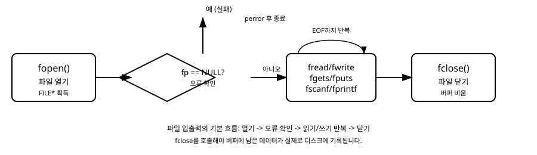

# 15장. 파일 입출력

[◀ 이전: 14장. 동적 메모리 할당](ch14-동적메모리할당.md) | [📖 목차](00-목차.md) | [다음: 16장. 전처리기와 매크로 ▶](ch16-전처리기와매크로.md)

---

지금까지 작성한 프로그램들은 실행이 끝나면 결과가 화면에만 남고 사라졌습니다. 하지만 실제 프로그램은 대부분 데이터를 파일에 저장했다가 나중에 다시 읽어 오는 작업을 합니다. 설정 파일을 읽고, 로그를 남기고, 데이터를 저장하는 모든 작업의 바탕에는 파일 입출력이 있습니다. 이번 장에서는 C 언어의 표준 라이브러리가 제공하는 파일 입출력 함수들을 배우고, 텍스트 파일과 바이너리 파일을 다루는 방법을 익힙니다.

## FILE 포인터란 무엇인가

C 언어에서 파일을 다룰 때는 운영체제가 관리하는 파일을 직접 조작하지 않습니다. 대신 `<stdio.h>` 헤더 파일에 정의된 `FILE`이라는 구조체 타입을 통해 간접적으로 접근합니다. `FILE` 구조체 내부에는 파일의 현재 읽기/쓰기 위치, 버퍼 상태, 오류 여부 등이 들어 있지만, 우리는 그 내부 구조를 직접 들여다볼 필요가 없습니다. 표준 라이브러리 함수들이 이 구조체를 통해 파일을 안전하게 다루도록 설계되어 있기 때문입니다.

파일을 다루는 기본적인 흐름은 다음과 같습니다.

1. `fopen`으로 파일을 열어 `FILE` 포인터를 얻는다.
2. 반환된 포인터가 `NULL`이 아닌지 확인한다.
3. `fprintf`, `fscanf`, `fread`, `fwrite` 등으로 읽거나 쓴다.
4. 작업이 끝나면 `fclose`로 파일을 닫는다.

이 흐름을 그림으로 나타내면 다음과 같습니다.



여기서 3번을 건너뛰고 싶은 유혹이 들 수도 있지만, `fclose`를 호출하지 않으면 버퍼에 남아 있는 데이터가 실제 디스크에 기록되지 않을 수 있습니다. 프로그램이 정상 종료되면 운영체제가 열린 파일을 정리해 주기는 하지만, 이는 프로그래머가 책임져야 할 부분을 운영체제에 떠넘기는 것이므로 좋은 습관이 아닙니다.

## fopen과 fclose

파일을 여는 함수는 `fopen`입니다.

```c
FILE *fopen(const char *filename, const char *mode);
```

첫 번째 인자는 파일 경로, 두 번째 인자는 파일을 여는 방식을 나타내는 모드 문자열입니다. 성공하면 `FILE` 포인터를 반환하고, 실패하면 `NULL`을 반환합니다. 파일이 존재하지 않거나, 접근 권한이 없거나, 디스크 공간이 부족한 경우 등 다양한 이유로 실패할 수 있습니다.

자주 사용하는 모드는 다음과 같습니다.

| 모드 | 의미 |
|------|------|
| `"r"` | 읽기 전용으로 연다. 파일이 없으면 실패한다. |
| `"w"` | 쓰기 전용으로 연다. 파일이 있으면 내용을 지우고, 없으면 새로 만든다. |
| `"a"` | 이어쓰기(append) 모드로 연다. 파일 끝에 내용을 추가하며, 없으면 새로 만든다. |
| `"r+"` | 읽기와 쓰기를 모두 허용하며, 파일이 없으면 실패한다. |
| `"w+"` | 읽기와 쓰기를 모두 허용하며, 기존 내용을 지운다. |
| `"a+"` | 읽기와 이어쓰기를 모두 허용한다. |

모드 문자열 뒤에 `b`를 붙이면(`"rb"`, `"wb"`, `"ab"` 등) 바이너리 모드로 파일을 엽니다. 텍스트 모드와 바이너리 모드의 차이는 뒤에서 다시 설명합니다.

파일을 다 사용한 뒤에는 반드시 `fclose`로 닫아야 합니다.

```c
int fclose(FILE *stream);
```

`fclose`는 버퍼에 남아 있는 데이터를 디스크에 기록(flush)한 뒤 파일과 연결된 자원을 해제합니다. 성공하면 0을, 실패하면 `EOF`를 반환합니다.

다음은 파일을 열고 바로 닫기만 하는 가장 간단한 예제입니다.

```c
#include <stdio.h>

int main(void)
{
    FILE *fp = fopen("greeting.txt", "w");

    if (fp == NULL) {
        // 파일 열기에 실패한 경우 오류 메시지를 출력하고 종료한다.
        perror("파일을 열 수 없습니다");
        return 1;
    }

    fprintf(fp, "안녕하세요, C 언어!\n");

    fclose(fp);

    return 0;
}
```

`perror` 함수는 인자로 넘긴 문자열 뒤에 콜론을 붙이고, 시스템이 기록해 둔 마지막 오류 원인(예: "No such file or directory")을 이어서 출력해 줍니다. 파일 관련 오류를 디버깅할 때 매우 유용하므로 잘 기억해 두기 바랍니다.

## 텍스트 파일 쓰기: fprintf와 fputs

텍스트 파일에 데이터를 쓸 때 가장 익숙한 도구는 `fprintf`입니다. 5장 입출력 기초에서 배운 `printf`와 사용법이 거의 같으며, 차이점은 출력 대상을 지정하는 `FILE*` 인자가 맨 앞에 추가된다는 것뿐입니다.

```c
#include <stdio.h>

int main(void)
{
    FILE *fp = fopen("students.txt", "w");

    if (fp == NULL) {
        perror("students.txt 열기 실패");
        return 1;
    }

    // 학생 이름과 점수를 한 줄씩 기록한다.
    fprintf(fp, "%s %d\n", "김민준", 88);
    fprintf(fp, "%s %d\n", "이서연", 92);
    fprintf(fp, "%s %d\n", "박도윤", 76);

    fclose(fp);

    printf("students.txt 파일에 저장을 완료했습니다.\n");

    return 0;
}
```

단순히 문자열 하나를 그대로 파일에 쓰고 싶다면 `fputs`가 더 간단합니다.

```c
int fputs(const char *s, FILE *stream);
```

`fputs`는 서식 지정 없이 문자열을 그대로 출력하므로 `fprintf`보다 빠르고 직관적입니다. 단, `fputs`는 자동으로 줄바꿈 문자를 추가해 주지 않으므로 필요하다면 직접 `"\n"`을 붙여야 합니다.

```c
FILE *fp = fopen("memo.txt", "w");

if (fp != NULL) {
    fputs("오늘의 할 일\n", fp);
    fputs("1. C 언어 15장 읽기\n", fp);
    fputs("2. 연습문제 풀기\n", fp);
    fclose(fp);
}
```

## 텍스트 파일 읽기: fscanf와 fgets

파일에서 서식화된 데이터를 읽을 때는 `fscanf`를 사용합니다. `scanf`와 마찬가지로 형식 문자열과 변수의 주소를 인자로 전달합니다.

```c
#include <stdio.h>

int main(void)
{
    FILE *fp = fopen("students.txt", "r");
    char name[50];
    int score;

    if (fp == NULL) {
        perror("students.txt 열기 실패");
        return 1;
    }

    // fscanf는 더 이상 읽을 데이터가 없으면 EOF를 반환한다.
    while (fscanf(fp, "%s %d", name, &score) == 2) {
        printf("이름: %s, 점수: %d\n", name, score);
    }

    fclose(fp);

    return 0;
}
```

`fscanf`는 성공적으로 읽어 들인 항목의 개수를 반환합니다. 위 예제에서는 이름과 점수 두 개를 읽으므로, 두 값을 모두 정상적으로 읽었다면 2를 반환합니다. 파일 끝에 도달하거나 형식이 맞지 않으면 2보다 작은 값(보통 `EOF`)을 반환하므로, 이 반환값을 반복문의 종료 조건으로 사용하는 것이 안전합니다.

한 줄 전체를 공백을 포함해서 읽고 싶다면 `fgets`가 적합합니다. 10장 문자열에서 다룬 것처럼 `fgets`는 줄바꿈 문자까지 포함해서 버퍼에 저장하며, 버퍼 크기를 넘지 않도록 보장해 주므로 `gets`보다 훨씬 안전합니다.

```c
char *fgets(char *str, int n, FILE *stream);
```

```c
#include <stdio.h>
#include <string.h>

int main(void)
{
    FILE *fp = fopen("memo.txt", "r");
    char line[100];

    if (fp == NULL) {
        perror("memo.txt 열기 실패");
        return 1;
    }

    // fgets는 파일 끝에 도달하면 NULL을 반환한다.
    while (fgets(line, sizeof(line), fp) != NULL) {
        // fgets가 읽어 온 줄바꿈 문자를 제거한다.
        line[strcspn(line, "\n")] = '\0';
        printf("[읽은 줄] %s\n", line);
    }

    fclose(fp);

    return 0;
}
```

`strcspn(line, "\n")`은 문자열 `line`에서 `'\n'` 문자가 처음 등장하는 위치를 찾아 줍니다. 그 위치에 널 문자를 대입하면 줄바꿈 문자를 손쉽게 제거할 수 있는데, 파일에서 읽은 줄을 다른 문자열과 비교하거나 출력할 때 자주 쓰이는 방법이니 알아 두면 유용합니다.

## 바이너리 파일 읽고 쓰기: fread와 fwrite

지금까지 다룬 `fprintf`, `fscanf`, `fgets`, `fputs`는 모두 사람이 읽을 수 있는 텍스트 형태로 데이터를 주고받습니다. 하지만 구조체나 배열 같은 데이터를 있는 그대로, 즉 메모리에 저장된 바이트 형태 그대로 파일에 저장하고 싶을 때는 바이너리 입출력을 사용합니다. 바이너리 입출력은 숫자를 문자열로 변환하는 과정이 없기 때문에 더 빠르고, 파일 크기도 더 작아지는 경우가 많습니다.

```c
size_t fwrite(const void *ptr, size_t size, size_t count, FILE *stream);
size_t fread(void *ptr, size_t size, size_t count, FILE *stream);
```

`size`는 항목 하나의 크기(바이트), `count`는 항목의 개수입니다. 두 함수 모두 실제로 읽거나 쓴 항목의 개수를 반환하므로, 요청한 `count`와 반환값이 다르면 무언가 문제가 생긴 것입니다.

13장 구조체, 공용체, 열거형에서 배운 구조체를 예로 들어 보겠습니다.

```c
#include <stdio.h>

struct point {
    int x;
    int y;
};

int main(void)
{
    struct point points[3] = { {1, 2}, {3, 4}, {5, 6} };
    FILE *fp = fopen("points.bin", "wb");

    if (fp == NULL) {
        perror("points.bin 열기 실패");
        return 1;
    }

    // 구조체 배열 전체를 한 번에 바이너리로 기록한다.
    size_t written = fwrite(points, sizeof(struct point), 3, fp);
    printf("%zu개의 구조체를 기록했습니다.\n", written);

    fclose(fp);

    return 0;
}
```

그리고 이렇게 저장한 파일을 다시 읽어 오는 프로그램은 다음과 같습니다.

```c
#include <stdio.h>

struct point {
    int x;
    int y;
};

int main(void)
{
    struct point points[3];
    FILE *fp = fopen("points.bin", "rb");

    if (fp == NULL) {
        perror("points.bin 열기 실패");
        return 1;
    }

    size_t read_count = fread(points, sizeof(struct point), 3, fp);

    for (size_t i = 0; i < read_count; i++) {
        printf("point[%zu] = (%d, %d)\n", i, points[i].x, points[i].y);
    }

    fclose(fp);

    return 0;
}
```

바이너리 파일은 사람이 텍스트 편집기로 열어 봐도 내용을 알아보기 어렵지만, 프로그램 입장에서는 구조체를 그대로 저장하고 불러올 수 있어 편리합니다. 다만 서로 다른 컴퓨터 사이에서 바이너리 파일을 주고받을 때는 정수의 바이트 순서(엔디안)나 구조체 정렬(padding) 방식이 다를 수 있다는 점에 주의해야 합니다. 이런 이식성 문제는 17장 표준 라이브러리 둘러보기에서 파일 관련 함수들을 더 살펴볼 때 함께 언급하겠습니다.

## 텍스트 모드와 바이너리 모드의 차이

`fopen`의 모드 문자열에서 `b`가 있고 없고의 차이는 운영체제에 따라 다르게 나타납니다. 유닉스 계열(리눅스, macOS)에서는 텍스트 모드와 바이너리 모드가 사실상 동일하게 동작하지만, 윈도우에서는 텍스트 모드로 파일을 쓸 때 줄바꿈 문자 `'\n'`을 `"\r\n"`으로 자동 변환합니다. 반대로 읽을 때는 `"\r\n"`을 다시 `'\n'`으로 변환합니다.

이 변환은 텍스트 파일을 다룰 때는 대체로 문제가 되지 않지만, 구조체나 이미지처럼 순수한 바이트 데이터를 다룰 때 변환이 일어나면 데이터가 손상됩니다. 따라서 바이너리 데이터를 다룰 때는 운영체제와 관계없이 항상 `"rb"`, `"wb"`처럼 `b`가 붙은 모드를 사용하는 것이 안전한 습관입니다.

## 오류 확인: NULL 체크와 feof, ferror

파일 입출력은 디스크 공간 부족, 권한 문제, 파일 손상 등 프로그램 외부 요인으로 언제든 실패할 수 있는 작업입니다. 따라서 파일 입출력 코드를 작성할 때는 항상 오류 처리를 염두에 두어야 합니다.

### fopen의 반환값 확인

가장 기본적인 오류 확인은 `fopen`이 `NULL`을 반환하는지 검사하는 것입니다. 이 검사를 생략하면, 파일 열기에 실패한 `NULL` 포인터를 그대로 `fprintf`나 `fread`에 넘기게 되어 프로그램이 비정상 종료(크래시)될 수 있습니다.

```c
FILE *fp = fopen("data.txt", "r");

if (fp == NULL) {
    fprintf(stderr, "오류: data.txt 파일을 열 수 없습니다.\n");
    return 1;
}
```

오류 메시지는 표준 출력(`stdout`) 대신 표준 오류(`stderr`)로 보내는 것이 관례입니다. 이렇게 하면 프로그램의 정상적인 출력과 오류 메시지를 구분해서 리다이렉션할 수 있습니다.

### feof와 ferror

파일을 읽는 도중 반복문이 끝났을 때, 그 이유가 "파일 끝에 도달해서"인지 "읽기 오류가 발생해서"인지 구분해야 할 때가 있습니다. 이때 사용하는 함수가 `feof`와 `ferror`입니다.

```c
int feof(FILE *stream);   // 파일 끝에 도달했으면 0이 아닌 값을 반환
int ferror(FILE *stream); // 오류가 발생했으면 0이 아닌 값을 반환
```

```c
#include <stdio.h>

int main(void)
{
    FILE *fp = fopen("numbers.txt", "r");
    int value;

    if (fp == NULL) {
        perror("numbers.txt 열기 실패");
        return 1;
    }

    while (fscanf(fp, "%d", &value) == 1) {
        printf("읽은 값: %d\n", value);
    }

    // 반복문이 끝난 이유를 확인한다.
    if (feof(fp)) {
        printf("파일 끝까지 정상적으로 읽었습니다.\n");
    } else if (ferror(fp)) {
        printf("파일을 읽는 도중 오류가 발생했습니다.\n");
    }

    fclose(fp);

    return 0;
}
```

주의할 점은 `feof`가 "다음 읽기 시도가 파일 끝을 만날 것"을 미리 알려 주는 함수가 아니라는 것입니다. `feof`는 마지막 읽기 시도가 파일 끝에 도달했을 때만 참이 됩니다. 그래서 `while (!feof(fp))`처럼 반복 조건에 `feof`를 직접 사용하면, 마지막 줄을 두 번 읽는 등의 미묘한 버그가 생기기 쉽습니다. 이 책에서 `fscanf`나 `fgets`의 반환값 자체를 반복 조건으로 사용하라고 강조하는 이유가 바로 여기에 있습니다.

## 파일 위치 옮기기: fseek와 ftell (짧은 소개)

파일을 처음부터 끝까지 순서대로만 읽지 않고, 특정 위치로 건너뛰어 읽고 싶을 때는 `fseek`를 사용합니다.

```c
int fseek(FILE *stream, long offset, int whence);
long ftell(FILE *stream);
```

`whence`에는 `SEEK_SET`(파일 시작), `SEEK_CUR`(현재 위치), `SEEK_END`(파일 끝) 중 하나를 지정합니다. 예를 들어 파일 크기를 알아내는 흔한 방법은 다음과 같습니다.

```c
FILE *fp = fopen("data.bin", "rb");

if (fp != NULL) {
    fseek(fp, 0, SEEK_END);   // 파일 끝으로 이동
    long size = ftell(fp);    // 현재 위치(= 파일 크기)를 얻는다.
    fseek(fp, 0, SEEK_SET);   // 다시 처음으로 이동

    printf("파일 크기: %ld바이트\n", size);

    fclose(fp);
}
```

`fseek`와 `ftell`은 파일을 임의 접근(random access)해야 하는 상황에서 유용하지만, 이 책에서는 기본 개념만 소개하고 자세한 활용은 다루지 않습니다.

## 종합 예제: 성적 관리 프로그램

지금까지 배운 내용을 종합해서, 학생 이름과 점수를 입력받아 파일에 저장하고, 다시 파일을 읽어 평균을 계산하는 프로그램을 작성해 보겠습니다.

```c
#include <stdio.h>

#define MAX_STUDENTS 100
#define FILE_NAME "grades.txt"

// 사용자로부터 학생 정보를 입력받아 파일에 저장한다.
void save_grades(void)
{
    FILE *fp = fopen(FILE_NAME, "w");
    char name[50];
    int score;

    if (fp == NULL) {
        perror(FILE_NAME " 열기 실패");
        return;
    }

    printf("학생 이름과 점수를 입력하세요. (이름에 'q'를 입력하면 종료)\n");

    while (1) {
        printf("이름: ");
        scanf("%s", name);

        if (name[0] == 'q' && name[1] == '\0') {
            break;
        }

        printf("점수: ");
        scanf("%d", &score);

        fprintf(fp, "%s %d\n", name, score);
    }

    fclose(fp);
    printf("%s 파일에 저장했습니다.\n\n", FILE_NAME);
}

// 파일을 읽어 학생 수와 평균 점수를 계산해 출력한다.
void print_average(void)
{
    FILE *fp = fopen(FILE_NAME, "r");
    char name[50];
    int score;
    int total = 0;
    int count = 0;

    if (fp == NULL) {
        perror(FILE_NAME " 열기 실패");
        return;
    }

    while (fscanf(fp, "%s %d", name, &score) == 2) {
        printf("%-10s %3d점\n", name, score);
        total += score;
        count++;
    }

    if (ferror(fp)) {
        printf("파일을 읽는 도중 오류가 발생했습니다.\n");
    } else if (count > 0) {
        printf("\n학생 수: %d명, 평균 점수: %.1f점\n", count, (double)total / count);
    } else {
        printf("저장된 데이터가 없습니다.\n");
    }

    fclose(fp);
}

int main(void)
{
    save_grades();
    print_average();

    return 0;
}
```

이 프로그램은 `save_grades` 함수에서 파일을 열고, 오류를 확인하고, 데이터를 쓰고, 닫는 전체 과정을 보여 줍니다. 그리고 `print_average` 함수는 별도로 파일을 다시 열어 데이터를 읽고 통계를 계산합니다. 이렇게 파일을 매개로 삼으면, 프로그램을 종료했다가 나중에 다시 실행해도 이전에 저장한 데이터를 그대로 이어받아 사용할 수 있습니다. 이것이 파일 입출력이 필요한 근본적인 이유입니다.

## 요약

- `FILE` 포인터는 열린 파일을 표현하며, `fopen`으로 얻고 `fclose`로 반환한다.
- `fopen`의 모드 문자열은 `"r"`(읽기), `"w"`(쓰기, 내용을 지움), `"a"`(이어쓰기) 등이 있으며, 바이너리 파일은 `b`를 붙여 연다(`"rb"`, `"wb"`).
- 텍스트 파일은 `fprintf`/`fscanf`로 서식화된 데이터를, `fputs`/`fgets`로 줄 단위 문자열을 다룬다.
- 바이너리 파일은 `fwrite`/`fread`로 구조체나 배열을 메모리에 저장된 형태 그대로 읽고 쓴다.
- `fopen`의 반환값이 `NULL`인지 항상 확인하고, 반복문 종료 조건은 `fscanf`나 `fgets`의 반환값으로 판단하며, 필요하면 `feof`/`ferror`로 종료 원인을 구분한다.
- 파일을 다 사용한 뒤에는 반드시 `fclose`를 호출해서 버퍼에 남은 데이터를 디스크에 기록해야 한다.
- `fseek`/`ftell`을 사용하면 파일 내 임의의 위치로 이동하거나 현재 위치, 파일 크기를 알아낼 수 있다.

## 연습문제

1. 사용자로부터 정수를 여러 개 입력받아 `numbers.txt` 파일에 한 줄에 하나씩 저장하는 프로그램을 작성하시오. 입력은 0을 입력하면 종료한다.
2. 문제 1에서 만든 `numbers.txt` 파일을 읽어, 저장된 정수들의 합계와 최댓값을 출력하는 프로그램을 작성하시오. `fopen`이 실패하는 경우도 처리하시오.
3. 텍스트 파일 하나를 인자로 받아(또는 프로그램 안에서 파일 이름을 지정해) 그 파일의 줄 수, 단어 수, 문자 수를 세어 출력하는 프로그램을 작성하시오. (힌트: `fgetc`로 한 문자씩 읽으면서 공백과 줄바꿈을 기준으로 개수를 센다.)
4. `int` 배열 10개를 `fwrite`로 바이너리 파일에 저장하고, 다시 `fread`로 읽어 들여 원본과 같은지 비교해서 출력하는 프로그램을 작성하시오.
5. 간단한 메모장 프로그램을 작성하시오. 사용자가 메뉴에서 "쓰기"를 선택하면 `"a"` 모드로 파일을 열어 새 메모를 추가하고, "읽기"를 선택하면 지금까지 저장된 모든 메모를 출력한다. 파일이 존재하지 않는 경우에도 오류 없이 동작해야 한다.

---

[◀ 이전: 14장. 동적 메모리 할당](ch14-동적메모리할당.md) | [📖 목차](00-목차.md) | [다음: 16장. 전처리기와 매크로 ▶](ch16-전처리기와매크로.md)
