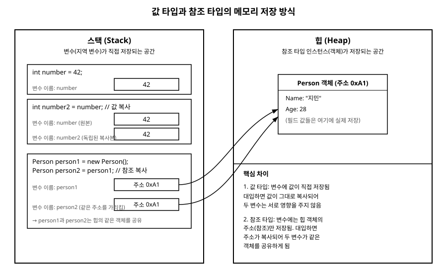

# 3장. 변수와 자료형

[◀ 이전: 2장. 첫 프로그램과 빌드 과정](ch02-첫프로그램과빌드과정.md) | [📖 목차](00-목차.md) | [다음: 4장. 연산자와 표현식 ▶](ch04-연산자와표현식.md)

---

2장에서 첫 프로그램을 빌드하고 실행하는 과정을 살펴봤다면, 이번 장에서는 그 프로그램 안에서 데이터를 담아 두는 그릇인 **변수(variable)**와, 그 그릇에 어떤 종류의 데이터를 넣을 수 있는지 결정하는 **자료형(data type)**을 다룬다. C#은 컴파일 시점에 타입을 엄격하게 검사하는 언어이기 때문에, 변수와 타입을 제대로 이해하지 못하면 이후 장에서 배우는 배열, 클래스, 제네릭 같은 개념도 뿌리 없이 흔들리게 된다.

## 변수 선언과 초기화

변수를 사용하려면 먼저 어떤 타입의 데이터를 담을 것인지 선언해야 한다. C#에서 변수 선언의 기본 형태는 다음과 같다.

```csharp
int age;        // 선언: age라는 이름의 int 변수를 만든다
age = 28;        // 초기화: age에 28을 대입한다

int score = 95;  // 선언과 초기화를 한 줄에서 처리
```

지역 변수는 선언만 해 두고 값을 대입하지 않은 상태로 사용하려고 하면 컴파일 오류가 발생한다. C#은 "혹시 초기화하지 않은 채로 쓰면 어쩌지"라는 걱정을 컴파일러가 대신 해 주는 언어다.

```csharp
int total;
Console.WriteLine(total); // 오류: 지역 변수 'total'을 할당되지 않은 채 사용했습니다
```

한 줄에서 같은 타입의 변수를 여러 개 선언할 수도 있다.

```csharp
int width = 10, height = 20, depth = 5;
```

변수 이름은 camelCase로 짓는 것이 C# 관례다. `userName`, `totalPrice`처럼 소문자로 시작하고 단어가 바뀔 때마다 대문자를 쓴다. 반면 클래스 이름은 PascalCase를 쓴다는 점은 9장 클래스와 객체에서 자세히 다룬다.

## 값 타입과 참조 타입: C#의 근본적인 구분

C#의 모든 타입은 크게 **값 타입(value type)**과 **참조 타입(reference type)** 두 가지로 나뉜다. 이 구분은 단순한 문법 규칙이 아니라, 데이터가 메모리에 저장되는 방식과 변수를 다른 변수에 대입했을 때 무슨 일이 벌어지는지를 결정하는 근본적인 차이다.

### 개념적으로 이해하기: 스택과 힙

프로그램이 실행되는 동안 메모리는 크게 **스택(stack)**과 **힙(heap)**이라는 두 영역으로 나눠 쓰인다고 개념적으로 이해하면 편하다.

- **스택**: 메서드가 호출될 때마다 그 메서드 안에서 쓰이는 지역 변수들이 순서대로 쌓이는 공간이다. 메서드가 끝나면 그 안에서 쓰인 변수들도 스택에서 정리된다.
- **힙**: `new`로 만들어 낸 객체처럼, 메서드가 끝나도 계속 살아있어야 할 수도 있는 데이터가 저장되는 공간이다.

값 타입 변수는 그 값 자체를 스택(정확히는 변수가 위치한 자리)에 직접 저장한다. 반면 참조 타입 변수는 실제 데이터를 힙에 만들어 두고, 변수 자신은 "그 데이터가 힙의 어디에 있는지" 가리키는 주소, 즉 **참조(reference)**만 저장한다.

> 실제 CLR(공용 언어 런타임) 구현에는 이스케이프 분석이나 인라이닝 등에 따라 스택/힙 배치가 달라지는 미묘한 예외가 있지만, 입문 단계에서는 "값 타입 = 값을 직접 들고 있다", "참조 타입 = 값이 있는 곳의 주소를 들고 있다"로 이해하는 것으로 충분하다.

다음 그림은 이 차이를 시각적으로 보여준다.



### 대입했을 때 무슨 일이 일어나는가

이 차이가 실제로 드러나는 순간은 변수를 다른 변수에 대입할 때다.

```csharp
// 값 타입: int는 값 타입이다
int number = 42;
int number2 = number; // number의 '값' 42가 그대로 복사됨

number2 = 100;
Console.WriteLine(number);  // 42 (영향 없음)
Console.WriteLine(number2); // 100
```

`number2`는 `number`와 완전히 독립된 저장 공간이다. 하나를 바꿔도 다른 하나는 전혀 영향을 받지 않는다.

이제 참조 타입인 클래스 인스턴스로 같은 실험을 해 보자. 클래스에 대한 자세한 내용은 9장에서 다루지만, 지금은 `new`로 만든 객체가 힙에 저장된다는 점만 기억하면 충분하다.

```csharp
class Person
{
    public string Name;
}

Person person1 = new Person();
person1.Name = "지민";

Person person2 = person1; // person1이 가리키는 '주소'가 복사됨

person2.Name = "하늘";
Console.WriteLine(person1.Name); // "하늘" (같은 객체를 공유하므로 영향을 받음)
```

`person2 = person1`을 실행해도 객체가 하나 더 복제되는 것이 아니다. `person1`과 `person2`는 힙에 있는 **같은 객체**를 가리키는 두 개의 주소표일 뿐이다. 그래서 `person2`를 통해 `Name`을 바꾸면 `person1`로 읽어도 바뀐 값이 보인다. 이 동작은 8장 함수(메서드)에서 매개변수를 값으로 넘기는지, 참조로 넘기는지를 이해할 때도 그대로 적용되는 중요한 원리다.

대표적인 값 타입은 `int`, `double`, `bool`, `char`처럼 이번 장에서 다룰 기본 타입들과, 12장에서 배울 구조체(struct), 열거형(enum)이다. 대표적인 참조 타입은 클래스, 배열, 그리고 지금 당장 눈에 익은 `string`이다. `string`은 참조 타입이지만 **불변(immutable)**이어서 값 타입처럼 동작하는 것처럼 느껴지는 특수한 사례인데, 이는 14장에서 좀 더 다룬다.

## 기본 타입과 크기

C#은 자주 쓰이는 데이터 종류에 대해 미리 정의된 기본 타입(built-in type)을 제공한다. 각 타입은 저장할 수 있는 값의 범위와 메모리 크기가 다르다.

| C# 타입 | 설명 | 크기 | 값의 예 |
|---|---|---|---|
| `bool` | 참/거짓 | 1바이트 | `true`, `false` |
| `char` | 유니코드 문자 하나 | 2바이트 | `'A'`, `'가'` |
| `byte` | 부호 없는 정수 | 1바이트 | 0 ~ 255 |
| `int` | 정수 | 4바이트 | -21억 ~ 21억 |
| `long` | 큰 정수 | 8바이트 | int보다 훨씬 넓은 범위 |
| `float` | 단정밀도 부동소수점 | 4바이트 | `3.14f` |
| `double` | 배정밀도 부동소수점 | 8바이트 | `3.14159265` |
| `decimal` | 고정밀도 십진수 | 16바이트 | `19.99m` (금액 계산에 적합) |
| `string` | 문자열 (참조 타입) | 가변 | `"안녕하세요"` |

몇 가지 실용적인 조언을 덧붙인다.

- 정수를 다룰 때는 특별한 이유가 없다면 `int`를 기본으로 쓴다. 아주 큰 수를 다뤄야 한다면 `long`을 쓴다.
- 소수를 다룰 때 일반적인 계산에는 `double`을 쓰지만, **돈을 다루는 계산에는 반드시 `decimal`을 써야 한다**. `double`은 부동소수점 특유의 오차 때문에 금액 계산에서 미세한 차이가 생길 수 있다.
- `float` 리터럴에는 `f` 접미사, `decimal` 리터럴에는 `m` 접미사를 붙여야 한다. 접미사 없이 `3.14`라고 쓰면 컴파일러는 이를 `double`로 해석한다.

```csharp
float pi1 = 3.14f;
double pi2 = 3.14;
decimal price = 19900m;

bool isReady = true;
char grade = 'A';
string message = "환영합니다";
```

## var를 이용한 타입 추론

매번 타입 이름을 쓰는 대신, `var` 키워드를 쓰면 컴파일러가 오른쪽 값을 보고 타입을 스스로 추론해 준다.

```csharp
var count = 10;          // 컴파일러가 int로 추론
var price = 19900m;      // decimal로 추론
var name = "지민";        // string으로 추론
```

여기서 오해하기 쉬운 부분이 있다. `var`는 "타입이 없다"거나 "런타임에 타입이 바뀔 수 있다"는 뜻이 아니다. `var count = 10;`이라고 쓰는 순간 `count`의 타입은 컴파일 시점에 `int`로 완전히 고정되며, 이후 `count = "문자열";`처럼 다른 타입을 대입하려 하면 컴파일 오류가 난다. `var`는 단지 타입 이름을 코드에 반복해서 적는 수고를 줄여주는 문법적 편의일 뿐, C#은 여전히 정적 타입 언어다.

`var`는 대입되는 값을 보고 타입을 결정하므로, 선언과 초기화를 동시에 할 때만 쓸 수 있다.

```csharp
var x; // 오류: 초기화 식이 없으면 타입을 추론할 수 없음
```

실무에서는 타입이 코드만 보고 명확히 드러나는 경우(`var name = "지민";`)에는 `var`를 쓰고, 타입을 짐작하기 어려운 경우(예: 메서드 반환값)에는 명시적인 타입을 쓰는 것이 가독성에 도움이 된다는 의견이 많다. 이 판단 기준은 18장 좋은 C# 코드 작성 습관에서 다시 짚는다.

## 널러블 값 타입과 널러블 참조 타입

값 타입 변수는 기본적으로 `null`을 가질 수 없다. `int age = null;`은 컴파일 오류다. 하지만 "값이 아직 없음"을 표현해야 하는 상황은 흔하다. 예를 들어 사용자가 아직 입력하지 않은 나이 필드 같은 경우다.

이때 타입 이름 뒤에 `?`를 붙이면 **널러블 값 타입(nullable value type)**이 된다.

```csharp
int? age = null;   // 값이 없는 상태를 표현할 수 있음
age = 28;           // 이후 값을 채워 넣을 수도 있음

if (age.HasValue)
{
    Console.WriteLine($"나이: {age.Value}");
}
else
{
    Console.WriteLine("나이가 입력되지 않았습니다");
}
```

`int?`는 사실 `Nullable<int>`라는 구조체의 축약 표기다. 내부적으로 `HasValue`(값이 있는지)와 `Value`(실제 값)라는 두 정보를 함께 들고 있는 값 타입이다. 제네릭 구조체가 어떻게 이런 일을 하는지는 13장 제네릭에서 다시 설명한다.

참조 타입은 원래부터 `null`을 가질 수 있었다. 문제는 오히려 그 반대다. `string name = null;`처럼 자연스럽게 null을 대입할 수 있다 보니, `name.Length`처럼 null인 객체의 멤버에 접근해 `NullReferenceException`이 터지는 사고가 잦았다. 이를 줄이기 위해 최신 C#은 **널러블 참조 타입(nullable reference type)** 기능을 제공한다. 프로젝트에서 이 기능을 활성화하면, `string`은 "null이 아님이 보장된 문자열"을 의미하고 `string?`는 "null일 수도 있는 문자열"을 의미하게 되어, 컴파일러가 null 가능성을 추적하고 경고를 준다.

```csharp
string? nickname = null; // null이 허용된다는 것을 타입에서부터 명시
string userName = "지민"; // null이 아님을 전제로 함
```

null을 다루는 연산자들은 4장 연산자와 표현식에서 자세히 살펴본다.

## 형변환: 암시적 변환과 명시적 변환

타입이 다른 값 사이를 오가려면 형변환(type conversion)이 필요하다. C#은 데이터 손실 위험이 없는 변환은 자동으로 허용하고, 손실이 생길 수 있는 변환은 개발자가 의도적으로 요청하도록 강제한다.

### 암시적 변환 (Implicit Conversion)

더 작은 범위의 타입에서 더 큰 범위의 타입으로 가는 변환은 정보 손실이 없으므로 자동으로 이루어진다.

```csharp
int smallNumber = 100;
long bigNumber = smallNumber;   // int -> long, 자동 변환
double result = smallNumber;    // int -> double, 자동 변환
```

### 명시적 변환 (Explicit Conversion, 캐스팅)

반대로 큰 범위에서 작은 범위로 갈 때는 데이터가 잘리거나 소수점 이하가 사라질 수 있다. 이런 위험한 변환은 `(타입)` 형태의 캐스트 연산자를 명시적으로 붙여야만 허용된다.

```csharp
double price = 19.99;
int roundedDown = (int)price; // 19, 소수점 이하는 버려짐(잘림)

long bigValue = 5_000_000_000;
int overflowed = (int)bigValue; // int 범위를 넘어가 예상치 못한 값이 나올 수 있음
```

캐스트를 명시적으로 요구하는 이유는 "이 변환에 데이터 손실이 있을 수 있다는 것을 알고 있고, 그래도 하겠다"는 의사를 코드에 남기게 하려는 것이다.

### Convert 클래스와 Parse 메서드

문자열을 숫자로, 또는 숫자를 문자열로 바꾸는 일은 실무에서 아주 자주 일어난다. 캐스트 연산자로는 `string`을 `int`로 바로 바꿀 수 없다.

```csharp
string input = "123";
int number = (int)input; // 오류: 이런 캐스팅은 존재하지 않음
```

대신 다음 두 가지 방법을 쓴다.

**1. `int.Parse` (혹은 각 타입의 `Parse` 메서드)**

```csharp
string input = "123";
int number = int.Parse(input); // 성공하면 123

string invalid = "abc";
int fail = int.Parse(invalid); // 예외 발생: FormatException
```

`Parse`는 변환할 수 없는 문자열이 들어오면 예외를 던진다. 예외를 다루는 방법은 15장 예외처리에서 배우며, 예외 없이 실패 여부만 확인하고 싶다면 `int.TryParse`를 쓰는 것이 더 안전하다.

```csharp
if (int.TryParse(invalid, out int value))
{
    Console.WriteLine($"변환 성공: {value}");
}
else
{
    Console.WriteLine("변환할 수 없는 문자열입니다");
}
```

**2. `Convert` 클래스**

`Convert.ToInt32`, `Convert.ToDouble`, `Convert.ToString` 같은 정적 메서드는 `Parse`와 비슷하지만 한 가지 편리한 차이가 있다. `Convert`는 `null`을 넘기면 예외 대신 기본값(0 등)을 반환하고, 숫자 사이의 변환(`double` → `int` 등)에서는 버림 대신 **반올림**을 한다는 점이 캐스팅과 다르다.

```csharp
double price = 19.7;
int rounded = Convert.ToInt32(price); // 20 (반올림), 캐스팅의 19(버림)과 다름

string? text = null;
int fromNull = Convert.ToInt32(text); // 0 (예외 없이 기본값)
```

어느 것을 쓸지 고민된다면: 사용자 입력처럼 실패할 수 있는 문자열을 다룰 때는 `TryParse`, 형식이 확실한 값을 단순히 숫자 타입 사이에서 옮길 때는 `Convert`를 기본으로 생각하면 무난하다.

## 요약

- 변수는 값을 담는 그릇이고, 자료형은 그 그릇에 담을 수 있는 데이터의 종류와 크기를 결정한다.
- 값 타입(`int`, `double`, `bool`, `struct` 등)은 값 자체를 저장하며, 대입 시 값이 독립적으로 복사된다.
- 참조 타입(클래스, 배열, `string` 등)은 힙에 있는 객체의 주소(참조)를 저장하며, 대입 시 주소가 복사되어 같은 객체를 여러 변수가 공유하게 된다.
- 기본 타입은 각각 크기와 표현 범위가 다르며, 금액 계산에는 `double`이 아닌 `decimal`을 써야 한다.
- `var`는 타입을 추론해 주는 문법적 편의이며, 타입이 없어지는 것이 아니라 컴파일 시점에 여전히 고정된다.
- `int?` 같은 널러블 값 타입은 값 타입에 "값 없음" 상태를 부여하고, 널러블 참조 타입 기능은 참조 타입의 null 가능성을 타입 시스템으로 추적하게 해 준다.
- 암시적 변환은 데이터 손실이 없을 때 자동으로 일어나고, 명시적 변환(캐스팅)은 손실 가능성을 개발자가 인지하고 요청해야 한다. 문자열을 숫자로 바꿀 때는 `Parse`/`TryParse` 또는 `Convert`를 사용한다.

## 연습문제

1. 값 타입과 참조 타입의 차이를 스택과 힙이라는 개념을 이용해 설명하고, 각각의 예시 타입을 두 개씩 들어보자.
2. 다음 코드를 실행했을 때 콘솔에 출력되는 값을 예측하고, 왜 그런 결과가 나오는지 설명해 보자.
   ```csharp
   int a = 5;
   int b = a;
   b = 10;

   int[] arr1 = { 1, 2, 3 };
   int[] arr2 = arr1;
   arr2[0] = 99;

   Console.WriteLine(a);       // ?
   Console.WriteLine(arr1[0]); // ?
   ```
3. `float`, `double`, `decimal` 중 계좌 잔액을 계산하는 프로그램에 가장 적합한 타입은 무엇이며 그 이유는 무엇인지 서술하시오.
4. 사용자로부터 입력받은 문자열 `"3.5"`를 `double` 값으로 변환하는 코드를 `Parse`와 `TryParse` 두 가지 방식으로 각각 작성해 보자.
5. `int? score = null;`로 선언된 변수가 있을 때, 이 변수의 값이 있는지 확인하고 값이 있으면 출력하는 코드를 작성해 보자.

---

[◀ 이전: 2장. 첫 프로그램과 빌드 과정](ch02-첫프로그램과빌드과정.md) | [📖 목차](00-목차.md) | [다음: 4장. 연산자와 표현식 ▶](ch04-연산자와표현식.md)
