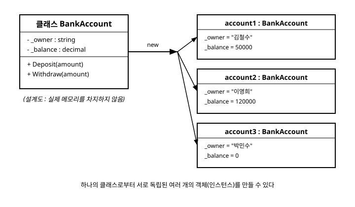

# 9장. 클래스와 객체

[◀ 이전: 8장. 함수(메서드)](ch08-함수.md) | [📖 목차](00-목차.md) | [다음: 10장. 상속과 다형성 ▶](ch10-상속과다형성.md)

---

지금까지는 `int`, `double`, `bool` 같은 미리 정의된 자료형과 3장에서 다룬 값 타입, 그리고 7장의 배열을 이용해 데이터를 다뤘습니다. 하지만 실제 프로그램에서는 "은행 계좌", "학생", "주문 내역"처럼 여러 개의 데이터와 그 데이터를 다루는 동작을 하나로 묶어야 하는 경우가 훨씬 많습니다. 이때 사용하는 것이 바로 **클래스(class)**입니다. 이번 장에서는 클래스를 정의하는 방법, 객체를 만드는 방법, 그리고 클래스가 3장에서 배운 값 타입과 어떻게 다른지 살펴봅니다.

## 클래스란 무엇인가

클래스는 데이터(필드)와 그 데이터를 다루는 동작(메서드)을 하나의 틀로 묶어놓은 **설계도**입니다. 설계도 자체는 실제 데이터를 담고 있지 않습니다. 이 설계도로부터 실제로 메모리에 만들어지는 결과물을 **객체(object)** 또는 **인스턴스(instance)**라고 부릅니다. 하나의 클래스로부터 여러 개의 서로 다른 객체를 얼마든지 만들 수 있습니다.

간단한 은행 계좌 클래스를 만들어 보겠습니다.

```csharp
// 은행 계좌를 표현하는 클래스
public class BankAccount
{
    private string _owner;
    private decimal _balance;

    // 매개변수가 있는 생성자
    public BankAccount(string owner, decimal initialBalance)
    {
        _owner = owner;
        _balance = initialBalance;
    }

    public void Deposit(decimal amount)
    {
        _balance += amount;
        Console.WriteLine($"{_owner}님이 {amount}원을 입금했습니다. 잔액: {_balance}원");
    }

    public void Withdraw(decimal amount)
    {
        if (amount > _balance)
        {
            Console.WriteLine("잔액이 부족합니다.");
            return;
        }
        _balance -= amount;
        Console.WriteLine($"{_owner}님이 {amount}원을 출금했습니다. 잔액: {_balance}원");
    }
}
```

이 클래스를 실제로 사용하려면 `new` 키워드로 객체를 생성해야 합니다.

```csharp
BankAccount account1 = new BankAccount("김철수", 50000);
BankAccount account2 = new BankAccount("이영희", 120000);

account1.Deposit(10000);
account2.Withdraw(30000);
```

`account1`과 `account2`는 같은 `BankAccount` 클래스로 만들어졌지만 서로 독립적인 필드 값을 가지고 있습니다. 이 관계를 그림으로 나타내면 다음과 같습니다.



## 생성자: 객체를 초기화하는 특별한 메서드

**생성자(constructor)**는 클래스와 이름이 같고 반환 타입이 없는 특별한 메서드로, 객체가 `new`로 생성되는 순간 딱 한 번 호출됩니다. 위 `BankAccount` 예제에서 사용한 `BankAccount(string owner, decimal initialBalance)`가 매개변수가 있는 생성자입니다.

클래스에 생성자를 하나도 작성하지 않으면 C# 컴파일러는 매개변수가 없는 **기본 생성자(default constructor)**를 자동으로 만들어 줍니다. 하지만 매개변수가 있는 생성자를 직접 정의하면 기본 생성자는 더 이상 자동으로 제공되지 않습니다. 필요하다면 다음처럼 매개변수 없는 생성자를 별도로 추가할 수 있습니다.

```csharp
public class Product
{
    public string Name;
    public int Price;

    // 매개변수 없는 생성자
    public Product()
    {
        Name = "이름 없음";
        Price = 0;
    }

    // 매개변수가 있는 생성자
    public Product(string name, int price)
    {
        Name = name;
        Price = price;
    }
}
```

이렇게 이름은 같지만 매개변수 목록이 다른 생성자를 여러 개 정의하는 것을 **생성자 오버로드**라고 하며, 이는 8장에서 배운 메서드 오버로드와 같은 원리입니다.

## this 키워드

`this`는 현재 실행 중인 메서드가 속한 객체 자기 자신을 가리키는 키워드입니다. 주로 매개변수 이름과 필드 이름이 같을 때 둘을 구분하기 위해 사용합니다.

```csharp
public class Point
{
    public int X;
    public int Y;

    public Point(int x, int y)
    {
        this.X = x;  // this.X는 필드, x는 매개변수
        this.Y = y;
    }
}
```

또한 `this`는 같은 클래스의 다른 생성자를 호출할 때도 사용할 수 있습니다.

```csharp
public class Product
{
    public string Name;
    public int Price;

    public Product() : this("이름 없음", 0)
    {
    }

    public Product(string name, int price)
    {
        Name = name;
        Price = price;
    }
}
```

`Product()`가 `: this("이름 없음", 0)`을 통해 매개변수가 있는 생성자를 호출하도록 하면, 초기화 로직을 한 곳에만 작성해도 됩니다.

## 접근 제한자

클래스의 필드나 메서드를 외부에서 얼마나 자유롭게 접근할 수 있는지를 결정하는 것이 **접근 제한자(access modifier)**입니다.

| 접근 제한자 | 접근 가능 범위 |
|---|---|
| `public` | 어디서든 접근 가능 |
| `private` | 선언된 클래스 내부에서만 접근 가능 |
| `protected` | 선언된 클래스와 그 클래스를 상속한 클래스에서 접근 가능 (10장에서 자세히 다룸) |
| `internal` | 같은 어셈블리(프로젝트) 안에서만 접근 가능 |

일반적으로 필드는 `private`으로 감추고, 외부에는 `public` 메서드를 통해서만 값을 변경하거나 조회하도록 만드는 것이 좋은 습관입니다. 앞서 작성한 `BankAccount`에서 `_balance` 필드를 `private`으로 두고 `Deposit`, `Withdraw` 같은 `public` 메서드로만 값을 바꾸도록 한 것이 바로 이런 이유입니다. 만약 `_balance`가 `public`이었다면 외부 코드가 검증 없이 `account1._balance = -1000000;`처럼 직접 값을 바꿔버릴 수 있어, 클래스가 스스로 정한 규칙(음수가 될 수 없다는 규칙)이 깨지게 됩니다. 이런 필드 값 검증은 11장 속성과 인덱서에서 더 정교하게 다루게 됩니다.

## 필드와 메서드

**필드(field)**는 클래스가 가지고 있는 데이터이고, **메서드(method)**는 그 데이터를 다루는 동작입니다. 8장에서 배운 메서드 문법이 클래스 안에서도 그대로 사용됩니다. 다만 클래스 안의 메서드는 같은 객체의 다른 필드나 메서드에 매개변수 없이 바로 접근할 수 있다는 점이 다릅니다.

```csharp
public class Rectangle
{
    public double Width;
    public double Height;

    public double GetArea()
    {
        return Width * Height;  // 같은 객체의 필드에 직접 접근
    }

    public bool IsSquare()
    {
        return Width == Height;
    }
}
```

## 클래스는 참조 타입이다

3장에서 `int`, `double`, `bool`, `struct` 등을 **값 타입(value type)**이라고 배웠습니다. 값 타입 변수는 값 자체를 담고 있어서, 다른 변수에 대입하면 값이 복사됩니다. 반면 클래스는 **참조 타입(reference type)**입니다. 클래스로 만든 변수는 실제 객체가 아니라 객체가 저장된 메모리 위치(참조)를 담고 있습니다.

```csharp
// 값 타입: 복사가 일어난다
int a = 10;
int b = a;
b = 20;
Console.WriteLine(a);  // 10 (a는 영향받지 않음)

// 참조 타입: 같은 객체를 가리킨다
BankAccount acc1 = new BankAccount("김철수", 50000);
BankAccount acc2 = acc1;
acc2.Deposit(10000);
// acc1과 acc2는 같은 객체를 가리키므로
// acc1의 잔액도 60000원으로 함께 바뀐다
```

`acc2 = acc1`은 객체를 복제하는 것이 아니라, "같은 객체를 가리키는 이름표를 하나 더 만드는 것"에 가깝습니다. 이 차이를 정확히 이해하는 것이 이후 배열과 컬렉션에서 객체를 다룰 때(7장, 14장) 매우 중요합니다. 값 타입과 참조 타입의 차이는 12장 구조체와 열거형에서 `struct`를 배울 때 다시 한번 비교하게 됩니다.

## 정리 예제: BankAccount 확장하기

지금까지 배운 내용을 모아 좀 더 실전적인 `BankAccount` 클래스를 만들어 보겠습니다.

```csharp
public class BankAccount
{
    private string _owner;
    private decimal _balance;
    private readonly string _accountNumber;

    public BankAccount(string owner, string accountNumber, decimal initialBalance)
    {
        _owner = owner;
        _accountNumber = accountNumber;
        _balance = initialBalance >= 0 ? initialBalance : 0;
    }

    public void Deposit(decimal amount)
    {
        if (amount <= 0)
        {
            Console.WriteLine("입금액은 0보다 커야 합니다.");
            return;
        }
        _balance += amount;
    }

    public void Withdraw(decimal amount)
    {
        if (amount > _balance)
        {
            Console.WriteLine("잔액이 부족합니다.");
            return;
        }
        _balance -= amount;
    }

    public void PrintStatus()
    {
        Console.WriteLine($"[{_accountNumber}] {_owner}님의 잔액: {_balance}원");
    }
}

class Program
{
    static void Main()
    {
        BankAccount acc = new BankAccount("김철수", "110-222-333", 100000);
        acc.Deposit(50000);
        acc.Withdraw(30000);
        acc.PrintStatus();  // [110-222-333] 김철수님의 잔액: 120000원
    }
}
```

`_accountNumber`에는 `readonly`를 붙였습니다. `readonly` 필드는 생성자에서만 값을 정할 수 있고 이후에는 바꿀 수 없어서, 계좌번호처럼 한 번 정해지면 바뀌지 않아야 하는 값을 표현하는 데 알맞습니다.

## 요약

- 클래스는 데이터(필드)와 동작(메서드)을 하나로 묶는 설계도이며, `new`로 실제 객체(인스턴스)를 만든다.
- 생성자는 객체가 생성될 때 호출되는 특별한 메서드로, 매개변수가 다른 여러 생성자를 오버로드할 수 있다.
- `this`는 현재 객체 자신을 가리키며, 필드와 매개변수 이름이 같을 때 구분하거나 다른 생성자를 호출할 때 사용한다.
- `public`, `private`, `protected`, `internal` 접근 제한자로 클래스 멤버의 접근 범위를 제어하며, 필드는 `private`으로 숨기고 메서드로 제어하는 것이 일반적이다.
- 클래스는 참조 타입이므로 변수 대입 시 객체가 복사되지 않고 같은 객체를 가리키게 되며, 이는 3장에서 배운 값 타입과 근본적으로 다르다.

## 연습문제

1. `Student` 클래스를 만들어 `Name`, `Grade`(학년) 필드와, 학년을 1 증가시키는 `PromoteGrade()` 메서드를 작성해 보세요. 필드는 `private`으로 선언하고 생성자로 초기화하세요.
2. 매개변수 없는 생성자와 매개변수가 있는 생성자를 모두 가진 `Product` 클래스를 작성하고, `this(...)`를 이용해 매개변수 없는 생성자가 매개변수가 있는 생성자를 호출하도록 만들어 보세요.
3. 다음 코드를 실행하면 `p1.X`의 값이 무엇이 출력되는지 예상해 보고, 그 이유를 참조 타입의 관점에서 설명해 보세요.
   ```csharp
   var p1 = new Point(1, 2);
   var p2 = p1;
   p2.X = 100;
   Console.WriteLine(p1.X);
   ```
4. `Circle` 클래스를 만들어 `Radius` 필드와 `GetArea()`, `GetCircumference()` 메서드를 작성해 보세요. `Radius`가 음수로 설정되지 않도록 생성자에서 검증하는 코드를 추가해 보세요.
5. `BankAccount` 예제에 `Transfer(BankAccount target, decimal amount)` 메서드를 추가해, 현재 계좌에서 `amount`만큼 출금하고 `target` 계좌에 같은 금액을 입금하도록 구현해 보세요.

---

[◀ 이전: 8장. 함수(메서드)](ch08-함수.md) | [📖 목차](00-목차.md) | [다음: 10장. 상속과 다형성 ▶](ch10-상속과다형성.md)
