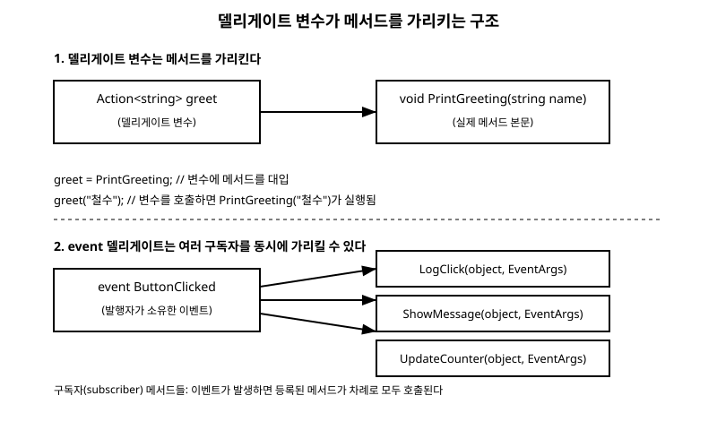

# 16장. 델리게이트와 이벤트

[◀ 이전: 15장. 예외 처리](ch15-예외처리.md) | [📖 목차](00-목차.md) | [다음: 17장. 비동기 프로그래밍 ▶](ch17-비동기프로그래밍.md)

---

지금까지 다룬 변수는 대부분 값이나 객체를 담았습니다. 정수를 담는 변수, 문자열을 담는 변수, 클래스의 인스턴스를 담는 변수처럼 말이죠. 그런데 C#에는 "메서드 자체"를 담는 변수도 존재합니다. 바로 델리게이트(delegate)입니다. 이 장에서는 델리게이트가 어떤 개념인지, 이를 편리하게 쓰도록 도와주는 `Func<>`/`Action<>`, 그리고 델리게이트 위에서 만들어진 `event` 키워드와 발행-구독 패턴을 살펴봅니다.

## 델리게이트: 메서드를 가리키는 변수

델리게이트는 특정 시그니처(매개변수 목록과 반환형)를 가진 메서드를 가리킬 수 있는 타입입니다. 마치 클래스 타입의 변수가 객체를 가리키듯, 델리게이트 타입의 변수는 메서드를 가리킵니다.

```csharp
// string을 매개변수로 받고 반환값이 없는 메서드를 가리키는 델리게이트 타입 선언
delegate void GreetingHandler(string name);

class Program
{
    static void PrintGreeting(string name)
    {
        Console.WriteLine($"안녕하세요, {name}님!");
    }

    static void PrintFormalGreeting(string name)
    {
        Console.WriteLine($"{name} 고객님, 방문해 주셔서 감사합니다.");
    }

    static void Main()
    {
        GreetingHandler greet = PrintGreeting;
        greet("철수"); // "안녕하세요, 철수님!" 출력

        greet = PrintFormalGreeting; // 같은 변수에 다른 메서드를 담을 수 있다
        greet("영희"); // "영희 고객님, 방문해 주셔서 감사합니다." 출력
    }
}
```

여기서 중요한 점은 `greet`이라는 변수가 특정 메서드의 결과값이 아니라 메서드 자체를 가리킨다는 사실입니다. `greet("철수")`는 그 시점에 `greet`이 가리키고 있는 메서드를 실행하라는 뜻입니다. 같은 변수라도 어떤 메서드를 담았는지에 따라 실행 결과가 달라지므로, 델리게이트는 "실행할 동작을 나중에 결정하고 바꿔 끼울 수 있게" 해주는 도구라고 이해하면 됩니다.

델리게이트는 값을 하나만 담는 것이 아니라, 같은 시그니처의 메서드를 여러 개 이어 붙일 수도 있습니다. 이를 멀티캐스트 델리게이트라고 부르며, `+=` 연산자로 메서드를 추가합니다.

```csharp
GreetingHandler both = PrintGreeting;
both += PrintFormalGreeting; // 두 메서드를 모두 담는다
both("민수"); // PrintGreeting과 PrintFormalGreeting이 순서대로 모두 호출된다
```

## Func<>와 Action<>: 미리 준비된 델리게이트

매번 `delegate void GreetingHandler(string name);`처럼 새로운 델리게이트 타입을 선언하는 것은 번거롭습니다. 그래서 .NET은 자주 쓰는 시그니처 형태를 미리 정의해 둔 범용 델리게이트 타입, `Action<>`과 `Func<>`를 제공합니다.

`Action<>`은 반환값이 없는 메서드를 가리킬 때 씁니다. 꺾쇠괄호 안에는 매개변수의 타입만 순서대로 나열합니다.

```csharp
Action<string> greet = PrintGreeting;       // string 매개변수 1개, 반환값 없음
Action<string, int> repeat = RepeatGreeting; // string, int 매개변수 2개, 반환값 없음
```

`Func<>`는 반환값이 있는 메서드를 가리킬 때 씁니다. 꺾쇠괄호의 마지막 타입이 반환형이고, 그 앞의 타입들이 매개변수입니다.

```csharp
static int Square(int x) => x * x;

Func<int, int> square = Square;        // int를 받아 int를 반환
Console.WriteLine(square(5));           // 25

Func<int, int, int> add = (a, b) => a + b; // int 두 개를 받아 int 반환
Console.WriteLine(add(3, 4));               // 7
```

매개변수가 전혀 없는 경우에는 `Action`(제네릭 없이)을 쓰고, 값을 반환만 하고 매개변수가 없는 경우에는 `Func<TResult>`처럼 타입 하나만 씁니다. 대부분의 실무 코드는 커스텀 델리게이트 타입을 직접 선언하기보다 `Action<>`과 `Func<>`로 충분히 해결합니다.

## 람다 식으로 짧게 표현하기

8장 함수(메서드)에서 메서드를 이름 붙여 정의하는 방법을 배웠습니다. 그런데 델리게이트에 담을 메서드가 아주 짧고 한 번만 쓰인다면, 굳이 별도의 이름 있는 메서드를 만들지 않고 람다 식(lambda expression)으로 그 자리에서 바로 정의할 수 있습니다.

```csharp
// 이름 있는 메서드를 만들어 연결하는 방식
static bool IsEven(int n) => n % 2 == 0;
Func<int, bool> checkEven1 = IsEven;

// 람다 식으로 같은 내용을 즉석에서 표현하는 방식
Func<int, bool> checkEven2 = n => n % 2 == 0;

Console.WriteLine(checkEven2(4)); // True
Console.WriteLine(checkEven2(7)); // False
```

`n => n % 2 == 0`은 "매개변수 `n`을 받아 `n % 2 == 0`이라는 식을 계산해 돌려준다"는 뜻입니다. 매개변수가 여러 개면 괄호로 묶고(`(a, b) => a + b`), 본문이 여러 문장이면 중괄호와 `return`을 사용합니다.

```csharp
Func<int, int, string> compare = (a, b) =>
{
    if (a > b) return "첫 번째가 더 큽니다";
    if (a < b) return "두 번째가 더 큽니다";
    return "두 값이 같습니다";
};
Console.WriteLine(compare(10, 3)); // "첫 번째가 더 큽니다"
```

람다 식은 결국 델리게이트에 담을 메서드를 짧게 쓰는 문법일 뿐이며, `Action<>`이나 `Func<>` 변수에 그대로 대입할 수 있습니다. 뒤에서 다룰 14장 컬렉션과 LINQ의 `Where`, `Select` 같은 메서드들도 내부적으로 `Func<>`를 매개변수로 받고, 그 자리에 람다 식을 넘기는 방식으로 쓰입니다.

## 델리게이트 위에 세워진 event 키워드

지금까지 본 델리게이트는 누구나 자유롭게 값을 바꿔 끼울 수 있습니다. 하지만 실제 프로그램에서는 "이 클래스 안에서 어떤 일이 일어났음을 바깥에 알리고, 바깥의 여러 코드가 그 소식을 듣고 각자 반응한다"는 상황이 자주 생깁니다. 버튼을 클릭했을 때, 파일 다운로드가 끝났을 때, 온도 센서 값이 변했을 때가 그런 예입니다. 이런 발행-구독(publish-subscribe) 패턴을 안전하게 구현하도록 C#은 델리게이트를 감싼 `event` 키워드를 제공합니다.

`event`로 선언한 멤버는 델리게이트와 마찬가지로 메서드를 등록(`+=`)하고 해제(`-=`)할 수 있지만, 클래스 바깥에서 `=`로 통째로 덮어쓰거나 직접 호출하는 것은 금지됩니다. 오직 이벤트를 선언한 클래스 내부에서만 이벤트를 발생시킬 수 있습니다. 이 제약 덕분에 이벤트를 구독하는 외부 코드가 실수로 다른 구독자의 등록을 지워버리는 사고를 막을 수 있습니다.

```csharp
class Button
{
    // 버튼이 클릭되었음을 알리는 이벤트. 델리게이트 타입은 Action으로 충분하다.
    public event Action Clicked;

    public void Click()
    {
        Console.WriteLine("버튼이 눌렸습니다.");
        Clicked?.Invoke(); // 구독자가 있으면 등록된 메서드들을 모두 호출
    }
}
```

`Clicked?.Invoke()`에서 `?.`는 5장 제어문에서 다룬 null 조건 연산자입니다. 아직 아무도 구독하지 않은 이벤트를 호출하면 `Clicked`가 `null`이므로, 그대로 호출하면 예외가 발생합니다. `?.`를 쓰면 `Clicked`가 `null`이 아닐 때만 안전하게 호출됩니다.

이제 이 버튼을 구독하는 코드를 작성해봅니다.

```csharp
class Program
{
    static void Main()
    {
        var button = new Button();

        // 이름 있는 메서드로 구독
        button.Clicked += LogClick;

        // 람다 식으로 구독
        button.Clicked += () => Console.WriteLine("화면을 새로고침합니다.");

        button.Click();
        // 출력:
        // 버튼이 눌렸습니다.
        // [로그] 버튼 클릭 감지
        // 화면을 새로고침합니다.
    }

    static void LogClick()
    {
        Console.WriteLine("[로그] 버튼 클릭 감지");
    }
}
```

`Clicked`라는 이벤트 하나에 두 개의 구독자, `LogClick`과 화면 새로고침용 람다 식이 등록되었습니다. `button.Click()`이 호출되면 등록된 순서대로 모든 구독자가 실행됩니다. 발행자(`Button`)는 구독자가 몇 명인지, 무엇을 하는지 전혀 알 필요가 없습니다. 이렇게 발행자와 구독자를 서로 느슨하게 연결(loose coupling)하는 것이 이벤트 패턴의 핵심 가치입니다.

.NET 표준 이벤트들은 흔히 두 번째 관례를 따르는데, 이벤트 정보를 담는 `EventArgs` 파생 클래스를 함께 정의해 어떤 일이 일어났는지 더 자세히 전달합니다.

```csharp
class TemperatureChangedEventArgs : EventArgs
{
    public double NewTemperature { get; }
    public TemperatureChangedEventArgs(double newTemperature)
    {
        NewTemperature = newTemperature;
    }
}

class Thermostat
{
    public event EventHandler<TemperatureChangedEventArgs> TemperatureChanged;

    private double _temperature;
    public double Temperature
    {
        get => _temperature;
        set
        {
            _temperature = value;
            TemperatureChanged?.Invoke(this, new TemperatureChangedEventArgs(value));
        }
    }
}
```

`EventHandler<TEventArgs>`는 `Func<>`, `Action<>`처럼 .NET이 미리 정의해 둔 델리게이트 타입으로, "이벤트를 발생시킨 객체(`object sender`)"와 "이벤트에 대한 세부 정보(`TEventArgs e`)"를 함께 전달하는 관례를 표준화한 것입니다. 11장 속성과 인덱서에서 다룬 속성의 `set` 접근자 안에서 이벤트를 발생시키면, 값이 바뀔 때마다 자동으로 구독자에게 알리는 구조를 만들 수 있습니다.

아래 그림은 델리게이트 변수가 실제 메서드를 가리키는 구조와, `event` 델리게이트가 여러 구독자를 동시에 가리킬 수 있는 구조를 나타냅니다.



## 요약

- 델리게이트는 특정 시그니처를 가진 메서드를 가리킬 수 있는 변수이며, 대입한 메서드를 나중에 바꿔 끼울 수 있습니다.
- `Action<>`은 반환값이 없는 메서드를, `Func<>`는 반환값이 있는 메서드를 가리키는 범용 델리게이트 타입입니다.
- 람다 식(`매개변수 => 식`)은 델리게이트에 담을 메서드를 짧게 즉석에서 정의하는 문법입니다.
- `event` 키워드는 델리게이트를 감싸 발행-구독 패턴을 안전하게 구현하도록 해주며, 이벤트는 선언한 클래스 내부에서만 발생시킬 수 있습니다.
- 이벤트를 호출할 때는 `?.Invoke()`로 구독자가 없는 상황(`null`)을 안전하게 처리하는 것이 관례입니다.

## 연습문제

1. `Func<int, int, int>` 타입의 변수에 두 정수를 곱해 반환하는 람다 식을 대입하고, 이를 호출해 결과를 출력해보세요.
2. 이름 있는 메서드 두 개를 만들어 같은 `Action<string>` 변수에 `+=`로 모두 등록한 뒤 호출해보고, 두 메서드가 모두 실행되는지 확인해보세요.
3. `Door` 클래스를 만들고, 문이 열릴 때 발생하는 `event Action Opened`를 정의한 뒤, 두 개의 서로 다른 구독자(하나는 메서드, 하나는 람다 식)를 등록해 동작을 확인해보세요.
4. `EventArgs`를 상속하는 `ScoreChangedEventArgs` 클래스를 만들고, 점수가 바뀔 때마다 새 점수를 담아 이벤트를 발생시키는 `ScoreBoard` 클래스를 작성해보세요.
5. 이벤트를 클래스 바깥에서 `=`로 직접 대입하려고 하면 어떤 컴파일 오류가 나는지 실제로 코드를 작성해 확인해보세요.

---

[◀ 이전: 15장. 예외 처리](ch15-예외처리.md) | [📖 목차](00-목차.md) | [다음: 17장. 비동기 프로그래밍 ▶](ch17-비동기프로그래밍.md)
