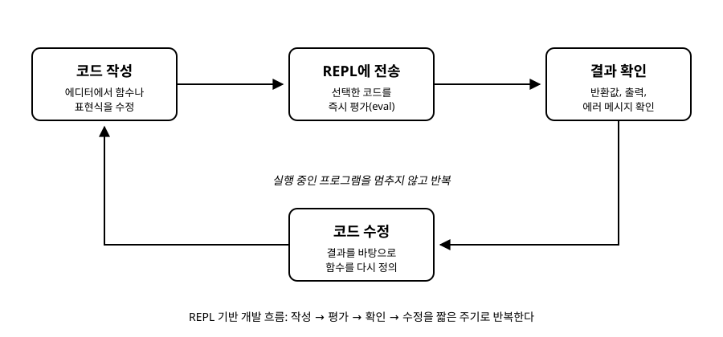

# 2장. 개발 환경 준비와 첫 실행

[◀ 이전: 1장. Clojure란 무엇인가](ch01-clojure란.md) | [📖 목차](00-목차.md) | [다음: 3장. 기본 문법과 데이터 타입 ▶](ch03-기본문법과데이터타입.md)

---

이번 장에서는 Clojure 코드를 실제로 실행해볼 수 있는 환경을 준비합니다. 어떤 도구를 설치해야 하는지, REPL이 무엇이고 왜 Clojure 개발에서 그토록 중요하게 여겨지는지, 그리고 첫 프로젝트를 어떻게 시작하는지까지 차례로 살펴봅니다. 이 장을 마치고 나면 여러분의 컴퓨터에서 직접 Clojure 코드를 평가해볼 수 있게 됩니다.

## JDK가 필요한 이유

1장에서 살펴본 것처럼 Clojure는 JVM(Java Virtual Machine) 위에서 동작하는 언어입니다. Clojure 컴파일러 자체도 JVM 위에서 실행되고, Clojure로 작성한 코드 역시 최종적으로는 JVM이 이해할 수 있는 바이트코드로 변환되어 실행됩니다. 따라서 Clojure를 실행하려면 먼저 JDK(Java Development Kit)가 컴퓨터에 설치되어 있어야 합니다.

JDK 버전은 지나치게 오래된 것만 아니라면 크게 신경 쓰지 않아도 됩니다. 이 책을 따라가는 데는 장기 지원(LTS) 버전의 JDK, 예를 들어 17 이상을 설치해두면 충분합니다. Eclipse Temurin, Amazon Corretto, Oracle OpenJDK 등 여러 배포판 중 편한 것을 하나 골라 설치하면 됩니다. 설치가 끝났다면 터미널에서 다음 명령으로 잘 설치되었는지 확인합니다.

```
java -version
```

버전 정보가 출력된다면 준비가 끝난 것입니다. JDK는 Clojure를 실행하기 위한 토대일 뿐, JDK 자체의 문법을 몰라도 Clojure를 배우는 데는 전혀 문제가 없습니다. 15장 Java 상호운용에서 자바 라이브러리를 직접 호출하는 방법을 다룰 때 다시 이 관계를 떠올리게 될 것입니다.

## Clojure 개발 도구: Leiningen과 deps.edn

JDK만으로는 Clojure 프로젝트를 편하게 관리하기 어렵습니다. 의존 라이브러리를 내려받고, 프로젝트 구조를 만들고, REPL을 띄우는 작업을 도와주는 도구가 필요합니다. Clojure 생태계에는 널리 쓰이는 두 가지 도구가 있습니다.

**Leiningen(라이닝언)**은 Clojure 커뮤니티에서 가장 오래 사용되어 온 빌드 도구입니다. `project.clj`라는 설정 파일 하나로 의존성, 빌드 방법, 실행 방법 등을 모두 관리합니다. 명령어가 직관적이고 문서와 플러그인이 풍부해서 처음 시작하는 사람에게 특히 편합니다.

**deps.edn(clj/clojure CLI)**은 Clojure 공식 팀이 만든 비교적 최신의 도구입니다. `deps.edn`이라는 설정 파일에 의존 라이브러리 목록을 적어두면 `clj` 또는 `clojure` 명령으로 실행할 수 있습니다. Leiningen에 비해 더 가볍고 단순한 것이 특징이며, 최근에는 이 방식을 선호하는 프로젝트가 늘어나고 있습니다.

두 도구 중 무엇을 선택해도 이 책의 내용을 따라가는 데는 문제가 없습니다. 이 책에서는 설명의 편의를 위해 두 도구 모두의 사용법을 간단히 짚고, 이후 장에서는 도구에 따라 큰 차이가 없는 REPL 사용법과 언어 자체에 집중합니다.

각 도구의 공식 홈페이지에서 설치 스크립트를 내려받아 실행하면 설치가 끝납니다. 설치가 끝났다면 다음 명령으로 정상 동작을 확인할 수 있습니다.

```
lein version
```

또는

```
clj -version
```

## REPL이란 무엇이고 왜 중요한가

REPL은 Read(읽기)-Eval(평가)-Print(출력)-Loop(반복)의 줄임말입니다. 사용자가 입력한 코드 한 조각을 읽어서, 그 코드를 평가하고, 결과를 화면에 출력한 다음, 다시 다음 입력을 기다리는 대화형 프로그램입니다.

많은 언어에도 REPL이나 그 비슷한 것(예: Python의 대화형 셸)이 있지만, Clojure 개발 문화에서 REPL은 단순한 "테스트용 콘솔"을 넘어서는 위치를 차지합니다. Clojure 개발자는 보통 다음과 같은 방식으로 작업합니다.

1. 실행 중인 REPL에 연결한 채로 에디터에서 코드를 작성합니다.
2. 작성한 함수 정의나 표현식 일부를 선택해서 REPL로 보내 즉시 평가합니다.
3. 반환된 값을 보고 의도한 대로 동작하는지 바로 확인합니다.
4. 잘못된 부분이 있으면 코드를 수정하고, 다시 그 부분만 평가합니다.

이 과정에서 프로그램 전체를 처음부터 다시 실행할 필요가 없다는 점이 핵심입니다. 이미 실행 중인 프로그램의 일부 함수만 바꿔치기하면서 발전시켜 나갈 수 있기 때문에, 특히 복잡한 상태를 다루는 프로그램이나 데이터 분석 작업에서 시행착오 비용이 크게 줄어듭니다. 아래 그림은 이 반복 흐름을 도식화한 것입니다.



이 그림에서 알 수 있듯, REPL 중심 개발은 "작성 → 평가 → 확인 → 수정"이라는 짧은 주기를 계속 반복하는 것입니다. 이후 장에서 새로운 함수나 문법을 배울 때마다, 책의 설명만 읽지 말고 실제로 REPL을 띄워 하나씩 입력해보길 권합니다. 손으로 직접 입력하고 결과를 눈으로 확인하는 경험이 문법을 외우는 것보다 훨씬 오래 남습니다.

## 첫 REPL 실행하기

이제 실제로 REPL을 띄워봅니다. Leiningen을 사용한다면 터미널에서 다음 명령을 입력합니다.

```
lein repl
```

deps.edn 기반 도구를 사용한다면 다음 명령을 입력합니다.

```
clj
```

잠시 기다리면 다음과 비슷한 프롬프트가 나타납니다.

```
user=>
```

`user=>`는 "현재 `user`라는 네임스페이스에 있고, 다음 입력을 기다리고 있다"는 뜻입니다. 네임스페이스가 무엇인지는 10장 네임스페이스와 코드 구성에서 자세히 다루니, 지금은 "지금 코드를 입력할 준비가 되었다"는 신호 정도로 이해하면 충분합니다.

이제 간단한 표현식을 입력해봅니다.

```clojure
user=> (+ 1 2 3)
;; => 6
```

`(+ 1 2 3)`을 입력하고 엔터를 누르면 REPL이 이 표현식을 읽고, 평가하고, 결과인 `6`을 출력합니다. 몇 가지 더 시도해봅시다.

```clojure
user=> (* 6 7)
;; => 42

user=> (str "안녕, " "Clojure!")
;; => "안녕, Clojure!"

user=> (count [1 2 3 4 5])
;; => 5
```

`str`은 여러 문자열을 이어 붙이는 함수이고, `count`는 컬렉션의 원소 개수를 세는 함수입니다. 각 함수의 자세한 쓰임은 이후 장에서 차근차근 다루지만, 지금은 "함수 이름을 맨 앞에 쓰고, 그 뒤에 인자를 나열한 다음, 괄호로 감싼다"는 Clojure의 기본 표기법에 익숙해지는 것이 목표입니다.

## Hello World 출력하기

이제 전통적인 첫 프로그램인 "Hello, World!"를 출력해봅니다. REPL에 다음을 입력합니다.

```clojure
user=> (println "Hello, World!")
Hello, World!
;; => nil
```

여기서 눈여겨볼 점이 있습니다. `println`은 화면에 문자열을 출력하는 부작용(side effect)을 일으키는 함수입니다. 화면에는 `Hello, World!`라는 글자가 찍히지만, 함수 자체가 "반환하는 값"은 `nil`입니다. 즉 화면에 무언가를 출력하는 일과, 함수가 최종적으로 돌려주는 값은 서로 다른 개념입니다. 이 구분은 앞으로 여러 장에 걸쳐 계속 등장하는 중요한 개념이므로 지금부터 눈여겨봐 두면 좋습니다.

## 첫 프로젝트 구조 만들기

REPL에서 한 줄씩 입력하는 것도 좋지만, 여러 함수를 담은 파일을 만들어 프로젝트 형태로 관리하는 방법도 알아둘 필요가 있습니다.

Leiningen을 사용한다면 다음 명령으로 새 프로젝트를 만들 수 있습니다.

```
lein new app hello-clojure
```

이 명령을 실행하면 다음과 비슷한 구조의 폴더가 생성됩니다.

```
hello-clojure/
├── project.clj
├── src/
│   └── hello_clojure/
│       └── core.clj
└── test/
    └── hello_clojure/
        └── core_test.clj
```

`project.clj`에는 프로젝트 이름, 버전, 의존 라이브러리 목록 등이 담겨 있습니다. `src` 폴더 아래의 `core.clj` 파일에는 다음과 같은 기본 코드가 들어 있습니다.

```clojure
(ns hello-clojure.core)

(defn -main
  "프로그램의 진입점 함수입니다."
  [& args]
  (println "Hello, World!"))
```

이 프로젝트를 실행하려면 프로젝트 폴더 안에서 다음 명령을 입력합니다.

```
lein run
```

`Hello, World!`가 출력되면 성공입니다.

deps.edn 기반 도구를 사용한다면, 폴더를 직접 만들고 그 안에 `deps.edn` 파일과 `src/hello_clojure/core.clj` 파일을 만드는 방식으로 시작합니다. `deps.edn` 파일은 다음처럼 최소한의 내용만으로도 충분합니다.

```clojure
{:paths ["src"]
 :deps {}}
```

`src/hello_clojure/core.clj` 파일의 내용은 Leiningen 예제와 동일하게 작성하면 됩니다. 이 상태에서 프로젝트 폴더 안에서 다음 명령을 실행하면 해당 네임스페이스를 불러오면서 REPL이 시작됩니다.

```
clj -M -e "(require 'hello-clojure.core) (hello-clojure.core/-main)"
```

또는 더 간단하게, 프로젝트 폴더에서 `clj`로 REPL을 띄운 다음 다음처럼 직접 함수를 불러와 실행할 수도 있습니다.

```clojure
user=> (require 'hello-clojure.core)
;; => nil

user=> (hello-clojure.core/-main)
Hello, World!
;; => nil
```

두 도구 중 어떤 것을 쓰든 핵심은 같습니다. 프로젝트는 소스 코드가 담긴 폴더 구조와, 의존성을 관리하는 설정 파일(`project.clj` 또는 `deps.edn`)로 이루어집니다. 실제 프로젝트를 진행할 때는 대부분 파일에 코드를 작성해두고, 에디터를 REPL에 연결한 채로 그때그때 필요한 부분만 평가해보는 방식으로 작업하게 됩니다. 이 워크플로는 3장 기본 문법과 데이터 타입부터 본격적으로 사용하게 되니, 지금 단계에서는 "REPL을 띄우고, 표현식을 입력하고, 결과를 확인하는" 절차에 익숙해지는 것으로 충분합니다.

## 요약

- Clojure는 JVM 위에서 동작하므로 실행을 위해 JDK(권장: LTS 버전 17 이상)가 설치되어 있어야 합니다.
- Leiningen과 deps.edn(clj)은 Clojure 프로젝트의 의존성 관리, 빌드, REPL 실행을 도와주는 대표적인 도구입니다. 이 책은 둘 중 어떤 것을 사용해도 무방합니다.
- REPL(Read-Eval-Print Loop)은 코드를 한 조각씩 즉시 평가하고 결과를 확인할 수 있는 대화형 환경으로, Clojure 개발 문화의 핵심입니다.
- REPL 기반 개발은 "코드 작성 → REPL에 전송 → 결과 확인 → 코드 수정"의 짧은 주기를 반복하는 흐름으로 이루어집니다.
- `println`처럼 화면에 무언가를 출력하는 것과, 함수가 최종적으로 반환하는 값은 서로 다른 개념입니다.
- `lein new app <이름>` 또는 `deps.edn` 파일을 직접 작성하는 방식으로 새 Clojure 프로젝트를 시작할 수 있습니다.

## 연습문제

1. 자신의 컴퓨터에 JDK를 설치하고 `java -version` 명령으로 설치를 확인해보세요. 그리고 Leiningen과 deps.edn 중 하나를 골라 설치한 뒤 버전 확인 명령을 실행해보세요.
2. REPL을 띄운 뒤 사칙연산을 조합한 표현식을 최소 세 개 이상 입력하고, 각각의 결과를 REPL 출력과 함께 기록해보세요. 예를 들어 `(- 10 (* 2 3))` 같은 식을 시도해볼 수 있습니다.
3. `println`과 비슷하지만 값을 반환하는 함수인 `str`을 이용해, 자신의 이름과 나이를 조합한 인사 문자열을 만들어보고 REPL에서 평가한 결과를 적어보세요.
4. `lein new app` 또는 직접 만든 `deps.edn` 프로젝트 구조로 새 프로젝트를 하나 만들고, `-main` 함수의 출력 메시지를 자신만의 문구로 바꾼 다음 실행해서 확인해보세요.
5. 이 장에서 설명한 REPL 기반 개발 흐름(작성 → 전송 → 확인 → 수정)을 자신이 평소 사용하던 개발 방식(예: 코드를 다 작성한 뒤 한 번에 실행하고 결과를 보는 방식)과 비교하여, 어떤 상황에서 각각의 방식이 더 유리할지 자신의 생각을 정리해보세요.

---

[◀ 이전: 1장. Clojure란 무엇인가](ch01-clojure란.md) | [📖 목차](00-목차.md) | [다음: 3장. 기본 문법과 데이터 타입 ▶](ch03-기본문법과데이터타입.md)
