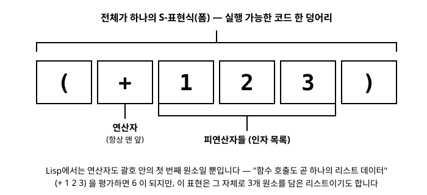

# 3장. 기본 문법과 데이터 타입

[◀ 이전: 2장. 개발 환경 준비와 첫 실행](ch02-개발환경과첫실행.md) | [📖 목차](00-목차.md) | [다음: 4장. 컬렉션: 리스트, 벡터, 맵, 셋 ▶](ch04-컬렉션.md)

---

2장에서 REPL을 켜고 몇 가지 식을 입력해 봤다면, 이미 Clojure 코드가 다른 언어와는 사뭇 다르게 생겼다는 인상을 받았을 것입니다. 괄호가 유난히 많고, 연산자가 피연산자들 사이가 아니라 맨 앞에 나옵니다. 이번 장에서는 이 낯선 겉모습 뒤에 숨어 있는 아주 단순한 규칙을 파헤치고, Clojure가 다루는 기본적인 값들(원자값)을 하나씩 살펴봅니다. 이 장을 마치고 나면 Clojure 코드를 볼 때 "왜 이렇게 생겼지?"라는 의문 대신 "아, 이건 그냥 이런 구조구나"라는 확신을 갖게 될 것입니다.

## S-표현식: 코드를 이루는 단 하나의 규칙

C, Java, Python 같은 언어는 문법 요소마다 생김새가 다릅니다. `if`문이 다르게 생겼고, 함수 호출이 다르게 생겼고, 사칙연산이 다르게 생겼습니다. 그런데 Clojure(그리고 Lisp 계열 언어 전반)는 이 모든 것을 **단 하나의 형태**로 표현합니다. 바로 괄호로 감싼 목록, 이른바 **S-표현식**(S-expression, 줄여서 sexpr)입니다.

S-표현식의 구조는 이렇습니다.

```clojure
(연산자또는함수 인자1 인자2 인자3 ...)
```

괄호를 열고, 맨 앞에 무엇을 할지(함수나 매크로, 특수형)를 적고, 그 뒤에 필요한 인자들을 공백으로 구분해 나열한 뒤, 괄호를 닫습니다. 이것이 전부입니다. 사칙연산도, 함수 호출도, 조건문도, 심지어 함수 정의 자체도 모두 이 하나의 틀 안에서 이루어집니다.

```clojure
(+ 1 2 3)
;; => 6

(* 2 (+ 1 2 3))
;; => 12

(str "안녕" "하세요")
;; => "안녕하세요"

(max 3 7 2)
;; => 7
```

`(+ 1 2 3)`을 보면 `+`가 가장 먼저 나오고, 그 뒤에 더할 값들이 나열됩니다. 이런 표기법을 **접두 표기법**(prefix notation)이라고 부릅니다. `1 + 2 + 3`처럼 연산자가 값들 사이에 끼어 있는 **중위 표기법**(infix notation)에 익숙한 사람에게는 처음엔 낯설지만, 규칙이 단 하나뿐이라는 장점이 금방 드러납니다. 중첩된 계산도 괄호를 겹겹이 쌓기만 하면 됩니다.

```clojure
(* (+ 1 2) (- 10 4))
;; => 18
```

`(+ 1 2)`가 먼저 계산되어 3이 되고, `(- 10 4)`가 계산되어 6이 되고, 마지막으로 `(* 3 6)`이 계산되어 18이 나옵니다. 안쪽 괄호부터 바깥쪽으로 차례차례 평가된다는 것만 기억하면, 아무리 복잡한 식이라도 손으로 따라갈 수 있습니다.

아래는 `(+ 1 2 3)`이라는 S-표현식을 분해한 그림입니다. 괄호 안의 첫 번째 자리는 항상 연산자(또는 함수) 자리이고, 나머지는 그 연산자에 넘겨줄 인자들이라는 점을 기억해 두세요.



### 코드가 곧 데이터: 동형성(Homoiconicity)

여기서 조금 더 깊이 들어가 봅시다. `(+ 1 2 3)`이라는 표현식을 잘 보면, 이것은 사실 **원소가 네 개인 리스트**이기도 합니다: 심볼 `+`, 그리고 숫자 `1`, `2`, `3`. Clojure REPL에서 이 식 앞에 작은따옴표(`'`)를 붙이면, 이 식을 "평가하지 말고 데이터 그 자체로 다뤄 달라"는 뜻이 됩니다.

```clojure
(+ 1 2 3)
;; => 6

'(+ 1 2 3)
;; => (+ 1 2 3)

(list? '(+ 1 2 3))
;; => true

(first '(+ 1 2 3))
;; => +

(count '(+ 1 2 3))
;; => 4
```

`'(+ 1 2 3)`은 평가되지 않고 리스트 그 자체로 남습니다. `first`로 첫 번째 원소를 꺼내 보면 심볼 `+`가 나오고, `count`로 세어 보면 원소가 4개라는 것도 확인됩니다. 즉 **Clojure 코드는 그 자체로 Clojure의 데이터 구조(리스트)와 같은 모습**을 하고 있습니다. 이런 성질을 **동형성**(homoiconicity)이라고 부릅니다.

당장은 "그래서 뭐가 좋은데?"라는 생각이 들 수 있습니다. 이 성질의 진짜 위력은 12장 "매크로 기초"에서 코드를 만들어 내는 코드를 작성할 때 확인하게 됩니다. 지금은 "Clojure에서는 코드와 데이터가 같은 모양을 하고 있다"는 사실만 기억해 두면 충분합니다. 이 장에서는 그 데이터 모양을 이루는 가장 작은 조각들, 즉 원자값을 살펴보겠습니다.

## 원자값(Atomic Value)

리스트나 벡터처럼 여러 값을 묶는 컬렉션(4장에서 다룹니다)과 달리, **원자값**은 더 이상 쪼갤 수 없는 낱개의 값입니다. Clojure의 원자값에는 크게 숫자, 문자열, 문자, 불리언, `nil`, 키워드, 심볼이 있습니다. 하나씩 REPL로 확인해 봅시다.

### 정수

Clojure의 정수 리터럴은 그냥 숫자를 그대로 씁니다. 내부적으로는 `long` 타입을 기본으로 쓰지만, 값이 `long`의 범위를 넘어서면 자동으로 임의 정밀도 정수(`BigInteger`)로 전환되므로 오버플로를 걱정할 필요가 거의 없습니다.

```clojure
42
;; => 42

(type 42)
;; => java.lang.Long

(+ 9223372036854775807 1)
;; => 9223372036854775808N

(type (+ 9223372036854775807 1))
;; => clojure.lang.BigInt
```

숫자 뒤에 붙는 `N`은 이 값이 임의 정밀도 정수(BigInt)라는 표시입니다. 직접 `10N`처럼 써서 처음부터 BigInt로 만들 수도 있습니다.

### 실수(부동소수점)

소수점이 있는 숫자는 실수 리터럴로, 기본적으로 자바의 `double`로 표현됩니다.

```clojure
3.14
;; => 3.14

(type 3.14)
;; => java.lang.Double

(/ 1.0 3)
;; => 0.3333333333333333
```

`double`은 정밀도에 한계가 있어 부동소수점 오차가 발생할 수 있습니다. 금액 계산처럼 정밀도가 중요한 경우에는 숫자 뒤에 `M`을 붙여 임의 정밀도 소수(`BigDecimal`)를 사용합니다.

```clojure
3.14M
;; => 3.14M

(type 3.14M)
;; => java.math.BigDecimal

(+ 0.1M 0.2M)
;; => 0.3M
```

### 비율(Ratio)

Clojure에는 다른 대중적인 언어에서 보기 힘든 독특한 숫자 타입이 하나 있습니다. 바로 **비율**(ratio)입니다. 정수를 정수로 나눴을 때 나누어떨어지지 않으면, Clojure는 실수로 근사시키는 대신 분수 형태 그대로 정확한 값을 유지합니다.

```clojure
(/ 1 3)
;; => 1/3

(type (/ 1 3))
;; => clojure.lang.Ratio

(+ 1/3 1/6)
;; => 1/2

(/ 6 3)
;; => 2
```

`(/ 1 3)`은 근사값 `0.333...`이 아니라 정확한 값 `1/3`을 돌려줍니다. 다만 `(/ 6 3)`처럼 나누어떨어져서 정수가 되는 경우에는 비율이 아니라 정수 `2`로 자동으로 단순화됩니다. 비율은 계산 도중 오차가 누적되는 것을 막고 싶을 때 유용합니다.

### 문자열

문자열은 큰따옴표로 감싼 문자들의 나열입니다. 자바의 `String`을 그대로 사용합니다.

```clojure
"Clojure에 오신 것을 환영합니다"
;; => "Clojure에 오신 것을 환영합니다"

(type "hello")
;; => java.lang.String

(str "안녕" ", " "세상")
;; => "안녕, 세상"

(count "hello")
;; => 5
```

문자열은 여러 줄에 걸쳐 쓸 수도 있습니다. 줄바꿈 문자가 그대로 문자열 안에 포함됩니다.

```clojure
(def 인사말
  "첫째 줄
둘째 줄")

(println 인사말)
;; 첫째 줄
;; 둘째 줄
;; => nil
```

### 문자

문자열과 별개로, **문자**(character) 하나만을 나타내는 타입도 있습니다. 문자 리터럴은 백슬래시(`\`)로 시작합니다.

```clojure
\a
;; => \a

(type \a)
;; => java.lang.Character

\newline
;; => \newline

\space
;; => \space

(str \a \b \c)
;; => "abc"
```

`\newline`, `\space`, `\tab`처럼 특수한 문자에는 이름이 붙은 리터럴도 준비되어 있습니다.

### 불리언

참/거짓을 나타내는 값은 `true`와 `false` 두 가지뿐입니다.

```clojure
true
;; => true

(type false)
;; => java.lang.Boolean

(= 1 1)
;; => true

(= 1 2)
;; => false
```

6장 "제어 흐름"에서 다시 다루겠지만, Clojure에서 조건을 판단할 때 "거짓"으로 취급되는 값은 오직 `false`와 `nil` 두 가지뿐이라는 점을 미리 알아 두면 좋습니다. 숫자 `0`이나 빈 문자열 `""`, 빈 컬렉션은 모두 "참"으로 취급됩니다. 이 점은 `0`이나 빈 문자열을 거짓으로 취급하는 다른 언어(C, Python 등)와 확연히 다르므로 꼭 기억해 두세요.

```clojure
(if 0 "참으로 취급됨" "거짓으로 취급됨")
;; => "참으로 취급됨"

(if "" "참으로 취급됨" "거짓으로 취급됨")
;; => "참으로 취급됨"

(if nil "참으로 취급됨" "거짓으로 취급됨")
;; => "거짓으로 취급됨"
```

### nil

`nil`은 "값이 없음"을 나타내는 특별한 값으로, 자바의 `null`에 대응합니다. 위에서 본 것처럼 `nil`은 불리언 문맥에서 거짓으로 취급됩니다.

```clojure
nil
;; => nil

(nil? nil)
;; => true

(nil? false)
;; => false

(type nil)
;; => nil
```

### 키워드

**키워드**(keyword)는 콜론(`:`)으로 시작하는, 자기 자신을 나타내는 값입니다. "자기 자신을 나타낸다"는 말이 어렵게 들릴 수 있는데, 쉽게 말해 키워드 `:이름`을 평가하면 그냥 `:이름` 그대로가 나온다는 뜻입니다. 변수처럼 어딘가에 바인딩된 다른 값을 찾아가지 않습니다.

```clojure
:이름
;; => :이름

:status
;; => :status

(type :status)
;; => clojure.lang.Keyword

(= :status :status)
;; => true
```

키워드는 주로 맵의 키로 쓰이거나(4장에서 자세히 다룹니다), 어떤 상태나 종류를 표시하는 태그로 쓰입니다. 항상 같은 이름의 키워드는 서로 `=`로 비교했을 때 같다고 판정되므로, 문자열보다 가볍고 비교 속도도 빠릅니다.

```clojure
(def 사용자 {:이름 "김철수" :나이 28 :직업 :개발자})

(:이름 사용자)
;; => "김철수"

(:직업 사용자)
;; => :개발자
```

`(:이름 사용자)`처럼 키워드를 마치 함수인 양 맨 앞에 놓고 맵을 인자로 넘기면, 그 키워드에 해당하는 값을 맵에서 꺼내 옵니다. 이 관용구는 4장에서 맵을 다룰 때 훨씬 자세히 설명합니다.

### 심볼

**심볼**(symbol)은 어떤 값을 가리키는 이름표입니다. `def`로 값을 이름에 묶으면(바인딩하면), 그 이름을 코드에서 사용할 때 Clojure는 심볼을 보고 그 심볼이 가리키는 실제 값을 찾아서 평가합니다.

```clojure
(def 반지름 5)

반지름
;; => 5
```

여기서 `반지름`은 심볼입니다. REPL에 `반지름`이라고만 치면, Clojure는 이 심볼이 가리키는 값 `5`를 찾아서 돌려줍니다. 심볼 자체를 데이터로 다루고 싶다면 키워드처럼 앞에 작은따옴표를 붙여서 평가를 막아야 합니다.

```clojure
'반지름
;; => 반지름

(symbol? '반지름)
;; => true

(type '반지름)
;; => clojure.lang.Symbol
```

`'반지름`은 평가되지 않으므로 5가 아니라 심볼 `반지름` 자체가 나옵니다.

## 키워드와 심볼의 차이

키워드와 심볼은 생김새가 비슷해서(`:이름` vs `이름`) 처음 배우는 사람들이 자주 헷갈리는 부분입니다. 핵심 차이는 다음 한 문장으로 요약됩니다.

> **심볼은 평가되면 자신이 가리키는 값을 찾아가지만, 키워드는 평가되어도 항상 자기 자신입니다.**

표로 정리하면 다음과 같습니다.

| 구분 | 심볼 (`이름`) | 키워드 (`:이름`) |
|---|---|---|
| 평가 결과 | 바인딩된 값을 찾아감 | 항상 자기 자신 |
| 주 용도 | 변수, 함수 이름 참조 | 맵의 키, 상태/종류 태그 |
| 바인딩 여부 | `def`, `let` 등으로 값에 연결됨 | 바인딩되지 않음, 그 자체가 값 |
| 값이 없을 때 | 평가 시 예외 발생 가능 | 항상 유효한 값 |

직접 확인해 봅시다.

```clojure
(def 색깔 "파랑")

색깔
;; => "파랑"        ; 심볼 '색깔'은 바인딩된 값 "파랑"을 찾아감

:색깔
;; => :색깔          ; 키워드는 그 자체가 값

정의되지않은심볼
;; => Syntax error: Unable to resolve symbol: 정의되지않은심볼

:정의되지않은키워드
;; => :정의되지않은키워드   ; 키워드는 정의할 필요 없이 그냥 값으로 존재함
```

`정의되지않은심볼`처럼 `def`로 정의된 적 없는 심볼을 평가하면 오류가 납니다. 반면 `:정의되지않은키워드`는 아무 정의 없이도 그 자체로 완결된 값입니다. 이런 이유로 키워드는 "이 값은 어떤 상태인가"를 표시하는 태그, 맵의 키, 또는 다형성을 다루는 식별자로 매우 자주 쓰입니다.

```clojure
(def 신호등-상태 :빨강)

(cond
  (= 신호등-상태 :빨강) "정지"
  (= 신호등-상태 :노랑) "주의"
  (= 신호등-상태 :초록) "진행"
  :else "알 수 없음")
;; => "정지"
```

`cond`는 6장에서 자세히 다루지만, 위 예제만 보아도 키워드가 "상태를 표현하는 값"으로 얼마나 자연스럽게 쓰이는지 느껴질 것입니다.

### 네임스페이스가 붙은 키워드

키워드는 콜론을 두 개 붙여서(`::이름`) 현재 네임스페이스를 붙이거나, `:네임스페이스/이름`처럼 명시적으로 네임스페이스를 붙일 수도 있습니다. 이렇게 하면 서로 다른 맥락에서 같은 이름을 쓰더라도 충돌 없이 구분할 수 있습니다. 네임스페이스는 10장 "네임스페이스와 코드 구성"에서 본격적으로 다루므로, 지금은 이런 형태가 있다는 정도만 알아 두세요.

```clojure
:user/status
;; => :user/status

(namespace :user/status)
;; => "user"

(name :user/status)
;; => "status"
```

## def로 값 바인딩하기

지금까지 예제에서 이미 여러 번 사용했지만, `def`는 Clojure에서 심볼에 값을 묶는(바인딩하는) 가장 기본적인 방법입니다.

```clojure
(def 파이 3.14159)

파이
;; => 3.14159

(def 최대-사용자수 100)
(def 서비스-이름 "구독관리시스템")
(def 활성화됨? true)

최대-사용자수
;; => 100

서비스-이름
;; => "구독관리시스템"

활성화됨?
;; => true
```

몇 가지 짚고 넘어갈 점이 있습니다.

첫째, Clojure의 이름 짓기 관례는 kebab-case입니다. `maxUserCount`나 `max_user_count`가 아니라 `max-user-count`처럼 하이픈으로 단어를 구분합니다. 이 책의 모든 코드도 이 관례를 따릅니다.

둘째, 참/거짓을 판별하는 값이나 함수의 이름 끝에는 관례적으로 `?`를 붙입니다. 위 예제의 `활성화됨?`이 그 예입니다. 5장에서 함수를 정의할 때 `짝수?`, `빈문자열?`처럼 판별 함수를 만드는 법을 다룹니다.

셋째, `def`로 만든 바인딩은 사실 **네임스페이스에 속한 var**라는 것을 만듭니다. 지금 단계에서는 "`def`는 이름과 값을 연결한다" 정도로 이해하면 충분하지만, 이 개념은 10장에서 네임스페이스를 다룰 때 다시 등장합니다.

넷째, 관용적인 Clojure 코드에서는 `def`를 함수 안에서 남발하지 않습니다. `def`는 주로 네임스페이스 최상위에서 "이 프로그램 전체에서 쓰일 이름"을 정의할 때 사용하고, 함수 내부의 임시 값은 5장과 6장에서 배울 `let`을 사용합니다. 예를 들어 다음 코드는 지양해야 할 패턴입니다.

```clojure
;; 지양할 패턴: 함수 안에서 def 사용
(defn 나쁜-예시 []
  (def 임시값 42)   ;; 이렇게 하면 임시값이 전역에 노출되어 버립니다
  (* 임시값 2))
```

임시로 필요한 값은 `let`을 쓰는 것이 관용적입니다.

```clojure
;; 권장 패턴: let으로 지역 바인딩
(defn 좋은-예시 []
  (let [임시값 42]
    (* 임시값 2)))

(좋은-예시)
;; => 84
```

`let`과 함수 정의(`defn`)는 5장 "함수 정의와 호출"에서 본격적으로 다룹니다.

## 값의 타입을 확인하는 함수들

이번 장에서 여러 타입을 만나면서 `type` 함수를 계속 사용했습니다. 이 밖에도 특정 타입인지 판별해 주는 술어 함수(predicate)들이 미리 준비되어 있어 유용합니다.

```clojure
(number? 42)
;; => true

(string? "hello")
;; => true

(keyword? :status)
;; => true

(symbol? 'x)
;; => true

(boolean? true)
;; => true

(integer? 3.14)
;; => false

(float? 3.14)
;; => true

(ratio? 1/3)
;; => true
```

이 술어 함수들은 이름이 전부 `?`로 끝난다는 공통점이 있습니다. 앞서 이야기한 명명 관례가 Clojure 표준 라이브러리에서도 일관되게 지켜지고 있음을 보여주는 좋은 예입니다.

## 요약

- Clojure의 모든 코드는 `(연산자 인자1 인자2 ...)` 형태의 **S-표현식**으로 이루어지며, 연산자가 맨 앞에 오는 **접두 표기법**을 사용합니다.
- S-표현식은 그 자체로 리스트 데이터이기도 합니다. 코드와 데이터가 같은 모양을 하고 있다는 이 성질을 **동형성**이라 부르며, 12장의 매크로에서 그 진가를 발휘합니다.
- **원자값**에는 정수, 실수, 비율(`1/3`처럼 정확한 분수를 표현), 문자열, 문자, 불리언, `nil`, 키워드, 심볼이 있습니다.
- 정수는 필요하면 자동으로 임의 정밀도(`BigInt`)로 확장되고, `M` 접미사로 임의 정밀도 소수(`BigDecimal`)를 만들 수 있습니다.
- **키워드**(`:이름`)는 평가해도 항상 자기 자신인 값이며, 주로 맵의 키나 상태 태그로 쓰입니다. **심볼**(`이름`)은 평가되면 바인딩된 값을 찾아가는 이름표입니다.
- `def`는 심볼에 값을 바인딩합니다. 다만 관용적인 Clojure에서는 `def`를 최상위 정의에만 사용하고, 함수 내부의 임시 값에는 `let`을 사용합니다(5장에서 자세히 다룹니다).
- 이름 짓기는 kebab-case, 판별 함수와 술어 값은 `?`로 끝내는 관례를 따릅니다.

## 연습문제

1. REPL에서 `(/ 7 2)`, `(/ 7 2.0)`, `(/ 8 2)`를 각각 실행해 보고 결과 타입이 어떻게 달라지는지 `type` 함수로 확인해 보세요. 왜 세 결과의 타입이 서로 다른지 설명해 보세요.
2. `:공룡`이라는 키워드와 `'공룡`이라는(따옴표 붙은) 심볼을 각각 평가했을 때 어떤 값이 나오는지, 그리고 `type`으로 확인했을 때 어떤 타입이 나오는지 적어 보세요.
3. `(def 온도 25)`로 값을 정의한 뒤, `습도`라는 이름은 정의하지 않은 채로 `습도`를 평가하면 어떤 일이 벌어지는지 확인하고, 왜 그런 결과가 나오는지 심볼의 평가 규칙과 연결지어 설명해 보세요.
4. `nil`, `false`, `0`, `""`(빈 문자열)을 각각 `(if 값 "참" "거짓")` 형태로 테스트해서 어느 것이 "거짓"으로 취급되는지 확인해 보세요. 결과가 예상과 다르다면 어떤 부분이 달랐는지 적어 보세요.
5. 여러분 자신을 표현하는 정보(이름, 나이, 좋아하는 언어)를 키워드를 키로 사용하는 맵으로 만들어 `def`로 `내정보`라는 이름에 바인딩하고, `(:이름 내정보)`처럼 키워드를 함수처럼 사용해 각 값을 꺼내 보세요.

---

[◀ 이전: 2장. 개발 환경 준비와 첫 실행](ch02-개발환경과첫실행.md) | [📖 목차](00-목차.md) | [다음: 4장. 컬렉션: 리스트, 벡터, 맵, 셋 ▶](ch04-컬렉션.md)
