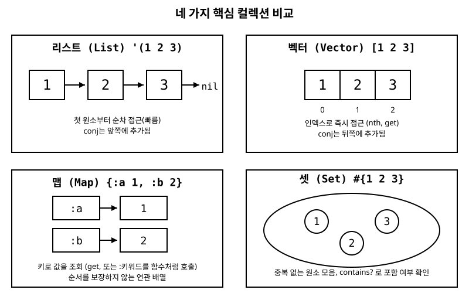

# 4장. 컬렉션: 리스트, 벡터, 맵, 셋

[◀ 이전: 3장. 기본 문법과 데이터 타입](ch03-기본문법과데이터타입.md) | [📖 목차](00-목차.md) | [다음: 5장. 함수 정의와 호출 ▶](ch05-함수.md)

---

3장에서는 더 이상 쪼갤 수 없는 원자값들을 살펴봤습니다. 하지만 실제 프로그램은 값 하나만 가지고 돌아가지 않습니다. 여러 개의 값을 묶어서 다뤄야 할 때가 훨씬 많습니다. 학생들의 점수 목록, 사용자 한 명의 여러 정보, 중복 없는 태그 모음 같은 것들 말이죠. Clojure는 이런 요구에 맞춰 네 가지 핵심 컬렉션을 기본으로 제공합니다: 리스트 `()`, 벡터 `[]`, 맵 `{}`, 셋 `#{}`. 이번 장에서는 이 네 가지가 각각 어떤 상황에 어울리는지, 그리고 서로 어떻게 다른지를 짚어 보겠습니다.

## 왜 컬렉션이 네 가지나 필요할까

다른 언어에서는 흔히 배열(array)이나 리스트(list) 하나로 대부분의 상황을 처리합니다. Clojure가 굳이 네 가지 컬렉션을 구분해서 제공하는 이유는, 각 컬렉션이 서로 다른 **접근 패턴**과 **의미**를 최적화하고 있기 때문입니다.

- 순서대로 하나씩 처리하고 싶다 → 리스트 또는 벡터
- 인덱스로 빠르게 임의의 위치에 접근하고 싶다 → 벡터
- 이름(키)으로 값을 찾고 싶다 → 맵
- 중복을 허용하지 않고 "포함되어 있는가"만 빠르게 확인하고 싶다 → 셋

아래 그림은 네 컬렉션의 내부 구조를 개략적으로 비교한 것입니다. 앞으로의 설명을 읽으면서 이 그림을 참고하면 도움이 됩니다.



## 리스트: `()`

**리스트**(list)는 Lisp 계열 언어의 뿌리와 같은 자료구조로, 내부적으로 단일 연결 리스트(singly-linked list)로 구현되어 있습니다. 즉 각 원소가 "내 값 + 다음 원소를 가리키는 연결"로 이루어져 있어서, 맨 앞 원소부터 순서대로만 효율적으로 접근할 수 있습니다.

```clojure
'(1 2 3 4 5)
;; => (1 2 3 4 5)

(list 1 2 3 4 5)
;; => (1 2 3 4 5)

(type '(1 2 3))
;; => clojure.lang.PersistentList
```

리스트를 만드는 방법은 두 가지입니다. `'(1 2 3 4 5)`처럼 작은따옴표를 붙여 평가를 막거나, `(list 1 2 3 4 5)`처럼 `list` 함수를 호출하는 것입니다. 왜 따옴표가 필요한지는 3장에서 배운 내용과 바로 연결됩니다. 만약 따옴표 없이 `(1 2 3 4 5)`라고 쓰면, Clojure는 이것을 데이터가 아니라 "숫자 `1`을 함수처럼 호출하고 `2 3 4 5`를 인자로 넘기라"는 **실행할 코드**로 해석해서 오류를 냅니다.

```clojure
(1 2 3 4 5)
;; => Execution error: class java.lang.Long cannot be cast to class clojure.lang.IFn
;; (숫자 1을 함수처럼 호출하려다 실패한 것입니다)
```

이 오류 메시지 자체가 3장에서 배운 "코드가 곧 데이터"라는 개념을 정확히 보여줍니다. 괄호로 감싼 것은 기본적으로 "실행할 코드"로 취급되고, 그것을 "데이터"로 취급하고 싶을 때만 따옴표로 표시해 줘야 합니다.

리스트에 새 원소를 추가할 때는 `conj`를 씁니다. 흥미로운 점은 리스트의 경우 `conj`가 **맨 앞**에 원소를 붙인다는 것입니다.

```clojure
(conj '(2 3 4) 1)
;; => (1 2 3 4)

(conj '(1 2 3) 4 5)
;; => (5 4 1 2 3)
```

왜 앞에 붙일까요? 연결 리스트 구조에서는 맨 앞에 새 노드를 하나 만들어 기존 리스트를 가리키게 하는 것이 O(1), 즉 리스트의 길이와 무관하게 항상 일정한 시간이 걸리는 작업입니다. 반면 맨 뒤에 추가하려면 리스트 전체를 처음부터 끝까지 훑어야 하므로 원소 개수에 비례해 시간이 걸립니다(O(n)). 그래서 리스트는 "맨 앞에서 추가하고 맨 앞에서 꺼내는" 스택(stack) 같은 용도, 혹은 함수 호출처럼 순서대로 하나씩 소비하는 코드 표현에 적합합니다.

```clojure
(first '(1 2 3))
;; => 1

(rest '(1 2 3))
;; => (2 3)

(peek '(1 2 3))
;; => 1
```

## 벡터: `[]`

**벡터**(vector)는 실전 Clojure 코드에서 가장 자주 보게 될 컬렉션입니다. 내부적으로 인덱스 기반 트리 구조(정확히는 32갈래 트리)로 구현되어 있어서, 리스트와 달리 임의의 인덱스에 거의 즉시(사실상 O(1)에 가까운 속도로) 접근할 수 있습니다.

```clojure
[1 2 3 4 5]
;; => [1 2 3 4 5]

(vector 1 2 3 4 5)
;; => [1 2 3 4 5]

(type [1 2 3])
;; => clojure.lang.PersistentVector
```

리스트와 결정적으로 다른 점 하나는, **벡터는 따옴표 없이 그대로 써도 데이터로 취급된다**는 것입니다. `[1 2 3]`을 평가하면 그냥 벡터 `[1 2 3]`이 나옵니다. 대괄호는 리스트의 괄호와 달리 "함수 호출"로 해석되지 않기 때문입니다.

```clojure
[1 2 3]
;; => [1 2 3]     ; 따옴표 없이도 그대로 데이터로 평가됨
```

벡터에서는 `nth`나 `get`으로 인덱스 접근을 할 수 있고, 이 접근은 리스트에서 `n`번째 원소를 얻으려고 처음부터 순차적으로 훑는 것보다 훨씬 빠릅니다.

```clojure
(def 과일들 ["사과" "바나나" "체리" "포도"])

(nth 과일들 2)
;; => "체리"

(get 과일들 0)
;; => "사과"

(get 과일들 10)
;; => nil          ; 범위를 벗어나면 get은 nil을 돌려줌 (예외 아님)

(nth 과일들 10)
;; => Execution error: Index out of bounds
```

`get`은 인덱스가 범위를 벗어나도 `nil`을 반환하며 조용히 실패하지만, `nth`는 예외를 던진다는 차이를 기억해 두면 디버깅할 때 도움이 됩니다.

벡터에 `conj`를 쓰면 리스트와 반대로 **맨 뒤**에 원소가 추가됩니다.

```clojure
(conj [1 2 3] 4)
;; => [1 2 3 4]

(conj [1 2 3] 4 5)
;; => [1 2 3 4 5]
```

벡터는 트리 구조 특성상 맨 뒤에 추가하는 것도, 인덱스로 특정 위치의 값을 바꾸는 것도(`assoc`) 모두 빠릅니다.

```clojure
(assoc ["a" "b" "c"] 1 "X")
;; => ["a" "X" "c"]
```

여기서 중요한 점은, `assoc`이 원본 벡터 `["a" "b" "c"]`를 바꾸는 것이 아니라 변경된 내용을 반영한 **새로운 벡터**를 돌려준다는 것입니다. 원본은 그대로 남아 있습니다. 이것이 바로 9장 "불변성과 영속적 자료구조"에서 다룰 핵심 주제인데, 지금은 "Clojure의 컬렉션을 바꾸는 함수들은 사실 원본을 바꾸는 게 아니라 새 컬렉션을 만들어 낸다"는 사실만 기억해 두세요.

```clojure
(def 원본 ["a" "b" "c"])
(def 수정본 (assoc 원본 1 "X"))

원본
;; => ["a" "b" "c"]    ; 그대로!

수정본
;; => ["a" "X" "c"]
```

### 리스트 vs 벡터: 언제 무엇을 쓸까

| 상황 | 추천 컬렉션 | 이유 |
|---|---|---|
| 코드 자체를 표현(매크로 등) | 리스트 | Lisp의 전통적 코드 표현 방식 |
| 맨 앞에서 추가/제거가 잦은 스택 용도 | 리스트 | 앞쪽 연산이 O(1) |
| 일반적인 데이터 모음, 순서 있는 값들 | 벡터 | 인덱스 접근, 뒤쪽 추가 모두 빠름 |
| 함수의 인자 목록을 표기 | 벡터 | Clojure 관례 (`(defn f [a b] ...)`) |

실전에서는 코드를 직접 다루는 매크로 작업이 아닌 이상 **거의 항상 벡터를 기본으로 사용**한다고 봐도 무방합니다. 5장에서 함수를 정의할 때 인자 목록을 대괄호로 감싸는 것도 이런 관례의 연장선입니다.

## 맵: `{}`

**맵**(map)은 키(key)와 값(value)의 쌍으로 이루어진 연관 배열입니다. 다른 언어의 딕셔너리(dictionary)나 해시맵(hash map)에 대응합니다.

```clojure
{:이름 "박영희" :나이 32 :도시 "서울"}
;; => {:이름 "박영희", :나이 32, :도시 "서울"}

(hash-map :이름 "박영희" :나이 32)
;; => {:이름 "박영희", :나이 32}

(type {:a 1})
;; => clojure.lang.PersistentArrayMap
```

맵의 키는 반드시 키워드일 필요는 없습니다. 문자열, 숫자, 심지어 벡터도 키로 쓸 수 있지만, Clojure 관용구에서는 압도적으로 **키워드를 키로 사용하는 것**이 일반적입니다. 3장에서 본 것처럼 키워드는 자기 자신과 비교가 빠르고 가볍기 때문입니다.

### 맵에서 값 꺼내기: 세 가지 방법

맵에서 값을 조회하는 방법은 크게 세 가지가 있고, 실전에서는 상황에 따라 섞어 씁니다.

```clojure
(def 사용자 {:이름 "박영희" :나이 32 :도시 "서울"})

;; 방법 1: get 함수 사용
(get 사용자 :이름)
;; => "박영희"

;; 방법 2: 키워드를 함수처럼 호출 (가장 관용적)
(:이름 사용자)
;; => "박영희"

;; 방법 3: 맵을 함수처럼 호출
(사용자 :이름)
;; => "박영희"
```

세 방법 모두 같은 결과를 내지만, Clojure 커뮤니티에서는 **키워드를 함수처럼 호출하는 두 번째 방식**을 압도적으로 선호합니다. 짧고, 읽기 쉽고, 무엇보다 키워드는 "이 키가 실제로 존재하는가"와 무관하게 항상 안전하게 호출할 수 있기 때문입니다.

```clojure
(:존재하지않는키 사용자)
;; => nil

(get 사용자 :존재하지않는키)
;; => nil

(get 사용자 :존재하지않는키 "기본값")
;; => "기본값"     ; get의 세 번째 인자는 키가 없을 때의 기본값
```

반면 맵을 함수처럼 호출하는 세 번째 방식(`(사용자 :이름)`)은 `사용자` 자리에 온 값이 `nil`일 경우 예외가 나므로 주의가 필요합니다.

```clojure
(nil :이름)
;; => nil           ; 키워드 호출은 안전함

(nil :이름)          ; 위와 동일한 결과

;; 하지만 아래처럼 순서를 반대로 하면:
;; (어떤-nil값 :이름) 대신 무언가를-호출하려는-값이 nil이면
;; "맵을 함수처럼 호출"하는 방식은 위험할 수 있습니다.
```

이런 이유로 실전 코드, 그리고 앞으로 이 책의 모든 예제에서도 `(:키 맵)` 형태를 기본으로 사용하겠습니다.

### 맵 수정하기: assoc, dissoc, update

```clojure
(def 사용자 {:이름 "박영희" :나이 32})

;; 키-값 추가/수정
(assoc 사용자 :도시 "부산")
;; => {:이름 "박영희", :나이 32, :도시 "부산"}

;; 키 제거
(dissoc 사용자 :나이)
;; => {:이름 "박영희"}

;; 기존 값을 함수로 갱신
(update 사용자 :나이 inc)
;; => {:이름 "박영희", :나이 33}

(update 사용자 :나이 + 10)
;; => {:이름 "박영희", :나이 42}
```

벡터의 `assoc`과 마찬가지로, 맵에 대한 이 함수들도 원본은 그대로 두고 변경된 새 맵을 돌려줍니다.

```clojure
사용자
;; => {:이름 "박영희", :나이 32}     ; 원본 그대로!
```

### 중첩된 맵 다루기

실전 데이터는 맵 안에 맵이 들어 있는 경우가 흔합니다. 이럴 때는 `get-in`, `assoc-in`, `update-in`이 유용합니다.

```clojure
(def 회사
  {:이름 "테크컴퍼니"
   :대표 {:이름 "이대표" :나이 45}
   :직원수 120})

(get-in 회사 [:대표 :이름])
;; => "이대표"

(assoc-in 회사 [:대표 :나이] 46)
;; => {:이름 "테크컴퍼니", :대표 {:이름 "이대표", :나이 46}, :직원수 120}

(update-in 회사 [:직원수] inc)
;; => {:이름 "테크컴퍼니", :대표 {:이름 "이대표", :나이 45}, :직원수 121}
```

경로를 벡터로 표현해서 여러 단계 깊이의 값을 한 번에 조회하거나 수정할 수 있다는 점이 특히 편리합니다.

## 셋: `#{}`

**셋**(set)은 중복을 허용하지 않는 원소들의 모음입니다. "이 값이 이 모음 안에 있는가?"를 빠르게 확인하고 싶을 때 사용합니다.

```clojure
#{1 2 3 4}
;; => #{1 4 3 2}      ; 출력 순서는 보장되지 않음

(set [1 2 2 3 3 3])
;; => #{1 3 2}         ; 중복이 자동으로 제거됨

(type #{1 2 3})
;; => clojure.lang.PersistentHashSet
```

`#{1 1 2}`처럼 리터럴 안에 중복된 값을 직접 넣으면 어떻게 될까요? Clojure는 셋 리터럴 자체에 중복이 있는 것을 문법 오류로 취급합니다. 반면 `(set [1 1 2])`처럼 함수로 변환할 때는 중복이 조용히 제거됩니다.

```clojure
#{1 1 2}
;; => Syntax error: Duplicate key: 1

(set [1 1 2])
;; => #{1 2}
```

셋에서 원소 포함 여부를 확인하는 방법도 맵과 마찬가지로 "셋을 함수처럼 호출"하거나 `contains?`를 쓰는 두 가지가 있습니다.

```clojure
(def 허용된-역할 #{:관리자 :편집자 :뷰어})

(:관리자 허용된-역할)
;; => :관리자          ; 있으면 그 값 자체를 돌려줌

(:손님 허용된-역할)
;; => nil              ; 없으면 nil

(contains? 허용된-역할 :편집자)
;; => true

(contains? 허용된-역할 :손님)
;; => false
```

주의할 점 하나. `contains?`는 벡터에 쓰면 "값이 포함되어 있는가"가 아니라 "그 인덱스가 존재하는가"를 확인합니다. 흔히 하는 실수이니 기억해 두세요.

```clojure
(contains? [10 20 30] 20)
;; => false      ; 20이라는 "값"이 아니라 인덱스 20이 있는지를 물어본 것

(contains? [10 20 30] 1)
;; => true       ; 인덱스 1은 존재함 (값은 20)

(contains? #{10 20 30} 20)
;; => true       ; 셋에서는 값 자체의 포함 여부를 확인
```

벡터에서 값의 포함 여부를 확인하려면 `some`이나 `.contains` 같은 다른 도구를 써야 합니다. 이 부분은 8장 "시퀀스 추상화와 고차 함수"에서 다시 다룹니다.

### 집합 연산

셋은 수학의 집합처럼 합집합, 교집합, 차집합 연산을 지원합니다. 이 함수들은 `clojure.set` 네임스페이스에 있으므로, 사용하려면 먼저 불러와야 합니다.

```clojure
(require '[clojure.set :as set])

(def 좋아하는-과일 #{"사과" "바나나" "포도"})
(def 재고있는-과일 #{"바나나" "포도" "수박"})

(set/union 좋아하는-과일 재고있는-과일)
;; => #{"사과" "바나나" "포도" "수박"}

(set/intersection 좋아하는-과일 재고있는-과일)
;; => #{"바나나" "포도"}

(set/difference 좋아하는-과일 재고있는-과일)
;; => #{"사과"}
```

`require`와 `:as`로 별칭을 붙이는 방법은 10장 "네임스페이스와 코드 구성"에서 자세히 설명합니다.

## 네 컬렉션에 공통으로 쓰이는 함수들

리스트, 벡터, 맵, 셋은 서로 생김새와 용도가 다르지만, Clojure는 이들 모두에 똑같이 적용할 수 있는 공통 함수들을 다수 제공합니다. 이것이 가능한 이유는 이 컬렉션들이 모두 공통된 **시퀀스 추상화**를 지원하기 때문인데, 그 원리는 8장에서 본격적으로 다룹니다. 여기서는 자주 쓰는 몇 가지만 먼저 살펴봅니다.

### count: 원소 개수 세기

```clojure
(count '(1 2 3))
;; => 3

(count [1 2 3 4])
;; => 4

(count {:a 1 :b 2})
;; => 2

(count #{1 2 3 4 5})
;; => 5

(count nil)
;; => 0
```

`nil`에 대해서도 `count`를 호출하면 예외 없이 `0`을 돌려준다는 점이 편리합니다.

### empty?: 비어 있는지 확인

```clojure
(empty? [])
;; => true

(empty? [1 2 3])
;; => false

(empty? {})
;; => true

(empty? nil)
;; => true
```

### conj: 원소 추가하기

앞서 봤듯이 `conj`는 컬렉션의 종류에 따라 원소를 추가하는 위치가 다릅니다. 이것은 버그가 아니라 각 컬렉션이 가장 효율적으로 원소를 추가할 수 있는 위치에 넣도록 설계된 것입니다.

```clojure
(conj '(1 2 3) 0)
;; => (0 1 2 3)        ; 리스트는 앞에

(conj [1 2 3] 4)
;; => [1 2 3 4]        ; 벡터는 뒤에

(conj {:a 1} [:b 2])
;; => {:a 1, :b 2}     ; 맵은 [키 값] 쌍의 벡터를 받음

(conj #{1 2 3} 4)
;; => #{1 4 3 2}       ; 셋은 그냥 추가 (이미 있으면 무시)

(conj #{1 2 3} 1)
;; => #{1 3 2}         ; 이미 있는 값은 다시 추가되지 않음
```

### into: 한 컬렉션의 내용을 다른 컬렉션에 쏟아붓기

`into`는 첫 번째 컬렉션에 두 번째 컬렉션의 모든 원소를 하나씩 `conj`한 결과를 돌려줍니다. 컬렉션 간 형태를 바꿀 때 매우 자주 사용됩니다.

```clojure
(into [] '(1 2 3))
;; => [1 2 3]            ; 리스트를 벡터로 변환

(into #{} [1 2 2 3 3])
;; => #{1 3 2}            ; 벡터를 셋으로 변환하면서 중복 제거

(into {} [[:a 1] [:b 2]])
;; => {:a 1, :b 2}        ; [키 값] 쌍의 목록을 맵으로 변환

(into [1 2] [3 4 5])
;; => [1 2 3 4 5]         ; 기존 벡터 뒤에 이어 붙이기
```

`into`의 첫 번째 인자가 "결과의 틀"을 결정한다는 점이 핵심입니다. 빈 벡터 `[]`를 첫 인자로 주면 결과가 벡터가 되고, 빈 셋 `#{}`를 주면 결과가 셋이 됩니다.

### seq: 컬렉션을 시퀀스로 보기

```clojure
(seq [1 2 3])
;; => (1 2 3)

(seq {})
;; => nil

(seq [])
;; => nil

(seq {:a 1 :b 2})
;; => ([:a 1] [:b 2])
```

빈 컬렉션에 `seq`를 호출하면 `nil`이 나온다는 점을 기억해 두세요. 이는 6장 "제어 흐름"에서 "컬렉션이 비어 있는가"를 `(if (seq 컬렉션) ...)` 형태로 검사하는 관용구와 바로 연결됩니다. 맵에 `seq`를 호출하면 각 항목이 `[키 값]` 쌍의 벡터로 이루어진 시퀀스가 나온다는 점도 눈여겨보세요. 이 성질 덕분에 `map`, `filter` 같은 고차 함수를 맵에도 자연스럽게 적용할 수 있습니다. 이 내용은 8장에서 더 깊이 다룹니다.

## 요약

- Clojure는 네 가지 핵심 컬렉션을 제공합니다: **리스트**(`()`, 연결 리스트, 앞쪽 접근/추가에 최적화), **벡터**(`[]`, 인덱스 기반, 임의 접근과 뒤쪽 추가에 최적화), **맵**(`{}`, 키-값 연관 배열), **셋**(`#{}`, 중복 없는 원소 모음).
- 리스트는 괄호로 감싸도 기본적으로 "실행할 코드"로 해석되므로 데이터로 쓰려면 따옴표(`'`)가 필요하지만, 벡터는 따옴표 없이도 데이터로 평가됩니다.
- 맵에서 값을 꺼낼 때는 `(:키 맵)`처럼 키워드를 함수처럼 호출하는 방식이 가장 관용적입니다.
- 셋은 원소 포함 여부를 빠르게 확인하는 데 최적화되어 있으며, `clojure.set`의 `union`, `intersection`, `difference`로 집합 연산을 수행할 수 있습니다.
- `count`, `conj`, `into`, `empty?`, `seq`는 네 컬렉션 모두에 공통으로 쓰이는 함수이며, `conj`가 원소를 추가하는 위치는 컬렉션마다 다릅니다.
- `assoc`, `dissoc`, `update` 등 컬렉션을 "수정"하는 함수는 실제로는 원본을 바꾸지 않고 새 컬렉션을 돌려줍니다. 이 원리는 9장 "불변성과 영속적 자료구조"에서 자세히 다룹니다.

## 연습문제

1. `(conj '(1 2 3) 4)`와 `(conj [1 2 3] 4)`를 각각 실행해서 결과를 비교하고, 왜 두 결과가 다른지 리스트와 벡터의 내부 구조 차이로 설명해 보세요.
2. 세 명의 친구 이름과 나이를 담은 맵을 원소로 갖는 벡터를 만들어 보세요. 예: `[{:이름 "A" :나이 20} {:이름 "B" :나이 25}]`. 그 다음 `get-in`을 사용해 두 번째 친구의 나이를 꺼내 보세요.
3. `#{1 2 3}`과 `#{2 3 4}`에 대해 합집합, 교집합, 차집합을 각각 구해 보고, 두 차집합(`(set/difference a b)`와 `(set/difference b a)`)의 결과가 왜 다른지 설명해 보세요.
4. `(contains? [10 20 30] 20)`의 결과가 왜 `false`인지, 그리고 벡터에서 값 `20`이 들어 있는지 올바르게 확인하려면 어떤 방법을 쓸 수 있을지 찾아보세요.
5. 빈 벡터, 빈 맵, 빈 셋, `nil`에 대해 각각 `empty?`와 `count`를 호출해 보고 결과를 정리해 보세요. 이 결과가 6장에서 배울 조건문 작성에 어떻게 유용할지 생각해 보세요.

---

[◀ 이전: 3장. 기본 문법과 데이터 타입](ch03-기본문법과데이터타입.md) | [📖 목차](00-목차.md) | [다음: 5장. 함수 정의와 호출 ▶](ch05-함수.md)
