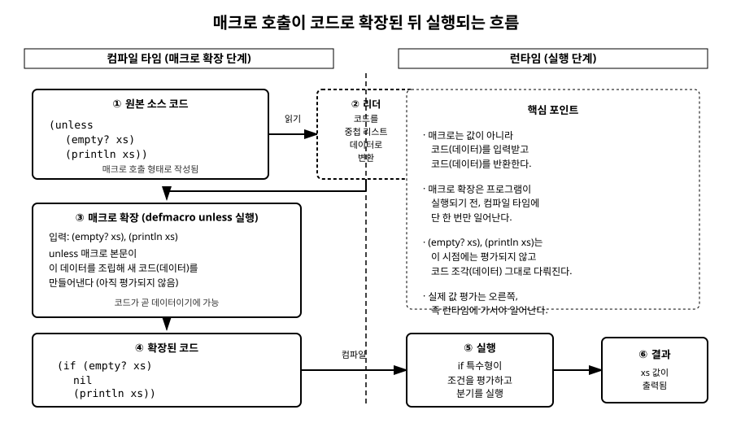

# 12장. 매크로 기초

[◀ 이전: 11장. 구조 분해(Destructuring)](ch11-구조분해.md) | [📖 목차](00-목차.md) | [다음: 13장. 상태와 동시성 모델 ▶](ch13-상태와동시성.md)

---

## 들어가며

지금까지 이 책에서 다룬 것은 전부 **함수**였습니다. 함수는 값을 받아서 값을 돌려주는 존재입니다. 그런데 Clojure에는 함수와 겉모습은 비슷하지만 근본적으로 다르게 동작하는 것이 하나 더 있습니다. 바로 **매크로(macro)**입니다.

매크로는 지금까지 우리가 함수에 대해 가졌던 직관, 즉 "인자를 평가한 값을 넘겨받는다"는 전제를 깨뜨립니다. 매크로는 인자를 값이 아니라 **코드 그 자체**로 받아서, 코드를 조립해 또 다른 코드를 만들어내는 도구입니다. 이 장에서는 매크로가 함수와 어떻게 다른지, 그리고 왜 Clojure 같은 Lisp 계열 언어에서만 이런 것이 자연스럽게 가능한지부터 차근차근 살펴보겠습니다.

매크로는 강력한 만큼 조심스럽게 다뤄야 하는 도구이기도 합니다. 이 장을 마칠 때쯤에는 매크로가 정확히 무엇을 하는지 이해하고, `defmacro`로 간단한 매크로를 직접 만들 수 있고, 언제 매크로를 쓰지 말아야 하는지도 판단할 수 있게 되는 것이 목표입니다.

## 매크로와 함수의 근본적 차이

### 함수: 값을 계산하는 존재

함수를 호출하면 어떤 일이 벌어질까요? 아래 예를 봅시다.

```clojure
(defn add [a b]
  (+ a b))

(add (+ 1 2) (* 2 5))
;; => 13
```

`add`를 호출하기 전에, Clojure는 먼저 `(+ 1 2)`와 `(* 2 5)`라는 인자 표현식을 **각각 평가**해서 `3`과 `10`이라는 값을 만듭니다. 그리고 나서야 `add` 함수 몸체가 `3`, `10`이라는 **이미 계산된 값**을 받아 실행됩니다. 즉 함수 호출은 다음 순서로 진행됩니다.

1. 인자 표현식들을 평가해서 값으로 만든다 (런타임에 값 계산)
2. 계산된 값들을 함수에 넘긴다
3. 함수 몸체가 그 값을 가지고 무언가를 계산해 반환한다

함수는 철저하게 **런타임에 값을 계산하는 존재**입니다. 함수는 자신에게 전달된 코드가 원래 어떻게 생겼었는지 알 방법이 없습니다. `(add (+ 1 2) (* 2 5))`이든 `(add 3 10)`이든, `add` 입장에서는 그저 `a`가 3이고 `b`가 10일 뿐입니다.

### 매크로: 코드를 조립하는 존재

이번엔 매크로를 하나 살펴봅시다. 아직 문법을 배우지 않았으니 우선 결과만 관찰해봅시다. Clojure에 기본으로 들어있는 `when` 역시 매크로입니다.

```clojure
(macroexpand '(when true (println "참입니다")))
;; => (if true (do (println "참입니다")) nil)
```

`when`은 `true`나 `(println ...)`을 평가해서 값을 만드는 것이 아니라, `(when 조건 본문...)`이라는 **코드 조각을 통째로 받아서**, `(if 조건 (do 본문...) nil)`이라는 **다른 코드 조각으로 바꿔치기**했습니다. 이 변환은 프로그램이 실행되기 전, 즉 **컴파일 타임**에 일어납니다. `true`가 실제로 평가되어 진위 값이 확인되는 것은 그 다음 단계, 즉 변환된 `if` 코드가 실제로 실행되는 런타임의 일입니다.

정리하면 이렇습니다.

| | 함수 | 매크로 |
|---|---|---|
| 받는 것 | 평가된 **값** | 평가되지 않은 **코드(폼)** |
| 하는 일 | 값을 계산해서 값을 반환 | 코드를 조립해서 코드를 반환 |
| 언제 동작하는가 | 런타임 (프로그램 실행 중) | 컴파일 타임 (실행되기 전, 딱 한 번) |
| 반환값의 운명 | 그 자체가 최종 결과 | 다시 컴파일되어 실행되어야 진짜 결과가 나옴 |

이 차이를 한 문장으로 요약하면, **함수는 "무엇을 계산할지"를 다루고, 매크로는 "어떤 코드를 실행할지"를 다룬다**는 것입니다. 매크로는 실행되기 전에 프로그램의 모양 자체를 바꿔버리는 컴파일 타임의 코드 변환기입니다.

## 코드가 곧 데이터: 매크로가 가능한 이유

그런데 애초에 어떻게 코드를 "조립"할 수 있다는 것일까요? 이는 Lisp 계열 언어의 오래된 특징인 **호모아이코니시티(homoiconicity)**, 즉 "코드가 곧 데이터"라는 성질 덕분입니다.

### 리스트는 실행할 코드이자, 그냥 데이터이다

3장과 4장에서 배웠듯이, Clojure의 소스 코드는 사실 괄호로 둘러싸인 **리스트**로 이루어져 있습니다. `(+ 1 2)`라는 코드를 다시 살펴봅시다.

```clojure
(+ 1 2)
;; => 3

'(+ 1 2)
;; => (+ 1 2)

(type '(+ 1 2))
;; => clojure.lang.PersistentList

(first '(+ 1 2))
;; => +

(rest '(+ 1 2))
;; => (1 2)
```

작은따옴표(`'`)를 붙여 인용(quote)하면, `(+ 1 2)`는 "실행할 코드"가 아니라 그저 "`+`라는 심볼과 `1`, `2`라는 숫자로 이루어진 리스트"라는 평범한 데이터로 취급됩니다. `first`, `rest` 같은, 우리가 4장에서 컬렉션을 다룰 때 썼던 바로 그 함수로 코드를 분해할 수 있다는 사실이 핵심입니다.

다른 언어(예: C, Java, Python)에서는 소스 코드의 문자열 텍스트와, 그 언어가 다루는 데이터(정수, 문자열, 리스트 등)가 전혀 다른 세계에 존재합니다. 소스 코드를 프로그램 안에서 데이터처럼 조립하려면 별도의 파서나 AST(추상 구문 트리) 라이브러리가 필요합니다. 하지만 Clojure에서는 소스 코드 자체가 이미 리스트, 벡터, 심볼, 키워드 같은 **평범한 Clojure 데이터**입니다. 우리가 이미 4장에서 배운 리스트 조작 도구들이, 곧 "코드를 조작하는 도구"이기도 한 것입니다.

### 이것이 매크로에게 어떤 의미인가

매크로는 바로 이 성질을 이용합니다. 매크로가 호출되면, Clojure는 그 호출부 전체 — 함수처럼 평가된 인자가 아니라 **괄호로 감싸인 코드 자체** — 를 데이터(리스트)로 매크로에게 넘깁니다. 매크로는 이 리스트 데이터를 여느 리스트 다루듯이 자유롭게 조립하고 가공해서 **새로운 리스트(즉, 새로운 코드)**를 만들어 돌려줍니다. Clojure 컴파일러는 그 결과물을 원래 있던 자리에 그대로 심어넣고, 마치 처음부터 그 코드가 쓰여 있었던 것처럼 컴파일을 계속 진행합니다.

즉 "코드가 곧 데이터"라는 성질이 없었다면, 매크로가 코드를 조립해서 반환한다는 개념 자체가 성립하기 어려웠을 것입니다. 매크로는 리스트를 조작하는 평범한 Clojure 코드일 뿐이고, 다만 그 재료와 결과물이 우연히도 "또 다른 Clojure 코드"라는 점이 특별할 뿐입니다.

## defmacro 기초 문법

이제 실제로 매크로를 만들어 봅시다. `defmacro`는 `defn`과 형태가 매우 비슷합니다.

```clojure
(defmacro macro-name [param1 param2 ...]
  ;; 여기서 param들은 평가되지 않은 '코드 조각'으로 들어온다
  ;; 몸체는 최종적으로 '새로운 코드'를 리스트나 다른 폼으로 만들어 반환해야 한다
  ...)
```

가장 단순한 매크로부터 만들어보겠습니다. 인자로 받은 표현식을 두 번 평가하는 매크로입니다.

```clojure
(defmacro twice [expr]
  (list 'do expr expr))

(twice (println "안녕"))
;; => 안녕
;; => 안녕
```

`twice`가 받은 `expr`은 `(println "안녕")`을 평가한 결과(즉 `nil`)가 아니라, `(println "안녕")`이라는 **코드 조각 그 자체**입니다. 매크로 몸체는 `(list 'do expr expr)`를 실행해서 `(do (println "안녕") (println "안녕"))`이라는 **새로운 코드**를 만들어 반환합니다. 이 반환값이 원래 `(twice (println "안녕"))`이 있던 자리에 그대로 대치되고, 그 자리에서 실제로 실행됩니다.

`macroexpand-1`이나 `macroexpand`로 이 확장 과정을 직접 눈으로 확인할 수 있습니다.

```clojure
(macroexpand-1 '(twice (println "안녕")))
;; => (do (println "안녕") (println "안녕"))
```

매크로를 호출하는 코드를 작성할 때 `expr`이 평가되지 않은 채로 넘어온다는 사실이 처음에는 낯설 수 있습니다. 함수라면 `(println "안녕")`을 즉시 실행하고 그 결과인 `nil`을 넘겼겠지만, 매크로는 실행하지 않은 `(println "안녕")`이라는 **폼(form)** 그 자체를 손에 쥐고 있다가, 그것을 원하는 만큼 코드에 삽입할 수 있습니다.

## 백틱과 언쿼트: `, ~, ~@

방금 `(list 'do expr expr)`처럼 `list`, `quote`(`'`)를 조합해서 코드를 조립했습니다. 이 방식은 코드가 조금만 복잡해져도 매우 번거로워집니다. 그래서 Clojure는 코드 조립을 훨씬 편하게 해주는 세 가지 문법 도구를 제공합니다.

### 백틱(`): 신태틱 쿼트

백틱(\`)은 작은따옴표(`'`)와 비슷하게 "이 뒤에 오는 걸 평가하지 말고 데이터로 취급해라"는 뜻이지만, 두 가지가 다릅니다.

1. 백틱은 심볼 앞에 네임스페이스를 자동으로 붙여줍니다(이는 매크로가 예상치 못한 이름 충돌을 일으키지 않도록 돕는 안전장치입니다).
2. 백틱 안에서는 `~`(언쿼트)를 이용해 "이 부분만은 평가해서 그 값을 끼워 넣어라"고 예외를 둘 수 있습니다.

```clojure
`(a b c)
;; => (user/a user/b user/c)

(def x 10)
`(a b ~x)
;; => (user/a user/b 10)
```

`~x`가 있는 자리에는 `x`라는 심볼 그대로가 아니라, `x`를 평가한 값인 `10`이 끼워 들어갔습니다. 백틱과 언쿼트를 함께 쓰면 "틀은 코드 모양 그대로 두고, 특정 부분만 실제 값이나 다른 코드로 갈아끼우는" 작업이 매우 직관적으로 표현됩니다.

방금 만든 `twice`를 백틱으로 다시 써보면 다음과 같습니다.

```clojure
(defmacro twice [expr]
  `(do ~expr ~expr))

(macroexpand-1 '(twice (println "안녕")))
;; => (do (println "안녕") (println "안녕"))
```

`(list 'do expr expr)`보다 `` `(do ~expr ~expr) ``가 실제로 만들어질 코드의 모양을 훨씬 직관적으로 보여줍니다. 이것이 실전에서 대부분의 매크로가 `list`, `cons` 같은 함수 대신 백틱과 언쿼트 조합을 쓰는 이유입니다.

### 언쿼트-스플라이싱(~@): 시퀀스를 풀어서 끼워 넣기

`~`는 값을 하나 끼워 넣지만, 그 값이 시퀀스(리스트나 벡터)이고 그 안의 요소들을 낱개로 풀어서 끼워 넣고 싶을 때는 `~@`(언쿼트-스플라이싱)을 사용합니다.

```clojure
(def args ['(println "하나") '(println "둘") '(println "셋")])

`(do ~args)
;; => (do [(println "하나") (println "둘") (println "셋")])
;; args 벡터 자체가 하나의 값으로 끼워 들어감 (원하는 결과 아님)

`(do ~@args)
;; => (do (println "하나") (println "둘") (println "셋"))
;; args 안의 요소들이 각각 풀려서 do 안에 나열됨
```

`~`는 "이 값 하나를 그대로 넣어라"이고, `~@`는 "이 시퀀스를 감싼 껍데기(벡터나 리스트 자체)는 버리고, 안의 요소들을 그 자리에 펼쳐 넣어라"입니다. 여러 개의 표현식을 받아 처리하는 매크로를 만들 때 `~@`는 거의 필수적으로 등장합니다.

## 나만의 조건부 매크로 만들기

이제 배운 내용을 종합해서, `if`의 반대 의미로 동작하는 `unless` 매크로를 직접 만들어 보겠습니다. `unless`는 "조건이 거짓일 때만 본문을 실행한다"는 뜻으로, 여러 Lisp 계열 언어에 흔히 있는 관용구입니다. (참고로 Clojure core에는 `unless`가 기본 제공되지 않으므로, 우리가 직접 만들어보는 것이 좋은 연습이 됩니다.)

### 1단계: 원하는 동작 정의하기

`(unless (empty? xs) (println xs))`라고 쓰면, `(empty? xs)`가 거짓일 때만 `(println xs)`가 실행되기를 바랍니다. 이는 다음 `if` 코드와 동일한 의미입니다.

```clojure
(if (empty? xs)
  nil
  (println xs))
```

### 2단계: 매크로로 이 변환을 자동화하기

```clojure
(defmacro unless [condition body]
  `(if ~condition
     nil
     ~body))
```

### 3단계: macroexpand로 확장 결과 검증하기

```clojure
(macroexpand-1 '(unless (empty? xs) (println xs)))
;; => (if (empty? xs) nil (println xs))
```

기대한 그대로 확장되었습니다. 실제로 호출해서 동작을 확인해봅시다.

```clojure
(def xs [1 2 3])
(unless (empty? xs) (println "비어있지 않습니다:" xs))
;; => 비어있지 않습니다: [1 2 3]

(def ys [])
(unless (empty? ys) (println "비어있지 않습니다:" ys))
;; (아무 것도 출력되지 않음)
```

### 4단계: 본문을 여러 개 받을 수 있게 확장하기

지금의 `unless`는 본문을 딱 하나만 받을 수 있습니다. 여러 표현식을 순서대로 실행하고 싶다면 가변 인자와 `~@`를 함께 사용합니다.

```clojure
(defmacro unless [condition & body]
  `(if ~condition
     nil
     (do ~@body)))

(macroexpand-1 '(unless (empty? xs)
                  (println "처리 시작")
                  (println xs)
                  (println "처리 끝")))
;; => (if (empty? xs) nil (do (println "처리 시작") (println xs) (println "처리 끝")))
```

`& body`로 여러 개의 표현식을 리스트로 모으고, `~@body`로 그 표현식들을 `do` 안에 낱개로 펼쳐 넣었습니다. 이제 `unless`는 `when`의 반대 버전처럼 동작합니다.

```clojure
(unless (empty? xs)
  (println "처리 시작")
  (println xs)
  (println "처리 끝"))
;; => 처리 시작
;; => [1 2 3]
;; => 처리 끝
```

### 왜 이것을 함수로는 만들 수 없을까

여기서 중요한 질문을 던져 봅시다. "`unless`를 함수로 만들면 안 될까요?" 시도해보겠습니다.

```clojure
(defn unless-as-fn [condition body]
  (if condition
    nil
    body))
```

이 함수를 호출하면 무슨 일이 벌어질까요?

```clojure
(unless-as-fn (empty? []) (println "실행됨"))
;; => 실행됨       <- println이 즉시 실행되어 부작용이 나타나 버림!
;; => nil          <- 함수의 반환값
```

함수는 인자를 넘기기 **전에** 반드시 평가해야 하므로, `(println "실행됨")`이 함수 몸체에 들어가기도 전에 이미 실행되어 버립니다. 조건이 참이든 거짓이든 상관없이 `println`의 부작용(콘솔 출력)이 무조건 일어나버리는 것입니다. 이것이 `unless`가 함수로는 절대 구현될 수 없는 이유입니다. **"조건에 따라 표현식을 아예 평가하지 않는다"는 동작은, 인자를 미리 평가하는 함수의 본질과 정면으로 충돌합니다.** 이런 지연 평가(제어 흐름)를 다루려면 매크로처럼 코드 자체를 손에 쥐고 컴파일 타임에 조립할 수 있는 도구가 필요합니다. 6장에서 배운 `if`, `when`, `cond` 같은 제어 흐름 특수형과 매크로들이 전부 이런 이유로 함수가 아니라 매크로(혹은 특수형)로 구현되어 있는 것입니다.

## 매크로 호출부터 실행까지의 흐름 한눈에 보기

지금까지 설명한 과정 — 소스 코드가 읽히고, 매크로가 그 코드를 데이터로 받아 새 코드로 확장하고, 그 확장된 코드가 컴파일되어 실행되는 흐름 — 을 그림으로 정리하면 다음과 같습니다.



그림에서 보듯, `(unless (empty? xs) (println xs))`라는 원본 코드는 리더에 의해 리스트 데이터로 변환되고, `unless` 매크로가 이 데이터를 조립해 `(if (empty? xs) nil (println xs))`라는 새로운 코드(역시 데이터)를 만들어냅니다. 이 모든 과정은 프로그램이 실행되기 전, 컴파일 타임에 단 한 번만 일어납니다. 그 후에야 확장된 `if` 코드가 컴파일되어, 런타임에 실제로 조건이 평가되고 분기가 실행됩니다. 매크로를 이해하는 데 있어 이 "컴파일 타임에 확장 → 런타임에 실행"이라는 두 단계 구분이 가장 핵심적인 그림입니다.

## macroexpand 계열 함수들

매크로를 작성하다 보면 "내가 만든 매크로가 실제로 어떤 코드로 확장되는지" 확인하고 싶을 때가 매우 많습니다. Clojure는 이를 위한 도구를 여러 개 제공합니다.

```clojure
;; 한 단계만 확장
(macroexpand-1 '(unless true (println "x")))
;; => (if true nil (do (println "x")))

;; 결과가 또 다른 매크로 호출이면 더 이상 매크로가 아닐 때까지 반복 확장
(macroexpand '(unless true (println "x")))
;; => (if true nil (do (println "x")))

;; clojure.walk/macroexpand-all은 중첩된 하위 폼까지 전부 재귀적으로 확장
(require '[clojure.walk :as walk])
(walk/macroexpand-all '(unless true (when false (println "x"))))
;; => (if true nil (do (if false (do (println "x")) nil)))
```

`macroexpand-1`은 딱 한 번만 확장하고, `macroexpand`는 결과가 여전히 매크로 호출 형태이면 매크로가 아닌 형태가 나올 때까지 반복해서 확장합니다. `clojure.walk/macroexpand-all`은 폼 안에 중첩된 하위 매크로 호출까지 전부 재귀적으로 확장해서 최종 모습을 보여줍니다. 매크로를 새로 만들 때마다 이 함수들로 확장 결과를 검증하는 습관을 들이면 디버깅 시간이 크게 줄어듭니다.

## 매크로를 남용하지 말아야 하는 이유

매크로는 매력적인 도구지만, 실전 Clojure 코드에서는 "가능하면 함수로 해결하고, 정말 필요할 때만 매크로를 쓴다"는 원칙이 매우 강하게 지켜집니다. 그 이유를 몇 가지 짚어보겠습니다.

### 1. 함수는 값이지만 매크로는 값이 아니다

함수는 그 자체로 일급 값입니다. 변수에 담을 수도 있고, 다른 함수에 인자로 넘길 수도 있고, `map`, `filter`, `reduce` 같은 고차 함수와 조합할 수도 있습니다.

```clojure
(defn double-it [x] (* 2 x))
(map double-it [1 2 3])
;; => (2 4 6)
```

하지만 매크로는 값이 아닙니다. 매크로 이름을 변수에 담거나 `map`에 넘기는 것은 불가능합니다.

```clojure
(map unless [true false true])
;; => Syntax error: Can't take value of a macro
```

매크로는 오직 코드 상에 직접 호출되는 형태로만 등장할 수 있습니다. 이 때문에 매크로로 짠 로직은 함수보다 훨씬 유연성이 떨어집니다.

### 2. 매크로는 디버깅과 추론을 어렵게 만든다

함수 호출은 "인자를 평가하고 함수를 실행한다"는 하나의 단순한 규칙만 알면 어떤 코드든 그 동작을 추론할 수 있습니다. 반면 매크로는 저마다 다른 규칙으로 코드를 변형하므로, 매크로가 많아질수록 "이 코드가 실제로 무엇으로 확장되어 실행되는지"를 매번 `macroexpand`로 확인해야 하는 부담이 커집니다. 스택 트레이스에도 매크로 확장 후의 코드가 나타나기 때문에, 원래 작성한 코드와 실제 실행되는 코드 사이의 간극이 클수록 디버깅이 어려워집니다.

### 3. 대부분의 문제는 함수로 충분히 해결된다

"값을 계산해서 반환"하는 문제는 거의 예외 없이 함수로 해결됩니다. 매크로가 진짜로 필요한 경우는 다음처럼 **평가 시점 자체를 제어**해야 하는 상황들로 제한적입니다.

- 조건에 따라 코드의 일부를 아예 평가하지 않아야 할 때 (`unless`, `when`, `and`, `or`처럼)
- 반복되는 상용구 코드를 코드 조립으로 자동 생성하고 싶을 때 (예: `defrecord`, `deftest` 같은 정의 매크로)
- 새로운 문법적 형태(예: 스레딩 매크로 `->`, `->>`)를 언어에 추가하고 싶을 때

예를 들어 다음 두 코드를 비교해봅시다.

```clojure
;; 매크로로 만들 필요가 없는 경우: 그냥 함수로 충분하다
(defn add-tax-bad-as-macro [price]  ; 매크로일 필요가 전혀 없음
  (* price 1.1))

;; 이런 것은 함수로 만드는 것이 항상 옳다
(defn add-tax [price]
  (* price 1.1))

(map add-tax [1000 2000 3000])
;; => (1100.0 2200.0 3300.0)
```

`add-tax`는 값을 받아 값을 반환할 뿐, 평가 시점을 제어할 이유가 전혀 없습니다. 이런 로직을 매크로로 만들면 `map`과 조합할 수 없게 되는 등 손해만 볼 뿐 아무런 이득이 없습니다. **"이 로직이 인자를 평가하지 않고 그대로 다뤄야 할 이유가 있는가?"**라고 스스로 물어서, 그 답이 "아니오"라면 항상 함수를 선택해야 합니다.

## 요약

- 함수는 평가된 값을 받아 값을 계산하는 런타임의 존재이고, 매크로는 평가되지 않은 코드(폼)를 받아 새로운 코드를 조립해 반환하는 컴파일 타임의 존재입니다.
- Clojure의 소스 코드는 그 자체로 리스트, 벡터, 심볼 같은 평범한 데이터입니다. 이 "코드가 곧 데이터"라는 성질(호모아이코니시티) 덕분에 매크로가 코드를 데이터처럼 조립할 수 있습니다.
- `defmacro`로 매크로를 정의하며, 매크로 몸체는 최종적으로 새로운 코드(리스트 등)를 반환해야 합니다.
- 백틱(`` ` ``)은 코드 틀을 만들고, 언쿼트(`~`)는 그 틀 안의 특정 값을 끼워 넣고, 언쿼트-스플라이싱(`~@`)은 시퀀스를 풀어서 여러 요소로 끼워 넣습니다.
- `macroexpand-1`, `macroexpand`, `clojure.walk/macroexpand-all`로 매크로가 실제로 어떤 코드로 확장되는지 항상 검증할 수 있고, 검증하는 습관이 중요합니다.
- 매크로 호출은 컴파일 타임에 다른 코드로 확장된 뒤, 그 확장된 코드가 런타임에 비로소 평가·실행됩니다.
- 매크로는 값이 아니므로 고차 함수와 조합할 수 없고, 디버깅과 추론을 어렵게 만들 수 있습니다. 평가 시점 자체를 제어해야 하는 경우가 아니라면 항상 함수를 먼저 고려해야 합니다.

## 연습문제

1. 다음 두 문장 중 어느 쪽이 맞는 설명인지 근거와 함께 서술하세요. "함수는 인자를 평가한 다음 넘기고, 매크로는 인자를 평가하지 않은 채로 넘겨받는다" vs "함수와 매크로 모두 인자를 평가한 다음 넘겨받지만, 매크로만 그 결과를 다시 컴파일한다".

2. `condition`이 참이면 `then-expr`을, 거짓이면 `else-expr`을 평가하되, `then-expr`과 `else-expr`이 둘 다 실행 전에는 부작용을 일으키지 않아야 하는 매크로 `my-if`를 `defmacro`로 만들어 보세요. (힌트: 이미 있는 `if` 특수형을 이용해 백틱과 언쿼트로 코드를 조립하면 됩니다.) 그런 다음 `macroexpand-1`로 확장 결과를 확인하세요.

3. 다음 매크로 확장 결과를 손으로 먼저 예측해보고, 실제로 `macroexpand-1`을 호출해 맞았는지 확인하세요.

    ```clojure
    (defmacro my-when [condition & body]
      `(if ~condition (do ~@body) nil))

    (macroexpand-1 '(my-when (pos? x) (println "양수") (println "확인 끝")))
    ```

4. 다음 중 매크로로 만들어야 하는 경우와 함수로 만들어야 하는 경우를 구분하고, 그 이유를 각각 한 문장으로 설명하세요.
    - (a) 두 정수를 받아 더 큰 값을 반환하는 로직
    - (b) 조건이 거짓일 때는 인자로 넘어온 로깅 코드를 아예 실행하지 않는 로직
    - (c) 문자열 리스트를 받아 모두 대문자로 바꾸는 로직

5. `~@`(언쿼트-스플라이싱)를 빼고 `~`만 사용해서 `unless`를 다음처럼 작성하면 어떤 문제가 생기는지 `macroexpand-1`로 확인하고 설명하세요.

    ```clojure
    (defmacro unless-broken [condition & body]
      `(if ~condition nil (do ~body)))
    ```

---

[◀ 이전: 11장. 구조 분해(Destructuring)](ch11-구조분해.md) | [📖 목차](00-목차.md) | [다음: 13장. 상태와 동시성 모델 ▶](ch13-상태와동시성.md)
