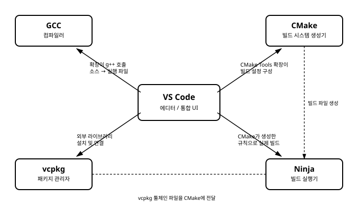

# 1장. 이 강좌의 목표와 전체 그림

[◀ 이전: 목차](00-목차.md) | [📖 목차](00-목차.md) | [다음: 2장. GCC 설치와 커맨드라인 컴파일 ▶](ch02-GCC설치와커맨드라인컴파일.md)

## 왜 C++ 개발환경은 유난히 복잡하게 느껴질까

파이썬을 처음 배우는 사람은 인터프리터 하나만 설치하면 바로 코드를 실행할 수 있습니다. `python hello.py` 한 줄이면 끝입니다. 자바스크립트도 비슷합니다. Node.js를 설치하고 `node app.js`를 치면 결과가 나옵니다. 최근에는 이런 언어들도 패키지 관리자(pip, npm)나 가상환경 도구가 붙으면서 조금씩 복잡해지고 있지만, 그래도 "언어 실행기 하나"가 중심에 있고 나머지는 그 주변에 얹혀 있는 구조입니다.

C++은 사정이 다릅니다. C++ 코드 한 줄을 실행 가능한 프로그램으로 만들려면 최소한 다음 네 가지 역할이 필요합니다.

첫째, 소스 코드를 기계어로 바꿔주는 **컴파일러**가 있어야 합니다. 둘째, 소스 파일이 여러 개로 늘어나고 프로젝트가 커지면 "무엇을 어떤 순서로, 어떤 옵션으로 컴파일할지"를 관리해주는 **빌드 시스템**이 필요합니다. 셋째, 남이 만들어 둔 유용한 라이브러리(문자열 처리, 네트워크, JSON 파싱 등)를 가져다 쓰려면 이를 내려받고 버전을 관리해주는 **패키지 관리자**가 필요합니다. 넷째, 이 모든 과정을 매번 터미널 명령으로 손으로 치는 대신 버튼 클릭과 단축키로 처리하고, 코드 자동완성과 디버깅까지 지원해줄 **에디터/IDE**가 필요합니다.

문제는 이 네 가지가 파이썬의 `python`이나 `pip`처럼 하나의 회사, 하나의 팀이 만든 일체형 도구가 아니라는 점입니다. 컴파일러는 GNU 프로젝트가, 에디터는 마이크로소프트가, 빌드 시스템은 Kitware라는 별도의 회사가, 패키지 관리자는 또 다른 오픈소스 커뮤니티가 각자의 목적과 철학에 따라 독립적으로 만들었습니다. 각 도구는 자기 몫의 일만 정확히 할 뿐, 서로를 알지 못합니다. 컴파일러는 "누가 나를 어떤 빌드 시스템으로 호출하는지" 관심이 없고, 에디터는 "지금 프로젝트에 어떤 컴파일러가 설치되어 있는지" 스스로 알아내지 못합니다. 이 도구들을 서로 "연결"하는 일, 즉 에디터가 컴파일러의 위치를 알게 하고, 빌드 시스템이 컴파일러에게 올바른 옵션을 넘기게 하고, 패키지 관리자가 내려받은 라이브러리를 빌드 시스템이 찾을 수 있게 만드는 일이 바로 C++ 개발환경 구축의 본체입니다.

이 책은 C++ 문법을 가르치지 않습니다. `for` 문을 어떻게 쓰는지, 클래스를 어떻게 설계하는지는 다루지 않습니다. 대신 위에서 말한 네 가지 역할을 각각 어떤 도구로 채우고, 그 도구들을 어떻게 서로 이어 붙여서 "코드 한 줄 작성 → 빌드 → 실행 → 디버깅"이 매끄럽게 돌아가는 하나의 파이프라인을 만들 것인지, 그 과정을 실습 위주로 설명합니다.

## 이 책에서 다룰 5가지 핵심 도구

### GCC — 컴파일러

GCC(GNU Compiler Collection)는 C, C++을 포함한 여러 언어의 소스 코드를 실제 기계어로 번역하는 컴파일러 모음입니다. 이 책에서 사용할 `g++` 명령은 GCC 중에서도 C++ 코드를 컴파일하도록 설정된 프론트엔드입니다. 결국 우리가 작성한 `.cpp` 파일이 실행 파일(`.exe` 또는 리눅스의 실행 바이너리)로 바뀌는 마지막 관문은 항상 컴파일러입니다. 뒤에서 다룰 CMake도, VS Code도, 결국은 이 GCC를 "대신 호출해주는" 역할을 할 뿐이며, 실제로 소스를 기계어로 바꾸는 주체는 언제나 GCC입니다. 2장에서 GCC를 설치하고 커맨드라인에서 직접 호출하는 법부터 시작하는 이유가 여기에 있습니다. 다른 도구들이 무엇을 "대신 해주는지" 이해하려면, 먼저 그 도구가 없을 때 무엇을 손으로 해야 하는지 알아야 하기 때문입니다.

### VS Code — 에디터

Visual Studio Code는 마이크로소프트가 만든 무료 코드 에디터로, 코드 작성, 자동완성, 빌드 실행, 디버깅을 하나의 창 안에서 처리할 수 있게 해줍니다. VS Code 자체는 C++을 전혀 알지 못하는 범용 에디터이지만, C/C++ 확장을 비롯한 여러 확장을 설치하면 GCC를 호출하는 버튼, 코드 자동완성, 중단점을 걸고 변수를 들여다보는 디버깅 기능이 모두 활성화됩니다. 이 책에서 VS Code는 나머지 네 도구(GCC, CMake, Ninja, vcpkg)를 사용자가 일일이 터미널에 명령으로 치지 않고도 다룰 수 있게 해주는 "조종석" 역할을 맡습니다. 3장부터 5장까지 VS Code 설정을 집중적으로 다루는 것도 이 때문입니다.

### CMake — 빌드 시스템 생성기

프로젝트에 소스 파일이 하나둘 늘어나기 시작하면 `g++ a.cpp b.cpp c.cpp -o app` 같은 명령을 매번 손으로 관리하는 일이 금방 감당하기 어려워집니다. CMake는 이런 컴파일 명령을 직접 실행하는 도구가 아니라, "이 프로젝트는 이런 소스 파일들로 이루어져 있고, 이런 라이브러리에 의존하며, 이런 옵션으로 컴파일해야 한다"는 설계도(`CMakeLists.txt`)를 읽어서, 실제 빌드를 수행할 도구(예를 들어 뒤에서 배울 Ninja나 Make)를 위한 빌드 규칙을 자동으로 만들어주는 **빌드 시스템 생성기**입니다. 즉 CMake는 목수가 아니라 설계도를 보고 목수에게 줄 작업 지시서를 뽑아내는 역할이라고 볼 수 있습니다. 6장과 7장에서 이 CMake를 자세히 다룹니다.

### Ninja — 빌드 실행기

CMake가 작업 지시서를 만들면, 그 지시서를 받아 실제로 GCC를 호출하고 파일을 컴파일하는 주체가 필요합니다. 이 역할을 하는 것이 Ninja입니다. Ninja는 오직 속도에 최적화된 아주 단순한 빌드 실행기로, 사람이 직접 편집하는 파일이라기보다는 CMake 같은 상위 도구가 자동으로 만들어내는 `build.ninja` 파일을 읽어 "무엇이 바뀌었는지"를 최소한으로 확인하고 필요한 부분만 다시 컴파일합니다. 즉 CMake와 Ninja는 한 쌍으로 움직입니다. CMake가 설계도를 그리면 Ninja가 그 설계도대로 실제 망치질을 하는 셈입니다. 8장에서 Ninja 자체를, 9장에서 VS Code가 CMake와 Ninja를 함께 자동으로 다뤄주는 CMake Tools 확장을 다룹니다.

### vcpkg — 패키지 관리자

문자열을 다루거나, JSON을 파싱하거나, 네트워크 통신을 하는 기능이 필요할 때마다 이를 처음부터 직접 구현하는 것은 비효율적입니다. 다른 언어에서는 pip나 npm 같은 패키지 관리자가 이런 라이브러리를 손쉽게 설치해주지만, C++은 언어 표준에 공식 패키지 관리자가 포함되어 있지 않습니다. vcpkg는 마이크로소프트가 만들고 유지하는 오픈소스 C++ 라이브러리 관리자로, 수천 개의 오픈소스 C++ 라이브러리를 검색하고 설치하고, 그 결과를 CMake가 곧바로 찾아 쓸 수 있는 형태로 연결해줍니다. 10장부터 12장까지 vcpkg 설치, 개별 라이브러리 사용, manifest 모드를 통한 프로젝트별 의존성 관리를 다룹니다.

## 다섯 도구가 맞물리는 전체 그림

이 다섯 가지 도구는 각자 따로 존재하는 것이 아니라, 아래 그림처럼 하나의 흐름으로 연결됩니다. VS Code가 중심에서 나머지 도구를 호출하는 창구 역할을 하고, vcpkg가 내려받은 라이브러리 정보를 CMake에 전달하면, CMake는 이를 바탕으로 빌드 규칙을 만들어 Ninja에 넘기고, Ninja는 그 규칙에 따라 GCC를 호출해 실제 실행 파일을 만들어냅니다.

처음 이 그림을 보면 도구가 너무 많아 부담스러울 수 있습니다. 하지만 이 책은 정확히 이 순서대로, 한 번에 도구 하나씩만 추가하면서 진행됩니다. 2장에서는 VS Code도 CMake도 없이 GCC만으로 커맨드라인에서 컴파일하는 가장 원초적인 방법부터 시작합니다. 그다음 VS Code를 얹고, CMake와 Ninja를 얹고, 마지막에 vcpkg로 외부 라이브러리를 가져오는 순서로 한 켜씩 쌓아 올릴 것입니다. 매 장마다 이전 장에서 다룬 도구는 그대로 유지한 채 새 도구 하나만 추가되므로, 전체 그림이 한 번에 이해되지 않더라도 걱정할 필요는 없습니다.

## 이 책을 다 읽고 나면

이 책의 마지막 장을 덮을 때쯤이면, 여러분은 다음과 같은 것을 할 수 있게 됩니다. VS Code 하나만 열어서, 여러 개의 소스 파일로 구성되고 vcpkg를 통해 외부 라이브러리(예를 들어 JSON 파싱 라이브러리나 테스트 프레임워크)를 사용하는 C++ 프로젝트를, CMake와 Ninja를 통해 빌드하고, 중단점을 걸어가며 디버깅하고, Windows뿐 아니라 macOS나 Linux에서도 큰 수정 없이 동일하게 빌드되도록 구성하는 능력입니다. 이는 실무에서 C++ 프로젝트를 새로 시작하거나, 남이 만든 C++ 프로젝트에 합류했을 때 곧바로 개발환경을 세팅할 수 있는 실전 능력이기도 합니다.

다음 장부터는 이 모든 것의 출발점인 GCC 설치와 커맨드라인 컴파일부터 시작하겠습니다.

## 요약

- C++ 개발환경이 복잡하게 느껴지는 이유는 컴파일러, 빌드 시스템, 패키지 관리자, 에디터가 서로 다른 주체가 만든 독립적인 도구이며, 이들을 개발자가 직접 연결해야 하기 때문입니다.
- 이 책은 GCC(컴파일러), VS Code(에디터), CMake(빌드 시스템 생성기), Ninja(빌드 실행기), vcpkg(패키지 관리자)라는 다섯 가지 도구를 순서대로 쌓아 올리는 방식으로 구성됩니다.
- CMake는 실제로 컴파일을 수행하지 않고 빌드 규칙(설계도)을 만들며, 그 규칙을 받아 실제로 컴파일러를 호출하는 것은 Ninja의 역할입니다.
- 이 책을 마치면 VS Code 하나로 외부 라이브러리를 사용하는 크로스플랫폼 C++ 프로젝트를 빌드하고 디버깅할 수 있게 됩니다.

## 연습문제

1. 파이썬이나 자바스크립트의 개발환경과 비교했을 때, C++ 개발환경이 여러 도구로 나뉘어 있는 근본적인 이유를 자신의 말로 설명해 보세요.
2. GCC, CMake, Ninja 세 도구의 역할 차이를 한 문장씩으로 요약해 보세요. 특히 CMake와 Ninja의 관계를 "설계도"와 "시공"에 비유해 설명해 보세요.
3. vcpkg가 없다면 외부 C++ 라이브러리를 사용하기 위해 어떤 수작업이 필요할지 상상해서 나열해 보세요.
4. 이 책의 1장에서 소개한 다섯 도구 중, 현재 자신의 컴퓨터에 이미 설치되어 있는 도구가 있는지 확인해 보세요.

---

[◀ 이전: 목차](00-목차.md) | [📖 목차](00-목차.md) | [다음: 2장. GCC 설치와 커맨드라인 컴파일 ▶](ch02-GCC설치와커맨드라인컴파일.md)
