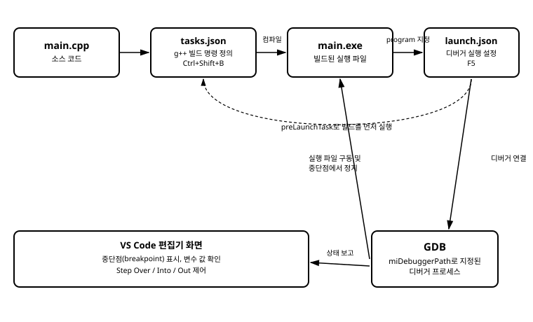

# 4장. VS Code로 빌드하고 디버깅하기

[◀ 이전: 3장. VS Code 설치와 C/C++ 확장](ch03-VSCode설치와Cpp확장.md) | [📖 목차](00-목차.md) | [다음: 5장. IntelliSense 설정 ▶](ch05-IntelliSense설정.md)


3장에서는 VS Code 터미널 패널에서 `g++ --version`을 실행해 GCC가 정상적으로 인식되는지 확인했습니다. 하지만 이 상태에서 실제로 코드를 빌드하려면 여전히 터미널에 `g++ main.cpp -o main.exe` 같은 명령을 손으로 입력해야 합니다. 파일이 하나뿐인 지금은 크게 불편하지 않지만, 파일 개수가 늘어나고 옵션이 복잡해질수록 매번 같은 명령을 다시 입력하는 일은 번거로워지고 실수도 잦아집니다.

이 장에서는 VS Code에게 "빌드"라는 동작이 정확히 무엇을 의미하는지 설정 파일로 알려주고, 단축키 한 번으로 그 동작을 실행하는 방법을 다룹니다. 나아가 빌드된 실행 파일을 디버거에 연결해서, 코드를 한 줄씩 멈춰 가며 변수 값을 눈으로 확인하는 방법까지 익힙니다. 이 두 가지를 담당하는 설정 파일이 각각 `tasks.json`과 `launch.json`이며, 둘 다 3장에서 살펴본 `.vscode` 폴더 안에 저장됩니다.

## 실습 준비: 프로젝트 폴더 구성

먼저 실습용 폴더를 하나 만들고 VS Code로 엽니다.

```bash
mkdir build-debug-demo
cd build-debug-demo
code .
```

이 폴더 안에 `main.cpp` 파일을 만들고 다음 코드를 입력합니다. 디버깅 실습을 위해 변수 몇 개를 두고 값을 바꿔가는 간단한 코드로 구성했습니다.

```cpp
#include <iostream>

int square(int n) {
    int result = n * n;
    return result;
}

int main() {
    int total = 0;
    for (int i = 1; i <= 5; ++i) {
        int s = square(i);
        total += s;
        std::cout << i << "의 제곱: " << s << std::endl;
    }
    std::cout << "합계: " << total << std::endl;
    return 0;
}
```

이제 이 파일을 빌드하고 디버깅할 수 있도록 VS Code 설정을 구성해 봅니다.

## tasks.json: VS Code에게 "빌드"를 정의하기

`tasks.json`은 VS Code가 실행할 수 있는 반복 작업(task)을 정의하는 설정 파일입니다. 빌드뿐 아니라 테스트 실행, 정리(clean) 작업 등 명령줄로 실행할 수 있는 모든 작업을 태스크로 등록할 수 있지만, 이 장에서는 가장 기본이 되는 빌드 태스크를 만들어 봅니다.

태스크를 만드는 가장 쉬운 방법은 명령 팔레트를 이용하는 것입니다. `Ctrl+Shift+P`를 눌러 명령 팔레트를 열고 "Tasks: Configure Default Build Task"를 입력해 선택합니다. 이어서 나오는 목록에서 "Create tasks.json file from template"을 고르고, 템플릿 종류로 "Others"를 선택하면 `.vscode/tasks.json`이 생성됩니다. 이 파일을 열어 다음과 같이 내용을 채웁니다.

```json
{
    "version": "2.0.0",
    "tasks": [
        {
            "label": "g++로 빌드",
            "type": "shell",
            "command": "g++",
            "args": [
                "-g",
                "${file}",
                "-o",
                "${fileDirname}/${fileBasenameNoExtension}.exe"
            ],
            "options": {
                "cwd": "${fileDirname}"
            },
            "group": {
                "kind": "build",
                "isDefault": true
            },
            "problemMatcher": ["$gcc"]
        }
    ]
}
```

이 설정에서 눈여겨볼 항목은 다음과 같습니다.

- `command`: 실행할 프로그램입니다. 2장과 3장에서 PATH에 등록해 둔 `g++`를 그대로 사용합니다.
- `args`: `command`에 전달할 인자 목록입니다. 배열의 각 항목이 명령줄에서 공백으로 구분된 하나의 인자에 대응합니다. `-g`는 디버그 정보를 실행 파일에 포함시키는 옵션으로, 이 정보가 있어야 뒤에서 다룰 디버거가 소스 코드 줄 번호와 변수 이름을 알아볼 수 있습니다.
- `${file}`, `${fileDirname}`, `${fileBasenameNoExtension}`: VS Code가 제공하는 변수입니다. 각각 "현재 편집기에서 열려 있는 파일의 전체 경로", "그 파일이 있는 폴더 경로", "확장자를 뺀 파일 이름"으로 치환됩니다. 즉 `main.cpp`를 열어 놓고 빌드하면 `main.cpp`와 같은 폴더에 `main.exe`가 만들어집니다.
- `group.kind`와 `isDefault`: 이 태스크를 "빌드" 종류의 기본 태스크로 지정합니다. 이렇게 지정해 두면 `Ctrl+Shift+B`를 눌렀을 때 태스크 선택 메뉴를 거치지 않고 바로 이 태스크가 실행됩니다.
- `problemMatcher`: 명령 실행 결과(컴파일러의 출력)를 분석해서 오류와 경고를 VS Code의 "문제" 패널에 연결해 주는 설정입니다. `$gcc`는 VS Code에 내장된, GCC 출력 형식을 인식하는 패턴입니다. 이 설정 덕분에 컴파일 오류가 나면 해당 줄로 바로 이동할 수 있습니다.

파일을 저장한 뒤 `main.cpp`를 열어 놓은 상태에서 `Ctrl+Shift+B`를 눌러 봅니다. 화면 아래 터미널 패널에 `g++` 명령이 그대로 실행되는 모습이 출력되고, 오류가 없다면 같은 폴더에 `main.exe`가 생성됩니다. 상단 메뉴의 `터미널 > 작업 실행`(Terminal > Run Task)에서도 같은 태스크를 선택해 실행할 수 있습니다.

여기서 중요한 점은, `tasks.json`이 하는 일이 특별한 마법이 아니라는 사실입니다. VS Code는 단지 `command`와 `args`에 적힌 대로 터미널에서 명령을 대신 입력해 주는 것뿐입니다. 즉 지금 `Ctrl+Shift+B`로 실행한 결과는 2장에서 손으로 입력했던 `g++ main.cpp -o main.exe` 명령과 본질적으로 같습니다. 다만 매번 다시 입력할 필요 없이 설정 파일에 한 번 적어 두고 재사용할 수 있게 된 것입니다.

## launch.json: 디버거 실행 설정

빌드된 실행 파일을 그냥 실행하는 것과, 디버거에 연결해서 실행하는 것은 다릅니다. 디버거에 연결하려면 VS Code에게 "어떤 디버거를, 어떤 실행 파일에 대해, 어떤 옵션으로 실행할지"를 알려주어야 하는데, 이 정보를 담는 파일이 `launch.json`입니다.

왼쪽 액티비티 바에서 재생 버튼에 벌레가 붙은 모양의 아이콘(실행 및 디버그)을 클릭하거나 `Ctrl+Shift+D`를 누릅니다. 아직 설정이 없다면 "launch.json 파일 만들기"라는 링크가 보이는데, 이를 클릭하고 환경으로 "C++ (GDB/LLDB)"를 선택하면 `.vscode/launch.json`이 생성됩니다. 생성된 내용을 다음과 같이 정리합니다.

```json
{
    "version": "0.2.0",
    "configurations": [
        {
            "name": "g++로 빌드하고 디버그",
            "type": "cppdbg",
            "request": "launch",
            "program": "${fileDirname}/${fileBasenameNoExtension}.exe",
            "args": [],
            "stopAtEntry": false,
            "cwd": "${fileDirname}",
            "environment": [],
            "externalConsole": false,
            "MIMode": "gdb",
            "miDebuggerPath": "C:/msys64/ucrt64/bin/gdb.exe",
            "setupCommands": [
                {
                    "description": "gdb의 정돈된 출력 형식 사용",
                    "text": "-enable-pretty-printing",
                    "ignoreFailures": true
                }
            ],
            "preLaunchTask": "g++로 빌드"
        }
    ]
}
```

각 항목의 역할을 살펴보겠습니다.

- `type`: `cppdbg`는 C/C++ 확장이 제공하는 디버거 어댑터의 종류로, GDB나 LLDB, Visual Studio 디버거를 이 어댑터를 통해 사용합니다.
- `request`: `launch`는 VS Code가 실행 파일을 새로 실행시키면서 디버거를 붙인다는 뜻입니다. 이미 실행 중인 프로세스에 나중에 연결하는 `attach` 방식도 있지만, 이 강좌에서는 다루지 않습니다.
- `program`: 디버깅할 실행 파일의 경로입니다. `tasks.json`에서 만든 `main.exe`와 정확히 같은 경로를 가리켜야 합니다. 경로가 어긋나면 "실행 파일을 찾을 수 없다"는 오류가 납니다.
- `MIMode`와 `miDebuggerPath`: `MIMode`는 사용할 디버거의 종류를 GDB로 지정합니다. `miDebuggerPath`는 그 GDB 실행 파일이 실제로 어디에 있는지 알려주는 경로입니다. 2장에서 MSYS2로 GCC 툴체인을 설치했다면 GDB도 함께 설치되어 있으며, 위 예시처럼 `ucrt64\bin\gdb.exe` 경로에 위치합니다. 자신의 설치 경로가 다르다면 터미널에서 `where gdb`(PowerShell에서는 `Get-Command gdb`)를 실행해 정확한 경로를 확인하고 그 값을 넣어야 합니다.
- `preLaunchTask`: 디버깅을 시작하기 전에 자동으로 실행할 태스크의 `label`을 지정합니다. 여기서는 앞서 `tasks.json`에 등록한 `"g++로 빌드"`를 지정했습니다. 이 설정이 있으면 F5를 누를 때마다 최신 소스 코드로 먼저 다시 빌드한 뒤 디버거가 그 결과물을 실행합니다. 이 한 줄이 `tasks.json`과 `launch.json`을 연결하는 고리입니다. 이 연결이 없다면, 코드를 고치고 나서 디버거를 실행해도 이전에 빌드해 둔 오래된 실행 파일이 그대로 실행되는 문제가 생길 수 있습니다.

두 설정 파일이 실제로 어떻게 이어지는지는 다음 그림에서 확인할 수 있습니다.



소스 코드는 `tasks.json`에 정의된 `g++` 명령을 거쳐 실행 파일로 만들어지고, `launch.json`은 `preLaunchTask`로 그 빌드 과정을 먼저 호출한 뒤 `program`에 지정된 실행 파일을 GDB에 넘겨 디버깅을 시작합니다.

## 중단점 찍고 F5로 디버그 시작하기

이제 실제로 디버깅을 해 봅니다. `main.cpp` 편집기 화면에서 `int s = square(i);` 줄의 왼쪽, 줄 번호가 표시되는 여백 부분을 클릭합니다. 빨간 점이 나타나면 그 줄에 중단점(breakpoint)이 설정된 것입니다. 중단점은 프로그램 실행을 그 줄 직전에서 멈추게 하는 표시입니다.

중단점을 설정했다면 `F5`를 누릅니다. `launch.json`에 설정해 둔 `preLaunchTask` 덕분에 먼저 빌드가 실행되고, 빌드가 성공하면 곧바로 디버거가 `main.exe`를 실행합니다. 프로그램은 `for` 반복문이 처음 그 줄에 도달했을 때, 즉 `i`가 1일 때 멈춥니다. 화면 위쪽에는 재생, 스텝 오버, 스텝 인투, 스텝 아웃, 재시작, 정지 아이콘이 나열된 디버그 툴바가 나타나고, 왼쪽에는 변수 값을 보여주는 "변수(Variables)" 패널이 열립니다.

이 상태에서 왼쪽 변수 패널을 보면 `i`, `total` 같은 지역 변수의 현재 값을 바로 확인할 수 있습니다. 변수 이름 위에 마우스를 가져다 대도 같은 값이 툴팁으로 표시됩니다. 이렇게 프로그램을 멈춘 시점의 메모리 상태를 눈으로 들여다볼 수 있다는 것이 디버거의 가장 기본적이면서도 강력한 기능입니다.

디버그 툴바의 각 버튼은 다음과 같이 동작합니다.

- **계속(Continue, F5)**: 다음 중단점을 만날 때까지, 또는 프로그램이 끝날 때까지 실행을 계속합니다.
- **스텝 오버(Step Over, F10)**: 현재 줄을 실행하고 다음 줄로 넘어갑니다. 현재 줄이 함수 호출이라면 그 함수 내부로 들어가지 않고 호출이 끝난 결과만 반영한 채 다음 줄로 이동합니다.
- **스텝 인투(Step Into, F11)**: 현재 줄이 함수 호출이라면 그 함수 내부의 첫 줄로 들어갑니다. 예를 들어 `square(i)` 호출 줄에서 스텝 인투를 누르면 `square` 함수 안, `int result = n * n;` 줄로 커서가 이동합니다.
- **스텝 아웃(Step Out, Shift+F11)**: 현재 실행 중인 함수의 나머지 부분을 마저 실행하고, 그 함수를 호출한 곳으로 돌아옵니다. `square` 함수 안에서 스텝 아웃을 누르면 `total += s;` 줄로 돌아옵니다.

실습 삼아 `square(i)` 호출 줄에서 스텝 인투를 눌러 `square` 함수 내부로 들어가 보고, `n`과 `result` 변수 값이 호출될 때마다 바뀌는 모습을 변수 패널에서 관찰해 봅니다. 이어서 스텝 아웃으로 `main` 함수로 돌아온 뒤, 스텝 오버를 반복해서 `total`이 1, 5, 14, 30, 55로 누적되는 과정을 한 줄씩 따라가 봅니다. 코드를 눈으로만 읽을 때는 놓치기 쉬운 세부 동작이, 이렇게 한 줄씩 멈춰서 값을 확인하면 훨씬 명확하게 드러납니다.

## 자주 겪는 문제 확인하기

디버깅 환경을 처음 구성할 때 자주 마주치는 문제 몇 가지를 미리 짚어 두겠습니다.

첫째, F5를 눌렀을 때 "프로그램을 찾을 수 없습니다"라는 오류가 나온다면 `launch.json`의 `program` 경로와 `tasks.json`이 실제로 만들어 내는 실행 파일 경로가 서로 다른 경우가 대부분입니다. 두 파일에서 파일 이름과 확장자, 폴더 구조가 정확히 일치하는지 다시 확인합니다.

둘째, 중단점에 빨간 점 대신 속이 빈 회색 원이 표시된다면, 실행 중인 프로그램이 그 줄에 대한 디버그 정보를 갖고 있지 않다는 뜻입니다. `tasks.json`의 `args`에 `-g` 옵션이 빠지지 않았는지 확인합니다. 이 옵션이 없으면 실행 파일은 정상적으로 만들어지지만 디버거가 소스 코드와 실행 위치를 연결하지 못합니다.

셋째, "디버거를 시작할 수 없습니다" 또는 GDB 관련 오류가 나온다면 `miDebuggerPath`에 적은 경로에 실제로 `gdb.exe`가 있는지 확인합니다. 2장에서 GCC를 설치한 방식에 따라 GDB의 설치 여부와 경로가 다를 수 있으므로, 터미널에서 `gdb --version`을 직접 실행해 GDB 자체가 인식되는지부터 확인하는 것이 좋습니다.

## 요약

- `tasks.json`은 VS Code에게 "빌드"라는 작업이 구체적으로 어떤 명령인지 알려주는 설정 파일이며, `command`와 `args`에 컴파일러 명령을 그대로 옮겨 적는다.
- `Ctrl+Shift+B`는 `group.kind`가 `build`이고 `isDefault`가 `true`로 지정된 태스크를 곧바로 실행한다.
- `launch.json`은 디버거 실행 설정 파일이며, `type: cppdbg`, `program`(실행 파일 경로), `MIMode`, `miDebuggerPath`(GDB 실행 파일 경로)를 지정한다.
- `preLaunchTask`는 `launch.json`이 `tasks.json`의 태스크를 실행한 뒤 디버깅을 시작하도록 연결해 주며, 이 설정 덕분에 F5를 누를 때마다 최신 코드로 다시 빌드한 실행 파일을 디버깅하게 된다.
- 중단점을 찍고 F5를 누르면 그 줄 직전에서 실행이 멈추고, 변수 패널에서 현재 값을 확인할 수 있다.
- 스텝 오버, 스텝 인투, 스텝 아웃은 각각 함수를 건너뛰며 진행하기, 함수 내부로 들어가기, 현재 함수를 마치고 빠져나오기에 대응한다.

## 연습문제

1. `tasks.json`의 `args` 배열에서 `-g` 옵션을 제거하고 다시 빌드한 뒤 F5로 디버깅을 시도해 보고, 중단점 표시가 어떻게 달라지는지 관찰하시오.
2. `tasks.json`에서 `${fileBasenameNoExtension}.exe` 대신 고정된 이름(예: `app.exe`)을 사용하도록 바꾸고, `launch.json`의 `program` 값도 그에 맞게 수정해 두 파일이 여전히 정상적으로 연결되는지 확인하시오.
3. 본문의 예제 코드에서 `square` 함수 안에 새 중단점을 추가하고, 스텝 인투와 스텝 아웃을 번갈아 사용하며 `n`, `result`, `total` 값의 변화를 표로 정리해 보시오.
4. `launch.json`의 `preLaunchTask` 항목을 지운 뒤, 소스 코드를 수정하고 다시 F5를 눌러 어떤 현상이 나타나는지 확인하고 그 이유를 설명하시오.
5. 터미널에서 `where gdb` 또는 `Get-Command gdb`를 실행해 자신의 시스템에 설치된 GDB 경로를 확인하고, 이 경로가 `launch.json`의 `miDebuggerPath` 값과 일치하는지 점검하시오.

---

[◀ 이전: 3장. VS Code 설치와 C/C++ 확장](ch03-VSCode설치와Cpp확장.md) | [📖 목차](00-목차.md) | [다음: 5장. IntelliSense 설정 ▶](ch05-IntelliSense설정.md)
