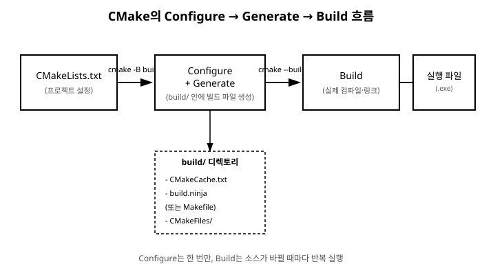

# 7장. CMake 프로젝트 구조화

[◀ 이전: 6장. CMake 기초](ch06-CMake기초.md) | [📖 목차](00-목차.md) | [다음: 8장. Ninja 빌드 시스템 ▶](ch08-Ninja빌드시스템.md)


6장에서는 `CMakeLists.txt` 한 개로 소스 파일 하나를 빌드하는 가장 단순한 형태를 다루었습니다. 하지만 실제 프로젝트는 소스 파일이 수십, 수백 개로 늘어나고, 재사용 가능한 기능은 라이브러리로 분리하며, 폴더 구조도 역할에 따라 나뉘는 것이 일반적입니다. 이번 장에서는 여러 디렉토리와 여러 소스 파일로 이루어진 프로젝트를 CMake로 어떻게 구조화하는지 살펴봅니다.

## 실전 프로젝트 구조 만들기

먼저 계산 유틸리티 라이브러리와 이를 사용하는 실행 파일로 이루어진 간단한 프로젝트를 예로 들어보겠습니다. 폴더 구조는 다음과 같습니다.

```text
calc_app/
├── CMakeLists.txt
├── include/
│   └── mathkit/
│       └── calculator.h
├── src/
│   ├── calculator.cpp
│   └── main.cpp
```

헤더 파일과 소스 파일을 분리하는 이유는 단순합니다. `include/` 아래에는 외부(다른 타겟이나 다른 프로젝트)에 공개할 인터페이스만 두고, `src/` 아래에는 실제 구현과 그 구현에서만 필요한 내부 헤더를 둡니다. 이렇게 나누면 나중에 라이브러리를 분리하거나 재사용할 때 "무엇을 공개해야 하는가"가 폴더 구조만 봐도 분명해집니다.

`include/mathkit/calculator.h`처럼 헤더를 라이브러리 이름으로 한 번 더 감싼 하위 폴더에 두는 것도 실전에서 자주 쓰는 관례입니다. 이렇게 하면 코드에서 `#include <mathkit/calculator.h>`처럼 라이브러리 출처가 드러나는 경로로 헤더를 포함할 수 있어, 여러 라이브러리를 함께 쓸 때 헤더 이름 충돌을 피하는 데도 도움이 됩니다.

각 파일의 내용은 다음과 같이 구성합니다.

```cpp
// include/mathkit/calculator.h
#pragma once

namespace mathkit {

class Calculator {
public:
    int add(int a, int b) const;
    int multiply(int a, int b) const;
};

}  // namespace mathkit
```

```cpp
// src/calculator.cpp
#include "mathkit/calculator.h"

namespace mathkit {

int Calculator::add(int a, int b) const {
    return a + b;
}

int Calculator::multiply(int a, int b) const {
    return a * b;
}

}  // namespace mathkit
```

```cpp
// src/main.cpp
#include <iostream>

#include "mathkit/calculator.h"

int main() {
    mathkit::Calculator calc;
    std::cout << "3 + 4 = " << calc.add(3, 4) << '\n';
    std::cout << "3 * 4 = " << calc.multiply(3, 4) << '\n';
    return 0;
}
```

이제 이 구조를 빌드할 `CMakeLists.txt`를 작성해 보겠습니다.

## 라이브러리 만들기: add_library()

`calculator.cpp`처럼 여러 곳에서 재사용할 코드는 실행 파일에 직접 포함시키기보다 별도의 라이브러리 타겟으로 만드는 편이 좋습니다. CMake에서는 `add_library()` 명령으로 라이브러리 타겟을 정의합니다.

```cmake
add_library(mathkit STATIC
    src/calculator.cpp
)
```

`add_library()`의 두 번째 인자는 라이브러리 종류를 지정합니다.

- `STATIC`: 정적 라이브러리. 컴파일 시점에 실행 파일 안으로 코드가 통째로 복사되어 들어갑니다(`.a`, `.lib` 확장자).
- `SHARED`: 공유 라이브러리. 실행 파일과 별도의 파일로 존재하다가 프로그램 실행 시점에 로드됩니다(`.so`, `.dll` 확장자).
- 인자를 생략하면 `BUILD_SHARED_LIBS` 변수 값에 따라 STATIC 또는 SHARED 중 하나로 자동 결정됩니다.

정적 라이브러리는 배포할 파일이 실행 파일 하나로 끝나 관리가 단순하고, 공유 라이브러리는 여러 실행 파일이 같은 라이브러리를 공유해 디스크와 메모리를 절약할 수 있습니다. 학습 단계나 소규모 프로젝트에서는 STATIC으로 시작하는 것이 무난합니다.

## target_include_directories(): 헤더 경로는 타겟별로

라이브러리를 사용하는 쪽(`main.cpp`)에서 `mathkit/calculator.h`를 찾으려면 컴파일러에게 `include/` 폴더의 위치를 알려줘야 합니다. 예전 CMake 스크립트에서는 다음과 같이 전역 명령을 쓰는 경우가 많았습니다.

```cmake
# 오래된 방식 - 권장하지 않음
include_directories(include)
```

`include_directories()`는 이 명령이 호출된 시점 이후 정의되는 **디렉토리 안의 모든 타겟**에 해당 경로를 적용합니다. 프로젝트가 작을 때는 문제가 없어 보이지만, 타겟이 여러 개로 늘어나면 "이 헤더 경로가 정말 이 타겟에 필요한 것인지" 코드만 보고는 알 수 없게 됩니다. 서로 관련 없는 타겟들이 필요하지도 않은 include 경로를 떠안게 되고, 하위 디렉토리로 갈수록 어떤 경로가 어디서 흘러들어왔는지 추적하기 어려워집니다.

최신 CMake에서는 `target_include_directories()`로 **특정 타겟에만** include 경로를 지정하는 것이 권장됩니다.

```cmake
target_include_directories(mathkit
    PUBLIC
        ${CMAKE_CURRENT_SOURCE_DIR}/include
)
```

이 방식이 권장되는 이유는 명확합니다.

- **범위가 타겟에 한정됩니다.** `mathkit` 타겟과 이를 링크하는 타겟에만 경로가 적용되고, 프로젝트의 다른 타겟에는 영향을 주지 않습니다.
- **전파 범위를 세 가지 키워드로 명시적으로 제어할 수 있습니다.**
  - `PRIVATE`: 이 타겟을 컴파일할 때만 필요한 경로. 이 타겟을 링크하는 다른 타겟에는 전달되지 않습니다.
  - `PUBLIC`: 이 타겟을 컴파일할 때도 필요하고, 이 타겟을 링크하는 다른 타겟에도 전달되어야 하는 경로.
  - `INTERFACE`: 이 타겟 자체를 컴파일할 때는 필요 없지만, 이 타겟을 링크하는 다른 타겟에는 전달해야 하는 경로.
- **의존성과 함께 설정이 자동으로 전파됩니다.** 뒤에서 볼 `target_link_libraries()`로 `mathkit`을 링크하기만 하면, `PUBLIC`으로 지정한 include 경로가 링크하는 쪽에도 자동으로 적용됩니다. 즉 실행 파일 쪽 `CMakeLists.txt`에서 따로 `include/` 경로를 다시 지정할 필요가 없습니다.

`mathkit`의 경우 `calculator.h`가 라이브러리 자신을 컴파일할 때도 필요하고(구현 파일이 이 헤더를 포함하므로), 이 라이브러리를 링크하는 실행 파일도 같은 헤더를 포함해야 하므로 `PUBLIC`이 적절합니다. 반대로 라이브러리 내부 구현에서만 쓰이고 외부에는 노출할 필요가 없는 헤더 경로가 있다면 `PRIVATE`으로 지정합니다.

## target_link_libraries(): 실행 파일과 라이브러리 연결하기

라이브러리를 만들었다면 이를 사용할 실행 파일 타겟을 정의하고 링크해야 합니다.

```cmake
add_executable(calc_app src/main.cpp)

target_link_libraries(calc_app
    PRIVATE
        mathkit
)
```

`target_link_libraries()`도 `PUBLIC`/`PRIVATE`/`INTERFACE` 키워드로 전파 범위를 지정합니다. `calc_app`은 실행 파일이라 이를 다시 링크할 대상이 없으므로 대부분의 경우 `PRIVATE`이면 충분합니다. 만약 `calc_app`이 실행 파일이 아니라 다른 라이브러리였고, 그 라이브러리의 공개 인터페이스(헤더)가 `mathkit`의 타입을 그대로 사용한다면 `PUBLIC`으로 지정해 `mathkit`의 include 경로와 링크 정보를 함께 전파해야 합니다.

앞서 `mathkit`에 `PUBLIC`으로 지정했던 include 경로는 이 링크 관계를 통해 `calc_app`에도 자동으로 적용됩니다. 따라서 `calc_app` 쪽 `CMakeLists.txt`에는 `include/` 경로에 대한 언급이 전혀 없어도 `main.cpp`에서 `#include "mathkit/calculator.h"`가 정상적으로 동작합니다.

지금까지의 내용을 하나의 `CMakeLists.txt`로 합치면 다음과 같습니다.

```cmake
cmake_minimum_required(VERSION 3.20)
project(calc_app LANGUAGES CXX)

set(CMAKE_CXX_STANDARD 17)
set(CMAKE_CXX_STANDARD_REQUIRED ON)

add_library(mathkit STATIC
    src/calculator.cpp
)

target_include_directories(mathkit
    PUBLIC
        ${CMAKE_CURRENT_SOURCE_DIR}/include
)

add_executable(calc_app src/main.cpp)

target_link_libraries(calc_app
    PRIVATE
        mathkit
)
```

이제 6장에서 배운 대로 configure와 build를 실행하면 됩니다.

```bash
cmake -B build
cmake --build build
```

빌드가 끝나면 `build/` 아래에 `mathkit` 정적 라이브러리 파일과 `calc_app` 실행 파일이 생성되고, `calc_app`을 실행하면 `Calculator`의 계산 결과가 출력됩니다.

CMake가 소스 코드를 실제 실행 파일로 만들어내는 전체 흐름은 다음과 같이 세 단계로 정리할 수 있습니다. `CMakeLists.txt`를 바탕으로 빌드 파일을 만드는 configure/generate 단계는 프로젝트 구조가 바뀌지 않는 한 한 번만 실행하면 되고, 이후 소스 코드를 수정할 때마다 반복하는 것은 build 단계뿐입니다.



## 여러 디렉토리로 나누기: add_subdirectory()

프로젝트가 커지면 라이브러리와 실행 파일을 각각 자기 폴더 안에 두고, 폴더마다 자신의 빌드 규칙을 담은 `CMakeLists.txt`를 따로 두는 편이 관리하기 쉽습니다. 앞의 예제를 다음과 같이 재구성해 보겠습니다.

```text
calc_app/
├── CMakeLists.txt          (최상위)
├── mathkit/
│   ├── CMakeLists.txt      (라이브러리용)
│   ├── include/
│   │   └── mathkit/
│   │       └── calculator.h
│   └── src/
│       └── calculator.cpp
└── app/
    ├── CMakeLists.txt      (실행 파일용)
    └── src/
        └── main.cpp
```

`mathkit/CMakeLists.txt`는 라이브러리 타겟 정의만 담당합니다.

```cmake
# mathkit/CMakeLists.txt
add_library(mathkit STATIC
    src/calculator.cpp
)

target_include_directories(mathkit
    PUBLIC
        ${CMAKE_CURRENT_SOURCE_DIR}/include
)
```

`app/CMakeLists.txt`는 실행 파일 타겟 정의만 담당합니다.

```cmake
# app/CMakeLists.txt
add_executable(calc_app src/main.cpp)

target_link_libraries(calc_app
    PRIVATE
        mathkit
)
```

그리고 최상위 `CMakeLists.txt`에서 `add_subdirectory()`로 두 하위 디렉토리를 프로젝트에 포함시킵니다.

```cmake
# CMakeLists.txt (최상위)
cmake_minimum_required(VERSION 3.20)
project(calc_app LANGUAGES CXX)

set(CMAKE_CXX_STANDARD 17)
set(CMAKE_CXX_STANDARD_REQUIRED ON)

add_subdirectory(mathkit)
add_subdirectory(app)
```

`add_subdirectory(mathkit)`는 `mathkit/CMakeLists.txt`를 마치 최상위 스크립트의 그 위치에 이어붙인 것처럼 처리합니다. 이때 각 하위 스크립트 안에서 `${CMAKE_CURRENT_SOURCE_DIR}`는 그 스크립트가 위치한 디렉토리(`mathkit/`, `app/`)를 가리키므로, 하위 디렉토리마다 자신의 상대 경로만 신경 쓰면 됩니다.

`add_subdirectory()`를 호출하는 순서에도 유의해야 합니다. 위 예제처럼 `app`이 `mathkit`을 링크하므로, `add_subdirectory(mathkit)`가 `mathkit` 타겟을 먼저 정의한 뒤에 `add_subdirectory(app)`이 호출되어야 `target_link_libraries(calc_app PRIVATE mathkit)`에서 `mathkit`이라는 타겟 이름을 인식할 수 있습니다.

이렇게 디렉토리 단위로 `CMakeLists.txt`를 나누면 다음과 같은 이점이 있습니다.

- 각 폴더가 자신의 빌드 규칙에만 집중하므로 최상위 스크립트가 짧고 읽기 쉬워집니다.
- 라이브러리를 다른 프로젝트로 옮기거나 재사용할 때 `mathkit/` 폴더를 통째로 가져가면 되므로 이식성이 좋아집니다.
- 팀 단위로 작업할 때 담당 모듈의 `CMakeLists.txt`만 수정하면 되어 충돌 가능성이 줄어듭니다.

프로젝트 규모가 커질수록 이런 구조가 필요해지며, 8장에서 다룰 Ninja나 9장에서 다룰 VS Code CMake Tools 확장을 사용할 때도 타겟이 명확히 분리되어 있을수록 빌드와 디버깅 대상을 선택하기가 수월해집니다.

## 요약

- 실전 프로젝트는 헤더를 담는 `include/`와 구현을 담는 `src/`를 분리해 구성하는 것이 일반적입니다.
- `add_library()`로 재사용 가능한 코드를 STATIC 또는 SHARED 라이브러리 타겟으로 만들 수 있습니다.
- `target_include_directories()`는 include 경로를 특정 타겟에만 지정하며, `PRIVATE`/`PUBLIC`/`INTERFACE` 키워드로 다른 타겟에 대한 전파 범위를 명시적으로 제어합니다. 전역으로 적용되는 `include_directories()`보다 범위가 명확해 최신 CMake에서 권장되는 방식입니다.
- `target_link_libraries()`로 실행 파일과 라이브러리를 연결하면, 라이브러리 쪽에서 `PUBLIC`으로 설정한 include 경로 등이 자동으로 전파됩니다.
- `add_subdirectory()`를 사용하면 디렉토리별로 `CMakeLists.txt`를 나누어 관리할 수 있으며, 하위 디렉토리가 정의하는 타겟은 그 타겟을 참조하는 다른 `add_subdirectory()` 호출보다 먼저 등록되어야 합니다.

## 연습문제

1. `add_library()`에서 `STATIC`과 `SHARED`의 차이를 설명하고, 각각이 유리한 상황을 하나씩 들어보세요.
2. `include_directories()` 대신 `target_include_directories()`를 사용해야 하는 이유를 타겟이 여러 개인 프로젝트를 예로 들어 설명해 보세요.
3. `target_include_directories()`와 `target_link_libraries()`에서 `PRIVATE`, `PUBLIC`, `INTERFACE`가 각각 어떤 경우에 적절한지 예를 들어 정리해 보세요.
4. 본문의 `calc_app` 프로젝트에 `stringkit`이라는 새 정적 라이브러리를 추가하고, `add_subdirectory()`를 이용해 최상위 `CMakeLists.txt`에 포함시켜 보세요.
5. `add_subdirectory(app)`을 `add_subdirectory(mathkit)`보다 먼저 호출하면 어떤 오류가 발생할지 예상해보고, 실제로 순서를 바꿔 빌드하며 확인해 보세요.

---

[◀ 이전: 6장. CMake 기초](ch06-CMake기초.md) | [📖 목차](00-목차.md) | [다음: 8장. Ninja 빌드 시스템 ▶](ch08-Ninja빌드시스템.md)
