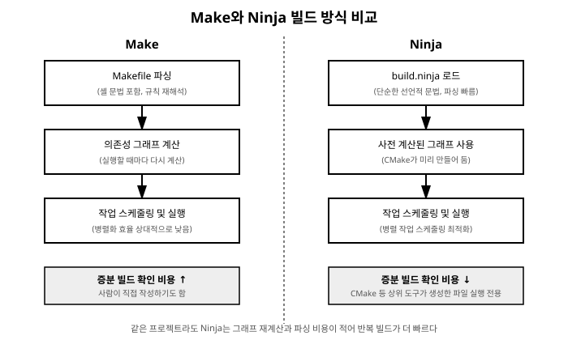

# 8장. Ninja 빌드 시스템

[◀ 이전: 7장. CMake 프로젝트 구조화](ch07-CMake프로젝트구조화.md) | [📖 목차](00-목차.md) | [다음: 9장. VS Code CMake Tools 확장 ▶](ch09-VSCodeCMakeTools확장.md)


7장까지는 CMake가 기본적으로 생성해 주는 빌드 파일(Windows에서는 Visual Studio 프로젝트나 Makefile 계열)을 그대로 사용해 왔습니다. 이번 장에서는 CMake의 또 다른 대표적인 출력 형식인 **Ninja**를 소개합니다. Ninja는 이후 9장의 VS Code CMake Tools 확장에서 기본값처럼 쓰이게 될 만큼, C++ 개발 환경에서 사실상 표준으로 자리 잡은 빌드 실행기입니다.

## Ninja란 무엇인가

Ninja는 구글의 Evan Martin이 만든 빌드 시스템으로, 목표가 단 하나로 압축되어 있습니다. **이미 계산된 빌드 그래프를 최대한 빠르게 실행하는 것.** 이 목표를 위해 Ninja는 의도적으로 기능을 줄였습니다. 조건문이나 함수, 패턴 규칙 같은 고수준 기능이 거의 없고, 문자열 치환 정도의 아주 단순한 변수 기능만 제공합니다.

이 단순함은 약점이 아니라 설계 의도입니다. Ninja가 읽는 `build.ninja` 파일은 사람이 직접 편하게 작성하도록 만들어진 것이 아니라, CMake처럼 더 상위 수준의 빌드 시스템 생성기가 자동으로 만들어내도록 설계된 **중간 산출물**입니다. 즉 개발자는 평소처럼 `CMakeLists.txt`를 작성하고, CMake가 그 내용을 분석해 Ninja가 이해할 수 있는 저수준 명령어 목록으로 번역해 주는 구조입니다. 6장에서 살펴본 "Configure/Generate 단계에서 빌드 파일이 만들어진다"는 설명에서, 그 빌드 파일의 정체가 바로 이 장에서 다루는 `build.ninja`가 될 수 있습니다.

## Make와 Ninja의 차이

Make는 오랫동안 유닉스 계열 빌드 도구의 표준이었고, 지금도 널리 쓰입니다. 하지만 Make의 문법은 사람이 직접 작성하기 좋도록 발전해 온 만큼, 조건 분기·패턴 규칙·셸 명령 해석 등 다양한 기능을 담고 있습니다. 이 유연함에는 대가가 따릅니다.

- **문법의 복잡도**: Makefile은 규칙마다 셸 명령을 그대로 담을 수 있고, 매크로 확장이나 조건부 포함 같은 기능이 뒤섞여 있어 해석(parsing) 자체에 비용이 듭니다. 반면 `build.ninja`는 "이 출력은 이 입력들로부터, 이 규칙을 통해 만들어진다"는 선언만 나열하는 매우 단조로운 형식이라 해석이 훨씬 빠릅니다.
- **병렬 빌드 스케줄링**: Make도 `-j` 옵션으로 병렬 빌드를 지원하지만, 의존성 그래프를 실행 시점마다 다시 계산하고 순회하는 방식이 상대적으로 무겁습니다. Ninja는 애초에 CMake 같은 상위 도구가 완성된 의존성 그래프를 미리 계산해 넘겨주므로, Ninja 자신은 이 그래프를 바탕으로 작업 스케줄링에만 집중할 수 있어 다수의 코어를 더 촘촘하게 활용합니다.
- **증분 빌드(incremental build) 속도**: 소스 파일 하나를 고쳤을 때 "무엇을 다시 빌드해야 하는가"를 판단하는 과정에서, Make는 파일을 다시 파싱하고 규칙을 재해석하는 부담이 있는 반면 Ninja는 그래프와 타임스탬프 검사만으로 최소한의 작업만 골라내도록 최적화되어 있습니다. 그 결과 파일 몇 개만 바뀐 상황에서 다시 빌드를 실행했을 때 체감되는 속도 차이가 특히 두드러집니다.

정리하면, Make는 사람이 직접 다루기 위한 범용 도구에 가깝고, Ninja는 기계(CMake 등)가 생성한 그래프를 최소한의 오버헤드로 실행하기 위한 전용 도구에 가깝습니다. 두 도구의 이런 성격 차이는 다음 그림처럼 정리할 수 있습니다.



## CMake의 제너레이터로 Ninja 지정하기

6장에서 `cmake -B build`를 실행하면 플랫폼별 기본 제너레이터(Windows에서는 보통 Visual Studio 제너레이터)가 선택되었습니다. Ninja를 사용하려면 `-G` 옵션으로 제너레이터를 명시적으로 지정합니다.

```bash
cmake -B build -G Ninja
```

이 명령을 실행하면 `build/` 디렉토리 안에 Visual Studio 프로젝트 파일 대신 `build.ninja` 파일이 생성됩니다. 이후 빌드 명령은 6장에서와 동일하게 사용할 수 있습니다.

```bash
cmake --build build
```

`cmake --build`는 내부적으로 어떤 제너레이터가 선택되었는지 알고 있으므로, Ninja가 선택된 경우 이 명령은 결국 `ninja` 실행 파일을 호출하는 것으로 이어집니다. 즉 제너레이터만 `Ninja`로 바꿔도, 지금까지 배운 CMake 명령어들은 그대로 사용하면서 내부 빌드 엔진만 바뀌는 셈입니다.

컴파일러를 명시적으로 지정하고 싶다면 다음과 같이 환경 변수나 옵션을 함께 사용할 수 있습니다.

```bash
cmake -B build -G Ninja -DCMAKE_CXX_COMPILER=g++
```

## Ninja 설치하기

`-G Ninja`를 사용하려면 시스템에 `ninja` 실행 파일이 설치되어 있어야 합니다. 설치 방법은 사용 중인 환경에 따라 몇 가지가 있습니다.

**MSYS2 환경**: 2장에서 MSYS2로 GCC를 설치했다면, 같은 방식으로 Ninja도 UCRT64 패키지로 설치할 수 있습니다.

```bash
pacman -S mingw-w64-ucrt-x86_64-ninja
```

설치 후 `ninja --version`으로 정상적으로 인식되는지 확인합니다.

```bash
ninja --version
```

**vcpkg를 통한 설치**: 10장에서 다룰 vcpkg는 라이브러리 관리자이지만, 빌드에 필요한 도구를 함께 받아오는 용도로도 활용될 수 있습니다. vcpkg 자체가 내부적으로 Ninja를 사용하기 때문에, vcpkg를 설치하는 과정에서 Ninja가 함께 딸려 오는 경우도 있습니다. 다만 vcpkg가 받아온 Ninja는 vcpkg 내부 용도로 격리되어 있을 수 있으므로, 커맨드라인에서 직접 `ninja` 명령을 쓰고 싶다면 별도로 설치하는 편이 확실합니다.

**기타 패키지 관리자**: Windows용 Chocolatey나 Scoop 같은 패키지 관리자를 이미 사용하고 있다면 각각의 방식으로도 Ninja를 설치할 수 있습니다. 어떤 경로로 설치하든 핵심은 `ninja` 실행 파일이 PATH에 등록되어 커맨드라인 어디에서나 호출 가능해야 한다는 점입니다.

**9장을 미리 예고하자면**: 지금까지처럼 Ninja를 직접 설치하고 제너레이터를 손으로 지정하는 과정은, 9장에서 소개할 VS Code의 CMake Tools 확장을 사용하면 상당 부분 자동화됩니다. 이 확장은 프로젝트를 열 때 사용 가능한 제너레이터와 툴체인을 감지해 Ninja가 설치되어 있으면 이를 기본값으로 제안해 주기도 합니다. 지금 이 장에서 커맨드라인으로 직접 겪어보는 과정은, 나중에 확장이 자동으로 처리해 주는 일이 실제로 무엇을 하고 있는지 이해하는 데 도움이 될 것입니다.

## ninja 명령으로 직접 빌드하기

`cmake --build build`는 편리하지만, `build.ninja`가 이미 생성되어 있다면 `build/` 디렉토리에서 `ninja` 명령을 직접 실행할 수도 있습니다.

```bash
cd build
ninja
```

인자 없이 실행하면 `build.ninja`에 정의된 기본 타겟(보통 프로젝트의 모든 타겟)을 빌드합니다. 7장에서 만든 `calc_app` 프로젝트처럼 여러 타겟이 있는 경우, 특정 타겟만 골라 빌드할 수도 있습니다.

```bash
ninja mathkit
ninja calc_app
```

빌드 중 어떤 명령이 실제로 실행되는지 자세히 보고 싶다면 `-v` 옵션을 사용합니다.

```bash
ninja -v calc_app
```

병렬로 실행할 작업 수를 직접 지정하고 싶다면 `-j` 옵션을 사용합니다. 지정하지 않으면 Ninja가 시스템의 논리 코어 수를 기준으로 적절한 값을 자동으로 선택합니다.

```bash
ninja -j 8
```

빌드 결과물을 정리하고 싶다면 `-t clean` 도구 모드를 사용합니다.

```bash
ninja -t clean
```

이렇게 생성된 파일을 지우고 나면 `cmake --build build`나 `ninja`를 다시 실행했을 때 모든 소스 파일을 처음부터 다시 컴파일하게 됩니다. 반면 소스 파일 하나만 수정한 뒤 다시 `ninja`를 실행하면, Ninja는 바뀐 파일과 그 파일에 의존하는 대상만 정확히 골라내 다시 빌드합니다. 이 증분 빌드의 정확성과 속도가 Ninja를 CMake의 기본 권장 제너레이터 중 하나로 만든 핵심 이유입니다.

## 요약

- Ninja는 실행 속도에 특화된 저수준 빌드 도구로, 사람이 직접 작성하기보다 CMake 같은 상위 도구가 생성한 `build.ninja` 파일을 실행하는 용도로 설계되었습니다.
- Make에 비해 문법이 단순해 해석이 빠르고, 미리 계산된 의존성 그래프를 바탕으로 병렬 작업을 효율적으로 스케줄링하며, 증분 빌드 시 다시 실행할 작업을 빠르게 판별합니다.
- `cmake -B build -G Ninja`로 제너레이터를 Ninja로 지정하면 `cmake --build build`가 내부적으로 `ninja`를 호출하게 됩니다.
- Windows에서는 MSYS2의 `mingw-w64-ucrt-x86_64-ninja` 패키지로 설치할 수 있고, vcpkg나 다른 패키지 관리자를 통한 설치도 가능하며, `ninja` 실행 파일이 PATH에 등록되어 있어야 합니다.
- `build/` 디렉토리에서 `ninja` 명령을 직접 실행하면 전체 또는 특정 타겟만 빌드할 수 있고, `-v`, `-j`, `-t clean` 같은 옵션으로 빌드 과정을 세밀하게 제어할 수 있습니다.

## 연습문제

1. Ninja가 `build.ninja` 파일을 사람이 직접 작성하기보다 CMake 같은 도구가 생성하도록 설계된 이유를 설명해 보세요.
2. Make와 Ninja의 차이를 문법의 단순함, 병렬 빌드 스케줄링, 증분 빌드 속도 세 가지 관점에서 각각 한두 문장으로 정리해 보세요.
3. 7장에서 만든 `calc_app` 프로젝트를 `cmake -B build -G Ninja`로 다시 configure하고, `ninja` 명령으로 빌드해 보세요. `build/` 디렉토리 안에 어떤 파일들이 생겼는지 확인해 보세요.
4. `ninja mathkit`처럼 특정 타겟만 지정해 빌드했을 때와 인자 없이 `ninja`를 실행했을 때의 차이를 직접 실행해 비교해 보세요.
5. 소스 파일 하나를 수정한 뒤 `ninja -v`로 다시 빌드해, 실제로 어떤 컴파일 명령이 다시 실행되는지 관찰해 보세요.

---

[◀ 이전: 7장. CMake 프로젝트 구조화](ch07-CMake프로젝트구조화.md) | [📖 목차](00-목차.md) | [다음: 9장. VS Code CMake Tools 확장 ▶](ch09-VSCodeCMakeTools확장.md)
