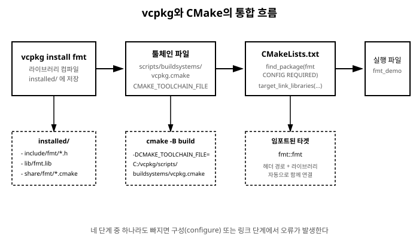

# 11장. vcpkg로 라이브러리 사용하기

[◀ 이전: 10장. vcpkg 소개와 설치](ch10-vcpkg소개와설치.md) | [📖 목차](00-목차.md) | [다음: 12장. vcpkg manifest 모드 ▶](ch12-vcpkgmanifest모드.md)


## 10장까지의 상황 정리

10장에서 vcpkg를 설치하고 `vcpkg`라는 실행 파일을 손에 넣었습니다. 하지만 아직 vcpkg로 무언가를 설치해서 실제 프로젝트에 연결해 본 적은 없습니다. vcpkg는 그 자체로는 "라이브러리를 내려받아 컴파일해 두는 창고지기" 역할만 할 뿐이고, 그 창고에서 물건을 찾아 실제 프로젝트에 쓰는 일은 CMake의 몫입니다. 이번 장에서는 이 둘을 실제로 연결해 보겠습니다.

목표는 다음 네 단계를 손으로 직접 밟아보는 것입니다.

1. vcpkg로 문자열 포매팅 라이브러리 `fmt`를 설치한다.
2. CMake가 vcpkg 창고를 들여다볼 수 있도록 "툴체인 파일"을 알려준다.
3. `CMakeLists.txt`에서 `fmt`를 찾아 타겟에 연결한다.
4. `fmt`를 사용하는 코드를 작성하고 빌드해서 실행한다.

이 장을 마치고 나면 "vcpkg install 어떤라이브러리"와 `find_package`, `target_link_libraries` 세 가지만으로 웬만한 C++ 오픈소스 라이브러리를 프로젝트에 가져다 쓸 수 있게 됩니다.

## classic 모드란 무엇인가

vcpkg는 라이브러리를 설치하는 방식에 따라 크게 두 가지 모드로 나뉩니다. 하나는 이번 장에서 다룰 **classic 모드**로, `vcpkg install fmt`처럼 명령 한 줄로 라이브러리를 vcpkg 설치 폴더 안에 전역으로 설치해 두고, 이후 어떤 프로젝트에서든 그 라이브러리를 가져다 쓰는 방식입니다. 다른 하나는 12장에서 다룰 **manifest 모드**로, 프로젝트 폴더 안에 `vcpkg.json`이라는 파일을 두고 "이 프로젝트가 필요로 하는 라이브러리 목록"을 선언하는 방식입니다.

classic 모드는 pip로 비유하면 `pip install requests`를 가상환경 구분 없이 시스템 전체에 설치하는 것과 비슷합니다. 반면 manifest 모드는 `requirements.txt`를 두고 프로젝트별로 의존성을 관리하는 것에 가깝습니다. 두 모드 모두 실제로 라이브러리를 컴파일해서 설치하는 원리는 같고, 다만 "그 설치 목록을 어디에 기록하고 어떤 범위로 적용하는지"가 다릅니다.

이번 장에서 classic 모드부터 시작하는 이유는, classic 모드가 vcpkg의 가장 기본적인 동작 방식을 가장 단순하게 보여주기 때문입니다. 일단 vcpkg가 라이브러리를 어떻게 설치하고 CMake가 그것을 어떻게 찾아내는지 원리를 이해하고 나면, 12장에서 배울 manifest 모드는 "같은 원리를 프로젝트 폴더 단위로 옮겨 놓은 것"일 뿐이라는 사실이 훨씬 쉽게 이해됩니다.

## fmt 라이브러리 설치하기

이 장에서 사용할 라이브러리는 `fmt`입니다. `fmt`는 C++ 문자열 포매팅 라이브러리로, C의 `printf`나 C++ 표준 스트림(`std::cout`)보다 안전하고 읽기 쉬운 문법으로 문자열을 조립할 수 있게 해줍니다. 실무에서 로그 메시지를 만들거나 사용자에게 보여줄 문자열을 구성할 때 매우 자주 쓰이는 라이브러리이고, 설치와 사용법이 단순해서 vcpkg 입문 예제로 적합합니다.

10장에서 vcpkg를 클론하고 부트스트랩한 디렉터리로 이동한 뒤, 다음 명령으로 `fmt`를 설치합니다.

```bash
./vcpkg install fmt
```

이 명령을 실행하면 vcpkg는 다음과 같은 일을 순서대로 처리합니다.

1. `fmt`의 소스 코드를 vcpkg 저장소에 등록된 버전대로 내려받습니다.
2. 여러분의 시스템에 설치된 컴파일러(2장에서 설치한 GCC 등)로 `fmt`를 실제로 컴파일합니다.
3. 컴파일된 결과물(헤더 파일, 라이브러리 파일)을 vcpkg 설치 폴더 아래 `installed/` 디렉토리에 정리해 넣습니다.
4. CMake가 이 라이브러리를 찾을 수 있도록 설정 파일(`fmt-config.cmake` 등)도 함께 넣어 둡니다.

설치가 끝나면 vcpkg는 보통 다음과 비슷한 안내 메시지를 출력합니다.

```bash
The package fmt is compatible with built-in CMake targets:

    find_package(fmt CONFIG REQUIRED)
    target_link_libraries(main PRIVATE fmt::fmt)
```

이 두 줄이 바로 이번 장 후반부에서 `CMakeLists.txt`에 그대로 옮겨 적을 내용입니다. vcpkg는 라이브러리를 설치할 때마다 "이 라이브러리를 CMake에서 어떻게 연결하면 되는지" 알려주므로, 새로운 라이브러리를 설치할 때는 이 안내 문구를 눈여겨봐 두는 습관을 들이면 좋습니다.

설치가 잘 되었는지는 다음 명령으로 확인할 수 있습니다.

```bash
./vcpkg list
```

`fmt`가 설치 목록에 나타나면 정상입니다.

## CMake가 vcpkg 창고를 찾게 만들기: 툴체인 파일

10장에서 `vcpkg integrate install`을 실행해 두었다면 이미 시스템 차원에서 vcpkg와 CMake를 연결하는 설정이 등록되어 있을 수 있습니다. 하지만 그 명령이 출력한 안내 메시지에서도 볼 수 있었듯이, CMake 구성 시점에 툴체인 파일 경로를 명시적으로 넘겨주는 방법이 가장 확실하고 어떤 환경에서도 재현 가능합니다. 이 장에서는 이 명시적인 방법을 기준으로 설명합니다.

`fmt`를 설치했다고 해서 CMake가 저절로 그 존재를 알아채는 것은 아닙니다. vcpkg가 설치한 라이브러리들은 vcpkg 설치 폴더 안 `installed/` 디렉토리라는, CMake 입장에서는 전혀 낯선 위치에 놓여 있습니다. CMake에게 "라이브러리를 찾을 때 이 창고도 뒤져 보라"고 알려주는 다리 역할을 하는 파일이 바로 vcpkg가 제공하는 **툴체인 파일**입니다.

vcpkg를 설치한 폴더 안에는 다음 경로에 이 파일이 이미 존재합니다.

```bash
<vcpkg 설치 경로>/scripts/buildsystems/vcpkg.cmake
```

예를 들어 vcpkg를 `C:\vcpkg`에 설치했다면 전체 경로는 `C:\vcpkg\scripts\buildsystems\vcpkg.cmake`가 됩니다. CMake를 구성(configure)할 때 이 파일을 `CMAKE_TOOLCHAIN_FILE`이라는 변수로 지정해 주면, CMake는 이후 `find_package`를 호출할 때마다 vcpkg가 설치해 둔 라이브러리 목록까지 함께 검색합니다.

이 지정은 커맨드라인에서 다음과 같이 할 수 있습니다.

```bash
cmake -B build -DCMAKE_TOOLCHAIN_FILE=C:/vcpkg/scripts/buildsystems/vcpkg.cmake
```

경로 구분자로 백슬래시 대신 슬래시(`/`)를 쓴 점에 주의하세요. CMake는 Windows에서도 슬래시로 된 경로를 문제없이 받아들이며, 백슬래시를 쓰면 이스케이프 문자로 해석되어 오류가 날 수 있습니다.

매번 이렇게 긴 옵션을 손으로 치는 것이 번거롭다고 느껴질 수 있습니다. 실제로 실무 프로젝트에서는 이 옵션을 매번 커맨드라인에 적는 대신, 16장에서 다룰 `CMakePresets.json` 파일 안에 미리 적어 두고 VS Code나 커맨드라인에서 프리셋 이름만으로 빌드를 구성하는 방식을 주로 사용합니다. 지금은 원리를 이해하는 단계이므로 커맨드라인에서 직접 지정하는 방법부터 익히고, 프리셋으로 자동화하는 방법은 나중에 다시 다루겠습니다.

## CMakeLists.txt에서 fmt 찾아 연결하기

이제 실제 예제 프로젝트를 만들어 보겠습니다. 다음과 같은 폴더 구조를 준비합니다.

```bash
fmt-demo/
├── CMakeLists.txt
└── main.cpp
```

`CMakeLists.txt`는 다음과 같이 작성합니다.

```cmake
cmake_minimum_required(VERSION 3.20)
project(fmt_demo LANGUAGES CXX)

set(CMAKE_CXX_STANDARD 17)
set(CMAKE_CXX_STANDARD_REQUIRED ON)

find_package(fmt CONFIG REQUIRED)

add_executable(fmt_demo main.cpp)
target_link_libraries(fmt_demo PRIVATE fmt::fmt)
```

한 줄씩 살펴보겠습니다.

- `find_package(fmt CONFIG REQUIRED)`는 "`fmt`라는 이름의 패키지를 CONFIG 모드로 찾되, 찾지 못하면 오류로 중단하라"는 뜻입니다. 여기서 `CONFIG`는 CMake에게 "직접 라이브러리 경로를 추측하지 말고, vcpkg가 설치할 때 함께 넣어 둔 `fmt-config.cmake` 설정 파일을 읽어서 처리하라"고 지시하는 키워드입니다. 이 설정 파일이 바로 앞서 지정한 툴체인 파일 덕분에 CMake의 검색 경로 안으로 들어오게 됩니다.
- `add_executable(fmt_demo main.cpp)`는 6장과 7장에서 다룬 것과 동일하게, `main.cpp`를 컴파일해 `fmt_demo`라는 실행 파일을 만들라는 지시입니다.
- `target_link_libraries(fmt_demo PRIVATE fmt::fmt)`는 방금 찾은 `fmt` 라이브러리를 `fmt_demo` 타겟에 연결합니다. `fmt::fmt`는 `fmt` 라이브러리가 제공하는 타겟 이름으로, 콜론 두 개(`::`)가 들어간 이 형태를 CMake에서는 "임포트된 타겟(imported target)"이라고 부릅니다. 임포트된 타겟을 링크하면 라이브러리 파일의 경로뿐 아니라, 그 라이브러리가 필요로 하는 헤더 검색 경로나 컴파일 옵션까지 CMake가 자동으로 함께 챙겨 줍니다. `PRIVATE`의 의미는 7장에서 다룬 것과 같이, `fmt`를 `fmt_demo` 내부 구현에서만 사용하고 이 타겟에 의존하는 다른 타겟에는 전파하지 않겠다는 뜻입니다.

## fmt를 사용하는 코드 작성하기

`main.cpp`는 다음과 같이 작성합니다.

```cpp
#include <fmt/core.h>

int main() {
    std::string name = "TCPL";
    int chapter = 11;

    fmt::print("{}책 {}장에 오신 것을 환영합니다.\n", name, chapter);
    fmt::print("포매팅된 숫자: {:.2f}\n", 3.14159);

    return 0;
}
```

`fmt::print`는 `std::cout`처럼 콘솔에 문자열을 출력하되, 중괄호 `{}`를 자리표시자로 사용해 뒤에 나열한 값들을 순서대로 채워 넣습니다. `{:.2f}`처럼 중괄호 안에 형식 지정자를 넣으면 소수점 둘째 자리까지 반올림해서 출력하는 식으로 세밀한 포매팅도 가능합니다. C의 `printf("%s %d장", name, chapter)`와 비교하면, `fmt`는 인자의 타입을 컴파일 시점에 확인해 주기 때문에 타입이 맞지 않는 실수를 컴파일 오류로 미리 잡아낼 수 있다는 장점이 있습니다.

## 빌드하고 실행하기

이제 처음에 지정했던 툴체인 파일 옵션을 그대로 사용해 빌드를 구성하고 실행합니다.

```bash
cmake -B build -DCMAKE_TOOLCHAIN_FILE=C:/vcpkg/scripts/buildsystems/vcpkg.cmake
cmake --build build
```

`cmake -B build` 단계의 출력 로그를 잘 보면, `-- Found fmt: ...`처럼 `fmt`를 찾았다는 메시지가 나타나는 것을 확인할 수 있습니다. 만약 이 메시지 대신 `Could not find a package configuration file provided by "fmt"` 같은 오류가 나온다면, 툴체인 파일 경로가 잘못되었거나 `vcpkg install fmt`가 제대로 끝나지 않았을 가능성이 큽니다.

빌드가 끝나면 `build` 디렉토리 안에 `fmt_demo` 실행 파일(Windows에서는 `fmt_demo.exe`)이 생성됩니다. 이를 실행합니다.

```bash
./build/fmt_demo
```

다음과 같은 출력이 나오면 성공입니다.

```bash
TCPL책 11장에 오신 것을 환영합니다.
포매팅된 숫자: 3.14
```

지금까지의 흐름을 그림으로 정리하면 다음과 같습니다.



`vcpkg install`이 라이브러리를 창고에 쌓아 두면, 툴체인 파일이 CMake에게 그 창고의 위치를 알려주고, `find_package`와 `target_link_libraries`가 그 창고에서 필요한 물건을 찾아 우리 타겟에 실제로 연결합니다. 이 네 단계 중 어느 하나라도 빠지면 빌드는 실패합니다. 예를 들어 `vcpkg install`은 했지만 툴체인 파일을 지정하지 않으면 `find_package`가 `fmt`를 찾지 못해 구성 단계에서 오류가 나고, `find_package`는 했지만 `target_link_libraries`를 빠뜨리면 컴파일은 되어도 링크 단계에서 "정의를 찾을 수 없다"는 오류가 발생합니다.

## VS Code CMake Tools에서 사용하기

9장에서 설정한 CMake Tools 확장을 사용 중이라면, 매번 커맨드라인에 `-DCMAKE_TOOLCHAIN_FILE` 옵션을 치는 대신 워크스페이스 설정에 이 값을 등록해 둘 수 있습니다. `.vscode/settings.json`에 다음과 같이 추가합니다.

```json
{
  "cmake.configureSettings": {
    "CMAKE_TOOLCHAIN_FILE": "C:/vcpkg/scripts/buildsystems/vcpkg.cmake"
  }
}
```

이렇게 해 두면 CMake Tools 확장이 프로젝트를 구성할 때마다 이 옵션을 자동으로 붙여 주므로, 상태 표시줄의 빌드 버튼을 누르는 것만으로 vcpkg가 설치한 라이브러리를 사용하는 프로젝트를 문제없이 빌드할 수 있습니다.

## classic 모드의 한계

여기까지 잘 따라왔다면 vcpkg로 라이브러리를 설치하고 CMake에 연결하는 전체 흐름을 손에 익혔을 것입니다. 다만 classic 모드에는 한 가지 불편함이 있습니다. `fmt-demo` 프로젝트 자체에는 "이 프로젝트가 `fmt`를 필요로 한다"는 기록이 전혀 남아 있지 않다는 점입니다. 이 프로젝트를 다른 컴퓨터로 옮기거나 동료에게 전달하면, 동료는 `CMakeLists.txt`를 열어 `find_package(fmt ...)`라는 줄을 보고 나서야 "아, `vcpkg install fmt`를 먼저 해야 하는구나"라고 스스로 알아채야 합니다. 프로젝트가 사용하는 라이브러리가 열 개, 스무 개로 늘어나면 이런 수작업 안내는 금방 한계에 부딪힙니다.

이 문제를 해결하는 것이 바로 12장에서 다룰 **manifest 모드**입니다. 프로젝트 폴더 안에 의존성 목록을 파일로 선언해 두면, CMake 구성 단계에서 vcpkg가 그 목록을 읽어 필요한 라이브러리를 프로젝트 전용 폴더에 자동으로 설치해 줍니다.

## 요약

- vcpkg의 classic 모드는 `vcpkg install 라이브러리이름` 명령으로 라이브러리를 전역 위치에 설치하는 방식입니다.
- vcpkg가 설치한 라이브러리를 CMake가 찾으려면, vcpkg가 제공하는 툴체인 파일(`scripts/buildsystems/vcpkg.cmake`)을 `CMAKE_TOOLCHAIN_FILE` 변수로 지정해야 합니다.
- `CMakeLists.txt`에서는 `find_package(라이브러리이름 CONFIG REQUIRED)`로 라이브러리를 찾고, `target_link_libraries(타겟 PRIVATE 라이브러리이름::라이브러리이름)`로 타겟에 연결합니다.
- `fmt` 라이브러리를 예로 들어 설치 → 툴체인 파일 지정 → CMake 연결 → 코드 작성 → 빌드 → 실행까지의 전체 과정을 실습했습니다.
- classic 모드는 프로젝트 파일 안에 의존성 정보가 남지 않는다는 한계가 있으며, 이는 12장에서 다룰 manifest 모드로 해결할 수 있습니다.

## 연습문제

1. `vcpkg install fmt` 명령을 실행했을 때 vcpkg가 내부적으로 처리하는 네 단계를 순서대로 설명해 보세요.
2. `CMAKE_TOOLCHAIN_FILE`을 지정하지 않고 `find_package(fmt CONFIG REQUIRED)`를 실행하면 어떤 오류가 발생할지 예상해 보고, 실제로 그 옵션을 빼고 빌드해서 확인해 보세요.
3. `fmt::fmt`처럼 콜론 두 개가 포함된 "임포트된 타겟"을 링크했을 때와, 라이브러리 파일 경로를 직접 `target_link_libraries`에 적었을 때의 차이를 설명해 보세요.
4. `fmt` 대신 vcpkg에서 제공하는 다른 라이브러리(예를 들어 `nlohmann-json`)를 검색해서 설치해 보고, `find_package`에 어떤 이름을 써야 하는지 vcpkg의 설치 완료 메시지에서 확인해 보세요.
5. 이번 장에서 만든 `fmt-demo` 프로젝트를 다른 폴더로 복사한 뒤, `vcpkg install`을 한 번도 실행하지 않은 새 환경이라고 가정하고 어떤 문제가 생길지, 그리고 이를 어떻게 알려야 할지 생각해 보세요.

---

[◀ 이전: 10장. vcpkg 소개와 설치](ch10-vcpkg소개와설치.md) | [📖 목차](00-목차.md) | [다음: 12장. vcpkg manifest 모드 ▶](ch12-vcpkgmanifest모드.md)
