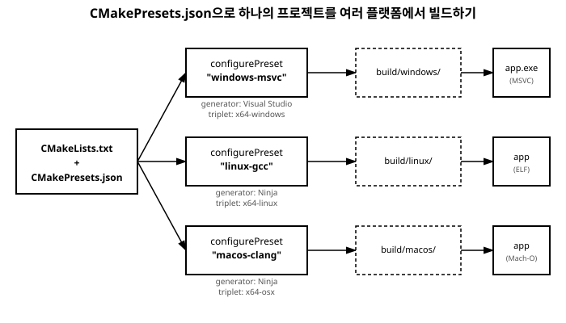

# 16장. 멀티플랫폼 빌드와 CMake Presets

[◀ 이전: 15장. 정적 분석과 코드 포맷팅](ch15-정적분석과코드포맷팅.md) | [📖 목차](00-목차.md) | [다음: 17장. 테스트 프레임워크 통합 ▶](ch17-테스트프레임워크통합.md)


6장과 7장에서 CMake로 프로젝트를 구조화하는 방법을, 8장에서 Ninja 빌드 시스템을, 10장부터 12장까지는 vcpkg로 외부 라이브러리를 관리하는 방법을 다뤘습니다. 이 장들에서 사용한 예제는 대부분 하나의 운영체제, 하나의 컴파일러를 기준으로 삼았습니다. 하지만 실제 프로젝트는 종종 Windows에서 개발하던 코드를 Linux 서버에 배포하거나, macOS를 쓰는 팀원과 코드를 공유해야 하는 상황을 마주하게 됩니다. 이 장에서는 같은 `CMakeLists.txt`를 여러 플랫폼에서 빌드할 때 무엇이 달라지는지 살펴보고, 그 차이를 파일 하나로 깔끔하게 관리해 주는 `CMakePresets.json`을 다룹니다.

## 플랫폼마다 달라지는 것들

같은 소스 코드와 같은 `CMakeLists.txt`를 쓰더라도, 플랫폼이 바뀌면 CMake를 구성(configure)하는 방식 자체가 달라집니다. 대표적으로 다음 세 가지가 문제가 됩니다.

**컴파일러 경로**. Windows에서는 2장에서 설치한 MSYS2의 `g++.exe`나 Visual Studio에 포함된 MSVC(`cl.exe`)를 쓰지만, Linux에서는 시스템에 기본 설치된 `g++`, macOS에서는 Xcode Command Line Tools의 `clang++`를 쓰는 것이 일반적입니다. 컴파일러 실행 파일의 경로도, 그 컴파일러가 인식하는 기본 옵션도 서로 다릅니다.

**제너레이터(generator)**. 8장에서 다룬 것처럼 CMake는 Configure 단계에서 실제 빌드 파일(Ninja의 `build.ninja`, Make의 `Makefile`, 혹은 Visual Studio의 `.sln`)을 생성하는데, 어떤 형식으로 생성할지는 제너레이터가 결정합니다. Windows에서 Visual Studio를 함께 쓴다면 `"Visual Studio 17 2022"` 제너레이터를, Ninja를 직접 쓰거나 Linux·macOS 환경이라면 `"Ninja"` 제너레이터를 지정하는 식으로 플랫폼별로 선택이 달라집니다.

**vcpkg triplet**. 10장부터 12장에서 다룬 vcpkg는 라이브러리를 어떤 아키텍처와 운영체제, 링크 방식(정적/동적)에 맞춰 빌드할지를 **triplet**이라는 이름으로 구분합니다. 같은 라이브러리라도 Windows용으로 빌드된 결과물과 Linux용으로 빌드된 결과물은 완전히 다른 바이너리이기 때문에, `x64-windows`, `x64-linux`, `x64-osx`처럼 플랫폼에 맞는 triplet을 지정해야 합니다.

이 세 가지가 얽혀 있다 보니, 플랫폼마다 다음과 같이 서로 다른 `cmake` 커맨드라인을 손으로 기억하고 입력해야 하는 상황이 생깁니다.

```bash
# Windows (Ninja + vcpkg)
cmake -B build -G Ninja ^
  -DCMAKE_TOOLCHAIN_FILE=C:/vcpkg/scripts/buildsystems/vcpkg.cmake ^
  -DVCPKG_TARGET_TRIPLET=x64-windows

# Linux
cmake -B build -G Ninja \
  -DCMAKE_TOOLCHAIN_FILE=/home/user/vcpkg/scripts/buildsystems/vcpkg.cmake \
  -DVCPKG_TARGET_TRIPLET=x64-linux

# macOS
cmake -B build -G Ninja \
  -DCMAKE_TOOLCHAIN_FILE=/Users/user/vcpkg/scripts/buildsystems/vcpkg.cmake \
  -DVCPKG_TARGET_TRIPLET=x64-osx
```

세 명령은 옵션 이름은 같지만 값이 조금씩 다릅니다. 이 정도라면 그럭저럭 외워서 쓸 수 있을지 몰라도, 프로젝트에 Debug/Release 빌드 구분, 추가 컴파일 옵션, 여러 컴파일러 조합까지 더해지면 명령이 순식간에 길어지고 오타가 나기도 쉬워집니다. 게다가 이 명령들은 보통 README나 팀 위키의 텍스트로만 존재하기 때문에, 시간이 지나면 실제 프로젝트 설정과 문서 내용이 어긋나는 일도 흔합니다.

## CMakePresets.json이 필요한 이유

`CMakePresets.json`은 CMake 3.19부터 지원하는 기능으로, 방금 살펴본 것처럼 플랫폼이나 환경마다 달라지는 CMake 옵션 조합을 **이름이 붙은 프리셋**으로 미리 정의해 두는 JSON 파일입니다. 이 파일을 프로젝트 루트에 두고 형상 관리(Git)에 포함시키면, 팀원 누구나 다음과 같이 프리셋 이름 하나만으로 구성을 재현할 수 있습니다.

```bash
cmake --preset windows-msvc
cmake --build --preset windows-msvc-debug
```

긴 옵션 나열이 프리셋 이름 하나로 압축되는 셈입니다. `CMakePresets.json`이 실제로 해결해 주는 문제를 정리하면 다음과 같습니다.

- **명령어 반복 입력 제거**: 컴파일러 경로, 제너레이터, vcpkg toolchain 경로 같은 옵션을 매번 손으로 입력할 필요 없이 프리셋 이름만 지정하면 됩니다.
- **설정의 버전 관리**: 프리셋 정의 자체가 JSON 파일이므로 Git으로 추적할 수 있고, 프로젝트 설정이 바뀌면 이 파일의 변경 이력으로 남습니다.
- **환경별 설정의 명시적 분리**: Windows용, Linux용, macOS용 설정이 각각 독립된 이름을 가진 블록으로 존재하므로, 어떤 프리셋이 어떤 환경을 위한 것인지 파일만 봐도 명확합니다.
- **개인 환경 오버라이드**: 뒤에서 다룰 `CMakeUserPresets.json`을 통해, 팀 공용 설정은 그대로 두고 개인 컴퓨터에만 해당하는 경로 차이를 별도로 관리할 수 있습니다.

## CMakePresets.json의 기본 구조

프로젝트 루트에 `CMakePresets.json` 파일을 만듭니다. 최소한의 형태는 다음과 같습니다.

```json
{
    "version": 6,
    "cmakeMinimumRequired": {
        "major": 3,
        "minor": 21,
        "patch": 0
    },
    "configurePresets": [
        {
            "name": "windows-msvc",
            "displayName": "Windows (MSVC + Ninja)",
            "generator": "Ninja",
            "binaryDir": "${sourceDir}/build/windows",
            "cacheVariables": {
                "CMAKE_BUILD_TYPE": "Debug",
                "CMAKE_TOOLCHAIN_FILE": "$env{VCPKG_ROOT}/scripts/buildsystems/vcpkg.cmake",
                "VCPKG_TARGET_TRIPLET": "x64-windows"
            },
            "condition": {
                "type": "equals",
                "lhs": "${hostSystemName}",
                "rhs": "Windows"
            }
        },
        {
            "name": "linux-gcc",
            "displayName": "Linux (GCC + Ninja)",
            "generator": "Ninja",
            "binaryDir": "${sourceDir}/build/linux",
            "cacheVariables": {
                "CMAKE_BUILD_TYPE": "Debug",
                "CMAKE_TOOLCHAIN_FILE": "$env{VCPKG_ROOT}/scripts/buildsystems/vcpkg.cmake",
                "VCPKG_TARGET_TRIPLET": "x64-linux"
            },
            "condition": {
                "type": "equals",
                "lhs": "${hostSystemName}",
                "rhs": "Linux"
            }
        },
        {
            "name": "macos-clang",
            "displayName": "macOS (Clang + Ninja)",
            "generator": "Ninja",
            "binaryDir": "${sourceDir}/build/macos",
            "cacheVariables": {
                "CMAKE_BUILD_TYPE": "Debug",
                "CMAKE_TOOLCHAIN_FILE": "$env{VCPKG_ROOT}/scripts/buildsystems/vcpkg.cmake",
                "VCPKG_TARGET_TRIPLET": "x64-osx"
            },
            "condition": {
                "type": "equals",
                "lhs": "${hostSystemName}",
                "rhs": "Darwin"
            }
        }
    ],
    "buildPresets": [
        {
            "name": "windows-msvc-debug",
            "configurePreset": "windows-msvc"
        },
        {
            "name": "linux-gcc-debug",
            "configurePreset": "linux-gcc"
        },
        {
            "name": "macos-clang-debug",
            "configurePreset": "macos-clang"
        }
    ]
}
```



각 항목의 의미를 하나씩 짚어 보겠습니다.

### configurePresets

Configure 단계, 즉 `cmake -B build ...`에 해당하는 설정을 정의하는 배열입니다. 각 항목은 다음 필드를 가집니다.

- `name`: 프리셋을 식별하는 이름입니다. `cmake --preset <name>`으로 지정할 때 사용하므로 공백 없이 간결하게 짓는 것이 좋습니다.
- `displayName`: 사람이 읽기 좋은 설명용 이름입니다. VS Code CMake Tools 확장에서 프리셋을 선택할 때 이 이름이 목록에 표시됩니다.
- `generator`: 6~8장에서 다룬 CMake 제너레이터입니다. 여기서는 세 플랫폼 모두 `"Ninja"`를 사용해 빌드 도구 자체는 통일했습니다.
- `binaryDir`: 빌드 결과물이 생성될 디렉터리입니다. `${sourceDir}`는 `CMakePresets.json`이 위치한 프로젝트 루트를 가리키는 내장 변수이며, 플랫폼별로 `build/windows`, `build/linux`, `build/macos`처럼 서로 다른 하위 디렉터리를 사용해 충돌을 피했습니다.
- `cacheVariables`: `cmake -D옵션=값` 형태로 전달하던 캐시 변수들을 키-값 쌍으로 나열합니다. `CMAKE_TOOLCHAIN_FILE`에 vcpkg의 툴체인 파일 경로를 지정하는 것이 11~12장에서 다룬 vcpkg 통합 방식과 동일하며, `$env{VCPKG_ROOT}`는 환경 변수 `VCPKG_ROOT`의 값을 그대로 치환해 주는 CMakePresets 문법입니다. 이 덕분에 vcpkg를 설치한 실제 경로가 사람마다 달라도 파일 내용 자체는 그대로 공유할 수 있습니다. `VCPKG_TARGET_TRIPLET`에는 각 플랫폼에 맞는 triplet을 지정했습니다.
- `condition`: 이 프리셋이 어떤 환경에서만 유효한지를 지정하는 조건입니다. `${hostSystemName}`은 현재 실행 중인 운영체제 이름(`"Windows"`, `"Linux"`, `"Darwin"`은 macOS를 뜻함)으로 치환되는 내장 변수입니다. 이 조건을 지정해 두면, Linux 환경에서 실수로 `windows-msvc` 프리셋을 선택하려고 할 때 CMake가 이를 막고 오류를 알려줍니다.

### buildPresets

Build 단계, 즉 `cmake --build build ...`에 해당하는 설정을 정의하는 배열입니다. 각 `buildPresets` 항목은 `configurePreset` 필드로 자신이 어떤 configure 프리셋에 연결되는지를 명시합니다. 위 예시처럼 configure 프리셋과 1:1로 대응시키는 것이 가장 단순한 형태이지만, 하나의 configure 프리셋에 대해 `--target`이나 병렬 빌드 옵션(`jobs`)만 다르게 지정한 여러 build 프리셋을 두는 것도 가능합니다.

```json
{
    "name": "linux-gcc-release-target",
    "configurePreset": "linux-gcc",
    "configuration": "Release",
    "targets": ["my_app"]
}
```

### 실제로 사용해 보기

프리셋을 정의해 두면 플랫폼에 관계없이 다음 두 명령만 기억하면 됩니다.

```bash
# 현재 운영체제에 맞는 프리셋으로 구성
cmake --preset linux-gcc

# 빌드
cmake --build --preset linux-gcc-debug
```

사용 가능한 프리셋 목록은 `--list-presets` 옵션으로 확인할 수 있습니다.

```bash
cmake --list-presets
```

### CMakeUserPresets.json으로 개인 설정 분리하기

`CMakePresets.json`은 팀 전체가 공유하는 파일이므로 저장소에 커밋하는 것이 원칙입니다. 그런데 vcpkg를 설치한 경로처럼 사람마다 다를 수밖에 없는 값이 있다면, 이를 `CMakeUserPresets.json`이라는 별도 파일로 분리할 수 있습니다. CMake는 이 파일을 `CMakePresets.json`과 함께 자동으로 읽어 들이며, `.gitignore`에 등록해 두어 개인별 설정이 저장소에 섞여 들어가지 않도록 하는 것이 일반적인 관례입니다.

```json
{
    "version": 6,
    "configurePresets": [
        {
            "name": "windows-msvc-local",
            "inherits": "windows-msvc",
            "cacheVariables": {
                "CMAKE_TOOLCHAIN_FILE": "D:/tools/vcpkg/scripts/buildsystems/vcpkg.cmake"
            }
        }
    ]
}
```

`inherits` 필드는 이름이 가리키는 기존 프리셋의 설정을 그대로 물려받은 뒤, 명시된 필드만 덮어씁니다. 이 예시는 공용 `windows-msvc` 프리셋의 나머지 설정은 그대로 두고 `CMAKE_TOOLCHAIN_FILE` 경로만 이 컴퓨터에 맞게 바꾼 것입니다.

## VS Code CMake Tools 확장과의 연결

9장에서 다룬 VS Code CMake Tools 확장은 `CMakePresets.json`을 자동으로 인식합니다. 확장이 활성화된 프로젝트를 열면 상태 바에 현재 선택된 프리셋 이름이 표시되고, 이 부분을 클릭하면 `CMakePresets.json`에 정의된 프리셋들이 `displayName`과 함께 목록으로 나타나 원하는 프리셋을 골라 전환할 수 있습니다. 명령 팔레트에서 `CMake: Select Configure Preset`과 `CMake: Select Build Preset`을 실행해도 동일한 선택 화면이 열립니다.

즉 9장에서 익힌 CMake Tools의 구성/빌드/디버그 흐름 위에 `CMakePresets.json`을 얹으면, 커맨드라인에서 프리셋 이름을 입력하던 것과 똑같은 전환을 GUI 클릭 몇 번으로 처리할 수 있습니다. 팀원이 Windows에서 작업하다가 Linux 컨테이너에 접속해 같은 프로젝트를 열어도, 확장이 `condition`을 평가해 그 환경에서 유효한 프리셋만 골라서 보여주기 때문에 헷갈릴 여지가 줄어듭니다.

## 요약

- 같은 CMake 프로젝트라도 플랫폼에 따라 컴파일러 경로, CMake 제너레이터, vcpkg triplet이 달라지며, 이 차이를 손으로 관리하면 명령어가 길어지고 문서와 실제 설정이 어긋나기 쉽습니다.
- `CMakePresets.json`은 이런 환경별 설정을 이름 붙은 프리셋으로 정의해 파일 하나로 관리하게 해 주며, Git으로 버전 관리할 수 있습니다.
- `configurePresets`는 `generator`, `binaryDir`, `cacheVariables` 등 Configure 단계의 설정을, `buildPresets`는 그에 연결된 Build 단계의 설정을 정의합니다.
- `condition`으로 프리셋이 유효한 운영체제를 제한할 수 있고, `cacheVariables`에 vcpkg의 `CMAKE_TOOLCHAIN_FILE`과 `VCPKG_TARGET_TRIPLET`을 지정해 11~12장에서 다룬 vcpkg 연동을 프리셋 안에 통합할 수 있습니다.
- 개인 환경에만 해당하는 값은 `inherits`를 활용한 `CMakeUserPresets.json`으로 분리하고 형상 관리에서 제외하는 것이 일반적입니다.
- 9장에서 다룬 VS Code CMake Tools 확장은 `CMakePresets.json`을 자동으로 인식해 상태 바와 명령 팔레트에서 프리셋을 선택할 수 있는 UI를 제공합니다.

## 연습문제

1. 같은 `CMakeLists.txt`를 Windows와 Linux에서 각각 빌드할 때 달라지는 요소를 세 가지 이상 나열하세요.
2. `CMakePresets.json`을 사용하지 않고 커맨드라인 옵션만으로 여러 플랫폼을 지원하려 할 때 어떤 문제가 발생하는지 설명하세요.
3. `configurePresets`의 `condition` 필드가 하는 역할을 설명하고, `${hostSystemName}`이 macOS에서는 어떤 값으로 치환되는지 서술하세요.
4. `CMakePresets.json`과 `CMakeUserPresets.json`을 나누어 관리하는 이유와, `inherits` 필드가 어떻게 활용되는지 설명하세요.
5. 자신의 프로젝트를 가정하고, Debug/Release 두 가지 빌드 타입에 대응하는 `buildPresets` 두 개를 하나의 `configurePreset`에 연결하는 JSON 조각을 작성해 보세요.

---

[◀ 이전: 15장. 정적 분석과 코드 포맷팅](ch15-정적분석과코드포맷팅.md) | [📖 목차](00-목차.md) | [다음: 17장. 테스트 프레임워크 통합 ▶](ch17-테스트프레임워크통합.md)
