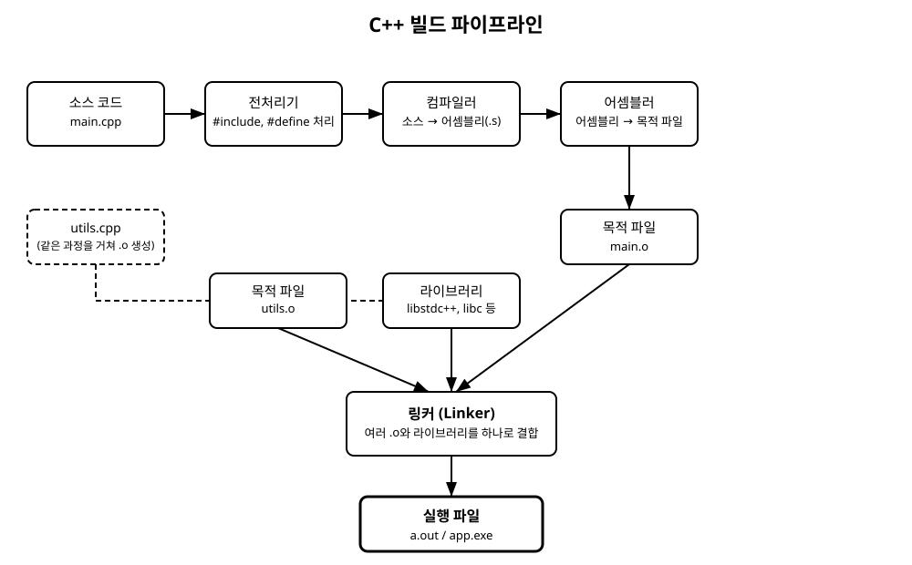

# 2장. 첫 프로그램과 빌드 과정

[◀ 이전: 1장. C++란 무엇인가](ch01-cpp란.md) | [📖 목차](00-목차.md) | [다음: 3장. 변수와 자료형 ▶](ch03-변수와자료형.md)

---

## 들어가며

1장에서는 C++가 어떤 언어인지 큰 그림을 살펴보았다. 이번 장에서는 실제로 손을 움직여 첫 번째 C++ 프로그램을 작성하고, 그 프로그램이 우리가 읽을 수 있는 텍스트 파일에서 컴퓨터가 실행할 수 있는 기계어로 변신하는 전체 과정을 따라간다. 이 과정을 이해하면 앞으로 "컴파일 오류"와 "링크 오류"가 발생했을 때 무엇이 잘못되었는지 훨씬 빠르게 파악할 수 있다.

## Hello World, 한 줄씩 뜯어보기

가장 먼저 작성할 프로그램은 화면에 문장 하나를 출력하는 프로그램이다.

```cpp
#include <iostream>

int main() {
    std::cout << "Hello, C++!" << std::endl;
    return 0;
}
```

이 짧은 코드에는 C++ 프로그램의 기본 구조가 모두 담겨 있다. 한 줄씩 살펴보자.

**`#include <iostream>`**
`#include`는 전처리기(preprocessor) 지시문이다. 컴파일이 시작되기 전에, 이 줄은 `iostream`이라는 표준 라이브러리 헤더 파일의 내용을 현재 파일 위치에 그대로 복사해 넣으라는 명령이다. `iostream` 헤더는 화면 입출력을 위한 `std::cout`, `std::cin` 같은 기능을 선언하고 있다. 이 지시문이 없으면 컴파일러는 `std::cout`이 무엇인지 알 수 없다.

**`int main()`**
`main` 함수는 C++ 프로그램이 실행을 시작하는 지점이다. 운영체제는 프로그램을 실행할 때 항상 `main` 함수부터 호출한다. 반환형이 `int`인 이유는 프로그램 종료 시 운영체제에 상태 코드를 알려주기 위함이다. 함수의 자세한 문법은 7장에서 다룬다.

**`std::cout << "Hello, C++!" << std::endl;`**
`std::cout`은 "콘솔 출력(character output)"을 의미하는 객체로, 표준 출력 스트림을 나타낸다. `std::` 접두사는 이 이름이 표준 라이브러리가 정의한 `std` 네임스페이스 안에 있다는 뜻이다. `<<` 연산자는 원래 "왼쪽으로 비트를 이동시키는" 연산자이지만, C++에서는 스트림에 값을 흘려보내는 용도로 오버로딩(중복 정의)되어 있다. 연산자 오버로딩의 원리는 12장에서 자세히 배운다. `std::endl`은 줄바꿈 문자를 출력하고 출력 버퍼를 비운다.

**`return 0;`**
`main` 함수가 0을 반환하면 프로그램이 정상적으로 종료되었다는 뜻이다. 0이 아닌 값은 보통 오류 상황을 나타내는 데 쓰인다.

## 빌드 파이프라인: 소스 코드가 실행 파일이 되기까지

우리가 작성한 `main.cpp`라는 텍스트 파일은 몇 단계를 거쳐야 비로소 실행 가능한 프로그램이 된다. 이 전체 과정을 흔히 "빌드(build)"라고 부르며, 크게 다섯 단계로 나눌 수 있다.

1. **전처리(Preprocessing)**: `#include`, `#define` 같은 전처리 지시문을 처리한다. 헤더 파일의 내용이 실제로 복사되고, 매크로가 치환된다. 이 단계의 결과물은 여전히 사람이 읽을 수 있는 C++ 코드다.
2. **컴파일(Compilation)**: 전처리된 C++ 코드를 문법적으로 분석하고, CPU가 이해할 수 있는 어셈블리 코드로 번역한다. 이 단계에서 문법 오류, 타입 오류 등 대부분의 "컴파일 오류"가 발생한다.
3. **어셈블(Assembly)**: 어셈블리 코드를 실제 기계어 명령으로 바꾸고, 이를 목적 파일(object file, `.o` 또는 `.obj`)로 저장한다.
4. **링크(Linking)**: 여러 목적 파일과 라이브러리를 하나로 결합해 최종 실행 파일을 만든다.
5. **실행(Execution)**: 운영체제가 실행 파일을 메모리에 올리고 `main` 함수부터 실행을 시작한다.

아래 그림은 이 흐름을 요약해서 보여준다.



## 왜 C++에서는 링크 단계가 더 중요한가

C언어에서도 링크 단계는 존재하지만, C++에서는 이 단계가 훨씬 더 자주 문제의 원인이 되고, 그만큼 더 신경 써서 이해해야 한다. 이유는 크게 세 가지다.

**첫째, 프로젝트 규모가 커지기 쉽다.** C++는 클래스, 템플릿 등을 이용해 대규모 소프트웨어를 만드는 데 최적화된 언어이므로, 실무 프로젝트는 보통 수십~수천 개의 `.cpp` 파일로 나뉜다. 각 파일은 독립적으로 컴파일되어 각자의 목적 파일(`.o`)이 되고, 링커가 이 파일들을 전부 모아 하나의 실행 파일로 묶는다. 파일이 많아질수록 "어떤 함수가 어느 파일에 정의되어 있는지" 링커가 찾아 연결해야 할 대상이 늘어난다.

**둘째, 선언과 정의의 분리가 C++ 프로젝트 구조의 핵심이다.** 보통 헤더 파일(`.h`, `.hpp`)에는 함수나 클래스의 선언만 적고, 실제 구현(정의)은 `.cpp` 파일에 작성한다. 컴파일 단계에서는 선언만 보고도 문법 검사를 통과할 수 있지만, 실제로 그 함수가 어디에 구현되어 있는지는 링크 단계에서야 확인된다. 그래서 "선언은 있는데 정의를 찾을 수 없다"는 오류, 즉 링크 오류가 C++에서는 매우 흔하게 발생한다.

**셋째, 외부 라이브러리 의존성이 많다.** C++ 프로그램은 표준 라이브러리(`libstdc++`, `libc` 등) 외에도 다양한 외부 라이브러리(정적 라이브러리 `.a`/`.lib`, 동적 라이브러리 `.so`/`.dll`)를 링크해서 사용하는 경우가 많다. 라이브러리 경로나 이름을 잘못 지정하면 컴파일은 성공하지만 링크에서 실패하는 상황이 자주 생긴다.

이런 이유로 C++를 배울 때는 "코드가 문법적으로 맞는가"(컴파일 단계의 관심사)와 "코드에서 사용한 이름이 실제로 어딘가에 구현되어 있는가"(링크 단계의 관심사)를 구분해서 생각하는 습관이 중요하다.

## g++로 직접 빌드해 보기

터미널에서 `g++`를 이용해 앞서 작성한 `main.cpp`를 빌드해 보자.

```bash
# 1. 컴파일 + 링크를 한 번에 수행하여 실행 파일 생성
g++ main.cpp -o hello

# 2. 실행
./hello
```

`-o hello`는 결과 실행 파일의 이름을 `hello`로 지정하는 옵션이다. 이 명령 한 줄 안에서 앞서 설명한 전처리, 컴파일, 어셈블, 링크가 모두 순서대로 실행된다.

여러 파일로 나뉜 프로젝트라면 다음과 같이 각 파일을 목적 파일로 먼저 만든 뒤 링크하는 방식을 사용할 수 있다.

```bash
# main.cpp와 utils.cpp를 각각 컴파일만 수행 (-c 옵션, 링크는 하지 않음)
g++ -c main.cpp -o main.o
g++ -c utils.cpp -o utils.o

# 두 목적 파일을 링크하여 실행 파일 생성
g++ main.o utils.o -o app
```

`-c` 옵션은 컴파일과 어셈블까지만 수행하고 링크는 하지 않겠다는 뜻이다. 이렇게 나누어 빌드하면, 나중에 `utils.cpp`만 수정했을 때 `main.cpp`는 다시 컴파일하지 않고 `utils.cpp`만 새로 컴파일해서 다시 링크할 수 있어 빌드 시간을 크게 줄일 수 있다. 이런 자동화를 사람이 매번 손으로 하기는 번거롭기 때문에 실무에서는 `make`나 `CMake` 같은 빌드 도구를 사용한다.

## 흔한 오류와 대처법

**컴파일 오류(Compile Error)**

```
main.cpp:5:5: error: expected ';' before 'return'
```

세미콜론을 빠뜨리는 경우가 가장 흔한 원인이다. 오류 메시지가 가리키는 줄뿐 아니라 바로 앞 줄도 함께 확인하는 습관을 들이면 도움이 된다. 변수나 함수 이름을 잘못 쓴 경우에는 `error: 'x' was not declared in this scope` 같은 메시지가 나오는데, 이는 오타이거나 헤더 파일을 `#include`하지 않은 경우가 많다.

**링크 오류(Link Error)**

```
undefined reference to `utils_function()'
```

이 메시지는 컴파일까지는 문제없이 끝났지만, `utils_function`이라는 이름이 선언은 되어 있는데 실제 구현(정의)을 어디서도 찾지 못했다는 뜻이다. 대처법은 다음을 순서대로 확인하는 것이다.

1. 해당 함수를 구현한 `.cpp` 파일을 빌드 명령(또는 링크 목록)에 포함했는가?
2. 함수 이름과 매개변수 목록이 선언과 정의에서 정확히 일치하는가?
3. 외부 라이브러리를 사용한다면 링크 옵션(`-l라이브러리명`)을 빠뜨리지 않았는가?

**정의가 여러 번 나타나는 오류**

```
multiple definition of `some_function()'
```

같은 함수의 구현을 헤더 파일에 그대로 적어서 여러 `.cpp` 파일에서 각각 `#include`하면 발생할 수 있다. 이런 문제를 방지하는 구체적인 기법은 7장(함수)과 이후 챕터에서 더 다룬다.

오류 메시지를 읽을 때 중요한 원칙은, C++ 컴파일러는 종종 한 번의 실수 때문에 여러 줄에 걸쳐 연쇄적인 오류를 쏟아낸다는 점이다. 항상 **가장 위쪽에 나타난 첫 번째 오류**부터 해결하는 것이 효율적이다.

## 요약

- `#include`, `main` 함수, `std::cout` 등 Hello World 프로그램의 각 요소는 C++ 프로그램의 기본 골격을 보여준다.
- 소스 코드는 전처리 → 컴파일 → 어셈블 → 링크 → 실행의 다섯 단계를 거쳐 실행 파일이 된다.
- C++는 대규모 프로젝트, 선언과 정의의 분리, 외부 라이브러리 의존성 때문에 링크 단계가 C보다 더 자주, 더 중요하게 문제의 원인이 된다.
- `g++ 파일.cpp -o 실행파일명`으로 간단히 빌드할 수 있고, `-c` 옵션으로 컴파일과 링크를 분리할 수 있다.
- 오류는 컴파일 오류와 링크 오류로 구분해서 생각하면 원인을 훨씬 빠르게 좁힐 수 있으며, 항상 첫 번째 오류부터 해결해야 한다.

## 연습문제

1. Hello World 예제에서 `#include <iostream>`을 지우고 컴파일하면 어떤 오류가 발생하는지 직접 실행해 보고 오류 메시지를 분석해 보라.
2. 전처리, 컴파일, 어셈블, 링크 각 단계에서 실제로 만들어지는 중간 파일의 이름과 확장자를 조사해 정리해 보라.
3. 두 개의 `.cpp` 파일(예: `main.cpp`, `math_utils.cpp`)로 프로그램을 나누어 작성하고, `-c` 옵션으로 각각 컴파일한 뒤 링크하여 실행 파일을 만들어 보라.
4. 의도적으로 함수를 선언만 하고 정의를 빠뜨린 뒤 빌드하여 링크 오류 메시지를 직접 확인하고, 메시지의 의미를 설명해 보라.
5. `g++`에서 `-c` 옵션 없이 여러 `.cpp` 파일을 한 번에 컴파일·링크하는 명령과, 두 단계로 나누어 빌드하는 명령의 차이를 실행 시간 측면에서 비교해 보라.

---

[◀ 이전: 1장. C++란 무엇인가](ch01-cpp란.md) | [📖 목차](00-목차.md) | [다음: 3장. 변수와 자료형 ▶](ch03-변수와자료형.md)
