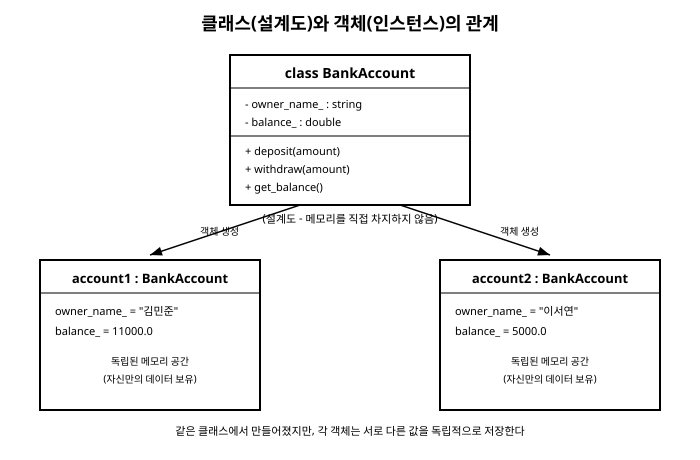

# 10장. 클래스와 객체

[◀ 이전: 9장. 참조와 메모리 관리(RAII)](ch09-참조와메모리관리.md) | [📖 목차](00-목차.md) | [다음: 11장. 상속과 다형성 ▶](ch11-상속과다형성.md)

---

3장에서 우리는 `int`, `double`, `bool`처럼 언어가 기본으로 제공하는 자료형을 배웠습니다. 이 자료형들은 각각 정해진 종류의 값 하나만을 담을 수 있습니다. 하지만 현실의 문제는 "은행 계좌"나 "학생"처럼 여러 값과 그 값들에 대한 동작이 하나로 묶인 개념을 다루어야 하는 경우가 훨씬 많습니다. C++에서는 이런 사용자 정의 자료형을 **클래스(class)**로 만듭니다. 이번 장에서는 클래스를 정의하는 방법, 생성자와 소멸자, 접근 지정자, 그리고 `this` 포인터를 배우고, 은행 계좌를 표현하는 `BankAccount` 클래스를 직접 설계해 봅니다.

## 10.1 클래스는 사용자 정의 자료형이다

3장에서 배운 `int a = 10;`이라는 선언을 다시 생각해봅시다. `int`는 정수를 담기 위해 언어가 미리 정의해 둔 자료형이고, `a`는 그 자료형의 값 하나를 담는 변수입니다. 클래스도 똑같은 방식으로 동작합니다. 다만 이번에는 자료형을 프로그래머가 직접 설계합니다.

```cpp
class Point {
public:
    double x;
    double y;
};

int main() {
    Point origin;        // Point라는 자료형의 변수(객체)를 하나 만든다
    origin.x = 0.0;
    origin.y = 0.0;

    Point p1;
    p1.x = 3.0;
    p1.y = 4.0;
}
```

`Point`는 `double` 두 개(`x`, `y`)를 하나로 묶은 새로운 자료형입니다. `origin`과 `p1`은 `Point` 자료형의 값을 담는 변수이며, 이렇게 클래스로부터 만들어진 각각의 변수를 **객체(object)** 또는 **인스턴스(instance)**라고 부릅니다. 하나의 클래스(설계도)로부터 원하는 만큼 여러 개의 객체를 만들 수 있다는 점이 클래스의 핵심입니다.

## 10.2 멤버 변수와 멤버 함수

클래스 안에 선언된 변수를 **멤버 변수(member variable)**, 클래스 안에 선언된 함수를 **멤버 함수(member function)**라고 합니다. 멤버 함수는 자신이 속한 객체의 멤버 변수에 자유롭게 접근할 수 있습니다.

```cpp
class Rectangle {
public:
    double width;
    double height;

    // 멤버 함수: 이 객체의 width, height를 이용해 넓이를 계산한다
    double area() {
        return width * height;
    }

    void scale(double factor) {
        width *= factor;
        height *= factor;
    }
};

int main() {
    Rectangle rect;
    rect.width = 4.0;
    rect.height = 5.0;

    std::cout << rect.area() << '\n';  // 20 출력

    rect.scale(2.0);
    std::cout << rect.area() << '\n';  // 80 출력
}
```

7장에서 배운 일반 함수와 비교하면, 멤버 함수는 매개변수로 데이터를 넘겨받지 않아도 이미 자신이 속한 객체의 멤버 변수에 접근할 수 있다는 점이 다릅니다. `rect.area()`를 호출하면 `area` 함수는 `rect`라는 특정 객체의 `width`와 `height`를 사용합니다. 같은 클래스로 만든 다른 객체(예: `rect2`)의 `area()`를 호출하면 그 객체 자신의 `width`, `height`가 사용됩니다.

## 10.3 접근 지정자: public, private, protected

앞의 예제처럼 멤버 변수를 외부에서 마음대로 바꿀 수 있게 두면, 예를 들어 `Rectangle`의 `width`에 음수를 대입하는 등 잘못된 상태를 만들 수 있습니다. C++는 클래스 내부와 외부 사이의 경계를 **접근 지정자**로 제어합니다.

- `public`: 클래스 외부에서도 자유롭게 접근할 수 있습니다.
- `private`: 클래스 내부(멤버 함수)에서만 접근할 수 있습니다. 외부 코드는 접근할 수 없습니다.
- `protected`: `private`과 비슷하지만, 11장에서 배울 상속 관계의 자식 클래스에서는 접근할 수 있습니다.

```cpp
class Counter {
public:
    void increase() {
        count_ += 1;   // private 멤버에는 내부에서 접근 가능
    }

    int get_count() {
        return count_;
    }

private:
    int count_ = 0;    // 외부에서는 직접 접근할 수 없다
};

int main() {
    Counter c;
    c.increase();
    c.increase();
    std::cout << c.get_count() << '\n';  // 2

    // c.count_ = 100;  // 컴파일 오류: private 멤버에 외부에서 접근할 수 없다
}
```

이렇게 멤버 변수를 `private`으로 감추고, `public` 멤버 함수를 통해서만 값을 읽거나 바꾸게 만드는 방식을 **캡슐화(encapsulation)**라고 부릅니다. 캡슐화는 객체의 상태가 항상 유효한 값으로 유지되도록 보장하는 가장 기본적인 방법입니다. 이 책에서는 관례적으로 `private` 멤버 변수 이름 끝에 밑줄(`_`)을 붙여 `public` 멤버와 구분합니다. 참고로 `class` 키워드로 만든 클래스는 접근 지정자를 명시하지 않으면 기본값이 `private`입니다(반면 `struct`는 기본값이 `public`입니다).

## 10.4 생성자와 소멸자

객체가 만들어질 때 멤버 변수를 초기화해 주는 특별한 멤버 함수가 **생성자(constructor)**입니다. 생성자는 클래스 이름과 똑같은 이름을 가지며 반환형이 없습니다.

```cpp
class Point {
public:
    // 생성자: Point 객체가 만들어질 때 자동으로 호출된다
    Point(double x, double y) : x_(x), y_(y) {
        std::cout << "Point(" << x_ << ", " << y_ << ") 생성\n";
    }

private:
    double x_;
    double y_;
};

int main() {
    Point p1(3.0, 4.0);   // 생성자가 호출되어 x_ = 3.0, y_ = 4.0으로 초기화된다
}
```

`: x_(x), y_(y)` 부분을 **멤버 이니셜라이저 리스트**라고 부릅니다. 생성자 본문이 실행되기 전에 멤버 변수를 원하는 값으로 초기화하는 가장 표준적인 방법입니다. 클래스에 생성자를 하나도 정의하지 않으면 컴파일러가 아무 일도 하지 않는 **기본 생성자**를 자동으로 만들어 줍니다. 여러 개의 생성자를 정의해 다양한 방식으로 객체를 초기화할 수도 있는데, 이를 **생성자 오버로드**라고 합니다.

객체가 스코프를 벗어나 사라질 때 자동으로 호출되는 함수는 **소멸자(destructor)**입니다. 소멸자는 클래스 이름 앞에 `~`를 붙여서 만들며, 매개변수를 가질 수 없고 클래스마다 하나만 존재할 수 있습니다.

```cpp
class Point {
public:
    Point(double x, double y) : x_(x), y_(y) {}

    ~Point() {
        std::cout << "Point 소멸\n";
    }

private:
    double x_;
    double y_;
};

int main() {
    Point p(1.0, 2.0);
    std::cout << "함수 안에서 작업 중\n";
}   // 여기서 p가 스코프를 벗어나며 소멸자가 자동 호출된다
```

생성자와 소멸자의 짝은 9장에서 배운 RAII 원칙의 근간입니다. 생성자에서 자원을 획득하고 소멸자에서 정리하면, 자원 해제를 잊어버릴 걱정 없이 안전한 코드를 작성할 수 있습니다.

## 10.5 this 포인터

멤버 함수 안에서는 `this`라는 특별한 포인터를 사용할 수 있습니다. `this`는 그 멤버 함수를 호출한 객체 자신을 가리키는 포인터입니다. 8장에서 배운 포인터 개념을 그대로 사용하지만, `this`는 컴파일러가 자동으로 준비해 준다는 점이 다릅니다.

```cpp
class Point {
public:
    Point(double x, double y) : x_(x), y_(y) {}

    // 매개변수 이름이 멤버 변수와 같을 때 this로 구분한다
    void set_x(double x) {
        this->x_ = x;   // this->x_ 는 "이 객체의" x_ 를 의미
    }

    // 자기 자신에 대한 참조를 반환해 메서드 체이닝을 가능하게 한다
    Point& move_by(double dx, double dy) {
        x_ += dx;
        y_ += dy;
        return *this;
    }

private:
    double x_;
    double y_;
};

int main() {
    Point p(0.0, 0.0);
    p.move_by(1.0, 1.0).move_by(2.0, 3.0);  // 연속으로 호출 가능
}
```

대부분의 경우 멤버 변수 이름에 밑줄을 붙이는 것처럼 구분되는 명명 규칙을 쓰면 `this`를 명시적으로 쓸 일이 적지만, `*this`를 반환해서 메서드를 연속으로 호출하게 만드는 패턴에서는 `this`가 필수적으로 사용됩니다.

## 10.6 예제: BankAccount 클래스

지금까지 배운 내용을 모아 은행 계좌를 표현하는 클래스를 설계해 보겠습니다.

```cpp
#include <iostream>
#include <string>

class BankAccount {
public:
    // 생성자: 계좌 소유자 이름과 초기 잔액으로 계좌를 만든다
    BankAccount(std::string owner_name, double initial_balance)
        : owner_name_(owner_name), balance_(initial_balance) {
    }

    // 입금: 항상 성공한다고 가정
    void deposit(double amount) {
        if (amount <= 0.0) {
            std::cout << "입금액은 0보다 커야 합니다.\n";
            return;
        }
        balance_ += amount;
    }

    // 출금: 잔액이 부족하면 실패 처리
    bool withdraw(double amount) {
        if (amount <= 0.0 || amount > balance_) {
            std::cout << "출금할 수 없습니다.\n";
            return false;
        }
        balance_ -= amount;
        return true;
    }

    double get_balance() const {
        return balance_;
    }

    void print_info() const {
        std::cout << owner_name_ << "님의 잔액: " << balance_ << "원\n";
    }

private:
    std::string owner_name_;
    double balance_;
};

int main() {
    BankAccount account1("김민준", 10000.0);
    BankAccount account2("이서연", 5000.0);

    account1.deposit(3000.0);
    account1.withdraw(2000.0);

    account1.print_info();  // 김민준님의 잔액: 11000원
    account2.print_info();  // 이서연님의 잔액: 5000원
}
```

`account1`과 `account2`는 같은 `BankAccount` 클래스로 만들어졌지만 각자의 멤버 변수(`owner_name_`, `balance_`)를 독립적으로 가지고 있습니다. `account1`에 입금하거나 출금해도 `account2`의 잔액에는 아무 영향이 없습니다. 이것이 클래스가 여러 개의 독립된 객체를 만드는 설계도라는 사실을 잘 보여줍니다. `get_balance`와 `print_info` 끝에 붙은 `const`는 이 멤버 함수가 객체의 상태를 바꾸지 않겠다는 약속으로, 9장에서 배운 `const` 참조처럼 컴파일러가 그 약속을 강제해 줍니다.

## 10.7 클래스와 인스턴스의 관계

클래스는 객체를 만들기 위한 설계도이고, 객체는 그 설계도로부터 실제 메모리에 만들어진 결과물입니다. 여러 객체는 같은 구조(멤버 변수의 종류와 멤버 함수)를 공유하지만, 각자 독립된 데이터를 가집니다.



위 그림처럼 `BankAccount` 클래스 하나로부터 `account1`, `account2`처럼 원하는 만큼의 객체를 만들 수 있고, 각 객체는 서로 다른 `owner_name_`과 `balance_` 값을 독립적으로 저장합니다. 이 관계는 앞으로 배울 11장의 상속(클래스들 사이의 계층 관계), 12장의 연산자 오버로딩(클래스에 `+`, `==` 같은 연산자 정의하기), 13장의 템플릿(클래스를 여러 자료형에 대해 일반화하기)에서도 계속 등장하는 기본 개념이므로 확실히 익혀두는 것이 좋습니다.

## 요약

- 클래스는 3장에서 배운 `int`, `double` 같은 기본 자료형처럼 동작하는 사용자 정의 자료형입니다. 클래스로부터 만들어진 각 변수를 객체(인스턴스)라고 합니다.
- 클래스 안의 변수는 멤버 변수, 함수는 멤버 함수라고 부르며, 멤버 함수는 자신이 속한 객체의 멤버 변수에 자유롭게 접근합니다.
- 접근 지정자 `public`/`private`/`protected`로 클래스 내부와 외부 사이의 접근 권한을 제어하며, `private` 멤버 변수와 `public` 멤버 함수를 결합하는 것을 캡슐화라고 합니다.
- 생성자는 객체 생성 시, 소멸자는 객체 소멸 시 자동으로 호출되는 특별한 멤버 함수로, 9장에서 배운 RAII 원칙의 토대가 됩니다.
- `this`는 멤버 함수 안에서 자기 자신을 가리키는 포인터로, 이름 충돌을 해결하거나 메서드 체이닝을 구현할 때 사용합니다.
- 하나의 클래스로부터 여러 개의 독립적인 객체를 만들 수 있으며, 각 객체는 같은 구조를 공유하지만 서로 다른 데이터를 가집니다.

## 연습문제

1. 시(hour)와 분(minute)을 멤버 변수로 갖는 `Clock` 클래스를 설계하세요. 생성자로 초깃값을 받고, 분을 더하는 `add_minutes(int minutes)` 멤버 함수를 만들어 60분이 넘으면 시가 올라가도록 구현해보세요.
2. `private` 멤버 변수와 `public` getter/setter 함수를 사용하는 것이 멤버 변수를 처음부터 `public`으로 선언하는 것보다 어떤 점에서 더 안전한지 예를 들어 설명하세요.
3. 아래 코드에서 생성자와 소멸자가 각각 몇 번, 어떤 순서로 호출되는지 예측하고 실행해서 확인해보세요.
   ```cpp
   class Logger {
   public:
       Logger(std::string name) : name_(name) {
           std::cout << name_ << " 생성\n";
       }
       ~Logger() {
           std::cout << name_ << " 소멸\n";
       }
   private:
       std::string name_;
   };

   int main() {
       Logger a("A");
       {
           Logger b("B");
       }
       Logger c("C");
   }
   ```
4. `this`를 사용해 자기 자신의 참조를 반환하는 `set_owner_name`과 `set_balance` 멤버 함수를 `BankAccount` 클래스에 추가하고, `account1.set_owner_name("박지훈").set_balance(50000.0);`처럼 연속 호출이 가능하게 만들어보세요.
5. `BankAccount` 클래스에 이체 기능 `transfer_to(BankAccount& other, double amount)`를 추가해보세요. 이 함수는 자신의 잔액에서 `amount`를 출금하고, `other` 계좌에 같은 금액을 입금해야 합니다. 매개변수를 참조로 받아야 하는 이유를 9장의 내용과 연결지어 설명해보세요.

---

[◀ 이전: 9장. 참조와 메모리 관리(RAII)](ch09-참조와메모리관리.md) | [📖 목차](00-목차.md) | [다음: 11장. 상속과 다형성 ▶](ch11-상속과다형성.md)
