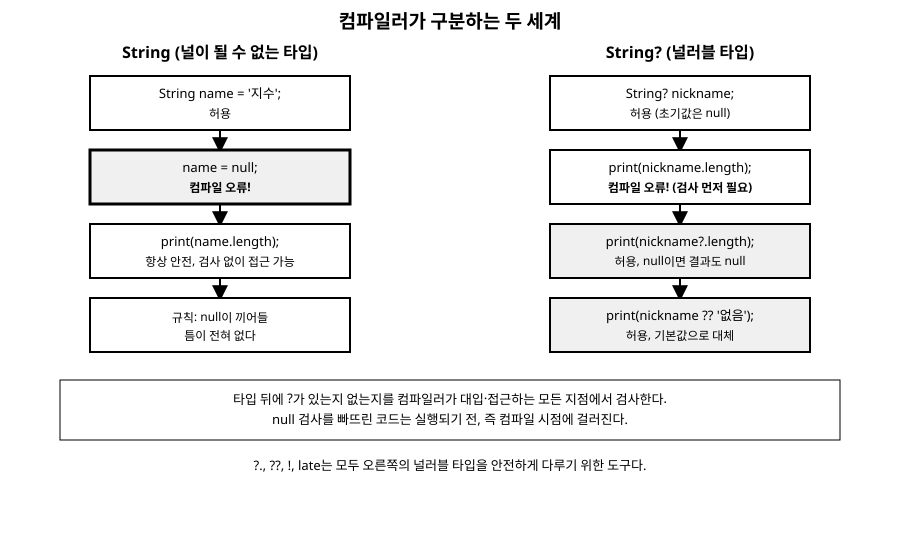

# 8장. sound null safety

[◀ 이전: 7장. 함수](ch07-함수.md) | [📖 목차](00-목차.md) | [다음: 9장. 클래스와 객체 ▶](ch09-클래스와객체.md)

---

## null이 오랫동안 골칫거리였던 이유

프로그램을 만들다 보면 "값이 있어야 할 자리에 값이 없는" 상황을 피할 수 없다. 사용자가 아직 이름을 입력하지 않았거나, 네트워크 요청이 실패해서 결과를 받지 못했거나, 데이터베이스에 그 항목이 원래부터 존재하지 않는 경우가 그렇다. 이런 "값 없음"을 표현하기 위해 대부분의 언어는 `null`(또는 `nil`, `None`)이라는 특별한 값을 제공한다.

문제는 많은 언어에서 `null`이 아무 타입에나 몰래 끼어들 수 있었다는 점이다. 변수의 타입이 `String`이라고 선언되어 있어도, 실제로는 `null`이 들어 있을 수 있었다. 그 결과 멀쩍이 안전해 보이는 코드가 실행 중에 갑자기 멈추는 사고가 끊이지 않았다. 자바의 `NullPointerException`처럼 "null인 값의 멤버에 접근하려 했다"는 오류는 실무에서 가장 흔하게 마주치는 예외 중 하나로 꼽혀왔다. 컴파일러가 코드를 보고도 "이 값이 null일 수도 있다"는 사실을 미리 알려주지 못했기 때문에, 그 오류는 항상 프로그램이 실제로 실행되는 순간에야 드러났다.

Dart는 이 문제를 근본적으로 다른 방식으로 접근한다. null이 될 수 있는 값과 절대 null이 될 수 없는 값을 애초에 타입 수준에서 구분해 놓고, 그 구분을 컴파일러가 코드 전체에서 빠짐없이 검사하게 만든 것이다. 이런 방식을 **sound null safety**라고 부른다.

## 컴파일러가 미리 갈라놓는 두 세계

"sound"라는 단어는 단순히 "null을 조심스럽게 다룬다"는 뜻이 아니다. 컴파일러가 한 번 "이 값은 null이 될 수 없다"고 판단했다면, 그 판단은 프로그램이 실행되는 어떤 경로를 거치더라도 반드시 참이라는 것을 **보증**한다는 뜻이다. 몇몇 언어의 null 검사 기능은 개발자가 다른 우회 경로를 쓰면 쉽게 뚫릴 수 있지만, Dart의 null safety는 컴파일이 통과한 코드라면 예외 없이 이 규칙을 지킨다.

3장에서 타입 뒤에 `?`를 붙이면 그 변수가 null을 가질 수 있다는 것을 잠깐 살펴봤다. 이제 그 규칙을 제대로 정리해보자. Dart의 모든 타입은 기본적으로 **널이 될 수 없는 타입(non-nullable type)**이다. `String`이라고 선언된 변수는 프로그램이 살아있는 동안 결코 null이 될 수 없다. 반면 타입 뒤에 `?`를 붙인 `String?`은 **널러블 타입(nullable type)**으로, 문자열 값을 가질 수도 있고 null을 가질 수도 있다.

```dart
void main() {
  String name = '지수';   // 널이 될 수 없는 타입
  String? nickname;       // 널러블 타입, 선언만 하면 자동으로 null

  print(name);      // 지수
  print(nickname);  // null

  // name = null;   // 컴파일 오류! String은 null을 허용하지 않는다
  nickname = '지수짱';    // 허용: String?는 문자열도, null도 가질 수 있다
}
```

이 구분은 변수를 선언할 때만 적용되는 게 아니라, 함수에 값을 넘길 때, 함수가 값을 반환할 때, 클래스의 필드에 값을 대입할 때 등 프로그램의 모든 지점에서 똑같이 강제된다. 7장에서 기본값이 없는 선택적 매개변수는 널러블 타입으로 선언해야 한다고 언급했던 것도 바로 이 규칙 때문이다.

```dart
int stringLength(String s) => s.length;

void main() {
  String? maybeName;
  // stringLength(maybeName); // 컴파일 오류! String?는 String이 필요한 자리에 못 들어간다
  stringLength(maybeName ?? '이름없음'); // 널러블 값을 널이 아닌 값으로 바꿔서 전달
}
```

`String?` 타입의 값은 `String`이 필요한 곳에 그대로 들어갈 수 없다. "혹시 null이면 어떻게 할 것인가"라는 질문에 답을 해줘야만 컴파일러가 통과시켜 준다. 이 관계를 그림으로 정리하면 다음과 같다.



왼쪽의 `String`은 애초에 null이 들어올 틈이 없으므로 멤버에 언제든 안전하게 접근할 수 있다. 오른쪽의 `String?`은 null이 들어 있을 가능성이 항상 남아 있으므로, 컴파일러는 검사 없이 멤버에 접근하는 코드를 막는다. 지금부터 살펴볼 `??`, `?.`, `!`, `late`는 모두 이 오른쪽 세계, 즉 널러블 타입을 안전하고 편리하게 다루기 위한 도구들이다.

## 값이 없을 때 대신할 값 주기: ??

널 병합 연산자 `??`는 왼쪽 값이 null이면 오른쪽 값을 대신 사용하라는 뜻이다. 5장에서 삼항 연산자와 함께 잠깐 등장했었는데, 그 정체가 바로 이것이다.

```dart
void main() {
  String? city;
  String displayCity = city ?? '알수없음';
  print(displayCity); // 알수없음

  city = '서울';
  print(city ?? '알수없음'); // 서울
}
```

`city ?? '알수없음'`은 `city != null ? city : '알수없음'`과 완전히 같은 뜻이지만 훨씬 짧고 읽기 편하다. 그리고 결과 타입도 중요하다. `city`의 타입은 `String?`이지만, `city ?? '알수없음'`의 타입은 `String`이다. 오른쪽에 널이 아닌 기본값을 주는 순간, "이제부터는 절대 null이 아니다"라는 것이 타입에도 반영되는 것이다.

## 한 번만 비어있는 값을 채우기: ??=

`??=`는 "왼쪽 값이 지금 null일 때만 오른쪽 값을 대입하라"는 뜻이다. 이미 값이 있다면 아무 일도 하지 않는다.

```dart
void main() {
  String? config;
  config ??= '기본설정';
  print(config); // 기본설정

  config ??= '다른설정'; // config가 이미 null이 아니므로 무시된다
  print(config); // 기본설정
}
```

설정값처럼 "값이 없을 때만 기본값을 채우고, 이미 있으면 건드리지 않는다"는 패턴에 자주 쓰인다.

## 조건부로 안전하게 접근하기: ?.

널러블 타입의 값이 가진 필드나 메서드에 접근하고 싶은데, null 여부에 따라 다른 코드 경로를 쓰는 대신 "null이면 그냥 아무것도 하지 않고 null을 돌려달라"고 표현하고 싶을 때가 있다. 이때 `?.`(조건부 접근 연산자)를 사용한다.

```dart
class Address {
  String city;
  Address(this.city);
}

class Person {
  String name;
  Address? address; // 주소를 등록하지 않았을 수도 있다
  Person(this.name, [this.address]);
}

void main() {
  var p1 = Person('지수', Address('서울'));
  var p2 = Person('민호'); // 주소 없음

  print(p1.address?.city); // 서울
  print(p2.address?.city); // null, 오류 없이 안전하게 처리된다
}
```

`p2.address`는 null이므로, `.city`에 그냥 접근했다면 컴파일 오류가 나거나(정적으로 막히거나) 다른 언어에서는 런타임 오류가 났을 것이다. 하지만 `?.`를 쓰면 "왼쪽이 null이면 뒤의 접근을 건너뛰고 전체 결과를 null로 만든다"는 규칙이 적용되어 안전하게 처리된다. `??`와 함께 쓰면 더욱 자연스럽다.

```dart
print(p2.address?.city ?? '주소 미등록'); // 주소 미등록
```

주소가 있으면 그 도시 이름을, 없으면 기본 문구를 출력한다. 13장에서 다룰 `Map`에서 존재하지 않는 키를 조회했을 때도 결과가 널러블 타입으로 나오는데, 그 값을 다룰 때도 `?.`와 `??`가 똑같이 유용하다.

## "내가 보증한다": null 단언 연산자 !

때로는 코드의 흐름상 "이 값은 지금 이 시점에 절대 null이 아니다"라는 것을 개발자가 확신할 수 있지만, 컴파일러는 그 확신을 눈치채지 못하는 경우가 있다. 이때 값 뒤에 `!`를 붙이면 "컴파일러야, 내가 이 값이 null이 아니라고 보증할게"라는 뜻이 되어 널러블 타입을 널이 아닌 타입으로 강제로 취급하게 만든다.

```dart
String? fetchName() => '지수';

void main() {
  String? maybeName = fetchName();
  String name = maybeName!; // "절대 null이 아니다"라고 단언
  print(name.toUpperCase()); // 지수
}
```

여기서 주의할 점이 있다. `!`는 컴파일러를 안심시키는 것일 뿐, 실제로 값이 null이 아님을 보장해주지는 않는다. 만약 `maybeName`이 실제로 null이었다면, `maybeName!`이 실행되는 그 순간 "Null check operator used on a null value"라는 런타임 예외가 발생하며 프로그램이 멈춘다. 즉 `!`를 잘못 쓰면 sound null safety가 막아주려던 바로 그 문제, null에 접근해서 터지는 오류가 되살아난다.

그래서 `!`는 되도록 아껴 써야 한다. 가능하다면 `??`나 `?.`, 혹은 `if (value != null)`로 null 여부를 실제로 검사하는 코드로 대체하는 것이 훨씬 안전하다. `!`는 "다른 논리적인 근거(예: 방금 직접 null 검사를 통과했는데 컴파일러가 그 사실을 추적하지 못하는 특수한 상황)로 null이 아니라는 게 확실할 때"만 최후의 수단으로 사용하는 것이 좋다.

## 나중에 초기화하기: late

9장에서 살펴봤듯이 클래스의 필드는 보통 생성자에서 곧바로 값을 정해준다. 하지만 필드 값을 객체가 생성되는 시점이 아니라 조금 뒤에, 어떤 다른 초기화 작업이 끝난 뒤에 정해주고 싶은 경우가 있다. 이때 필드를 널러블 타입으로 선언하고 매번 null 검사를 하는 것은 번거롭고, "이 필드는 결국 값이 채워질 것"이라는 의도를 제대로 표현하지도 못한다. 이럴 때 쓰는 것이 `late` 키워드다.

```dart
class Config {
  late String apiUrl; // "나중에 반드시 초기화하겠다"는 약속

  void loadFromEnvironment() {
    apiUrl = 'https://api.example.com';
  }
}

void main() {
  var config = Config();
  // print(config.apiUrl); // 여기서 접근하면 LateInitializationError!
  config.loadFromEnvironment();
  print(config.apiUrl); // https://api.example.com
}
```

`late String apiUrl;`은 타입이 여전히 널이 될 수 없는 `String`이라는 점에 주목하자. `String?`으로 바꾼 게 아니라, "지금 당장은 값이 없지만 나중에 반드시 값이 채워질 것이고, 채워지기 전까지는 (책임지고) 접근하지 않겠다"는 약속을 컴파일러에게 하는 것이다. 만약 값이 채워지기 전에 접근하면 `LateInitializationError`라는 런타임 오류가 발생한다.

`late`는 `final`과 함께 써서 "값은 나중에 딱 한 번만 계산되지만, 계산이 실제로 필요한 시점까지는 미뤄두고 싶다"는 지연 초기화(lazy initialization)에도 유용하다.

```dart
class Report {
  late final String summary = _generateSummary(); // 처음 접근할 때 딱 한 번 계산

  String _generateSummary() {
    print('요약 계산 중...');
    return '요약 완료';
  }
}

void main() {
  var report = Report();
  print('객체 생성 완료'); // 아직 _generateSummary는 호출되지 않았다

  print(report.summary); // 이 시점에 계산이 시작된다: "요약 계산 중..." 출력 후 "요약 완료"
  print(report.summary); // 두 번째 접근부터는 캐시된 값을 재사용, 다시 계산하지 않는다
}
```

일반적인 필드 초기화는 객체가 만들어지는 즉시 값을 계산하지만, `late`가 붙은 필드는 실제로 그 값을 처음 읽는 순간에야 계산된다. 계산 비용이 크거나, 계산에 필요한 자원이 생성자 시점에는 아직 준비되지 않은 경우에 특히 유용하다. 이런 지연 계산 패턴은 15장에서 비동기 프로그래밍을 다룰 때 다시 만나게 된다.

## 종합 예제: 회원 프로필

지금까지 배운 도구들을 모아 간단한 회원 프로필 클래스를 만들어보자.

```dart
class UserProfile {
  final String id;
  String? nickname;       // 설정하지 않았을 수도 있다
  late DateTime lastLogin; // 로그인에 성공한 뒤에야 값이 채워진다

  UserProfile(this.id);

  void markLoginNow() {
    lastLogin = DateTime.now();
  }

  String greeting() {
    final displayName = nickname ?? '익명의 사용자';
    return '안녕하세요, $displayName님!';
  }
}

void main() {
  var user = UserProfile('u1001');
  print(user.greeting()); // 안녕하세요, 익명의 사용자님!

  user.nickname = '지수';
  print(user.greeting()); // 안녕하세요, 지수님!

  user.markLoginNow();
  print(user.lastLogin); // 로그인이 성공한 시각이 출력된다
}
```

`nickname`은 처음부터 없을 수 있으므로 `String?`으로, `lastLogin`은 언젠가는 반드시 값이 채워지지만 객체가 만들어지는 순간에는 아직 알 수 없으므로 `late`로 선언했다. 이렇게 각 필드의 "null 가능성"과 "초기화 시점"을 정확히 표현하는 것이 sound null safety를 잘 활용하는 핵심이다.

## 요약

- null 참조 오류는 여러 언어에서 가장 흔한 런타임 버그였다. Dart는 이를 막기 위해 널이 될 수 없는 타입(`String`)과 널러블 타입(`String?`)을 컴파일 시점에 구분하고, 그 구분을 프로그램 전체에서 예외 없이 강제한다. 이를 sound null safety라 부른다.
- 널러블 타입의 값은 널이 아닌 타입이 필요한 자리에 그대로 들어갈 수 없다. null일 가능성에 대한 답을 코드로 명시해야 한다.
- `??`는 null일 때 대체할 값을, `??=`는 값이 null일 때만 새 값을 대입한다.
- `?.`는 왼쪽 값이 null이면 뒤의 멤버 접근을 건너뛰고 전체 결과를 null로 만들어주는 조건부 접근 연산자다.
- `!`는 "이 값은 null이 아니다"라고 컴파일러에게 단언하는 연산자지만, 실제로 null이면 런타임 예외가 발생하므로 남용하지 말고 다른 안전한 방법이 없을 때만 사용해야 한다.
- `late`는 널이 될 수 없는 타입의 필드를 선언 시점이 아니라 나중에 초기화하겠다고 약속하는 키워드로, 초기화 전에 접근하면 `LateInitializationError`가 발생한다.

다음 장인 9장에서는 이런 필드들을 담는 클래스를 더 깊이 다루고, 10장에서는 클래스 사이의 관계인 상속과 믹스인을 살펴본다.

## 연습문제

1. `String greetOrDefault(String? name)` 함수를 작성해, `name`이 null이면 `'손님'`을, 값이 있으면 `'OO님, 환영합니다'`를 반환하도록 `??`를 사용해 구현해 보세요.
2. `Person` 클래스에 `Address?` 타입의 필드를 두고, `?.`와 `??`를 함께 사용해 주소의 우편번호를 안전하게 출력하는 코드를 작성해 보세요. 주소가 없을 때는 `'우편번호 없음'`을 출력해야 합니다.
3. `late` 키워드로 선언한 필드를 초기화하기 전에 접근해서 `LateInitializationError`가 발생하는 예제 프로그램을 직접 작성하고 실행 결과를 관찰해 보세요.
4. 다음 코드에서 `!`를 사용한 부분이 런타임 오류를 일으킬 수 있는 이유를 설명하고, `!` 없이 안전하게 고쳐 보세요.
   ```dart
   int? parseAge(String input) => int.tryParse(input);

   void main() {
     int age = parseAge('스무살')!;
     print(age);
   }
   ```
5. `late final`로 선언한 필드가 "처음 접근하는 시점에 딱 한 번" 계산된다는 것을 직접 확인할 수 있는 예제를 작성해 보세요. 계산 함수 안에 `print` 문을 넣어 몇 번 호출되는지 확인해 보세요.

---

[◀ 이전: 7장. 함수](ch07-함수.md) | [📖 목차](00-목차.md) | [다음: 9장. 클래스와 객체 ▶](ch09-클래스와객체.md)
