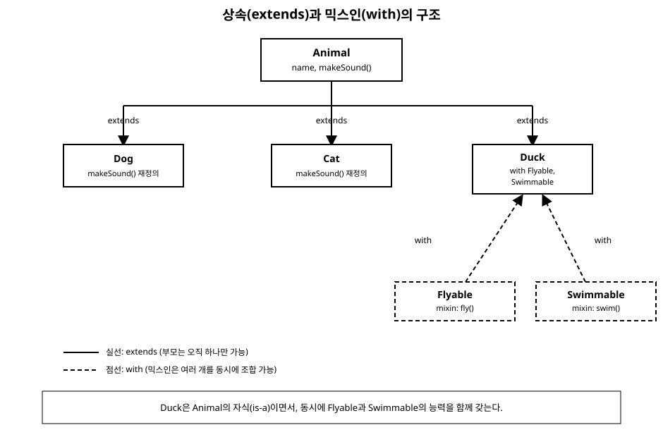

# 10장. 상속과 믹스인

[◀ 이전: 9장. 클래스와 객체](ch09-클래스와객체.md) | [📖 목차](00-목차.md) | [다음: 11장. 인터페이스와 추상 클래스 ▶](ch11-인터페이스와추상클래스.md)

---

## 공통된 부분과 달라지는 부분

9장에서는 `Person`, `BankAccount`처럼 하나의 클래스로 데이터와 동작을 묶는 방법을 배웠습니다. 하지만 실제 프로그램을 만들다 보면 서로 비슷하면서도 조금씩 다른 클래스를 여러 개 만들어야 하는 상황을 자주 만나게 됩니다. 예를 들어 "강아지"와 "고양이"는 둘 다 이름이 있고 울음소리를 낼 수 있지만, 실제로 내는 소리는 다릅니다. 이럴 때마다 두 클래스를 완전히 처음부터 따로 작성한다면, 공통된 부분(이름을 저장하는 필드 등)까지 매번 중복해서 적어야 합니다.

Dart는 이런 "공통점은 물려받고, 다른 점만 새로 작성"할 수 있게 해주는 도구로 **상속(inheritance)**을 제공합니다. 이번 장에서는 상속의 문법인 `extends`와 `super`, 메서드를 재정의하는 `@override`를 살펴보고, 상속만으로는 해결하기 어려운 상황을 보완하는 **믹스인(mixin)**을 이어서 다룹니다.

## extends로 부모 클래스 물려받기

기존에 존재하는 클래스의 필드와 메서드를 그대로 이어받으면서, 몇 가지만 다르게 정의하고 싶을 때 `extends` 키워드를 사용합니다. 이때 물려주는 클래스를 **부모 클래스(superclass)** 또는 상위 클래스라 하고, 물려받는 클래스를 **자식 클래스(subclass)** 또는 하위 클래스라고 부릅니다.

```dart
class Animal {
  String name;

  Animal(this.name);

  void makeSound() {
    print('$name이(가) 소리를 냅니다.');
  }
}

class Dog extends Animal {
  Dog(String name) : super(name);
}

void main() {
  var dog = Dog('멍멍이');
  dog.makeSound(); // 멍멍이이(가) 소리를 냅니다.
}
```

`Dog extends Animal`이라고 선언하는 순간, `Dog`는 `Animal`이 가진 `name` 필드와 `makeSound()` 메서드를 그대로 물려받습니다. `Dog` 클래스 본문에는 새로운 필드나 메서드를 전혀 추가하지 않았는데도 `dog.makeSound()`가 정상적으로 동작하는 이유가 바로 이것입니다. 이렇게 물려받은 관계를 흔히 "Dog는 Animal이다(is-a)"라는 문장으로 표현합니다.

## super로 부모에 접근하기

`super`는 "부모 클래스"를 가리키는 키워드입니다. 위 예제의 `Dog` 생성자에서 쓰인 `super(name)`처럼, 자식 클래스의 생성자는 부모 클래스의 생성자를 호출해서 부모가 관리하는 필드(`name`)를 초기화해야 합니다. 부모 클래스의 생성자가 매개변수를 요구한다면, 자식 클래스는 반드시 `super(...)`를 통해 그 값을 전달해야 합니다.

`super`는 메서드를 재정의할 때도 유용합니다. 부모의 동작을 완전히 갈아엎는 게 아니라, 부모의 동작을 실행한 다음 추가 작업을 더 하고 싶을 때 `super.메서드이름()`으로 부모의 구현을 호출할 수 있습니다.

```dart
class Dog extends Animal {
  Dog(String name) : super(name);

  @override
  void makeSound() {
    super.makeSound(); // 부모의 동작을 먼저 실행
    print('멍멍!');     // 그 다음 자식만의 동작을 추가
  }
}

void main() {
  var dog = Dog('멍멍이');
  dog.makeSound();
  // 멍멍이이(가) 소리를 냅니다.
  // 멍멍!
}
```

## 메서드 오버라이딩과 @override

부모 클래스의 메서드를 자식 클래스에서 새로운 내용으로 다시 정의하는 것을 **메서드 오버라이딩(method overriding)**이라고 합니다. 위 예제의 `makeSound()`처럼, 자식 클래스에서 부모와 이름·매개변수가 같은 메서드를 다시 작성하면 자식의 것이 우선 적용됩니다.

```dart
class Cat extends Animal {
  Cat(String name) : super(name);

  @override
  void makeSound() {
    print('$name: 야옹~');
  }
}

void main() {
  Animal cat = Cat('나비');
  cat.makeSound(); // 나비: 야옹~
}
```

`@override` 애너테이션은 필수 문법은 아니지만, "이 메서드는 부모의 것을 의도적으로 재정의한 것"임을 분명히 나타내는 표시입니다. 만약 부모 클래스에 그런 이름의 메서드가 실제로 존재하지 않는데 `@override`를 붙였다면, 정적 분석기가 오류를 알려주므로 오타나 실수를 미리 잡아낼 수 있습니다. 위 코드에서 `Animal cat = Cat('나비');`처럼 변수의 타입은 부모인 `Animal`로 선언했지만 실제로 호출되는 `makeSound()`는 `Cat`의 것이라는 점도 눈여겨볼 만합니다. Dart는 변수에 적힌 타입이 아니라 실제로 그 변수가 가리키는 객체의 타입을 기준으로 어떤 메서드를 실행할지 결정합니다.

## Dart는 왜 단일 상속만 허용하는가

`extends`는 오직 하나의 클래스만 지정할 수 있습니다. 즉 `class C extends A, B { ... }`처럼 두 개의 부모를 동시에 상속받는 것은 문법적으로 불가능합니다. Dart뿐 아니라 자바 같은 많은 언어가 이런 **단일 상속(single inheritance)** 규칙을 따릅니다.

이유는 "다이아몬드 문제(diamond problem)"라 불리는 모호함 때문입니다. 만약 `B`와 `C`가 각각 `A`를 상속하고, `D`가 `B`와 `C`를 동시에 상속한다고 해봅시다. `A`에 정의된 메서드를 `B`와 `C`가 서로 다르게 오버라이딩했다면, `D`는 그 메서드를 호출할 때 `B`의 것을 써야 할지 `C`의 것을 써야 할지 알 수 없는 모호한 상황에 빠집니다. Dart는 이런 모호함을 애초에 문법으로 차단하기 위해 클래스 상속을 한 줄기로만 제한합니다.

하지만 현실의 문제는 그렇게 단순하지 않습니다. "날 수 있다"와 "헤엄칠 수 있다"라는 서로 무관한 두 가지 동작을 하나의 클래스에 모두 담고 싶은데, 그 두 동작이 이미 각자 완성된 코드로 존재한다면 어떻게 해야 할까요? 부모를 하나만 정할 수 있는 `extends`로는 이 문제를 풀 수 없습니다. 이때 필요한 도구가 믹스인입니다.

## 믹스인으로 동작을 여러 클래스에 재사용하기

**믹스인(mixin)**은 "특정 클래스의 자식이 되지 않으면서도, 여러 클래스에 똑같은 동작을 끼워 넣을 수 있게" 해주는 Dart의 도구입니다. 믹스인은 `class` 대신 `mixin` 키워드로 선언하고, 이를 사용하는 클래스는 `extends` 대신(또는 함께) `with` 키워드로 가져다 씁니다.

```dart
mixin Flyable {
  void fly() => print('날아갑니다.');
}

mixin Swimmable {
  void swim() => print('헤엄칩니다.');
}

class Duck extends Animal with Flyable, Swimmable {
  Duck(String name) : super(name);

  @override
  void makeSound() => print('$name: 꽥꽥!');
}

void main() {
  var duck = Duck('오리');
  duck.makeSound(); // 오리: 꽥꽥!
  duck.fly();       // 날아갑니다.
  duck.swim();      // 헤엄칩니다.
}
```

`Duck`은 `extends Animal`로 부모 클래스 하나만 상속받으면서도, `with Flyable, Swimmable`로 두 개의 믹스인을 동시에 섞어 쓰고 있습니다. `with` 뒤에는 쉼표로 여러 믹스인을 나열할 수 있다는 점이 `extends`와 뚜렷하게 다릅니다. `Flyable`과 `Swimmable`은 서로 아무 관계가 없는 독립된 동작 묶음이지만, `Duck`이라는 클래스 안에서 자연스럽게 합쳐졌습니다.

믹스인은 겉보기에는 클래스와 비슷하지만 중요한 차이가 있습니다. 믹스인은 그 자체로 인스턴스를 만들 수 없습니다. `Flyable()`처럼 직접 객체를 생성하는 것은 불가능하며, 반드시 다른 클래스에 `with`로 섞여 들어가야만 의미를 가집니다. 또한 믹스인은 생성자를 가질 수 없다는 제약도 있습니다. 이런 제약들은 믹스인이 "독립된 개체"가 아니라 "다른 클래스에 끼워 넣을 동작의 조각"이라는 목적에 충실하도록 설계된 것입니다.

### on으로 믹스인의 사용 범위 제한하기

믹스인이 특정 클래스의 자손에서만 쓰이도록 제한하고 싶다면 `on` 키워드를 사용할 수 있습니다.

```dart
mixin Flyable on Animal {
  void fly() => print('$name이(가) 날아갑니다.'); // Animal의 name을 사용할 수 있다
}
```

`mixin Flyable on Animal`이라고 선언하면, `Flyable`은 `Animal`을 상속한 클래스에서만 `with`로 사용할 수 있습니다. 그 대신 `Flyable` 내부에서 `Animal`이 가진 `name` 같은 멤버를 마치 자기 것처럼 사용할 수 있게 됩니다. 이 문법은 "이 동작 묶음은 반드시 이런 능력을 갖춘 클래스에만 붙을 수 있다"는 제약을 표현하는 데 유용합니다.

## 상속 vs 믹스인: 언제 무엇을 쓸까

상속과 믹스인은 둘 다 "코드를 재사용한다"는 목적을 공유하지만, 어울리는 상황이 다릅니다.

| 구분 | 상속 (`extends`) | 믹스인 (`mixin`, `with`) |
|---|---|---|
| 표현하는 관계 | "A는 B다" (is-a), 명확한 계층 구조 | "A는 이런 능력도 갖고 있다", 횡단적인 기능 |
| 개수 제한 | 오직 하나만 가능 | `with` 뒤에 여러 개를 쉼표로 나열 가능 |
| 직접 인스턴스화 | 가능 (추상 클래스가 아니라면) | 불가능, 반드시 다른 클래스에 섞여야 함 |
| 생성자 | 가질 수 있고 `super`로 전달 가능 | 가질 수 없음 |
| 적합한 예시 | `Dog extends Animal`처럼 명확한 종류의 확장 | 로깅, 비교 가능성, 날 수 있음처럼 여러 클래스에 걸친 부가 기능 |

일반적인 기준을 정리하면 다음과 같습니다. 클래스들 사이에 자연스러운 "종류(kind-of)" 관계가 있고 그 계층이 하나로 뻗어나간다면 `extends`가 적합합니다. `Dog`와 `Cat`이 모두 `Animal`의 한 종류인 관계가 그 예입니다. 반면 서로 다른 계층에 있는 클래스들에게 같은 부가 기능(날기, 헤엄치기, 로깅, 직렬화 등)을 공통으로 끼워 넣고 싶다면 믹스인이 더 적합합니다. 상속 계층을 하나만 유지하면서도 필요한 기능을 자유롭게 조합할 수 있기 때문입니다.

두 관계를 그림으로 정리하면 다음과 같습니다.



`Animal`에서 `Dog`, `Cat`, `Duck`으로 이어지는 실선은 상속 관계로, 각 자식은 부모를 오직 하나만 가집니다. 반면 `Flyable`, `Swimmable`에서 `Duck`으로 이어지는 점선은 믹스인 관계로, 하나의 클래스가 여러 믹스인을 동시에 받아들일 수 있다는 점을 보여줍니다.

11장에서는 여기서 한 걸음 더 나아가, "이 클래스가 반드시 이런 기능을 제공해야 한다"는 규격만을 강제하는 인터페이스와 추상 클래스를 다룹니다. 상속이 코드 재사용에, 믹스인이 여러 계층에 걸친 기능 조합에 초점을 맞춘다면, 인터페이스는 구현 방법에는 관여하지 않고 오직 "이런 기능이 있어야 한다"는 약속만을 강제한다는 점에서 또 다른 관점을 제공합니다.

## 요약

- `extends`는 부모 클래스의 필드와 메서드를 자식 클래스가 물려받게 하는 상속 문법이며, 자식은 부모를 오직 하나만 가질 수 있습니다.
- `super`는 부모 클래스를 가리키며, 생성자에서 부모의 초기화를 호출하거나 메서드 안에서 부모의 구현을 함께 실행할 때 사용합니다.
- 자식 클래스에서 부모와 같은 이름의 메서드를 다시 정의하는 것을 메서드 오버라이딩이라 하고, `@override` 애너테이션으로 의도를 명시하면 오타나 실수를 정적 분석기가 잡아줍니다.
- Dart는 다이아몬드 문제를 피하기 위해 단일 상속만 허용하지만, 이는 여러 계층에 걸친 동작을 재사용하기 어렵다는 한계를 남깁니다.
- 믹스인(`mixin` 키워드로 선언, `with`로 사용)은 인스턴스화할 수 없고 생성자도 가질 수 없는 대신, 하나의 클래스가 여러 개를 동시에 섞어 쓸 수 있어 상속의 한계를 보완합니다. `on` 키워드로 믹스인이 적용될 수 있는 클래스의 범위를 제한할 수도 있습니다.
- "종류" 관계가 명확한 계층에는 상속을, 여러 계층에 걸친 부가 기능에는 믹스인을 사용하는 것이 일반적인 선택 기준입니다.

## 연습문제

1. `Shape`이라는 부모 클래스를 만들고 `name` 필드와 `describe()` 메서드를 정의한 뒤, `Circle`과 `Square`가 이를 상속해서 각자의 `describe()`를 오버라이딩하도록 작성해 보세요.
2. 위 문제의 `describe()`에서 `super.describe()`를 호출해 부모의 출력 뒤에 자식만의 설명을 덧붙이도록 수정해 보세요.
3. `Loggable`이라는 믹스인을 만들어 `log(String message)` 메서드를 정의하고, 서로 상속 관계가 없는 두 개의 클래스에 각각 `with Loggable`로 적용해 보세요.
4. `mixin Comparable2 on num` 형태로 `on` 절을 사용하는 믹스인을 만들어, `num`을 상속한 클래스에서만 사용할 수 있는 비교 메서드를 정의해 보세요.
5. 다음 코드가 왜 컴파일되지 않는지 설명하고, 믹스인을 이용해 올바르게 고쳐 보세요.
   ```dart
   class Bird {}
   class Fish {}

   class FlyingFish extends Bird, Fish {} // 오류!
   ```

---

[◀ 이전: 9장. 클래스와 객체](ch09-클래스와객체.md) | [📖 목차](00-목차.md) | [다음: 11장. 인터페이스와 추상 클래스 ▶](ch11-인터페이스와추상클래스.md)
