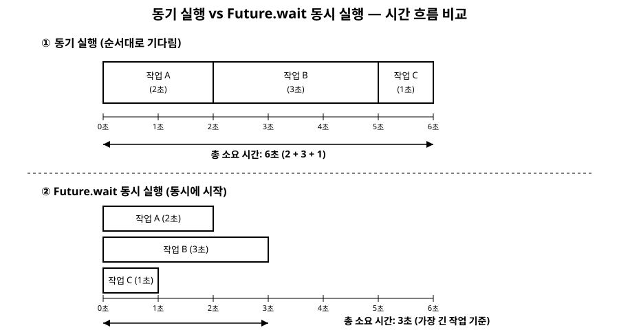

# 15장. 비동기 프로그래밍(Future, async/await)

[◀ 이전: 14장. 확장 메서드(extension)](ch14-확장메서드.md) | [📖 목차](00-목차.md) | [다음: 16장. 스트림(Stream) 기초 ▶](ch16-스트림기초.md)

---

지금까지 작성한 코드는 위에서 아래로 한 줄씩, 앞의 문장이 끝나야 다음 문장이 실행되는 방식이었습니다. 이런 실행 방식을 **동기(synchronous) 실행**이라고 부릅니다. 대부분의 코드는 이렇게 실행되어도 문제가 없지만, 네트워크 요청이나 파일 읽기처럼 결과가 도착하기까지 시간이 걸리는 작업을 만나면 동기 실행은 큰 약점을 드러냅니다. 이번 장에서는 그 문제를 직접 확인하고, Dart가 이를 해결하기 위해 제공하는 `Future`와 `async`/`await` 문법을 배웁니다.

## 동기 실행의 문제: 기다리는 동안 아무것도 못 한다

시간이 걸리는 작업을 동기적으로 처리하면 어떤 일이 벌어지는지 직접 확인해봅시다. `dart:io`의 `sleep` 함수는 지정한 시간 동안 프로그램 전체를 진짜로 멈추는, 완전히 동기적인 함수입니다.

```dart
import 'dart:io';

// 날씨 서버에 요청을 보내는 상황을 흉내 낸 동기 함수
String fetchWeatherSync() {
  print('날씨 서버에 요청을 보냅니다...');
  sleep(Duration(seconds: 2)); // 2초 동안 프로그램 전체가 정지한다
  return '오늘 서울의 날씨: 맑음';
}

void main() {
  print('프로그램 시작');
  final weather = fetchWeatherSync();
  print(weather);
  print('다른 작업 수행'); // weather 값이 오기 전까지는 절대 실행되지 않는다
}
```

이 코드를 실행하면 `프로그램 시작`이 찍힌 뒤 정확히 2초 동안 아무 일도 일어나지 않습니다. `sleep`이 실행되는 동안 Dart는 다른 어떤 코드도 진행할 수 없습니다. 실제 프로그램이었다면 사용자 입력을 받거나 화면을 갱신하는 일조차 멈춰버립니다. 네트워크 요청, 파일 입출력, 데이터베이스 조회처럼 "결과가 언제 올지 확실하지 않은" 작업을 이런 식으로 짜면, 그 작업 하나가 프로그램 전체를 마비시킵니다. 이 문제를 해결하려면 "이 값은 지금 당장은 없지만, 나중에 도착할 것"이라는 개념이 필요합니다. Dart는 이를 `Future`라는 타입으로 표현합니다.

## Future&lt;T&gt;: 미래에 도착할 값

`Future<T>`는 지금 당장은 값이 없지만 미래의 어느 시점에 타입 `T`의 값(또는 오류)을 갖게 될 것이라는 약속을 나타내는 객체입니다. 우체국 택배의 운송장 번호와 비슷합니다. 운송장 번호 자체는 물건이 아니지만, 그 번호를 통해 나중에 물건이 도착했는지 확인하고 받을 수 있습니다.

`Future.delayed`는 지정한 시간이 지난 뒤 값을 만들어내는 `Future`를 생성합니다. 앞의 `fetchWeatherSync`를 비동기 버전으로 바꿔봅시다.

```dart
Future<String> fetchWeather() {
  // 2초 뒤에 문자열 값을 만들어내는 Future를 즉시 반환한다
  return Future.delayed(Duration(seconds: 2), () => '오늘 서울의 날씨: 맑음');
}
```

`fetchWeather()`를 호출하면 2초를 기다리지 않고 즉시 `Future<String>` 객체가 반환됩니다. 이 객체는 아직 값이 준비되지 않은 "대기(pending)" 상태이며, 2초가 지나면 문자열 값을 갖고 "완료(completed)" 상태가 됩니다. 완료된 `Future`의 값을 꺼내 쓰려면 `then` 메서드에 콜백 함수를 전달합니다.

```dart
void main() {
  print('프로그램 시작');
  fetchWeather().then((weather) {
    print(weather);
  });
  print('날씨를 기다리는 동안 다른 작업 수행');
}
```

이 코드를 실행하면 `프로그램 시작`과 `날씨를 기다리는 동안 다른 작업 수행`이 먼저 출력되고, 2초 뒤에야 날씨 문자열이 출력됩니다. `sleep`을 썼던 이전 예제와 달리, `Future`를 기다리는 동안에도 프로그램은 계속 다음 코드를 실행할 수 있습니다. 오류가 발생할 수 있는 `Future`는 `catchError`로 처리합니다.

```dart
Future<String> fetchWeatherWithError() {
  return Future.delayed(Duration(seconds: 1), () {
    throw Exception('서버 응답 없음');
  });
}

void main() {
  fetchWeatherWithError()
      .then((weather) => print(weather))
      .catchError((e) => print('오류 발생: $e'));
}
```

`then`을 여러 번 이어붙이는 방식은 동작하지만, 처리 단계가 늘어날수록 콜백이 콜백 안에 겹겹이 쌓여 코드를 읽기 어렵게 만듭니다. Dart는 이 문제를 해결하기 위해 `async`와 `await`라는 문법을 제공합니다.

## async/await: Future를 동기 코드처럼 읽기

함수 선언에 `async` 키워드를 붙이면 그 함수는 항상 `Future`를 반환하게 되고, 함수 본문 안에서 `await` 키워드를 사용할 수 있게 됩니다. `await Future식`은 그 `Future`가 완료될 때까지 **현재 함수의 실행만** 일시 정지하고, 값이 준비되면 그 값을 마치 동기 코드처럼 바로 받아옵니다. 앞의 `then` 예제를 `async`/`await`로 다시 써보겠습니다.

```dart
Future<void> main() async {
  print('프로그램 시작');
  final weather = await fetchWeather(); // 여기서 2초간 일시 정지
  print(weather);
  print('다음 작업 수행');
}
```

이번에는 출력 순서가 바뀝니다. `프로그램 시작`이 찍힌 뒤 2초를 기다렸다가 날씨가 출력되고, 그다음에야 `다음 작업 수행`이 출력됩니다. 여기서 꼭 짚어야 할 점은, 이 "일시 정지"가 `sleep`이 만들었던 전면적인 멈춤과는 다르다는 것입니다. `await`는 오직 `main` 함수 하나의 진행만 멈추며, 다른 비동기 작업이나 이벤트 루프는 그 사이에도 계속 동작할 수 있습니다. `await`가 있는 함수가 여러 개 동시에 실행 중이라면, 하나가 값을 기다리는 동안 다른 함수는 자기 할 일을 계속할 수 있습니다.

오류 처리는 8장에서 다룬 것과 똑같이 `try`/`catch`로 감쌀 수 있어, 콜백 체인보다 훨씬 익숙한 형태로 코드를 작성할 수 있습니다.

```dart
Future<void> main() async {
  try {
    final weather = await fetchWeatherWithError();
    print(weather);
  } catch (e) {
    print('오류 발생: $e');
  }
}
```

## 여러 작업을 동시에 기다리기: Future.wait

`await`를 여러 번 순서대로 쓰면 각 작업이 차례로 실행되어, 걸리는 시간이 모두 더해집니다. 날씨와 뉴스를 각각 가져오는 두 함수를 예로 들어봅시다.

```dart
Future<String> fetchWeather() =>
    Future.delayed(Duration(seconds: 2), () => '날씨: 맑음');

Future<String> fetchNews() =>
    Future.delayed(Duration(seconds: 3), () => '뉴스: Dart 3.0 출시');
```

두 작업을 순서대로 기다리면 총 5초(2초 + 3초)가 걸립니다.

```dart
Future<void> sequential() async {
  final stopwatch = Stopwatch()..start();
  final weather = await fetchWeather();
  final news = await fetchNews();
  print('$weather / $news');
  print('걸린 시간: ${stopwatch.elapsedMilliseconds}ms'); // 약 5000ms
}
```

하지만 두 작업이 서로의 결과에 의존하지 않는다면, 굳이 순서대로 기다릴 필요가 없습니다. 이럴 때 `Future.wait`을 사용하면 여러 `Future`를 동시에 시작시켜 놓고, 전부 완료될 때까지 한 번에 기다릴 수 있습니다.

```dart
Future<void> concurrent() async {
  final stopwatch = Stopwatch()..start();
  final results = await Future.wait([
    fetchWeather(),
    fetchNews(),
  ]);
  print(results.join(' / '));
  print('걸린 시간: ${stopwatch.elapsedMilliseconds}ms'); // 약 3000ms
}
```

`Future.wait`은 `Future<T>`의 리스트를 받아, 모든 작업이 끝나면 각 결과를 원래 순서 그대로 담은 `List<T>`를 담은 `Future<List<T>>`를 반환합니다. 총 소요 시간은 가장 오래 걸리는 작업(여기서는 3초)만큼입니다. 여러 개의 독립적인 네트워크 요청을 처리할 때 `Future.wait`을 쓰는 것과 각각 `await`로 순서대로 처리하는 것은 결과는 같지만 걸리는 시간이 크게 달라지므로, 작업들이 서로 의존하지 않는다면 `Future.wait`을 사용하는 편이 유리합니다.

## 동기 실행과 비동기 실행의 시간 흐름 비교

아래 그림은 세 개의 작업(A: 2초, B: 3초, C: 1초)을 처리할 때, 순서대로 기다리는 동기적 방식과 `Future.wait`으로 동시에 시작하는 방식의 시간 흐름이 어떻게 다른지 보여줍니다.



위쪽 타임라인처럼 순서대로 기다리면 각 작업의 시간이 그대로 더해져 총 6초가 걸리지만, 아래쪽 타임라인처럼 세 작업을 동시에 시작하면 가장 오래 걸리는 작업(3초)만큼만 기다리면 됩니다. 이 그림에서 눈여겨볼 점은, 동시에 시작한다고 해서 각 작업이 걸리는 개별 시간(2초, 3초, 1초)이 줄어드는 것은 아니라는 사실입니다. `Future.wait`이 줄여주는 것은 "기다리는 시간"이며, 각 작업 자체의 처리 시간은 그대로입니다.

## 요약

- 동기 실행은 시간이 걸리는 작업을 만나면 그 작업이 끝날 때까지 프로그램 전체를 멈춥니다. `dart:io`의 `sleep`이 그 예입니다.
- `Future<T>`는 지금은 없지만 미래에 값(또는 오류)을 갖게 될 것을 나타내는 객체이며, `Future.delayed`처럼 즉시 반환되면서 나중에 값을 채웁니다.
- `then`/`catchError`로 `Future`의 결과와 오류를 처리할 수 있지만, 처리 단계가 늘어나면 콜백이 중첩되어 읽기 어려워집니다.
- `async` 키워드가 붙은 함수는 `Future`를 반환하며, 그 안에서 `await`로 다른 `Future`의 값을 동기 코드처럼 받아올 수 있습니다. `await`는 현재 함수의 실행만 멈추며, 프로그램 전체를 멈추지는 않습니다.
- 서로 의존하지 않는 여러 작업은 `await`를 순서대로 쓰는 대신 `Future.wait`으로 동시에 시작해 전체 대기 시간을 줄일 수 있습니다.
- 오류 처리는 8장에서 배운 `try`/`catch` 문법을 그대로 `async`/`await` 코드에 사용할 수 있습니다.

이번 장에서 배운 `Future`는 "값 하나"가 미래에 도착하는 상황을 다룹니다. 하지만 실시간 채팅 메시지나 센서 값처럼 값이 한 번이 아니라 여러 번, 시간에 걸쳐 도착하는 경우도 있습니다. 이런 상황을 다루는 도구가 16장에서 배울 `Stream`입니다.

## 연습문제

1. `Future.delayed`를 사용해 1초 뒤에 사용자 이름 문자열을 반환하는 함수 `fetchUserName`을 작성하고, `then`을 사용해 결과를 출력해보세요.
2. 1번에서 만든 `fetchUserName`을 `async`/`await` 문법으로 호출하는 `main` 함수를 작성하고, `then` 방식과 출력 결과가 같은지 확인해보세요.
3. 무작위로 오류를 던질 수 있는 `Future<int>` 반환 함수를 작성하고, `try`/`catch`로 오류를 처리하는 `async` 함수를 작성해보세요. (힌트: `dart:math`의 `Random`으로 임의의 조건을 만들 수 있습니다.)
4. 각각 1초, 2초, 4초가 걸리는 세 개의 `Future<String>` 반환 함수를 작성하고, `Stopwatch`를 사용해 순서대로 `await`했을 때와 `Future.wait`으로 동시에 기다렸을 때 걸리는 시간을 비교해보세요.
5. `await`가 "현재 함수의 실행만 멈춘다"는 말이 `sleep`이 만드는 멈춤과 어떻게 다른지, 직접 두 개의 `async` 함수를 동시에 실행시켜보며 확인하고 설명해보세요.

---

[◀ 이전: 14장. 확장 메서드(extension)](ch14-확장메서드.md) | [📖 목차](00-목차.md) | [다음: 16장. 스트림(Stream) 기초 ▶](ch16-스트림기초.md)
