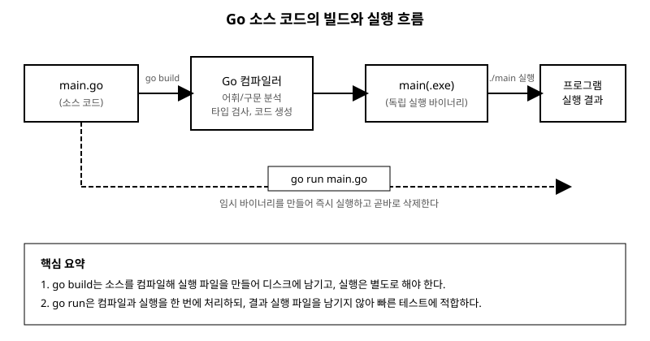

# 2장. 첫 프로그램과 빌드/실행 과정

[◀ 이전: 1장. Go란 무엇인가](ch01-go란.md) | [📖 목차](00-목차.md) | [다음: 3장. 변수와 자료형 ▶](ch03-변수와자료형.md)

---

1장에서 Go가 어떤 언어인지, 왜 만들어졌는지를 살펴보았습니다. 이제 직접 손을 움직여 볼 차례입니다. 이번 장에서는 가장 단순한 Go 프로그램인 "Hello, World"를 한 줄씩 뜯어보고, 이 코드가 어떤 과정을 거쳐 실행 가능한 프로그램이 되는지 확인합니다. 또한 Go 특유의 엄격한 컴파일러가 어떤 오류를 잡아내는지, 그리고 코드 스타일을 자동으로 정리해 주는 `gofmt`는 무엇인지도 함께 다룹니다.

## 첫 프로그램: Hello, World

먼저 작업할 디렉터리를 하나 만들고, 그 안에 `go.mod` 파일을 준비합니다. `go.mod`가 무엇인지는 1장에서 간단히 소개했으니, 기억이 나지 않는다면 잠시 되짚어보아도 좋습니다.

```
mkdir hello
cd hello
go mod init example/hello
```

이제 같은 디렉터리에 `main.go`라는 이름의 파일을 만들고 다음 내용을 입력합니다.

```go
package main

import "fmt"

func main() {
	fmt.Println("Hello, World!")
}
```

파일을 저장한 뒤 터미널에서 다음 명령을 실행하면 화면에 인사말이 출력됩니다.

```
go run main.go
```

```
Hello, World!
```

겨우 다섯 줄이지만, 이 안에는 Go 프로그램이 반드시 갖춰야 하는 구조가 모두 담겨 있습니다. 한 줄씩 차례로 살펴보겠습니다.

## 한 줄씩 뜯어보기

### package main

```go
package main
```

Go의 모든 소스 파일은 반드시 `package` 선언으로 시작해야 합니다. 패키지(package)는 관련된 코드를 묶는 단위로, Go 프로그램은 하나 이상의 패키지로 구성됩니다. 이 중에서 `main`이라는 이름은 특별한 의미를 가집니다. 패키지 이름이 `main`인 패키지는 "이 패키지가 독립적으로 실행 가능한 프로그램의 시작점"이라는 것을 컴파일러에게 알려줍니다.

만약 패키지 이름을 `main`이 아닌 다른 이름(예: `mathutil`)으로 지정하면, 그 패키지는 실행 파일이 아니라 다른 프로그램에서 가져다 쓰는 라이브러리 역할을 하게 됩니다. 라이브러리 성격의 패키지를 만들고 여러 패키지로 프로그램을 나누는 방법은 16장(패키지와 모듈)에서 자세히 다룹니다. 지금은 "실행 가능한 프로그램을 만들려면 `package main`으로 시작해야 한다"는 규칙만 기억해두면 충분합니다.

### import "fmt"

```go
import "fmt"
```

`import`문은 다른 패키지의 기능을 현재 파일에서 가져다 쓰겠다고 선언하는 구문입니다. `fmt`는 Go 표준 라이브러리에 포함된 패키지로, 이름 그대로 "포맷"과 관련된 기능, 즉 화면에 값을 출력하거나 문자열을 형식에 맞춰 조합하는 함수들을 제공합니다. `fmt` 패키지를 비롯한 여러 표준 라이브러리는 17장(표준 라이브러리 둘러보기)에서 폭넓게 소개합니다.

`import`한 패키지 안의 함수를 쓸 때는 `패키지이름.함수이름` 형태로 접근합니다. 아래에서 살펴볼 `fmt.Println`이 바로 그 예입니다.

### func main()

```go
func main() {
	fmt.Println("Hello, World!")
}
```

`func`는 함수(function)를 선언하는 키워드입니다. 함수에 대해서는 6장에서 본격적으로 다루지만, 여기서는 `main`이라는 이름의 함수가 특별하다는 점만 짚고 넘어가겠습니다. `package main` 안에 있는 `main` 함수는 프로그램이 실행될 때 가장 먼저 호출되는 진입점(entry point)입니다. 콘솔 애플리케이션이든 서버든, `package main`으로 만든 모든 Go 프로그램은 정확히 하나의 `main` 함수를 가져야 하며, 프로그램 실행은 이 함수의 첫 줄에서 시작해 마지막 줄에서 끝납니다.

`main` 함수는 매개변수를 받지 않고 반환값도 없습니다. 함수 본문은 중괄호 `{ }`로 감싸며, 그 안에 `fmt.Println("Hello, World!")`라는 한 줄이 들어 있습니다. `fmt.Println`은 인자로 받은 값을 화면(정확히는 표준 출력)에 출력하고 줄바꿈까지 자동으로 덧붙이는 함수입니다.

## go run과 go build의 차이

앞서 `go run main.go`로 프로그램을 실행해 보았습니다. 그런데 Go에는 프로그램을 실행 가능한 상태로 만드는 명령이 하나 더 있습니다. 바로 `go build`입니다. 두 명령은 비슷해 보이지만 하는 일이 다릅니다.

```
go build main.go
```

이 명령을 실행하면 아무 출력도 나타나지 않습니다. 대신 현재 디렉터리에 `main`(윈도우에서는 `main.exe`)이라는 실행 파일이 새로 생성됩니다. `go build`는 소스 코드를 컴파일해서 실행 파일을 만드는 데까지만 하고, 그 파일을 실행하지는 않습니다. 만든 실행 파일을 직접 실행하려면 다음처럼 별도로 명령을 내려야 합니다.

```
./main
```

```
Hello, World!
```

반면 `go run main.go`는 내부적으로 컴파일과 실행을 한 번에 처리합니다. 임시 디렉터리에 실행 파일을 만든 뒤 곧바로 실행하고, 실행이 끝나면 그 임시 파일을 삭제합니다. 그래서 `go run`을 실행한 뒤에는 디렉터리를 아무리 살펴봐도 실행 파일이 남아 있지 않습니다.

두 명령의 용도는 이렇게 구분하면 됩니다.

- **`go run`**: 코드를 작성하는 도중 빠르게 결과를 확인하고 싶을 때. 실행 파일이 남지 않으므로 반복적인 테스트에 편리합니다.
- **`go build`**: 완성된 프로그램을 다른 사람에게 배포하거나 서버에 올릴 때. 한 번 컴파일해 두면, Go가 설치되어 있지 않은 컴퓨터에서도 그 실행 파일 하나만으로 프로그램을 실행할 수 있습니다.

바로 이 "실행 파일 하나만 있으면 어디서든 돌아간다"는 특징이 1장에서 언급했던, Go가 클라우드 인프라 도구나 커맨드라인 도구를 만들 때 즐겨 쓰이는 이유 중 하나입니다.

## 소스 코드에서 실행까지: 빌드 흐름

`go build`나 `go run`을 실행했을 때 내부적으로 어떤 과정이 벌어지는지 그림으로 살펴보겠습니다.



과정을 정리하면 다음과 같습니다.

1. **소스 코드 작성**: `main.go`처럼 `.go` 확장자를 가진 텍스트 파일에 사람이 읽을 수 있는 Go 코드를 작성합니다.
2. **컴파일**: Go 컴파일러가 소스 코드를 읽어 문법이 올바른지 확인하고(어휘/구문 분석), 타입이 규칙에 맞는지 검사한 뒤(타입 검사), 최종적으로 CPU가 직접 실행할 수 있는 기계어 코드를 생성합니다.
3. **실행 파일 생성**: `go build`는 이 과정의 결과물을 디스크에 실행 파일로 저장합니다. 이 파일에는 프로그램 실행에 필요한 모든 것이 이미 담겨 있어서, 별도의 인터프리터나 런타임을 설치하지 않고도 그 자체로 실행됩니다.
4. **실행**: 운영체제가 이 실행 파일을 프로세스로 띄우면, `main` 함수부터 코드가 순서대로 실행됩니다.

`go run`은 2~4번 과정을 이어서 처리하되 결과물을 남기지 않는 지름길이라고 이해하면 됩니다. 컴파일이라는 단계가 있다는 점, 그리고 그 결과가 파이썬처럼 매번 해석되는 것이 아니라 한 번 기계어로 번역된 뒤 반복해서 재사용된다는 점이 Go 프로그램의 실행 속도가 빠른 이유 중 하나입니다.

## gofmt: 코드 스타일을 자동으로 통일하기

여러 사람이 함께 코드를 작성하다 보면 들여쓰기를 탭으로 할지 스페이스로 할지, 중괄호를 어디에 놓을지 같은 사소한 문제로 논쟁이 벌어지기 쉽습니다. Go는 이런 논쟁 자체를 없애버리기로 했습니다. Go 설치에는 `gofmt`라는 도구가 기본으로 포함되어 있는데, 이 도구는 Go 코드를 정해진 단 하나의 스타일로 자동으로 정리해 줍니다.

```
gofmt -w main.go
```

`-w` 옵션을 주면 결과를 화면에 출력하는 대신 파일 자체를 정리된 내용으로 덮어씁니다. `go fmt ./...`처럼 `go` 명령을 통해 현재 모듈 전체에 적용할 수도 있습니다.

`gofmt`가 적용하는 대표적인 규칙 몇 가지를 소개합니다.

- 들여쓰기는 항상 탭(tab) 문자를 사용합니다.
- 여는 중괄호 `{`는 같은 줄 끝에 둡니다(다음 줄로 내리지 않습니다).
- 불필요한 괄호나 공백을 정리합니다.

예를 들어 다음처럼 스타일이 뒤섞인 코드를 작성해도,

```go
package main
import "fmt"
func main() {
    fmt.Println("Hello, World!")
}
```

`gofmt`를 실행하면 들여쓰기가 탭으로 바뀌고 코드가 정돈된 모습으로 자동 정리됩니다. 이 책의 모든 예제 코드도 `gofmt`가 만들어내는 스타일(탭 들여쓰기)을 그대로 따르고 있습니다. 대부분의 Go 에디터 확장은 파일을 저장할 때마다 `gofmt`를 자동으로 실행하도록 설정되어 있어서, 실무에서는 스타일을 손으로 맞출 일이 거의 없습니다.

`gofmt`는 코드의 "모양"만 정리할 뿐 로직을 바꾸지는 않습니다. 반면 다음 절에서 살펴볼 컴파일 오류는 `gofmt`로 해결할 수 없는, 코드 자체의 문제입니다.

## 흔한 컴파일 오류와 대처법

1장에서 이미 언급했듯이, Go 컴파일러는 상당히 엄격합니다. 특히 처음 Go를 접하는 사람이라면 다른 언어에서는 별문제 없이 넘어가던 상황에서 컴파일이 아예 되지 않는 경험을 하게 됩니다. 가장 자주 마주치는 두 가지 오류를 살펴보겠습니다.

### 사용하지 않는 변수

```go
package main

import "fmt"

func main() {
	message := "Hello, World!"
	name := "지훈"
	fmt.Println(message)
}
```

이 코드를 컴파일하면 다음과 같은 오류가 발생합니다.

```
./main.go:7:2: declared and not used: name
```

`name`이라는 변수를 선언했지만 어디에서도 사용하지 않았기 때문입니다. 대부분의 언어는 이런 코드를 그냥 경고 없이 통과시키지만, Go는 아예 컴파일 자체를 거부합니다. 이는 실수로 남겨진 코드나 오타를 컴파일 시점에 잡아내기 위한 설계입니다. 예를 들어 `nmae`라는 오타로 변수를 하나 더 선언해 버린 경우, 다른 언어라면 프로그램이 일단 실행되고 나서야 값이 이상하다는 것을 알아차리게 되지만, Go는 컴파일 단계에서 바로 알려줍니다.

해결 방법은 간단합니다. 변수를 실제로 사용하거나, 필요 없다면 선언 자체를 지우면 됩니다.

```go
message := "Hello, World!"
name := "지훈"
fmt.Println(message, name) // name도 사용
```

정말로 당장은 쓰지 않지만 나중에 쓸 계획이 있는 변수라면, 이름 앞에 빈 식별자 `_`를 사용해 명시적으로 "이 값은 버린다"는 의도를 나타낼 수도 있습니다. 이 관용구는 함수가 여러 값을 반환할 때 그중 일부만 필요한 경우에 특히 자주 쓰이며, 7장(배열과 슬라이스)의 `range` 반복문에서도 다시 등장합니다.

```go
_ = name // "이 변수는 의도적으로 사용하지 않는다"는 표시
```

### 사용하지 않는 import

```go
package main

import (
	"fmt"
	"strings"
)

func main() {
	fmt.Println("Hello, World!")
}
```

이 코드도 마찬가지로 컴파일되지 않습니다.

```
./main.go:5:2: "strings" imported and not used
```

`strings` 패키지를 가져왔지만 실제로는 그 안의 어떤 함수도 사용하지 않았기 때문입니다. 이 규칙 역시 사용하지 않는 변수와 같은 이유로 존재합니다. 더 이상 쓰지 않는 import를 방치하면 코드를 읽는 사람이 "이 패키지가 어딘가에서 쓰이고 있겠지"라고 착각하게 되고, 실제로 필요한 패키지가 무엇인지 파악하기도 어려워집니다.

해결 방법도 사용하지 않는 변수와 같습니다. 실제로 그 패키지의 기능을 사용하거나, 필요 없다면 import 목록에서 지우면 됩니다.

```go
import "fmt" // strings는 지움

func main() {
	fmt.Println("Hello, World!")
}
```

### 오류 메시지 읽는 법

두 사례 모두 오류 메시지가 `파일이름:줄번호:칼럼번호: 오류 내용` 형태로 나타난다는 공통점이 있습니다. `./main.go:7:2: declared and not used: name`이라는 메시지는 "`main.go` 파일의 7번째 줄, 2번째 칸에서 `name`이 선언되었지만 사용되지 않았다"는 뜻입니다. 처음에는 이런 메시지가 낯설게 느껴질 수 있지만, Go 컴파일러의 오류 메시지는 대체로 짧고 정확한 위치를 알려주므로 익숙해지면 오히려 다른 언어보다 문제를 찾기 쉽다고 느끼는 경우가 많습니다. 오류가 나면 당황하지 말고, 메시지가 가리키는 파일과 줄 번호부터 확인하는 습관을 들이는 것이 좋습니다.

이 두 가지 외에도 컴파일 오류는 앞으로 다양한 형태로 마주치게 됩니다. 예를 들어 3장(변수와 자료형)에서 다룰 자료형 불일치, 5장(제어문)에서 다룰 중괄호 누락 같은 것들입니다. 공통적으로 기억해둘 점은, Go의 컴파일 오류는 대부분 "프로그램을 실행하기 전에 문제를 알려주는 친절한 신호"라는 것입니다. 오류를 만났을 때 이를 피해가는 방법을 찾기보다, 왜 이 오류가 존재하는지를 이해하려는 태도가 Go에 익숙해지는 지름길입니다.

## 요약

- Go 소스 파일은 `package` 선언으로 시작하며, `package main`은 이 패키지가 독립 실행 가능한 프로그램임을 나타냅니다.
- `import`문으로 다른 패키지를 가져와 `패키지이름.함수이름` 형태로 그 기능을 사용합니다.
- `package main` 안의 `func main()`은 프로그램 실행이 시작되는 진입점입니다.
- `go run`은 컴파일과 실행을 한 번에 처리하고 결과 파일을 남기지 않으며, `go build`는 컴파일만 해서 실행 파일을 디스크에 남깁니다. 배포할 때는 `go build`, 개발 중 빠른 확인에는 `go run`을 주로 사용합니다.
- `gofmt`는 Go 코드의 스타일(들여쓰기, 중괄호 위치 등)을 자동으로 통일해 주는 도구이며, `gofmt -w`로 파일을 직접 정리할 수 있습니다.
- Go 컴파일러는 사용하지 않는 변수와 사용하지 않는 import를 오류로 처리해 컴파일 자체를 막습니다. 이는 실수와 오타를 조기에 발견하기 위한 의도적인 설계입니다.

## 연습문제

1. `hello`라는 새 디렉터리를 만들고 `go mod init`으로 모듈을 초기화한 뒤, 자신의 이름을 출력하는 `main.go`를 작성해 `go run`으로 실행해 보세요.
2. 같은 파일을 `go build`로 컴파일한 뒤 생성된 실행 파일을 직접 실행해 보고, `go run`을 실행했을 때와 디렉터리에 남는 파일이 어떻게 다른지 비교해 보세요.
3. 일부러 사용하지 않는 변수를 하나 추가해 컴파일 오류를 발생시켜 보고, 오류 메시지에 적힌 파일 이름과 줄 번호가 실제로 어디를 가리키는지 확인한 뒤 오류를 수정해 보세요.
4. 사용하지 않는 패키지를 import 목록에 추가해 오류를 재현해 보고, 필요 없는 import를 지우는 방식과 실제로 그 패키지를 사용하는 방식 두 가지로 각각 수정해 보세요.
5. 들여쓰기와 중괄호 위치를 일부러 뒤섞은 코드를 작성한 뒤 `gofmt -w`를 실행해 코드가 어떻게 정리되는지 저장 전후를 비교해 보세요.

---

[◀ 이전: 1장. Go란 무엇인가](ch01-go란.md) | [📖 목차](00-목차.md) | [다음: 3장. 변수와 자료형 ▶](ch03-변수와자료형.md)
