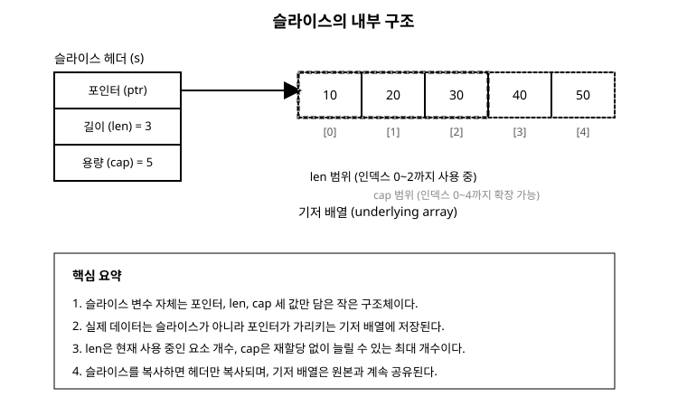

# 7장. 배열과 슬라이스

[◀ 이전: 6장. 함수](ch06-함수.md) | [📖 목차](00-목차.md) | [다음: 8장. 맵과 구조체 ▶](ch08-맵과구조체.md)

---

지금까지는 값 하나를 담는 변수만 다뤘습니다. 하지만 실제 프로그램은 대부분 "여러 개의 값의 묶음"을 다뤄야 합니다. 학생 열 명의 점수, 장바구니에 담긴 상품 목록, 파일에서 읽어온 줄의 목록처럼요. Go에서 이런 값의 묶음을 표현하는 가장 기본적인 방법이 배열(array)과 슬라이스(slice)입니다.

두 타입은 겉보기엔 비슷해 보이지만 성격이 완전히 다릅니다. 배열은 크기가 고정된 상자이고, 슬라이스는 그 상자를 유연하게 들여다보는 창(view)입니다. Go 코드에서 배열을 직접 쓰는 일은 드물고, 실무에서는 슬라이스를 압도적으로 많이 사용합니다. 이번 장에서는 왜 그런지, 그리고 슬라이스를 안전하게 다루려면 무엇을 알아야 하는지 차근차근 살펴보겠습니다.

## 배열: 크기가 고정된 값의 묶음

배열은 같은 타입의 값을 정해진 개수만큼 나란히 저장하는 자료구조입니다. 배열을 선언할 때는 반드시 크기를 함께 명시해야 합니다.

```go
package main

import "fmt"

func main() {
	var scores [5]int // int 다섯 개를 담는 배열, 초기값은 모두 0
	scores[0] = 90
	scores[1] = 85
	scores[2] = 77
	fmt.Println(scores)     // [90 85 77 0 0]
	fmt.Println(len(scores)) // 5
}
```

배열 리터럴을 사용하면 선언과 동시에 값을 채울 수 있습니다.

```go
primes := [5]int{2, 3, 5, 7, 11}
fmt.Println(primes)
```

크기를 직접 세기 귀찮다면 `...`를 사용해 컴파일러가 요소 개수를 세도록 맡길 수 있습니다.

```go
days := [...]string{"월", "화", "수", "목", "금", "토", "일"}
fmt.Println(len(days)) // 7
```

### 배열의 크기는 타입의 일부다

Go에서 중요한 사실 하나는 **배열의 크기가 타입 정보의 일부**라는 점입니다. `[5]int`와 `[10]int`는 완전히 다른 타입입니다. 그래서 다음 코드는 컴파일되지 않습니다.

```go
var a [5]int
var b [10]int
a = b // 컴파일 에러: [10]int를 [5]int에 대입할 수 없다
```

같은 이유로, 함수의 매개변수로 배열을 받으면 그 함수는 딱 그 크기의 배열만 받을 수 있습니다.

```go
func sum(arr [5]int) int {
	total := 0
	for _, v := range arr {
		total += v
	}
	return total
}
// sum 함수는 [5]int만 받을 수 있고 [3]int는 넘길 수 없다
```

### 배열은 값 타입이다

배열을 다른 변수에 대입하거나 함수에 전달하면, 원본과 완전히 독립적인 **복사본**이 만들어집니다. 이 점은 많은 언어(자바스크립트, 파이썬, 자바 등)의 배열과 가장 크게 다른 부분입니다.

```go
func main() {
	original := [3]int{1, 2, 3}
	copy := original
	copy[0] = 100

	fmt.Println(original) // [1 2 3] — 그대로다
	fmt.Println(copy)     // [100 2 3] — copy만 바뀌었다
}
```

값 복사는 안전하지만, 배열이 크면 복사 비용이 큽니다. 요소가 수만 개인 배열을 함수에 넘길 때마다 통째로 복사한다면 성능에 부담이 됩니다.

### 배열의 한계

정리하면 배열은 다음과 같은 한계를 가집니다.

- 크기가 타입에 박혀 있어서 늘어나거나 줄어들 수 없다.
- 크기가 다른 배열끼리는 서로 대입하거나 같은 함수에 넘길 수 없다.
- 값 타입이라 복사 비용이 크다.

이런 한계 때문에 "몇 개가 들어올지 미리 알 수 없는" 대부분의 실전 상황에서는 배열 대신 슬라이스를 사용합니다. 배열은 슬라이스를 이해하기 위한 기초 개념이자, 슬라이스가 내부적으로 사용하는 재료라고 생각하면 됩니다.

## 슬라이스: 배열을 감싸는 유연한 창

슬라이스는 배열 위에 씌우는 얇은 껍질입니다. 슬라이스 자체는 데이터를 직접 담고 있지 않고, "어떤 배열의 어느 구간을 얼마나 쓸 수 있는지"를 가리키는 정보만 가지고 있습니다.

### 슬라이스 리터럴

가장 간단하게 슬라이스를 만드는 방법은 배열 리터럴에서 크기를 생략하는 것입니다.

```go
fruits := []string{"사과", "바나나", "포도"}
fmt.Println(fruits)     // [사과 바나나 포도]
fmt.Println(len(fruits)) // 3
```

`[5]int`처럼 대괄호 안에 숫자를 쓰면 배열이고, `[]int`처럼 대괄호를 비워두면 슬라이스입니다. 이 표기 차이가 두 타입을 구분하는 유일한 문법적 신호이니 잘 구분해서 읽는 습관을 들이는 것이 좋습니다.

### make로 슬라이스 만들기

내용을 미리 알 수 없고 크기만 정해서 슬라이스를 만들고 싶다면 내장 함수 `make`를 사용합니다.

```go
// int 슬라이스를 만들되, 길이 3, 용량 3으로 시작
nums := make([]int, 3)
fmt.Println(nums) // [0 0 0]

// 길이와 용량을 따로 지정할 수도 있다
buf := make([]byte, 0, 1024) // 길이 0, 용량 1024
fmt.Println(len(buf), cap(buf)) // 0 1024
```

`make([]T, len)`은 길이와 용량이 같은 슬라이스를 만들고, `make([]T, len, cap)`은 길이와 용량을 따로 지정합니다. 용량을 넉넉하게 미리 잡아두면 뒤에서 설명할 `append`가 배열을 재할당하는 횟수를 줄일 수 있어 성능에 도움이 됩니다.

### nil 슬라이스와 빈 슬라이스

슬라이스의 제로 값은 `nil`입니다. 흥미롭게도 `nil` 슬라이스도 대부분의 경우 안전하게 사용할 수 있습니다.

```go
var s []int
fmt.Println(s == nil) // true
fmt.Println(len(s))   // 0
fmt.Println(cap(s))   // 0

s = append(s, 1) // nil 슬라이스에 append하면 새 슬라이스가 만들어진다
fmt.Println(s)   // [1]
```

빈 슬라이스(`[]int{}`)와 `nil` 슬라이스는 `len`이 둘 다 0이라는 점에서 비슷하지만, `nil` 비교 결과는 다릅니다. `[]int{}`는 `nil`이 아닙니다. 대부분의 상황에서는 이 차이를 신경 쓸 필요가 없지만, JSON 인코딩처럼 `nil`과 빈 값을 구분하는 라이브러리를 다룰 때는 주의가 필요합니다.

## 슬라이스의 내부 구조

슬라이스를 제대로 다루려면 그 속을 들여다볼 필요가 있습니다. 슬라이스는 사실 다음 세 가지 정보만 담은 작은 구조체입니다.

- **포인터(ptr)**: 기저 배열(underlying array)에서 슬라이스가 시작하는 위치를 가리키는 포인터
- **길이(len)**: 현재 슬라이스가 사용 중인 요소 개수
- **용량(cap)**: 시작 위치부터 기저 배열 끝까지, 재할당 없이 늘릴 수 있는 최대 요소 개수

아래 그림은 `len(s) == 3`, `cap(s) == 5`인 슬라이스가 크기 5인 기저 배열을 가리키는 모습을 보여줍니다.



이 구조를 코드로 확인해봅시다.

```go
arr := [5]int{10, 20, 30, 40, 50}
s := arr[0:3] // arr을 기반으로 슬라이스를 만든다

fmt.Println(s)        // [10 20 30]
fmt.Println(len(s))   // 3
fmt.Println(cap(s))   // 5, arr의 끝까지 남은 공간
```

`s`는 데이터를 직접 들고 있지 않습니다. `s`가 가진 것은 "`arr`의 인덱스 0부터 시작하고, 지금은 3개를 쓰고 있으며, 최대 5개까지 늘릴 수 있다"는 정보뿐입니다. 이 사실이 앞으로 나올 슬라이싱과 `append`의 동작을 이해하는 열쇠입니다.

## 슬라이싱: 슬라이스에서 부분 슬라이스 만들기

배열이나 슬라이스에 `[시작:끝]` 문법을 적용하면 그 구간만 가리키는 새로운 슬라이스를 얻을 수 있습니다. 이때 `끝`은 포함되지 않습니다(반열림 구간).

```go
nums := []int{0, 1, 2, 3, 4, 5}

a := nums[1:4] // 인덱스 1, 2, 3 → [1 2 3]
b := nums[:3]  // 처음부터 인덱스 2까지 → [0 1 2]
c := nums[3:]  // 인덱스 3부터 끝까지 → [3 4 5]
d := nums[:]   // 전체 → [0 1 2 3 4 5]

fmt.Println(a, b, c, d)
```

세 번째 인덱스를 추가로 지정해 용량까지 제한할 수도 있습니다.

```go
e := nums[1:3:4] // [시작:끝:용량 상한]
fmt.Println(len(e), cap(e)) // len=2, cap=3
```

`nums[1:3:4]`는 인덱스 1부터 2까지(길이 2)를 가리키되, 용량은 인덱스 4를 넘지 못하도록 제한합니다. 이 문법은 뒤에서 설명할 "슬라이스 공유로 인한 부작용"을 막고 싶을 때 유용합니다.

### 슬라이싱은 배열을 공유한다

여기서 반드시 기억해야 할 핵심이 있습니다. **슬라이싱은 데이터를 복사하지 않습니다.** 새로 만들어진 슬라이스는 원본과 같은 기저 배열을 가리킵니다. 그래서 한쪽에서 값을 바꾸면 다른 쪽에도 그 변화가 그대로 보입니다.

```go
original := []int{1, 2, 3, 4, 5}
part := original[1:4] // [2 3 4], original과 배열을 공유

part[0] = 999
fmt.Println(original) // [1 999 3 4 5] — original도 바뀐다!
fmt.Println(part)     // [999 3 4]
```

이 동작은 버그처럼 느껴질 수도 있지만, 사실은 성능을 위한 의도적인 설계입니다. 슬라이싱할 때마다 데이터를 복사한다면 큰 슬라이스를 다룰 때 매우 비효율적일 것입니다. 대신 Go는 "슬라이싱은 그냥 창을 하나 더 만드는 것"으로 취급하고, 데이터 복사가 필요한 경우 프로그래머가 명시적으로 `copy` 함수를 사용하도록 합니다.

```go
original := []int{1, 2, 3, 4, 5}
part := make([]int, 3)
n := copy(part, original[1:4]) // 진짜로 값을 복사한다

part[0] = 999
fmt.Println(original) // [1 2 3 4 5] — 영향 없음
fmt.Println(n)        // 3, 복사된 요소 개수
```

`copy(dst, src)`는 `src`의 값을 `dst`로 복사하고, 실제로 복사된 요소 개수를 반환합니다. 복사되는 개수는 `dst`와 `src` 중 길이가 더 짧은 쪽에 맞춰집니다.

### 함수에 슬라이스를 넘길 때도 배열은 공유된다

슬라이스를 함수의 인자로 넘기면 슬라이스 헤더(포인터, len, cap)는 복사되지만, 포인터가 가리키는 기저 배열은 공유됩니다. 그래서 함수 안에서 기존 요소의 값을 바꾸면 호출한 쪽에도 반영됩니다.

```go
func double(s []int) {
	for i := range s {
		s[i] *= 2
	}
}

func main() {
	nums := []int{1, 2, 3}
	double(nums)
	fmt.Println(nums) // [2 4 6]
}
```

이 성질은 배열과 슬라이스를 구분하는 또 하나의 중요한 차이입니다. 배열은 값 타입이라 함수에 넘기면 복사본이 전달되지만, 슬라이스는 내부에 포인터를 갖고 있어서 함수 안에서의 수정이 호출자에게도 보입니다. 다만 함수 안에서 `append`로 슬라이스 자체(길이)를 바꾸는 것은 호출자에게 자동으로 반영되지 않는데, 이는 다음 절에서 설명합니다.

## append: 슬라이스에 요소 추가하기

슬라이스에 값을 추가할 때는 내장 함수 `append`를 사용합니다.

```go
s := []int{1, 2, 3}
s = append(s, 4)
fmt.Println(s) // [1 2 3 4]

s = append(s, 5, 6, 7) // 여러 개를 한 번에 추가
fmt.Println(s)         // [1 2 3 4 5 6 7]

other := []int{8, 9}
s = append(s, other...) // 슬라이스를 풀어서 추가 (...연산자)
fmt.Println(s)          // [1 2 3 4 5 6 7 8 9]
```

`append`는 항상 결과를 반환합니다. 그래서 `append`를 호출할 때는 반드시 반환값을 원래 변수에 다시 대입해야 합니다. `append(s, 4)`만 호출하고 반환값을 버리면, `s`는 바뀌지 않은 채로 남습니다.

### append의 동작 원리: 용량이 남아있을 때

`append`가 하는 일은 상황에 따라 다릅니다. 슬라이스의 용량(cap)에 아직 여유가 있다면, `append`는 새로 배열을 만들지 않고 기존 기저 배열의 남는 공간에 값을 채워 넣습니다.

```go
s := make([]int, 3, 5) // len=3, cap=5
fmt.Println(len(s), cap(s)) // 3 5

s2 := append(s, 100) // cap에 여유가 있으므로 같은 배열을 사용
fmt.Println(len(s2), cap(s2)) // 4 5
```

이때 `s`와 `s2`는 여전히 같은 기저 배열을 공유합니다. 그래서 다음처럼 예상치 못한 결과가 나올 수 있습니다.

```go
base := make([]int, 3, 5)
base[0], base[1], base[2] = 1, 2, 3

a := append(base, 100) // base의 남는 용량을 사용
b := append(base, 200) // b도 base의 같은 남는 용량을 사용!

fmt.Println(a) // [1 2 3 200] — 100이 아니라 200이 보인다
fmt.Println(b) // [1 2 3 200]
```

`a`와 `b`를 만들 때 둘 다 `base`의 4번째 칸(인덱스 3)에 값을 썼기 때문에, 나중에 쓴 200이 먼저 쓴 100을 덮어써 버립니다. 이런 함정을 피하려면 슬라이스를 여러 갈래로 나눠 각각 `append`할 때는 용량을 신중히 관리하거나, 앞서 본 3-인덱스 슬라이싱(`s[:len(s):len(s)]`)으로 용량을 명시적으로 제한하는 습관이 도움이 됩니다.

### append의 동작 원리: 용량이 부족할 때

용량이 부족하면 `append`는 다음과 같은 순서로 동작합니다.

1. 기존보다 더 큰 새 배열을 런타임이 할당한다(보통 기존 용량의 약 2배, 슬라이스가 커질수록 증가율은 점차 줄어든다).
2. 기존 요소를 새 배열로 모두 복사한다.
3. 새로 추가할 값을 이어서 쓴다.
4. 새 배열을 가리키는 새 슬라이스 헤더를 반환한다.

```go
s := make([]int, 0, 2)
fmt.Printf("len=%d cap=%d ptr=%p\n", len(s), cap(s), s)

for i := 0; i < 5; i++ {
	s = append(s, i)
	fmt.Printf("len=%d cap=%d\n", len(s), cap(s))
}
```

이 코드를 실행해 보면 `cap`이 2 → 4 → 8처럼 배로 늘어나는 것을 관찰할 수 있습니다(정확한 증가 폭은 Go 버전과 요소 크기에 따라 달라질 수 있습니다). 재할당이 일어나는 순간 새 슬라이스는 원본과 **다른** 기저 배열을 가리키게 됩니다. 그래서 재할당 이후에는 이전 슬라이스를 수정해도 새 슬라이스에 영향을 주지 않습니다.

```go
s := make([]int, 2, 2) // cap이 꽉 찬 상태
old := s
s = append(s, 99) // cap 초과 → 재할당 발생, s는 새 배열을 가리킴

s[0] = 111
fmt.Println(old) // 재할당 전 배열은 그대로: [0 0]
fmt.Println(s)   // [111 0 99]
```

정리하면, **용량에 여유가 있으면 append는 배열을 공유하고, 용량이 부족하면 append는 새 배열로 갈아탄다**는 것이 핵심입니다. 이 두 가지 경우가 섞여 있기 때문에 "슬라이스를 함수에 넘기고 그 안에서 append했는데 호출자에게는 반영되지 않는다"는 흔한 실수가 발생합니다.

```go
func addOne(s []int) {
	s = append(s, 1) // 재할당이 일어나면 이 s는 호출자의 슬라이스와 다른 배열을 가리킨다
}

func main() {
	nums := []int{1, 2, 3}
	addOne(nums)
	fmt.Println(nums) // [1 2 3] — 변화 없음!
}
```

함수 안에서 `append`한 결과를 호출자에게 반영하고 싶다면, 함수가 새 슬라이스를 반환하고 호출자가 그 값을 받아 써야 합니다.

```go
func addOne(s []int) []int {
	return append(s, 1)
}

func main() {
	nums := []int{1, 2, 3}
	nums = addOne(nums)
	fmt.Println(nums) // [1 2 3 1]
}
```

## 다차원 슬라이스

슬라이스의 요소로 또 다른 슬라이스를 사용하면 2차원 이상의 구조를 표현할 수 있습니다. 예를 들어 격자나 행렬을 표현할 때 자주 사용합니다.

```go
grid := make([][]int, 3) // 3개의 행
for i := range grid {
	grid[i] = make([]int, 4) // 각 행마다 4개의 열
}

grid[1][2] = 7
fmt.Println(grid) // [[0 0 0 0] [0 0 7 0] [0 0 0 0]]
```

각 행은 독립된 슬라이스이므로 길이가 서로 달라도 됩니다(들쭉날쭉한 배열, jagged array).

```go
triangle := [][]int{
	{1},
	{1, 1},
	{1, 2, 1},
}
for _, row := range triangle {
	fmt.Println(row)
}
```

## 슬라이스와 range

`for range`를 슬라이스에 사용하면 인덱스와 값을 함께 얻을 수 있습니다. 반복문의 자세한 문법은 5장 "제어문"에서 다뤘으니, 여기서는 슬라이스에 특화된 사용법만 짚어보겠습니다.

```go
nums := []int{10, 20, 30}
for i, v := range nums {
	fmt.Println(i, v)
}

// 인덱스가 필요 없다면 _ 로 무시
for _, v := range nums {
	fmt.Println(v)
}
```

한 가지 주의할 점은 `range`가 만드는 `v`가 각 요소의 **복사본**이라는 것입니다. 구조체 슬라이스를 순회하며 `v`를 수정해도 원본 슬라이스는 바뀌지 않습니다. 원본을 수정하려면 인덱스로 직접 접근해야 합니다.

```go
type Point struct{ X, Y int }

points := []Point{{1, 1}, {2, 2}}
for _, p := range points {
	p.X = 100 // p는 복사본이라 원본에 영향 없음
}
fmt.Println(points) // [{1 1} {2 2}] — 그대로

for i := range points {
	points[i].X = 100 // 인덱스로 접근해야 실제로 바뀐다
}
fmt.Println(points) // [{100 1} {100 2}]
```

## 배열과 슬라이스, 언제 무엇을 쓸까

실무에서는 다음 기준을 따르면 대체로 무난합니다.

- 요소 개수가 컴파일 시점에 고정되어 있고 절대 바뀌지 않는다는 것이 명확할 때(예: 3차원 좌표 `[3]float64`)만 배열을 고려합니다.
- 그 외 대부분의 경우, 즉 개수가 실행 중에 결정되거나 늘어나고 줄어들 가능성이 있다면 슬라이스를 사용합니다.
- 함수의 매개변수나 반환값으로는 거의 항상 슬라이스를 사용합니다. 배열을 매개변수로 받으면 크기가 다른 배열을 받을 수 없어 함수의 재사용성이 떨어집니다.

## 요약

- 배열은 크기가 타입에 포함된 고정 길이 자료구조이며, 값 타입이라 대입하거나 함수에 넘기면 통째로 복사됩니다.
- 슬라이스는 포인터, 길이(len), 용량(cap) 세 정보로 이루어진 얇은 창이며, 기저 배열을 직접 저장하지 않고 가리킵니다.
- `make([]T, len, cap)`으로 슬라이스를 만들 수 있고, 슬라이스 리터럴 `[]T{...}`로도 만들 수 있습니다.
- `s[a:b]` 형태의 슬라이싱은 데이터를 복사하지 않고 기저 배열을 공유하므로, 한쪽의 수정이 다른 쪽에도 보일 수 있습니다. 복사가 필요하면 `copy` 함수를 명시적으로 사용합니다.
- `append`는 용량이 남아있으면 같은 배열을 재사용하고, 용량이 부족하면 더 큰 배열을 새로 할당해 데이터를 옮깁니다. 재할당 여부에 따라 원본 슬라이스와 배열을 공유하는지 여부가 달라지므로, `append`의 결과는 항상 원래 변수에 다시 대입해야 합니다.
- `range`로 슬라이스를 순회할 때 얻는 값은 복사본이므로, 원본을 수정하려면 인덱스로 접근해야 합니다.

## 연습문제

1. 크기가 4인 정수 배열 두 개를 선언하고, 하나를 다른 하나에 대입한 뒤 한쪽만 수정해서 서로 영향을 주지 않는다는 것을 확인하는 프로그램을 작성해 보세요.
2. `make([]int, 0, 4)`로 슬라이스를 만들고, `for` 반복문으로 8개의 값을 `append`하면서 매 반복마다 `len`과 `cap`을 출력해 보세요. `cap`이 언제, 어떻게 늘어나는지 관찰하고 그 결과를 설명해 보세요.
3. 길이 6인 슬라이스 `nums`를 만들고, `part := nums[2:4]`로 부분 슬라이스를 만든 뒤 `part[0]`을 수정했을 때 `nums`가 어떻게 바뀌는지 확인해 보세요. 그런 다음 `copy`를 사용해 `part`를 완전히 독립된 슬라이스로 복사하는 코드로 바꿔보세요.
4. 슬라이스를 매개변수로 받아 그 안에서 `append`만 하고 반환하지 않는 함수와, `append`한 결과를 반환해서 호출자가 다시 대입하는 함수를 각각 작성해 두 결과가 어떻게 다른지 비교해 보세요.
5. `[][]int`를 사용해 3행 3열의 구구단표 일부(1~3단)를 저장하고 `range`로 출력하는 프로그램을 작성해 보세요.

---

[◀ 이전: 6장. 함수](ch06-함수.md) | [📖 목차](00-목차.md) | [다음: 8장. 맵과 구조체 ▶](ch08-맵과구조체.md)
