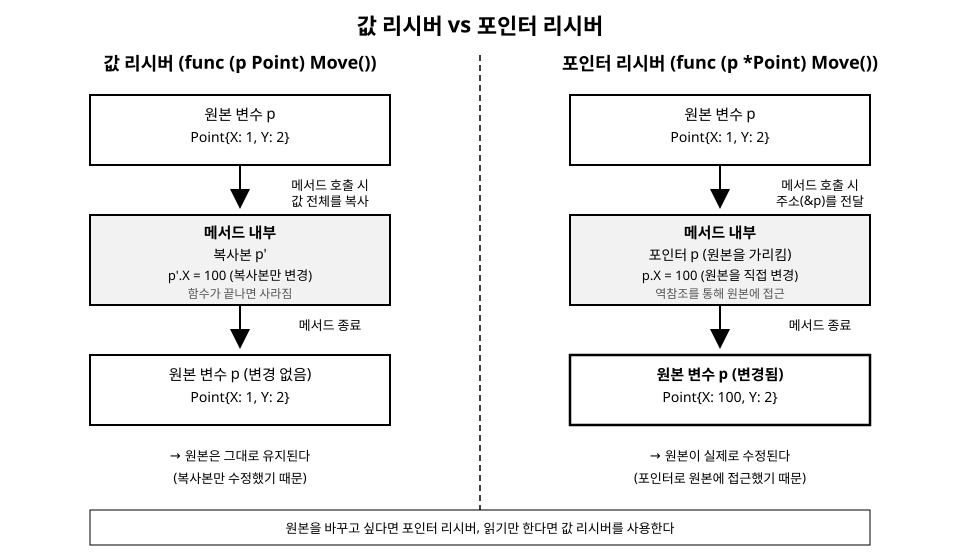

# 9장. 포인터

[◀ 이전: 8장. 맵과 구조체](ch08-맵과구조체.md) | [📖 목차](00-목차.md) | [다음: 10장. 인터페이스 ▶](ch10-인터페이스.md)

---

지금까지 작성한 함수들을 떠올려 보면, 함수에 값을 넘기고 함수 안에서 그 값을 아무리 바꿔도 함수 밖의 원본은 그대로였습니다. 이는 Go가 기본적으로 "값을 복사해서 전달"하기 때문입니다. 하지만 때로는 원본 자체를 바꾸고 싶을 때가 있습니다. 큰 구조체를 매번 복사하지 않고 효율적으로 다루고 싶을 때도 있습니다. 이럴 때 필요한 도구가 바로 포인터(pointer)입니다.

포인터라는 단어에 겁먹을 필요는 없습니다. 포인터는 결국 "메모리 주소를 담은 값"일 뿐이며, Go의 포인터는 C의 포인터보다 훨씬 안전하고 제한적입니다. 이번 장에서는 메모리 주소의 개념부터 시작해, `&`와 `*` 연산자, 그리고 8장에서 배운 구조체 메서드와 포인터가 어떻게 맞물리는지 살펴보겠습니다.

## 메모리 주소라는 개념

프로그램이 실행되면 변수는 컴퓨터의 메모리(RAM) 어딘가에 자리를 잡습니다. 그 자리에는 저마다 고유한 위치, 즉 주소(address)가 있습니다. 평소에는 이 주소를 신경 쓸 필요가 없습니다. 변수 이름으로 값을 읽고 쓰면 되니까요.

```go
package main

import "fmt"

func main() {
	x := 10
	fmt.Println(x) // 10 — 변수의 "값"을 사용
}
```

하지만 어떤 상황에서는 값이 아니라 "그 값이 저장된 위치 자체"를 다뤄야 할 때가 있습니다. 예를 들어 함수 안에서 호출자의 변수를 직접 수정하고 싶다면, 그 변수가 어디에 있는지를 함수에 알려줘야 합니다. 이때 사용하는 것이 포인터입니다. 포인터는 "값이 아니라 위치를 담은 변수"라고 이해하면 됩니다.

## & 연산자: 주소 얻기

변수 앞에 `&`를 붙이면 그 변수의 메모리 주소를 얻을 수 있습니다.

```go
package main

import "fmt"

func main() {
	x := 10
	p := &x // p는 x의 주소를 담은 포인터

	fmt.Println(x)  // 10
	fmt.Println(p)  // 0xc0000140a0 처럼 생긴 주소 값 (실행마다 다름)
	fmt.Println(&x) // p와 같은 값
}
```

`p`의 타입은 `*int`입니다. `*int`는 "int 값이 저장된 주소를 가리키는 포인터"라는 뜻입니다. 일반적으로 `T` 타입 값의 주소를 담는 포인터 타입은 `*T`로 씁니다.

```go
var x int = 10
var p *int = &x
fmt.Printf("%T\n", p) // *int
```

## * 연산자: 역참조로 값 읽고 쓰기

포인터가 가리키는 주소에 실제로 어떤 값이 들어있는지 알고 싶다면 포인터 앞에 `*`를 붙입니다. 이 동작을 역참조(dereference)라고 부릅니다.

```go
package main

import "fmt"

func main() {
	x := 10
	p := &x

	fmt.Println(*p) // 10 — p가 가리키는 곳의 값

	*p = 20 // p가 가리키는 곳의 값을 직접 수정
	fmt.Println(x)  // 20 — x도 바뀐다!
	fmt.Println(*p) // 20
}
```

`*p = 20`은 "p가 가리키는 주소에 20을 저장하라"는 뜻입니다. `p`는 `x`의 주소를 가리키고 있으므로, 결과적으로 `x`의 값이 바뀝니다. `&`와 `*`는 서로 반대되는 연산이라고 생각하면 편합니다.

- `&x`: 변수 `x`의 주소를 구한다 (값 → 주소)
- `*p`: 포인터 `p`가 가리키는 주소의 값을 구한다 (주소 → 값)

## 포인터의 제로 값: nil

포인터를 선언만 하고 아직 어떤 주소도 가리키지 않으면, 그 포인터의 값은 `nil`입니다.

```go
var p *int
fmt.Println(p)       // <nil>
fmt.Println(p == nil) // true
```

`nil` 포인터를 역참조하면 프로그램이 패닉(panic)을 일으키며 종료됩니다.

```go
var p *int
fmt.Println(*p) // panic: runtime error: invalid memory address or nil pointer dereference
```

그래서 포인터를 역참조하기 전에는 `nil`이 아닌지 확인하는 습관이 중요합니다.

```go
func safePrint(p *int) {
	if p == nil {
		fmt.Println("포인터가 nil입니다")
		return
	}
	fmt.Println(*p)
}
```

panic과 이를 안전하게 처리하는 방법은 12장 "defer, panic, recover"에서 더 자세히 다룹니다.

## new 함수로 포인터 만들기

내장 함수 `new(T)`는 `T` 타입의 제로 값을 담을 메모리 공간을 할당하고, 그 주소를 담은 `*T` 포인터를 반환합니다.

```go
p := new(int)
fmt.Println(*p) // 0 — int의 제로 값
*p = 42
fmt.Println(*p) // 42
```

`new`는 구조체에도 사용할 수 있습니다.

```go
type Point struct {
	X, Y int
}

p := new(Point)
fmt.Println(*p) // {0 0}
p.X = 10
fmt.Println(*p) // {10 0}
```

다만 실무에서는 `new`보다 `&Point{}`나 `&Point{X: 10}` 형태로 구조체 포인터를 만드는 경우가 더 흔합니다.

```go
p := &Point{X: 10, Y: 20}
fmt.Println(*p)  // {10 20}
fmt.Println(p.X) // 10 — p가 포인터여도 p.X처럼 바로 필드에 접근할 수 있다
```

`p`는 `*Point` 타입인데도 `(*p).X` 대신 `p.X`라고 쓸 수 있다는 점에 주목하세요. Go 컴파일러가 구조체 포인터의 필드 접근을 자동으로 역참조해 주기 때문에, 매번 괄호와 `*`를 붙이지 않아도 됩니다.

## Go 포인터는 포인터 연산을 허용하지 않는다

C나 C++을 알고 있다면 포인터에 정수를 더하거나 빼서 메모리를 옮겨 다니는 "포인터 연산(pointer arithmetic)"을 떠올릴 수 있습니다. Go는 이런 연산을 의도적으로 금지합니다.

```go
x := 10
p := &x
p = p + 1 // 컴파일 에러: invalid operation (mismatched types)
```

이는 실수로 잘못된 메모리 영역을 침범해 프로그램을 망가뜨리는 사고를 근본적으로 막기 위한 설계입니다. Go의 포인터는 딱 한 가지 일만 합니다. "어떤 값을 가리키고, 그 값을 읽거나 쓴다." 포인터로 메모리를 옮겨 다니거나 배열처럼 인덱스 연산을 하는 것은 허용되지 않습니다. 이 제약 덕분에 Go 프로그램은 C 스타일 포인터 버그(잘못된 주소 접근, 버퍼 오버런 등)로부터 비교적 자유롭습니다.

또한 Go는 가비지 컬렉터(garbage collector)가 메모리를 관리하기 때문에, C처럼 `malloc`/`free`를 직접 짝지어 호출할 필요가 없습니다. 어떤 값을 가리키는 포인터가 하나라도 살아있다면 가비지 컬렉터는 그 값을 회수하지 않습니다. 함수 안에서 지역 변수의 주소를 반환해도 안전한 이유가 여기에 있습니다.

```go
func newCounter() *int {
	count := 0    // 지역 변수
	return &count // count의 주소를 반환해도 안전하다
}

func main() {
	c := newCounter()
	*c++
	fmt.Println(*c) // 1
}
```

`count`는 함수 지역 변수이지만, 그 주소가 함수 밖으로 반환되어 계속 사용되므로 Go 컴파일러는 이 변수를 스택이 아닌 힙(heap)에 할당합니다. 이런 분석을 이스케이프 분석(escape analysis)이라고 부르는데, 지금 단계에서는 "포인터를 반환해도 안전하게 동작한다"는 결과만 기억해두면 충분합니다.

## 함수에 포인터를 전달해 값 바꾸기

함수의 인자로 포인터를 넘기면, 함수 안에서 역참조를 통해 호출자의 원본 값을 직접 수정할 수 있습니다. 값 전달과 포인터 전달의 차이를 직접 비교해 보겠습니다.

```go
package main

import "fmt"

// 값을 전달받는 함수: 복사본을 수정할 뿐 원본에는 영향이 없다
func incrementByValue(n int) {
	n++
}

// 포인터를 전달받는 함수: 원본을 직접 수정한다
func incrementByPointer(n *int) {
	*n++
}

func main() {
	x := 10

	incrementByValue(x)
	fmt.Println(x) // 10 — 변화 없음

	incrementByPointer(&x)
	fmt.Println(x) // 11 — 원본이 바뀜
}
```

`incrementByValue(x)`는 `x`의 복사본을 함수에 넘깁니다. 함수 안에서 그 복사본을 아무리 바꿔도 함수가 끝나면 사라질 뿐, `main`의 `x`에는 영향을 주지 않습니다. 반면 `incrementByPointer(&x)`는 `x`의 주소를 넘기므로, 함수 안에서 `*n++`은 실제로 `x`가 저장된 자리를 직접 수정합니다.

같은 원리를 구조체에도 적용할 수 있습니다. 함수가 구조체 값을 그대로 받으면 필드를 바꿔도 원본에 반영되지 않지만, 구조체 포인터를 받으면 원본 필드를 직접 바꿀 수 있습니다.

```go
type User struct {
	Name string
	Age  int
}

func birthday(u User) { // 값으로 받음
	u.Age++ // 복사본만 바뀜
}

func birthdayPtr(u *User) { // 포인터로 받음
	u.Age++ // 원본이 바뀜
}

func main() {
	alice := User{Name: "Alice", Age: 29}

	birthday(alice)
	fmt.Println(alice.Age) // 29 — 변화 없음

	birthdayPtr(&alice)
	fmt.Println(alice.Age) // 30 — 원본이 바뀜
}
```

## 값 리시버 vs 포인터 리시버

8장 "구조체와 메서드"에서 살펴본 메서드도 사실 이와 똑같은 원리로 동작합니다. 메서드를 선언할 때 리시버(receiver)를 값으로 받을지, 포인터로 받을지 정할 수 있는데, 이 선택이 바로 "메서드가 원본을 바꿀 수 있는가"를 결정합니다.

```go
type Point struct {
	X, Y int
}

// 값 리시버: p는 원본의 복사본
func (p Point) MoveByValue(dx, dy int) {
	p.X += dx
	p.Y += dy
}

// 포인터 리시버: p는 원본을 가리키는 포인터
func (p *Point) MoveByPointer(dx, dy int) {
	p.X += dx
	p.Y += dy
}

func main() {
	pt := Point{X: 1, Y: 2}

	pt.MoveByValue(10, 10)
	fmt.Println(pt) // {1 2} — 변화 없음

	pt.MoveByPointer(10, 10)
	fmt.Println(pt) // {11 12} — 원본이 바뀜
}
```

`pt.MoveByPointer(10, 10)`처럼 호출할 때 우리가 직접 `&pt`라고 쓰지 않았다는 점을 눈여겨보세요. `pt`가 이미 주소를 취할 수 있는 변수(addressable)라면, Go 컴파일러가 `(&pt).MoveByPointer(10, 10)`으로 자동 변환해 줍니다. 반대로 포인터 변수에서 값 리시버 메서드를 호출할 때도 컴파일러가 자동으로 역참조해 줍니다. 덕분에 호출하는 쪽에서는 리시버가 값인지 포인터인지 크게 신경 쓰지 않고 자연스럽게 메서드를 호출할 수 있습니다.

다음 그림은 두 리시버 방식의 차이를 정리한 것입니다.



값 리시버는 메서드가 호출될 때마다 리시버 전체를 복사합니다. 그 복사본을 메서드 안에서 아무리 바꿔도 메서드가 끝나면 사라지므로 원본은 그대로입니다. 반면 포인터 리시버는 원본의 주소를 전달받으므로, 메서드 안에서의 수정이 곧바로 원본에 반영됩니다.

## 포인터 리시버를 써야 하는 실전 기준

값 리시버와 포인터 리시버 중 무엇을 선택할지 헷갈릴 때는 다음 기준을 참고하면 대부분의 상황에서 무난한 결정을 내릴 수 있습니다.

**1. 메서드가 리시버의 상태를 변경해야 한다면 포인터 리시버를 사용합니다.**

```go
type Counter struct {
	count int
}

// count를 증가시켜야 하므로 포인터 리시버가 필수
func (c *Counter) Increment() {
	c.count++
}

func (c Counter) Value() int {
	return c.count
}
```

값 리시버로 `Increment`를 작성하면 복사본의 `count`만 증가할 뿐, 호출자가 보는 `Counter`는 절대 바뀌지 않습니다. 상태를 바꾸는 메서드에 값 리시버를 쓰는 것은 흔한 실수 중 하나입니다.

**2. 구조체의 크기가 크다면 포인터 리시버로 복사 비용을 줄입니다.**

필드가 몇 개 없는 작은 구조체(`Point{X, Y int}` 같은)는 값으로 복사해도 비용이 미미합니다. 하지만 필드가 많거나 큰 배열을 담은 구조체라면, 메서드를 호출할 때마다 통째로 복사하는 비용이 누적될 수 있습니다. 이런 경우 포인터 리시버를 사용하면 주소 하나만 전달하므로 복사 비용을 크게 줄일 수 있습니다.

**3. 타입에 포인터 리시버 메서드가 하나라도 있다면, 그 타입의 모든 메서드를 포인터 리시버로 통일하는 것이 관례입니다.**

```go
type Account struct {
	Balance int
}

// 하나라도 상태를 바꾸는 메서드가 있다면
func (a *Account) Deposit(amount int) {
	a.Balance += amount
}

// 읽기만 하는 메서드도 일관성을 위해 포인터 리시버로 맞춘다
func (a *Account) Balance2() int {
	return a.Balance
}
```

리시버 종류가 메서드마다 뒤섞여 있으면 어떤 메서드가 원본을 바꾸는지 예측하기 어려워지고, 인터페이스를 만족시키는 과정에서도 혼란을 줄 수 있습니다(인터페이스와 메서드 집합의 관계는 10장 "인터페이스"에서 자세히 다룹니다).

**4. 슬라이스, 맵, 채널처럼 이미 내부에 포인터 성격을 가진 타입을 감싼 구조체라면, 값 리시버만으로도 내부 데이터를 바꿀 수 있다는 점에 주의합니다.**

```go
type Bag struct {
	items []string
}

// 값 리시버여도 슬라이스가 가리키는 기저 배열은 공유되므로 수정이 반영된다
func (b Bag) AddInPlace(item string) {
	b.items = append(b.items, item) // 주의: 재할당이 일어나면 반영 안 될 수도 있음(7장 참고)
}
```

다만 이 방식은 7장 "배열과 슬라이스"에서 설명한 `append`의 재할당 여부에 따라 동작이 갈릴 수 있어 예측하기 어렵습니다. 슬라이스나 맵을 담은 구조체라도, 구조 자체(길이 등)를 바꾸는 메서드라면 포인터 리시버를 사용하는 편이 안전하고 일관적입니다.

정리하면, 확신이 서지 않을 때는 포인터 리시버를 기본값으로 선택해도 무방합니다. Go 커뮤니티에서도 "상태를 변경하거나, 구조체가 크거나, 이미 포인터 리시버 메서드가 있다면 포인터 리시버를 사용하라"는 규칙이 널리 통용됩니다.

## 요약

- 포인터는 값이 저장된 메모리 주소를 담은 값입니다. `&x`로 변수 `x`의 주소를 얻고, `*p`로 포인터 `p`가 가리키는 값을 읽거나 씁니다.
- 포인터의 제로 값은 `nil`이며, `nil` 포인터를 역참조하면 패닉이 발생하므로 사용 전 확인이 필요합니다.
- `new(T)`는 `T`의 제로 값을 담을 공간을 할당하고 그 포인터를 반환하지만, 구조체는 보통 `&T{...}` 형태를 더 많이 사용합니다.
- Go의 포인터는 포인터 연산(주소에 정수를 더하고 빼는 것)을 허용하지 않아 C 스타일 메모리 버그를 원천적으로 막습니다. 가비지 컬렉터가 메모리 수명을 관리하므로 함수에서 지역 변수의 주소를 반환해도 안전합니다.
- 함수나 메서드가 값을 전달받으면 복사본을 다루는 것이고, 포인터를 전달받으면 원본을 직접 다루는 것입니다.
- 값 리시버는 원본을 바꾸지 못하고, 포인터 리시버는 원본을 바꿀 수 있습니다. 상태를 변경하거나, 구조체가 크거나, 같은 타입의 다른 메서드가 이미 포인터 리시버라면 포인터 리시버를 사용하는 것이 실전에서 무난한 선택입니다.

## 연습문제

1. `swap(a, b *int)` 함수를 작성해서 두 `int` 변수의 값을 서로 맞바꿔 보세요. 포인터를 사용하지 않고 값으로만 작성했을 때와 결과가 어떻게 다른지 비교해 보세요.
2. `Rectangle` 구조체(`Width`, `Height int`)를 정의하고, 값 리시버로 만든 `Area()` 메서드와 포인터 리시버로 만든 `Scale(factor int)` 메서드를 각각 작성해 보세요. `Scale`을 호출한 뒤 `Width`와 `Height`가 실제로 몇 배 늘어나는지 확인해 보세요.
3. `nil` 포인터를 역참조했을 때 발생하는 패닉을 직접 재현해보고, 역참조 전에 `nil` 검사를 추가해 패닉을 방지하는 코드로 고쳐 보세요.
4. 필드가 5개 이상인 구조체를 정의하고, 값 리시버 메서드와 포인터 리시버 메서드를 각각 만들어 동일한 필드를 수정하는 코드를 작성해서 두 메서드 호출 후 결과가 어떻게 다른지 확인해 보세요.
5. 함수 지역 변수의 주소를 반환하는 함수를 작성하고, 반환된 포인터를 통해 값을 읽고 쓸 수 있는지 확인해 보세요. 이 동작이 왜 안전한지 가비지 컬렉터의 역할과 연결지어 설명해 보세요.

---

[◀ 이전: 8장. 맵과 구조체](ch08-맵과구조체.md) | [📖 목차](00-목차.md) | [다음: 10장. 인터페이스 ▶](ch10-인터페이스.md)
