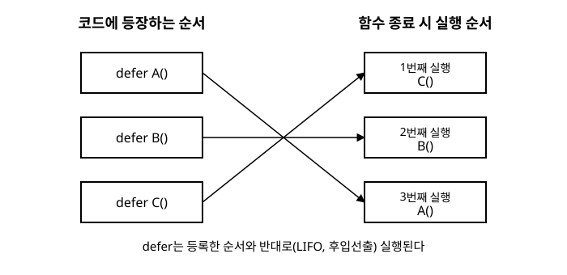

# 12장. defer, panic, recover

[◀ 이전: 11장. 에러 처리](ch11-에러처리.md) | [📖 목차](00-목차.md) | [다음: 13장. 고루틴과 동시성 기초 ▶](ch13-고루틴과동시성기초.md)

---

11장에서는 예상 가능한 실패를 `error` 값으로 다루는 방법을 배웠습니다. 하지만 세상의 모든 실패가 예상 가능한 것은 아닙니다. 배열의 범위를 벗어난 접근, `nil` 포인터 역참조처럼 프로그램에 심각한 버그가 있음을 알리는 상황도 있습니다. Go는 이런 상황을 위해 `panic`과 `recover`라는 별도의 메커니즘을 두고 있습니다. 이번 장에서는 먼저 자원 정리에 널리 쓰이는 `defer`의 동작 원리를 살펴본 다음, `panic`이 무엇이고 `recover`로 어떻게 복구하는지, 그리고 이 도구들을 언제 쓰고 언제 쓰지 말아야 하는지를 다룹니다.

## defer: 함수 종료 시점으로 실행을 미루기

`defer` 키워드를 함수 호출 앞에 붙이면, 그 호출은 즉시 실행되지 않고 **감싸고 있는 함수가 반환되기 직전**으로 미뤄집니다.

```go
package main

import "fmt"

func main() {
	fmt.Println("시작")
	defer fmt.Println("defer로 등록된 메시지")
	fmt.Println("끝")
}
```

이 코드를 실행하면 다음과 같이 출력됩니다.

```
시작
끝
defer로 등록된 메시지
```

`defer fmt.Println(...)`은 코드 순서상 중간에 있지만, 실제 실행은 `main` 함수가 끝나기 직전으로 미뤄지기 때문에 가장 마지막에 출력됩니다.

### 자원 정리 관용구

`defer`가 가장 널리 쓰이는 곳은 자원을 정리하는 코드입니다. 파일을 열었으면 반드시 닫아야 하고, 잠금(lock)을 걸었으면 반드시 풀어야 합니다. `defer`를 쓰면 "자원을 얻은 직후"에 "자원을 정리하는 코드"를 바로 옆에 적어둘 수 있어서, 중간에 코드가 아무리 복잡해지고 함수 중간에 여러 번 `return`이 있어도 정리 코드를 빠뜨릴 위험이 크게 줄어듭니다.

```go
package main

import (
	"fmt"
	"os"
)

func readFirstLine(path string) error {
	f, err := os.Open(path)
	if err != nil {
		return err
	}
	defer f.Close() // 함수가 어떤 경로로 끝나든 f.Close()는 반드시 호출된다

	buf := make([]byte, 64)
	n, err := f.Read(buf)
	if err != nil {
		return err // 이 경로로 반환되어도 defer f.Close()는 실행된다
	}

	fmt.Println(string(buf[:n]))
	return nil
}
```

`defer f.Close()`를 `os.Open`이 성공한 직후에 바로 적어두면, 그 아래 로직이 몇 줄이 되든, 중간에 몇 번을 `return`으로 빠져나가든 파일이 닫히는 것을 잊을 걱정이 없습니다. 만약 `defer` 없이 함수 끝에 `f.Close()`를 한 번만 적어뒀다면, 중간의 `return err`처럼 함수를 일찍 빠져나가는 경로마다 일일이 `Close()` 호출을 챙겨야 하고, 그중 하나라도 빠뜨리면 자원이 새는(leak) 버그가 됩니다.

### 여러 개의 defer: 역순 실행(LIFO)

한 함수 안에 `defer`를 여러 번 쓰면, 등록된 순서의 **반대 순서**로 실행됩니다. 이를 후입선출(LIFO, Last In First Out) 방식이라고 부르며, 스택(stack) 자료구조가 동작하는 방식과 같습니다.

```go
package main

import "fmt"

func main() {
	defer fmt.Println("A")
	defer fmt.Println("B")
	defer fmt.Println("C")
	fmt.Println("main 함수 본문 실행")
}
```

출력 결과는 다음과 같습니다.

```
main 함수 본문 실행
C
B
A
```

아래 그림은 이 순서를 시각적으로 정리한 것입니다.



역순으로 실행되는 이유는 자원 정리의 안전성과 관련이 있습니다. 여러 자원을 중첩해서 얻었다면(예: 데이터베이스에 연결한 뒤 그 연결로 트랜잭션을 시작), 정리는 반대 순서로 이뤄져야 합니다. 나중에 얻은 자원(트랜잭션)을 먼저 정리하고, 그다음에 먼저 얻은 자원(연결)을 정리해야 안전합니다. `defer`가 LIFO로 동작하기 때문에 이 순서를 신경 쓰지 않아도 자연스럽게 올바른 순서로 정리됩니다.

```go
conn := openConnection()
defer conn.Close() // 가장 나중에 실행되어야 한다 (연결은 맨 마지막에 닫는다)

tx := conn.BeginTx()
defer tx.Rollback() // 연결을 닫기 전에 먼저 실행되어야 한다
```

## defer의 인자는 등록 시점에 평가된다

`defer`를 쓸 때 흔히 헷갈리는 부분이 있습니다. `defer` 뒤에 오는 함수 호출의 **인자는 `defer` 문이 실행되는 바로 그 순간에 평가되어 저장됩니다.** 실제 함수 본문의 실행만 나중으로 미뤄질 뿐입니다.

```go
package main

import "fmt"

func main() {
	i := 0
	defer fmt.Println("defer 시점의 i:", i) // i는 지금(0) 평가되어 저장된다

	i = 100
	fmt.Println("현재 i:", i)
}
```

출력은 다음과 같습니다.

```
현재 i: 100
defer 시점의 i: 0
```

`defer` 문이 실행되는 순간 `i`의 값 `0`이 이미 인자로 복사되어 저장되기 때문에, 그 뒤에 `i`를 100으로 바꿔도 `defer`로 예약된 호출에는 영향을 주지 않습니다.

만약 함수가 실제로 실행되는 시점의 최신 값을 참조하고 싶다면, 인자를 바로 넘기는 대신 클로저로 감싸야 합니다.

```go
i := 0
defer func() {
	fmt.Println("defer 실행 시점의 i:", i) // 클로저가 i 변수 자체를 참조한다
}()

i = 100
// 출력: defer 실행 시점의 i: 100
```

첫 번째 예제는 `i`의 "그 순간의 값"을 인자로 복사해서 넘겼고, 두 번째 예제는 익명 함수(클로저)가 `i`라는 변수 자체를 참조하고 있어서 함수가 실제로 실행되는 시점의 값을 읽습니다. 이 차이는 반복문 안에서 `defer`를 쓸 때 특히 자주 실수를 유발하므로 잘 기억해두는 것이 좋습니다.

## defer는 반환값을 수정할 수 있다

함수에 이름이 붙은 반환값(named return value)이 있다면, `defer`로 등록한 함수 안에서 그 반환값을 읽고 수정할 수 있습니다. 이 성질은 뒤에서 살펴볼 `recover` 패턴에서 매우 중요하게 쓰입니다.

```go
package main

import "fmt"

func increment() (result int) {
	defer func() {
		result++ // 이미 정해진 반환값을 defer 안에서 한 번 더 바꾼다
	}()
	return 10
}

func main() {
	fmt.Println(increment()) // 11
}
```

`return 10`이 실행되면 이름 붙은 반환값 `result`에 10이 대입되지만, 함수가 실제로 호출자에게 제어를 넘기기 전에 `defer`로 등록된 함수가 실행되면서 `result`를 11로 바꿔놓습니다. 그래서 최종적으로 호출자는 11을 받습니다.

## panic: 프로그램이 정상적으로 계속될 수 없다는 신호

`panic`은 "지금 상태로는 정상적인 실행을 계속할 수 없다"는 것을 알리는 매커니즘입니다. Go 런타임은 다음과 같은 상황에서 자동으로 `panic`을 발생시킵니다.

- 슬라이스나 배열의 범위를 벗어난 인덱스에 접근할 때 (`index out of range`)
- `nil` 포인터나 `nil` 맵, `nil` 인터페이스를 잘못된 방식으로 사용할 때
- 정수를 0으로 나눌 때 (`integer divide by zero`)
- 실패할 수 있는 타입 단언을 콤마 ok 형태 없이 사용했는데 타입이 맞지 않을 때
- 이미 닫힌 채널에 값을 보내려고 할 때 (채널은 14장 채널에서 다룹니다)

```go
package main

import "fmt"

func main() {
	nums := []int{1, 2, 3}
	fmt.Println(nums[5]) // panic: runtime error: index out of range [5] with length 3
}
```

이런 런타임 상황 외에도, 개발자가 직접 내장 함수 `panic()`을 호출해서 패닉을 일으킬 수 있습니다.

```go
func mustPositive(n int) int {
	if n < 0 {
		panic(fmt.Sprintf("n은 음수일 수 없다: %d", n))
	}
	return n
}
```

`panic`이 발생하면 다음과 같은 순서로 진행됩니다.

1. 현재 함수의 나머지 코드 실행이 즉시 중단됩니다.
2. 그 함수 안에 등록된 `defer`들이 (등록의 역순으로) 실행됩니다.
3. 함수가 종료되면서 패닉이 호출자로 전파되고, 호출자에서도 등록된 `defer`들이 실행됩니다.
4. 이 과정이 호출 스택을 따라 계속 위로 전파되다가, 누군가 `recover`로 패닉을 잡지 않으면 결국 최상위(`main`)까지 전파되어 프로그램이 비정상 종료되며 스택 트레이스가 출력됩니다.

## panic과 error, 무엇이 다른가

11장에서 다룬 `error`와 `panic`은 둘 다 "실패"를 표현하지만 의미가 다릅니다.

| | error | panic |
|---|---|---|
| 의미 | 예상 가능한 실패 (파일 없음, 잘못된 입력, 네트워크 오류) | 프로그램이 정상적으로 계속될 수 없는 상황 (버그, 심각한 초기화 실패) |
| 처리 방식 | 반환값으로 전달, 호출자가 명시적으로 확인 | 호출 스택을 따라 자동으로 전파 |
| 기본 대응 | 호출자가 상황에 맞게 복구하거나 재시도 | 대부분 복구 불가능, 프로그램 종료가 기본 |
| 사용 빈도 | 매우 흔함, 일상적인 실패 처리 | 드묾, 예외적인 상황 전용 |

비유하자면, `error`는 "이 일이 실패할 수 있다는 것을 이미 알고 있고, 실패했을 때 무엇을 할지도 정해뒀다"는 뜻이고, `panic`은 "일어나서는 안 되는 일이 일어났고, 지금 이 함수는 더 이상 무엇을 해야 할지 알 수 없다"는 뜻입니다. 파일이 없는 것은 흔히 일어날 수 있는 일이므로 `error`로 다루지만, 배열의 존재하지 않는 인덱스에 접근하는 것은 코드에 버그가 있다는 뜻이므로 `panic`으로 다뤄지는 것이 자연스럽습니다.

## recover: defer 안에서 패닉을 복구하기

`recover`는 진행 중인 패닉을 멈추고 정상적인 실행 흐름을 되찾는 내장 함수입니다. 다만 `recover`는 **`defer`로 등록한 함수 안에서 호출할 때만** 의미가 있습니다.

이유를 이해하려면 패닉이 전파되는 방식을 다시 떠올려야 합니다. `panic`이 발생하면 함수의 나머지 코드는 건너뛰고, 오직 `defer`로 등록된 함수들만 순서대로 실행됩니다. 즉 패닉이 진행 중인 동안 "아직 실행되는 코드"는 `defer`로 등록된 함수뿐입니다. `recover`는 바로 이 시점, 즉 패닉이 스택을 타고 전파되는 도중에 호출되어야 그 전파를 멈출 수 있습니다. 평소의 정상적인 실행 흐름(즉, 패닉이 발생하지 않은 상태)에서 `recover`를 호출하면 아무 효과 없이 `nil`만 반환됩니다.

```go
package main

import "fmt"

func safeDivide(a, b int) (result int, err error) {
	defer func() {
		if r := recover(); r != nil {
			// r에는 panic()에 전달된 값이 들어있다
			err = fmt.Errorf("복구된 패닉: %v", r)
		}
	}()

	result = a / b // b가 0이면 여기서 panic이 발생한다
	return result, nil
}

func main() {
	result, err := safeDivide(10, 0)
	if err != nil {
		fmt.Println("에러:", err)
	} else {
		fmt.Println("결과:", result)
	}

	result, err = safeDivide(10, 2)
	fmt.Println(result, err)
}
```

출력은 다음과 같습니다.

```
에러: 복구된 패닉: runtime error: integer divide by zero
5 <nil>
```

이 코드가 동작하는 원리를 짚어보면 다음과 같습니다.

1. `a / b`에서 `b`가 0이면 런타임 패닉이 발생합니다.
2. 패닉이 발생하는 즉시 `safeDivide`의 나머지 코드(`return result, nil`)는 건너뛰고, `defer`로 등록된 익명 함수가 실행됩니다.
3. 그 익명 함수 안에서 `recover()`를 호출하면 진행 중이던 패닉 값을 돌려받으면서 패닉의 전파가 멈춥니다.
4. 이름 붙은 반환값 `err`에 새로운 에러를 대입합니다. 앞서 배운 "defer는 반환값을 수정할 수 있다"는 성질이 여기서 핵심적으로 쓰입니다.
5. `safeDivide`는 패닉으로 죽지 않고, 정상적으로 `(0, error)`를 반환하며 끝납니다.

이 패턴, 즉 **패닉을 recover로 잡아서 error로 바꿔 반환하는 것**은 Go에서 "패닉을 안전망으로만 쓰고 바깥으로 노출하지 않는" 가장 대표적인 관용구입니다.

## panic/recover 남용 금지 — error를 우선하라

`panic`과 `recover`를 보고 나면 "이걸로 예외 처리를 흉내 낼 수 있지 않을까"라는 생각이 들 수 있습니다. 하지만 이는 Go의 관용에 크게 어긋나는 사용법입니다. 11장에서 살펴본 것처럼 Go는 예상 가능한 실패를 값으로 명시적으로 드러내는 것을 지향하는 언어입니다. `panic`을 일상적인 제어 흐름으로 사용하면 다음과 같은 문제가 생깁니다.

- 함수 시그니처만 봐서는 그 함수가 패닉을 일으킬 수 있는지 전혀 알 수 없습니다. `error`처럼 반환 타입에 드러나지 않기 때문입니다.
- 호출자가 매번 `recover`를 준비해두지 않으면 패닉 하나가 프로그램 전체를 종료시킬 수 있습니다.
- 코드의 정상 흐름과 실패 흐름이 뒤섞여, 11장에서 피하려 했던 "예외 방식의 문제"가 그대로 재현됩니다.

그래서 다음과 같은 원칙을 따르는 것이 좋습니다.

- **예상 가능한 실패(잘못된 입력, 파일 없음, 네트워크 오류 등)는 항상 `error`로 표현합니다.** 이것이 기본값이어야 합니다.
- **`panic`은 정말로 프로그래머의 버그이거나, 프로그램이 더 진행되면 안 되는 초기화 실패 같은 상황에만 사용합니다.** 예를 들어 설정 파일 파싱에 실패해 서버가 아예 시작할 수 없는 경우, `main` 함수 근처에서 `panic`(또는 `log.Fatal`)으로 즉시 종료하는 것은 합리적입니다.
- **라이브러리나 패키지 함수는 패닉을 외부로 노출하지 않는 것이 좋은 매너입니다.** 패키지 내부에서 재귀적인 로직이나 서드파티 코드 때문에 패닉이 발생할 수 있는 상황이라면, 패키지의 공개 함수 안에서 `recover`로 패닉을 잡아 `error`로 변환해 반환하는 것이 좋습니다. 이렇게 하면 그 패키지를 사용하는 쪽은 `error`만 신경 쓰면 되고, 패키지 내부 구현 방식에 영향을 받지 않습니다.
- **`recover`는 예상치 못한 패닉이 프로그램 전체를 끌고 내려가는 것을 막는 안전망(safety net)으로 사용합니다.** 대표적인 예로 HTTP 서버에서 각 요청을 처리하는 핸들러를 감싸는 미들웨어가 있습니다. 핸들러 하나에서 예기치 못한 패닉이 발생해도, 미들웨어의 `recover`가 그 패닉을 잡아 해당 요청만 500 에러로 응답하고 서버 프로세스 자체는 계속 살아있게 만듭니다.

```go
// 흔히 쓰이는 형태를 단순화한 예시
func recoverMiddleware(next func()) func() {
	return func() {
		defer func() {
			if r := recover(); r != nil {
				fmt.Println("요청 처리 중 패닉 복구:", r)
				// 실제로는 여기서 500 에러 응답을 내려보낸다
			}
		}()
		next()
	}
}
```

정리하면, `error`는 "당연히 있는 일"을 위한 평범한 도구이고, `panic`/`recover`는 "있어서는 안 되는 일"이 벌어졌을 때를 위한 비상 도구입니다. 비상 도구를 일상적으로 쓰면 코드가 예측하기 어려워지므로, 항상 `error`를 먼저 고려하고 `panic`은 최후의 수단으로 남겨두어야 합니다.

## 고루틴과 panic

한 가지 미리 알아두면 좋은 사실이 있습니다. 각 고루틴은 자신만의 독립적인 `defer`/`recover` 체인을 가지고 있어서, 한 고루틴에서 발생한 패닉은 그 고루틴 안에서만 `recover`로 잡을 수 있습니다. 만약 어떤 고루틴에서 발생한 패닉을 그 고루틴 안의 어떤 `defer`도 `recover`하지 못하면, 다른 고루틴이 아무리 멀쩡하게 실행 중이더라도 전체 프로그램이 즉시 종료됩니다. 즉, "다른 고루틴에서 알아서 recover 해주겠지"라는 가정은 통하지 않습니다. 이 부분은 13장 고루틴과 동시성 기초에서 고루틴을 본격적으로 다룰 때 왜 각 고루틴 내부에 자체적인 `recover` 장치를 두는 것이 중요한지와 함께 다시 살펴봅니다.

## 요약

- `defer`로 등록한 함수 호출은 감싸는 함수가 반환되기 직전에 실행되며, 파일 닫기나 잠금 해제 같은 자원 정리 코드를 자원을 얻은 바로 옆에 적어둘 수 있게 해줍니다.
- 여러 개의 `defer`는 등록된 순서와 반대로(LIFO) 실행됩니다. 중첩된 자원을 안전하게 정리할 때 이 순서가 자연스럽게 도움이 됩니다.
- `defer`에 넘기는 함수 호출의 인자는 `defer` 문이 실행되는 시점에 평가되어 저장됩니다. 실행 시점의 최신 값을 참조하려면 클로저로 감싸야 합니다.
- 이름 붙은 반환값이 있는 함수에서는 `defer` 안에서 반환값을 읽고 수정할 수 있으며, 이 성질이 `recover` 패턴에서 핵심적으로 쓰입니다.
- `panic`은 배열 범위 초과, `nil` 역참조, 0으로 나누기 같은 런타임 오류나 `panic()` 직접 호출로 발생하며, 정상적인 실행을 중단시키고 `defer`를 실행하며 호출 스택을 따라 전파됩니다.
- `error`는 예상 가능한 실패를 위한 기본 도구이고, `panic`은 프로그래머의 버그나 복구 불가능한 상황을 위한 예외적인 도구입니다. 이 둘의 역할을 바꿔 쓰지 않는 것이 중요합니다.
- `recover`는 `defer`로 등록한 함수 안에서 호출해야만 진행 중인 패닉을 멈출 수 있습니다. 이를 이용해 패닉을 `error`로 변환하거나, 서버 등에서 안전망 역할을 하는 미들웨어를 만들 수 있습니다.
- 각 고루틴은 독립적인 패닉/복구 체인을 가지므로, 고루틴에서 발생한 패닉은 그 고루틴 내부에서 직접 `recover`해야 합니다.

## 연습문제

1. `defer`를 세 번 사용해 "하나", "둘", "셋"을 등록한 뒤 실제 출력 순서를 예측하고 실행해서 확인해 보세요. 그리고 왜 그런 순서로 출력되는지 설명해 보세요.
2. `for i := 0; i < 3; i++ { defer fmt.Println(i) }` 형태의 코드가 어떤 값을 출력할지 예측하고 실행해서 확인해 보세요. 그런 다음 클로저(`defer func() { fmt.Println(i) }()`)로 바꾸면 결과가 어떻게, 왜 달라지는지 설명해 보세요.
3. 슬라이스와 인덱스를 받아 값을 안전하게 반환하는 함수 `safeGet(s []int, idx int) (value int, err error)`를 작성해 보세요. 내부에서 `defer`와 `recover`를 사용해 범위를 벗어난 인덱스 접근으로 인한 패닉을 잡아 `error`로 변환해야 합니다.
4. 이름 붙은 반환값과 `defer`를 이용해, 함수가 정상적으로 끝나든 패닉으로 끝나든 항상 실행 시간을 측정해 출력하는 함수를 작성해 보세요. (힌트: `time.Since`와 `defer`를 조합합니다.)
5. 패닉을 recover해서 error로 감싸 반환하는 함수와, 아예 recover하지 않고 패닉이 그대로 전파되게 두는 함수를 각각 작성해 두 함수를 호출하는 `main`에서 어떤 차이가 나는지 관찰해 보세요. 그리고 어떤 상황에서 recover를 하는 것이 적절하고, 어떤 상황에서는 패닉을 그대로 전파시키는 것이 나은지 자신의 생각을 정리해 보세요.

---

[◀ 이전: 11장. 에러 처리](ch11-에러처리.md) | [📖 목차](00-목차.md) | [다음: 13장. 고루틴과 동시성 기초 ▶](ch13-고루틴과동시성기초.md)
