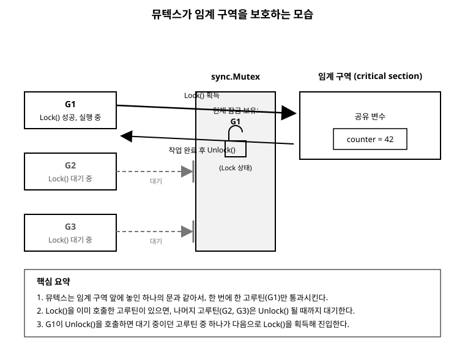

# 15장. 동기화 도구

[◀ 이전: 14장. 채널](ch14-채널.md) | [📖 목차](00-목차.md) | [다음: 16장. 패키지와 모듈 ▶](ch16-패키지와모듈.md)

---

13장에서는 고루틴으로 동시에 여러 작업을 실행하는 방법을, 14장에서는 채널로 고루틴끼리 데이터를 주고받는 방법을 배웠습니다. 그런데 여러 고루틴이 채널 없이 같은 변수를 직접 읽고 쓰면 어떻게 될까요? 이번 장에서는 그럴 때 발생하는 경쟁 상태(race condition) 문제를 살펴보고, 이를 해결하는 `sync.Mutex`와 `sync.WaitGroup`을 배웁니다. 마지막으로 채널과 뮤텍스 중 어떤 상황에 무엇을 선택해야 하는지 기준을 정리합니다.

## 경쟁 상태란 무엇인가

경쟁 상태(race condition)는 둘 이상의 고루틴이 아무런 보호 장치 없이 같은 변수에 동시에 접근하고, 그중 적어도 하나가 값을 변경할 때 발생하는 문제입니다. 실행 순서에 따라 결과가 매번 달라질 수 있어서, 어떤 때는 정상으로 보이다가도 어떤 때는 틀린 값이 나옵니다.

다음 코드를 보겠습니다. 고루틴 1000개를 실행해서 각각 전역 변수 `counter`를 1씩 증가시키는 프로그램입니다.

```go
package main

import (
	"fmt"
	"sync"
)

var counter int

func main() {
	var wg sync.WaitGroup

	for i := 0; i < 1000; i++ {
		wg.Add(1)
		go func() {
			defer wg.Done()
			counter++ // 경쟁 상태 발생 지점
		}()
	}

	wg.Wait()
	fmt.Println("최종 카운터:", counter) // 실행할 때마다 1000이 아닌 값이 나올 수 있다
}
```

직관적으로는 결과가 항상 1000이어야 할 것 같지만, 실제로 실행해 보면 990이나 987처럼 1000보다 작은 값이 불규칙하게 나옵니다. 이유는 `counter++`이 하나의 명령이 아니라 실제로는 세 단계로 이루어지기 때문입니다.

1. `counter`의 현재 값을 읽는다.
2. 읽은 값에 1을 더한다.
3. 더한 값을 다시 `counter`에 저장한다.

두 고루틴이 이 세 단계를 번갈아 가며 겹쳐서 실행하면, 둘 다 같은 값을 읽고 각자 1을 더한 뒤 저장해서 실제로는 한 번만 증가한 것처럼 되는 상황이 생깁니다. 예를 들어 `counter`가 5일 때 고루틴 A와 B가 동시에 5를 읽고, 둘 다 6을 계산해서 저장하면 두 번 증가해야 할 값이 한 번만 증가한 셈이 됩니다. 이렇게 여러 고루틴이 동시에 접근하면 안 되는 코드 구간을 임계 구역(critical section)이라고 부릅니다.

## go run -race로 경쟁 상태 탐지하기

경쟁 상태는 발생 여부가 실행 타이밍에 따라 달라지기 때문에 눈으로 코드를 봐서 알아채기 어렵고, 테스트에서도 우연히 통과해 버리는 경우가 많습니다. Go는 이런 문제를 자동으로 찾아주는 경쟁 상태 탐지기(race detector)를 내장하고 있습니다. `run`이나 `test` 명령에 `-race` 플래그를 붙이기만 하면 됩니다.

```bash
go run -race main.go
```

앞의 `counter++` 예제를 `-race` 플래그로 실행하면 다음과 비슷한 경고가 출력됩니다.

```
==================
WARNING: DATA RACE
Write at 0x... by goroutine 8:
  main.main.func1()
      /path/main.go:16 +0x...

Previous write at 0x... by goroutine 7:
  main.main.func1()
      /path/main.go:16 +0x...
==================
```

경고 메시지는 어느 goroutine이 어느 파일, 몇 번째 줄에서 같은 메모리 위치에 동시에 접근했는지 정확히 짚어 줍니다. `-race`는 실행 속도를 눈에 띄게 느리게 만들고 메모리도 더 사용하므로 운영 환경에는 사용하지 않지만, 개발 중이나 테스트를 돌릴 때는 습관적으로 켜두는 것이 좋습니다. 다음 절에서 배울 `sync.Mutex`로 이 문제를 고치고 나면 `-race`를 다시 돌려서 경고가 사라졌는지 꼭 확인해 보세요.

## sync.Mutex로 임계 구역 보호하기

뮤텍스(mutex, mutual exclusion의 줄임말)는 "한 번에 하나의 고루틴만 어떤 코드 구간에 들어갈 수 있게" 강제하는 잠금 장치입니다. Go 표준 라이브러리는 `sync` 패키지에 `Mutex` 타입을 제공합니다. 사용법은 간단합니다. 임계 구역에 들어가기 직전에 `Lock()`을 호출하고, 임계 구역을 벗어나기 직전에 `Unlock()`을 호출합니다.

앞의 카운터 예제를 뮤텍스로 고쳐보겠습니다.

```go
package main

import (
	"fmt"
	"sync"
)

var (
	counter int
	mu      sync.Mutex
)

func main() {
	var wg sync.WaitGroup

	for i := 0; i < 1000; i++ {
		wg.Add(1)
		go func() {
			defer wg.Done()

			mu.Lock()
			counter++ // 이제는 한 번에 하나의 고루틴만 실행한다
			mu.Unlock()
		}()
	}

	wg.Wait()
	fmt.Println("최종 카운터:", counter) // 항상 1000
}
```

`mu.Lock()`을 호출한 고루틴은 잠금을 획득하고 임계 구역에 들어갑니다. 다른 고루틴이 같은 뮤텍스에 `Lock()`을 호출하면, 먼저 들어간 고루틴이 `Unlock()`을 호출해서 잠금을 풀 때까지 그 자리에서 대기합니다. 덕분에 `counter++`의 읽기-더하기-쓰기 세 단계가 항상 한 고루틴에 의해서만 통째로 실행되고, 중간에 다른 고루틴이 끼어들 수 없습니다.

### defer로 Unlock 잊지 않기

`Lock()`과 `Unlock()`은 반드시 쌍을 이뤄야 합니다. `Unlock()`을 빠뜨리면 다른 모든 고루틴이 영원히 잠금을 기다리는 교착 상태(deadlock)에 빠집니다. 함수 안에 여러 개의 반환 경로나 `panic` 가능성이 있다면 `Unlock()`을 잊어버리기 쉬우므로, 잠금을 획득한 직후 `defer mu.Unlock()`을 함께 써주는 습관을 들이는 것이 안전합니다.

```go
func withdraw(amount int) error {
	mu.Lock()
	defer mu.Unlock() // 함수가 어떻게 끝나든 반드시 Unlock이 실행된다

	if amount > balance {
		return fmt.Errorf("잔액 부족: 잔액 %d, 요청 %d", balance, amount)
	}
	balance -= amount
	return nil
}
```

### 공유 데이터와 뮤텍스를 한 구조체로 묶기

뮤텍스로 보호할 데이터가 여러 개이거나, 여러 함수에서 같은 데이터를 다뤄야 한다면 구조체 안에 뮤텍스와 데이터를 함께 두는 방식을 많이 사용합니다. 이렇게 하면 "이 데이터는 반드시 이 뮤텍스로 보호해야 한다"는 규칙이 코드 구조로 드러납니다.

```go
type SafeCounter struct {
	mu    sync.Mutex
	count map[string]int
}

func NewSafeCounter() *SafeCounter {
	return &SafeCounter{count: make(map[string]int)}
}

// Inc는 주어진 키의 값을 1 증가시킨다.
func (c *SafeCounter) Inc(key string) {
	c.mu.Lock()
	defer c.mu.Unlock()
	c.count[key]++
}

// Value는 주어진 키의 현재 값을 반환한다.
func (c *SafeCounter) Value(key string) int {
	c.mu.Lock()
	defer c.mu.Unlock()
	return c.count[key]
}
```

Go의 맵은 여러 고루틴이 동시에 읽고 쓰면 안전하지 않습니다(심하면 프로그램이 그 자리에서 죽습니다). `SafeCounter`처럼 맵 접근을 전부 뮤텍스로 감싸두면, `Inc`와 `Value`를 몇 개의 고루틴에서 동시에 호출해도 안전합니다.

### 임계 구역은 최대한 짧게

뮤텍스를 잠그고 있는 동안에는 다른 고루틴이 대기해야 하므로, 잠근 채로 오래 걸리는 작업(파일 읽기, 네트워크 호출, 복잡한 계산)을 하면 동시성의 이점이 사라집니다. 임계 구역에는 공유 데이터를 실제로 건드리는 코드만 남기고, 시간이 걸리는 작업은 잠금 밖에서 처리하는 것이 좋습니다.

다음 그림은 여러 고루틴이 뮤텍스로 보호된 임계 구역에 접근하려고 할 때, 오직 하나의 고루틴만 안으로 들어가고 나머지는 대기하는 모습을 보여줍니다.



## sync.WaitGroup으로 여러 고루틴 종료 대기하기

`go` 키워드로 고루틴을 실행하면 그 즉시 다음 줄로 실행이 넘어갑니다. 만약 `main` 함수가 고루틴이 끝나기 전에 먼저 끝나버리면, 프로그램 전체가 종료되면서 아직 끝나지 않은 고루틴도 함께 사라집니다.

```go
func main() {
	for i := 0; i < 5; i++ {
		go fmt.Println("작업", i)
	}
	// 여기서 main이 바로 끝나버리면
	// 위 고루틴 다섯 개는 출력할 기회조차 없이 사라질 수 있다
}
```

`sync.WaitGroup`은 "몇 개의 고루틴이 끝나기를 기다려야 하는지" 세는 카운터입니다. 세 가지 메서드만 알면 충분합니다.

- `Add(n)`: 기다려야 할 작업 수를 n만큼 늘립니다.
- `Done()`: 작업 하나가 끝났음을 알립니다(내부적으로 카운터를 1 감소시킵니다).
- `Wait()`: 카운터가 0이 될 때까지 현재 고루틴을 멈추고 기다립니다.

앞의 예제를 `WaitGroup`으로 고쳐보겠습니다.

```go
package main

import (
	"fmt"
	"sync"
)

func main() {
	var wg sync.WaitGroup

	for i := 0; i < 5; i++ {
		wg.Add(1) // 고루틴을 실행하기 전에 카운터를 먼저 늘린다
		go func(n int) {
			defer wg.Done() // 함수가 끝나면 카운터를 1 줄인다
			fmt.Println("작업", n)
		}(i)
	}

	wg.Wait() // 카운터가 0이 될 때까지 대기
	fmt.Println("모든 작업 완료")
}
```

몇 가지 실수하기 쉬운 규칙을 짚고 넘어가겠습니다.

- `Add`는 반드시 `go` 문을 실행하기 **전에** 호출해야 합니다. 고루틴 안에서 `Add`를 호출하면, `main`이 `Wait`를 호출하는 시점과 고루틴이 시작해서 `Add`를 호출하는 시점 사이에 순서가 뒤바뀌어 카운터가 이미 0인 채로 `Wait`가 곧바로 통과해 버릴 수 있습니다.
- `Done()`은 `defer`와 함께 쓰는 것이 안전합니다. 고루틴 중간에 `return`이 여러 곳에 있거나 `panic`이 발생할 가능성이 있어도 `Done()`이 반드시 호출되도록 보장합니다.
- `WaitGroup`은 값으로 복사하면 안 됩니다. 함수에 넘길 때는 항상 포인터(`*sync.WaitGroup`)로 넘기거나, `main`처럼 같은 스코프에서 직접 사용해야 합니다.

### WaitGroup과 Mutex를 함께 쓰기

실전에서는 두 도구를 함께 쓰는 경우가 많습니다. `WaitGroup`으로 "모든 고루틴이 끝날 때까지 기다리고", `Mutex`로 "그 고루틴들이 공유 데이터를 안전하게 수정"하게 합니다.

```go
package main

import (
	"fmt"
	"sync"
)

func main() {
	var (
		wg    sync.WaitGroup
		mu    sync.Mutex
		total int
	)

	prices := []int{1200, 3400, 800, 5600, 2200}

	for _, p := range prices {
		wg.Add(1)
		go func(price int) {
			defer wg.Done()

			// 가격에 세금 10%를 더하는 계산(시간이 걸린다고 가정)
			withTax := price + price/10

			mu.Lock()
			total += withTax // 공유 변수 total은 뮤텍스로 보호
			mu.Unlock()
		}(p)
	}

	wg.Wait() // 다섯 개의 계산이 모두 끝날 때까지 대기
	fmt.Println("합계:", total)
}
```

`Wait()`가 반환된 시점에는 모든 고루틴이 `Done()`을 호출한 뒤이므로, `total` 값을 안전하게 읽을 수 있습니다. `Wait()` 호출 전에 `total`을 읽었다면 몇 개의 고루틴이 아직 `total`을 수정하고 있는 도중일 수도 있어 값을 신뢰할 수 없습니다.

## 채널과 뮤텍스, 언제 무엇을 쓸까

14장에서 배운 채널과 이번 장의 뮤텍스는 둘 다 동시성 문제를 해결하지만 접근 방식이 다릅니다. Go 커뮤니티에는 이를 요약한 유명한 격언이 있습니다.

> "메모리를 공유해서 통신하지 말고, 통신해서 메모리를 공유하라."
> (Do not communicate by sharing memory; instead, share memory by communicating.)

이 말은 "가능하면 채널을 우선 고려하라"는 뜻이지만, 그렇다고 뮤텍스가 열등한 도구라는 뜻은 아닙니다. 둘은 애초에 잘 맞는 상황이 다릅니다. 대략 다음 기준으로 나눠서 생각하면 도움이 됩니다.

**채널이 잘 맞는 경우**

- 고루틴 사이에 데이터의 "소유권"을 넘겨야 할 때(한 고루틴이 만든 결과를 다른 고루틴에 전달하고, 그 이후로는 원래 고루틴이 더 이상 그 데이터를 건드리지 않을 때)
- 여러 고루틴이 만들어내는 결과를 하나의 흐름으로 모으거나(팬인), 하나의 작업을 여러 고루틴에 나눠줄 때(팬아웃) — 워커 풀 패턴
- "이 작업이 끝났다", "취소해라"처럼 이벤트나 신호 자체를 전달하고 싶을 때(`context`나 `done` 채널)
- 여러 단계를 파이프라인으로 연결해서 데이터가 순서대로 흘러가야 할 때

**뮤텍스가 잘 맞는 경우**

- 여러 고루틴이 같은 데이터 구조(맵, 슬라이스, 카운터, 캐시 등)를 직접, 반복적으로 읽고 써야 할 때
- 데이터를 소유권째 넘기는 게 아니라, 여러 고루틴이 계속 "공동으로 소유"해야 할 때
- 짧고 단순한 임계 구역만 보호하면 되어서 채널과 고루틴을 추가로 설계하는 비용이 오히려 낭비일 때

간단히 말해, 데이터가 고루틴 사이를 "이동"한다면 채널을, 데이터가 한자리에 있고 여러 고루틴이 그 자리를 "공유"한다면 뮤텍스를 떠올리면 됩니다. 실제 프로그램에서는 두 방식을 함께 사용하는 일도 흔합니다. 예를 들어 워커 풀의 각 워커는 채널로 작업을 받아오지만, 워커들이 처리 결과를 집계하는 공유 통계 구조체는 뮤텍스로 보호하는 식입니다. 어느 한쪽만 고집하기보다는, 문제의 성격에 맞춰 선택하는 것이 중요합니다.

## 요약

- 여러 고루틴이 보호 장치 없이 같은 변수를 동시에 읽고 쓰면 경쟁 상태(race condition)가 발생하며, 결과가 실행할 때마다 달라질 수 있습니다.
- `go run -race`, `go test -race`로 경쟁 상태를 자동으로 탐지할 수 있습니다. 개발과 테스트 단계에서 적극적으로 활용하는 것이 좋습니다.
- `sync.Mutex`의 `Lock()`과 `Unlock()`으로 임계 구역을 감싸면, 한 번에 하나의 고루틴만 그 구간을 실행하도록 강제할 수 있습니다. `Unlock()`은 `defer`와 함께 호출하는 것이 안전합니다.
- `sync.WaitGroup`은 `Add`, `Done`, `Wait`로 구성되며, `main`이나 다른 고루틴이 여러 고루틴의 작업 완료를 기다릴 때 사용합니다. `Add`는 `go` 문 이전에, `Done`은 `defer`로 호출하는 것이 안전한 패턴입니다.
- 데이터의 소유권이 고루틴 사이를 이동한다면 채널을, 여러 고루틴이 같은 자리의 데이터를 공동으로 소유하고 계속 접근해야 한다면 뮤텍스를 선택하는 것이 일반적인 기준입니다. 두 도구를 함께 쓰는 경우도 흔합니다.

## 연습문제

1. 전역 변수 `total int`를 100개의 고루틴이 각각 `total += 1`씩 수행하도록 만들고, 뮤텍스 없이 실행한 뒤 `go run -race`로 경쟁 상태 경고가 나오는지 확인해 보세요. 그런 다음 `sync.Mutex`를 추가해서 경고가 사라지는 것을 확인해 보세요.
2. `sync.WaitGroup`을 사용해 10개의 고루틴을 실행하고, 각 고루틴이 자신의 번호를 출력한 뒤 종료되면 `main`이 모든 고루틴의 종료를 기다렸다가 "모든 작업 완료"를 출력하는 프로그램을 작성해 보세요.
3. 은행 계좌를 표현하는 `Account` 구조체를 만들고, `mu sync.Mutex`와 `balance int` 필드를 두세요. `Deposit(amount int)`와 `Withdraw(amount int) error` 메서드를 뮤텍스로 안전하게 구현하고, 여러 고루틴에서 동시에 입출금을 호출해도 잔액이 정확한지 확인해 보세요.
4. 맵 `map[string]int`를 뮤텍스로 보호하는 `SafeMap` 타입을 만들어, 여러 고루틴이 동시에 서로 다른 키에 값을 쓰는 프로그램을 작성해 보세요. 뮤텍스 없이 맵에 직접 동시 접근하면 어떤 문제가 생기는지도 실험해 보세요.
5. 같은 문제(예: 1부터 100까지 합 구하기)를 채널을 이용한 팬인/팬아웃 방식과, 뮤텍스로 보호한 공유 변수 방식 두 가지로 각각 구현해 보고, 코드의 구조와 가독성을 비교해 보세요.

---

[◀ 이전: 14장. 채널](ch14-채널.md) | [📖 목차](00-목차.md) | [다음: 16장. 패키지와 모듈 ▶](ch16-패키지와모듈.md)
