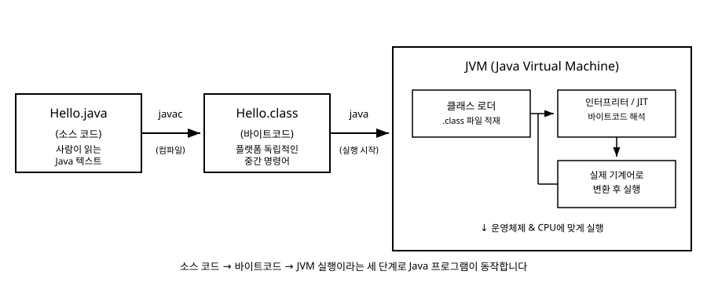

# 2장. 첫 프로그램과 빌드/실행 과정

[◀ 이전: 1장. Java란 무엇인가](ch01-java란.md) | [📖 목차](00-목차.md) | [다음: 3장. 변수와 자료형 ▶](ch03-변수와자료형.md)

---

## 들어가며

1장에서는 Java가 JVM 위에서 동작하는 언어라는 것을 이론적으로 살펴보았습니다. 이 장에서는 실제로 코드를 작성하고, 그 코드가 컴파일을 거쳐 실행되는 과정을 직접 경험해봅니다. 프로그래밍 언어를 배울 때 가장 먼저 작성하는 프로그램은 관례적으로 화면에 "Hello, World!"를 출력하는 프로그램입니다. 별것 아닌 한 줄처럼 보이지만, 이 짧은 프로그램 안에 Java 문법의 기본 골격이 거의 다 들어 있습니다. 한 줄씩 뜯어보면서 왜 이렇게 써야 하는지 이해해봅시다.

## 첫 프로그램 작성하기

먼저 `Hello.java`라는 이름의 파일을 만들고 다음 내용을 작성합니다.

```java
public class Hello {
    public static void main(String[] args) {
        // 화면에 문자열을 출력한다
        System.out.println("Hello, World!");
    }
}
```

이 프로그램을 실행하면 화면에 `Hello, World!`라는 문자열이 출력됩니다. 지금은 낯선 키워드가 많이 보이겠지만, 하나씩 분해해서 살펴보면 각 부분이 어떤 역할을 하는지 명확해집니다.

## 한 줄씩 뜯어보기

### `public class Hello`

Java 프로그램의 코드는 반드시 클래스 안에 들어가야 합니다. `class Hello`는 "Hello라는 이름의 클래스를 정의한다"는 뜻이고, 앞의 `public`은 이 클래스를 다른 어떤 코드에서도 접근할 수 있게 공개한다는 접근 제어자입니다. 접근 제어자에 대해서는 9장 클래스와 객체에서 더 자세히 다루지만, 지금 단계에서는 "클래스를 외부에 공개하는 표시" 정도로 이해하면 충분합니다.

여기서 중요한 규칙이 하나 있습니다. `public`으로 선언한 클래스의 이름은 반드시 파일 이름과 똑같아야 합니다. 클래스 이름이 `Hello`라면 파일 이름도 `Hello.java`여야 합니다. 대소문자까지 정확히 일치해야 하며, 이 규칙을 어기면 컴파일 오류가 발생합니다.

### `public static void main(String[] args)`

이 한 줄은 Java 프로그램의 "시작 지점"을 정의합니다. JVM은 프로그램을 실행할 때 가장 먼저 이 `main` 메서드를 찾아서 실행합니다. 각 키워드를 나누어 보면 다음과 같습니다.

- `public`: 클래스와 마찬가지로 외부에서 접근할 수 있도록 공개합니다. JVM이 이 메서드를 호출할 수 있어야 하므로 `public`이 필수입니다.
- `static`: 이 메서드가 특정 객체를 만들지 않아도 클래스 자체에서 바로 호출될 수 있다는 뜻입니다. 프로그램이 시작될 때는 아직 어떤 객체도 만들어지지 않은 상태이므로, JVM이 곧바로 부를 수 있는 `static` 메서드가 필요합니다. `static`의 정확한 의미는 9장에서 객체와 비교하며 다시 설명합니다.
- `void`: 이 메서드가 결과값을 돌려주지 않는다는 표시입니다. 메서드가 값을 반환하는 방식은 8장 메서드에서 자세히 다룹니다.
- `main`: 메서드의 이름입니다. JVM은 정확히 이 이름을 가진 메서드를 찾습니다. 다른 이름으로 바꾸면 시작 지점을 찾지 못해 실행되지 않습니다.
- `(String[] args)`: 프로그램 실행 시 외부에서 전달할 수 있는 문자열 배열 매개변수입니다. 배열의 개념은 7장 배열에서 배웁니다. 지금은 사용하지 않더라도 이 형태를 그대로 갖추어야 한다는 점만 기억해둡니다.

정리하면 `public static void main(String[] args)`는 "JVM이 프로그램을 시작할 때 호출할, 외부에 공개된, 객체 없이 실행 가능한, 값을 반환하지 않는 진입점 메서드"라는 뜻입니다.

### `System.out.println("Hello, World!");`

실제로 화면에 글자를 출력하는 코드입니다. `System`은 Java가 기본으로 제공하는 클래스로, 운영체제와 관련된 기능을 제공합니다. `out`은 `System` 클래스가 가지고 있는 "표준 출력" 대상이며, `println`은 그 출력 대상에 문자열을 쓰고 줄바꿈까지 해주는 메서드입니다. 괄호 안의 `"Hello, World!"`는 출력할 문자열 값입니다.

문장 끝에 세미콜론(`;`)이 붙는 것도 눈여겨봐야 합니다. Java는 하나의 명령문이 끝났다는 것을 세미콜론으로 표시합니다. 세미콜론을 빠뜨리면 컴파일러가 문장의 경계를 알 수 없어 오류를 냅니다.

### 주석 `// 화면에 문자열을 출력한다`

`//`로 시작하는 줄은 주석으로, 컴파일러가 무시하고 사람이 읽기 위한 설명입니다. 이 책의 모든 예제 코드에서는 한국어 주석을 사용해 코드의 의도를 설명합니다.

## 컴파일하고 실행하기

코드를 작성했다면 이제 실제로 빌드하고 실행해봅니다. 터미널을 열고 `Hello.java` 파일이 있는 폴더로 이동한 뒤 다음 명령을 입력합니다.

```
javac Hello.java
```

`javac`는 Java 컴파일러입니다. 이 명령이 성공적으로 끝나면 같은 폴더에 `Hello.class`라는 파일이 새로 생깁니다. 이 파일이 바로 1장에서 설명한 바이트코드입니다. 사람이 읽을 수 있는 텍스트가 아니라 JVM이 해석할 수 있는 중간 형태의 명령어로 바뀐 것입니다.

바이트코드가 만들어졌다면 다음 명령으로 실행합니다.

```
java Hello
```

여기서 주의할 점은 `java Hello`라고 쓸 때 `Hello.class`처럼 확장자를 붙이지 않고 클래스 이름만 씁니다. `java` 명령은 "이 이름의 클래스를 찾아서 그 안의 `main` 메서드를 실행해달라"는 요청이기 때문입니다. 명령이 실행되면 화면에 다음과 같이 출력됩니다.

```
Hello, World!
```

## 소스 코드 → 바이트코드 → JVM 실행이라는 파이프라인

지금까지 진행한 과정을 정리하면 세 단계입니다.

1. **소스 코드 작성**: `Hello.java`라는 텍스트 파일을 사람이 읽을 수 있는 Java 문법으로 작성합니다.
2. **컴파일**: `javac` 명령이 소스 코드를 검사하고 바이트코드(`Hello.class`)로 변환합니다. 이 단계에서 문법 오류가 있으면 실행 파일이 만들어지지 않고 오류 메시지가 출력됩니다.
3. **실행**: `java` 명령이 JVM을 구동하고, JVM은 `Hello.class`를 읽어들여(클래스 로딩) 그 안의 바이트코드를 해석하면서 실제 컴퓨터가 실행할 수 있는 동작으로 옮깁니다. 이 과정에서 JVM은 필요에 따라 자주 실행되는 코드를 실제 기계어로 미리 변환해두는 JIT(Just-In-Time) 컴파일 같은 최적화도 수행합니다.

이 흐름을 그림으로 정리하면 다음과 같습니다.



이 파이프라인을 이해하고 나면 "왜 Java는 실행이 한 단계 더 필요한가"에 대한 답이 명확해집니다. 소스 코드를 운영체제별 기계어로 바로 컴파일하는 대신 중간 형태인 바이트코드로 한 번 멈춰두기 때문에, 그 바이트코드는 어떤 JVM 위에서도 실행될 수 있는 이식성을 갖게 됩니다. 이것이 1장에서 설명한 "Write Once, Run Anywhere"가 실제로 구현되는 방식입니다.

## 흔한 컴파일 오류와 대처법

처음 Java를 배울 때 자주 마주치는 컴파일 오류 몇 가지와 해결 방법을 정리합니다. 오류 메시지를 두려워하지 말고, 그 안에 담긴 정보를 읽어내는 습관을 들이는 것이 중요합니다.

**세미콜론을 빠뜨린 경우**

```java
System.out.println("Hello, World!")
```

이렇게 세미콜론 없이 작성하면 다음과 비슷한 오류가 나타납니다.

```
error: ';' expected
```

문장 끝에 세미콜론을 붙이지 않아서 발생하는 가장 흔한 실수입니다. 오류 메시지가 가리키는 줄 근처에서 세미콜론이 빠진 곳을 찾아 채워주면 해결됩니다.

**클래스 이름과 파일 이름이 다른 경우**

파일 이름은 `Hello.java`인데 클래스 이름을 `class HelloWorld`로 작성하면 다음과 같은 오류가 발생합니다.

```
error: class HelloWorld is public, should be declared in a file named HelloWorld.java
```

`public` 클래스의 이름과 파일 이름을 반드시 일치시켜야 한다는 규칙을 다시 상기시켜주는 오류입니다. 클래스 이름을 파일 이름에 맞추거나, 파일 이름을 클래스 이름에 맞춰 바꾸면 해결됩니다.

**중괄호의 짝이 맞지 않는 경우**

클래스나 메서드를 감싸는 중괄호 `{`, `}` 중 하나를 빠뜨리면 다음과 같은 오류가 나타날 수 있습니다.

```
error: reached end of file while parsing
```

이 오류는 컴파일러가 마지막까지 코드를 읽었는데도 열린 중괄호를 닫는 짝을 찾지 못했다는 뜻입니다. 코드 편집기의 괄호 짝 맞춤 기능(커서를 괄호 옆에 두면 짝이 되는 괄호가 강조되는 기능)을 활용하면 이런 오류를 빠르게 찾을 수 있습니다.

**대소문자를 다르게 쓴 경우**

`System.out.println`을 `system.out.println`처럼 소문자로 쓰면 다음 오류가 발생합니다.

```
error: cannot find symbol
```

Java는 대소문자를 구분하는 언어이므로 `System`과 `system`은 완전히 다른 이름으로 취급됩니다. `cannot find symbol` 오류가 나타나면 이름의 철자와 대소문자를 다시 확인하는 것이 첫 번째로 해야 할 일입니다.

오류 메시지를 읽을 때는 보통 파일 이름과 줄 번호가 먼저 나오고, 그 다음에 어떤 문제인지에 대한 설명이 이어집니다. 처음에는 메시지가 낯설게 느껴지겠지만, 오류가 발생한 줄 번호부터 확인하는 습관을 들이면 점점 빠르게 원인을 찾을 수 있게 됩니다.

## 요약

- Java 프로그램의 실행 시작점은 `public static void main(String[] args)` 메서드이며, JVM이 이 메서드를 찾아 실행합니다.
- `public` 클래스의 이름과 소스 파일 이름은 반드시 일치해야 합니다.
- `javac`로 소스 코드(`.java`)를 컴파일하면 바이트코드(`.class`)가 만들어지고, `java` 명령으로 그 바이트코드를 JVM 위에서 실행합니다.
- 전체 흐름은 "소스 코드 작성 → javac로 컴파일하여 바이트코드 생성 → java로 JVM을 구동해 실행"의 세 단계입니다.
- 세미콜론 누락, 클래스/파일 이름 불일치, 중괄호 짝 오류, 대소문자 오타는 초보자가 자주 마주치는 컴파일 오류이며, 오류 메시지의 줄 번호와 설명을 차근차근 읽으면 대부분 빠르게 해결할 수 있습니다.

## 연습문제

1. `public static void main(String[] args)`에서 `public`, `static`, `void` 각각이 어떤 의미를 가지는지 자신의 말로 설명해 보세요.
2. `Hello.java` 파일을 작성하고 직접 `javac`와 `java` 명령으로 컴파일 및 실행까지 해보세요. 실행 후 폴더에 어떤 파일이 새로 생겼는지 확인해 보세요.
3. 일부러 세미콜론을 하나 빼고 컴파일해서 어떤 오류 메시지가 나오는지 확인해 보세요.
4. `public class Hello`를 `public class HelloWorld`로 바꾸고(파일 이름은 그대로 둔 채) 컴파일하면 어떤 오류가 발생하는지 확인하고, 그 이유를 설명해 보세요.
5. 소스 코드에서 바이트코드가 만들어지고 JVM이 그것을 실행하기까지의 세 단계를 자신의 언어로 정리해서 설명해 보세요.

---

[◀ 이전: 1장. Java란 무엇인가](ch01-java란.md) | [📖 목차](00-목차.md) | [다음: 3장. 변수와 자료형 ▶](ch03-변수와자료형.md)
