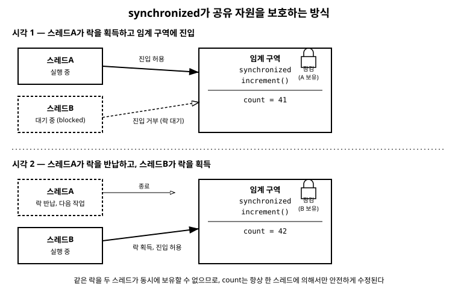

# 17장. 멀티스레딩 기초

[◀ 이전: 16장. 스트림(Stream API)](ch16-스트림.md) | [📖 목차](00-목차.md) | [다음: 18장. 좋은 Java 코드 작성 습관 ▶](ch18-좋은코드작성습관.md)

---

## 들어가며

지금까지 작성한 프로그램은 모두 위에서 아래로, 한 줄씩 순서대로 실행되었습니다. `main` 메서드가 시작되고, 그 안에서 호출한 메서드들이 끝날 때까지 기다렸다가 다음 줄로 넘어가는 방식이었습니다. 이런 실행 흐름을 하나만 가진 프로그램을 **단일 스레드(single-thread)** 프로그램이라고 합니다.

하지만 실제 프로그램은 종종 "동시에 여러 일을 처리해야" 합니다. 웹 서버는 수백 명의 사용자 요청을 동시에 받아 처리해야 하고, 채팅 프로그램은 화면을 그리는 동안에도 네트워크로 메시지를 받아야 합니다. 이럴 때 필요한 것이 **멀티스레딩(multithreading)**입니다. 이 장에서는 스레드가 무엇인지, Java에서 스레드를 만드는 두 가지 방법, 그리고 여러 스레드가 같은 데이터를 건드릴 때 생기는 문제와 그 해결책인 `synchronized` 키워드를 다룹니다.

## 프로세스와 스레드

**프로세스(process)**는 실행 중인 프로그램 하나를 말합니다. 예를 들어 IDE를 하나 실행하면 프로세스 하나가 생기고, 브라우저를 실행하면 또 다른 프로세스가 생깁니다. 각 프로세스는 자신만의 메모리 공간을 가지고 있어서, 프로세스끼리는 서로의 메모리를 직접 들여다볼 수 없습니다.

**스레드(thread)**는 하나의 프로세스 안에서 실행되는 독립적인 실행 흐름입니다. 하나의 프로세스는 스레드를 하나만 가질 수도 있고(단일 스레드), 여러 개를 동시에 가질 수도 있습니다(멀티스레드). 중요한 점은 같은 프로세스에 속한 스레드들은 **메모리를 공유**한다는 것입니다. 프로세스 안의 여러 스레드는 같은 객체, 같은 배열, 같은 변수를 함께 읽고 쓸 수 있습니다. 이 "공유"라는 특징이 멀티스레딩을 편리하게 만들어주는 동시에, 뒤에서 살펴볼 경쟁 상태 문제의 원인이 되기도 합니다.

지금까지 작성한 모든 예제 프로그램도 사실 스레드 하나 위에서 실행되고 있었습니다. Java 프로그램이 시작되면 JVM은 자동으로 **메인 스레드(main thread)**를 만들어 `main` 메서드를 그 위에서 실행합니다. 이 장에서 배우는 내용은 메인 스레드 외에 스레드를 추가로 만들어서 동시에 여러 작업을 진행시키는 방법입니다.

## 스레드 만들기 1: Thread 클래스 상속

Java에서 스레드를 표현하는 클래스는 `java.lang.Thread`입니다. 스레드가 실제로 수행할 작업은 `run()` 메서드 안에 작성합니다. 가장 직접적인 방법은 `Thread` 클래스를 상속(10장에서 배운 개념입니다)해서 `run()` 메서드를 오버라이드하는 것입니다.

```java
// Thread를 상속해서 스레드가 할 작업을 정의
public class CountingThread extends Thread {

    private final String name;

    public CountingThread(String name) {
        this.name = name;
    }

    @Override
    public void run() {
        for (int i = 1; i <= 5; i++) {
            System.out.println(name + " - " + i);
        }
    }
}
```

```java
public class ThreadExtendsExample {
    public static void main(String[] args) {
        CountingThread t1 = new CountingThread("스레드A");
        CountingThread t2 = new CountingThread("스레드B");

        t1.start();
        t2.start();
    }
}
```

이 방식은 이해하기 쉽지만 한계가 있습니다. Java는 클래스 하나가 부모 클래스 하나만 상속할 수 있는데(10장 참고), `Thread`를 상속해버리면 그 클래스는 더 이상 다른 클래스를 상속할 수 없게 됩니다. 이미 다른 클래스를 상속하고 있는 클래스에 스레드 기능을 추가하고 싶다면 이 방법은 쓸 수 없습니다.

## 스레드 만들기 2: Runnable 구현

더 널리 쓰이는 방법은 `Runnable` 인터페이스(11장에서 배운 인터페이스입니다)를 구현하는 것입니다. `Runnable`은 `run()` 메서드 하나만 가진 매우 단순한 인터페이스입니다.

```java
// Runnable을 구현해서 "실행할 작업"만 정의
public class CountingTask implements Runnable {

    private final String name;

    public CountingTask(String name) {
        this.name = name;
    }

    @Override
    public void run() {
        for (int i = 1; i <= 5; i++) {
            System.out.println(name + " - " + i);
        }
    }
}
```

```java
public class RunnableExample {
    public static void main(String[] args) {
        Runnable task1 = new CountingTask("작업A");
        Runnable task2 = new CountingTask("작업B");

        // Runnable 객체를 Thread에 넘겨서 실행
        Thread t1 = new Thread(task1);
        Thread t2 = new Thread(task2);

        t1.start();
        t2.start();
    }
}
```

`Runnable`은 인터페이스이므로 클래스 상속 관계와 무관하게 자유롭게 구현할 수 있고, "이 클래스는 스레드다"가 아니라 "이 객체는 스레드가 실행할 작업이다"라는 의미가 더 명확합니다. 그래서 실무에서는 대부분 `Runnable` 방식을 사용합니다. 참고로 `Runnable`은 매개변수 없이 값을 반환하지 않는 단순한 인터페이스라서, 15장에서 배운 람다식으로도 아주 간결하게 표현할 수 있습니다.

```java
Thread t = new Thread(() -> {
    for (int i = 1; i <= 5; i++) {
        System.out.println("람다 스레드 - " + i);
    }
});
t.start();
```

## start()와 run()의 차이

처음 멀티스레딩을 배울 때 가장 헷갈리는 부분이 `start()`와 `run()`의 차이입니다. 결론부터 말하면, **`run()`을 직접 호출하면 새 스레드가 만들어지지 않습니다.**

```java
CountingTask task = new CountingTask("작업");

task.run();    // 그냥 메서드 호출 - 현재 스레드(main)에서 실행됨
Thread t = new Thread(task);
t.start();     // 새 스레드를 만들고, 그 스레드 위에서 run()을 실행함
```

`run()`은 그저 평범한 메서드입니다. 다른 메서드를 호출하듯 `task.run()`이라고 쓰면 그 코드는 지금 실행 중인 스레드(대부분 메인 스레드) 위에서 순서대로 실행될 뿐, 새로운 실행 흐름이 생기지 않습니다.

반면 `start()`는 `Thread` 클래스가 제공하는 특별한 메서드로, JVM에게 새로운 스레드를 하나 만들어달라고 요청하고, 그 새 스레드 위에서 `run()`을 실행시킵니다. 그래서 `start()`를 호출한 코드는 새 스레드가 작업을 끝내기를 기다리지 않고 곧바로 다음 줄로 넘어갑니다. 즉 **"동시에" 실행되는 효과는 오직 `start()`를 통해서만 얻을 수 있습니다.**

앞의 `RunnableExample`을 실행해보면 "작업A - 1", "작업B - 1", "작업A - 2"처럼 두 스레드의 출력이 뒤섞여서 나타나는 것을 볼 수 있습니다. 이는 두 스레드가 정말로 동시에(또는 아주 짧은 간격으로 번갈아) 실행되고 있다는 증거이며, 실행할 때마다 출력 순서가 달라질 수도 있습니다. 이 "순서가 보장되지 않는다"는 특성을 기억해두는 것이 다음 절을 이해하는 데 중요합니다.

## 경쟁 상태(Race Condition) — 공유 자원의 문제

스레드가 서로 다른 데이터를 각자 처리한다면 문제가 없습니다. 하지만 여러 스레드가 **같은 변수나 객체를 동시에 수정**하려고 하면 예상치 못한 결과가 나올 수 있습니다. 이런 현상을 **경쟁 상태(race condition)**라고 부릅니다.

다음은 여러 스레드가 하나의 계수기(counter)를 함께 증가시키는 예제입니다.

```java
public class Counter {
    private int count = 0;

    // count를 1 증가시키는 메서드
    public void increment() {
        count++;
    }

    public int getCount() {
        return count;
    }
}
```

```java
public class RaceConditionExample {
    public static void main(String[] args) throws InterruptedException {
        Counter counter = new Counter();

        // 같은 counter 객체를 공유하는 작업을 정의
        Runnable task = () -> {
            for (int i = 0; i < 100_000; i++) {
                counter.increment();
            }
        };

        Thread t1 = new Thread(task);
        Thread t2 = new Thread(task);

        t1.start();
        t2.start();

        // 두 스레드가 모두 끝날 때까지 메인 스레드가 대기
        t1.join();
        t2.join();

        System.out.println("최종 count = " + counter.getCount());
    }
}
```

두 스레드가 각각 10만 번씩 `increment()`를 호출했으니 결과는 항상 200000이어야 할 것 같습니다. 그런데 실제로 실행해보면 200000보다 작은 값이 나오는 경우가 자주 생깁니다. 왜 그럴까요?

`count++`라는 코드 한 줄은 겉보기에는 하나의 동작 같지만, 실제로는 세 단계로 이루어집니다.

1. `count`의 현재 값을 읽는다.
2. 읽은 값에 1을 더한다.
3. 더한 값을 다시 `count`에 저장한다.

두 스레드가 이 세 단계를 정확히 번갈아 완료한다면 문제가 없습니다. 하지만 스레드A가 1단계(읽기)를 마친 직후, 아직 3단계(저장)를 하기 전에 스레드B가 끼어들어 똑같이 1단계를 실행해버릴 수 있습니다. 두 스레드가 같은 값을 읽고, 각자 1을 더해서 저장하면 실제로는 두 번 증가해야 할 값이 한 번만 증가한 것처럼 되어버립니다. 이렇게 "누가 먼저, 언제 끼어드는지"에 따라 결과가 달라지는 상황이 경쟁 상태입니다. `main` 메서드에서 사용한 `t1.join()`, `t2.join()`은 "해당 스레드가 종료될 때까지 현재 스레드를 기다리게 하는" 메서드로, 두 작업이 모두 끝난 뒤에 최종 결과를 출력하기 위해 사용했습니다.

## synchronized로 임계 구역 보호하기

경쟁 상태를 막으려면 "한 번에 한 스레드만 그 코드를 실행하도록" 제한해야 합니다. 이렇게 동시에 하나의 스레드만 들어갈 수 있도록 보호해야 하는 코드 영역을 **임계 구역(critical section)**이라고 부르고, Java에서는 `synchronized` 키워드로 이를 지정합니다.

가장 간단한 방법은 메서드 선언에 `synchronized`를 붙이는 것입니다.

```java
public class Counter {
    private int count = 0;

    // synchronized: 한 번에 하나의 스레드만 이 메서드를 실행할 수 있다
    public synchronized void increment() {
        count++;
    }

    public synchronized int getCount() {
        return count;
    }
}
```

`increment()`에 `synchronized`를 붙이면, 어떤 스레드가 이 메서드를 실행하는 동안에는 다른 스레드가 같은 객체의 `increment()`(또는 다른 `synchronized` 메서드)에 들어오지 못하고 대기합니다. 앞서 문제가 되었던 "읽기 → 더하기 → 저장" 세 단계가 통째로 하나의 스레드에 의해서만 처리되는 것이 보장되므로, 중간에 다른 스레드가 끼어들 수 없습니다. 이 상태로 `RaceConditionExample`을 다시 실행하면 항상 정확히 200000이 출력됩니다.

메서드 전체가 아니라 일부 코드만 보호하고 싶다면 `synchronized` 블록을 사용할 수 있습니다.

```java
public class Counter {
    private int count = 0;
    private final Object lock = new Object();

    public void increment() {
        // 이 객체(lock)를 기준으로 한 번에 하나의 스레드만 블록에 진입
        synchronized (lock) {
            count++;
        }
    }
}
```

`synchronized(lock) { ... }` 형태로 쓰면, 괄호 안에 지정한 객체(**락, lock**)를 기준으로 블록 안의 코드가 보호됩니다. 다른 스레드가 같은 락으로 보호된 블록에 들어오려면 먼저 그 스레드가 블록을 빠져나가야 합니다. 메서드 전체를 보호할 필요가 없을 때, 혹은 여러 자원을 서로 다른 락으로 세밀하게 관리하고 싶을 때 블록 방식이 유용합니다.

## synchronized의 동작 방식

다음 다이어그램은 두 스레드가 하나의 공유 자원(계수기)에 접근할 때, `synchronized`가 어떻게 순서를 강제하는지를 보여줍니다.



그림에서 볼 수 있듯이, 스레드A가 락을 획득해서 임계 구역에 들어가 있는 동안 스레드B는 같은 락을 얻지 못해 대기 상태에 머무릅니다. 스레드A가 작업을 마치고 락을 반납해야 비로소 스레드B가 락을 얻어 임계 구역에 들어갈 수 있습니다. 이 순서 강제 덕분에 공유 자원은 항상 한 스레드에 의해서만 수정되고, 경쟁 상태가 발생하지 않습니다.

## 스레드 안전성에 대한 기초적 감각

어떤 클래스나 코드가 여러 스레드에서 동시에 호출되어도 문제없이 동작한다면 **스레드 안전(thread-safe)**하다고 말합니다. 지금까지 배운 것을 바탕으로 몇 가지 감각을 정리해봅니다.

- **여러 스레드가 값을 읽기만 한다면** 대체로 안전합니다. 문제는 최소한 하나의 스레드가 값을 **변경**할 때 생깁니다.
- **스레드마다 독립적인 데이터만 다룬다면** (예를 들어 각 스레드가 자신의 지역 변수만 사용) 공유 자원이 없으므로 경쟁 상태가 생기지 않습니다. 멀티스레딩 문제의 핵심은 언제나 "공유"입니다.
- `synchronized`는 안전을 보장해주지만 공짜가 아닙니다. 락을 걸고 기다리는 과정에는 비용이 들고, 지나치게 넓은 범위를 `synchronized`로 감싸면 오히려 스레드들이 서로 기다리기만 하다가 동시성의 장점을 잃어버릴 수 있습니다. 그래서 실무에서는 꼭 필요한 최소한의 범위만 보호하는 것이 좋은 습관입니다.
- 지금까지 다룬 것은 멀티스레딩의 가장 기초적인 부분입니다. Java 표준 라이브러리에는 `java.util.concurrent` 패키지 아래에 스레드 풀, 원자적(atomic) 연산 클래스, 더 정교한 동시성 도구들이 준비되어 있습니다. 이 책의 범위를 넘어서지만, `synchronized`의 원리를 이해했다면 그 도구들을 배울 때도 왜 필요한지 훨씬 쉽게 이해할 수 있을 것입니다.

## 요약

- **프로세스**는 실행 중인 프로그램이고, **스레드**는 프로세스 안에서 동작하는 독립적인 실행 흐름이다. 같은 프로세스의 스레드들은 메모리를 공유한다.
- 스레드를 만드는 방법은 두 가지다. `Thread`를 상속해서 `run()`을 오버라이드하는 방법과, `Runnable`을 구현해서 `Thread`에 넘기는 방법. 상속 제약이 없는 `Runnable` 방식이 더 널리 쓰인다.
- `run()`을 직접 호출하면 현재 스레드에서 그냥 메서드가 실행될 뿐이다. 새 스레드를 만들어 동시에 실행하려면 반드시 `start()`를 호출해야 한다.
- 여러 스레드가 같은 데이터를 동시에 수정하면 **경쟁 상태**가 발생해 결과가 예측과 달라질 수 있다.
- `synchronized` 키워드(메서드 또는 블록)로 임계 구역을 지정하면 한 번에 하나의 스레드만 그 구역에 들어갈 수 있어 경쟁 상태를 막을 수 있다.
- 스레드 안전성의 핵심은 "공유되는 가변 데이터"의 존재 여부이며, `synchronized`는 안전을 주지만 성능 비용이 따르므로 필요한 범위만 최소로 보호하는 것이 좋다.

## 연습문제

1. 프로세스와 스레드의 차이를 "메모리 공유"라는 키워드를 사용해서 설명해 보세요.
2. `Thread`를 상속하는 방식과 `Runnable`을 구현하는 방식의 차이를 설명하고, 실무에서 `Runnable`이 더 선호되는 이유를 서술해 보세요.
3. `task.run()`과 `new Thread(task).start()`의 실행 결과가 어떻게 다른지 코드로 확인해 보세요.
4. 이 장의 `RaceConditionExample`에서 `synchronized`를 제거하고 여러 번 실행해서 결과값이 매번 달라지는지 확인해 보세요. 그런 다음 `synchronized`를 다시 추가해서 결과가 항상 동일해지는지 확인해 보세요.
5. 두 스레드가 각각 은행 계좌 객체의 `deposit()`, `withdraw()` 메서드(9장에서 만든 `BankAccount` 클래스를 떠올려 보세요)를 동시에 호출한다고 가정할 때, 어떤 필드가 경쟁 상태의 위험에 노출되는지, 그리고 어떻게 `synchronized`로 보호할 수 있는지 설계해 보세요.

---

[◀ 이전: 16장. 스트림(Stream API)](ch16-스트림.md) | [📖 목차](00-목차.md) | [다음: 18장. 좋은 Java 코드 작성 습관 ▶](ch18-좋은코드작성습관.md)
