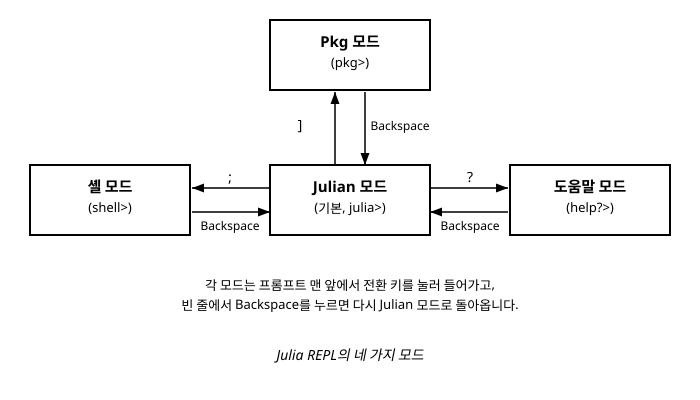

# 2장. 첫 프로그램과 REPL 환경

[◀ 이전: 1장. Julia란 무엇인가](ch01-Julia란무엇인가.md) | [📖 목차](00-목차.md) | [다음: 3장. 변수와 자료형 ▶](ch03-변수와자료형.md)


## 들어가며

1장에서 Julia가 어떤 언어인지, 왜 만들어졌는지를 살펴보았습니다. 이제부터는 직접 손을 움직여 볼 차례입니다. 이번 장에서는 Julia를 컴퓨터에 설치하는 방법을 간단히 알아보고, Julia 개발 경험의 중심이 되는 REPL(Read-Eval-Print Loop) 환경을 자세히 살펴봅니다. 그런 다음 `.jl` 파일을 작성해서 실행하는 흐름과, 모든 프로그래밍 언어 학습의 전통적인 첫걸음인 "Hello, World!" 예제를 다뤄보겠습니다. 이번 장을 마치고 나면 Julia로 코드를 작성하고 실행하는 기본적인 작업 흐름을 손에 익힐 수 있을 것입니다.

## Julia 설치하기

Julia를 설치하는 가장 확실한 방법은 공식 웹사이트인 `julialang.org`에서 자신의 운영체제에 맞는 설치 프로그램을 내려받는 것입니다. 공식 사이트에서는 Windows, macOS, Linux용 설치 파일을 모두 제공하며, 설치 과정 자체는 다른 개발 도구와 크게 다르지 않습니다.

다만 최근에는 `juliaup`이라는 버전 관리 도구를 통해 설치하는 방법이 널리 권장됩니다. `juliaup`은 여러 버전의 Julia를 한 시스템에 설치해 두고 필요에 따라 손쉽게 전환할 수 있게 해주는 도구로, Node.js를 다루어 본 사람이라면 `nvm`, Python을 다루어 본 사람이라면 `pyenv`와 비슷한 역할을 한다고 생각하면 됩니다. `juliaup`을 사용하면 새로운 Julia 버전이 나왔을 때 명령어 한 줄로 업데이트할 수 있고, 특정 프로젝트가 예전 버전의 Julia를 요구하는 경우에도 버전을 나란히 유지하며 전환할 수 있습니다.

설치가 끝나면 터미널(명령 프롬프트, PowerShell, 또는 macOS/Linux의 터미널)에서 다음과 같이 입력해 Julia가 정상적으로 설치되었는지 확인할 수 있습니다.

```julia
julia --version
```

이 명령을 실행했을 때 설치된 Julia의 버전 정보가 출력된다면 설치가 잘 된 것입니다. 이제 아무 옵션 없이 `julia`라고만 입력하면, 다음 절에서 다룰 REPL 환경이 시작됩니다.

## REPL이란 무엇인가

REPL은 Read(읽기)-Eval(평가)-Print(출력)-Loop(반복)의 줄임말로, 사용자가 입력한 코드를 한 줄(또는 한 블록) 단위로 읽어들여 즉시 실행하고 그 결과를 화면에 보여준 다음, 다시 다음 입력을 기다리는 대화형 환경을 뜻합니다. 터미널에서 `julia`라고 입력하면 다음과 비슷한 화면이 나타납니다.

```
               _
   _       _ _(_)_     |  Documentation: https://docs.julialang.org
  (_)     | (_) (_)    |
   _ _   _| |_  __ _   |  Type "?" for help, "]?" for Pkg help.
  | | | | | | |/ _` |  |
  | | |_| | | | (_| |  |  Version 1.x.x
 _/ |\__'_|_|_|\__'_|  |
|__/                   |

julia>
```

`julia>`라는 프롬프트가 보이면 REPL이 정상적으로 실행된 것입니다. 이제 이 프롬프트에 계산식이나 코드를 입력하고 Enter 키를 누르면 즉시 결과를 확인할 수 있습니다.

```julia
julia> 1 + 2
3

julia> greeting = "안녕하세요"
"안녕하세요"
```

REPL은 코드를 작성하면서 결과를 곧바로 확인할 수 있기 때문에, 새로운 함수의 동작을 실험해 보거나 문법을 확인하고 싶을 때 매우 유용합니다. 나중에 코드가 어느 정도 안정되면 이를 `.jl` 파일로 옮겨 저장하는 것이 일반적인 작업 흐름입니다.

## REPL의 네 가지 모드

Julia REPL의 특징 중 하나는 하나의 프롬프트 안에 서로 다른 목적을 가진 네 가지 모드가 통합되어 있다는 점입니다. 각 모드는 특정한 문자를 입력하는 것만으로 전환할 수 있으며, 빈 줄에서 Backspace 키를 누르면 언제든 기본 모드로 돌아올 수 있습니다.



### Julian 모드 (기본 모드)

REPL을 처음 실행했을 때 보이는 `julia>` 프롬프트가 바로 Julian 모드입니다. 이 책에서 다루는 대부분의 Julia 코드는 이 모드에서 실행됩니다. 변수를 정의하고, 함수를 호출하고, 계산식을 평가하는 등 일반적인 프로그래밍 작업이 모두 이 모드에서 이루어집니다.

### Pkg 모드

Julian 모드의 빈 프롬프트에서 대괄호 닫는 기호 `]`를 입력하면 패키지 관리를 위한 Pkg 모드로 전환됩니다. 프롬프트가 `pkg>`로 바뀐 것을 확인할 수 있습니다.

```julia
julia> ]
(@v1.x) pkg>
```

Pkg 모드에서는 외부 패키지를 설치하거나 제거하고, 현재 프로젝트에 설치된 패키지 목록을 확인하는 등의 작업을 수행합니다. 예를 들어 다음과 같이 입력하면 `Example`이라는 패키지를 설치할 수 있습니다.

```julia
(@v1.x) pkg> add Example
```

패키지 관리와 프로젝트 환경 구성에 대한 자세한 내용은 13장에서 다시 다룹니다. 지금은 대괄호 기호 `]`로 이 모드에 들어갈 수 있다는 점만 기억해 두면 충분합니다. Pkg 모드에서 빈 줄에 Backspace를 누르면 다시 Julian 모드로 돌아갑니다.

### 셸 모드

Julian 모드의 빈 프롬프트에서 세미콜론 `;`을 입력하면 셸 모드로 전환됩니다. 프롬프트가 `shell>`로 바뀝니다.

```julia
julia> ;
shell>
```

셸 모드에서는 Julia를 종료하지 않고도 운영체제의 명령어를 바로 실행할 수 있습니다. 예를 들어 현재 디렉터리의 파일 목록을 보고 싶다면 다음과 같이 입력합니다.

```julia
shell> ls
```

(Windows 명령 프롬프트 환경이라면 `dir`에 해당하는 명령을 사용할 수도 있습니다.) 데이터 파일이 어디 있는지 확인하거나 간단한 파일 작업을 처리할 때, Julia REPL을 벗어나지 않고도 바로 처리할 수 있어 편리합니다. 마찬가지로 빈 줄에서 Backspace를 누르면 Julian 모드로 돌아갑니다.

### 도움말 모드

Julian 모드의 빈 프롬프트에서 물음표 `?`를 입력하면 도움말 모드로 전환됩니다. 프롬프트가 `help?>`로 바뀝니다.

```julia
julia> ?
help?>
```

이 모드에서 궁금한 함수나 키워드의 이름을 입력하면 해당 항목에 대한 공식 문서를 바로 확인할 수 있습니다. 예를 들어 `println` 함수에 대해 더 알고 싶다면 다음과 같이 입력합니다.

```julia
help?> println
```

그러면 `println` 함수의 사용법과 관련 설명이 화면에 출력됩니다. 함수 이름이나 사용법이 정확히 기억나지 않을 때 이 모드를 적극적으로 활용하면 좋습니다. 도움말 모드 역시 빈 줄에서 Backspace를 누르면 Julian 모드로 돌아갑니다.

이렇게 하나의 REPL 안에서 코드 실행, 패키지 관리, 시스템 명령어 실행, 문서 검색이라는 네 가지 작업을 매끄럽게 오갈 수 있다는 점은 Julia의 개발 경험을 상당히 편리하게 만들어주는 요소입니다. 앞으로 이 책에서 코드 예제를 실습할 때, 필요하다면 언제든 이 네 가지 모드를 오가며 확인해 보기 바랍니다.

## .jl 파일 작성과 실행

REPL은 즉흥적인 실험에는 훌륭하지만, 여러 줄로 이루어진 프로그램을 매번 REPL에 다시 입력하는 것은 비효율적입니다. 이런 경우에는 코드를 텍스트 파일로 저장해 두고 필요할 때마다 실행하는 방식이 일반적입니다. Julia 코드 파일은 `.jl`이라는 확장자를 사용합니다.

메모장이나 VS Code, 또는 원하는 텍스트 편집기를 이용해서 다음 내용을 담은 파일을 하나 만들어 봅시다. 파일 이름은 `hello.jl`로 저장합니다.

```julia
# hello.jl
println("Hello, World!")
```

파일을 저장했다면, 터미널에서 파일이 있는 위치로 이동한 다음 다음과 같이 실행합니다.

```julia
julia hello.jl
```

이 명령을 실행하면 Julia는 REPL을 띄우는 대신 `hello.jl` 파일에 담긴 코드를 처음부터 끝까지 실행하고, 그 결과를 출력한 뒤 곧바로 종료합니다. 즉 `julia 파일명.jl`은 "이 파일 안의 코드를 한 번 실행하고 끝내라"는 명령이라고 이해하면 됩니다.

실제 개발 과정에서는 REPL에서 코드 조각을 실험해 보며 아이디어를 다듬은 다음, 완성된 로직을 `.jl` 파일로 옮겨 정리하는 방식을 많이 사용합니다. 이 두 가지 작업 방식을 자유롭게 오갈 수 있게 되면 Julia로 작업하는 속도가 크게 빨라질 것입니다.

## Hello, World!

앞서 살펴본 `hello.jl` 파일의 핵심은 다음 한 줄입니다.

```julia
println("Hello, World!")
```

`println` 함수는 괄호 안에 전달된 값을 화면에 출력하고, 마지막에 줄바꿈을 추가합니다. 이 문장을 실행하면 다음과 같은 결과를 볼 수 있습니다.

```
Hello, World!
```

간단해 보이지만, 이 한 줄은 문자열이라는 자료형을 다루는 방법, 함수를 호출하는 방법, 그리고 프로그램이 화면에 결과를 내보내는 방법을 모두 담고 있습니다. 문자열과 여러 자료형에 대한 더 자세한 내용은 3장에서 다룹니다.

## println과 print의 차이

Julia는 화면에 값을 출력하는 함수로 `println`과 `print` 두 가지를 제공합니다. 이름이 비슷해서 헷갈리기 쉽지만 둘 사이에는 분명한 차이가 있습니다. `println`은 출력 후 자동으로 줄바꿈을 추가하는 반면, `print`는 줄바꿈을 추가하지 않습니다.

다음 예제로 차이를 확인해 보겠습니다.

```julia
print("안녕")
print("하세요")
println()  # 줄바꿈만 출력

println("반갑습니다")
println("또 만나요")
```

이 코드를 실행하면 다음과 같은 결과가 나옵니다.

```
안녕하세요
반갑습니다
또 만나요
```

`print("안녕")`과 `print("하세요")`는 줄바꿈 없이 이어져서 출력되기 때문에 "안녕하세요"가 한 줄에 붙어서 나타납니다. 반면 `println("반갑습니다")`와 `println("또 만나요")`는 각각 출력 후 줄바꿈이 자동으로 들어가기 때문에 서로 다른 줄에 나타납니다.

일반적으로 한 줄에 하나의 완결된 메시지를 출력하고 싶을 때는 `println`을 사용하고, 여러 값을 한 줄에 이어서 출력하고 싶을 때는 `print`를 사용합니다. 두 함수 모두 쉼표로 여러 값을 나열해서 한 번에 출력할 수도 있습니다.

```julia
name = "철수"
age = 20
println(name, "님의 나이는 ", age, "살입니다.")
```

## 주석 작성하기

코드를 작성하다 보면 특정 줄이 무엇을 하는지 설명을 남기고 싶을 때가 있습니다. 이런 설명을 주석(comment)이라고 부르며, 주석은 Julia가 프로그램을 실행할 때 완전히 무시하는 부분입니다. 즉 주석은 사람이 코드를 읽을 때를 위한 메모이지, 프로그램의 동작에는 아무런 영향을 주지 않습니다.

한 줄짜리 주석은 `#` 기호로 시작합니다. `#` 기호부터 그 줄의 끝까지가 모두 주석으로 처리됩니다.

```julia
# 이것은 한 줄 주석입니다.
x = 10  # 변수 x에 10을 대입 (이렇게 코드 뒤에 붙일 수도 있습니다)
println(x)
```

여러 줄에 걸친 긴 설명을 남기고 싶을 때는 블록 주석을 사용합니다. 블록 주석은 `#=`로 시작해서 `=#`로 끝나며, 그 사이에 있는 모든 내용이 주석으로 처리됩니다.

```julia
#=
이 함수는 두 수를 더한 뒤
그 결과에 2를 곱해서 반환합니다.
아직 완성되지 않았으므로 나중에 다시 확인할 것.
=#
function add_and_double(a, b)
    return (a + b) * 2
end
```

블록 주석은 다른 블록 주석 안에 중첩해서 사용할 수도 있다는 점이 특징입니다. 예를 들어 코드 일부를 통째로 주석 처리하고 싶은데 그 코드 안에 이미 블록 주석이 있는 경우에도 문제없이 처리할 수 있습니다. 코드를 작성할 때 적절한 주석을 남겨두는 습관은 나중에 자신이나 다른 사람이 코드를 다시 읽을 때 큰 도움이 됩니다. 다만 주석은 코드가 "무엇을" 하는지보다는 "왜" 그렇게 작성했는지를 설명할 때 더 유용하다는 점도 기억해 두면 좋습니다. 좋은 코드 작성 습관에 대해서는 18장에서 더 폭넓게 다룹니다.

## 요약

- Julia는 공식 웹사이트에서 직접 내려받아 설치하거나, 여러 버전을 손쉽게 관리할 수 있는 `juliaup` 도구를 통해 설치할 수 있습니다.
- Julia REPL은 Read-Eval-Print-Loop의 줄임말로, 코드를 입력하면 즉시 실행 결과를 확인할 수 있는 대화형 환경입니다.
- Julia REPL은 기본 Julian 모드 외에도 `]`로 진입하는 Pkg 모드, `;`로 진입하는 셸 모드, `?`로 진입하는 도움말 모드를 제공하며, 각 모드에서 빈 줄에 Backspace를 누르면 Julian 모드로 돌아갑니다.
- `.jl` 확장자를 가진 파일에 코드를 저장한 뒤 `julia 파일명.jl` 명령으로 실행할 수 있습니다.
- `println`은 출력 후 줄바꿈을 추가하고, `print`는 줄바꿈을 추가하지 않는다는 차이가 있습니다.
- 한 줄 주석은 `#`으로, 여러 줄 주석은 `#= ... =#`으로 작성하며, 주석은 프로그램 실행에 영향을 주지 않습니다.

## 연습문제

1. `juliaup`과 같은 버전 관리 도구를 사용하는 것이 Julia를 공식 사이트에서 직접 설치하는 것에 비해 어떤 장점이 있는지 설명해 보세요.
2. Julia REPL의 네 가지 모드의 이름과 각 모드로 전환하는 키, 그리고 각 모드가 어떤 용도로 쓰이는지 표로 정리해 보세요.
3. 자신의 이름과 나이를 각각 변수에 저장한 다음, `println`을 사용해 "제 이름은 OOO이고 나이는 OO살입니다."라는 문장을 출력하는 `.jl` 파일을 작성하고 실행해 보세요.
4. `print`만 사용해서 "Julia" "는" "재미있다" 세 문자열을 한 줄에 "Julia는 재미있다"로 이어붙여 출력하는 코드를 작성해 보세요. 그런 다음 `println`을 사용했을 때와 결과가 어떻게 달라지는지 비교해 보세요.
5. 도움말 모드를 이용해 `print` 함수의 공식 문서를 직접 찾아보고, 이번 장에서 설명하지 않은 `print`의 세부 동작이나 옵션이 있는지 확인해 보세요.

---

[◀ 이전: 1장. Julia란 무엇인가](ch01-Julia란무엇인가.md) | [📖 목차](00-목차.md) | [다음: 3장. 변수와 자료형 ▶](ch03-변수와자료형.md)
