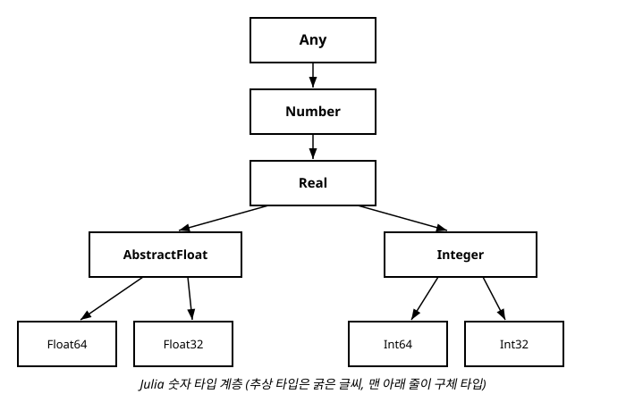

# 9장. 타입 시스템 기초

[◀ 이전: 8장. 배열과 브로드캐스팅](ch08-배열과브로드캐스팅.md) | [📖 목차](00-목차.md) | [다음: 10장. 다중 디스패치 ▶](ch10-다중디스패치.md)


3장에서 우리는 `typeof` 함수로 값의 타입을 확인해 보았고, `Int64`, `Float64`, `String`, `Bool` 같은 구체적인 타입 이름들을 만나 보았습니다. 그런데 Julia에는 이런 "실제 값을 담는" 타입 말고도, 여러 타입을 묶어서 부르기 위한 또 다른 종류의 타입이 있습니다. 이번 장에서는 Julia의 타입들이 어떻게 하나의 커다란 나무(tree) 구조로 조직되어 있는지, 그리고 그 구조를 코드에서 어떻게 탐색하고 활용하는지 살펴봅니다.

이 내용은 단순한 배경지식이 아닙니다. Julia의 가장 큰 특징인 다중 디스패치(10장)와 성능 최적화(16장)는 모두 이번 장에서 다루는 타입 계층을 정확히 이해하고 있어야 제대로 이해할 수 있습니다. 즉 9장은 Julia라는 언어의 정체성을 이해하는 핵심 장입니다.

## 9.1 타입 계층이라는 아이디어

일상생활에서 우리는 사물을 분류할 때 계층 구조를 자연스럽게 사용합니다. "진돗개는 개다", "개는 포유류다", "포유류는 동물이다"처럼 말이지요. 이런 문장들은 진돗개 한 마리가 개이면서 동시에 포유류이고 동시에 동물이라는 사실을 표현합니다.

Julia의 타입 시스템도 이와 똑같은 방식으로 동작합니다. 예를 들어 정수 `10`의 타입인 `Int64`는 다음과 같은 계층에 속해 있습니다.

```julia
julia> typeof(10)
Int64

julia> supertype(Int64)
Signed

julia> supertype(Signed)
Integer

julia> supertype(Integer)
Real

julia> supertype(Real)
Number

julia> supertype(Number)
Any
```

`supertype` 함수는 어떤 타입의 "바로 위" 타입, 즉 부모 타입을 알려줍니다. 이 결과를 보면 `Int64`는 `Signed`의 일종이고, `Signed`는 `Integer`의 일종이며, 이런 식으로 계속 올라가서 결국 `Any`에 도달한다는 것을 알 수 있습니다. `Any`는 Julia의 모든 타입 계층의 정점에 있는, 말 그대로 "무엇이든" 될 수 있는 타입입니다.

이렇게 타입들이 상속 관계로 연결된 나무 구조를 **타입 계층(type hierarchy)**이라고 부릅니다. 이 계층을 이루는 타입은 크게 두 가지 종류로 나뉩니다. 바로 추상 타입과 구체 타입입니다.

## 9.2 추상 타입과 구체 타입

### 구체 타입 (Concrete Type)

**구체 타입**은 실제 값을 만들어낼 수 있는 타입입니다. `Int64`, `Float64`, `Bool`, `String`은 모두 구체 타입입니다.

```julia
julia> x = Int64(10)
10

julia> y = Float64(3.14)
3.14
```

구체 타입은 메모리에 값이 어떻게 저장되는지를 정확히 알고 있습니다. 예를 들어 `Int64`는 "64비트 크기의 부호 있는 정수"라는 구체적인 표현 방식을 갖고 있습니다. 그렇기 때문에 구체 타입의 값은 변수에 직접 저장할 수 있고, 함수의 인자로 전달할 수 있습니다.

구체 타입은 타입 계층에서 **자식 타입을 가질 수 없습니다.** 즉 구체 타입은 항상 나무의 맨 끝(leaf, 잎)에 위치합니다.

```julia
julia> subtypes(Int64)
Type[]
```

`subtypes` 함수는 어떤 타입의 바로 아래 자식 타입들을 배열로 반환합니다. `Int64`처럼 구체 타입인 경우 자식이 없으므로 빈 배열이 반환됩니다.

### 추상 타입 (Abstract Type)

**추상 타입**은 그 자체로는 값을 가질 수 없고, 관련된 타입들을 하나로 묶어 분류하기 위한 "이름표" 역할만 하는 타입입니다. 앞서 본 `Signed`, `Integer`, `Real`, `Number`가 모두 추상 타입입니다.

```julia
julia> Integer(10)  # 이건 실제로는 변환 함수 호출이지 인스턴스 생성이 아님
10

julia> typeof(Integer(10))
Int64
```

위 코드에서 `Integer(10)`이 동작하는 것처럼 보이지만, 실제로 이 호출은 "10을 `Integer` 계열의 적절한 구체 타입으로 변환하라"는 의미이며, 반환되는 값의 진짜 타입은 여전히 `Int64`입니다. 추상 타입 이름으로 직접 인스턴스를 만들 수는 없습니다.

```julia
julia> isabstracttype(Integer)
true

julia> isabstracttype(Int64)
false

julia> isconcretetype(Int64)
true
```

`isabstracttype`과 `isconcretetype` 함수로 어떤 타입이 추상 타입인지 구체 타입인지 직접 확인할 수 있습니다.

추상 타입은 직접 만들 수도 있습니다. `abstract type` 키워드를 사용합니다.

```julia
julia> abstract type Animal end

julia> abstract type Pet <: Animal end
```

`Pet <: Animal`은 "`Pet`은 `Animal`의 서브타입(subtype)이다"라는 뜻입니다. `<:` 연산자는 이번 장에서 매우 자주 등장할 것이므로 잘 기억해 두세요. 사용자 정의 타입을 만드는 방법은 11장에서 구조체와 함께 자세히 다루고, 지금은 Julia에 이미 내장된 추상 타입들의 계층을 이해하는 데 집중하겠습니다.

### 왜 두 종류로 나누는가

이렇게 타입을 추상 타입과 구체 타입으로 나누는 이유는, "실제 데이터를 저장하는 역할"과 "여러 타입을 개념적으로 묶는 역할"을 분리하기 위해서입니다. 추상 타입 덕분에 우리는 "정수든 실수든 상관없이 숫자라면 무엇이든 받는 함수"를 다음과 같이 자연스럽게 표현할 수 있습니다.

```julia
function double(x::Number)
    return x * 2
end
```

```julia
julia> double(10)
20

julia> double(3.14)
6.28
```

`double` 함수는 인자의 타입을 `Number`로 제한했습니다. `Number`는 추상 타입이므로 실제로 `Int64`, `Float64`, `Rational{Int64}` 등 온갖 구체적인 숫자 타입의 값이 이 함수에 전달될 수 있습니다. 반대로 `double("hello")`처럼 숫자가 아닌 값을 넘기면 어떻게 될까요?

```julia
julia> double("hello")
ERROR: MethodError: no method matching double(::String)
```

`"hello"`의 타입인 `String`은 `Number`의 서브타입이 아니므로, Julia는 이 호출에 맞는 메서드를 찾지 못하고 오류를 발생시킵니다. 이처럼 추상 타입을 함수 시그니처에 사용하면 "이 함수는 이런 종류의 값만 받겠다"는 의도를 코드 자체로 표현할 수 있습니다.

## 9.3 Julia의 숫자 타입 계층

Julia의 타입 계층 중에서 가장 자주 마주치는 것이 바로 숫자 타입 계층입니다. 전체 구조는 다음과 같습니다.



이 그림을 코드로 하나씩 확인해 봅시다.

```julia
julia> Int64 <: Integer
true

julia> Int64 <: Real
true

julia> Int64 <: Number
true

julia> Float64 <: AbstractFloat
true

julia> Float64 <: Integer
false
```

`<:` 연산자는 왼쪽 타입이 오른쪽 타입의 서브타입인지(또는 자기 자신인지) 물어보는 연산자입니다. `Int64 <: Number`가 `true`인 것처럼, `Int64`는 직접적인 자식은 아니지만 `Integer → Real → Number`로 이어지는 계층을 통해 결국 `Number`에 포함됩니다. 이렇게 직접 부모가 아니어도 조상 관계에 있으면 `<:`는 `true`를 반환합니다.

주요 타입들을 정리하면 다음과 같습니다.

| 타입 | 종류 | 설명 |
|---|---|---|
| `Number` | 추상 | 모든 숫자 타입의 최상위 |
| `Real` | 추상 | 실수 계열(복소수 제외) |
| `AbstractFloat` | 추상 | 부동소수점 계열 |
| `Integer` | 추상 | 정수 계열 |
| `Signed` | 추상 | 부호 있는 정수 계열 |
| `Unsigned` | 추상 | 부호 없는 정수 계열 |
| `Float64` | 구체 | 64비트 배정밀도 부동소수점 |
| `Float32` | 구체 | 32비트 단정밀도 부동소수점 |
| `Int64` | 구체 | 64비트 부호 있는 정수 |
| `Int32` | 구체 | 32비트 부호 있는 정수 |
| `UInt64` | 구체 | 64비트 부호 없는 정수 |
| `Bool` | 구체 | 참/거짓 (내부적으로 `Integer`의 일종) |
| `Complex{T}` | 구체 | 복소수 |
| `Rational{T}` | 구체 | 유리수 |

흥미롭게도 `Bool`도 정수 계열에 속합니다.

```julia
julia> Bool <: Integer
true

julia> true + true
2

julia> typeof(true + true)
Int64
```

`Bool`이 `Integer`의 서브타입이기 때문에 `true`와 `false`를 산술 연산에 사용할 수 있고, 이때 `true`는 `1`처럼, `false`는 `0`처럼 취급됩니다.

`subtypes`를 이용하면 특정 추상 타입 바로 아래에 어떤 자식 타입들이 있는지 직접 탐색할 수도 있습니다.

```julia
julia> subtypes(Integer)
3-element Vector{Any}:
 Bool
 Signed
 Unsigned

julia> subtypes(AbstractFloat)
4-element Vector{Any}:
 BigFloat
 Float16
 Float32
 Float64
```

이렇게 REPL에서 `subtypes`와 `supertype`을 오가며 실험해 보면, 문서를 찾아보지 않고도 Julia의 타입 계층을 눈으로 확인할 수 있습니다.

## 9.4 Any: 모든 타입의 최상위

앞에서 몇 번 언급했듯이 `Any`는 Julia 타입 계층의 뿌리(root)에 해당하는 추상 타입입니다. Julia의 모든 타입은 `Any`의 서브타입입니다.

```julia
julia> Int64 <: Any
true

julia> String <: Any
true

julia> Number <: Any
true

julia> supertype(Any)
Any
```

마지막 줄이 흥미로운데, `Any`는 자기 자신이 곧 자신의 부모 타입입니다. 즉 계층의 맨 꼭대기라는 뜻입니다.

타입을 명시하지 않고 변수나 함수 인자를 선언하면, Julia는 암묵적으로 그 타입을 `Any`로 취급합니다.

```julia
function process(x)
    println("받은 값: ", x)
end
```

위 함수는 사실 다음과 같은 의미입니다.

```julia
function process(x::Any)
    println("받은 값: ", x)
end
```

`Any`를 사용하면 어떤 타입의 값이든 받아들일 수 있어서 매우 유연해 보이지만, 여기에는 대가가 따릅니다. Julia는 함수를 실행할 때 인자의 구체적인 타입을 안다면 그에 맞춰 매우 빠른 기계어 코드를 미리 생성해 둘 수 있습니다. 하지만 인자의 타입이 `Any`라면 "무엇이 들어올지 알 수 없으니" 실행 중에 매번 타입을 확인해야 하고, 이는 성능 저하로 이어질 수 있습니다. 이 내용은 9.7절과 16장에서 좀 더 자세히 다룹니다.

## 9.5 Union 타입: 여러 타입을 동시에 허용하기

때로는 "정수 아니면 실수", "문자열 아니면 `Nothing`"처럼 정확히 몇 가지 타입만 허용하고 싶을 때가 있습니다. 이럴 때 `Any`를 쓰면 너무 광범위하고, 특정 타입 하나만 쓰면 너무 좁습니다. Julia는 이런 상황을 위해 **`Union` 타입**을 제공합니다.

`Union{타입1, 타입2, ...}`은 "이 타입들 중 하나"라는 의미의 새로운 타입을 만들어 줍니다.

```julia
julia> function safe_divide(a::Int64, b::Int64)::Union{Float64, Nothing}
           if b == 0
               return nothing
           end
           return a / b
       end
safe_divide (generic function with 1 method)

julia> safe_divide(10, 2)
5.0

julia> safe_divide(10, 0)
```

이 함수는 반환 타입을 `Union{Float64, Nothing}`으로 지정했습니다. 나눗셈이 가능하면 `Float64` 값을, `0`으로 나누려는 경우에는 특별한 값인 `nothing`(타입은 `Nothing`)을 반환합니다. 이렇게 하면 함수를 호출하는 쪽에서 "이 함수는 실패할 수도 있다"는 사실을 타입 시그니처만 보고도 알 수 있습니다.

`Union{T, Nothing}` 패턴은 다른 언어의 "널 허용(nullable)" 타입과 비슷한 역할을 하며 Julia에서 매우 자주 쓰입니다.

```julia
julia> x::Union{Int64, Nothing} = nothing
julia> x = 42
42
```

`isa` 연산자로 어떤 값이 `Union` 타입에 속하는지도 확인할 수 있습니다.

```julia
julia> result = safe_divide(10, 0)

julia> result isa Union{Float64, Nothing}
true

julia> if result === nothing
           println("나눗셈에 실패했습니다")
       else
           println("결과: ", result)
       end
나눗셈에 실패했습니다
```

`Union`은 두 개 이상의 타입도 얼마든지 조합할 수 있습니다.

```julia
julia> const IntOrFloat = Union{Int64, Float64}
Union{Float64, Int64}

julia> function describe(x::IntOrFloat)
           println(x, "은(는) 정수 또는 실수입니다")
       end
describe (generic function with 1 method)

julia> describe(5)
5은(는) 정수 또는 실수입니다

julia> describe(5.0)
5.0은(는) 정수 또는 실수입니다
```

`Union` 안에 들어가는 타입이 딱 두 개일 경우, Julia 컴파일러는 이를 특별히 효율적으로 처리하도록 최적화되어 있습니다. 그래서 `Union{T, Nothing}`이나 `Union{T, Missing}`처럼 두 타입을 묶는 패턴은 성능 面에서도 안심하고 사용할 수 있습니다.

## 9.6 타입 계층 탐색 도구 모음

지금까지 사용한 함수들을 한자리에 정리해 보겠습니다. 이 도구들은 낯선 코드를 분석하거나 디버깅할 때 매우 유용합니다.

### isa: 값이 특정 타입에 속하는지 확인

```julia
julia> 10 isa Int64
true

julia> 10 isa Integer
true

julia> 10 isa Number
true

julia> 10 isa AbstractFloat
false

julia> "hello" isa Number
false
```

`isa`는 값 하나와 타입 하나를 받아서, 그 값이 해당 타입이거나 그 타입의 서브타입에 속하면 `true`를 반환합니다. 조건문에서 값의 종류에 따라 분기하고 싶을 때 매우 자주 사용됩니다.

### <: : 타입 사이의 서브타입 관계 확인

```julia
julia> Int64 <: Integer
true

julia> Integer <: Int64
false

julia> Float64 <: Number
true

julia> Number <: Float64
false
```

`isa`는 "값과 타입"의 관계를 물어보고, `<:`는 "타입과 타입"의 관계를 물어봅니다. 이 둘을 헷갈리지 않는 것이 중요합니다.

```julia
julia> typeof(10) <: Integer   # typeof(10)은 Int64이므로 결국 isa와 같은 질문
true

julia> 10 isa Integer
true
```

### supertype: 바로 위 부모 타입 확인

```julia
julia> supertype(Float64)
AbstractFloat

julia> supertype(AbstractFloat)
Real
```

### subtypes: 바로 아래 자식 타입들 확인

```julia
julia> subtypes(Real)
4-element Vector{Any}:
 AbstractFloat
 AbstractIrrational
 Integer
 Rational
```

`subtypes`는 오직 "직계 자식"만 보여줍니다. 손자뻘 타입까지 한 번에 모두 보려면 재귀적으로 탐색해야 합니다.

```julia
function print_type_tree(t, indent=0)
    println(" " ^ indent, t)
    for sub in subtypes(t)
        print_type_tree(sub, indent + 4)
    end
end
```

```julia
julia> print_type_tree(Integer)
Integer
    Bool
    Signed
        BigInt
        Int128
        Int16
        Int32
        Int64
        Int8
    Unsigned
        UInt128
        UInt16
        UInt32
        UInt64
        UInt8
```

이 짧은 재귀 함수 하나로 `Integer` 계열 전체 계층 구조를 한눈에 확인할 수 있습니다. (재귀 함수를 만드는 방법은 6장과 7장에서 다루었습니다.)

### 정리: 네 가지 도구의 역할

| 함수 | 무엇과 무엇을 비교하는가 | 반환값 |
|---|---|---|
| `isa(값, 타입)` | 값 ↔ 타입 | `Bool` |
| `<:(타입1, 타입2)` | 타입 ↔ 타입 | `Bool` |
| `supertype(타입)` | 타입 → 부모 타입 | 타입 |
| `subtypes(타입)` | 타입 → 자식 타입들 | 타입의 배열 |

## 9.7 타입 안정성이라는 개념 살짝 맛보기

지금까지 우리는 타입 계층을 "탐색하는" 관점에서 살펴봤습니다. 그런데 이 지식은 Julia 코드의 속도와도 직결됩니다. Julia가 다른 동적 언어보다 훨씬 빠를 수 있는 비결 중 하나가 바로 **타입 안정성(type stability)**입니다.

타입 안정적인 함수란, 입력 인자의 타입이 정해지면 함수 안의 각 변수와 반환값의 타입도 실행해 보기 전에 미리 정확히 예측할 수 있는 함수를 말합니다. 다음 두 함수를 비교해 봅시다.

```julia
# 타입 안정적인 함수
function stable_add(x::Int64, y::Int64)
    return x + y   # 항상 Int64를 반환
end

# 타입 불안정한 함수
function unstable_add(x::Int64, y::Int64)
    if x > 0
        return x + y        # Int64 반환
    else
        return Float64(x + y)  # Float64 반환
    end
end
```

`stable_add`는 `Int64` 두 개를 받으면 언제나 `Int64`를 돌려줍니다. 컴파일러 입장에서는 "이 함수는 항상 이런 타입을 반환한다"는 사실을 미리 알 수 있으므로, 아주 효율적인 코드를 만들어 둘 수 있습니다. 반면 `unstable_add`는 조건에 따라 `Int64`를 반환할 수도, `Float64`를 반환할 수도 있습니다. 이렇게 반환 타입이 실행 흐름에 따라 달라지면, 컴파일러는 "어떤 타입이 나올지 모르니 대비해 두자"는 식으로 덜 효율적인 코드를 생성하게 되고, 이는 실행 속도 저하로 이어집니다.

REPL에서 `@code_warntype` 매크로를 사용하면 실제로 함수가 타입 안정적인지 직접 확인해 볼 수 있습니다.

```julia
julia> @code_warntype unstable_add(1, 2)
```

이 명령을 실행하면 결과 중간에 `Union{Float64, Int64}`처럼 빨간색(터미널 환경에 따라 다름)으로 강조된 타입이 나타나는데, 이것이 바로 "이 지점에서 타입이 불확실하다"는 경고 신호입니다.

지금 단계에서는 "함수의 반환 타입이나 변수의 타입이 실행 도중 여러 가지로 바뀔 수 있으면 성능에 불리하다"는 개념만 기억해 두면 충분합니다. `@code_warntype`을 직접 읽는 법, 타입 불안정성을 없애는 구체적인 기법들은 16장 "성능 최적화 기초"에서 본격적으로 다룰 것입니다.

## 요약

- Julia의 모든 타입은 하나의 커다란 계층(트리) 구조를 이루며, 그 뿌리에는 `Any`가 있습니다.
- **구체 타입**(`Int64`, `Float64`, `String` 등)은 실제 값을 만들 수 있는 타입이며, 자식 타입을 가질 수 없는 나무의 잎입니다.
- **추상 타입**(`Number`, `Real`, `Integer`, `AbstractFloat` 등)은 관련 타입들을 묶는 분류표 역할만 하며, 직접 인스턴스를 만들 수 없습니다.
- Julia의 대표적인 숫자 타입 계층은 `Any → Number → Real → (AbstractFloat | Integer) → (Float64, Float32 | Int64, Int32, ...)` 형태로 이어집니다.
- `Union{타입1, 타입2, ...}`을 사용하면 "이 타입들 중 하나"를 허용하는 새로운 타입을 만들 수 있으며, `Union{T, Nothing}`은 "값이 없을 수도 있다"는 상황을 표현하는 데 널리 쓰입니다.
- `isa`는 값이 어떤 타입에 속하는지, `<:`는 한 타입이 다른 타입의 서브타입인지 확인합니다. `supertype`은 부모 타입을, `subtypes`는 자식 타입들을 보여줍니다.
- 함수의 반환 타입이나 내부 변수의 타입이 실행 흐름에 따라 바뀌지 않는 성질을 **타입 안정성**이라고 하며, 이는 Julia 코드의 실행 속도에 큰 영향을 미칩니다. 자세한 내용은 16장에서 다룹니다.

## 연습문제

1. REPL에서 `typeof`, `supertype`을 반복 사용해서 `Char` 타입부터 `Any`까지 이어지는 부모 타입 체인을 손으로 적어 보세요.
2. `subtypes(AbstractFloat)`와 `subtypes(Signed)`를 각각 실행하고, 두 결과에 어떤 타입들이 나오는지 표로 정리해 보세요.
3. 인자로 정수나 실수를 받아 그 값이 양수인지 여부를 `Bool`로 반환하는 함수 `is_positive(x::Real)`를 작성하세요. 그리고 문자열을 인자로 넘겼을 때 어떤 오류가 발생하는지 확인해 보세요.
4. 사람의 나이를 나타내는 필드가 있는데, 아직 나이를 모를 수도 있는 상황을 가정합니다. 나이를 `Union{Int64, Nothing}` 타입으로 받아서, 값이 있으면 "나이: N세", 없으면 "나이 미상"을 출력하는 함수 `print_age(age::Union{Int64, Nothing})`를 작성하세요.
5. 다음 두 함수 중 어느 쪽이 타입 안정적일지 실행해 보기 전에 먼저 추측해 보고, `@code_warntype`으로 실제 결과를 확인해 보세요.

```julia
function f1(x::Int64)
    if x > 10
        return 1
    else
        return 2
    end
end

function f2(x::Int64)
    if x > 10
        return 1
    else
        return "small"
    end
end
```

---

[◀ 이전: 8장. 배열과 브로드캐스팅](ch08-배열과브로드캐스팅.md) | [📖 목차](00-목차.md) | [다음: 10장. 다중 디스패치 ▶](ch10-다중디스패치.md)
