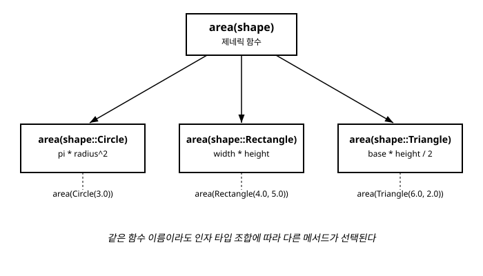

# 10장. 다중 디스패치

[◀ 이전: 9장. 타입 시스템 기초](ch09-타입시스템기초.md) | [📖 목차](00-목차.md) | [다음: 11장. 구조체와 사용자 정의 타입 ▶](ch11-구조체와사용자정의타입.md)


지금까지 우리는 `function` 키워드로 함수를 정의하고, 필요하면 인자에 타입을 명시하는 방법(9장)까지 살펴보았습니다. 이번 장에서는 그 지식을 한 단계 더 발전시켜, Julia라는 언어의 설계 철학 그 자체라고 할 수 있는 **다중 디스패치(multiple dispatch)**를 다룹니다.

다중 디스패치를 이해하고 나면 "왜 Julia에는 클래스(class)라는 개념이 없을까?", "Julia는 왜 `+` 연산자를 사용자가 직접 새로운 타입에 맞게 정의할 수 있을까?" 같은 질문들에 자연스럽게 답할 수 있게 됩니다. 다중 디스패치는 이 책 전체를 통틀어 가장 중요한 개념 중 하나이니, 예제를 직접 REPL에 입력해 가며 천천히 읽어 보시길 권합니다.

## 10.1 디스패치란 무엇인가

**디스패치(dispatch)**란 "함수 호출이 들어왔을 때, 여러 후보 구현 중 실제로 어떤 것을 실행할지 결정하는 과정"을 말합니다. 우리는 이미 이 과정을 자연스럽게 경험한 적이 있습니다. 7장에서 살펴본 것처럼 Julia에서는 같은 이름의 함수에 대해 인자 타입이 다른 여러 버전을 정의할 수 있었습니다.

```julia
function greet(name::String)
    println("안녕하세요, ", name, "님")
end

function greet(name::Int64)
    println("숫자 ", name, "번 손님, 안녕하세요")
end
```

```julia
julia> greet("철수")
안녕하세요, 철수님

julia> greet(7)
숫자 7번 손님, 안녕하세요
```

`greet`라는 이름 하나에 실제로는 두 개의 서로 다른 구현이 연결되어 있고, Julia는 호출 시점에 인자로 넘어온 값의 타입을 보고 어떤 구현을 실행할지 그때그때 "골라서" 실행합니다. 이렇게 같은 이름을 가진 여러 개별 구현을 Julia에서는 **메서드(method)**라고 부르고, 이 메서드들을 하나로 묶는 이름을 **제네릭 함수(generic function)**라고 부릅니다. 즉 `greet`는 제네릭 함수이고, `greet(name::String)`과 `greet(name::Int64)`는 각각 `greet`의 메서드입니다.

여기서 핵심 질문은 이것입니다. "인자가 여러 개라면, 디스패치는 그 중 어떤 인자의 타입을 기준으로 이루어지는가?" 이 질문에 대한 답이 바로 이번 장의 제목인 다중 디스패치입니다.

## 10.2 단일 디스패치 vs 다중 디스패치

자바(Java)나 파이썬(Python) 같은 전통적인 객체지향 언어에서는 메서드가 클래스에 "소속"됩니다. 예를 들어 파이썬으로 도형의 넓이를 계산하는 코드를 쓴다면 보통 이런 모양이 됩니다.

```python
# Python 예시 (Julia 코드가 아닙니다)
class Circle:
    def __init__(self, radius):
        self.radius = radius
    def area(self):
        return 3.14159 * self.radius ** 2

class Rectangle:
    def __init__(self, width, height):
        self.width = width
        self.height = height
    def area(self):
        return self.width * self.height
```

`circle.area()`를 호출하면, 파이썬은 `circle`이라는 객체 하나, 정확히는 `self`에 해당하는 첫 번째 인자의 타입(클래스)만을 보고 실행할 `area` 메서드를 결정합니다. 이처럼 오직 하나의 인자(대개 메서드를 호출하는 객체 자신)의 타입만으로 실행할 코드가 정해지는 방식을 **단일 디스패치(single dispatch)**라고 합니다.

단일 디스패치의 한계는 인자가 둘 이상 관여하는 연산을 표현할 때 드러납니다. 예를 들어 "원과 사각형이 겹치는지 검사하는 함수"를 만들고 싶다면, 이 연산은 두 도형의 타입에 동시에 의존합니다. 단일 디스패치 언어에서는 이런 경우 `circle.intersects(rectangle)`처럼 한쪽 타입을 기준으로 메서드를 두고, 메서드 내부에서 `if isinstance(other, Rectangle): ... elif isinstance(other, Circle): ...`처럼 다시 타입을 검사하는 코드를 작성해야 하는 경우가 많습니다.

Julia는 이 문제를 근본적으로 다른 방식으로 풀어냅니다. Julia의 함수는 특정 타입에 "소속"되지 않습니다. 대신 함수를 호출할 때 **모든 인자의 타입 조합**을 함께 살펴보고, 그 조합에 가장 정확히 맞는 메서드를 찾아 실행합니다. 이것이 바로 **다중 디스패치(multiple dispatch)**입니다.

```julia
function combine(a::Int64, b::Int64)
    println("정수끼리 결합: ", a + b)
end

function combine(a::String, b::String)
    println("문자열끼리 결합: ", a * b)
end

function combine(a::Int64, b::String)
    println("정수와 문자열 결합: ", string(a), b)
end
```

```julia
julia> combine(1, 2)
정수끼리 결합: 3

julia> combine("가", "나")
문자열끼리 결합: 가나

julia> combine(1, "번")
정수와 문자열 결합: 1번
```

`combine(1, "번")`을 호출했을 때, Julia는 첫 번째 인자만 보고 판단하는 것이 아니라 `(Int64, String)`이라는 **인자 타입의 조합 전체**를 보고 세 번째 메서드 `combine(a::Int64, b::String)`을 정확히 찾아냈습니다. 인자가 몇 개든 상관없이, Julia는 항상 모든 인자의 타입을 함께 고려합니다.

정리하면 다음과 같습니다.

| | 무엇을 보고 메서드를 고르는가 | 대표 언어 |
|---|---|---|
| 단일 디스패치 | 첫 번째 인자(`self`/`this`)의 타입만 | Python, Java, Ruby 등 |
| 다중 디스패치 | 모든 인자의 타입 조합 | Julia, Common Lisp 등 |

## 10.3 다중 디스패치 예제: 도형의 넓이 계산

다중 디스패치가 실전에서 어떻게 쓰이는지, 도형의 넓이를 계산하는 예제로 자세히 살펴보겠습니다. 먼저 각 도형을 나타내는 구조체를 정의합니다. 구조체를 정의하는 자세한 방법은 11장에서 다루지만, 지금은 "이름을 가진 데이터 묶음을 만드는 문법" 정도로 이해하고 따라와도 충분합니다.

```julia
struct Circle
    radius::Float64
end

struct Rectangle
    width::Float64
    height::Float64
end

struct Triangle
    base::Float64
    height::Float64
end
```

이제 같은 이름 `area`로, 각 도형 타입에 대응하는 메서드를 하나씩 정의합니다.

```julia
function area(shape::Circle)
    return pi * shape.radius^2
end

function area(shape::Rectangle)
    return shape.width * shape.height
end

function area(shape::Triangle)
    return shape.base * shape.height / 2
end
```

이제 `area` 함수 하나로 세 가지 도형 모두의 넓이를 구할 수 있습니다.

```julia
julia> c = Circle(3.0)
Circle(3.0)

julia> r = Rectangle(4.0, 5.0)
Rectangle(4.0, 5.0)

julia> t = Triangle(6.0, 2.0)
Triangle(6.0, 2.0)

julia> area(c)
28.274333882308138

julia> area(r)
20.0

julia> area(t)
6.0
```

`area(c)`, `area(r)`, `area(t)`는 모두 똑같이 생긴 호출이지만, Julia는 각 인자의 타입(`Circle`, `Rectangle`, `Triangle`)을 보고 알맞은 메서드를 자동으로 선택해서 실행합니다. 이 구조의 장점은 무엇일까요? 만약 나중에 `Square`라는 새로운 도형을 추가하고 싶다면, 기존 코드를 전혀 건드리지 않고 다음과 같이 메서드 하나만 추가하면 됩니다.

```julia
struct Square
    side::Float64
end

function area(shape::Square)
    return shape.side^2
end
```

```julia
julia> area(Square(5.0))
25.0
```

기존의 `Circle`, `Rectangle`, `Triangle`을 다루는 코드는 한 줄도 수정하지 않았는데도, `area` 함수는 자연스럽게 `Square`까지 지원하게 되었습니다. 이런 "닫혀 있지 않고 계속 확장 가능한" 설계는 다중 디스패치가 주는 대표적인 장점입니다.

다음 그림은 하나의 함수 이름 `area`가 인자로 넘어온 도형의 타입에 따라 서로 다른 메서드로 갈라지는 모습을 보여줍니다.



## 10.4 methods로 메서드 목록 확인하기

지금까지 `area`라는 이름 아래 몇 개의 메서드를 정의했는지, 각 메서드가 어떤 타입을 받는지 궁금할 수 있습니다. 이럴 때 `methods` 함수를 사용합니다.

```julia
julia> methods(area)
# 4 methods for generic function "area" from Main:
 [1] area(shape::Circle)
     @ Main REPL[3]:1
 [2] area(shape::Rectangle)
     @ Main REPL[4]:1
 [3] area(shape::Square)
     @ Main REPL[10]:1
 [4] area(shape::Triangle)
     @ Main REPL[5]:1
```

`methods`는 해당 제네릭 함수에 지금까지 정의된 모든 메서드의 목록을 시그니처, 정의된 파일과 줄 번호까지 함께 보여줍니다. 이 함수는 낯선 패키지의 함수가 어떤 타입들을 지원하는지 파악할 때, 또는 내가 만든 함수에 메서드가 의도대로 추가되었는지 확인할 때 매우 유용합니다.

메서드가 몇 개 있는지 개수만 알고 싶다면 `length`와 조합할 수도 있습니다.

```julia
julia> length(methods(area))
4
```

특정 타입에 대해 실제로 어떤 메서드가 선택되는지 미리 확인하고 싶다면 `@which` 매크로를 사용할 수 있습니다.

```julia
julia> @which area(Circle(1.0))
area(shape::Circle)
     @ Main REPL[3]:1
```

`@which`는 실제로 함수를 호출하지 않고도, 주어진 인자 조합에 대해 Julia가 어떤 메서드를 선택할지 미리 알려줍니다. 여러 메서드가 뒤섞여 있는 큰 프로그램을 디버깅할 때 특히 유용한 도구입니다.

내장 함수들 역시 예외가 아닙니다. 우리가 늘 사용하던 `+` 연산자도 사실 매우 많은 메서드를 가진 제네릭 함수입니다.

```julia
julia> length(methods(+))
190  # 실행 환경(로드된 패키지)에 따라 이 숫자는 달라질 수 있습니다
```

이 사실은 다음 절에서 다룰 "연산자 오버로딩"을 이해하는 실마리가 됩니다.

## 10.5 다중 디스패치의 실전 활용

### 연산자도 결국 함수다

Julia에서 `+`, `-`, `*` 같은 연산자는 특별한 문법이 아니라 그 자체로 평범한 제네릭 함수입니다. `1 + 2`라는 표현식은 사실 `+(1, 2)`라는 함수 호출을 조금 더 읽기 편하게 쓴 것뿐입니다.

```julia
julia> 1 + 2
3

julia> +(1, 2)
3
```

이 사실을 알고 나면, "사용자가 정의한 새로운 타입끼리도 `+`로 더할 수 있게 만들 수 있지 않을까?"라는 생각이 자연스럽게 떠오릅니다. 실제로 가능합니다. 통화 단위를 가진 `Money`라는 타입을 만들고, 두 `Money` 값을 더하는 예제를 봅시다.

```julia
struct Money
    amount::Float64
    currency::String
end

import Base: +

function +(a::Money, b::Money)
    if a.currency != b.currency
        error("서로 다른 통화는 더할 수 없습니다: $(a.currency) vs $(b.currency)")
    end
    return Money(a.amount + b.amount, a.currency)
end
```

`+`는 Julia의 `Base` 모듈에 이미 정의되어 있는 함수이므로, 여기에 새로운 메서드를 추가하려면 `import Base: +`로 먼저 그 이름을 우리 코드로 가져와야 합니다. (모듈과 `import`에 대해서는 13장에서 자세히 다룹니다.) 이렇게 정의한 뒤에는 다음과 같이 자연스럽게 사용할 수 있습니다.

```julia
julia> a = Money(1000.0, "KRW")
Money(1000.0, "KRW")

julia> b = Money(2500.0, "KRW")
Money(2500.0, "KRW")

julia> a + b
Money(3500.0, "KRW")

julia> c = Money(10.0, "USD")
Money(10.0, "USD")

julia> a + c
ERROR: 서로 다른 통화는 더할 수 없습니다: KRW vs USD
```

`a + c`라는 코드는 겉보기에 숫자를 더하는 것과 똑같이 생겼지만, 실제로는 우리가 정의한 `+(a::Money, b::Money)` 메서드가 실행되어 통화가 다르면 오류를 내는 등 우리 도메인에 맞는 로직을 수행합니다. 이것이 바로 흔히 말하는 **연산자 오버로딩(operator overloading)**이며, Julia에서는 특별한 문법이 아니라 다중 디스패치의 자연스러운 활용법일 뿐입니다.

### 서로 다른 타입 간의 상호작용을 자연스럽게 표현하기

다중 디스패치가 특히 빛을 발하는 지점은 서로 다른 두 타입이 "만나는" 연산을 정의할 때입니다. 예를 들어 `Money`에 일반 숫자를 곱해서 금액을 늘리거나 줄이는 연산을 생각해 봅시다.

```julia
import Base: *

function *(a::Money, factor::Real)
    return Money(a.amount * factor, a.currency)
end

function *(factor::Real, a::Money)
    return Money(a.amount * factor, a.currency)
end
```

```julia
julia> a = Money(1000.0, "KRW")
Money(1000.0, "KRW")

julia> a * 2
Money(2000.0, "KRW")

julia> 3 * a
Money(3000.0, "KRW")
```

`a * 2`는 `(Money, Int64)` 조합에, `3 * a`는 `(Int64, Money)` 조합에 각각 대응합니다. 인자의 순서가 다르면 타입 조합도 달라지므로, 이 둘은 서로 다른 메서드입니다. 단일 디스패치 방식이었다면 `Money` 클래스 안에 `multiply` 메서드를 두고 `2 * a` 같은 표현은 아예 지원하지 못하거나, 숫자 쪽에 특별한 처리를 추가해야 했을 것입니다. Julia에서는 그저 두 메서드를 나란히 정의하는 것만으로 양방향 모두를 자연스럽게 지원할 수 있습니다.

이런 식으로 다중 디스패치는 "타입 A와 타입 B가 만났을 때 어떻게 동작해야 하는가"라는 질문에 대한 답을, 어느 한쪽 타입에 억지로 종속시키지 않고 독립적인 함수(메서드)로 표현할 수 있게 해줍니다. 이는 Julia 표준 라이브러리와 수많은 패키지들이 서로 다른 타입끼리도 자연스럽게 연산될 수 있도록 설계된 핵심 원리이기도 합니다. 예를 들어 정수와 실수를 더하거나, 실수와 유리수를 비교하는 등 우리가 지금까지 아무렇지 않게 사용해 온 연산들도 모두 내부적으로는 각 타입 조합에 맞는 메서드가 다중 디스패치를 통해 선택된 결과입니다.

## 10.6 다중 디스패치와 타입 계층의 관계

9장에서 배운 추상 타입은 다중 디스패치와 함께 사용할 때 진가를 발휘합니다. 메서드의 인자 타입을 구체 타입 대신 추상 타입으로 지정하면, 그 추상 타입에 속하는 모든 구체 타입에 대해 하나의 메서드로 대응할 수 있습니다.

```julia
function describe_number(x::Integer)
    println(x, "은(는) 정수 계열입니다")
end

function describe_number(x::AbstractFloat)
    println(x, "은(는) 부동소수점 계열입니다")
end
```

```julia
julia> describe_number(10)
10은(는) 정수 계열입니다

julia> describe_number(Int32(10))
10은(는) 정수 계열입니다

julia> describe_number(3.14)
3.14은(는) 부동소수점 계열입니다

julia> describe_number(Float32(3.14))
3.14은(는) 부동소수점 계열입니다
```

`describe_number(x::Integer)`는 `Int64`뿐 아니라 `Int32`, `Int8`, `BigInt` 등 `Integer`의 모든 서브타입에 대해 동작합니다. 이렇게 메서드의 인자 타입을 얼마나 구체적으로(또는 추상적으로) 지정할지는 온전히 설계하는 사람의 선택이며, 이 선택에 따라 하나의 메서드가 얼마나 넓은 범위의 타입을 처리할지가 결정됩니다.

만약 어떤 값이 여러 메서드의 조건에 동시에 들어맞는다면 어떻게 될까요? Julia는 그중 **가장 구체적인(specific)** 시그니처를 가진 메서드를 선택합니다.

```julia
function process(x::Number)
    println("범용 처리: ", x)
end

function process(x::Integer)
    println("정수 전용 처리: ", x)
end
```

```julia
julia> process(3.14)
범용 처리: 3.14

julia> process(10)
정수 전용 처리: 10
```

`10`은 `Number`와 `Integer` 두 시그니처 모두에 들어맞지만, `Integer`가 `Number`보다 더 구체적인(즉 서브타입인) 조건이므로 Julia는 `process(x::Integer)`를 선택합니다. 이 "가장 구체적인 메서드를 고른다"는 규칙 덕분에, 우리는 넓은 범위를 다루는 일반적인 메서드와 특정 타입만을 위한 특수한 메서드를 함께 정의해 두고, Julia가 알아서 적절한 것을 고르게 맡길 수 있습니다.

이처럼 다중 디스패치는 9장에서 다룬 타입 계층 위에서 동작합니다. 타입 계층이 촘촘하고 명확하게 설계되어 있을수록, 다중 디스패치를 활용한 코드도 그만큼 유연하고 확장하기 쉬워집니다. 11장에서는 이 도구들을 활용해 직접 사용자 정의 타입과 구조체를 설계하는 방법을 다룹니다.

## 요약

- **디스패치**는 함수 호출 시 여러 메서드 중 실제로 실행할 것을 결정하는 과정이며, 같은 이름의 함수(제네릭 함수)에 속한 개별 구현을 **메서드**라고 부릅니다.
- 파이썬, 자바 같은 전통적인 객체지향 언어는 **단일 디스패치**를 사용해 첫 번째 인자(`self`/`this`)의 타입만으로 메서드를 결정합니다.
- Julia는 **다중 디스패치**를 사용해 호출에 관여하는 **모든 인자의 타입 조합**을 보고 메서드를 결정합니다.
- 같은 함수 이름(예: `area`)에 여러 타입(`Circle`, `Rectangle`, `Triangle`, ...)에 대한 메서드를 따로 정의하면, 기존 코드를 건드리지 않고도 새로운 타입을 자연스럽게 추가할 수 있습니다.
- `methods(함수이름)`으로 정의된 메서드 목록을, `@which 함수호출(...)`로 실제 선택될 메서드를 확인할 수 있습니다.
- `+`, `*` 같은 연산자도 사실 평범한 제네릭 함수이므로, 사용자 정의 타입에 대해 새로운 메서드를 추가하면 자연스러운 연산자 오버로딩이 가능합니다(예: `+(a::Money, b::Money)`).
- 메서드 인자에 추상 타입을 지정하면 그 서브타입 전체를 아우를 수 있고, 여러 메서드가 동시에 들어맞을 경우 Julia는 **가장 구체적인** 시그니처를 가진 메서드를 선택합니다.

## 연습문제

1. `Dog`, `Cat`이라는 두 구조체(각각 `name::String` 필드만 가짐)를 정의하고, 같은 이름 `speak`에 대해 각 타입에 맞는 메서드를 만들어 `Dog`는 "멍멍", `Cat`은 "야옹"을 이름과 함께 출력하도록 작성하세요.
2. 1번에서 만든 `speak` 함수에 대해 `methods(speak)`를 실행한 결과를 확인하고, 메서드가 몇 개 정의되었는지 적어 보세요.
3. `Vector2D`라는 2차원 벡터 구조체(`x::Float64`, `y::Float64`)를 정의하고, `import Base: +`로 두 `Vector2D`를 더하는 `+(a::Vector2D, b::Vector2D)` 메서드를 작성하세요. 그리고 `Vector2D`와 숫자를 곱하는 `*(v::Vector2D, k::Real)` 메서드도 추가해 보세요.
4. 다음 코드에서 `process(10)`을 호출하면 어떤 메서드가 실행될지 실행하기 전에 예측해 보고, `@which`로 실제 결과를 확인해 보세요.

```julia
process(x::Real) = println("Real 처리")
process(x::Int64) = println("Int64 처리")
process(x::Number) = println("Number 처리")
```

5. 단일 디스패치만 지원하는 언어(파이썬 등)에서 "서로 다른 두 타입이 상호작용하는 연산"(예: 벡터와 스칼라의 곱셈)을 구현하려면 어떤 어려움이 있을지, 그리고 Julia의 다중 디스패치가 이 문제를 어떻게 해결하는지 자신의 말로 설명해 보세요.

---

[◀ 이전: 9장. 타입 시스템 기초](ch09-타입시스템기초.md) | [📖 목차](00-목차.md) | [다음: 11장. 구조체와 사용자 정의 타입 ▶](ch11-구조체와사용자정의타입.md)
