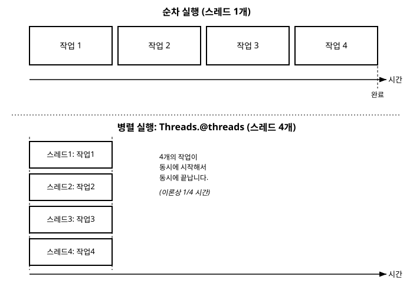

# 17장. 병렬 및 동시성 프로그래밍 기초

[◀ 이전: 16장. 성능 최적화 기초](ch16-성능최적화기초.md) | [📖 목차](00-목차.md) | [다음: 18장. 좋은 Julia 코드 작성 습관 ▶](ch18-좋은Julia코드작성습관.md)


지금까지 작성한 프로그램은 모두 하나의 실행 흐름을 따라갔습니다. 명령어 하나가 끝나야 다음 명령어가 시작되는 방식이었죠. 하지만 현대의 컴퓨터는 대부분 여러 개의 CPU 코어를 갖고 있고, 프로그램이 처리해야 하는 작업 중에는 네트워크 응답이나 파일 입출력처럼 "기다리는 시간"이 큰 비중을 차지하는 것도 많습니다. 이런 상황에서 실행 흐름을 하나만 고집하면 컴퓨터의 자원을 낭비하게 됩니다.

이번 장에서는 Julia가 제공하는 세 가지 도구, 즉 **스레드 기반 병렬처리**, **비동기 작업(Task)**, 그리고 **분산 처리**를 살펴봅니다. 이 주제들은 각각 하나의 장을 채울 만큼 깊이가 있는 내용이지만, 여기서는 "이런 게 있다"는 감을 잡고 기본적인 사용법을 익히는 데 집중합니다. 실제 프로덕션 수준의 병렬 프로그램을 작성하려면 이 장에서 다루는 내용 이상의 학습이 필요하다는 점을 미리 밝혀 둡니다.

## 17.1 병렬처리와 동시성은 다른 개념이다

이 장을 제대로 이해하려면 먼저 **병렬처리(parallelism)**와 **동시성(concurrency)**이라는 두 단어를 구분해야 합니다. 두 단어는 비슷해 보이지만 해결하려는 문제가 다릅니다.

**병렬처리**는 실제로 여러 개의 계산을 동시에, 즉 물리적으로 같은 순간에 진행하는 것을 말합니다. 이를 위해서는 여러 개의 CPU 코어가 필요합니다. 코어가 4개라면 이론적으로 4개의 작업을 정확히 같은 시각에 처리할 수 있습니다. 병렬처리는 주로 CPU를 많이 사용하는 계산(숫자 계산, 이미지 처리 등)을 더 빨리 끝내고 싶을 때 사용합니다.

**동시성**은 여러 작업을 "번갈아 가며" 진행해서 전체적으로 기다리는 시간을 줄이는 것을 말합니다. 코어가 하나뿐이어도 동시성은 구현할 수 있습니다. 예를 들어 웹 서버가 여러 사용자의 요청을 처리할 때, 한 요청이 데이터베이스 응답을 기다리는 동안 다른 요청을 처리하러 잠깐 넘어갔다가 돌아오는 방식입니다. 동시성은 주로 네트워크, 파일, 디스크 입출력처럼 CPU가 아니라 외부 자원을 기다리는 시간이 긴 작업에서 효과를 발휘합니다.

정리하면 다음과 같습니다.

| 구분 | 병렬처리 | 동시성 |
|---|---|---|
| 목적 | 멀티코어를 실제로 활용해 계산을 더 빨리 끝내기 | 대기 시간 중 다른 작업을 진행해 전체 처리량 늘리기 |
| 핵심 자원 | CPU 코어 개수 | 대기 시간(I/O) |
| 적합한 작업 | 수치 계산, 대규모 반복 연산 | 네트워크 요청, 파일 읽기/쓰기, 사용자 입력 대기 |
| Julia의 도구 | `Threads.@threads`, `@distributed`, `pmap` | `@async`, `@sync`, `Task` |

Julia는 이 두 가지 개념 모두를 언어 차원에서 지원합니다. 스레드를 이용한 병렬처리와, 태스크를 이용한 동시성을 각각 살펴보겠습니다.

## 17.2 스레드 기반 병렬처리

### JULIA_NUM_THREADS로 스레드 개수 설정하기

Julia는 기본적으로 스레드 1개로 시작합니다. 병렬처리를 사용하려면 Julia를 시작할 때 스레드 개수를 지정해야 합니다. 가장 간단한 방법은 실행 시 `-t` 옵션을 주는 것입니다.

```bash
julia -t 4
```

`auto`를 지정하면 시스템의 논리 코어 수에 맞춰 자동으로 결정됩니다.

```bash
julia -t auto
```

환경변수 `JULIA_NUM_THREADS`를 미리 설정해 두는 방법도 있습니다. 이렇게 설정해 두면 `-t` 옵션 없이 `julia`만 실행해도 지정한 스레드 개수로 시작됩니다.

```bash
export JULIA_NUM_THREADS=4
julia
```

Windows PowerShell에서는 다음처럼 설정합니다.

```bash
$env:JULIA_NUM_THREADS = "4"
julia
```

현재 실행 중인 Julia가 몇 개의 스레드로 동작하고 있는지는 `Threads.nthreads()`로 확인할 수 있습니다.

```julia
julia> Threads.nthreads()
4
```

만약 이 값이 1이라면, `Threads.@threads`를 사용해도 실질적인 병렬처리 효과를 얻을 수 없습니다. 스레드가 하나뿐이면 "여러 스레드에 나눠 실행"할 대상 자체가 없기 때문입니다.

### Threads.@threads로 반복문 나누기

`Threads.@threads` 매크로는 `for` 반복문 바로 앞에 붙여서, 반복문의 각 회차를 사용 가능한 스레드에 나누어 분배합니다. 사용법은 놀랍도록 간단합니다.

```julia
using Base.Threads

results = zeros(Int, 8)

@threads for i in 1:8
    results[i] = i^2
end

println(results)
```

```
[1, 4, 9, 16, 25, 36, 49, 64]
```

일반 `for` 문과 다른 점은 딱 하나, `@threads`가 붙었다는 것뿐입니다. 하지만 내부적으로는 완전히 다른 일이 벌어집니다. `i in 1:8` 여덟 번의 반복이 사용 가능한 스레드 개수(예: 4개)만큼 나뉘어, 서로 다른 스레드에서 동시에 실행됩니다. 각 반복이 서로 다른 인덱스 `results[i]`에만 접근하므로 안전하게 결과를 모을 수 있습니다.

현재 코드가 어느 스레드에서 실행되고 있는지는 `Threads.threadid()`로 확인할 수 있습니다.

```julia
using Base.Threads

@threads for i in 1:8
    println("반복 $i는 스레드 $(threadid())에서 실행")
end
```

실행할 때마다 어떤 반복이 어느 스레드에 배정되는지 순서가 달라질 수 있다는 점도 병렬처리의 특징입니다. 순차 실행과 스레드 병렬 실행의 타임라인 차이를 그림으로 비교하면 다음과 같습니다.



### 스레드 간 공유 상태와 경쟁 조건

여러 스레드가 **같은 변수를 동시에 읽고 쓰려고 하면** 문제가 생길 수 있습니다. 이런 상황을 **경쟁 조건(race condition)**이라고 부릅니다. 다음 코드는 얼핏 보면 1부터 100만까지 더하는 코드처럼 보이지만, 실제로 실행해 보면 기대한 값이 나오지 않을 수 있습니다.

```julia
using Base.Threads

total = 0

@threads for i in 1:1_000_000
    total += 1
end

println(total)   # 1000000이 아닐 수 있음!
```

`total += 1`은 사실 "`total`을 읽는다 → 1을 더한다 → 결과를 `total`에 쓴다"라는 세 단계로 이루어져 있습니다. 두 스레드가 거의 동시에 `total`을 읽으면 같은 값을 기준으로 각자 1을 더한 뒤 저장하게 되어, 실제로는 두 번 더해져야 할 값이 한 번만 반영되는 일이 벌어집니다. 이렇게 잃어버린 갱신을 **업데이트 손실(lost update)**이라고 합니다.

이 문제를 피하는 가장 간단한 방법은, 각 스레드가 자기 몫의 결과를 독립된 공간에 저장한 뒤 마지막에 합치는 것입니다.

```julia
using Base.Threads

function parallel_sum(n)
    partial = zeros(Int, nthreads())

    @threads for i in 1:n
        partial[threadid()] += 1
    end

    return sum(partial)
end

println(parallel_sum(1_000_000))   # 1000000
```

`partial` 배열은 스레드 개수만큼의 칸을 가지고 있고, 각 스레드는 오직 자기 스레드 번호에 해당하는 칸만 갱신하므로 서로 충돌하지 않습니다. 마지막에 `sum(partial)`로 부분합을 모두 더해 전체 합을 구합니다. Julia는 `Threads.Atomic`이나 `ReentrantLock` 같은 동기화 도구도 제공하지만, 이 책에서는 이름만 언급합니다. 병렬 코드를 작성할 때 가장 중요한 원칙은 **가능하면 스레드끼리 같은 메모리 위치를 동시에 수정하지 않도록 설계하는 것**입니다.

## 17.3 비동기 작업: Task, @async, @sync

### Task란 무엇인가

Julia의 **Task**는 독립적으로 스케줄링될 수 있는 하나의 작업 단위입니다. 함수 호출이 "지금 당장 끝까지 실행하고 결과를 받는" 방식이라면, Task는 "일단 시작해 두고, 필요할 때 결과를 받으러 오는" 방식입니다. 이 개념은 특히 네트워크 요청이나 파일 입출력처럼 결과가 나오기까지 시간이 걸리는 작업에서 유용합니다.

기다리는 시간이 있는 작업을 흉내 내기 위해 `sleep()` 함수를 사용해 보겠습니다.

```julia
function fetch_data(id, delay)
    sleep(delay)   # 네트워크 응답을 기다리는 상황을 흉내냄
    return "데이터 $id 도착 (지연 $(delay)초)"
end
```

이 함수를 순서대로 세 번 호출하면, 각 호출이 끝날 때까지 다음 호출이 시작되지 않으므로 전체 시간은 지연 시간의 합과 같습니다.

```julia
@time begin
    println(fetch_data(1, 2))
    println(fetch_data(2, 1))
    println(fetch_data(3, 3))
end
```

```
데이터 1 도착 (지연 2초)
데이터 2 도착 (지연 1초)
데이터 3 도착 (지연 3초)
  6.0xx seconds
```

2 + 1 + 3, 총 6초가 걸렸습니다. 세 작업 모두 CPU 계산이 아니라 "기다림"이므로, 굳이 순서대로 기다릴 필요가 없습니다.

### @async와 @sync로 동시에 진행하기

`@async`는 표현식을 새로운 Task로 즉시 실행에 들어가도록 예약하고, 원래 실행 흐름은 Task가 끝나기를 기다리지 않고 곧바로 다음 줄로 넘어갑니다. `@sync` 블록은 그 안에서 만들어진 모든 `@async` 작업이 끝날 때까지 기다립니다.

```julia
@time @sync begin
    @async println(fetch_data(1, 2))
    @async println(fetch_data(2, 1))
    @async println(fetch_data(3, 3))
end
```

```
데이터 2 도착 (지연 1초)
데이터 1 도착 (지연 2초)
데이터 3 도착 (지연 3초)
  3.0xx seconds
```

이번에는 세 작업이 동시에 시작되어, 가장 오래 걸리는 작업(3초)이 끝나는 시점에 전체가 끝납니다. 출력 순서도 지연 시간이 짧은 순서(1초, 2초, 3초)로 바뀌었습니다. 이것이 바로 동시성의 효과입니다. 단, 이 예제에서 스레드가 1개뿐이더라도 `@async`는 여전히 효과가 있습니다. `sleep()`으로 대기하는 동안에는 CPU를 쓰지 않으므로, Julia는 그 틈에 다른 Task로 실행을 넘겨줄 수 있기 때문입니다. 이는 병렬처리가 아니라 순수한 동시성입니다.

### Task의 결과값 받기: fetch

`@async`로 시작한 작업의 반환값이 필요하다면, `@async`가 만들어 낸 `Task` 객체를 변수에 저장해 두었다가 `fetch()`로 결과를 받아올 수 있습니다.

```julia
task1 = @async fetch_data(1, 2)
task2 = @async fetch_data(2, 1)

# 두 작업이 진행되는 동안 다른 일을 할 수 있음
println("작업을 예약했습니다. 결과를 기다립니다...")

result1 = fetch(task1)
result2 = fetch(task2)

println(result1)
println(result2)
```

`fetch()`는 해당 Task가 끝날 때까지 기다렸다가 반환값을 돌려줍니다. 이미 끝난 Task라면 곧바로 값을 반환합니다.

### 병렬처리와 동시성을 함께 쓸 때

`Threads.@threads`는 CPU 연산을 여러 스레드에 나누어 병렬로 처리하고, `@async`/`@sync`는 대기 시간이 있는 작업을 동시에 진행합니다. 두 도구는 해결하는 문제가 다르므로 섞어 쓸 수도 있습니다. 예를 들어 여러 개의 파일을 동시에 내려받은 뒤(동시성), 내려받은 각 파일에 대해 무거운 계산을 병렬로 수행하는(병렬처리) 식입니다. 다만 이런 조합은 코드를 복잡하게 만들 수 있으므로, 두 도구의 목적을 명확히 구분한 뒤 필요한 곳에만 적용하는 것이 좋습니다.

## 17.4 분산 처리 맛보기: @distributed와 pmap

지금까지 다룬 `Threads.@threads`와 `@async`는 모두 **하나의 프로세스 안에서** 메모리를 공유하며 동작합니다. 하지만 계산량이 아주 크거나, 하나의 컴퓨터로는 부족해서 여러 대의 컴퓨터에 작업을 나누어야 하는 경우도 있습니다. 이럴 때 사용하는 것이 Julia의 표준 라이브러리인 `Distributed`입니다.

`Distributed`는 여러 개의 독립된 Julia 프로세스(워커, worker)를 띄우고, 그 사이에 작업과 데이터를 분배하는 기능을 제공합니다. 각 워커 프로세스는 메모리를 공유하지 않으므로 데이터를 주고받으려면 직렬화(serialization) 과정을 거칩니다. 워커는 같은 컴퓨터 위에 여러 개를 띄울 수도 있고, 네트워크로 연결된 여러 대의 컴퓨터에 나누어 띄울 수도 있습니다.

`Distributed`가 제공하는 대표적인 도구 두 가지만 이름과 용도 위주로 소개합니다.

- **`@distributed`**: `for` 반복문 앞에 붙여, 반복 구간을 여러 워커 프로세스에 나누어 실행하게 하는 매크로입니다. `Threads.@threads`가 스레드에 나누는 것과 비슷한 역할을, 프로세스 단위로 수행한다고 생각하면 됩니다.
- **`pmap`**: 함수와 입력 목록을 받아, 각 입력에 대한 함수 호출을 여러 워커에 나누어 실행하는 함수입니다. `map(f, 목록)`의 병렬 버전이라고 볼 수 있으며, 각 호출이 오래 걸리고 서로 독립적인 계산일 때 특히 유용합니다.

```julia
using Distributed
addprocs(4)   # 워커 프로세스 4개 추가

result = @distributed (+) for i in 1:1000
    i^2
end

squared = pmap(x -> x^2, 1:100)
```

이 코드가 어떻게 동작하는지 자세한 원리(워커 추가, 데이터 전달 방식, `@everywhere`를 이용한 코드 공유 등)는 이 책의 범위를 넘어섭니다. 지금 단계에서는 "Julia에는 하나의 컴퓨터를 넘어서는 규모의 병렬 계산을 위한 `Distributed` 표준 라이브러리가 있고, `@distributed`와 `pmap`이 그 핵심 도구다"라는 정도만 기억해 두면 충분합니다. 실제로 필요한 순간이 오면 공식 문서를 참고해 본격적으로 학습하기를 권합니다.

## 17.5 어떤 도구를 언제 써야 할까

이번 장에서 다룬 도구들을 상황별로 정리하면 다음과 같습니다.

| 상황 | 추천 도구 |
|---|---|
| 하나의 컴퓨터에서, CPU 연산이 많은 반복문을 빠르게 처리하고 싶다 | `Threads.@threads` |
| 네트워크 요청, 파일 입출력처럼 대기 시간이 있는 작업을 동시에 진행하고 싶다 | `@async`, `@sync`, `Task` |
| 하나의 컴퓨터로 부족해 여러 프로세스/여러 대의 컴퓨터로 계산을 분산하고 싶다 | `@distributed`, `pmap` (`Distributed` 표준 라이브러리) |
| 여러 스레드가 같은 데이터를 동시에 수정할 위험이 있다 | 스레드별로 독립된 저장 공간을 두고 마지막에 합치기 |

병렬 및 동시성 프로그래밍은 강력한 만큼 디버깅이 까다로운 분야이기도 합니다. 처음에는 순차적인 코드로 정확성을 먼저 확인한 뒤, 성능이 실제로 문제가 되는 부분에 한해 이번 장의 도구를 신중하게 적용하는 습관을 들이는 것이 좋습니다. 16장에서 배운 것처럼, 최적화는 언제나 "측정 후 적용"이 원칙입니다.

## 요약

- **병렬처리**는 여러 CPU 코어를 이용해 계산을 실제로 동시에 진행하는 것이고, **동시성**은 대기 시간이 있는 작업들을 번갈아 진행해 전체 처리량을 늘리는 것입니다. 둘은 목적과 해결 방법이 다릅니다.
- `Threads.@threads`는 `for` 반복문의 각 회차를 여러 스레드에 나누어 병렬로 실행합니다. 스레드 개수는 `JULIA_NUM_THREADS` 환경변수나 `julia -t` 옵션으로 설정하며, `Threads.nthreads()`로 현재 스레드 수를 확인할 수 있습니다.
- 여러 스레드가 같은 변수를 동시에 수정하면 경쟁 조건이 발생해 값이 유실될 수 있습니다. 스레드별로 독립된 저장 공간(예: `nthreads()` 크기의 배열)을 두고 마지막에 합치는 방식으로 이를 피할 수 있습니다.
- `@async`는 표현식을 새로운 Task로 즉시 실행 예약하고, `@sync`는 그 안의 모든 `@async` 작업이 끝날 때까지 기다립니다. 대기 시간이 있는 작업 여러 개를 동시에 진행할 때 유용하며, 스레드가 1개뿐이어도 효과가 있습니다.
- `fetch()`로 `Task`의 반환값을 받아올 수 있습니다.
- `Distributed` 표준 라이브러리의 `@distributed`와 `pmap`은 여러 프로세스, 나아가 여러 대의 컴퓨터에 계산을 분산시키는 도구입니다. 이 책에서는 이름과 용도만 소개했습니다.

## 연습문제

1. 병렬처리와 동시성의 차이를 자신의 말로 한두 문장씩 설명하고, 각각에 어울리는 예시 작업을 하나씩 들어 보세요.
2. `Threads.nthreads()`를 실행해 현재 스레드 개수를 확인해 보세요. 만약 1이라면 `julia -t auto` 또는 `julia -t 4`로 다시 실행한 뒤 값이 어떻게 바뀌는지 확인해 보세요.
3. `Threads.@threads`를 사용해 길이 1,000,000짜리 배열의 각 원소를 제곱하는 코드를 작성해 보세요. (힌트: 결과를 저장할 배열을 미리 만들어 두고, 각 반복에서 자기 인덱스에만 값을 쓰도록 합니다.)
4. `@async`와 `@sync`를 사용해, 서로 다른 지연 시간(예: 1초, 2초, 1.5초)을 가진 세 개의 가짜 다운로드 작업을 동시에 실행하고, `@time`으로 전체 걸린 시간이 지연 시간의 합보다 짧은지 확인해 보세요.
5. `@distributed`와 `pmap`이 각각 어떤 상황에 적합한 도구인지, 그리고 `Threads.@threads`와 근본적으로 어떤 점이 다른지(메모리 공유 여부) 자신의 말로 설명해 보세요.

---

[◀ 이전: 16장. 성능 최적화 기초](ch16-성능최적화기초.md) | [📖 목차](00-목차.md) | [다음: 18장. 좋은 Julia 코드 작성 습관 ▶](ch18-좋은Julia코드작성습관.md)
