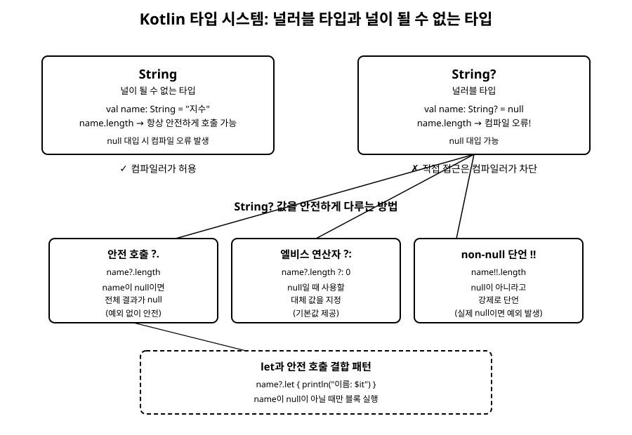

# 8장. null 안전성

[◀ 이전: 7장. 함수](ch07-함수.md) | [📖 목차](00-목차.md) | [다음: 9장. 클래스와 객체 ▶](ch09-클래스와객체.md)

---

## Java에서 NullPointerException은 왜 그렇게 흔했을까

Java로 코드를 작성해본 적이 있다면 `NullPointerException`(줄여서 NPE)이라는 예외를 한 번쯐은 만나봤을 것입니다. 사실 이 예외는 Java 개발자들 사이에서 워낙 자주 등장해서 "억만 달러짜리 실수(billion-dollar mistake)"라는 별명까지 붙었습니다. 이 별명은 null 참조 개념을 처음 도입한 컴퓨터 과학자 토니 호어(Tony Hoare)가 스스로 붙인 것으로 알려져 있습니다.

문제의 핵심은 간단합니다. Java에서는 `String`이든 `List`든 어떤 참조 타입 변수든 겉보기에는 멀쩡한 타입이라도 실제로는 `null`이 들어 있을 수 있습니다. 컴파일러는 그 변수가 지금 null인지 아닌지 알려주지 않으며, 타입 선언만 봐서는 이 값을 안전하게 써도 되는지 전혀 구분할 수 없습니다.

```java
// Java 코드 (Kotlin 아님)
String name = getUserName(); // null을 반환할 수도 있는 메서드
int length = name.length();  // name이 null이면 여기서 NPE 발생
```

이 코드는 컴파일 시점에는 아무 문제가 없어 보입니다. 하지만 `getUserName()`이 실제로 `null`을 반환하는 순간, 프로그램은 실행 중에 갑자기 멈춰버립니다. 개발자는 코드를 아무리 눈으로 읽어도 이 위험을 미리 알아차리기 어렵고, 결국 테스트를 돌려보거나 운영 환경에서 장애가 나야 문제를 발견하는 경우가 많았습니다.

## Kotlin의 해법: 타입 시스템에서 널 가능성을 구분하기

Kotlin은 이 문제를 근본적으로 다른 방식으로 접근합니다. 타입 자체에 "이 값은 null이 될 수 있는가"라는 정보를 포함시켜서, 컴파일러가 컴파일 시점에 null 관련 오류를 미리 잡아내도록 만든 것입니다.

Kotlin에서 `String`이라고 선언한 변수는 절대로 `null`을 담을 수 없습니다. 반면 `String?`처럼 타입 뒤에 물음표를 붙이면, 그 변수는 `null`이 들어갈 수 있는 널러블 타입(nullable type)이 됩니다.

```kotlin
fun main() {
    val name: String = "지수"   // 널이 될 수 없는 타입
    // name = null              // 컴파일 오류! String에는 null을 담을 수 없다

    val nickname: String? = null  // 널러블 타입, null 허용
    println(nickname)
}
```

이렇게 타입만 보고도 이 값이 null일 가능성이 있는지 없는지 알 수 있다는 것이 핵심입니다. 3장에서 변수를 선언할 때 타입을 명시하거나 추론에 맡겼던 것을 떠올려보면, Kotlin은 그 타입 정보에 널 가능성까지 함께 담아둔다고 볼 수 있습니다. 그리고 컴파일러는 널러블 타입의 값에 대해서는 멤버에 바로 접근하는 것을 허용하지 않습니다.

```kotlin
fun printLength(text: String?) {
    println(text.length) // 컴파일 오류! text는 null일 수 있다
}
```

위 코드는 컴파일조차 되지 않습니다. `text`가 `String?` 타입이므로 컴파일러는 "이 값이 null일 수도 있는데, null이면 `.length`를 호출할 방법이 없지 않느냐"라고 지적하는 것입니다. Java에서는 실행해봐야 알 수 있던 문제를 Kotlin은 코드를 작성하는 그 순간에 알려줍니다. 아래 그림은 이 두 타입을 컴파일러가 어떻게 다르게 취급하는지, 그리고 널러블 타입을 안전하게 다루는 방법에는 무엇이 있는지를 정리한 것입니다.



## 안전 호출 연산자 ?.

그렇다면 널러블 타입의 값을 아예 쓸 수 없는 것일까요? 그렇지는 않습니다. Kotlin은 널러블 타입을 안전하게 다룰 수 있는 여러 문법을 제공합니다. 그중 가장 기본이 되는 것이 안전 호출 연산자(safe call operator) `?.`입니다.

```kotlin
fun printLength(text: String?) {
    println(text?.length) // text가 null이 아니면 length를, null이면 null을 출력
}

fun main() {
    printLength("hello") // 5
    printLength(null)    // null
}
```

`text?.length`는 "`text`가 null이 아니면 `.length`를 호출하고, `text`가 null이면 전체 식의 결과를 그냥 `null`로 만든다"는 뜻입니다. 예외를 던지지 않고 조용히 `null`이라는 값으로 흘러가기 때문에, 프로그램이 멈추지 않습니다. 여러 단계로 이어진 호출에서도 안전 호출을 연달아 사용할 수 있습니다.

```kotlin
class Address(val city: String?)
class User(val address: Address?)

fun getCity(user: User?): String? {
    return user?.address?.city
}
```

`user`, `user.address`, `user.address.city` 중 어느 하나라도 null이면 전체 결과가 곧바로 `null`이 되고, 중간의 어떤 참조도 실제로 null인 채로 호출되지 않습니다.

## 엘비스 연산자 ?:

안전 호출의 결과가 `null`일 때, 그냥 `null`을 그대로 두지 않고 대신 쓸 기본값을 정해주고 싶은 경우가 많습니다. 이럴 때 쓰는 것이 엘비스 연산자(Elvis operator) `?:`입니다. 물음표와 콜론을 옆으로 눕히면 가수 엘비스 프레슬리의 헤어스타일처럼 보인다고 해서 이런 이름이 붙었습니다.

```kotlin
fun main() {
    val text: String? = null
    val length = text?.length ?: 0
    println(length) // 0
}
```

`text?.length ?: 0`은 "`text?.length`의 결과가 null이 아니면 그 값을 쓰고, null이면 대신 0을 쓴다"는 뜻입니다. 엘비스 연산자는 5장에서 배운 `if` 표현식으로 다음과 같이 풀어 쓸 수도 있지만, `?:`를 쓰면 훨씬 간결합니다.

```kotlin
val length = if (text != null) text.length else 0
```

엘비스 연산자는 함수에서 유효하지 않은 입력에 대해 기본값이나 예외를 즉시 처리하는 데도 자주 쓰입니다.

```kotlin
fun getOrThrow(value: String?): String {
    return value ?: throw IllegalArgumentException("value는 null일 수 없습니다")
}
```

`throw`도 값을 만들어내는 표현식으로 취급되기 때문에, 엘비스 연산자의 오른쪽에 자연스럽게 들어갈 수 있습니다.

## non-null 단언 !!, 그리고 남용에 대한 경고

가끔은 "이 값이 null이 아니라는 걸 나는 확실히 알고 있다"고 컴파일러에게 직접 알려주고 싶을 때가 있습니다. 이때 쓰는 것이 non-null 단언 연산자(non-null assertion operator) `!!`입니다.

```kotlin
fun main() {
    val text: String? = "hello"
    val length: Int = text!!.length
    println(length) // 5
}
```

`text!!`는 "`text`가 null이 아니라고 강제로 단언하니, 이후로는 `String` 타입처럼 다뤄도 좋다"는 뜻입니다. 만약 실제로 `text`가 `null`이었다면 어떻게 될까요? 이 경우 `!!`는 Kotlin에서 `NullPointerException`을 그대로 던집니다. 다시 말해 `!!`는 Kotlin이 애써 없애준 NPE 위험을 개발자가 다시 코드 안에 불러들이는 것과 다름없습니다.

그래서 `!!`는 되도록 아껴서 써야 합니다. `!!`를 여기저기 붙이기 시작하면, Kotlin의 타입 시스템이 제공하는 안전성은 거의 사라지고 Java 시절의 문제로 되돌아가는 셈입니다. `!!`가 필요한 경우는 극히 제한적입니다. 예를 들어 프레임워크의 제약 때문에 어쩔 수 없이 널러블로 선언된 값이지만, 로직상 이 시점에는 절대 null일 수 없다는 확신이 있을 때 정도입니다. 대부분의 상황에서는 `?.`, `?:`, 또는 다음에 볼 `let`을 활용해서 null을 안전하게 처리하는 편이 훨씬 낫습니다.

## let과 함께 쓰는 안전한 null 처리 패턴

`let`은 어떤 값에 대해 코드 블록을 실행하고 그 결과를 돌려주는 함수입니다. 안전 호출 연산자 `?.`와 함께 쓰면, "값이 null이 아닐 때만 이 블록을 실행하라"는 패턴을 아주 자연스럽게 표현할 수 있습니다.

```kotlin
fun main() {
    val nickname: String? = "코린"

    nickname?.let {
        println("닉네임은 $it 입니다")   // nickname이 null이 아닐 때만 실행됨
    }

    val empty: String? = null
    empty?.let {
        println("이 줄은 실행되지 않습니다")
    }
}
```

`nickname?.let { ... }`에서 `nickname`이 `null`이 아니면 블록이 실행되고, 블록 안에서는 `it`이라는 이름으로 null이 아닌 값을 바로 사용할 수 있습니다. 반대로 `nickname`이 `null`이면 안전 호출 덕분에 블록 자체가 실행되지 않고 조용히 넘어갑니다. 이 패턴은 "값이 있을 때만 무언가를 한다"는 의도를 `if (x != null)` 같은 조건문 없이도 표현할 수 있어서 자주 쓰입니다.

```kotlin
fun updateProfile(newEmail: String?) {
    newEmail?.let { email ->
        println("이메일을 $email 로 변경합니다")
        // 실제로는 여기서 저장소에 반영하는 로직이 들어갈 수 있다
    }
}
```

여기서는 `it` 대신 `email`이라는 이름을 직접 지정해서 가독성을 높였습니다. `let`은 13장에서 배울 람다와 고차함수의 한 예이기도 합니다. 지금은 "null이 아닐 때만 실행되는 블록"이라는 용도로만 기억해두어도 충분하며, 람다가 정확히 무엇인지, 그리고 함수를 값으로 넘긴다는 것이 어떤 의미인지는 13장에서 자세히 다룹니다.

## 요약

- Java에서는 참조 타입이라면 무엇이든 null이 될 수 있어서, 컴파일러가 이를 구분하지 못해 실행 중에 `NullPointerException`이 자주 발생했습니다.
- Kotlin은 타입 시스템에서 널이 될 수 없는 타입(`String`)과 널러블 타입(`String?`)을 명확히 구분하며, 널러블 타입의 값에 바로 접근하려고 하면 컴파일 오류가 발생합니다.
- 안전 호출 연산자 `?.`는 값이 null이 아닐 때만 멤버에 접근하고, null이면 결과를 그냥 null로 만듭니다.
- 엘비스 연산자 `?:`는 앞의 값이 null일 때 사용할 대체 값을 지정합니다.
- non-null 단언 `!!`는 값이 null이 아니라고 강제로 단언하지만, 실제로 null이면 예외가 발생하므로 꼭 필요한 경우가 아니면 피해야 합니다.
- `값?.let { ... }` 패턴을 이용하면 값이 null이 아닐 때만 코드 블록을 실행하는 안전한 처리를 간결하게 작성할 수 있습니다.

## 연습문제

1. `String?` 타입의 매개변수를 받아, 값이 null이면 "빈 문자열"을, null이 아니면 그 값의 길이를 출력하는 함수를 `?.`와 `?:`를 사용해 작성하세요.
2. `!!`를 사용했을 때 실제로 `NullPointerException`이 발생하는 예제 코드를 작성하고, 왜 이런 상황이 위험한지 한두 문장으로 설명해보세요.
3. `class Person(val name: String, val pet: Pet?)`과 `class Pet(val name: String?)`이 주어졌을 때, `Person?` 타입의 값에서 반려동물의 이름을 안전하게 가져오는 함수를 안전 호출 연쇄(`?.?.`)로 작성하세요.
4. 어떤 값이 null이 아닐 때만 로그를 출력하도록 `let`과 안전 호출을 함께 사용하는 예제를 작성하세요.
5. 다음 중 컴파일 오류가 발생하는 코드를 모두 찾고, 그 이유를 설명하세요.
   - `val a: String = null`
   - `val b: String? = null`
   - `val c: String? = "hi"; println(c.length)`
   - `val d: String? = "hi"; println(d?.length)`

---

[◀ 이전: 7장. 함수](ch07-함수.md) | [📖 목차](00-목차.md) | [다음: 9장. 클래스와 객체 ▶](ch09-클래스와객체.md)
