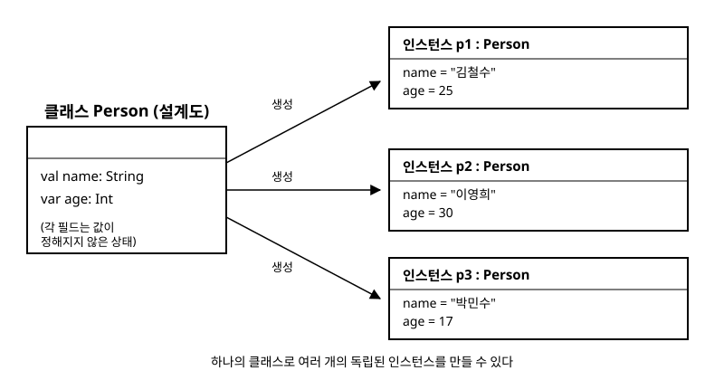

# 9장. 클래스와 객체

[◀ 이전: 8장. null 안전성](ch08-null안전성.md) | [📖 목차](00-목차.md) | [다음: 10장. 데이터 클래스와 상속 ▶](ch10-데이터클래스와상속.md)

---

지금까지는 변수와 함수만으로 프로그램을 작성했습니다. 하지만 실제 프로그램은 "은행 계좌", "학생", "주문" 처럼 여러 개의 데이터와 그 데이터를 다루는 동작을 하나로 묶어서 표현해야 하는 경우가 훨씬 많습니다. 이런 묶음을 만드는 도구가 바로 **클래스(class)**입니다. 이번 장에서는 Kotlin에서 클래스를 정의하는 방법, 생성자와 프로퍼티라는 Kotlin 고유의 문법, 그리고 접근 제한자를 활용해 안전한 클래스를 설계하는 방법을 살펴봅니다.

## 클래스는 설계도, 객체는 그 설계도로 만든 실체

클래스는 "어떤 데이터를 가지고 어떤 동작을 할 수 있는가"를 정의하는 설계도(blueprint)입니다. 이 설계도로부터 실제로 메모리에 만들어지는 것을 **객체(object)** 또는 **인스턴스(instance)**라고 부릅니다. 하나의 클래스로 여러 개의 객체를 자유롭게 만들 수 있으며, 각 객체는 서로 독립적인 상태를 가집니다.

```kotlin
class Person {
    var name: String = ""
    var age: Int = 0
}

fun main() {
    val p1 = Person()
    p1.name = "김철수"
    p1.age = 25

    val p2 = Person()
    p2.name = "이영희"
    p2.age = 30

    println("${p1.name}: ${p1.age}세")
    println("${p2.name}: ${p2.age}세")
}
```

`p1`과 `p2`는 같은 `Person` 클래스에서 만들어졌지만 서로 다른 이름과 나이를 가진 별개의 객체입니다. 이 관계를 그림으로 나타내면 다음과 같습니다.



## 주 생성자(primary constructor)

위 예제처럼 객체를 만든 뒤 프로퍼티를 하나씩 대입하는 방식은 번거롭고, 값을 빠뜨리는 실수도 하기 쉽습니다. Kotlin은 클래스 헤더에 바로 **주 생성자**를 선언해서 객체 생성과 동시에 필요한 값을 받도록 할 수 있습니다.

```kotlin
class Person(name: String, age: Int) {
    val name: String = name
    val age: Int = age
}
```

이 코드는 그대로 동작하지만 Kotlin은 훨씬 간결한 표기를 제공합니다. 생성자 매개변수 앞에 `val`이나 `var`을 붙이면, 매개변수를 받는 동시에 같은 이름의 프로퍼티가 자동으로 선언됩니다.

```kotlin
class Person(val name: String, var age: Int)

fun main() {
    val p1 = Person("김철수", 25)
    println(p1.name)   // 김철수
    p1.age = 26         // var이므로 변경 가능, name은 val이라 변경 불가
}
```

이름은 한 번 정해지면 바뀌지 않는 경우가 많으므로 `val`로, 나이처럼 변할 수 있는 값은 `var`로 선언하는 식으로 각 프로퍼티의 성격에 맞게 선택하면 됩니다. 매개변수에 기본값을 지정하면 4장에서 다룬 것처럼 일부 인자를 생략하고 호출할 수도 있습니다.

```kotlin
class Person(val name: String, var age: Int = 0)

fun main() {
    val baby = Person("아기")   // age는 기본값 0
}
```

## init 블록

주 생성자는 매개변수를 받는 역할만 하고, 그 값으로 추가적인 검증이나 초기화 로직을 수행하고 싶을 때는 `init` 블록을 사용합니다. `init` 블록은 객체가 생성될 때 주 생성자와 함께 실행됩니다.

```kotlin
class Person(val name: String, var age: Int) {
    init {
        require(age >= 0) { "나이는 음수일 수 없습니다: $age" }
        println("$name 객체가 생성되었습니다.")
    }
}
```

`init` 블록은 클래스 안에 여러 개를 둘 수도 있으며, 프로퍼티 선언 순서와 `init` 블록이 작성된 순서대로 위에서 아래로 실행됩니다. 8장에서 다룬 `require`처럼 잘못된 값이 들어오면 즉시 예외를 던져 문제를 조기에 발견하게 만드는 것이 좋은 습관입니다.

## 프로퍼티: Java의 getter/setter를 대신하는 문법

Java에서는 필드를 `private`으로 감추고 `getName()`, `setName()` 같은 메서드를 따로 작성하는 것이 관례입니다. Kotlin은 이 과정을 언어 차원에서 대신해줍니다. `val`이나 `var`로 선언한 프로퍼티는 이미 내부적으로 getter(그리고 `var`라면 setter)를 갖고 있으며, `p1.name`처럼 필드에 접근하는 문법이 사실은 getter 호출로 컴파일됩니다.

기본 동작으로 충분하지 않다면 getter와 setter를 직접 정의할 수 있습니다. 이때 setter 안에서 실제 값을 저장하는 공간을 **backing field**라고 부르며 `field`라는 특별한 이름으로 접근합니다.

```kotlin
class Person(name: String, age: Int) {
    val name: String = name

    var age: Int = age
        set(value) {
            if (value >= 0) {
                field = value   // 실제 저장 공간에 값을 대입
            } else {
                println("나이는 음수일 수 없어 무시합니다.")
            }
        }

    // 저장 공간 없이 계산해서 돌려주는 프로퍼티
    val isAdult: Boolean
        get() = age >= 19
}

fun main() {
    val p = Person("박민수", 17)
    println(p.isAdult)   // false
    p.age = -5             // 무시됨, 경고 출력
    println(p.age)         // 17
}
```

`isAdult`처럼 매번 계산해서 반환하는 프로퍼티는 `field`가 필요 없으므로 별도의 저장 공간을 갖지 않습니다. 이런 방식으로 Kotlin의 프로퍼티는 "필드 + getter + setter"를 하나의 문법으로 통합해서 훨씬 적은 코드로 같은 효과를 냅니다.

## 부 생성자(secondary constructor)

하나의 클래스를 여러 방식으로 생성하고 싶을 때는 `constructor` 키워드로 **부 생성자**를 추가로 선언할 수 있습니다. 주 생성자가 있는 클래스의 부 생성자는 반드시 `this(...)`를 통해 주 생성자(또는 다른 부 생성자)를 호출해야 합니다.

```kotlin
class Point(val x: Int, val y: Int) {
    // 원점에서 시작하는 점을 만드는 보조 생성자
    constructor() : this(0, 0)

    // 문자열 "x,y"를 파싱해서 만드는 보조 생성자
    constructor(coord: String) : this(
        coord.split(",")[0].trim().toInt(),
        coord.split(",")[1].trim().toInt()
    )
}

fun main() {
    val origin = Point()
    val p = Point("3, 4")
    println("${p.x}, ${p.y}")   // 3, 4
}
```

실무에서는 부 생성자보다 매개변수 기본값이나 7장에서 배운 최상위(top-level) 함수, 또는 companion object의 팩토리 함수를 활용하는 경우가 더 많습니다. 하지만 Java 라이브러리와 상호운용해야 하거나(17장에서 다시 다룹니다), 서로 다른 초기화 경로를 명확히 분리해야 할 때는 부 생성자가 여전히 유용합니다.

## 접근 제한자

클래스의 프로퍼티나 함수를 외부에서 얼마나 접근할 수 있게 할지는 접근 제한자로 조절합니다.

| 제한자 | 접근 범위 |
|---|---|
| `public` (기본값) | 어디서든 접근 가능 |
| `private` | 선언된 클래스 내부에서만 접근 가능 |
| `protected` | 해당 클래스와 하위 클래스(10장 상속 참고)에서 접근 가능 |
| `internal` | 같은 모듈(같은 프로젝트/빌드 단위) 안에서만 접근 가능 |

아무 제한자도 쓰지 않으면 `public`이 적용됩니다. Java와 달리 Kotlin은 별도로 명시하지 않아도 기본이 `public`이라는 점을 기억해 두면 좋습니다.

## 종합 예제: BankAccount

지금까지 배운 요소를 모아 간단한 은행 계좌 클래스를 설계해 보겠습니다. 잔액은 외부에서 마음대로 바꿀 수 없어야 하므로 `private` 저장 공간에 두고, `deposit`과 `withdraw`라는 함수로만 변경할 수 있게 만듭니다.

```kotlin
class BankAccount(val owner: String, initialBalance: Long) {

    // 외부에서는 읽기만 가능하도록 커스텀 getter를 가진 프로퍼티로 노출
    var balance: Long = initialBalance
        private set   // setter는 클래스 내부에서만 사용 가능

    init {
        require(initialBalance >= 0) { "초기 잔액은 0 이상이어야 합니다." }
    }

    fun deposit(amount: Long) {
        require(amount > 0) { "입금액은 0보다 커야 합니다." }
        balance += amount
    }

    fun withdraw(amount: Long): Boolean {
        if (amount <= 0 || amount > balance) {
            return false
        }
        balance -= amount
        return true
    }
}

fun main() {
    val account = BankAccount("김철수", 10_000)
    account.deposit(5_000)
    println(account.balance)          // 15000

    val success = account.withdraw(100_000)
    println(success)                  // false, 잔액 부족

    // account.balance = 999_999_999  // 컴파일 오류: setter가 private
}
```

`private set`은 프로퍼티 자체는 `public`으로 읽되, 값을 바꾸는 setter만 클래스 내부로 제한하는 매우 실용적인 패턴입니다. 이렇게 하면 외부 코드는 `balance`를 자유롭게 읽을 수 있지만 오직 `deposit`과 `withdraw`를 통해서만, 즉 정해진 규칙을 지키면서만 잔액을 바꿀 수 있습니다. 이런 식으로 데이터와 그 데이터를 안전하게 다루는 규칙을 한 곳에 묶는 것을 **캡슐화(encapsulation)**라고 부르며, 클래스 설계의 핵심 목표 중 하나입니다.

## 요약

- 클래스는 데이터와 동작을 묶는 설계도이고, 객체(인스턴스)는 그 설계도로부터 만들어진 실체입니다. 하나의 클래스로 여러 개의 독립적인 객체를 만들 수 있습니다.
- 주 생성자는 클래스 헤더에서 선언하며, 매개변수에 `val`/`var`을 붙이면 곧바로 프로퍼티가 됩니다.
- `init` 블록은 객체 생성 시점에 값 검증이나 추가 초기화를 수행합니다.
- Kotlin의 프로퍼티는 Java의 필드 + getter/setter를 대체하는 문법으로, `field` 키워드로 backing field에 접근해 커스텀 getter/setter를 작성할 수 있습니다.
- 부 생성자는 `constructor` 키워드로 추가하며 반드시 `this(...)`로 주 생성자를 거쳐야 합니다.
- 접근 제한자(`public`, `private`, `protected`, `internal`)로 프로퍼티와 함수의 노출 범위를 제어해 캡슐화를 구현합니다.

다음 10장에서는 `equals`, `hashCode`, `toString`을 자동으로 만들어주는 `data class`와, 클래스 사이의 상속 관계를 다룹니다.

## 연습문제

1. `title`(제목)과 `author`(저자), `pageCount`(페이지 수)를 가진 `Book` 클래스를 주 생성자로 정의하세요. `pageCount`는 0보다 커야 하며, 그렇지 않으면 `init` 블록에서 예외를 던지도록 하세요.
2. `Rectangle` 클래스에 `width`와 `height`를 받는 주 생성자를 만들고, `area`(넓이)를 매번 계산해서 반환하는 커스텀 getter 프로퍼티로 추가하세요.
3. `Temperature` 클래스가 섭씨 값을 `private set`으로 보호하고, `heat(amount: Double)`과 `cool(amount: Double)` 함수로만 값을 바꿀 수 있게 설계해 보세요. 절대 0도(-273.15) 이하로는 내려가지 않도록 검증하세요.
4. `Point(x, y)` 클래스에 좌표를 "x,y" 형식 문자열로 받는 부 생성자와, 원점을 만드는 매개변수 없는 부 생성자를 추가해 보세요.
5. `BankAccount` 예제에 `accountNumber`를 자동으로 생성해서 부여하는 기능을 `init` 블록에 추가한다면 어떤 방식이 좋을지 설계해 보고, `private` 프로퍼티로 저장해 보세요.

---

[◀ 이전: 8장. null 안전성](ch08-null안전성.md) | [📖 목차](00-목차.md) | [다음: 10장. 데이터 클래스와 상속 ▶](ch10-데이터클래스와상속.md)
