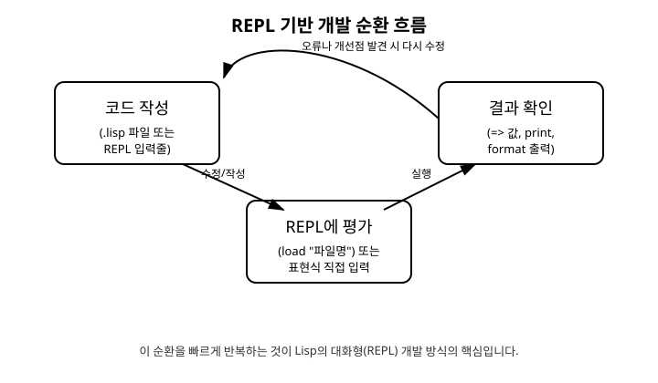

# 2장. 개발 환경과 첫 실행

[◀ 이전: 1장. Lisp란 무엇인가](ch01-lisp란.md) | [📖 목차](00-목차.md) | [다음: 3장. 기본 문법과 데이터 타입 ▶](ch03-기본문법과데이터타입.md)

---

## 시작하며

1장에서 이 책은 Common Lisp를 기준으로 하고, 처리기로 SBCL(Steel Bank Common Lisp)을 사용한다고 안내했습니다. 이번 장에서는 실제로 SBCL을 설치하고, REPL을 실행해 첫 표현식을 평가해 봅니다. 이어서 `.lisp` 파일을 작성하고 불러오는 방법, 화면에 결과를 출력하는 방법까지 다루어, 이후 장에서 나올 모든 예제를 직접 손으로 실행할 수 있도록 준비합니다.

## SBCL 설치하기

SBCL은 무료 오픈소스 Common Lisp 처리기로, 공식 홈페이지(sbcl.org)에서 운영체제별 설치 파일을 내려받을 수 있습니다.

- **Windows**: 공식 홈페이지에서 Windows용 설치 파일(.msi)을 내려받아 실행합니다.
- **macOS**: Homebrew를 사용한다면 터미널에서 `brew install sbcl` 명령으로 설치할 수 있습니다.
- **Linux**: 대부분의 배포판 패키지 관리자에서 `sbcl` 패키지를 제공합니다. 예를 들어 Ubuntu 계열은 `sudo apt install sbcl` 명령을 사용합니다.

설치가 끝나면 터미널(또는 명령 프롬프트)을 열고 다음 명령을 입력해 설치를 확인합니다.

```
sbcl --version
```

버전 번호가 출력되면 설치가 정상적으로 완료된 것입니다.

## REPL이란 무엇인가

**REPL**은 Read(읽기), Eval(평가), Print(출력), Loop(반복)의 앞 글자를 딴 용어로, 사용자가 입력한 표현식을 즉시 읽어 평가하고 결과를 출력한 뒤 다시 입력을 기다리는 대화형 환경을 말합니다. 터미널에 `sbcl`이라고 입력하면 SBCL의 REPL이 시작됩니다.

```
sbcl
```

REPL이 시작되면 다음과 비슷한 화면이 나타나고, 맨 아래에 `*`라는 프롬프트가 표시됩니다.

```
This is SBCL 2.4.0, an implementation of ANSI Common Lisp.
...
* 
```

이 책에서는 앞으로 REPL 입력줄을 `*` 프롬프트로, 그 결과를 `=>`로 표시합니다. 이제 프롬프트 뒤에 간단한 덧셈 표현식을 입력해 보겠습니다.

```lisp
* (+ 1 2)
=> 3
```

`(+ 1 2)`라는 S-표현식을 입력하고 엔터를 누르면, SBCL은 이를 즉시 평가하여 `3`이라는 값을 돌려줍니다. 함수를 중첩해서 사용할 수도 있습니다.

```lisp
* (* 2 (+ 1 2))
=> 6

* (- 10 (* 2 3))
=> 4
```

REPL을 종료하려면 `(quit)`을 입력하거나 `(sb-ext:exit)`을 입력합니다. 운영체제에 따라 Ctrl+D(리눅스/macOS) 또는 Ctrl+Z 후 엔터(Windows)로 종료되는 경우도 있습니다.

```lisp
* (quit)
```

## 변수에 값을 담아 두기

REPL은 매 표현식마다 결과를 계산해 줄 뿐 아니라, 최근 평가된 값들을 `*`, `**`, `***`라는 특수 변수에 자동으로 기억해 둡니다. 방금 계산한 값을 다음 계산에 곧바로 활용할 수 있습니다.

```lisp
* (+ 1 2)
=> 3
* (* * 10)
=> 30
```

여기서 `*`는 앞서 설명한 프롬프트 기호가 아니라, "바로 직전 결과값"을 가리키는 변수라는 점에 유의해야 합니다. 이 책의 예제에서는 혼동을 피하기 위해 이 기능을 자주 사용하지는 않지만, REPL을 실습하다 보면 유용하게 쓰이는 경우가 많습니다. 변수와 지역 바인딩에 대해서는 6장에서 본격적으로 다룹니다.

## `.lisp` 파일 작성하고 불러오기

짧은 표현식은 REPL에 바로 입력해도 되지만, 여러 줄로 이루어진 코드는 파일로 저장해 관리하는 것이 편리합니다. 원하는 텍스트 에디터로 다음 내용을 작성하고 `hello.lisp`라는 이름으로 저장합니다.

```lisp
;; hello.lisp
;; 첫 번째 Lisp 프로그램

(format t "안녕하세요, Lisp!~%")
```

`;;`로 시작하는 줄은 주석으로, 실행에 영향을 주지 않고 사람이 읽기 위한 설명입니다. 파일을 저장했다면, SBCL REPL을 실행한 디렉터리에서 `load` 함수로 이 파일을 불러옵니다.

```lisp
* (load "hello.lisp")
안녕하세요, Lisp!
=> T
```

`load`는 파일 안의 코드를 순서대로 읽어 평가합니다. 화면에는 `format` 함수가 출력한 문자열이 먼저 나타나고, 그 다음 `load` 자체의 반환값인 `T`(참을 의미하는 Lisp의 진리값)가 표시됩니다. 파일 경로가 현재 디렉터리와 다르다면 `(load "C:/works/hello.lisp")`처럼 전체 경로를 지정하면 됩니다.

## `print`와 `format`으로 출력하기

Lisp에서 화면에 값을 출력하는 방법은 여러 가지가 있지만, 이 책에서는 가장 기본적인 두 함수인 `print`와 `format`을 사용합니다.

`print`는 값을 그대로 출력하며, 출력 앞에 줄바꿈을 넣어줍니다.

```lisp
* (print "hello")

"hello" 
=> "hello"
```

주의할 점은 `print`가 문자열을 큰따옴표까지 포함해 출력한다는 것입니다. 그리고 `print`는 출력과 동시에 그 값을 반환하므로, REPL에는 출력된 내용과 반환값이 함께 나타납니다.

`format`은 훨씬 더 세밀하게 출력 형식을 제어할 수 있는 함수로, 이후 14장에서 자세히 다루지만 지금은 가장 많이 쓰이는 형태만 익혀두면 충분합니다.

```lisp
* (format t "1 + 2 = ~a~%" (+ 1 2))
1 + 2 = 3
=> NIL
```

여기서 첫 번째 인자 `t`는 "표준 출력(화면)에 바로 출력하라"는 의미이고, `~a`는 뒤에 오는 값을 사람이 읽기 좋은 형태로 끼워 넣으라는 지시자이며, `~%`는 줄바꿈을 의미합니다. `format`은 값을 화면에 출력한 뒤 `NIL`(거짓 또는 값 없음을 의미하는 Lisp의 특수한 값)을 반환합니다.

## 왜 Lisp에서는 REPL 기반 개발이 자연스러운가

C나 Java 같은 언어는 일반적으로 "코드 작성 → 전체 컴파일 → 실행 → 결과 확인"이라는 무거운 순환을 거칩니다. 반면 Lisp는 함수 하나, 표현식 하나를 즉시 평가하고 그 결과를 바로 확인할 수 있는 REPL을 언어 설계 초기부터 핵심 도구로 삼아 왔습니다. 앞서 1장에서 살펴본 "코드가 곧 데이터"라는 특징 덕분에, Lisp 처리기는 코드 조각을 아주 빠르게 읽고 평가할 수 있고, 이것이 REPL이라는 도구가 자연스럽게 자리 잡은 배경이 되었습니다.

실전에서는 보통 다음과 같은 순환을 반복하며 개발합니다. 파일에 함수를 작성하고, `load`로 그 파일을 REPL에 불러온 뒤, REPL에서 그 함수를 직접 호출해 결과를 확인하고, 문제가 있으면 파일을 수정한 뒤 다시 `load`합니다. 아래 그림은 이 순환 흐름을 보여줍니다.



이 그림에서 볼 수 있듯, 코드를 작성하고 REPL에서 평가한 뒤 결과를 확인하는 과정은 하나의 순환 고리를 이룹니다. 프로그램 전체를 다시 시작할 필요 없이 방금 수정한 함수 하나만 다시 평가하면 되기 때문에, 이 순환은 매우 빠르게 반복될 수 있습니다. 이러한 개발 방식은 4장에서 `defun`으로 함수를 정의하고 REPL에서 즉시 테스트해보는 과정에서 계속 활용됩니다.

## 간단한 실습: 함수를 정의하고 즉시 확인하기

REPL 기반 개발을 미리 맛보기 위해, 함수 정의 문법(`defun`)은 4장에서 자세히 배우겠지만 간단한 예를 하나 미리 실행해 보겠습니다.

```lisp
* (defun square (x) (* x x))
=> SQUARE

* (square 5)
=> 25
```

함수를 정의하자마자 곧바로 `(square 5)`를 호출해 결과를 확인할 수 있습니다. 이렇게 정의와 실행 사이의 거리가 매우 짧다는 점이 Lisp REPL 개발의 가장 큰 장점입니다. 만약 함수 내용을 고치고 싶다면, `defun` 표현식을 수정한 뒤 다시 평가하기만 하면 즉시 새 정의로 바뀝니다.

```lisp
* (defun square (x) (* x x x))  ; 세제곱으로 수정
=> SQUARE

* (square 5)
=> 125
```

## 요약

- SBCL은 무료 오픈소스 Common Lisp 처리기이며, 공식 홈페이지에서 운영체제별로 설치할 수 있습니다.
- 터미널에서 `sbcl` 명령으로 REPL을 시작할 수 있으며, `*` 프롬프트 뒤에 표현식을 입력하면 즉시 평가된 결과가 `=>` 형태로 나타납니다.
- 여러 줄의 코드는 `.lisp` 파일로 작성해 두고 `(load "파일명")`으로 REPL에 불러올 수 있습니다.
- 화면 출력에는 `print`와 `format` 함수를 사용하며, `format`의 `~a`, `~%` 같은 지시자는 14장에서 더 자세히 다룹니다.
- Lisp는 코드 작성, REPL 평가, 결과 확인이라는 순환을 매우 빠르게 반복할 수 있도록 설계된 언어이며, 이는 4장 이후 함수를 정의하고 테스트하는 모든 과정의 기본 작업 방식이 됩니다.

## 연습문제

1. 자신의 컴퓨터에 SBCL을 설치하고 `sbcl --version` 명령으로 설치를 확인해 보세요.
2. REPL을 실행하고 `(+ 10 20)`, `(* 3 (+ 1 2))` 두 표현식을 각각 평가해 결과를 확인해 보세요.
3. `greeting.lisp`라는 파일을 만들어 자신의 이름을 포함한 인사말을 `format`으로 출력하는 코드를 작성하고, REPL에서 `load`로 불러와 실행해 보세요.
4. `print`와 `format`으로 같은 문자열 `"Lisp 재미있다"`를 각각 출력해 보고, 두 출력 결과가 어떻게 다른지 비교해 보세요.
5. `(defun cube (x) (* x x x))` 함수를 REPL에 정의한 뒤 `(cube 3)`을 호출해 결과를 확인하고, 함수 정의를 수정해서 다시 평가하면 어떤 일이 일어나는지 관찰해 보세요.

---

[◀ 이전: 1장. Lisp란 무엇인가](ch01-lisp란.md) | [📖 목차](00-목차.md) | [다음: 3장. 기본 문법과 데이터 타입 ▶](ch03-기본문법과데이터타입.md)
