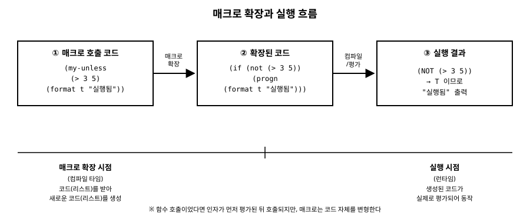

# 11장. 매크로 기초

[◀ 이전: 10장. 클로저와 렉시컬 스코프](ch10-클로저와렉시컬스코프.md) | [📖 목차](00-목차.md) | [다음: 12장. 구조체와 CLOS 객체 시스템 기초 ▶](ch12-구조체와CLOS.md)

---

지금까지 우리는 함수를 정의하고, 조건문을 쓰고, 재귀와 고차 함수로 리스트를 다뤄봤습니다. 이번 장에서는 Lisp을 다른 언어와 근본적으로 구분 짓는 기능인 **매크로**를 소개합니다. 매크로는 "새로운 문법을 직접 만들 수 있는 도구"라고 흔히 소개되는데, 그 말이 정확히 무슨 뜻인지 차근차근 살펴보겠습니다.

## 함수와 매크로, 무엇이 다른가

먼저 아주 단순한 질문에서 시작해봅시다. `unless`라는, `if`의 반대 동작을 하는 구문을 직접 만들고 싶다고 해봅시다. "조건이 거짓일 때만 본문을 실행하라"는 뜻입니다. 함수로 먼저 시도해보겠습니다.

```lisp
(defun my-unless-broken (condition result)
  (if (not condition) result))
```

이 함수를 다음처럼 호출해보면 문제가 드러납니다.

```lisp
* (my-unless-broken nil (progn (format t "실행됨~%") 42))
실행됨
42
```

조건이 `nil`이니 `result`가 반환되는 건 당연합니다. 하지만 조건이 `nil`이 아닌 경우를 봅시다.

```lisp
* (my-unless-broken t (progn (format t "실행됨~%") 42))
실행됨
NIL
```

조건이 참이라 `result`는 쓰이지 않아야 하는데도 `"실행됨"`이 출력되어 버립니다. 이유는 간단합니다. **함수를 호출할 때는 인자로 넘긴 표현식들이 먼저 전부 평가된 다음에야 함수 본문이 실행**되기 때문입니다. `(progn (format t "실행됨~%") 42)`라는 표현식은 `my-unless-broken`이 실행되기도 전에 이미 평가되어 버립니다. 함수 안에서 조건에 따라 인자를 "평가하지 않기"로 결정하는 것은 불가능합니다. 인자는 이미 평가되어 값으로 넘어온 뒤이기 때문입니다.

`if`가 함수가 아니라 특별한 형식(special form)인 이유가 바로 여기에 있습니다. `if`는 조건에 따라 두 번째 절과 세 번째 절 중 하나만 평가해야 하는데, 함수로는 이 동작을 흉내 낼 수 없습니다. 그런데 우리는 `if`처럼 동작하는 나만의 구문을 만들고 싶습니다. 이럴 때 쓰는 것이 **매크로**입니다.

매크로와 함수의 근본적인 차이는 다음과 같습니다.

| | 함수 | 매크로 |
|---|---|---|
| 인자로 받는 것 | 평가된 값 | 평가되지 않은 코드(폼) |
| 하는 일 | 값을 계산해서 반환 | 코드를 조립해서 새로운 코드를 반환 |
| 결과 | 반환값이 곧 결과 | 반환된 코드가 그 자리에서 다시 평가됨 |
| 동작 시점 | 호출될 때(런타임) | 호출 코드가 컴파일/평가되기 전(매크로 확장 시점) |

즉 함수는 "값을 받아서 값을 돌려주는 것"이고, 매크로는 "코드를 받아서 코드를 돌려주는 것"입니다. 매크로가 돌려준 코드는 원래 매크로 호출이 있던 자리에 그대로 끼워 넣어진 뒤, 비로소 평가됩니다. 이 두 단계 — ① 코드를 코드로 변환하는 단계(매크로 확장)와 ② 변환된 코드를 실제로 실행하는 단계(평가) — 를 구분하는 것이 매크로를 이해하는 핵심입니다.

## 코드가 곧 데이터라는 사실이 매크로를 가능케 한다

1장에서 Lisp의 소스 코드는 그 자체로 리스트라는 이야기를 했습니다. `(+ 1 2 3)`이라는 코드는 곧 `+`, `1`, `2`, `3`이라는 네 원소를 가진 리스트입니다. 우리가 이미 7장과 8장에서 배운 `car`, `cdr`, `cons`, `mapcar` 같은 도구는 모두 리스트를 다루는 도구였습니다. 그런데 코드 자체가 리스트라면, **그 도구들로 코드도 다룰 수 있다는 뜻**이 됩니다.

매크로는 정확히 이 원리를 이용합니다. 매크로는 "코드(리스트)를 입력으로 받아서, 리스트를 조작하는 일반적인 Lisp 함수처럼 동작한 뒤, 새로운 코드(리스트)를 결과로 내놓는 함수"입니다. 다만 그 결과가 값으로 쓰이는 게 아니라 다시 코드로 취급되어 그 자리에서 평가된다는 점이 다를 뿐입니다.

```lisp
* (car '(if (not (> 3 5)) (progn 42)))
IF
```

`if`로 시작하는 코드도 그냥 리스트이므로 `car`로 첫 원소를 꺼낼 수 있습니다. 매크로는 이런 식으로 전달받은 코드 조각들을 리스트 조작 함수로 자르고 붙여서 최종적으로 하나의 새로운 코드를 만들어냅니다.

## defmacro의 기본 문법

매크로는 `defmacro`로 정의합니다. 형태는 `defun`과 거의 같습니다.

```lisp
(defmacro 매크로이름 (매개변수...)
  본문)
```

차이는 딱 하나입니다. 매개변수 자리로 들어오는 것은 **평가되지 않은 코드 그 자체**이고, 본문이 최종적으로 반환하는 값은 **평가할 코드**로 취급된다는 점입니다. 이제 앞서 실패했던 `unless`를 매크로로 다시 만들어봅시다.

```lisp
(defmacro my-unless (condition &body body)
  (list 'if (list 'not condition) (cons 'progn body)))
```

`&body`는 `&rest`와 기능적으로는 동일하게 나머지 인자를 모두 리스트로 모아주지만, "이 부분은 실행할 본문(body)이다"라는 의도를 편집기와 독자에게 알려주는 관례적인 표기입니다. 위 매크로를 호출해봅시다.

```lisp
* (my-unless nil (format t "실행됨~%") 42)
실행됨
42
```

이번엔 원하는 대로 동작합니다. `condition`과 `body`는 함수 인자처럼 미리 평가되지 않고, 코드 조각 그대로 `my-unless` 본문에 전달됩니다. 본문은 이 조각들을 `list`와 `cons`로 조립해서 `(if (not nil) (progn (format t "실행됨~%") 42))`라는 새 코드를 만들어 돌려주고, 그 코드가 매크로 호출 자리에서 실제로 평가되는 것입니다.

## 백틱과 언쿼트로 템플릿처럼 쓰기

방금 본 것처럼 `list`와 `cons`를 조합해서 코드를 조립하는 방식은 동작은 하지만 읽기가 번거롭습니다. 완성될 코드의 모양이 한눈에 들어오지 않기 때문입니다. Lisp은 이 문제를 위해 **백틱(`` ` ``)**과 **언쿼트(`,`, `,@`)** 라는 편리한 표기법을 제공합니다.

백틱은 `quote`(작은따옴표 `'`)와 비슷하게 뒤따르는 표현식을 평가하지 않고 그대로 데이터로 취급합니다. 다른 점은, 백틱으로 감싼 식 안에서 `,`(콤마)를 붙인 부분만은 예외적으로 평가해서 그 값을 끼워 넣는다는 것입니다. 즉 백틱은 "빈칸이 있는 템플릿"이고, 콤마는 "이 빈칸에는 계산한 값을 넣어라"는 표시입니다.

```lisp
* `(a b c)
(A B C)

* (let ((x 10))
    `(a ,x c))
(A 10 C)

* (let ((x 10) (y 20))
    `(a ,x ,y c))
(A 10 20 C)
```

리스트 하나를 통째로 풀어서 끼워 넣고 싶을 때는 `,@`(콤마-엣, splice)를 씁니다.

```lisp
* (let ((nums '(1 2 3)))
    `(a ,nums c))
(A (1 2 3) C)

* (let ((nums '(1 2 3)))
    `(a ,@nums c))
(A 1 2 3 C)
```

`,nums`는 리스트 `(1 2 3)` 자체를 하나의 원소로 끼워 넣지만, `,@nums`는 그 리스트의 원소들을 풀어서 나열합니다. 매크로에서 `&body`로 받은 여러 개의 폼을 이어 붙일 때 이 `,@`가 특히 자주 쓰입니다.

이제 백틱과 언쿼트로 `my-unless`를 다시 써보면 완성될 코드의 모양이 훨씬 명확하게 보입니다.

```lisp
(defmacro my-unless (condition &body body)
  `(if (not ,condition)
       (progn ,@body)))
```

`condition` 자리에는 `,`를 붙여 매크로 호출 시 넘어온 조건식 하나를 끼워 넣고, `body` 자리에는 `,@`를 붙여 여러 개의 본문 폼을 그대로 풀어서 나열합니다. 앞서 `list`와 `cons`로 조립했던 것과 결과는 완전히 같지만, 코드만 보고도 "`if`와 `not`, `progn`으로 이루어진 코드를 만드는구나"라는 것을 바로 알 수 있습니다.

## macroexpand로 확장 결과 들여다보기

매크로가 실제로 어떤 코드로 확장되는지 눈으로 확인하고 싶을 때는 `macroexpand-1`을 씁니다. 매크로 호출을 `quote`로 감싸서 넘기면, 평가하지 않고 그 확장 결과만 보여줍니다.

```lisp
* (macroexpand-1 '(my-unless (> 3 5) (format t "실행됨~%")))
(IF (NOT (> 3 5)) (PROGN (FORMAT T "실행됨~%")))
T
```

두 번째 반환값 `T`는 "실제로 매크로 확장이 한 번 일어났다"는 표시입니다. 만약 확장 결과 안에 또 다른 매크로 호출이 남아 있어서 여러 단계를 거쳐 완전히 풀어헤친 형태를 보고 싶다면 `macroexpand`를 씁니다. 매크로를 만들고 나서 이렇게 확장 결과를 확인해보는 습관을 들이면, 매크로가 정확히 의도한 코드를 만들어내는지, 혹시 괄호 위치가 어긋나지는 않았는지 바로 검증할 수 있습니다.

조건문을 하나 더 만들어보겠습니다. 이번엔 `if-let`처럼 값을 검사하면서 동시에 지역 변수로도 묶어주는 매크로입니다.

```lisp
(defmacro my-if-let (binding then &optional else)
  (let ((var (first binding))
        (value-form (second binding)))
    `(let ((,var ,value-form))
       (if ,var ,then ,else))))
```

```lisp
* (macroexpand-1 '(my-if-let (result (find-if #'evenp '(1 3 4 5)))
                     (format t "짝수를 찾음: ~a~%" result)
                     (format t "짝수 없음~%")))
(LET ((RESULT (FIND-IF #'EVENP '(1 3 4 5))))
  (IF RESULT
      (FORMAT T "짝수를 찾음: ~a~%" RESULT)
      (FORMAT T "짝수 없음~%")))

* (my-if-let (result (find-if #'evenp '(1 3 4 5)))
    (format t "짝수를 찾음: ~a~%" result)
    (format t "짝수 없음~%"))
짝수를 찾음: 4
NIL
```

`find-if`를 두 번 호출하지 않고도, 조건 검사와 결과 바인딩을 한 번에 표현할 수 있는 나만의 조건문을 만든 셈입니다. 이처럼 매크로는 반복적으로 등장하는 패턴을 하나의 짧은 구문으로 압축해주는 도구입니다.

아래 그림은 매크로 호출이 실제로 실행되기까지의 흐름을 정리한 것입니다. 매크로 확장은 컴파일(또는 평가) 이전에 일어나는 별도의 단계이고, 그 결과로 나온 새로운 코드만이 실제로 평가되어 동작한다는 점을 다시 한번 확인해두세요.



## 매크로는 최후의 수단이다

매크로는 강력하지만 그만큼 신중하게 써야 합니다. 이유는 여러 가지입니다.

첫째, 매크로는 **디버깅하기 어렵습니다**. 함수는 호출 스택을 그대로 추적할 수 있지만, 매크로는 컴파일 시점에 이미 다른 코드로 사라지기 때문에 실행 중에 "매크로가 호출되었다"는 흔적 자체가 남지 않습니다.

둘째, 매크로는 **평가 순서와 횟수를 깨뜨리기 쉽습니다**. 이번 장의 `my-unless`처럼 언쿼트한 매개변수가 확장된 코드 안에서 여러 번 등장하면, 원래는 한 번만 평가되어야 할 표현식이 여러 번 평가될 수 있습니다. 예를 들어 `condition` 자리에 부작용이 있는 표현식을 넣었는데 매크로 본문에서 `,condition`을 두 번 썼다면, 그 부작용도 두 번 일어납니다.

셋째, 매크로는 **이름 충돌(변수 포획) 문제**를 일으킬 수 있습니다. 매크로 본문에서 임시로 만든 지역 변수 이름이 우연히 매크로를 호출하는 쪽 코드의 변수 이름과 겹치면 예상치 못한 동작이 일어납니다. 이 문제를 안전하게 다루는 정식 기법(`gensym`을 이용한 매크로 위생 처리)은 이 책의 범위를 넘어서지만, 매크로를 작성할 때 항상 염두에 둬야 할 위험이라는 것만 기억해두세요.

그래서 원칙은 이렇습니다. **함수로 해결되는 문제는 함수로 해결하십시오.** 매크로가 필요한 경우는 딱 두 가지, ① 인자를 평가할지 말지를 제어해야 하거나(`if`, `and`, `or`, `when`, `unless`처럼), ② 코드의 형태 자체를 바꿔야 할 때(반복문이나 새로운 정의 구문을 만들 때, 17장에서 다룰 반복 매크로가 그 예입니다)뿐입니다. 단순히 "코드 중복을 줄이고 싶다"는 목적이라면 대부분 함수나 9장에서 배운 고차 함수만으로 충분합니다. 매크로는 옵션 목록에서 가장 나중에 꺼내야 할 도구입니다.

## 요약

- 함수는 인자를 먼저 평가한 뒤 호출되지만, 매크로는 평가되지 않은 코드를 받아 새로운 코드로 변환한 뒤, 그 변환된 코드가 원래 자리에서 평가됩니다.
- Lisp 코드가 곧 리스트라는 성질(1장) 덕분에 매크로는 리스트를 다루는 평범한 함수처럼 코드를 조립할 수 있습니다.
- `defmacro`는 `defun`과 문법이 비슷하지만, 매개변수로 코드를, 결과로 코드를 다룹니다.
- 백틱(`` ` ``)은 코드 템플릿을 만들고, `,`는 값 하나를 끼워 넣고, `,@`는 리스트를 풀어서 끼워 넣습니다.
- `macroexpand-1`과 `macroexpand`로 매크로가 실제로 어떤 코드로 확장되는지 확인할 수 있습니다.
- 매크로는 디버깅 어려움, 중복 평가, 변수 포획 같은 위험이 있으므로, 함수로 해결 가능하면 항상 함수를 우선 선택해야 합니다.

## 연습문제

1. `(my-when condition &body body)` 매크로를 `defmacro`와 백틱을 사용해 정의하고, `macroexpand-1`로 확장 결과가 `(if condition (progn ...))` 형태인지 확인하세요.
2. `my-unless`에 조건식으로 `(progn (format t "체크~%") t)`처럼 부작용이 있는 표현식을 넘겨 실행해보고, `,condition`이 매크로 본문에서 한 번만 쓰였는지 확인해서 부작용이 몇 번 일어나는지 관찰하세요.
3. 두 개의 폼 중 값이 `nil`이 아닌 첫 번째 것을 돌려주는 `my-or2` 매크로를 만들어보세요. 단, 첫 번째 폼이 `nil`이 아니면 두 번째 폼은 절대 평가되지 않아야 합니다. (힌트: `let`으로 임시 변수에 첫 번째 값을 담아두고 검사하세요.)
4. `(my-dotimes (i 5) (format t "~a " i))`처럼 동작하는 매크로를 만들어보세요. 내부적으로는 8장에서 배운 재귀나 `loop` 대신, 이미 있는 `dotimes`를 그대로 확장 결과로 사용해도 좋습니다. 확장 결과를 `macroexpand-1`로 확인하세요.
5. 이번 장에서 만든 매크로 중 하나를 함수로 다시 작성해보려고 시도해보세요. 어느 지점에서 함수로는 구현이 불가능한지 직접 부딪혀보고, 왜 그 지점에 매크로가 필요한지 스스로 설명해보세요.

---

[◀ 이전: 10장. 클로저와 렉시컬 스코프](ch10-클로저와렉시컬스코프.md) | [📖 목차](00-목차.md) | [다음: 12장. 구조체와 CLOS 객체 시스템 기초 ▶](ch12-구조체와CLOS.md)
