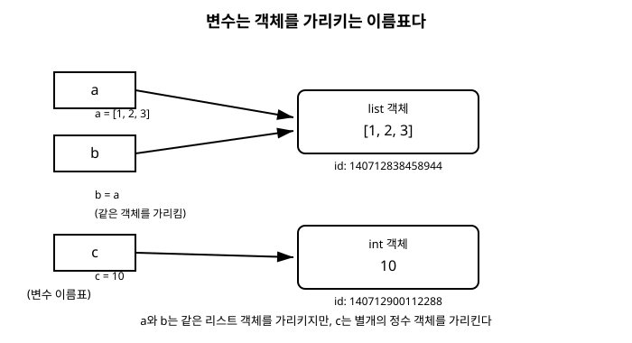

# 3장. 변수와 자료형

[◀ 이전: 2장. 첫 프로그램과 실행 방법](ch02-첫프로그램과실행.md) | [📖 목차](00-목차.md) | [다음: 4장. 연산자와 표현식 ▶](ch04-연산자와표현식.md)

---

프로그램은 결국 데이터를 다루는 일이다. 데이터를 어딘가에 담아두고, 필요할 때 꺼내 쓰고, 다른 값으로 바꾸는 과정이 프로그램의 실체다. 이번 장에서는 Python이 데이터를 어떻게 담고 다루는지 그 밑바탕이 되는 두 가지 개념, 변수와 자료형을 살펴본다.

## 변수는 상자가 아니라 이름표다

다른 언어를 먼저 배운 사람이라면 "변수는 값을 담는 상자"라는 비유에 익숙할 것이다. C나 Java에서는 이 비유가 어느 정도 들어맞는다. 변수를 선언하는 순간 메모리에 고정된 크기의 상자가 만들어지고, 그 상자 안에 값이 채워지기 때문이다.

Python은 다르게 동작한다. Python에서 변수는 상자가 아니라 객체에 붙이는 이름표에 가깝다. 값(객체)이 메모리 어딘가에 먼저 만들어지고, 변수는 그 객체를 가리키는 참조일 뿐이다. 이 차이를 이해하고 넘어가면 뒤에서 나올 가변(mutable)과 불변(immutable), 함수 인자 전달 방식(9장. 함수에서 다룬다) 같은 주제를 훨씬 쉽게 받아들일 수 있다.

```python
>>> message = "안녕하세요"
>>> message
'안녕하세요'
```

위 코드에서 일어나는 일을 순서대로 풀어보면 이렇다.

1. `"안녕하세요"`라는 문자열 객체가 메모리에 만들어진다.
2. `message`라는 이름이 그 객체를 가리키도록 연결된다.

즉 `message = "안녕하세요"`라는 문장은 "message라는 상자에 문자열을 넣어라"가 아니라 "message라는 이름표를 저 문자열 객체에 붙여라"로 읽어야 한다. 이 관점에서 보면 대입 연산자 `=`는 "같다"는 뜻이 아니라 "이 이름이 저 객체를 가리키게 하라"는 명령이다.

같은 객체에 여러 이름을 붙일 수도 있다.

```python
>>> a = [1, 2, 3]
>>> b = a
>>> b.append(4)
>>> a
[1, 2, 3, 4]
```

`b = a`는 리스트를 복사하는 것이 아니라 `a`가 가리키는 것과 똑같은 리스트 객체에 `b`라는 이름표를 하나 더 붙이는 것이다. 그래서 `b`를 통해 리스트를 변경하면 `a`로 봐도 변경 사항이 그대로 보인다. 리스트가 가변 객체이기 때문에 벌어지는 일인데, 자세한 내용은 6장. 리스트와 튜플에서 다시 다룬다.

### id()와 type()으로 변수 들여다보기

방금 설명한 "변수는 객체를 가리키는 이름표"라는 개념을 눈으로 확인해보자. Python은 객체를 들여다볼 수 있는 두 가지 내장 함수를 제공한다.

- `id(객체)`: 객체가 메모리에서 차지하는 위치를 나타내는 고유한 식별 값을 반환한다. 이 값이 같다면 두 이름이 같은 객체를 가리킨다는 뜻이다.
- `type(객체)`: 객체의 자료형을 반환한다.

```python
>>> a = [1, 2, 3]
>>> b = a
>>> id(a)
140712838458944
>>> id(b)
140712838458944
>>> id(a) == id(b)
True
>>> type(a)
<class 'list'>
```

`a`와 `b`의 `id()` 값이 동일하다. 두 이름표가 같은 리스트 객체를 가리키고 있다는 증거다. 반면 다음처럼 새로운 값을 대입하면 이름표가 다른 객체로 옮겨 붙는다.

```python
>>> a = [1, 2, 3]
>>> old_id = id(a)
>>> a = [1, 2, 3]
>>> id(a) == old_id
False
```

값은 똑같이 `[1, 2, 3]`이지만, 두 번째 대입에서는 완전히 새로운 리스트 객체가 만들어졌고 `a`는 그 새 객체를 가리키게 되었다. 이처럼 `id()`는 "값이 같은가"가 아니라 "같은 객체인가"를 확인하는 도구다. 값이 같은지를 비교할 때는 `==` 연산자를 쓰고, 객체가 동일한지를 비교할 때는 `is` 연산자를 쓴다는 점은 4장. 연산자와 표현식에서 다시 정리한다.

정수처럼 자주 쓰이는 작은 값은 Python이 내부적으로 캐싱해서 재사용하기도 한다.

```python
>>> x = 10
>>> y = 10
>>> id(x) == id(y)
True
>>> x = 1000
>>> y = 1000
>>> id(x) == id(y)
False
```

`-5`부터 `256`까지의 작은 정수는 Python이 미리 만들어두고 공유하기 때문에 `x`와 `y`가 같은 객체를 가리키지만, 범위를 벗어난 큰 정수는 매번 새로운 객체가 만들어질 수 있다. 이는 CPython(가장 널리 쓰이는 Python 구현체)의 최적화 방식이므로, 실제 코드에서 이 동작에 의존해서는 안 된다. 정수를 비교할 때는 항상 `==`를 사용하자.

아래 그림은 지금까지 설명한 "변수는 객체를 가리키는 참조"라는 개념을 도식화한 것이다.



그림에서 보듯 `a`와 `b`는 모두 하나의 리스트 객체 `[1, 2, 3]`을 가리키고, `c`는 별도로 만들어진 정수 객체 `10`을 가리킨다. 변수 이름은 객체 안에 존재하는 것이 아니라, 객체를 가리키는 화살표라는 점을 기억해두자.

## 동적 타이핑: 타입은 변수가 아니라 값이 가진다

C나 Java 같은 언어에서는 변수를 선언할 때 타입을 명시한다. `int count = 0;`이라고 쓰면 `count`는 영원히 정수만 담을 수 있는 상자가 된다. 이런 방식을 정적 타이핑(static typing)이라 부른다.

Python은 동적 타이핑(dynamic typing) 언어다. 변수를 선언할 때 타입을 지정하지 않으며, 같은 변수 이름이 상황에 따라 서로 다른 자료형의 객체를 가리킬 수 있다.

```python
>>> value = 42
>>> type(value)
<class 'int'>
>>> value = "마흔둘"
>>> type(value)
<class 'str'>
>>> value = 42.0
>>> type(value)
<class 'float'>
```

같은 이름 `value`가 정수, 문자열, 실수 객체를 차례로 가리켰다. 여기서 다시 한번 강조할 점은 "`value`의 타입이 바뀌었다"가 아니라 "`value`라는 이름표가 다른 타입의 객체로 옮겨 붙었다"는 것이다. 타입은 변수의 속성이 아니라 객체의 속성이다.

이 유연함은 코드를 짧고 빠르게 작성할 수 있게 해주지만, 동시에 실수를 저지르기도 쉽게 만든다. 변수 하나에 여러 타입의 값을 섞어 쓰다 보면 나중에 어떤 타입이 들어있는지 헷갈릴 수 있으므로, 특별한 이유가 없다면 한 변수에는 일관된 타입의 값만 담는 습관을 들이는 편이 좋다.

## 기본 자료형 다섯 가지

Python이 기본으로 제공하는 자료형은 다양하지만, 이번 장에서는 가장 기초가 되는 다섯 가지, `int`, `float`, `str`, `bool`, `None`을 살펴본다. 문자열은 5장. 문자열 다루기에서, 리스트·튜플·딕셔너리·셋 같은 컬렉션 자료형은 6장과 7장에서 별도로 다룬다.

### int: 정수

`int`는 소수점이 없는 정수를 표현한다. Python의 정수는 다른 언어와 달리 크기 제한이 사실상 없어서(사용 가능한 메모리가 허용하는 한) 아주 큰 수도 그대로 다룰 수 있다.

```python
>>> year = 2026
>>> type(year)
<class 'int'>
>>> huge_number = 2 ** 100
>>> huge_number
1267650600228229401496703205376
>>> type(huge_number)
<class 'int'>
```

`2 ** 100`처럼 100자리에 가까운 수를 계산해도 오버플로 걱정 없이 정확한 값을 얻는다. 진법을 달리 표현하고 싶을 때는 접두어를 사용한다.

```python
>>> binary_value = 0b1010
>>> octal_value = 0o17
>>> hex_value = 0xFF
>>> binary_value, octal_value, hex_value
(10, 15, 255)
```

`0b`는 2진수, `0o`는 8진수, `0x`는 16진수를 나타낸다. 화면에는 항상 10진수로 출력된다는 점을 눈여겨보자. 자릿수가 많은 정수는 밑줄(`_`)로 구분해서 가독성을 높일 수도 있다.

```python
>>> population = 51_780_000
>>> population
51780000
```

밑줄은 단순히 사람이 읽기 좋으라고 넣는 표시일 뿐, 값 자체에는 아무 영향을 주지 않는다.

### float: 실수

`float`는 소수점이 있는 실수를 표현한다.

```python
>>> pi = 3.14159
>>> type(pi)
<class 'float'>
>>> temperature = -12.5
>>> scientific = 1.5e3
>>> scientific
1500.0
```

`1.5e3`처럼 지수 표기법(`e`나 `E` 뒤에 지수를 붙이는 방식)도 사용할 수 있다. `1.5e3`은 1.5 곱하기 10의 3제곱, 즉 1500.0이라는 뜻이다.

실수를 다룰 때 반드시 기억해야 할 함정이 하나 있다. 컴퓨터는 실수를 2진법으로 저장하는데, 0.1처럼 흔한 소수조차 2진법으로는 정확히 표현되지 않는다.

```python
>>> 0.1 + 0.2
0.30000000000000004
>>> 0.1 + 0.2 == 0.3
False
```

당황스러운 결과지만 Python만의 버그가 아니라 부동소수점을 사용하는 거의 모든 언어에서 나타나는 현상이다. 실수를 비교할 때는 `==`로 정확히 같은지 따지지 말고, 차이가 아주 작은 허용 범위 안에 있는지를 확인하는 방식을 사용한다.

```python
>>> abs((0.1 + 0.2) - 0.3) < 1e-9
True
```

금액 계산처럼 오차가 허용되지 않는 상황에서는 표준 라이브러리의 `decimal` 모듈을 사용하는 것이 안전하다. 이 내용은 17장. 표준 라이브러리와 패키지 관리에서 다시 다룬다.

### str: 문자열

`str`은 문자들의 나열, 즉 텍스트를 표현한다. 작은따옴표(`'`)와 큰따옴표(`"`) 중 어느 쪽을 써도 되고, 결과는 동일하다.

```python
>>> name = "이몽룡"
>>> greeting = '안녕하세요'
>>> type(name)
<class 'str'>
```

문자열을 자르고 합치고 검색하는 방법은 다룰 내용이 많으므로 5장. 문자열 다루기에서 전용으로 다룬다. 여기서는 문자열도 하나의 자료형이라는 점만 기억해두자.

### bool: 참과 거짓

`bool`은 참(`True`)과 거짓(`False`) 두 값만 가지는 자료형으로, 조건 판단에 사용된다. 흥미롭게도 Python에서 `bool`은 `int`의 하위 자료형이다. `True`는 정수 1처럼, `False`는 정수 0처럼 동작한다.

```python
>>> is_valid = True
>>> type(is_valid)
<class 'bool'>
>>> True + True
2
>>> isinstance(True, int)
True
```

`True + True`가 `2`를 반환하는 이유가 바로 이것이다. 실무에서 이 성질을 직접 활용하는 일은 드물지만, `bool` 값을 숫자 계산에 섞어 썼을 때 왜 그런 결과가 나오는지 이해하는 데 도움이 된다.

Python은 값 자체가 `bool`이 아니어도 조건문에서 참/거짓으로 취급하는 규칙을 가지고 있다. 이를 불리언 값으로 변환한다는 뜻에서 "진리값 검사(truthy/falsy)"라고 부른다. 숫자 `0`, 빈 문자열 `""`, 빈 리스트 `[]`, `None`은 거짓으로 취급되고, 그 외 대부분의 값은 참으로 취급된다.

```python
>>> bool(0)
False
>>> bool("")
False
>>> bool("0")
True
>>> bool([])
False
>>> bool([0])
True
```

`bool("0")`이 `True`라는 점을 주의하자. 문자열 `"0"`은 내용이 있는(길이가 0이 아닌) 문자열이므로 참으로 취급된다. 빈 값인지 아닌지가 기준이지, 숫자로서의 값이 0인지는 무관하다.

### None: 값이 없음을 나타내는 값

`None`은 "값이 없다" 혹은 "아직 정해지지 않았다"는 상태를 표현하는 특수한 값이다. 다른 언어의 `null`이나 `nil`에 해당한다.

```python
>>> result = None
>>> type(result)
<class 'NoneType'>
>>> print(result)
None
```

`None`은 `NoneType`이라는 자신만의 자료형을 가지며, 이 세상에 `None` 객체는 단 하나만 존재한다. 그래서 어떤 값이 `None`인지 확인할 때는 `==`가 아니라 `is`를 사용하는 것이 관례다.

```python
>>> result is None
True
```

값을 아직 정하지 못한 변수의 초깃값으로 `None`을 사용하는 경우가 많다. 예를 들어 함수가 특별한 결과를 찾지 못했을 때 `None`을 반환하도록 설계하기도 한다. `is`와 `==`의 정확한 차이는 4장. 연산자와 표현식에서 신원 연산자를 다룰 때 자세히 설명한다.

## 형변환: 자료형을 서로 바꾸기

서로 다른 자료형의 값을 함께 다루려면 형변환(type conversion)이 필요할 때가 많다. Python은 자료형의 이름과 똑같은 이름의 내장 함수로 형변환을 제공한다.

### 문자열을 숫자로

사용자 입력이나 파일에서 읽어온 값은 대부분 문자열이다. 이를 계산에 사용하려면 숫자로 바꿔야 한다.

```python
>>> age_text = "17"
>>> age = int(age_text)
>>> age + 3
20
>>> price_text = "1990.5"
>>> price = float(price_text)
>>> price
1990.5
```

숫자로 바꿀 수 없는 문자열을 변환하려 하면 예외가 발생한다.

```python
>>> int("스물")
Traceback (most recent call last):
  File "<stdin>", line 1, in <module>
ValueError: invalid literal for int() with base 10: '스물'
```

`ValueError`는 값의 형식이 올바르지 않을 때 Python이 발생시키는 예외다. 예외를 안전하게 처리하는 방법은 11장. 예외 처리에서 자세히 배운다. `int()`는 소수점이 포함된 문자열도 바로 변환하지 못한다.

```python
>>> int("3.14")
Traceback (most recent call last):
  File "<stdin>", line 1, in <module>
ValueError: invalid literal for int() with base 10: '3.14'
>>> int(float("3.14"))
3
```

`"3.14"`처럼 소수점이 있는 문자열을 정수로 바꾸고 싶다면, 먼저 `float()`로 실수로 바꾼 다음 `int()`로 변환해야 한다. 이때 소수점 아래 자리는 반올림이 아니라 버려진다는 점에 주의하자.

### 숫자를 문자열로

반대로 숫자를 문자열과 이어붙이거나 화면에 표시하려면 문자열로 바꿔야 한다.

```python
>>> score = 95
>>> "점수: " + str(score) + "점"
'점수: 95점'
```

참고로 `print()` 함수는 여러 값을 콤마로 나열해서 넘기면 내부적으로 알아서 문자열로 변환해 출력해주므로, 화면 출력만이 목적이라면 `str()`을 직접 쓰지 않아도 되는 경우가 많다.

```python
>>> print("점수:", score, "점")
점수: 95 점
```

### 정수와 실수 사이의 변환

```python
>>> int(3.9)
3
>>> int(-3.9)
-3
>>> float(7)
7.0
```

`int()`로 실수를 정수로 바꿀 때는 반올림이 아니라 소수점 이하를 그냥 잘라낸다(0 방향으로 버림). `3.9`는 `4`가 아니라 `3`이 되고, `-3.9`는 `-4`가 아니라 `-3`이 된다. 반올림이 필요하다면 내장 함수 `round()`를 사용한다.

```python
>>> round(3.9)
4
>>> round(3.456, 2)
3.46
```

`round()`의 두 번째 인자는 반올림할 소수 자릿수를 지정한다.

### bool로의 변환, bool에서의 변환

앞서 살펴본 진리값 검사도 결국 `bool()` 함수를 통한 형변환이다.

```python
>>> bool(1)
True
>>> bool(0)
False
>>> int(True)
1
>>> int(False)
0
>>> str(True)
'True'
```

## 변수 이름 규칙과 관례

Python에서 변수 이름을 지을 때는 문법적으로 지켜야 하는 규칙과, 강제되지는 않지만 관례로 따르는 규칙이 있다.

### 반드시 지켜야 하는 규칙

- 문자(한글 포함), 숫자, 밑줄(`_`)만 사용할 수 있다. 단, 숫자로 시작할 수는 없다.
- 대소문자를 구분한다. `score`와 `Score`는 서로 다른 변수다.
- `if`, `for`, `class`, `import`처럼 Python 문법에서 이미 의미를 가지는 키워드는 변수 이름으로 쓸 수 없다.

```python
>>> 1st_place = "금메달"
  File "<stdin>", line 1
    1st_place = "금메달"
    ^
SyntaxError: invalid decimal literal
```

숫자로 시작하는 이름은 문법 오류를 일으킨다. 키워드 목록은 `keyword` 모듈로 확인할 수 있다.

```python
>>> import keyword
>>> keyword.iskeyword("class")
True
>>> keyword.iskeyword("total")
False
```

한글 변수 이름도 문법적으로는 허용된다.

```python
>>> 이름 = "홍길동"
>>> 이름
'홍길동'
```

다만 협업이나 공개 코드에서는 대부분 영문 이름을 사용하는 것이 관례이므로, 이 책의 예제도 이후로는 영문 이름을 기본으로 사용한다.

### 관례적으로 따르는 규칙 (PEP 8)

Python 커뮤니티는 PEP 8이라는 코드 스타일 가이드를 널리 따른다. 변수와 함수 이름에는 소문자와 밑줄로 단어를 구분하는 snake_case를, 클래스 이름에는 각 단어의 첫 글자를 대문자로 쓰는 PascalCase를 사용한다.

```python
>>> user_name = "kim"        # 변수: snake_case
>>> max_retry_count = 3      # 변수: snake_case
>>> class UserProfile:       # 클래스: PascalCase
...     pass
```

클래스를 정의하는 방법은 12장. 클래스와 객체지향 기초에서 다룬다. 그 밖에 참고할 만한 관례는 다음과 같다.

- 변수 이름은 그 의미를 짐작할 수 있도록 구체적으로 짓는다. `x`, `data` 같은 이름보다 `user_age`, `order_list`처럼 역할이 드러나는 이름이 좋다.
- 모듈 전체에서 바뀌지 않는 상수는 전부 대문자와 밑줄로 표기하는 관례가 있다. 예를 들어 `MAX_CONNECTIONS = 100`처럼 쓴다. Python 문법상 강제되는 규칙은 아니고, "이 값은 바꾸지 말아 달라"는 개발자 사이의 약속에 가깝다.
- 밑줄로 시작하는 이름(`_internal_value`)은 모듈이나 클래스 내부에서만 사용하려는 의도를 나타내는 관례다. 자세한 내용은 13장. 객체지향 심화에서 다룬다.

좋은 이름 짓기와 코드 스타일에 대한 전반적인 조언은 18장. 좋은 Python 코드 작성 습관에서 종합적으로 정리한다.

## 요약

- Python의 변수는 값을 담는 상자가 아니라, 메모리에 존재하는 객체를 가리키는 이름표다. `id()`로 두 변수가 같은 객체를 가리키는지 확인할 수 있다.
- Python은 동적 타이핑 언어로, 타입은 변수가 아니라 값(객체)이 가진다. 같은 변수 이름이 상황에 따라 다른 자료형의 객체를 가리킬 수 있다.
- 기본 자료형에는 정수 `int`, 실수 `float`, 문자열 `str`, 참/거짓을 나타내는 `bool`, 값 없음을 나타내는 `None`이 있다. `type()`으로 자료형을 확인할 수 있다.
- `int()`, `float()`, `str()`, `bool()` 같은 내장 함수로 자료형을 서로 변환할 수 있다. 변환할 수 없는 값을 변환하려 하면 `ValueError` 예외가 발생한다.
- 변수 이름은 문자·숫자·밑줄로 구성하고 숫자로 시작할 수 없으며, 키워드는 사용할 수 없다. 관례적으로 변수와 함수는 snake_case, 클래스는 PascalCase, 상수는 대문자로 작성한다.

## 연습문제

1. 다음 코드를 실행하면 어떤 결과가 나오는지 예상해보고, 실제로 실행하여 확인하라. 그리고 왜 그런 결과가 나오는지 `id()`를 이용해 설명하라.

   ```python
   a = [1, 2]
   b = a
   a = a + [3]
   print(b)
   ```

2. `input()` 함수로 사용자에게 두 개의 숫자를 문자열로 입력받아, 이를 정수로 변환한 뒤 두 수의 합과 곱을 출력하는 프로그램을 작성하라.

3. `0.1 + 0.2 == 0.3`이 `False`인 이유를 자신의 말로 설명하고, 이 문제를 우회해서 두 값이 "충분히 가깝다"는 것을 판별하는 코드를 작성하라.

4. 다음 중 변수 이름으로 사용할 수 없는 것을 모두 고르고, 그 이유를 설명하라. `_count`, `2nd_try`, `class`, `Total_Sum`, `my-variable`

5. 정수 `True`와 `False`가 각각 산술 연산에서 어떻게 동작하는지 보여주는 예제를 3개 이상 작성하라. 예를 들어 리스트 안에 있는 참 값의 개수를 `sum()`으로 세는 코드도 좋은 예다.

---

[◀ 이전: 2장. 첫 프로그램과 실행 방법](ch02-첫프로그램과실행.md) | [📖 목차](00-목차.md) | [다음: 4장. 연산자와 표현식 ▶](ch04-연산자와표현식.md)
