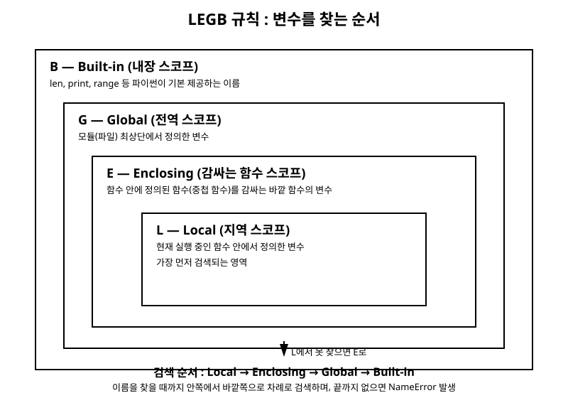

# 9장. 함수

[◀ 이전: 8장. 제어문](ch08-제어문.md) | [📖 목차](00-목차.md) | [다음: 10장. 컴프리헨션과 제너레이터 ▶](ch10-컴프리헨션과제너레이터.md)

---

프로그램이 커지다 보면 똑같거나 비슷한 코드를 여러 번 반복해서 작성하게 됩니다. 8장에서 살펴본 제어문만으로 프로그램을 구성하다 보면, 같은 계산을 여러 위치에서 복사해 붙여 넣는 일이 잦아지고, 그중 하나를 고칠 때 나머지를 빠뜨려 버그가 생기기도 합니다. 이런 문제를 해결하는 파이썬의 가장 기본적인 도구가 바로 함수입니다.

함수(function)는 특정 작업을 수행하는 코드 묶음에 이름을 붙여 놓은 것입니다. 한 번 정의해 두면 필요할 때마다 이름을 불러서 그 작업을 반복 실행할 수 있고, 입력값(매개변수)을 다르게 주어 매번 다른 결과를 얻을 수도 있습니다. 이번 장에서는 함수를 정의하고 호출하는 기본 문법부터, 다양한 방식으로 인자를 주고받는 방법, 변수가 유효한 범위를 결정하는 스코프 규칙, 그리고 짧은 함수를 간편하게 표현하는 람다까지 다룹니다.

## 함수의 기본 구조

함수는 `def` 키워드로 정의합니다. 다음은 두 수를 더한 결과를 알려주는 가장 단순한 함수입니다.

```python
def add(a, b):
    """두 수 a와 b를 더한 값을 반환한다."""
    result = a + b
    return result


print(add(3, 5))  # 8
print(add(10, -2))  # 8
```

`def` 뒤에 함수 이름, 괄호 안에 매개변수(parameter) 목록, 그리고 콜론(`:`)이 오고, 그다음 줄부터 들여쓰기된 본문이 함수의 실행 내용이 됩니다. 함수 이름 바로 다음 줄에 문자열을 적어 두면 이는 독스트링(docstring)이 되어, 이 함수가 무슨 일을 하는지 설명하는 문서 역할을 합니다.

`return` 문은 함수의 실행 결과를 호출한 곳으로 돌려주고 함수 실행을 즉시 종료합니다. `return`이 없거나 값 없이 `return`만 적으면 함수는 `None`을 반환합니다.

```python
def greet(name):
    print(f"{name}님, 안녕하세요!")
    # return 문이 없다


result = greet("지훈")
print(result)  # None
```

`greet` 함수는 화면에 인사말을 출력하기만 할 뿐 값을 돌려주지 않으므로, `result`에는 `None`이 저장됩니다. 함수가 어떤 값을 계산해서 이후 코드에서 활용해야 한다면 반드시 `return`으로 값을 반환해야 한다는 점을 기억해 두세요.

함수 안에서 `return`은 여러 번 등장할 수 있으며, 그중 먼저 실행되는 하나만 적용됩니다.

```python
def sign(number):
    """숫자의 부호를 문자열로 반환한다."""
    if number > 0:
        return "양수"
    elif number < 0:
        return "음수"
    return "0"


print(sign(7))  # 양수
print(sign(-3))  # 음수
print(sign(0))  # 0
```

## 매개변수와 인자

함수를 정의할 때 괄호 안에 적는 이름을 매개변수(parameter)라고 하고, 함수를 호출할 때 실제로 넘겨주는 값을 인자(argument)라고 부릅니다. 파이썬은 인자를 넘기는 다양한 방식을 지원합니다.

### 위치 인자와 키워드 인자

가장 기본적인 방법은 매개변수 순서에 맞추어 값을 나열하는 위치 인자(positional argument) 방식입니다.

```python
def describe_pet(kind, name):
    print(f"{name}은(는) {kind}입니다.")


describe_pet("강아지", "초코")  # 초코은(는) 강아지입니다.
```

`kind`에는 `"강아지"`가, `name`에는 `"초코"`가 순서대로 대입됩니다. 순서를 착각하면 의도와 다른 결과가 나올 수 있습니다. 이럴 때 매개변수 이름을 직접 지정해서 호출하는 키워드 인자(keyword argument) 방식을 쓰면 순서에 상관없이 값을 전달할 수 있고, 코드의 의미도 훨씬 분명해집니다.

```python
describe_pet(name="초코", kind="강아지")  # 초코은(는) 강아지입니다.
describe_pet(kind="고양이", name="나비")  # 나비은(는) 고양이입니다.
```

위치 인자와 키워드 인자는 함께 사용할 수 있지만, 위치 인자를 먼저 쓰고 그다음에 키워드 인자를 써야 합니다.

```python
describe_pet("고양이", name="나비")  # 정상 동작
# describe_pet(kind="고양이", "나비")  # SyntaxError: 위치 인자가 키워드 인자 뒤에 올 수 없음
```

### 기본값 인자

매개변수에 기본값을 지정해 두면, 호출할 때 해당 인자를 생략해도 지정된 기본값이 사용됩니다. 이를 기본값 인자(default argument)라고 합니다.

```python
def describe_pet(name, kind="강아지"):
    print(f"{name}은(는) {kind}입니다.")


describe_pet("초코")  # 초코은(는) 강아지입니다.
describe_pet("나비", "고양이")  # 나비은(는) 고양이입니다.
describe_pet("나비", kind="고양이")  # 나비은(는) 고양이입니다.
```

기본값이 있는 매개변수는 기본값이 없는 매개변수보다 반드시 뒤에 와야 합니다.

```python
# def describe_pet(kind="강아지", name):  # SyntaxError
#     ...
```

기본값 인자를 사용할 때 한 가지 주의할 점이 있습니다. 기본값으로 리스트나 딕셔너리 같은 가변(mutable) 객체를 사용하면 예상하지 못한 문제가 생길 수 있습니다.

```python
def add_item(item, items=[]):
    items.append(item)
    return items


print(add_item("사과"))  # ['사과']
print(add_item("바나나"))  # ['사과', '바나나']  <- 예상과 다름!
```

기본값으로 지정한 리스트는 함수가 정의되는 시점에 딱 한 번만 생성되고, 그 뒤로는 호출마다 재사용됩니다. 그래서 이전 호출에서 추가한 값이 다음 호출에도 그대로 남아 있게 됩니다. 이런 문제를 피하려면 기본값으로 `None`을 사용하고, 함수 본문에서 실제 리스트를 새로 만드는 방식을 씁니다.

```python
def add_item(item, items=None):
    if items is None:
        items = []
    items.append(item)
    return items


print(add_item("사과"))  # ['사과']
print(add_item("바나나"))  # ['바나나']
```

### 가변 인자: `*args`

함수를 호출할 때 넘길 인자의 개수가 정해져 있지 않은 경우가 있습니다. 예를 들어 숫자를 몇 개든 받아서 모두 더하는 함수를 만들고 싶다면, 매개변수 이름 앞에 별표(`*`) 하나를 붙인 가변 인자를 사용합니다.

```python
def total(*numbers):
    """전달받은 모든 숫자의 합을 반환한다."""
    print(type(numbers))  # <class 'tuple'>
    return sum(numbers)


print(total(1, 2, 3))  # 6
print(total(10, 20))  # 30
print(total())  # 0
```

`*numbers`로 받은 인자들은 함수 안에서 튜플로 묶입니다. 몇 개의 값을 넘기든 상관없이 하나의 매개변수로 처리할 수 있어 유연한 함수를 만들 수 있습니다.

### 키워드 가변 인자: `**kwargs`

키워드 인자 역시 개수를 정하지 않고 받을 수 있습니다. 매개변수 이름 앞에 별표 두 개(`**`)를 붙이면, 호출 시 전달된 키워드 인자들이 딕셔너리로 묶여 전달됩니다.

```python
def show_profile(**info):
    print(type(info))  # <class 'dict'>
    for key, value in info.items():
        print(f"{key}: {value}")


show_profile(name="유진", age=27, city="서울")
# name: 유진
# age: 27
# city: 서울
```

`*args`와 `**kwargs`는 함께 사용할 수도 있습니다. 이때 매개변수의 순서는 "일반 매개변수 → `*args` → 기본값을 가진 매개변수 → `**kwargs`" 순으로 정의하는 것이 일반적입니다.

```python
def make_order(item, *options, discount=0, **extra):
    print(f"주문 상품: {item}")
    print(f"추가 옵션: {options}")
    print(f"할인율: {discount}%")
    print(f"기타 정보: {extra}")


make_order("피자", "라지 사이즈", "치즈크러스트", discount=10, address="서울시 강남구")
# 주문 상품: 피자
# 추가 옵션: ('라지 사이즈', '치즈크러스트')
# 할인율: 10%
# 기타 정보: {'address': '서울시 강남구'}
```

반대로 함수를 호출할 때도 별표를 사용해 리스트나 튜플을 여러 개의 위치 인자로, 딕셔너리를 여러 개의 키워드 인자로 풀어서 전달할 수 있습니다. 이를 언패킹(unpacking)이라고 합니다.

```python
def add(a, b, c):
    return a + b + c


numbers = [1, 2, 3]
print(add(*numbers))  # 6

info = {"a": 10, "b": 20, "c": 30}
print(add(**info))  # 60
```

## 스코프와 네임스페이스

함수 안에서 만든 변수는 함수 밖에서 사용할 수 없습니다. 이는 변수가 유효한 범위, 즉 스코프(scope)가 정해져 있기 때문입니다. 파이썬의 스코프 규칙을 이해하면 왜 특정 변수를 참조할 수 있는지, 왜 어떤 코드에서는 `NameError`가 발생하는지 명확하게 알 수 있습니다.

### 지역 스코프와 전역 스코프

함수 안에서 정의된 변수는 지역 스코프(local scope)에 속하며, 그 함수 안에서만 사용할 수 있습니다. 함수가 실행을 마치면 지역 변수는 사라집니다. 반면 모듈(파일)의 최상위 레벨에서 정의된 변수는 전역 스코프(global scope)에 속하며, 해당 모듈 전체에서 접근할 수 있습니다.

```python
message = "전역 변수입니다"  # 전역 스코프


def show_message():
    local_message = "지역 변수입니다"  # 지역 스코프
    print(message)  # 전역 변수는 함수 안에서 읽을 수 있다
    print(local_message)


show_message()
# 전역 변수입니다
# 지역 변수입니다

print(message)  # 전역 변수입니다
# print(local_message)  # NameError: local_message는 함수 밖에서 존재하지 않는다
```

함수 안에서 전역 변수와 같은 이름으로 값을 대입하면, 파이썬은 이를 새로운 지역 변수로 취급합니다. 즉 함수 안에서 값을 읽기만 할 때는 전역 변수에 접근할 수 있지만, 대입을 하는 순간부터는 그 이름을 지역 변수로 인식합니다.

```python
count = 0


def increase():
    count = count + 1  # UnboundLocalError!
    print(count)


# increase()
```

위 코드는 `count = count + 1`에서 오른쪽의 `count`를 지역 변수로 판단해 버려서, 아직 값이 대입되기 전의 지역 변수를 읽으려다 오류가 발생합니다. 함수 안에서 전역 변수의 값을 실제로 변경하고 싶다면 `global` 키워드를 사용해야 합니다.

### `global` 키워드

`global` 키워드는 함수 안에서 특정 이름을 전역 변수로 다루겠다고 선언하는 역할을 합니다.

```python
count = 0


def increase():
    global count
    count = count + 1


increase()
increase()
increase()
print(count)  # 3
```

`global count` 선언 덕분에 함수 안의 `count`는 더 이상 새로운 지역 변수가 아니라 전역 변수 `count`를 가리키게 되고, 함수를 호출할 때마다 전역 변수의 값이 실제로 증가합니다.

다만 `global`을 남용하면 함수가 외부 상태에 의존하게 되어 코드를 이해하고 테스트하기 어려워집니다. 가능하면 함수는 매개변수로 값을 받아 `return`으로 결과를 돌려주는 방식으로 작성하고, `global`은 꼭 필요한 경우에만 제한적으로 사용하는 것이 좋습니다.

### LEGB 규칙

파이썬이 어떤 이름(변수)을 참조할 때, 그 이름을 어느 범위에서 찾을지는 다음 네 단계 순서를 따릅니다. 이를 앞 글자를 따서 LEGB 규칙이라고 부릅니다.

1. **L (Local, 지역)**: 현재 실행 중인 함수 내부
2. **E (Enclosing, 감싸는 함수)**: 함수 안에 중첩된 함수의 경우, 그 함수를 감싸고 있는 바깥 함수의 스코프
3. **G (Global, 전역)**: 현재 모듈의 최상위 레벨
4. **B (Built-in, 내장)**: `len`, `print`, `range`처럼 파이썬이 기본으로 제공하는 이름들

파이썬은 이 순서대로 이름을 검색하다가 가장 먼저 발견되는 곳의 값을 사용합니다. 끝까지 찾지 못하면 `NameError`가 발생합니다.

```python
x = "전역"


def outer():
    x = "감싸는 함수"

    def inner():
        x = "지역"
        print(x)  # 지역

    inner()
    print(x)  # 감싸는 함수


outer()
print(x)  # 전역
```

`inner` 함수 안에서 `x`를 출력하면 자기 자신의 지역 변수인 `"지역"`이 사용됩니다. `inner` 함수 안에 `x`가 정의되어 있지 않았다면, 그다음으로 `outer` 함수의 `x`(Enclosing)를 찾고, 그것도 없다면 전역 변수 `x`(Global)를 찾는 순서로 진행됩니다.

다음 그림은 이 네 단계 스코프가 서로를 감싸는 구조로 되어 있으며, 안쪽에서 바깥쪽으로 순서대로 검색이 이루어진다는 것을 보여줍니다.



중첩 함수에서 바깥 함수의 변수를 함수 안에서 수정하고 싶다면 `nonlocal` 키워드를 사용합니다. 이는 16장 데코레이터와 컨텍스트 매니저에서 클로저를 다룰 때 다시 살펴봅니다.

```python
def outer():
    count = 0

    def inner():
        nonlocal count
        count += 1
        return count

    print(inner())  # 1
    print(inner())  # 2


outer()
```

## 람다 함수

람다(lambda) 함수는 이름 없이 간단한 표현식 하나로 이루어진 함수를 만드는 문법입니다. `def`로 함수를 정의하고 이름을 붙이는 과정 없이, 한 줄로 즉석에서 함수를 만들어 바로 사용할 때 편리합니다.

```python
square = lambda x: x ** 2
print(square(5))  # 25

add = lambda a, b: a + b
print(add(3, 4))  # 7
```

`lambda 매개변수: 표현식` 형태로 작성하며, 표현식의 결과가 자동으로 반환값이 됩니다. 위의 `square`, `add`는 다음과 같은 일반 함수와 동일하게 동작합니다.

```python
def square(x):
    return x ** 2


def add(a, b):
    return a + b
```

람다 함수는 그 자체로 이름을 붙여 저장하기보다는, 다른 함수의 인자로 짧은 함수를 즉석에서 넘겨줄 때 주로 사용됩니다. 대표적인 예로 `sorted()`의 `key` 인자가 있습니다.

```python
students = [("지훈", 85), ("유진", 92), ("민수", 78)]

# 점수를 기준으로 정렬
sorted_by_score = sorted(students, key=lambda student: student[1])
print(sorted_by_score)
# [('민수', 78), ('지훈', 85), ('유진', 92)]

# 점수를 기준으로 내림차순 정렬
sorted_desc = sorted(students, key=lambda student: student[1], reverse=True)
print(sorted_desc)
# [('유진', 92), ('지훈', 85), ('민수', 78)]
```

`filter()`, `map()`과 함께 사용하는 것도 흔한 패턴입니다.

```python
numbers = [1, 2, 3, 4, 5, 6, 7, 8, 9, 10]

# 짝수만 걸러내기
evens = list(filter(lambda n: n % 2 == 0, numbers))
print(evens)  # [2, 4, 6, 8, 10]

# 모든 숫자를 제곱하기
squared = list(map(lambda n: n ** 2, numbers))
print(squared)  # [1, 4, 9, 16, 25, 36, 49, 64, 81, 100]
```

다만 람다는 표현식 하나만 담을 수 있고 여러 문장이나 `if`/`for` 같은 문(statement)을 포함할 수 없기 때문에, 조건 분기나 반복이 필요한 복잡한 로직에는 적합하지 않습니다. 그런 경우에는 이름을 가진 일반 함수를 `def`로 정의하는 편이 읽기 쉽고 디버깅하기도 좋습니다. 실제로 `map()`과 `filter()`로 처리하는 대부분의 작업은 10장 컴프리헨션과 제너레이터에서 배울 리스트 컴프리헨션으로 더 간결하게 표현할 수 있습니다.

## 함수는 객체다

파이썬에서는 함수도 다른 값들과 마찬가지로 하나의 객체(object)입니다. 그래서 변수에 함수를 대입하거나, 다른 함수의 인자로 넘기거나, 함수의 반환값으로 사용할 수 있습니다.

```python
def shout(text):
    return text.upper() + "!"


say = shout  # 함수를 변수에 대입
print(say("hello"))  # HELLO!


def apply_twice(func, value):
    """func를 value에 두 번 적용한다."""
    return func(func(value))


print(apply_twice(shout, "hi"))  # HI!!
```

`apply_twice`처럼 다른 함수를 인자로 받거나 함수를 반환하는 함수를 고차 함수(higher-order function)라고 부릅니다. 이런 성질은 16장 데코레이터와 컨텍스트 매니저에서 데코레이터를 이해하는 데 핵심적인 토대가 됩니다.

## 요약

- 함수는 `def 함수이름(매개변수):` 형태로 정의하며, `return`으로 값을 돌려준다. `return`이 없으면 함수는 `None`을 반환한다.
- 매개변수는 위치 인자, 키워드 인자, 기본값 인자로 값을 받을 수 있다. 기본값으로 가변 객체(리스트, 딕셔너리)를 직접 사용하는 것은 피해야 한다.
- `*args`는 여러 개의 위치 인자를 튜플로, `**kwargs`는 여러 개의 키워드 인자를 딕셔너리로 묶어 받는다. 호출 시에는 `*`, `**`로 반대로 언패킹할 수 있다.
- 변수의 스코프는 지역(Local), 감싸는 함수(Enclosing), 전역(Global), 내장(Built-in) 순서로 검색되며, 이를 LEGB 규칙이라 한다.
- 함수 안에서 전역 변수의 값을 변경하려면 `global` 키워드를 사용해야 한다. 남용하면 코드 흐름을 파악하기 어려워지므로 신중히 사용한다.
- 람다 함수는 `lambda 매개변수: 표현식` 형태로 이름 없는 짧은 함수를 만들 때 사용하며, `sorted()`의 `key`처럼 다른 함수에 짧은 함수를 즉석에서 넘길 때 유용하다.
- 파이썬에서 함수는 객체이므로 변수에 대입하거나 다른 함수의 인자·반환값으로 사용할 수 있다.

## 연습문제

1. 세 개의 숫자를 받아 그중 가장 큰 값을 반환하는 함수 `find_max(a, b, c)`를 작성하세요. 내장 함수 `max()`를 사용하지 말고 `if`문으로 직접 비교해 보세요.
2. 임의의 개수의 숫자를 인자로 받아, 그 평균값을 반환하는 함수 `average(*numbers)`를 작성하세요. 인자가 하나도 없이 호출된 경우에는 `0`을 반환하도록 처리하세요.
3. 이름(위치 인자)과 여러 취미(가변 인자), 그리고 나이·거주지 같은 추가 정보(키워드 가변 인자)를 받아 "OO님의 취미는 A, B이고, 추가 정보는 {...}입니다." 형식으로 출력하는 함수를 `*args`와 `**kwargs`를 모두 사용해 작성하세요.
4. 다음 코드를 실행했을 때 어떤 오류가 발생하는지, 그리고 그 이유를 LEGB 규칙과 연결 지어 설명하세요.
   ```python
   total = 100

   def spend(amount):
       total = total - amount
       return total
   ```
   또한 이 함수가 실제로 전역 변수 `total`을 줄이도록 올바르게 수정해 보세요.
5. 문자열 리스트 `["banana", "kiwi", "apple", "fig"]`를 문자열 길이가 짧은 순서로 정렬하는 코드를, `sorted()`와 람다 함수를 이용해 작성하세요.

---

[◀ 이전: 8장. 제어문](ch08-제어문.md) | [📖 목차](00-목차.md) | [다음: 10장. 컴프리헨션과 제너레이터 ▶](ch10-컴프리헨션과제너레이터.md)
