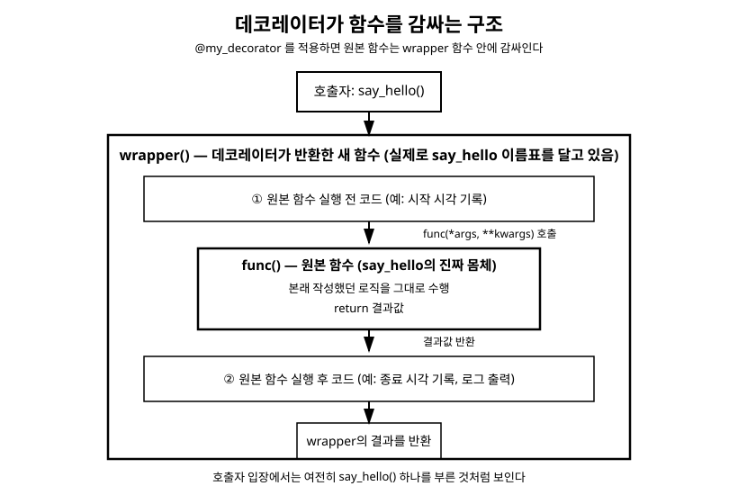

# 16장. 데코레이터와 컨텍스트 매니저

[◀ 이전: 15장. 파일 입출력](ch15-파일입출력.md) | [📖 목차](00-목차.md) | [다음: 17장. 표준 라이브러리와 패키지 관리 ▶](ch17-표준라이브러리와패키지관리.md)

---

9장 함수에서 우리는 "Python에서 함수는 객체다"라는 사실을 배웠습니다. 함수를 변수에 대입하고, 다른 함수의 인자로 넘기고, 함수의 반환값으로 사용할 수 있다는 성질이었습니다. 이번 장에서는 이 성질을 발판 삼아 두 가지를 배웁니다. 하나는 함수를 감싸서 새로운 기능을 덧붙이는 데코레이터(decorator)이고, 다른 하나는 15장 파일 입출력에서 예고했던 `with`문의 동작 원리, 즉 컨텍스트 매니저(context manager)입니다. 두 주제는 서로 다른 문법처럼 보이지만, 둘 다 "무언가를 준비하고, 본래 할 일을 하고, 뒷정리를 한다"는 공통된 패턴을 각자의 방식으로 표현한 것입니다.

## 클로저: 함수를 감싸기 전에 알아야 할 개념

데코레이터를 이해하려면 먼저 클로저(closure)라는 개념을 알아야 합니다. 클로저는 함수 안에 정의된 함수(중첩 함수)가 자신을 둘러싼 바깥 함수의 변수를 기억하는 현상을 말합니다.

```python
def make_multiplier(factor):
    """factor를 기억했다가 나중에 곱해주는 함수를 반환한다."""

    def multiplier(number):
        return number * factor  # 바깥 함수의 factor를 참조한다

    return multiplier


double = make_multiplier(2)
triple = make_multiplier(3)

print(double(5))  # 10
print(triple(5))  # 15
```

`make_multiplier(2)`가 실행을 마치고 나면 보통은 그 안의 지역 변수 `factor`도 함께 사라져야 할 것 같습니다. 하지만 `make_multiplier`가 반환한 `multiplier` 함수는 `factor`라는 값을 계속 "기억"하고 있습니다. 이렇게 자신을 만들어낸 바깥 함수의 변수를 내부에 갖고 다니는 함수를 클로저라고 부릅니다. `double`과 `triple`은 똑같은 `multiplier` 함수 코드를 공유하지만, 각각 다른 `factor` 값을 기억하고 있어서 서로 다르게 동작합니다.

클로저가 바깥 함수의 변수 값을 읽는 것을 넘어 직접 변경하고 싶다면, 9장에서 잠깐 언급했던 `nonlocal` 키워드가 필요합니다.

```python
def make_counter():
    """호출할 때마다 1씩 증가하는 카운터 함수를 만든다."""
    count = 0

    def counter():
        nonlocal count
        count += 1
        return count

    return counter


counter_a = make_counter()
counter_b = make_counter()

print(counter_a())  # 1
print(counter_a())  # 2
print(counter_a())  # 3
print(counter_b())  # 1  <- counter_a와 완전히 독립된 카운터
```

`nonlocal count`가 없다면 `count += 1`은 새로운 지역 변수를 만들려는 시도로 해석되어 `UnboundLocalError`가 발생합니다. `nonlocal`은 "이 이름은 내가 만든 게 아니라 나를 감싼 함수의 변수를 그대로 쓰겠다"고 선언하는 역할을 합니다. `counter_a`와 `counter_b`는 `make_counter()`를 호출할 때마다 새로 만들어지는 별개의 `count` 변수를 각각 기억하기 때문에 서로 영향을 주지 않습니다.

## 데코레이터: 함수를 감싸는 함수

클로저의 개념을 응용하면, 어떤 함수를 받아서 그 함수에 새로운 동작을 덧붙인 다음 반환하는 함수를 만들 수 있습니다. 이런 함수를 데코레이터(decorator)라고 부릅니다. 데코레이터는 원본 함수의 코드를 전혀 건드리지 않으면서도, 함수 호출 앞뒤에 공통된 작업(로그 남기기, 실행 시간 측정, 권한 확인 등)을 끼워 넣을 수 있게 해줍니다.

### `@` 문법 없이 데코레이터의 원리 이해하기

`@` 기호를 사용하기 전에, 먼저 데코레이터가 실제로 어떤 함수 조작인지 순수한 함수만으로 살펴보겠습니다.

```python
def with_logging(func):
    """func를 호출하기 전후에 로그를 남기는 함수를 반환한다."""

    def wrapper():
        print(f"[로그] {func.__name__} 함수를 시작합니다.")
        result = func()
        print(f"[로그] {func.__name__} 함수를 종료합니다.")
        return result

    return wrapper


def say_hello():
    print("안녕하세요!")


say_hello = with_logging(say_hello)  # say_hello를 감싼 wrapper로 교체
say_hello()
```

```
[로그] say_hello 함수를 시작합니다.
안녕하세요!
[로그] say_hello 함수를 종료합니다.
```

`with_logging(say_hello)`는 원래의 `say_hello`를 인자로 받아서, 그 함수를 감싸는 `wrapper`라는 새로운 함수를 반환합니다. 그리고 `say_hello = with_logging(say_hello)`로 이름 `say_hello`를 이 `wrapper` 함수에 다시 연결합니다. 이제부터 `say_hello()`를 호출하면 실제로는 `wrapper()`가 실행되고, 그 안에서 원본 함수(`func`, 즉 원래의 `say_hello`)를 호출하는 구조가 됩니다. `wrapper`가 원본 함수 `func`를 기억하고 있는 것 역시 앞서 배운 클로저 덕분입니다.

### `@` 문법으로 간결하게 적용하기

방금 작성한 `say_hello = with_logging(say_hello)`라는 패턴은 함수를 정의하고 나서 곧바로 같은 이름에 데코레이터를 적용한 결과를 다시 대입하는 흔한 패턴입니다. Python은 이를 위한 전용 문법으로 `@데코레이터이름`을 제공합니다.

```python
def with_logging(func):
    def wrapper():
        print(f"[로그] {func.__name__} 함수를 시작합니다.")
        result = func()
        print(f"[로그] {func.__name__} 함수를 종료합니다.")
        return result

    return wrapper


@with_logging
def say_hello():
    print("안녕하세요!")


say_hello()
```

`@with_logging`을 `say_hello` 함수 정의 바로 위에 적으면, Python은 함수를 정의하자마자 `say_hello = with_logging(say_hello)`를 자동으로 실행해줍니다. 즉 다음 두 코드는 완전히 동일하게 동작합니다.

```python
@with_logging
def say_hello():
    ...

# 위 코드는 아래와 정확히 같다
def say_hello():
    ...
say_hello = with_logging(say_hello)
```

### 실전 예제: 실행 시간을 측정하는 데코레이터

데코레이터가 실제로 유용하게 쓰이는 대표적인 예로, 함수의 실행 시간을 측정하는 데코레이터를 만들어보겠습니다.

```python
import time


def measure_time(func):
    """func의 실행 시간을 측정해서 출력하는 데코레이터."""

    def wrapper():
        start = time.perf_counter()
        result = func()
        end = time.perf_counter()
        print(f"{func.__name__} 실행 시간: {end - start:.4f}초")
        return result

    return wrapper


@measure_time
def count_to_million():
    total = 0
    for i in range(1_000_000):
        total += i
    return total


result = count_to_million()
print(result)
```

```
count_to_million 실행 시간: 0.0512초
499999500000
```

`time.perf_counter()`는 시간 측정에 특화된 정밀한 시각 값을 반환하는 함수로, 17장 표준 라이브러리와 패키지 관리에서 소개하는 `time` 모듈에 속해 있습니다. 함수 실행 앞뒤로 시각을 기록해서 그 차이를 계산하는 방식은 실행 시간 측정 데코레이터의 가장 기본적인 형태입니다.

## `functools.wraps`가 필요한 이유

방금 만든 `measure_time` 데코레이터에는 눈에 잘 띄지 않는 부작용이 하나 있습니다. 데코레이터를 적용한 함수의 메타데이터(이름, 독스트링 등)가 `wrapper`의 것으로 바뀌어 버린다는 점입니다.

```python
@measure_time
def count_to_million():
    """1부터 100만까지 더한 값을 반환한다."""
    total = 0
    for i in range(1_000_000):
        total += i
    return total


print(count_to_million.__name__)  # wrapper  <- count_to_million이어야 할 것 같은데?
print(count_to_million.__doc__)   # None     <- 독스트링도 사라졌다
```

`count_to_million`이라는 이름은 이제 `wrapper` 함수를 가리키고 있으므로, `__name__`이나 `__doc__` 같은 함수의 속성을 조회하면 원본 함수가 아니라 `wrapper`의 정보가 나옵니다. 디버깅 도구나 문서 자동 생성 도구는 이런 속성에 의존하는 경우가 많기 때문에, 이 문제를 그대로 두면 데코레이터를 적용한 함수를 다룰 때 혼란을 일으킬 수 있습니다.

이 문제는 표준 라이브러리 `functools`의 `wraps` 데코레이터로 해결합니다. `wraps(func)`를 `wrapper` 함수 위에 붙이면, `wrapper`가 원본 함수 `func`의 `__name__`, `__doc__` 등의 메타데이터를 그대로 복사해옵니다.

```python
import time
from functools import wraps


def measure_time(func):
    @wraps(func)
    def wrapper():
        start = time.perf_counter()
        result = func()
        end = time.perf_counter()
        print(f"{func.__name__} 실행 시간: {end - start:.4f}초")
        return result

    return wrapper


@measure_time
def count_to_million():
    """1부터 100만까지 더한 값을 반환한다."""
    total = 0
    for i in range(1_000_000):
        total += i
    return total


print(count_to_million.__name__)  # count_to_million
print(count_to_million.__doc__)   # 1부터 100만까지 더한 값을 반환한다.
```

`@wraps(func)` 역시 데코레이터입니다. 즉 데코레이터를 만들 때 또 다른 데코레이터를 사용하는 셈입니다. 직접 데코레이터를 작성할 때는 `wrapper` 함수 위에 `@wraps(func)`를 붙이는 것을 습관처럼 항상 챙기는 것이 좋습니다.

## 인자와 반환값이 있는 함수도 감싸기

지금까지 만든 데코레이터는 인자가 없는 함수에만 적용할 수 있었습니다. `wrapper()` 자체가 아무 매개변수도 받지 않기 때문입니다. 어떤 함수에도 적용할 수 있는 범용 데코레이터를 만들려면, `wrapper`가 9장에서 배운 `*args`와 `**kwargs`로 임의의 인자를 받아서 그대로 원본 함수에 전달해주어야 합니다.

```python
import time
from functools import wraps


def measure_time(func):
    @wraps(func)
    def wrapper(*args, **kwargs):
        start = time.perf_counter()
        result = func(*args, **kwargs)  # 받은 인자를 그대로 전달
        end = time.perf_counter()
        print(f"{func.__name__} 실행 시간: {end - start:.4f}초")
        return result

    return wrapper


@measure_time
def add_many(*numbers):
    time.sleep(0.1)  # 시간이 걸리는 작업을 흉내낸다
    return sum(numbers)


print(add_many(1, 2, 3, 4, 5))
```

```
add_many 실행 시간: 0.1003초
15
```

`wrapper(*args, **kwargs)`로 호출 시 전달된 모든 인자를 받아서, `func(*args, **kwargs)`로 그대로 언패킹해 원본 함수에 넘겨줍니다. 이렇게 작성하면 이 데코레이터는 인자가 몇 개든, 위치 인자든 키워드 인자든 상관없이 어떤 함수에도 적용할 수 있는 범용 데코레이터가 됩니다.

## 매개변수를 받는 데코레이터

`@measure_time`처럼 데코레이터 이름만 그대로 쓰는 경우 외에, `@repeat(3)`처럼 데코레이터 자체에 괄호를 붙여 인자를 넘기고 싶을 때가 있습니다. 이런 데코레이터를 만들려면 함수를 한 겹 더 감싸야 합니다.

```python
from functools import wraps


def repeat(times):
    """데코레이터를 적용한 함수를 times번 반복 실행한다."""

    def decorator(func):
        @wraps(func)
        def wrapper(*args, **kwargs):
            result = None
            for _ in range(times):
                result = func(*args, **kwargs)
            return result

        return wrapper

    return decorator


@repeat(3)
def greet(name):
    print(f"{name}님, 안녕하세요!")


greet("지훈")
```

```
지훈님, 안녕하세요!
지훈님, 안녕하세요!
지훈님, 안녕하세요!
```

`repeat(3)`은 먼저 실행되어 `times`가 3으로 고정된 `decorator` 함수를 반환합니다. 그다음 `@` 문법이 이 `decorator` 함수를 `greet`에 적용합니다. 즉 `@repeat(3)`이 실제로 하는 일은 `greet = repeat(3)(greet)`와 같습니다. 함수가 3단으로 중첩되어 헷갈릴 수 있는데, 바깥에서부터 순서대로 "인자를 받는 함수(`repeat`) → 진짜 데코레이터(`decorator`) → 원본 함수를 감싸는 함수(`wrapper`)"라고 정리해두면 구조를 이해하기 쉬워집니다.

## 데코레이터를 여러 개 겹쳐 적용하기

하나의 함수에 여러 데코레이터를 동시에 적용할 수도 있습니다. 이때 적용 순서는 코드에서 아래쪽(함수 정의에 가까운 쪽)에 있는 데코레이터가 먼저 적용됩니다.

```python
@measure_time
@repeat(2)
def greet(name):
    print(f"{name}님, 안녕하세요!")


greet("유진")
```

```
유진님, 안녕하세요!
유진님, 안녕하세요!
greet 실행 시간: 0.0001초
```

이 코드는 `greet = measure_time(repeat(2)(greet))`와 같은 순서로 해석됩니다. `repeat(2)`가 먼저 `greet`을 감싸서 "두 번 반복하는 함수"를 만들고, 그다음 `measure_time`이 그 결과를 다시 감싸서 "실행 시간을 재는 함수"로 만듭니다. 그래서 실행 시간에는 두 번의 반복 실행이 모두 포함됩니다. 여러 데코레이터를 함께 쓸 때는 이 적용 순서(아래에서 위로)를 항상 염두에 두어야 합니다.

## 이미 만난 데코레이터들

사실 여러분은 이미 데코레이터를 여러 번 사용해봤습니다. 13장 객체지향 심화에서 다룬 `@property`와 `@balance.setter`, 그리고 `functools.total_ordering`이 제공하는 `@total_ordering`이 모두 데코레이터입니다.

```python
from functools import total_ordering


@total_ordering
class BankAccount:
    def __eq__(self, other):
        return self.balance == other.balance

    def __lt__(self, other):
        return self.balance < other.balance
```

`@total_ordering`은 클래스를 인자로 받아서, `__eq__`와 `__lt__`만으로 `__le__`, `__gt__`, `__ge__`까지 자동으로 채워 넣은 새로운 클래스(또는 같은 클래스에 메서드를 추가한 것)를 반환합니다. 지금까지 배운 원리를 알고 나면, 겉보기에 신기했던 이런 도구들도 결국 "무언가를 받아서 기능을 덧붙인 뒤 돌려주는 함수"라는 동일한 패턴 위에 있다는 것을 알 수 있습니다.

다음 그림은 데코레이터를 적용했을 때 원본 함수가 `wrapper` 함수 안에 감싸이는 구조와, 함수를 호출했을 때 실행이 어떤 순서로 흘러가는지를 보여줍니다.



호출하는 쪽에서는 여전히 `say_hello()`처럼 원본 함수 하나를 부르는 것처럼 보이지만, 실제로는 그림의 바깥쪽 상자인 `wrapper`가 먼저 실행되어 사전 작업을 수행하고, 그 안에서 원본 함수(안쪽 상자)를 호출한 뒤, 사후 작업을 마치고 결과를 반환하는 흐름으로 동작합니다.

## `with`문의 동작 원리: 컨텍스트 매니저

15장 파일 입출력에서 `with open(...) as file:` 구문을 사용하면 블록이 끝날 때 파일이 자동으로 닫힌다는 것을 배웠습니다. 이제 그 동작이 어떻게 가능한지 살펴볼 차례입니다.

`with`문은 "블록에 들어가기 전에 준비 작업을 하고, 블록을 벗어날 때(정상 종료든 예외 발생이든) 반드시 뒷정리를 한다"는 패턴을 위한 문법입니다. 이 패턴을 따르는 객체를 컨텍스트 매니저(context manager)라고 부르며, 컨텍스트 매니저가 되려면 `__enter__`와 `__exit__`라는 두 개의 특별 메서드(던더 메서드)를 구현해야 합니다.

- `__enter__(self)`: `with` 블록에 들어갈 때 호출됩니다. 이 메서드의 반환값이 `as` 뒤에 적은 이름에 대입됩니다.
- `__exit__(self, exc_type, exc_value, traceback)`: `with` 블록을 벗어날 때 호출됩니다. 블록 안에서 예외가 발생했다면 그 예외에 대한 정보가 세 인자로 전달되고, 예외 없이 정상적으로 끝났다면 세 인자 모두 `None`이 됩니다.

직접 간단한 컨텍스트 매니저를 만들어 이 흐름을 확인해보겠습니다.

```python
class Timer:
    """with 블록의 실행 시간을 측정하는 컨텍스트 매니저."""

    def __enter__(self):
        import time
        self.start = time.perf_counter()
        print("측정을 시작합니다.")
        return self  # as로 받을 값

    def __exit__(self, exc_type, exc_value, traceback):
        import time
        elapsed = time.perf_counter() - self.start
        print(f"측정 종료: {elapsed:.4f}초 걸렸습니다.")
        return False  # 예외를 그대로 전파한다


with Timer() as timer:
    total = sum(range(1_000_000))
    print(total)
```

```
측정을 시작합니다.
499999500000
측정 종료: 0.0523초 걸렸습니다.
```

`with Timer() as timer:`가 실행되면 다음과 같은 순서로 동작합니다.

1. `Timer()`로 인스턴스를 만듭니다.
2. 그 인스턴스의 `__enter__()`를 호출하고, 반환값을 `timer`에 대입합니다.
3. `with` 블록 안의 코드를 실행합니다.
4. 블록이 끝나면(정상 종료든 예외 발생이든) `__exit__()`를 호출합니다.

15장에서 사용했던 파일 객체 역시 내부적으로 정확히 이 프로토콜을 구현하고 있습니다. `open()`이 반환하는 파일 객체는 `__enter__`에서 자기 자신을 반환하고, `__exit__`에서 `close()`를 호출하도록 만들어져 있습니다. 그래서 `with open(...) as file:` 블록을 벗어나는 순간 파일이 자동으로 닫히는 것입니다.

### `__exit__`과 예외 처리

`__exit__`의 세 매개변수 `exc_type`, `exc_value`, `traceback`은 11장 예외 처리에서 배운 예외 정보와 대응됩니다. `with` 블록 안에서 예외가 발생하면, 이 정보가 `__exit__`에 전달되고 블록을 빠져나온 뒤에도 `__exit__` 실행이 보장됩니다.

```python
class Timer:
    def __enter__(self):
        import time
        self.start = time.perf_counter()
        return self

    def __exit__(self, exc_type, exc_value, traceback):
        import time
        elapsed = time.perf_counter() - self.start
        if exc_type is not None:
            print(f"오류와 함께 종료: {exc_type.__name__} ({elapsed:.4f}초)")
        else:
            print(f"정상 종료 ({elapsed:.4f}초)")
        return False


with Timer():
    result = 10 / 0
```

```
오류와 함께 종료: ZeroDivisionError (0.0000초)
Traceback (most recent call last):
  ...
ZeroDivisionError: division by zero
```

`__exit__`의 반환값도 중요한 역할을 합니다. `False`(또는 `None`처럼 거짓으로 평가되는 값)를 반환하면 블록 안에서 발생한 예외가 그대로 바깥으로 전파됩니다. 반면 `True`를 반환하면 그 예외를 "처리했다"고 간주하여 예외를 삼켜버리고, `with`문 다음 코드가 정상적으로 이어서 실행됩니다.

```python
class IgnoreZeroDivision:
    def __enter__(self):
        return self

    def __exit__(self, exc_type, exc_value, traceback):
        if exc_type is ZeroDivisionError:
            print("0으로 나누는 오류를 무시합니다.")
            return True  # 예외를 여기서 삼킨다
        return False  # 다른 예외는 그대로 전파한다


with IgnoreZeroDivision():
    print(10 / 0)

print("프로그램이 계속 실행됩니다.")
```

```
0으로 나누는 오류를 무시합니다.
프로그램이 계속 실행됩니다.
```

이런 식으로 특정 예외만 골라서 처리하고 나머지는 그대로 전파하는 것은 11장에서 배운 `except ZeroDivisionError:`처럼 특정 예외 타입만 지정해서 잡는 것과 같은 원리입니다. 다만 이 로직을 `try`/`except`로 매번 작성하는 대신, 컨텍스트 매니저 하나로 만들어두면 여러 곳에서 `with IgnoreZeroDivision():`만 붙여서 재사용할 수 있다는 차이가 있습니다.

## `contextlib.contextmanager`로 간편하게 만들기

`__enter__`와 `__exit__`를 갖춘 클래스를 매번 정의하는 것은 간단한 경우에는 다소 번거로울 수 있습니다. 표준 라이브러리 `contextlib` 모듈의 `contextmanager` 데코레이터를 사용하면, 제너레이터 함수 하나만으로 컨텍스트 매니저를 만들 수 있습니다. 이 도구는 이번 장에서 배운 데코레이터와 10장 컴프리헨션과 제너레이터에서 배운 제너레이터를 함께 활용하는 좋은 예이기도 합니다.

```python
from contextlib import contextmanager
import time


@contextmanager
def timer():
    start = time.perf_counter()
    print("측정을 시작합니다.")
    yield  # 이 지점에서 with 블록의 코드가 실행된다
    elapsed = time.perf_counter() - start
    print(f"측정 종료: {elapsed:.4f}초 걸렸습니다.")


with timer():
    total = sum(range(1_000_000))
    print(total)
```

```
측정을 시작합니다.
499999500000
측정 종료: 0.0518초 걸렸습니다.
```

동작 방식은 다음과 같습니다.

- `yield` 이전의 코드는 `__enter__`에 해당하며, `with` 블록에 들어가기 전에 실행됩니다.
- `yield`가 실행되는 순간 함수가 잠시 멈추고, `with` 블록 안의 코드가 실행됩니다. `yield`에 값을 붙이면(`yield 값`) 그 값이 `as` 뒤의 이름에 대입됩니다.
- `with` 블록이 끝나면 제너레이터 함수의 나머지 부분, 즉 `yield` 이후의 코드가 실행됩니다. 이 부분이 `__exit__`에 해당합니다.

블록 안에서 예외가 발생했을 때 뒷정리를 확실히 하고 싶다면, `yield` 문을 `try`/`finally`로 감싸면 됩니다.

```python
from contextlib import contextmanager


@contextmanager
def open_resource(name):
    print(f"{name} 자원을 준비합니다.")
    try:
        yield name
    finally:
        print(f"{name} 자원을 정리합니다.")


with open_resource("데이터베이스 연결") as resource:
    print(f"{resource}을(를) 사용 중입니다.")
    # raise ValueError("문제 발생")  # 예외가 나도 finally 블록은 실행된다
```

```
데이터베이스 연결 자원을 준비합니다.
데이터베이스 연결을(를) 사용 중입니다.
데이터베이스 연결 자원을 정리합니다.
```

클래스로 `__enter__`/`__exit__`를 직접 구현하는 방식과 `@contextmanager`를 사용하는 방식 중 어느 쪽을 선택할지는 상황에 따라 다릅니다. 컨텍스트 매니저가 관리해야 할 상태가 복잡하거나 다른 메서드도 함께 필요하다면 클래스로 작성하는 편이 명확하고, 간단히 "준비 → 실행 → 정리" 흐름만 필요하다면 `@contextmanager`로 짧게 작성하는 편이 편리합니다.

## 요약

- 클로저는 중첩 함수가 자신을 감싼 바깥 함수의 변수를 기억하는 현상이다. 바깥 변수를 함수 안에서 변경하려면 `nonlocal` 키워드가 필요하다.
- 데코레이터는 함수를 인자로 받아 새로운 기능을 덧붙인 함수를 반환하는 함수다. `@데코레이터` 문법은 `함수 = 데코레이터(함수)`를 자동으로 실행해주는 문법적 편의다.
- 범용 데코레이터를 만들 때는 `wrapper(*args, **kwargs)`로 임의의 인자를 받아 원본 함수에 그대로 전달해야 하며, `functools.wraps(func)`를 붙여서 원본 함수의 `__name__`, `__doc__` 등을 보존해야 한다.
- 데코레이터 자체에 인자를 전달하려면 함수를 한 겹 더 감싸서 "인자를 받는 함수 → 진짜 데코레이터 → wrapper" 구조로 작성한다. 여러 데코레이터를 겹쳐 적용하면 코드에서 아래쪽에 있는 것부터 먼저 적용된다.
- `with`문은 컨텍스트 매니저 프로토콜을 따르는 객체에 대해 동작한다. `__enter__`는 블록 진입 시, `__exit__`는 블록을 벗어날 때(예외 발생 포함) 호출되며, `__exit__`가 `True`를 반환하면 예외가 처리된 것으로 간주되어 전파되지 않는다.
- `contextlib.contextmanager` 데코레이터를 사용하면 `yield` 하나로 구분된 제너레이터 함수만으로 컨텍스트 매니저를 만들 수 있다. `yield` 이전은 `__enter__`, 이후는 `__exit__`에 해당한다.

## 연습문제

1. 함수가 호출될 때마다 호출 횟수를 세어 출력하는 데코레이터 `count_calls`를 만들어보세요. 클로저를 이용해 호출 횟수를 함수 바깥이 아니라 데코레이터 내부에 저장해야 합니다.
2. `functools.wraps`를 사용하지 않은 데코레이터와 사용한 데코레이터를 각각 만들어서, 데코레이터를 적용한 함수의 `__name__`이 어떻게 달라지는지 직접 확인해보세요.
3. 함수의 인자와 반환값을 함께 출력하는 데코레이터 `debug_log`를 작성하세요. 예를 들어 `@debug_log`가 붙은 `add(3, 5)`를 호출하면 `"add(3, 5) -> 8"`과 같은 형태로 출력되어야 합니다.
4. `__enter__`와 `__exit__`를 직접 구현한 컨텍스트 매니저 클래스 `Indenter`를 만들어보세요. `with` 블록에 들어갈 때마다 들여쓰기 수준이 하나씩 늘어나고, 블록을 빠져나올 때마다 줄어들도록 하여, 중첩된 `with Indenter():` 블록으로 계층적인 출력을 만들어보세요.
5. `contextlib.contextmanager`를 사용해서, 리스트를 받아 `with` 블록에 들어갈 때 원본 리스트를 복사해서 넘겨주고, 블록이 끝나면 "원본 리스트는 변경되지 않았습니다"라는 메시지를 출력하는 컨텍스트 매니저 `readonly_view(원본_리스트)`를 작성해보세요.

---

[◀ 이전: 15장. 파일 입출력](ch15-파일입출력.md) | [📖 목차](00-목차.md) | [다음: 17장. 표준 라이브러리와 패키지 관리 ▶](ch17-표준라이브러리와패키지관리.md)
