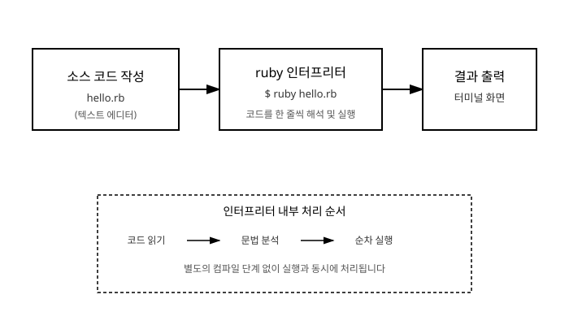

# 2장. 첫 프로그램과 실행 환경

[◀ 이전: 1장. Ruby란 무엇인가](ch01-Ruby란무엇인가.md) | [📖 목차](00-목차.md) | [다음: 3장. 변수와 자료형 ▶](ch03-변수와자료형.md)


1장에서 Ruby가 어떤 언어인지 살펴보았습니다. 이번 장에서는 실제로 손을 움직여 Ruby를 설치하고, 첫 번째 프로그램을 실행해보겠습니다. 프로그래밍 언어는 눈으로 읽는 것보다 직접 실행해보면서 배울 때 훨씬 빠르게 익숙해지므로, 가능하면 이번 장의 코드를 그대로 따라 입력해보시기를 권합니다.

## Ruby 설치하기

Ruby를 사용하려면 먼저 컴퓨터에 Ruby 실행 환경을 설치해야 합니다. 가장 기본적인 방법은 공식 홈페이지인 `ruby-lang.org`에서 운영체제에 맞는 설치 프로그램을 내려받는 것입니다. 최근에는 Windows, macOS, Linux 각각에 맞는 설치 안내를 공식 사이트에서 친절하게 제공하고 있으므로, 처음 설치한다면 이 경로를 따라가는 것이 가장 확실합니다.

설치를 마쳤다면 터미널(또는 명령 프롬프트)을 열고 다음 명령으로 설치가 잘 되었는지 확인합니다.

```ruby
# 터미널에 입력하는 명령입니다 (Ruby 코드가 아닙니다)
ruby -v
```

정상적으로 설치되었다면 `ruby 3.x.x` 와 같이 설치된 Ruby의 버전 정보가 출력됩니다.

### 여러 버전을 관리하고 싶다면: rbenv, rvm

프로젝트마다 서로 다른 Ruby 버전이 필요한 경우가 종종 있습니다. 예를 들어 오래된 프로젝트는 예전 버전의 Ruby를 요구하고, 새로 시작하는 프로젝트는 최신 버전을 사용하고 싶을 수 있습니다. 이런 상황을 위해 **rbenv**나 **rvm** 같은 버전 관리 도구가 널리 사용됩니다. 이 도구들은 하나의 컴퓨터에 여러 버전의 Ruby를 설치해두고, 프로젝트별로 원하는 버전을 손쉽게 전환할 수 있게 해줍니다. 지금 당장은 이런 도구가 있다는 것만 기억해두고, 실제 사용법은 여러 프로젝트를 다루기 시작할 때 자연스럽게 익혀도 충분합니다.

## irb: 대화형으로 Ruby와 대화하기

Ruby를 설치하면 `irb`(Interactive Ruby)라는 도구가 함께 설치됩니다. irb는 파일을 따로 만들지 않고도, 터미널에서 Ruby 코드를 한 줄씩 입력하면 바로 그 결과를 확인할 수 있는 대화형 도구입니다. 새로운 문법이나 메서드를 실험해볼 때 아주 유용하므로, 이 책을 읽는 동안에도 자주 열어두고 직접 코드를 입력해보시기를 권합니다.

터미널에서 다음과 같이 입력해 irb를 실행합니다.

```ruby
# 터미널에 입력하는 명령입니다
irb
```

irb가 실행되면 프롬프트가 나타나고, 그 뒤에 Ruby 코드를 입력하면 바로 결과가 출력됩니다.

```ruby
irb(main):001> 1 + 2
=> 3
irb(main):002> "안녕" + " 하세요"
=> "안녕 하세요"
irb(main):003> puts "Ruby 재미있네요"
Ruby 재미있네요
=> nil
```

세 번째 줄을 눈여겨볼 필요가 있습니다. `puts`는 화면에 문자열을 출력하는 역할을 하지만, 그 결과값 자체는 `nil`입니다. irb는 코드를 실행한 뒤 항상 "이 코드 전체의 결과값"을 `=>` 기호와 함께 보여주기 때문에, 화면에 출력된 문자열과 `nil`이라는 결과값이 함께 나타난 것입니다. 이 차이는 잠시 후 `puts`, `print`, `p`를 비교할 때 다시 살펴보겠습니다.

irb를 종료하고 싶을 때는 다음과 같이 입력합니다.

```ruby
irb(main):004> exit
```

## `.rb` 파일 작성하고 실행하기

irb는 짧은 코드를 실험해보기에는 좋지만, 여러 줄로 이루어진 프로그램을 저장하고 반복해서 실행하려면 파일로 작성하는 편이 훨씬 편리합니다. Ruby 소스 코드 파일은 관례적으로 `.rb`라는 확장자를 사용합니다.

먼저 아무 텍스트 에디터를 열어 `hello.rb`라는 이름으로 파일을 하나 만들고, 다음 내용을 입력합니다.

```ruby
# hello.rb
puts "Hello, World!"
```

파일을 저장한 뒤, 터미널에서 해당 파일이 있는 폴더로 이동해 다음 명령을 실행합니다.

```ruby
# 터미널에 입력하는 명령입니다
ruby hello.rb
```

터미널 화면에 다음과 같은 결과가 출력되면 성공입니다.

```
Hello, World!
```

이 짧은 과정이 바로 Ruby 프로그램을 만들고 실행하는 기본적인 흐름입니다. 정리하면 다음과 같은 세 단계를 거칩니다.

1. 텍스트 에디터로 `.rb` 확장자를 가진 소스 코드 파일을 작성합니다.
2. 터미널에서 `ruby 파일명.rb` 명령으로 해당 파일을 실행합니다.
3. `ruby` 인터프리터가 코드를 해석하며 실행하고, 그 결과가 터미널 화면에 출력됩니다.

Java처럼 별도의 컴파일 과정을 거쳐 실행 파일을 미리 만들어두는 언어와 달리, Ruby는 `ruby` 명령을 실행하는 순간 코드를 읽어 들이면서 곧바로 해석하고 실행합니다. 이런 방식의 언어를 **인터프리터 언어**라고 부릅니다. 전체 흐름을 그림으로 정리하면 다음과 같습니다.



## `puts`, `print`, `p`의 차이

Ruby에서 화면에 무언가를 출력하는 방법은 한 가지가 아닙니다. `puts`, `print`, `p`라는 세 가지 방법이 자주 쓰이는데, 각각 미묘하게 다른 특징을 가지고 있어 상황에 맞게 골라 써야 합니다.

```ruby
puts "Ruby"
puts "기초"
```

```
Ruby
기초
```

`puts`는 출력할 때마다 자동으로 줄바꿈을 추가합니다. 그래서 위 코드처럼 `puts`를 두 번 호출하면 두 줄에 걸쳐 출력됩니다.

```ruby
print "Ruby"
print "기초"
```

```
Ruby기초
```

반면 `print`는 줄바꿈을 자동으로 추가하지 않습니다. 그래서 두 번의 `print` 호출 결과가 한 줄에 이어 붙어 출력됩니다. 줄바꿈이 필요하다면 `"\n"`을 직접 넣어주어야 합니다.

```ruby
p "Ruby"
p [1, 2, 3]
p nil
```

```
"Ruby"
[1, 2, 3]
nil
```

`p`는 값을 사람이 읽기 좋은 형태 그대로가 아니라, **개발자가 값의 정체를 정확히 파악할 수 있는 형태**로 출력합니다. 예를 들어 문자열 `"Ruby"`를 `puts`로 출력하면 그냥 `Ruby`라고만 나오지만, `p`로 출력하면 큰따옴표까지 포함해 `"Ruby"`라고 나옵니다. 이 덕분에 `p`는 "지금 이 변수 안에 정확히 어떤 값이 들어있는가"를 확인해야 하는 디버깅 상황에서 특히 유용합니다.

세 메서드의 차이를 표로 정리하면 다음과 같습니다.

| 메서드 | 줄바꿈 | 출력 형태 | 주 용도 |
|---|---|---|---|
| `puts` | 자동으로 추가 | 사람이 읽기 좋은 형태 | 일반적인 결과 출력 |
| `print` | 추가하지 않음 | 사람이 읽기 좋은 형태 | 줄바꿈 없이 이어서 출력하고 싶을 때 |
| `p` | 자동으로 추가 | 값의 실제 형태를 그대로 (문자열은 따옴표 포함) | 디버깅, 값 확인 |

irb에서 직접 세 메서드를 비교해보면 차이가 더 분명하게 느껴집니다.

```ruby
irb(main):001> puts "hi"
hi
=> nil
irb(main):002> print "hi"
hi=> nil
irb(main):003> p "hi"
"hi"
=> "hi"
```

여기서 눈여겨볼 부분은 각 메서드가 **반환하는 값**입니다. `puts`와 `print`는 화면에 무언가를 출력하는 일 자체가 목적이라 반환값으로는 별 의미 없는 `nil`을 돌려주지만, `p`는 자신이 출력한 값을 그대로 반환값으로 돌려줍니다. 그래서 코드 중간에 값을 확인하고 싶을 때 `p`를 끼워 넣어도 이후 로직이 그 값을 계속 이어받아 사용할 수 있습니다. 메서드가 값을 반환한다는 개념 자체는 7장에서 자세히 다루므로, 지금은 "셋의 출력 방식이 다르다"는 정도만 기억해두어도 충분합니다.

## 주석 작성하기

**주석(comment)**은 프로그램 실행에는 아무런 영향을 주지 않지만, 코드를 읽는 사람(미래의 자신을 포함해서)을 위해 설명을 남겨두는 문법입니다. Ruby는 두 가지 방식의 주석을 제공합니다.

한 줄짜리 주석은 `#` 기호를 사용합니다. `#` 이후부터 그 줄이 끝날 때까지는 전부 주석으로 취급되어 실행되지 않습니다.

```ruby
# 이것은 한 줄 주석입니다.
puts "안녕하세요"   # 이렇게 코드 뒤에 붙여 설명을 남길 수도 있습니다
```

여러 줄에 걸친 긴 설명을 남기고 싶다면 `=begin`과 `=end`로 감싸는 방법을 사용할 수 있습니다.

```ruby
=begin
이 파일은 Ruby 학습용 예제 파일입니다.
간단한 인사말을 출력하는 코드가 담겨 있습니다.
=end
puts "안녕하세요"
```

다만 `=begin`과 `=end`는 반드시 줄의 맨 앞에서 시작해야 하며, 실무에서는 여러 줄 주석이 필요할 때도 `#`을 줄마다 반복해서 쓰는 경우가 더 흔합니다.

```ruby
# 이 파일은 Ruby 학습용 예제 파일입니다.
# 간단한 인사말을 출력하는 코드가 담겨 있습니다.
puts "안녕하세요"
```

## 요약

- Ruby는 공식 사이트(`ruby-lang.org`)에서 설치할 수 있으며, 여러 버전을 함께 관리하고 싶다면 rbenv나 rvm 같은 버전 관리 도구를 활용할 수 있습니다.
- `irb`는 코드를 한 줄씩 입력하고 결과를 즉시 확인할 수 있는 대화형 도구로, 짧은 코드를 실험할 때 유용합니다.
- `.rb` 파일에 코드를 작성한 뒤 `ruby 파일명.rb` 명령으로 실행하는 것이 표준적인 실행 흐름입니다.
- `puts`는 줄바꿈을 자동으로 추가하고, `print`는 줄바꿈을 추가하지 않으며, `p`는 값을 있는 그대로(디버깅에 유리한 형태로) 출력하고 그 값을 반환합니다.
- 주석은 `#`으로 한 줄, `=begin`과 `=end`로 여러 줄을 작성할 수 있으며, 실행에는 영향을 주지 않고 사람을 위한 설명을 남기는 용도입니다.

## 연습문제

1. 터미널에서 `ruby -v`를 실행하면 무엇을 확인할 수 있는지 설명해보세요.
2. irb를 실행한 뒤 `3 * 7`, `"Ruby" + "기초"`, `10 / 3` 세 가지 식을 각각 입력해보고 어떤 결과가 나오는지 적어보세요.
3. `greeting.rb`라는 파일을 만들어 자신의 이름을 포함한 인사말을 `puts`로 출력하도록 작성하고, `ruby greeting.rb` 명령으로 실행해보세요.
4. 다음 코드를 실행했을 때 터미널에 정확히 어떻게 출력될지 예상해서 적어보세요.
   ```ruby
   print "Ruby"
   puts "기초"
   p "Ruby기초"
   ```
5. 다음 코드에 주석을 추가해, 이 코드가 무슨 일을 하는지 다른 사람이 읽고 이해할 수 있도록 설명을 달아보세요.
   ```ruby
   puts "합계: " + (3 + 4).to_s
   ```

---

[◀ 이전: 1장. Ruby란 무엇인가](ch01-Ruby란무엇인가.md) | [📖 목차](00-목차.md) | [다음: 3장. 변수와 자료형 ▶](ch03-변수와자료형.md)
