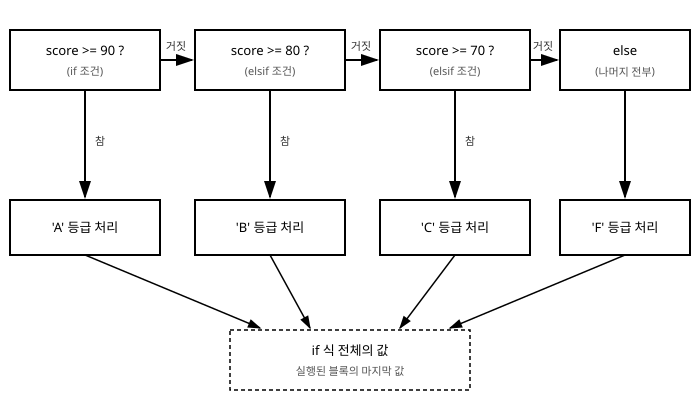

# 5장. 제어문

[◀ 이전: 4장. 연산자와 표현식](ch04-연산자와표현식.md) | [📖 목차](00-목차.md) | [다음: 6장. 반복문 ▶](ch06-반복문.md)


지금까지 작성한 코드는 위에서 아래로 한 줄씩 순서대로 실행되는 것이 전부였습니다. 하지만 실제 프로그램은 상황에 따라 서로 다른 일을 해야 하는 경우가 훨씬 많습니다. 로그인한 사용자가 관리자인지에 따라 다른 메뉴를 보여 주거나, 장바구니 금액이 일정 기준을 넘으면 할인 쿠폰을 적용하거나, 입력값이 비어 있으면 오류 메시지를 출력하는 일들이 모두 "조건에 따른 분기"에 해당합니다. 이 장에서는 Ruby가 제공하는 조건 분기 도구인 `if`/`elsif`/`else`, `unless`, 후위 조건문, 삼항 연산자, `case`/`when`, 그리고 논리 연산자를 조건문에 사용할 때 주의할 점을 다룹니다.

## 5.1 조건과 참·거짓 판단

조건문은 "이 조건이 참이면 이 코드를 실행하고, 아니면 저 코드를 실행한다"는 규칙을 표현하는 수단입니다. 3장과 4장에서 살펴본 것처럼 Ruby에서는 `nil`과 `false`만 거짓으로 취급되고, 그 외의 모든 값은 참으로 취급됩니다. 정수 `0`이나 빈 문자열 `""`, 빈 배열 `[]`도 모두 참입니다. C나 자바스크립트 같은 언어에 익숙하다면 이 부분에서 실수하기 쉬우므로, 조건문을 본격적으로 다루기 전에 다시 한번 짚고 넘어가겠습니다.

```ruby
if 0
  puts "0은 참으로 취급됩니다."
end

if ""
  puts "빈 문자열도 참으로 취급됩니다."
end

if nil
  puts "이 줄은 실행되지 않습니다."
else
  puts "nil은 거짓입니다."
end
```

실행 결과:

```
0은 참으로 취급됩니다.
빈 문자열도 참으로 취급됩니다.
nil은 거짓입니다.
```

## 5.2 if / elsif / else

`if`는 가장 기본적인 조건문입니다. C 계열 언어와 달리 조건식을 감싸는 소괄호가 필요 없고, 블록을 감싸는 중괄호 대신 `end` 키워드로 범위를 표시합니다.

```ruby
temperature = 35

if temperature >= 33
  puts "폭염 경보를 발령합니다."
end

puts "현재 기온: #{temperature}도"
```

조건이 거짓일 때 실행할 코드가 있다면 `else`를 사용합니다.

```ruby
print "정수를 입력하세요: "
number = gets.to_i

if number.even?
  puts "#{number}는 짝수입니다."
else
  puts "#{number}는 홀수입니다."
end
```

세 가지 이상의 경우를 나누어야 한다면 `elsif`를 이어서 사용합니다. `else if`가 아니라 `elsif`라는 하나의 키워드로 붙여 쓴다는 점에 유의하세요.



```ruby
print "점수를 입력하세요: "
score = gets.to_i

grade =
  if score >= 90
    "A"
  elsif score >= 80
    "B"
  elsif score >= 70
    "C"
  elsif score >= 60
    "D"
  else
    "F"
  end

puts "점수 #{score}의 학점은 #{grade}입니다."
```

위 코드에서 `if`는 조건을 순서대로 검사하다가 처음으로 참이 되는 분기의 마지막 값을 전체 `if` 식의 값으로 돌려줍니다. Ruby에서는 `if`가 문장이 아니라 값을 만들어 내는 **식(expression)**이기 때문에, 이렇게 결과를 곧바로 변수에 대입할 수 있습니다. 이는 Ruby 문법 전반에서 반복적으로 등장하는 중요한 특징이므로 기억해 두면 좋습니다.

조건을 검사하는 순서도 중요합니다. 만약 `score >= 60`을 가장 먼저 검사한다면, 90점을 받은 학생도 조건이 참이 되어 곧바로 "D"로 분류되어 버립니다. 범위를 좁혀 가며 판단할 때는 더 좁은(더 엄격한) 조건을 먼저 검사해야 합니다.

## 5.3 unless

`unless`는 `if`의 반대로, 조건이 **거짓일 때** 블록을 실행합니다. "만약 ~가 아니라면"이라는 문장을 그대로 코드로 옮기고 싶을 때 `if !조건` 대신 사용하면 자연스럽게 읽힙니다.

```ruby
logged_in = false

unless logged_in
  puts "로그인이 필요합니다."
end
```

`unless`에도 `else`를 붙일 수 있지만, "거짓이면 실행하고, 아니면(즉 참이면) 이렇게 실행한다"는 문장은 이중 부정처럼 읽혀 오히려 헷갈리기 쉽습니다.

```ruby
# 문법적으로는 가능하지만 읽기 불편함
unless logged_in
  puts "로그인이 필요합니다."
else
  puts "환영합니다."
end
```

이런 경우는 조건의 참/거짓을 뒤집어서 `if`/`else`로 쓰는 편이 훨씬 명확합니다.

```ruby
if logged_in
  puts "환영합니다."
else
  puts "로그인이 필요합니다."
end
```

경험적인 기준으로, `unless`는 `else` 없이 단순한 조건 하나만 부정할 때만 사용하는 것이 좋습니다. `unless !조건`처럼 부정을 두 번 겹치는 코드나, `unless a && b`처럼 복잡한 논리식을 부정하는 코드는 읽는 사람이 머릿속으로 다시 뒤집어야 하므로 피하는 것이 좋습니다.

## 5.4 후위(modifier) 조건문

실행할 코드가 한 줄뿐이라면, 조건을 코드 뒤에 붙이는 후위 형태로 더 짧게 쓸 수 있습니다.

```ruby
x = 5

puts "양수입니다." if x > 0
puts "이 줄은 출력되지 않습니다." unless x > 0
```

이 형태는 `if`/`unless`를 블록 없이 한 줄로 압축한 것으로, "가드 절(guard clause)"을 표현할 때 특히 자주 쓰입니다. 예를 들어 메서드 앞부분에서 유효하지 않은 입력을 걸러낼 때 사용합니다.

```ruby
def withdraw(balance, amount)
  return balance if amount <= 0

  balance - amount
end
```

`amount`가 0 이하이면 곧바로 `balance`를 반환하고 메서드를 끝냅니다. 이렇게 예외적인 경우를 앞에서 먼저 처리하고 빠져나가면, 뒤에 이어지는 코드는 "정상적인 경우"만 신경 쓰면 되므로 가독성이 좋아집니다. 이 기법은 7장 메서드에서 다시 살펴봅니다.

후위 조건문은 실행할 문장이 한 줄일 때만 사용해야 합니다. 여러 줄을 조건에 묶어야 한다면 억지로 세미콜론 등으로 이어 붙이지 말고, 처음부터 블록 형태의 `if`를 사용하세요.

## 5.5 삼항 연산자 ?:

간단한 조건에 따라 두 값 중 하나를 고르는 경우에는 삼항 연산자를 사용해 한 줄로 표현할 수 있습니다. 문법은 `조건 ? 참일때값 : 거짓일때값`입니다.

```ruby
a = 7
b = 3

max = a > b ? a : b
puts "더 큰 값: #{max}"
```

`if`가 이미 값을 만들어 내는 식이므로, 삼항 연산자는 그것을 한 줄로 더 압축한 것에 가깝습니다. 값이 필요한 자리에 바로 끼워 넣을 수 있다는 점이 편리합니다.

```ruby
n = 4
puts "#{n}는 #{n.even? ? "짝수" : "홀수"}입니다."
```

다만 삼항 연산자를 중첩해서 이어 붙이면 코드가 급격히 읽기 어려워집니다.

```ruby
# 지나치게 압축된 예 - 가독성이 떨어짐
grade = score >= 90 ? "A" : score >= 80 ? "B" : score >= 70 ? "C" : "F"
```

이런 경우에는 앞서 본 `if`/`elsif`/`else`를 사용하는 편이 읽는 사람에게 훨씬 친절합니다. 삼항 연산자는 값 하나를 고르는 간단한 상황에만 사용하고, 조건이 두 개를 넘어가거나 각 분기에서 실행할 일이 여러 가지라면 `if`를 사용하는 것이 좋은 기준이 됩니다.

## 5.6 case / when

하나의 값이 여러 후보 중 무엇과 일치하는지에 따라 분기하고 싶을 때는 `case`/`when`이 `elsif` 사슬보다 훨씬 깔끔합니다.

```ruby
print "요일 번호를 입력하세요(1~7): "
weekday = gets.to_i

case weekday
when 1
  puts "월요일입니다."
when 2
  puts "화요일입니다."
when 3, 4, 5
  puts "수요일부터 금요일 사이입니다."
when 6, 7
  puts "주말입니다."
else
  puts "올바른 요일 번호가 아닙니다."
end
```

`when` 뒤에 쉼표로 여러 값을 나열하면 그중 하나라도 일치할 때 해당 블록이 실행됩니다. C의 `switch`와 달리 각 `when` 사이에 `break`가 필요 없습니다. 일치하는 `when`을 찾으면 그 블록만 실행하고 자동으로 `case` 문을 빠져나갑니다.

### case의 진짜 정체: === 연산자

`case`/`when`이 다양한 형태의 값을 유연하게 매칭할 수 있는 이유는, 내부적으로 `when` 뒤에 적힌 대상의 `===` 메서드를 호출해서 `case` 뒤의 값과 비교하기 때문입니다. 즉 `when 후보`는 `후보 === 대상`과 같은 의미입니다. 이 사실을 알면 `case`가 단순한 값 비교를 넘어 범위, 클래스, 정규 표현식까지 매칭할 수 있는 이유가 분명해집니다.

**범위 매칭**: `Range`는 `===`가 "이 값이 범위 안에 포함되는가"로 동작합니다.

```ruby
print "점수를 입력하세요: "
score = gets.to_i

grade =
  case score
  when 90..100 then "A"
  when 80...90 then "B"
  when 70...90 then "C"
  when 60...70 then "D"
  else "F"
  end

puts "학점: #{grade}"
```

한 줄로 끝나는 분기는 `then`을 붙여 `when 조건 then 결과`처럼 짧게 쓸 수도 있습니다.

**클래스 매칭**: `Class`와 `Module`은 `===`가 "이 값이 이 클래스의 인스턴스인가"(`is_a?`와 동일)로 동작합니다. 서로 다른 타입의 값에 따라 처리를 나눌 때 유용합니다.

```ruby
def describe(value)
  case value
  when Integer
    "정수: #{value}"
  when Float
    "실수: #{value}"
  when String
    "문자열: \"#{value}\""
  when Array
    "배열(길이 #{value.length})"
  when nil
    "값이 없습니다"
  else
    "알 수 없는 타입: #{value.class}"
  end
end

puts describe(42)
puts describe(3.14)
puts describe("Ruby")
puts describe([1, 2, 3])
puts describe(nil)
```

**정규 표현식 매칭**: `Regexp`는 `===`가 "이 문자열이 패턴과 일치하는가"로 동작합니다. 정규 표현식 자체는 13장에서 자세히 다루지만, `case`와 함께 쓰이는 대표적인 예를 미리 살펴보겠습니다.

```ruby
def classify(text)
  case text
  when /\A\d+\z/
    "숫자로만 이루어져 있습니다."
  when /\A[a-zA-Z]+\z/
    "영문자로만 이루어져 있습니다."
  else
    "숫자나 영문자만으로는 판단할 수 없습니다."
  end
end

puts classify("12345")
puts classify("hello")
puts classify("hi123")
```

이처럼 `case`는 `when`에 무엇을 적느냐에 따라 값 비교, 범위 포함, 타입 검사, 패턴 매칭까지 모두 소화할 수 있는 다목적 분기 도구입니다.

### 조건식만 나열하는 case

`case` 뒤에 비교할 대상을 생략하고, 각 `when` 뒤에 참/거짓 조건을 직접 적을 수도 있습니다. 이 형태는 `elsif` 사슬과 완전히 같은 역할을 하며, 여러 개의 서로 다른 조건을 나열해야 할 때 `case`의 정렬된 모양이 `elsif`보다 읽기 편하다고 느끼는 사람들이 즐겨 씁니다.

```ruby
print "온도를 입력하세요: "
temp = gets.to_f

case
when temp >= 33
  puts "폭염입니다."
when temp >= 27
  puts "무더운 날씨입니다."
when temp <= 0
  puts "영하의 날씨입니다."
else
  puts "쾌적한 날씨입니다."
end
```

`if`와 마찬가지로 `case`도 값을 만들어 내는 식이므로, 그 결과를 변수에 대입하거나 메서드의 반환값으로 그대로 사용할 수 있습니다.

## 5.7 && / || 와 and / or의 우선순위 차이

Ruby에는 논리 연산을 위한 연산자가 두 벌 있습니다. `&&`, `||`, `!`와, 영어 단어 형태의 `and`, `or`, `not`입니다. 둘은 의미상 비슷해 보이지만 **연산자 우선순위가 크게 다르다**는 결정적인 차이가 있습니다.

`&&`와 `||`는 대입 연산자 `=`보다 우선순위가 높습니다. 반면 `and`와 `or`는 Ruby 문법 전체에서 가장 낮은 우선순위를 가지며, 대입 연산자보다도 낮습니다. 이 차이 때문에 다음 두 코드는 겉보기엔 비슷해 보여도 전혀 다르게 동작합니다.

```ruby
user = find_user || create_user
p user   # find_user가 nil이면 create_user의 결과가 대입됨 (의도한 동작)

user2 = find_user or create_user
p user2  # find_user의 결과만 대입되고, 그 뒤에 or create_user가 실행됨
```

두 번째 줄은 `and`/`or`의 우선순위가 `=`보다 낮기 때문에 `(user2 = find_user) or create_user`로 해석됩니다. 즉 `user2`에는 `find_user`의 결과가 그대로 대입되고, `create_user` 호출 결과는 버려집니다. `find_user`가 `nil`을 반환하는 상황이라면 `user2`도 `nil`이 되어 버려서, 원래 의도했던 "찾지 못하면 새로 만든다"는 로직이 깨집니다.

이런 성질 때문에 실무에서는 값을 대입하거나 조건식을 조합할 때는 `&&`, `||`, `!`를 사용하고, `and`, `or`, `not`은 대입과 섞이지 않는 제어 흐름에서 제한적으로만 사용하는 것이 안전합니다. 예를 들어 다음처럼 메서드 호출이 실패하면 곧바로 예외를 던지는 관용구 정도에는 `or`가 자연스럽게 쓰이기도 합니다.

```ruby
File.exist?(path) or raise "파일이 없습니다: #{path}"
```

이 문장에는 대입이 끼어들지 않으므로 우선순위 문제가 발생하지 않습니다. 하지만 확신이 서지 않는다면 항상 `&&`, `||`를 우선적으로 사용하는 편이 안전합니다. 이 책의 나머지 장에서도 논리 연산에는 `&&`, `||`, `!`를 기본으로 사용합니다.

## 요약

- Ruby에서는 `nil`과 `false`만 거짓으로 취급되고, `0`이나 빈 문자열을 포함한 나머지 값은 모두 참입니다.
- `if`/`elsif`/`else`는 조건을 위에서부터 순서대로 검사하며, `if`는 문장이 아니라 값을 만들어 내는 식이므로 결과를 변수에 바로 대입할 수 있습니다.
- `unless`는 `if`의 반대로 조건이 거짓일 때 실행되며, `else`나 이중 부정과 함께 쓰면 가독성이 떨어지므로 단순한 부정 조건에만 사용하는 것이 좋습니다.
- 실행할 코드가 한 줄뿐이라면 후위 조건문(`문장 if 조건`, `문장 unless 조건`)으로 간결하게 표현할 수 있으며, 가드 절로 자주 활용됩니다.
- 삼항 연산자(`? :`)는 값 하나를 고르는 간단한 상황에 적합하지만, 중첩하면 가독성이 크게 떨어집니다.
- `case`/`when`은 내부적으로 `===` 연산자를 사용하기 때문에 값 매칭뿐 아니라 범위(`Range`), 클래스(`Class`/`Module`), 정규 표현식(`Regexp`) 매칭까지 자연스럽게 처리할 수 있습니다.
- `&&`/`||`는 대입 연산자보다 우선순위가 높고, `and`/`or`는 가장 낮은 우선순위를 가지므로 대입과 함께 쓰면 의도와 다르게 동작할 수 있습니다. 논리 연산에는 `&&`, `||`, `!`를 기본으로 사용하는 것이 안전합니다.

## 연습문제

1. 정수 세 개를 입력받아 그중 가장 큰 값을 `if`/`elsif`/`else`만으로 구하는 코드를 작성하세요. 그리고 같은 로직을 `if` 식의 값을 변수에 대입하는 방식으로 다시 작성해 보세요.
2. 나이(정수)를 입력받아 `case`/`when`과 범위 매칭을 사용해 "유아(0~6)", "어린이(7~12)", "청소년(13~18)", "성인(19세 이상)"으로 분류하는 코드를 작성하세요.
3. 정수, 실수, 문자열, 배열, `nil` 중 무엇이든 인자로 받아 타입에 따라 다른 문자열을 반환하는 메서드를 `case`/`when`의 클래스 매칭으로 작성하세요.
4. 문자열 하나를 입력받아, 그 문자열이 이메일 주소처럼 보이는지(`@` 문자가 포함되어 있는지) 정규 표현식으로 판별하는 코드를 `case`/`when`으로 작성하세요.
5. 다음 코드가 왜 의도대로 동작하지 않는지 설명하고, `&&`/`||`를 사용해 올바르게 고쳐 보세요.

   ```ruby
   logged_in = true
   admin = false

   access_granted = logged_in and admin
   p access_granted
   ```

---

[◀ 이전: 4장. 연산자와 표현식](ch04-연산자와표현식.md) | [📖 목차](00-목차.md) | [다음: 6장. 반복문 ▶](ch06-반복문.md)
