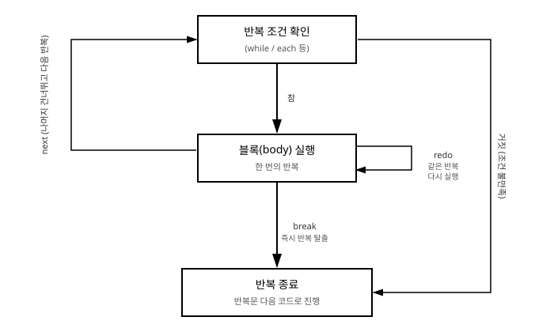

# 6장. 반복문

[◀ 이전: 5장. 제어문](ch05-제어문.md) | [📖 목차](00-목차.md) | [다음: 7장. 메서드 ▶](ch07-메서드.md)


5장에서는 조건에 따라 실행 경로를 나누는 방법을 배웠습니다. 이번 장에서는 같은 작업을 여러 번 되풀이하는 방법, 즉 반복문을 다룹니다. 로그 파일을 한 줄씩 읽어 처리하거나, 목록에 담긴 상품 가격을 모두 더하거나, 사용자가 올바른 값을 입력할 때까지 계속 물어보는 일들이 모두 반복문으로 표현됩니다. Ruby는 `while`, `until`, `for`, `loop`처럼 익숙한 형태의 반복문과 함께, `n.times`나 `each`처럼 정수·컬렉션에 블록을 넘겨 반복을 처리하는 독특한 방식도 함께 제공합니다. 이 장에서 다루는 내용은 7장 메서드에서 반복 작업을 메서드로 감싸는 방법, 12장 이터레이터와 Enumerable에서 컬렉션을 다루는 방법의 토대가 됩니다.

## 6.1 while 문

`while`은 조건이 참인 동안 블록을 반복해서 실행합니다. 조건은 매 반복이 시작될 때마다 다시 검사됩니다.

```ruby
count = 1

while count <= 5
  puts "카운트: #{count}"
  count += 1
end

puts "반복 종료"
```

실행 결과:

```
카운트: 1
카운트: 2
카운트: 3
카운트: 4
카운트: 5
반복 종료
```

`if`와 마찬가지로 조건식에 소괄호가 필요 없고, 블록의 끝은 `end`로 표시합니다. 조건이 처음부터 거짓이면 블록은 한 번도 실행되지 않습니다.

```ruby
n = 10
while n < 5
  puts "이 줄은 절대 출력되지 않습니다."
end
```

## 6.2 until 문

`until`은 `while`의 반대로, 조건이 **거짓인 동안** 블록을 반복합니다. "~할 때까지 반복한다"는 문장을 그대로 옮기고 싶을 때 `while !조건`보다 자연스럽게 읽힙니다.

```ruby
count = 1

until count > 5
  puts "카운트: #{count}"
  count += 1
end
```

이 코드는 앞서 본 `while count <= 5`와 완전히 같은 결과를 만들어 냅니다. 조건을 긍정문으로 표현했을 때와 부정문으로 표현했을 때 어느 쪽이 더 자연스럽게 읽히는지에 따라 `while`과 `until`을 선택하면 됩니다.

## 6.3 후위 while / until

실행할 코드가 한 줄뿐이라면 5장의 후위 `if`/`unless`처럼 `while`과 `until`도 뒤에 붙여 쓸 수 있습니다.

```ruby
i = 1
i += 1 while i < 10
puts i   # => 10

sum = 0
n = 1
sum += n while (n += 1) <= 100
```

한 가지 예외적인 규칙이 있습니다. `begin ... end`로 감싼 블록 뒤에 `while`이나 `until`을 붙이면, 조건을 먼저 검사하지 않고 블록을 **최소 한 번은 실행한 뒤** 조건을 검사합니다. 다른 언어의 `do-while`에 해당하는 동작입니다.

```ruby
number = 0

begin
  number += 1
  puts "현재 값: #{number}"
end while number < 3
```

이 코드는 조건 `number < 3`이 처음부터 거짓이더라도 `begin`과 `end` 사이의 코드를 한 번은 실행합니다. 사용자에게 값을 입력받고, 그 값이 유효한지 나중에 검사하는 상황(적어도 한 번은 입력을 받아야 하는 경우)에 유용합니다.

```ruby
begin
  print "1부터 10 사이의 숫자를 입력하세요: "
  number = gets.to_i
end while number < 1 || number > 10

puts "입력한 숫자: #{number}"
```

## 6.4 for 문과 잘 쓰이지 않는 이유

Ruby는 다른 언어에서 흔히 보는 `for` 반복문도 문법으로 제공합니다.

```ruby
for i in 1..5
  puts "i = #{i}"
end
```

`for 변수 in 컬렉션` 형태로 범위나 배열을 순회할 수 있어서 얼핏 보면 편리해 보입니다. 하지만 실제 Ruby 코드에서는 `for`를 거의 사용하지 않습니다. 가장 큰 이유는 **`for`가 새로운 스코프(변수 유효 범위)를 만들지 않는다**는 점입니다. `for`의 반복 변수와 블록 안에서 만든 지역 변수는 반복문이 끝난 뒤에도 바깥에서 그대로 접근할 수 있습니다.

```ruby
for n in 1..3
  doubled = n * 2
end

puts n        # => 3  (반복문 밖인데도 접근 가능)
puts doubled  # => 6  (마지막 반복에서 만들어진 값이 그대로 남아 있음)
```

반면 뒤에서 살펴볼 `each`처럼 블록을 사용하는 반복 방식은 블록마다 독립된 스코프를 새로 만들기 때문에, 블록 안에서 정의한 변수는 블록 밖에서 보이지 않습니다.

```ruby
(1..3).each do |m|
  tripled = m * 3
end

puts m         # NameError: undefined local variable or method 'm'
puts tripled   # NameError: undefined local variable or method 'tripled'
```

이런 "스코프가 새지 않는" 특성은 실수로 바깥의 변수를 덮어써 버리는 버그로 이어지기 쉽습니다. 예를 들어 반복문 바깥에 이미 `i`라는 변수가 있는 상태에서 `for i in ...`을 사용하면, 반복문이 끝난 뒤 바깥의 `i` 값이 조용히 바뀌어 있는 상황이 벌어질 수 있습니다. Ruby 커뮤니티에서는 이런 이유로 `for`보다 이어서 설명할 `each`, `times`, `upto` 같은 블록 기반 반복을 사용하는 것을 사실상의 표준으로 여깁니다. 이 책에서도 이후 장에서는 `for`를 사용하지 않고 블록 기반 반복만 사용합니다.

## 6.5 loop do ... end

종료 조건이 반복문 앞머리가 아니라 블록 중간에 있는 경우, 또는 몇 번 반복할지 미리 알 수 없는 경우에는 `loop`를 사용합니다. `loop`는 별도의 조건 없이 블록을 무한히 반복하며, 블록 안에서 `break`로 직접 빠져나와야 합니다.

```ruby
count = 0

loop do
  count += 1
  puts "시도 #{count}회"
  break if count >= 3
end

puts "종료"
```

`loop`는 파일을 끝까지 읽거나, 사용자가 종료를 원할 때까지 메뉴를 반복해서 보여 주는 상황에 자주 사용됩니다.

```ruby
answer = nil

loop do
  print "계속하시겠습니까? (y/n): "
  answer = gets.chomp

  break if answer == "y" || answer == "n"

  puts "y 또는 n만 입력해 주세요."
end

puts answer == "y" ? "계속 진행합니다." : "종료합니다."
```

12장에서 다시 다루겠지만, `loop`는 `StopIteration` 예외가 발생하면 자동으로 반복을 멈추고 조용히 빠져나오는 특별한 성질도 가지고 있습니다. 이 성질은 배열이나 파일의 각 원소를 하나씩 꺼내 오는 이터레이터(`Enumerator`)와 함께 사용할 때 특히 유용하며, 자세한 내용은 12장에서 다룹니다.

## 6.6 정수를 이용한 반복

Ruby에서는 정해진 횟수만큼 반복할 때 `while`보다 정수 객체의 메서드를 사용하는 방식이 훨씬 널리 쓰입니다. 이 방식들은 문법이 아니라 **블록을 인자로 받는 메서드 호출**이라는 점에서 지금까지 본 반복문과 근본적으로 다릅니다. 블록을 메서드에 넘기는 문법 자체는 11장 블록, 프로크, 람다에서 자세히 다루고, 여기서는 반복을 위한 쓰임새만 살펴봅니다.

**`n.times`**: 정확히 `n`번 반복합니다. 블록 매개변수로 `0`부터 `n - 1`까지의 값을 순서대로 넘겨줍니다.

```ruby
3.times do |i|
  puts "반복 #{i}"
end
```

실행 결과:

```
반복 0
반복 1
반복 2
```

**`upto`/`downto`**: 정수에서 시작해서 다른 정수까지 1씩 증가하거나 감소하며 반복합니다.

```ruby
1.upto(5) do |i|
  print "#{i} "
end
puts

5.downto(1) do |i|
  print "#{i} "
end
puts
```

실행 결과:

```
1 2 3 4 5
5 4 3 2 1
```

**`(범위).each`**: `Range` 객체에 `each`를 호출해 범위 안의 값을 순서대로 순회합니다. 8장에서 다룰 배열의 `each`와 같은 방식으로 동작하며, 실무에서 가장 널리 쓰이는 형태입니다.

```ruby
(1..5).each do |i|
  print "#{i} "
end
puts
```

일정 간격을 두고 증가시키고 싶다면 `step` 메서드를 사용할 수도 있습니다.

```ruby
1.step(10, 2) do |i|
  print "#{i} "
end
puts
# => 1 3 5 7 9
```

같은 결과를 얻는 방법이 이렇게 여러 가지인 이유는, 각 메서드가 표현하는 "의도"가 조금씩 다르기 때문입니다. 단순히 몇 번 반복할지가 중요하다면 `times`가, 특정 범위의 값 자체가 필요하다면 `upto`/`downto`나 `each`가 코드의 의도를 더 분명하게 드러냅니다.

## 6.7 break, next, redo

블록이나 반복문 안에서 흐름을 제어하는 세 가지 키워드가 있습니다. 겉보기에는 비슷해 보이지만 동작이 뚜렷하게 다르므로 구분해서 알아 두어야 합니다.



**`break`**: 반복문 전체를 즉시 빠져나갑니다. 남은 반복은 모두 건너뛰고 반복문 다음 코드로 이동합니다.

```ruby
(1..10).each do |i|
  break if i > 3
  puts "i = #{i}"
end
puts "반복 종료"
```

실행 결과:

```
i = 1
i = 2
i = 3
반복 종료
```

`break`에는 값을 함께 지정할 수 있으며, 그 값이 반복문 전체의 결과값이 됩니다.

```ruby
result = (1..Float::INFINITY).each do |i|
  break i * i if i > 4
end

puts result   # => 25
```

**`next`**: 현재 반복만 건너뛰고 다음 반복으로 넘어갑니다. 반복문 자체는 계속됩니다.

```ruby
(1..10).each do |i|
  next if i.odd?
  puts "짝수: #{i}"
end
```

실행 결과:

```
짝수: 2
짝수: 4
짝수: 6
짝수: 8
짝수: 10
```

**`redo`**: 다음 반복으로 넘어가지 않고, **현재 반복을 처음부터 다시 실행**합니다. 조건을 다시 검사하지도, 다음 원소로 넘어가지도 않고 같은 자리에서 블록만 다시 돕니다. 사용 빈도는 셋 중 가장 낮지만, 예를 들어 사용자의 입력이 잘못되었을 때 같은 단계를 반복시키는 상황에 쓸 수 있습니다.

```ruby
attempts = 0

[1, 2, 3].each do |i|
  attempts += 1
  puts "항목 #{i} 처리 시도 (누적 시도 #{attempts}회)"

  if i == 2 && attempts < 5
    puts "  -> 실패, 같은 항목을 다시 시도합니다."
    redo
  end
end
```

이 코드는 `i`가 2일 때 `attempts`가 5에 도달할 때까지 같은 항목(`i == 2`)을 반복해서 처리하려 시도합니다. `redo`는 종료 조건을 스스로 마련해 두지 않으면 무한 반복에 빠지기 쉬우므로, 반드시 반복을 끝낼 수 있는 조건을 함께 넣어 주어야 합니다.

세 키워드를 표로 정리하면 다음과 같습니다.

| 키워드 | 동작 |
|---|---|
| `break` | 반복문 전체를 종료하고 빠져나감 |
| `next` | 현재 반복만 건너뛰고 다음 반복으로 진행 |
| `redo` | 다음 반복으로 넘어가지 않고 현재 반복을 다시 실행 |

## 6.8 다음 장으로

이 장에서 본 `n.times`, `upto`, `downto`, `each`는 사실 특별한 문법이 아니라 정수나 범위 객체가 제공하는 **메서드**이며, `do ... end`로 감싼 부분은 그 메서드에 전달되는 **블록**입니다. 메서드를 직접 정의하는 방법은 7장에서, 블록을 받는 메서드를 스스로 만드는 방법은 11장에서 다룹니다. 그리고 배열, 해시 같은 컬렉션을 순회하는 `each`, `map`, `select` 같은 메서드들이 모여 있는 `Enumerable` 모듈은 12장에서 본격적으로 다룹니다. 이 장에서 익힌 반복의 기본 개념은 앞으로 이어지는 여러 장에서 계속 사용되니 잘 기억해 두기 바랍니다.

## 요약

- `while`은 조건이 참인 동안, `until`은 조건이 거짓인 동안 블록을 반복합니다.
- 실행할 코드가 한 줄이면 후위 `while`/`until`로 짧게 쓸 수 있고, `begin ... end while 조건`은 블록을 최소 한 번 실행한 뒤 조건을 검사합니다.
- `for` 문은 반복 변수와 내부 변수가 바깥 스코프로 새어 나가기 때문에 실수를 유발하기 쉬워, Ruby에서는 `each` 같은 블록 기반 반복을 대신 사용하는 것이 관례입니다.
- `loop do ... end`는 조건 없이 반복하다가 블록 안의 `break`로 빠져나오는 형태로, 종료 조건이 반복 중간에 있을 때 적합합니다.
- `n.times`, `upto`/`downto`, `(범위).each`는 모두 블록을 받는 메서드 호출이며, 표현하려는 의도에 따라 골라 쓸 수 있습니다.
- `break`는 반복문 전체를 종료하고, `next`는 현재 반복만 건너뛰며, `redo`는 현재 반복을 처음부터 다시 실행합니다.

## 연습문제

1. `while`을 사용해 1부터 100까지의 합을 구하는 코드를 작성하고, 같은 결과를 `(1..100).each`로 다시 작성해 보세요.
2. `loop do ... end`와 `break`를 사용해, 난수를 하나씩 생성하다가 처음으로 90 이상인 값이 나오면 그 값을 출력하고 멈추는 코드를 작성하세요. (`rand(100)`으로 0~99 사이의 난수를 만들 수 있습니다.)
3. 1부터 30까지의 정수 중 3의 배수는 건너뛰고(`next` 사용), 20을 넘으면 반복을 멈추는(`break` 사용) 코드를 `(1..30).each`로 작성하세요.
4. 다음 코드를 실행하면 어떤 결과가 나올지 예상해 보고, 실제로 실행해서 확인하세요. 그리고 `for` 대신 `each`를 사용하도록 고쳐 보세요.

   ```ruby
   for i in 1..3
   end
   puts "반복이 끝난 뒤 i = #{i}"
   ```

5. `n.times`, `1.upto(n)`, `(1..n).each` 세 가지 방법으로 각각 1부터 `n`까지의 곱(팩토리얼)을 구하는 코드를 작성하고, 세 방식의 결과가 같은지 비교해 보세요.

---

[◀ 이전: 5장. 제어문](ch05-제어문.md) | [📖 목차](00-목차.md) | [다음: 7장. 메서드 ▶](ch07-메서드.md)
