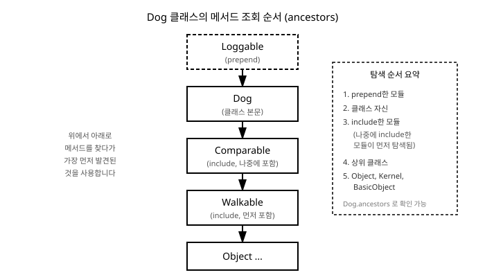

# 10장. 상속과 모듈(Mixin)

[◀ 이전: 9장. 클래스와 객체](ch09-클래스와객체.md) | [📖 목차](00-목차.md) | [다음: 11장. 블록, 프로크, 람다 ▶](ch11-블록프로크람다.md)


## 이 장에서 배울 내용

9장에서는 클래스로 데이터와 동작을 하나로 묶는 방법을 배웠습니다. 그런데 실제로 클래스를 만들다 보면 서로 비슷한 클래스를 여러 개 정의해야 하는 상황을 자주 만납니다. "고양이"와 "개"는 둘 다 "동물"이 가진 공통 특성(이름, 먹기, 잠자기)을 가지면서 각자 고유한 특성(고양이는 야옹, 개는 멍멍)도 가집니다. 이런 공통점과 차이점을 효율적으로 표현하는 방법이 바로 **상속(inheritance)**입니다.

한편 상속만으로는 해결하기 어려운 문제도 있습니다. "날 수 있는 능력"은 새와 곤충과 드론이 공유하지만, 이들을 하나의 상속 계층으로 묶기는 어색합니다. 이럴 때 Ruby는 **모듈(module)**을 이용한 **믹스인(mixin)**이라는 독특한 해결책을 제공합니다. 이 장에서는 클래스 상속과 모듈 믹스인을 모두 다루면서, 언제 어떤 도구를 선택해야 하는지 감을 잡아 봅니다.

## 클래스 상속

### 상속의 기본 문법

Ruby에서 클래스 상속은 `<` 기호로 표현합니다. `class Dog < Animal`은 "`Dog`는 `Animal`을 상속한다"는 뜻이며, `Dog`는 `Animal`의 모든 메서드를 그대로 물려받습니다.

```ruby
class Animal
  attr_reader :name

  def initialize(name)
    @name = name
  end

  def eat
    "#{@name}이(가) 밥을 먹습니다."
  end

  def sleep
    "#{@name}이(가) 잠을 잡니다."
  end
end

class Dog < Animal
  def bark
    "#{@name}: 멍멍!"
  end
end

class Cat < Animal
  def meow
    "#{@name}: 야옹!"
  end
end

buddy = Dog.new("버디")
puts buddy.eat   #=> 버디이(가) 밥을 먹습니다.
puts buddy.bark  #=> 버디: 멍멍!

nabi = Cat.new("나비")
puts nabi.eat    #=> 나비이(가) 밥을 먹습니다.
puts nabi.meow   #=> 나비: 야옹!
```

`Animal`을 **부모 클래스(슈퍼클래스, superclass)**, `Dog`와 `Cat`을 **자식 클래스(서브클래스, subclass)**라고 부릅니다. `Dog`는 `initialize`, `eat`, `sleep`을 따로 정의하지 않았지만 `Animal`로부터 물려받았기 때문에 그대로 사용할 수 있습니다. 대신 `Dog`와 `Cat`만의 고유한 행동(`bark`, `meow`)은 각 클래스에 따로 정의합니다.

이렇게 여러 클래스에 공통되는 데이터와 동작을 부모 클래스로 뽑아내면 같은 코드를 반복해서 작성하지 않아도 됩니다.

### super로 부모 메서드 호출하기

자식 클래스에서 부모 클래스와 같은 이름의 메서드를 정의하면 부모의 메서드를 **오버라이드(override)**, 즉 재정의하게 됩니다. 이때 부모의 원래 동작을 완전히 버리지 않고 그 위에 추가 동작을 얹고 싶다면 `super`를 사용합니다.

```ruby
class Animal
  attr_reader :name, :sound

  def initialize(name)
    @name = name
    @sound = "..."
  end

  def introduce
    "저는 #{@name}입니다."
  end
end

class Dog < Animal
  def initialize(name, breed)
    super(name)          # Animal#initialize(name)을 호출
    @breed = breed
    @sound = "멍멍"
  end

  def introduce
    super() + " 품종은 #{@breed}이고, 소리는 #{@sound}입니다."
  end
end

buddy = Dog.new("버디", "진돗개")
puts buddy.introduce
#=> 저는 버디입니다. 품종은 진돗개이고, 소리는 멍멍입니다.
```

`super`는 세 가지 방식으로 쓸 수 있습니다.

```ruby
super       # 현재 메서드가 받은 인자를 그대로 부모 메서드에 전달
super()     # 인자 없이 부모 메서드 호출
super(name) # 지정한 인자만 부모 메서드에 전달
```

인자를 명시하지 않은 `super`는 현재 메서드의 인자를 자동으로 그대로 전달한다는 점에서 `super()`와 다르므로 주의해야 합니다. 자식 클래스의 `initialize`에서 `super(name)`을 호출하면 부모의 `initialize`가 먼저 실행되어 `@name`이 설정된 뒤, 이어서 자식 클래스만의 초기화(`@breed`, `@sound` 설정)가 이루어집니다.

### 모든 클래스는 Object를 상속한다

Ruby에서 명시적으로 부모를 지정하지 않은 클래스는 자동으로 `Object` 클래스를 상속합니다. 즉, 9장에서 만든 `BankAccount` 클래스도 사실은 `class BankAccount < Object`와 다르지 않습니다. `to_s`, `inspect`, `class`, `respond_to?`처럼 모든 객체에서 공통으로 쓸 수 있었던 메서드들이 바로 `Object`(그리고 그 조상인 `Kernel`, `BasicObject`)로부터 물려받은 것입니다.

```ruby
Dog.ancestors #=> [Dog, Animal, Object, Kernel, BasicObject]
```

`ancestors` 메서드는 어떤 클래스가 메서드를 찾을 때 거쳐 가는 순서를 배열로 보여줍니다. 이 순서는 잠시 후 모듈을 다룰 때 다시 살펴보겠습니다.

## 모듈이란 무엇인가

모듈은 `class` 대신 `module` 키워드로 정의합니다. 클래스와 비슷해 보이지만 결정적인 차이가 있습니다. **모듈은 인스턴스를 만들 수 없습니다.** 즉 `MyModule.new`는 불가능합니다. 모듈은 다음 두 가지 용도로 사용됩니다.

### 용도 1: 네임스페이스

이름이 겹칠 수 있는 클래스나 상수를 묶어서 구분하는 용도입니다. 예를 들어 결제 관련 코드와 알림 관련 코드에 각각 `Error`라는 클래스가 필요하다면, 모듈로 감싸서 이름 충돌을 피할 수 있습니다.

```ruby
module Payment
  class Error < StandardError; end

  class Processor
    def charge(amount)
      raise Error, "금액은 0보다 커야 합니다" if amount <= 0
      "#{amount}원 결제 완료"
    end
  end
end

module Notification
  class Error < StandardError; end
end

Payment::Processor.new.charge(1_000) #=> "1000원 결제 완료"
Payment::Error       #=> Payment::Error
Notification::Error  #=> Notification::Error
```

`::`(콜론 두 개)는 모듈이나 클래스에 속한 것을 참조할 때 사용하는 **범위 지정 연산자(scope resolution operator)**입니다. `Payment::Error`와 `Notification::Error`는 이름은 같은 `Error`지만 서로 다른 네임스페이스에 속한 완전히 다른 클래스입니다.

### 용도 2: 믹스인(Mixin)

모듈의 두 번째 용도이자 이 장의 핵심 주제는, 여러 클래스에 공통 기능을 나눠주는 **믹스인**입니다. 상속은 "부모 하나"만 가질 수 있지만, 모듈은 한 클래스에 여러 개를 섞어 넣을 수 있습니다. 다음 절부터 이를 자세히 다룹니다.

## include, extend, prepend의 차이

모듈을 클래스에 섞어 넣는 방법은 세 가지가 있으며, 각각 메서드가 추가되는 위치와 방식이 다릅니다.

### include: 인스턴스 메서드로 추가

`include`는 모듈에 정의된 메서드를 그 클래스의 **인스턴스 메서드**로 추가합니다.

```ruby
module Walkable
  def walk
    "#{name}이(가) 걷습니다."
  end
end

class Person
  include Walkable

  attr_reader :name

  def initialize(name)
    @name = name
  end
end

yuna = Person.new("윤아")
puts yuna.walk #=> 윤아이(가) 걷습니다.
```

`Walkable` 모듈은 `Person`의 인스턴스인 `yuna`가 `walk` 메서드를 호출할 수 있게 해줍니다. 마치 `Walkable`이 `Person`의 부모 클래스인 것처럼 동작하지만, `Person`은 여전히 다른 클래스를 상속할 수도 있고 다른 모듈을 더 `include`할 수도 있습니다.

### extend: 클래스 메서드로 추가

`extend`는 모듈의 메서드를 인스턴스가 아니라 **그 객체 자체(또는 클래스 자체)**의 메서드로 추가합니다. 클래스에 `extend`를 사용하면 모듈의 메서드가 클래스 메서드가 됩니다.

```ruby
module Findable
  def find_by_name(name)
    "이름이 #{name}인 레코드를 찾습니다."
  end
end

class Product
  extend Findable
end

Product.find_by_name("노트북") #=> "이름이 노트북인 레코드를 찾습니다."
p = Product.new
p.find_by_name("노트북") #=> NoMethodError
```

같은 `Findable` 모듈이라도 `include`했다면 `find_by_name`은 인스턴스 메서드가 되어 `p.find_by_name`처럼 호출해야 했을 것입니다. `extend`했기 때문에 `Product.find_by_name`처럼 클래스 메서드로 호출합니다. 9장에서 클래스 메서드를 정의할 때 `def self.메서드`를 사용했는데, 여러 클래스가 비슷한 클래스 메서드 집합을 공유해야 한다면 `def self.` 대신 모듈을 만들어 `extend`하는 방법으로 중복을 줄일 수 있습니다.

참고로 `extend`는 클래스뿐 아니라 일반 객체 하나에도 적용할 수 있습니다.

```ruby
greeting = "안녕하세요"

module Loud
  def shout
    upcase + "!!!"
  end
end

greeting.extend(Loud)
puts greeting.shout #=> 안녕하세요!!! (대문자 개념이 없는 한글이라 upcase는 원문 유지)
```

이 경우 `Loud`의 `shout` 메서드는 `greeting`이라는 객체 하나에만 추가되며, 다른 문자열 객체에는 영향을 주지 않습니다.

### prepend: 메서드 조회 순서의 맨 앞에 끼워넣기

`prepend`는 `include`와 겉보기엔 비슷하지만 메서드를 찾는 순서(ancestors chain)에서 차지하는 위치가 다릅니다. `include`한 모듈은 클래스 **본문보다 뒤에** 배치되어, 클래스에 같은 이름의 메서드가 있으면 클래스의 메서드가 먼저 사용됩니다. 반면 `prepend`한 모듈은 클래스 **본문보다 앞에** 배치되어, 모듈의 메서드가 클래스의 메서드보다 먼저 사용됩니다.

```ruby
module Loggable
  def deposit(amount)
    puts "[로그] #{amount}원 입금 시도"
    super
  end
end

class BankAccount
  prepend Loggable

  attr_reader :balance

  def initialize(balance = 0)
    @balance = balance
  end

  def deposit(amount)
    @balance += amount
  end
end

account = BankAccount.new
account.deposit(1_000)
#=> [로그] 1000원 입금 시도
puts account.balance #=> 1000
```

`account.deposit(1_000)`을 호출하면 Ruby는 먼저 `Loggable`의 `deposit`을 찾아 실행합니다. 그 안의 `super`가 `BankAccount`에 정의된 원래 `deposit`을 호출합니다. 만약 `prepend` 대신 `include`를 사용했다면 `BankAccount`에 정의된 `deposit`이 먼저 발견되어 `Loggable`의 `deposit`은 아예 호출되지 않았을 것입니다. `prepend`는 기존 메서드를 감싸서 실행 전후에 로깅, 유효성 검사, 성능 측정 같은 부가 기능을 끼워 넣고 싶을 때 유용합니다.

### 세 가지 비교

| 구분 | 메서드가 추가되는 곳 | ancestors에서의 위치 | 주 용도 |
|---|---|---|---|
| `include` | 인스턴스 메서드 | 클래스 뒤 | 인스턴스에 공통 동작 추가 |
| `extend` | 클래스(또는 객체) 자신의 메서드 | (클래스의 특이 메서드 목록에 추가) | 클래스 메서드 또는 특정 객체의 메서드 추가 |
| `prepend` | 인스턴스 메서드 | 클래스 앞 | 기존 메서드를 감싸는 후킹 |

## Ruby가 다중 상속 대신 모듈을 쓰는 이유

C++ 같은 언어는 클래스가 부모를 여러 개 가지는 **다중 상속(multiple inheritance)**을 허용합니다. 하지만 다중 상속은 심각한 모호함을 낳을 수 있습니다. 예를 들어 클래스 `C`가 `A`와 `B`를 동시에 상속하는데 `A`와 `B`가 똑같은 이름의 메서드를 서로 다르게 정의하고 있다면, `C`의 인스턴스가 그 메서드를 호출했을 때 어느 쪽이 실행되어야 할까요? 이를 **다이아몬드 문제(diamond problem)**라고 부르며, 언어마다 이를 해결하기 위한 복잡한 규칙을 두어야 합니다.

Ruby는 이 문제를 원천적으로 피하기 위해 **클래스는 부모를 단 하나만 가질 수 있다**는 단순한 규칙(단일 상속)을 고수합니다. 대신 "여러 곳에서 공통 기능을 재사용하고 싶다"는 다중 상속의 진짜 목적은 모듈 믹스인으로 해결합니다.

모듈은 클래스가 아니므로 상속 계층의 "부모" 자리를 놓고 경쟁하지 않습니다. 클래스는 하나의 부모 클래스를 가지면서 동시에 원하는 만큼 여러 모듈을 `include`할 수 있고, Ruby는 이렇게 쌓인 모듈들을 앞서 살펴본 `ancestors`의 순서(나중에 include한 모듈이 먼저 탐색됨)에 따라 명확하게 줄을 세우기 때문에 모호함이 생기지 않습니다.

```ruby
class Dog
  prepend Loggable
  include Walkable
  include Swimmable
end

Dog.ancestors
#=> [Loggable, Dog, Swimmable, Walkable, Object, Kernel, BasicObject]
```

이처럼 상속은 "이것은 저것의 한 종류이다(is-a)"라는 명확한 관계 하나만 표현하고, 공통 능력의 재사용은 모듈이 담당하도록 역할을 나눈 것이 Ruby의 설계 철학입니다. "날 수 있다", "헤엄칠 수 있다"처럼 서로 무관한 클래스들이 공유하는 능력은 모듈로 표현하고, 필요한 클래스에 자유롭게 믹스인하면 됩니다.

아래 그림은 `prepend`한 모듈, 클래스 자신, `include`한 모듈들이 실제로 어떤 순서로 메서드 조회 대상이 되는지를 보여줍니다.



## 표준 모듈 믹스인하기: Comparable과 Enumerable

Ruby 표준 라이브러리에는 믹스인으로 사용하도록 설계된 모듈이 여럿 있습니다. 그중 가장 널리 쓰이는 두 가지가 `Comparable`과 `Enumerable`입니다. 두 모듈의 공통점은, 클래스가 딱 하나의 핵심 메서드만 정의해 주면 나머지 풍부한 기능들을 공짜로 얻는다는 점입니다.

### Comparable: <=>만 정의하면 비교 연산자를 모두 얻는다

`Comparable`을 `include`하려면 클래스에 `<=>`(비교 연산자, "우주선 연산자"라고도 부릅니다) 메서드 하나만 정의하면 됩니다. `<=>`는 왼쪽이 오른쪽보다 작으면 `-1`, 같으면 `0`, 크면 `1`을 반환하도록 정의합니다.

```ruby
class Money
  include Comparable

  attr_reader :amount

  def initialize(amount)
    @amount = amount
  end

  def <=>(other)
    amount <=> other.amount
  end

  def to_s
    "#{amount}원"
  end
end

a = Money.new(1_000)
b = Money.new(2_000)
c = Money.new(2_000)

a < b   #=> true
a > b   #=> false
b == c  #=> true
b.between?(a, Money.new(3_000)) #=> true
[b, a, c].sort.map(&:to_s) #=> ["1000원", "2000원", "2000원"]
[a, b, c].max.to_s          #=> "2000원"
```

`<=>` 딱 하나만 정의했을 뿐인데 `<`, `<=`, `>`, `>=`, `==`, `between?`, `clamp`, 그리고 배열의 `sort`, `min`, `max`까지 모두 자연스럽게 동작합니다. 이것이 믹스인의 힘입니다. `Comparable` 모듈은 "너는 `<=>`만 알려줘, 비교와 관련된 나머지 메서드는 내가 다 만들어 줄게"라는 계약을 맺는 셈입니다.

### Enumerable: each만 정의하면 순회 메서드를 모두 얻는다

`Enumerable`도 원리가 같습니다. 클래스에 `each` 메서드 하나만 제대로 정의해 두면 `map`, `select`, `reduce`, `sort`, `count`, `find` 같은 수십 개의 메서드를 그대로 사용할 수 있습니다. (`each`와 `Enumerable`의 관계는 12장에서 이터레이터를 본격적으로 다룰 때 더 자세히 살펴봅니다.)

```ruby
class Playlist
  include Enumerable

  def initialize
    @songs = []
  end

  def add(song)
    @songs << song
    self
  end

  def each
    @songs.each { |song| yield song }
  end
end

playlist = Playlist.new
playlist.add("좋은 날").add("밤편지").add("고백")

playlist.map(&:upcase)          #=> ["좋은 날", "밤편지", "고백"] (한글이라 upcase는 원문 유지)
playlist.select { |s| s.include?("편지") } #=> ["밤편지"]
playlist.count                  #=> 3
playlist.first                  #=> "좋은 날"
```

`Playlist` 클래스는 배열도 해시도 아니지만, `each`만 정의해 주었기 때문에 8장에서 배열에 사용했던 것과 똑같은 방식으로 `map`, `select`, `count`를 자유롭게 사용할 수 있습니다. 자신만의 컬렉션 클래스를 만들 때 `Enumerable`을 믹스인하면 Ruby가 기본으로 제공하는 배열, 해시와 똑같이 자연스러운 사용감을 줄 수 있습니다.

## 요약

- 클래스 상속은 `class Dog < Animal`처럼 `<`로 표현하며, 자식 클래스는 부모 클래스의 메서드를 그대로 물려받습니다.
- `super`는 부모 클래스의 같은 이름 메서드를 호출합니다. 인자 없는 `super`는 현재 메서드의 인자를 그대로 전달하고, `super()`는 인자 없이 호출합니다.
- 모듈은 인스턴스를 만들 수 없으며, 이름 충돌을 막는 네임스페이스 또는 여러 클래스에 기능을 나눠주는 믹스인으로 사용됩니다.
- `include`는 모듈의 메서드를 인스턴스 메서드로, `extend`는 클래스(또는 객체) 자신의 메서드로 추가합니다. `prepend`는 메서드 조회 순서에서 클래스보다 앞에 위치해 기존 메서드를 감싸는 데 사용됩니다.
- Ruby는 다이아몬드 문제를 피하기 위해 클래스의 다중 상속을 허용하지 않는 대신, 여러 모듈을 자유롭게 믹스인할 수 있게 하여 코드 재사용과 명확한 조회 순서를 동시에 확보합니다.
- `<=>`만 정의하고 `Comparable`을 include하면 모든 비교 연산자를, `each`만 정의하고 `Enumerable`을 include하면 `map`, `select` 등 풍부한 순회 메서드를 얻을 수 있습니다.

## 연습문제

1. `Vehicle` 클래스를 만들고 `speed_up`, `brake` 메서드를 정의하세요. 이를 상속하는 `Car`와 `Bicycle` 클래스를 만들어 각각 고유한 메서드(`Car`는 `honk`, `Bicycle`은 `ring_bell`)를 추가하세요.

2. 1번의 `Car` 클래스에서 `initialize`를 재정의하여 `super`로 부모의 초기화를 호출한 뒤 `fuel`이라는 인스턴스 변수를 추가로 설정하세요.

3. `Flyable`이라는 모듈을 만들어 `fly` 메서드를 정의하고, 이를 `Bird` 클래스와 `Airplane` 클래스에 각각 `include`하세요. 두 클래스는 상속 관계가 없어도 됨을 확인하세요.

4. `include`, `extend`, `prepend`의 차이를 자신의 언어로 설명하고, 각각을 사용하기에 적합한 상황을 하나씩 예로 드세요.

5. `Temperature` 클래스를 만들어 섭씨 온도를 저장하고, `<=>`를 정의한 뒤 `Comparable`을 include하여 온도끼리 `<`, `>`, `sort`가 동작하게 만드세요.

---

[◀ 이전: 9장. 클래스와 객체](ch09-클래스와객체.md) | [📖 목차](00-목차.md) | [다음: 11장. 블록, 프로크, 람다 ▶](ch11-블록프로크람다.md)
