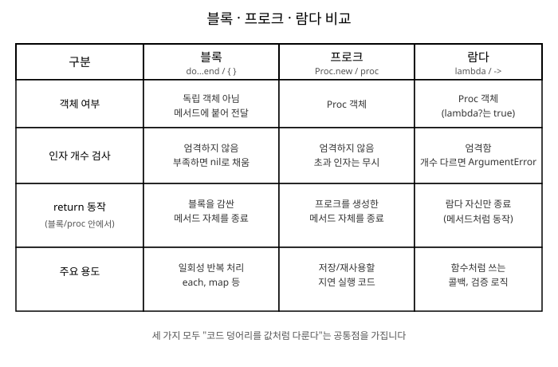

# 11장. 블록, 프로크, 람다

[◀ 이전: 10장. 상속과 모듈(Mixin)](ch10-상속과모듈.md) | [📖 목차](00-목차.md) | [다음: 12장. 이터레이터와 Enumerable ▶](ch12-이터레이터와Enumerable.md)


지금까지 배운 메서드는 이름을 가지고 있었습니다. `def`로 정의하고, 이름을 불러서 실행했습니다. 그런데 Ruby에서는 이름 없는 코드 덩어리, 즉 "코드 자체를 값처럼 주고받는" 방법이 있습니다. 바로 블록, 프로크, 람다입니다.

이 세 가지는 처음 Ruby를 배우는 사람에게 가장 혼란스러운 주제 중 하나입니다. 겉모습도 비슷하고 역할도 비슷하기 때문입니다. 하지만 차이를 이해하고 나면 Ruby 코드가 왜 그런 식으로 쓰이는지, 왜 `each`나 `map` 뒤에 `{ }`가 붙는지 명확하게 보이기 시작합니다.

## 블록이란 무엇인가

블록은 메서드에 전달할 수 있는 코드 덩어리입니다. 이미 6장에서 반복문을 배우며 여러 번 사용했습니다.

```ruby
3.times do |i|
  puts "안녕하세요, #{i}번째 인사입니다"
end

[1, 2, 3].each { |n| puts n * 2 }
```

블록은 두 가지 형태로 작성할 수 있습니다.

- `do...end` — 여러 줄로 이루어진 블록에 주로 사용합니다.
- `{ }` — 한 줄짜리 짧은 블록에 주로 사용합니다.

두 형태는 기능적으로 동일하지만, 관례적으로 줄 수에 따라 나누어 씁니다.

```ruby
# 짧은 블록: 중괄호
numbers = [1, 2, 3, 4, 5]
doubled = numbers.map { |n| n * 2 }

# 긴 블록: do...end
numbers.each do |n|
  square = n * n
  puts "#{n}의 제곱은 #{square}입니다"
end
```

중요한 점은 블록 자체가 독립적인 객체가 아니라는 것입니다. 블록은 메서드 호출에 "붙어서" 전달되는 코드 조각일 뿐이며, 변수에 담아 따로 저장할 수 없습니다.

```ruby
# 이렇게는 할 수 없습니다
my_block = { puts "hello" }  # 문법 오류
```

블록을 값으로 다루고 싶다면 프로크나 람다로 바꿔야 하는데, 이는 뒤에서 다룹니다.

## yield로 블록 호출하기

메서드 안에서 `yield` 키워드를 사용하면, 그 메서드를 호출할 때 함께 전달된 블록을 실행할 수 있습니다.

```ruby
def greet
  puts "인사를 시작합니다"
  yield
  puts "인사를 마쳤습니다"
end

greet do
  puts "안녕하세요!"
end
```

실행 결과는 다음과 같습니다.

```
인사를 시작합니다
안녕하세요!
인사를 마쳤습니다
```

`yield`는 마치 블록이 그 자리에 있는 것처럼 실행합니다. 즉 `greet` 메서드는 "언제 인사말을 출력할지"만 정하고, "무엇을 인사할지"는 블록을 호출하는 쪽에 맡기는 것입니다. 이것이 블록의 핵심 용도입니다. 메서드의 실행 흐름은 메서드가 정하고, 구체적인 내용은 호출하는 쪽이 채워 넣습니다.

`yield`에 인자를 넘길 수도 있습니다.

```ruby
def repeat_twice
  yield 1
  yield 2
end

repeat_twice do |count|
  puts "#{count}번째 실행입니다"
end
```

7장에서 배운 메서드 정의와 결합하면, 다음처럼 배열을 순회하며 각 요소를 블록에 넘겨주는 나만의 이터레이터를 만들 수도 있습니다.

```ruby
def my_each(array)
  index = 0
  while index < array.length
    yield array[index]
    index += 1
  end
end

my_each([10, 20, 30]) do |value|
  puts "값: #{value}"
end
```

이 `my_each`는 Ruby 표준 라이브러리의 `each`와 똑같이 동작합니다. 12장에서 살펴볼 `Enumerable` 모듈의 수많은 메서드도 결국 이런 방식으로 `yield`를 활용해 구현되어 있습니다.

## block_given?로 블록 유무 확인하기

`yield`는 블록이 전달되지 않은 상태에서 호출하면 `LocalJumpError`를 발생시킵니다.

```ruby
def greet
  yield
end

greet  # LocalJumpError: no block given (yield)
```

블록이 선택 사항이길 원한다면, `block_given?` 메서드로 블록이 전달되었는지 미리 확인할 수 있습니다.

```ruby
def greet
  if block_given?
    yield
  else
    puts "기본 인사말입니다"
  end
end

greet                      # 기본 인사말입니다
greet { puts "반갑습니다" }  # 반갑습니다
```

`block_given?`을 활용하면 블록이 있을 때와 없을 때 서로 다른 동작을 하는 유연한 메서드를 만들 수 있습니다. 예를 들어 다음 메서드는 블록이 주어지면 각 요소를 가공해서 반환하고, 그렇지 않으면 원본 배열을 그대로 반환합니다.

```ruby
def process(array)
  if block_given?
    array.map { |item| yield item }
  else
    array
  end
end

puts process([1, 2, 3]).inspect               # [1, 2, 3]
puts process([1, 2, 3]) { |n| n * 10 }.inspect  # [10, 20, 30]
```

## 프로크: 블록을 객체로 만들기

블록은 값으로 저장할 수 없다고 했습니다. 하지만 블록을 `Proc` 객체로 감싸면 변수에 저장하고, 여기저기 전달하고, 나중에 실행할 수 있습니다.

프로크를 만드는 방법은 두 가지입니다.

```ruby
add_proc = Proc.new { |a, b| a + b }
multiply_proc = proc { |a, b| a * b }

puts add_proc.call(3, 4)      # 7
puts multiply_proc.call(3, 4) # 12
```

`Proc.new`와 `proc`은 거의 동일하게 동작합니다. `proc`은 `Proc.new`를 간단히 부르는 방법으로, 최신 Ruby에서는 `proc`을 사용하는 것이 더 일반적입니다.

프로크는 `.call`, `.()`, `[]` 세 가지 방식으로 호출할 수 있습니다.

```ruby
say_hello = proc { |name| puts "안녕하세요, #{name}님" }

say_hello.call("지훈")
say_hello.("지훈")
say_hello["지훈"]
```

프로크가 유용한 이유는 변수에 담아 메서드의 인자로 넘기거나, 메서드의 반환값으로 돌려줄 수 있기 때문입니다.

```ruby
def build_greeting(prefix)
  proc { |name| "#{prefix}, #{name}님!" }
end

morning_greeting = build_greeting("좋은 아침입니다")
puts morning_greeting.call("영희")  # 좋은 아침입니다, 영희님!
```

메서드에 블록을 전달할 때 `&`를 붙이면, 블록을 프로크로 변환해서 받을 수도 있습니다.

```ruby
def run_twice(&block)
  block.call
  block.call
end

run_twice { puts "실행!" }
```

반대로 이미 만들어진 프로크를 `&`로 블록처럼 넘길 수도 있습니다.

```ruby
square = proc { |n| n * n }
puts [1, 2, 3].map(&square).inspect  # [1, 4, 9]
```

## 람다: 좀 더 엄격한 프로크

람다는 프로크의 일종이지만, 좀 더 메서드에 가깝게 동작하도록 만들어진 형태입니다. 두 가지 문법으로 만들 수 있습니다.

```ruby
add_lambda = lambda { |a, b| a + b }
multiply_lambda = ->(a, b) { a * b }

puts add_lambda.call(3, 4)      # 7
puts multiply_lambda.call(3, 4) # 12
```

`->(...) { ... }` 형태를 "스택비 화살표(stabby lambda)" 문법이라고 부르며, 짧은 람다를 작성할 때 널리 쓰입니다.

```ruby
greet = ->(name) { "안녕, #{name}!" }
puts greet.call("민수")
puts greet.("민수")
puts greet["민수"]
```

람다도 `Proc` 클래스의 인스턴스입니다. 다만 `lambda?` 메서드로 일반 프로크와 구분할 수 있습니다.

```ruby
p1 = proc { |a, b| a }
l1 = lambda { |a, b| a }

puts p1.lambda?  # false
puts l1.lambda?  # true
```

## 프로크와 람다의 차이

프로크와 람다는 겉으로는 비슷해 보이지만, 두 가지 결정적인 차이가 있습니다.

### 인자 개수 검사

프로크는 인자 개수가 맞지 않아도 너그럽게 넘어갑니다. 부족한 인자는 `nil`로 채우고, 초과한 인자는 무시합니다.

```ruby
loose_proc = proc { |a, b| [a, b] }
puts loose_proc.call(1).inspect        # [1, nil]
puts loose_proc.call(1, 2, 3).inspect  # [1, 2]
```

반면 람다는 메서드처럼 인자 개수를 엄격하게 검사합니다. 개수가 맞지 않으면 `ArgumentError`를 발생시킵니다.

```ruby
strict_lambda = lambda { |a, b| [a, b] }
puts strict_lambda.call(1, 2).inspect  # [1, 2]
strict_lambda.call(1)                  # ArgumentError: wrong number of arguments
```

### return의 동작

가장 중요한 차이는 `return`을 만났을 때의 동작입니다.

람다 안에서의 `return`은 그 람다 자신만 종료시키고, 값을 반환합니다. 메서드의 `return`과 똑같이 동작한다고 생각하면 됩니다.

```ruby
def use_lambda
  l = lambda { return 10 }
  result = l.call
  puts "람다 호출 후에도 이 줄이 실행됩니다"
  result
end

puts use_lambda  # 람다 호출 후에도 이 줄이 실행됩니다 / 10
```

반면 프로크 안에서의 `return`은 프로크 자신이 아니라, 그 프로크를 생성한 메서드 자체를 즉시 종료시켜 버립니다.

```ruby
def use_proc
  p = proc { return 10 }
  p.call
  puts "이 줄은 절대 실행되지 않습니다"
  20
end

puts use_proc  # 10 (위 문자열은 출력되지 않음)
```

`use_proc` 메서드는 `p.call`을 실행하는 순간 프로크 안의 `return`에 의해 메서드 자체가 종료되어 버립니다. 그래서 `"이 줄은 절대 실행되지 않습니다"`는 출력되지 않고, 메서드는 곧바로 `10`을 반환합니다.

이 차이는 실무에서 종종 예상치 못한 버그의 원인이 됩니다. 특히 최상위 레벨(메서드 밖)에서 프로크의 `return`을 호출하면 `LocalJumpError`가 발생하므로 주의해야 합니다.

```ruby
p = proc { return 1 }
p.call  # LocalJumpError: unexpected return
```

이런 이유로, "메서드처럼 동작하는 코드 조각"이 필요하다면 프로크보다 람다를 사용하는 것이 더 안전하고 예측 가능합니다.

다음 표는 지금까지 살펴본 차이를 정리한 것입니다.



## 실전에서는 언제 무엇을 쓰는가

세 가지 모두 "코드를 값처럼 다룬다"는 공통점이 있지만, 실전에서 쓰이는 상황은 조금씩 다릅니다.

### 블록: 일회성 반복 처리

블록은 `each`, `map`, `select`처럼 컬렉션을 순회하는 메서드에 전달하는 일회성 코드에 가장 적합합니다. 저장하거나 재사용할 필요 없이, 그 자리에서 한 번 쓰고 버리는 로직에 사용합니다.

```ruby
users = ["철수", "영희", "민수"]
users.each { |name| puts "#{name}님, 환영합니다" }
```

### 프로크: 저장해두는 지연 실행 코드

프로크는 나중에 실행할 코드를 변수에 담아두고 싶을 때 사용합니다. 예를 들어 이벤트가 발생했을 때 실행할 콜백 목록을 만들 수 있습니다.

```ruby
class EventEmitter
  def initialize
    @callbacks = []
  end

  def on(&callback)
    @callbacks << callback
  end

  def trigger
    @callbacks.each(&:call)
  end
end

emitter = EventEmitter.new
emitter.on { puts "첫 번째 콜백 실행" }
emitter.on { puts "두 번째 콜백 실행" }
emitter.trigger
```

### 람다: 함수처럼 쓰는 독립적인 로직

람다는 인자 개수를 엄격히 검사하고 `return`이 예측 가능하게 동작하기 때문에, 검증 로직이나 작은 유틸리티 함수처럼 독립적으로 동작해야 하는 코드에 적합합니다.

```ruby
is_valid_age = ->(age) { age.is_a?(Integer) && age.between?(0, 150) }

puts is_valid_age.call(25)   # true
puts is_valid_age.call(-5)   # false
puts is_valid_age.call("스무살")  # false
```

람다를 해시와 조합하면 조건에 따라 다른 동작을 선택하는 간단한 디스패치 테이블도 만들 수 있습니다.

```ruby
operations = {
  add: ->(a, b) { a + b },
  subtract: ->(a, b) { a - b },
  multiply: ->(a, b) { a * b }
}

puts operations[:add].call(3, 4)       # 7
puts operations[:multiply].call(3, 4)  # 12
```

이처럼 블록, 프로크, 람다는 각각의 특성에 맞는 자리가 있습니다. 반복문에는 블록, 저장해두는 콜백에는 프로크, 함수처럼 엄격하게 동작해야 하는 로직에는 람다를 사용한다고 기억해두면 실전에서 선택하기가 훨씬 쉬워집니다.

## 요약

- 블록은 `do...end` 또는 `{ }`로 작성하며, 메서드에 붙어서 전달되는 이름 없는 코드 덩어리입니다.
- 메서드 안에서 `yield`를 사용하면 전달받은 블록을 실행할 수 있고, `block_given?`으로 블록이 있는지 미리 확인할 수 있습니다.
- 프로크는 `Proc.new`나 `proc`으로 만드는 블록의 객체 버전으로, 변수에 저장하고 여기저기 전달할 수 있습니다.
- 람다는 `lambda`나 `->` 문법으로 만드는 프로크의 일종으로, 인자 개수를 엄격히 검사하고 `return`이 자기 자신만 종료시킵니다.
- 프로크의 `return`은 프로크를 생성한 메서드 전체를 종료시키므로 사용에 주의해야 합니다.
- 블록은 일회성 반복 처리에, 프로크는 저장해두는 콜백에, 람다는 함수처럼 쓰는 독립적인 로직에 적합합니다.

## 연습문제

1. `yield`와 `block_given?`을 사용해서, 블록이 주어지면 배열의 각 요소를 블록으로 변환한 결과를 출력하고, 블록이 없으면 "블록이 필요합니다"라는 메시지를 출력하는 메서드 `describe_all(array)`를 작성하세요.

2. 다음 코드를 실행했을 때 출력되는 결과를 예측하고, 그 이유를 설명하세요.

   ```ruby
   def check(value)
     validator = proc { |v| return v > 0 }
     validator.call(value)
     puts "검사가 끝났습니다"
   end

   puts check(5)
   ```

3. 같은 기능을 하는 프로크와 람다를 각각 하나씩 작성하고, 인자를 하나만 넘겼을 때와 세 개를 넘겼을 때 어떤 차이가 나는지 실제로 실행해서 확인하세요.

4. 사칙연산(더하기, 빼기, 곱하기, 나누기)을 람다로 정의해서 해시에 담고, 연산자 이름을 키로 받아 계산을 수행하는 `calculate(operator, a, b)` 메서드를 작성하세요.

5. `&`를 사용해서 프로크를 블록처럼 메서드에 전달하는 예제와, 블록을 `&`로 받아 프로크로 변환하는 예제를 각각 작성해보세요.

---

[◀ 이전: 10장. 상속과 모듈(Mixin)](ch10-상속과모듈.md) | [📖 목차](00-목차.md) | [다음: 12장. 이터레이터와 Enumerable ▶](ch12-이터레이터와Enumerable.md)
