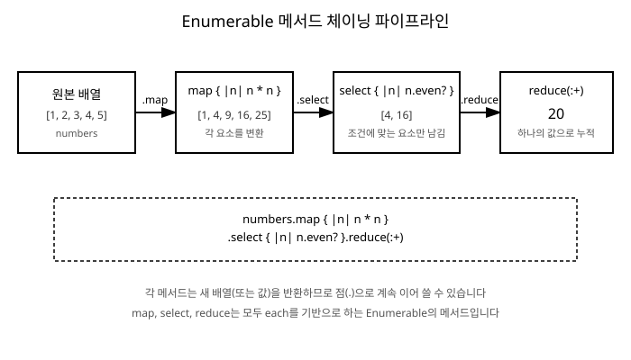

# 12장. 이터레이터와 Enumerable

[◀ 이전: 11장. 블록, 프로크, 람다](ch11-블록프로크람다.md) | [📖 목차](00-목차.md) | [다음: 13장. 심볼과 문자열 심화 ▶](ch13-심볼과문자열심화.md)


11장에서는 `yield`를 사용해 배열을 순회하는 `my_each` 메서드를 직접 만들어보았습니다. 이번 장에서는 그 아이디어를 확장해서, Ruby가 기본으로 제공하는 강력한 이터레이터들을 살펴봅니다. `each`, `map`, `select`, `reduce` 같은 메서드들이 어떻게 동작하는지, 그리고 이 모든 메서드가 사실은 `Enumerable`이라는 단 하나의 모듈에서 나온다는 사실을 이해하는 것이 이 장의 목표입니다.

## each: 가장 기본적인 순회

`each`는 컬렉션의 각 요소에 대해 블록을 실행합니다. 반환값은 컬렉션 자신입니다.

```ruby
fruits = ["사과", "바나나", "포도"]

fruits.each do |fruit|
  puts fruit
end
```

`each`는 새로운 배열을 만들지 않습니다. 단지 순회하면서 블록을 실행할 뿐입니다. "각 요소로 무언가를 한다"는 목적에는 적합하지만, "각 요소를 변환한 새로운 컬렉션을 얻고 싶다"는 목적에는 맞지 않습니다. 그럴 때는 `map`을 사용합니다.

## map: 요소를 변환하기

`map`(별칭 `collect`)은 블록의 반환값들을 모아 새로운 배열을 만들어 반환합니다.

```ruby
numbers = [1, 2, 3, 4, 5]
squares = numbers.map { |n| n * n }

puts squares.inspect  # [1, 4, 9, 16, 25]
puts numbers.inspect  # [1, 2, 3, 4, 5] (원본은 그대로)
```

`map`은 원본 배열을 바꾸지 않고 새 배열을 반환한다는 점이 중요합니다. 원본 자체를 바꾸고 싶다면 `map!`을 사용합니다.

```ruby
numbers.map! { |n| n * 10 }
puts numbers.inspect  # [10, 20, 30, 40, 50]
```

## select와 reject: 조건으로 걸러내기

`select`(별칭 `filter`)는 블록이 참을 반환하는 요소만 모아 새로운 배열을 만듭니다.

```ruby
numbers = (1..10).to_a
even_numbers = numbers.select { |n| n.even? }

puts even_numbers.inspect  # [2, 4, 6, 8, 10]
```

`reject`는 `select`의 반대로, 블록이 참을 반환하는 요소를 제외한 나머지를 모읍니다.

```ruby
odd_numbers = numbers.reject { |n| n.even? }
puts odd_numbers.inspect  # [1, 3, 5, 7, 9]
```

`select`와 `reject`는 서로 완전히 대칭적인 관계입니다. 같은 조건 블록을 쓰더라도 어느 쪽을 쓰느냐에 따라 정반대의 결과를 얻습니다.

## reduce(inject): 하나의 값으로 누적하기

`reduce`(별칭 `inject`)는 컬렉션의 모든 요소를 순회하면서 누적값을 계산해 하나의 결과로 만듭니다.

```ruby
numbers = [1, 2, 3, 4, 5]

sum = numbers.reduce(0) { |accumulator, n| accumulator + n }
puts sum  # 15
```

첫 번째 인자 `0`은 누적값의 초깃값입니다. 블록은 매 순회마다 `(누적값, 현재 요소)`를 받아 새로운 누적값을 반환합니다. 초깃값을 생략하면 첫 번째 요소가 초깃값으로 사용됩니다.

```ruby
sum = numbers.reduce { |accumulator, n| accumulator + n }
puts sum  # 15
```

연산자를 심볼로 바로 넘길 수도 있어서 코드가 훨씬 간결해집니다.

```ruby
puts numbers.reduce(:+)   # 15
puts numbers.reduce(:*)   # 120
puts numbers.reduce(100, :+)  # 115 (초깃값 100부터 시작)
```

`reduce`는 합계뿐 아니라 최댓값 찾기, 문자열 합치기, 해시로 변환하기 등 "여러 값을 하나로 모으는" 모든 작업에 활용할 수 있습니다.

```ruby
words = ["Ruby", "는", "즐겁다"]
sentence = words.reduce("") { |result, word| result + word + " " }
puts sentence.strip  # Ruby 는 즐겁다
```

## sort_by: 기준을 정해 정렬하기

`sort_by`는 블록이 반환하는 값을 기준으로 컬렉션을 정렬합니다.

```ruby
words = ["banana", "fig", "apple", "kiwi"]

by_length = words.sort_by { |word| word.length }
puts by_length.inspect  # ["fig", "kiwi", "apple", "banana"]
```

객체 배열을 정렬할 때 특히 유용합니다.

```ruby
Person = Struct.new(:name, :age)

people = [
  Person.new("철수", 30),
  Person.new("영희", 25),
  Person.new("민수", 40)
]

sorted_people = people.sort_by { |person| person.age }
sorted_people.each { |p| puts "#{p.name}: #{p.age}세" }
# 영희: 25세
# 철수: 30세
# 민수: 40세
```

## group_by: 조건별로 묶기

`group_by`는 블록의 반환값을 기준으로 요소들을 그룹으로 묶은 해시를 만듭니다.

```ruby
numbers = (1..10).to_a
grouped = numbers.group_by { |n| n % 3 }

puts grouped.inspect
# {1=>[1, 4, 7, 10], 2=>[2, 5, 8], 0=>[3, 6, 9]}
```

앞서의 `people` 배열을 나이대로 묶어볼 수도 있습니다.

```ruby
grouped_by_decade = people.group_by { |person| person.age / 10 * 10 }
puts grouped_by_decade.keys.inspect  # [30, 20, 40]
```

## each_with_index와 each_with_object

`each_with_index`는 각 요소와 함께 인덱스를 블록에 전달합니다.

```ruby
fruits = ["사과", "바나나", "포도"]

fruits.each_with_index do |fruit, index|
  puts "#{index}: #{fruit}"
end
# 0: 사과
# 1: 바나나
# 2: 포도
```

`each_with_object`는 누적할 객체(대개 배열이나 해시)를 함께 넘겨주고, 순회가 끝나면 그 객체를 반환합니다. `reduce`와 비슷하지만, 매 블록마다 값을 반환할 필요 없이 누적 객체 자체를 직접 조작한다는 점이 다릅니다.

```ruby
numbers = [1, 2, 3, 4, 5]

result = numbers.each_with_object([]) do |n, memo|
  memo << n * n if n.odd?
end

puts result.inspect  # [1, 9, 25]
```

해시를 누적 객체로 사용하면, 배열을 원하는 형태의 해시로 재구성할 수도 있습니다.

```ruby
words = ["apple", "banana", "avocado", "blueberry", "cherry"]

grouped = words.each_with_object(Hash.new { |h, k| h[k] = [] }) do |word, memo|
  memo[word[0]] << word
end

puts grouped.inspect
# {"a"=>["apple", "avocado"], "b"=>["banana", "blueberry"], "c"=>["cherry"]}
```

## Enumerable 모듈의 원리

지금까지 살펴본 `map`, `select`, `reject`, `reduce`, `sort_by`, `group_by`, `each_with_index`, `each_with_object`는 모두 배열이나 해시, 범위(Range)에서 똑같이 사용할 수 있었습니다. 이것이 우연이 아닙니다. 이 메서드들은 전부 `Enumerable`이라는 모듈에 정의되어 있고, `Array`, `Hash`, `Range` 같은 클래스들이 이 모듈을 `include`하고 있기 때문입니다.

10장에서 배운 믹스인(Mixin)을 떠올려봅시다. 어떤 클래스가 모듈을 `include`하면, 그 모듈에 정의된 메서드들을 자신의 인스턴스 메서드처럼 사용할 수 있었습니다. `Enumerable`은 바로 이 원리를 극단적으로 활용한 모듈입니다.

`Enumerable`의 놀라운 점은, 이 모듈을 사용하는 클래스가 딱 하나의 메서드, 즉 `each`만 정의하면 나머지 수십 개의 메서드(`map`, `select`, `reduce`, `sort_by`, `group_by`, `min`, `max`, `count`, `find`, `all?`, `any?`, `none?` 등)를 전부 공짜로 얻는다는 것입니다. `Enumerable`에 정의된 모든 메서드는 내부적으로 `each`를 호출해서 동작하도록 구현되어 있기 때문입니다.

직접 확인해봅시다. `each`만 정의하고 `Enumerable`을 믹스인한 클래스를 만들어보겠습니다.

```ruby
class NumberBox
  include Enumerable

  def initialize(*numbers)
    @numbers = numbers
  end

  def each
    @numbers.each { |n| yield n }
  end
end

box = NumberBox.new(5, 3, 8, 1, 9)

puts box.map { |n| n * 2 }.inspect     # [10, 6, 16, 2, 18]
puts box.select { |n| n > 4 }.inspect  # [5, 8, 9]
puts box.sort.inspect                  # [1, 3, 5, 8, 9]
puts box.max                           # 9
puts box.reduce(:+)                    # 26
```

`NumberBox` 클래스는 `each` 하나만 정의했을 뿐인데, `map`, `select`, `sort`, `max`, `reduce`를 포함해 `Enumerable`이 제공하는 모든 메서드를 사용할 수 있습니다. 이것이 가능한 이유는 `Enumerable` 모듈 안에서 `map`이 대략 다음과 같은 식으로 구현되어 있기 때문입니다(실제 구현은 C로 작성되어 있지만, 개념적으로는 이렇게 이해할 수 있습니다).

```ruby
# Enumerable 모듈 내부 동작을 개념적으로 표현한 의사 코드
module MyEnumerable
  def my_map
    result = []
    each { |element| result << yield(element) }
    result
  end
end
```

즉 `Enumerable`의 메서드들은 "이 클래스가 `each`를 어떻게 구현했는지는 몰라도, `each`를 호출하면 요소들을 하나씩 넘겨줄 것"이라는 약속만 믿고 동작합니다. 이런 설계 방식을 통해 Ruby는 배열이든, 해시든, 사용자가 정의한 클래스든, `each`만 있으면 동일한 방식으로 순회하고 변환하고 집계할 수 있는 일관된 인터페이스를 제공합니다.

이는 9장과 10장에서 배운 객체지향 설계의 좋은 예이기도 합니다. 각 클래스는 자신만의 방식으로 `each`를 구현하는 책임만 지고, 그 외의 복잡한 순회 로직(정렬, 필터링, 집계 등)은 전부 `Enumerable`에 위임합니다. 역할을 나누고 재사용 가능한 동작을 모듈로 뽑아내는 것, 이것이 믹스인의 진정한 힘입니다.

## 메서드 체이닝으로 함수형 데이터 처리하기

`map`, `select`, `reduce` 같은 메서드들은 모두 자기 자신의 결과를 반환하기 때문에, 점(`.`)으로 계속 이어서 호출할 수 있습니다. 이런 스타일을 메서드 체이닝이라고 부르며, 여러 단계의 데이터 처리를 한 줄의 파이프라인처럼 표현할 수 있게 해줍니다.

```ruby
numbers = [1, 2, 3, 4, 5]

result = numbers
  .map { |n| n * n }
  .select { |n| n.even? }
  .reduce(:+)

puts result  # 20
```

이 코드는 다음과 같은 순서로 데이터를 흘려보냅니다.

1. `[1, 2, 3, 4, 5]`를 제곱해서 `[1, 4, 9, 16, 25]`로 변환합니다(`map`).
2. 그중 짝수만 걸러내 `[4, 16]`을 얻습니다(`select`).
3. 남은 값을 모두 더해 `20`을 얻습니다(`reduce`).

이 흐름을 그림으로 표현하면 다음과 같습니다.



체이닝 스타일은 반복문과 임시 변수를 여러 번 사용하는 명령형 코드와 비교하면 훨씬 선언적입니다. 다음 두 코드를 비교해봅시다.

```ruby
# 명령형 스타일
result = []
numbers.each do |n|
  squared = n * n
  result << squared if squared.even?
end
sum = 0
result.each { |n| sum += n }
puts sum
```

```ruby
# 체이닝(함수형) 스타일
sum = numbers.map { |n| n * n }.select(&:even?).reduce(:+)
puts sum
```

체이닝 스타일은 "무엇을 할 것인가"를 각 단계별로 선언하기 때문에 읽기 쉽고, 중간에 새로운 처리 단계를 추가하거나 순서를 바꾸기도 쉽습니다. 실무에서 자주 쓰이는 좀 더 현실적인 예를 살펴봅시다.

```ruby
Product = Struct.new(:name, :price, :category)

products = [
  Product.new("노트북", 1_500_000, "전자기기"),
  Product.new("마우스", 30_000, "전자기기"),
  Product.new("책상", 200_000, "가구"),
  Product.new("의자", 150_000, "가구"),
  Product.new("키보드", 80_000, "전자기기")
]

electronics_total = products
  .select { |p| p.category == "전자기기" }
  .map(&:price)
  .reduce(0, :+)

puts "전자기기 총액: #{electronics_total}원"  # 전자기기 총액: 1610000원

by_category = products
  .group_by(&:category)
  .transform_values { |items| items.sum(&:price) }

puts by_category.inspect
# {"전자기기"=>1610000, "가구"=>350000}
```

`&:price`처럼 심볼에 `&`를 붙이는 표현은 `{ |p| p.price }`를 줄여 쓴 것으로, 13장에서 심볼을 더 깊이 다룰 때 다시 설명합니다. 지금은 "메서드를 그대로 블록처럼 호출한다"는 관용구로 기억해두면 충분합니다.

이처럼 `Enumerable`이 제공하는 메서드들을 조합하면, 반복문을 직접 작성하지 않고도 데이터를 원하는 형태로 변환, 필터링, 집계할 수 있습니다. 이는 Ruby다운 코드의 핵심 특징 중 하나이며, 18장에서 다룰 "좋은 Ruby 코드 작성 습관"에서도 다시 강조할 주제입니다.

## 요약

- `each`는 순회, `map`은 변환, `select`/`reject`는 조건 필터링, `reduce`(`inject`)는 누적 집계를 담당합니다.
- `sort_by`는 기준값으로 정렬하고, `group_by`는 기준값으로 묶어 해시를 만듭니다.
- `each_with_index`는 인덱스와 함께, `each_with_object`는 누적 객체와 함께 순회합니다.
- `Enumerable` 모듈을 `include`한 클래스가 `each`만 정의하면, `map`, `select`, `reduce`를 비롯한 수십 개의 메서드를 추가 구현 없이 사용할 수 있습니다. 이는 10장에서 배운 믹스인의 강력한 활용 사례입니다.
- `map`, `select`, `reduce` 등을 점으로 이어 붙이는 메서드 체이닝은 데이터 처리 과정을 파이프라인처럼 선언적으로 표현할 수 있게 해줍니다.

## 연습문제

1. 문자열 배열 `["apple", "kiwi", "banana", "fig", "grape"]`에서 길이가 5 이상인 단어만 골라, 대문자로 변환한 새 배열을 만드는 코드를 메서드 체이닝으로 작성하세요.

2. `reduce`를 사용해서 정수 배열에서 최댓값을 찾는 코드를 작성하세요. (`max` 메서드를 사용하지 않고 직접 구현하세요.)

3. 1부터 20까지의 정수를 3으로 나눈 나머지를 기준으로 `group_by`를 사용해 그룹을 나누고, 각 그룹의 합계를 구하는 코드를 작성하세요.

4. `each`만 정의하고 `Enumerable`을 `include`한 `Playlist` 클래스를 작성하세요. `Playlist`는 여러 개의 곡 제목(문자열)을 저장하며, `Enumerable`을 통해 `sort`, `select`, `map` 등을 사용할 수 있어야 합니다.

5. `each_with_object`를 사용해서, 단어 배열을 받아 "단어의 길이 => 그 길이를 가진 단어들의 배열" 형태의 해시로 변환하는 메서드를 작성하세요. (힌트: `group_by`로도 같은 결과를 만들 수 있는데, 두 방법을 비교해보세요.)

---

[◀ 이전: 11장. 블록, 프로크, 람다](ch11-블록프로크람다.md) | [📖 목차](00-목차.md) | [다음: 13장. 심볼과 문자열 심화 ▶](ch13-심볼과문자열심화.md)
