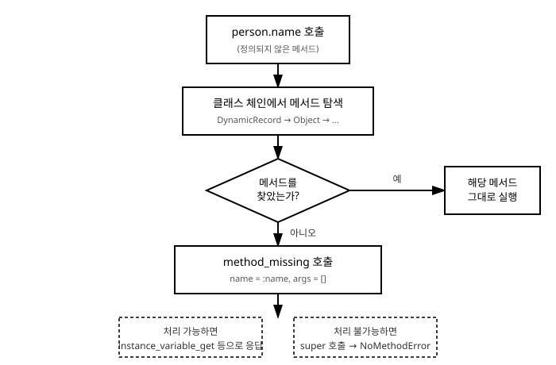

# 16장. 메타프로그래밍 기초

[◀ 이전: 15장. 개방 클래스와 몽키패칭](ch15-개방클래스와몽키패칭.md) | [📖 목차](00-목차.md) | [다음: 17장. gem과 Bundler ▶](ch17-gem과Bundler.md)


15장 개방 클래스와 몽키패칭에서는 이미 정의된 클래스를 다시 열어 메서드를 추가하는 방법을 살펴보았고, 그 끝에서 `class_eval`과 `instance_eval`이라는 두 메서드를 잠깐 소개했습니다. 이 두 메서드는 "코드를 이용해 코드를 다루는" 좀 더 큰 기법의 입구에 불과합니다. 이렇게 프로그램이 실행되는 중에 클래스나 메서드, 객체의 구조 자체를 조작하는 프로그래밍 기법을 메타프로그래밍(metaprogramming)이라고 부릅니다.

Ruby는 메타프로그래밍에 유난히 강력한 도구를 많이 제공하는 언어입니다. 존재하지 않는 메서드 호출을 가로채거나, 메서드를 실행 중에 즉석에서 만들어 내거나, 문자열만으로 메서드를 호출하는 일이 모두 가능합니다. 이번 장에서는 이런 도구들을 하나씩 살펴보고, 마지막에는 이 도구들을 조합해서 동적으로 속성을 다루는 클래스를 직접 만들어 봅니다.

## method_missing으로 존재하지 않는 메서드 호출 가로채기

7장 메서드에서 배웠듯이, 객체에 정의되어 있지 않은 메서드를 호출하면 Ruby는 `NoMethodError`를 발생시킵니다.

```ruby
class Cat
end

Cat.new.meow  # => NoMethodError: undefined method 'meow' for #<Cat>
```

그런데 사실 이 에러가 발생하기 직전, Ruby 내부에서는 한 단계가 더 있습니다. 어떤 객체에게 메서드를 호출했을 때, 그 객체의 클래스와 조상 클래스(10장 상속과 모듈에서 다룬 상속 체인)를 모두 뒤져도 해당 이름의 메서드를 찾지 못하면, Ruby는 곧바로 에러를 내는 대신 `method_missing`이라는 메서드를 호출합니다. 우리가 `method_missing`을 직접 정의해 두면, 존재하지 않는 메서드 호출을 에러로 처리하는 대신 원하는 방식으로 가로챌 수 있습니다.

```ruby
class Cat
  def method_missing(name, *args)
    if name.to_s.start_with?("say_")
      word = name.to_s.sub("say_", "")
      "#{word}!" * args.first.to_i
    else
      super  # 처리할 수 없으면 원래대로 NoMethodError를 발생시킨다.
    end
  end
end

cat = Cat.new
puts cat.say_meow(3)  # => "meow!meow!meow!"
puts cat.fly           # => NoMethodError (super가 호출되어 원래 동작으로 되돌아감)
```

`method_missing`의 첫 번째 인자는 호출하려 했던 메서드 이름이 심볼로 전달되고(13장 심볼과 문자열 심화에서 심볼을 다뤘습니다), 나머지 인자는 그 메서드를 호출할 때 넘긴 인자 그대로 전달됩니다. 위 예제에서는 `say_`로 시작하는 이름이면 직접 처리하고, 그렇지 않으면 `super`를 호출해서 원래의 `method_missing` 동작, 즉 `NoMethodError`를 발생시키는 동작으로 되돌립니다.

여기서 `super`를 호출하는 부분이 특히 중요합니다. 만약 이 부분을 생략하고 모든 호출을 무조건 처리하려고 하면, 오타로 잘못 호출한 메서드조차 조용히 실행되어 버그를 찾기 매우 어려워집니다. `method_missing`을 정의할 때는 "내가 처리할 수 있는 경우"와 "그렇지 않은 경우"를 명확히 구분하고, 처리할 수 없는 경우에는 반드시 `super`로 넘기는 것이 안전한 습관입니다.

## define_method로 동적으로 메서드 생성하기

`method_missing`이 "호출을 가로채서 그때그때 대응하는" 방식이라면, `define_method`는 "실행 중에 진짜 메서드를 만들어 클래스에 추가하는" 방식입니다.

```ruby
class Product
  define_method(:price_with_tax) do |tax_rate|
    100 * (1 + tax_rate)
  end
end

puts Product.new.price_with_tax(0.1)  # => 110.0
```

`def` 키워드로 메서드를 정의하는 것과 결과는 비슷해 보이지만, `define_method`는 메서드 이름을 변수로 다룰 수 있다는 결정적인 차이가 있습니다. 이 덕분에 반복적인 패턴의 메서드를 한꺼번에 만들어 낼 수 있습니다. 예를 들어 여러 속성에 대해 비슷한 형태의 getter를 한 번에 만드는 다음 예제를 봅시다.

```ruby
class Config
  ATTRIBUTES = [:host, :port, :timeout]

  ATTRIBUTES.each do |attr_name|
    define_method(attr_name) do
      instance_variable_get("@#{attr_name}")
    end

    define_method("#{attr_name}=") do |value|
      instance_variable_set("@#{attr_name}", value)
    end
  end
end

config = Config.new
config.host = "localhost"
config.port = 8080

puts config.host  # => "localhost"
puts config.port  # => 8080
```

`ATTRIBUTES` 배열에 이름 하나만 추가하면 getter와 setter가 자동으로 함께 생기므로, 9장 클래스와 객체에서 배운 `attr_accessor`가 하는 일을 우리 손으로 직접 흉내 내 본 셈입니다. 실제로 Ruby의 `attr_accessor`, `attr_reader`, `attr_writer`도 내부적으로는 이와 비슷한 방식으로 구현되어 있습니다.

## respond_to?와 respond_to_missing?을 함께 오버라이드해야 하는 이유

`method_missing`으로 존재하지 않는 메서드에 응답하도록 만들면 한 가지 함정이 생깁니다. Ruby의 `respond_to?` 메서드는 기본적으로 그 객체의 클래스에 실제로 정의된 메서드 목록만 확인하기 때문에, `method_missing`으로 "가짜로 처리 가능한" 메서드에 대해서는 `false`를 반환해 버립니다.

```ruby
cat = Cat.new
puts cat.respond_to?(:say_meow)  # => false (실제로는 호출하면 잘 동작하는데도!)
```

이 결과는 앞서 본 `Cat` 클래스가 `say_meow`를 실제로 처리할 수 있다는 사실과 모순됩니다. `respond_to?`가 `false`를 반환하면, 이 값을 신뢰하는 다른 코드(예를 들어 `if obj.respond_to?(:say_meow)` 같은 조건문)는 실제로는 호출 가능한 메서드를 호출 불가능하다고 잘못 판단하게 됩니다.

이 문제를 해결하려면 `respond_to_missing?`이라는 메서드를 함께 정의해야 합니다. `respond_to_missing?`은 `respond_to?`가 내부적으로 호출하는 보조 메서드로, "이 이름과 이 가시성(public/private)에 대해 내가 method_missing으로 처리할 수 있는가"를 알려 주는 역할을 합니다.

```ruby
class Cat
  def method_missing(name, *args)
    if name.to_s.start_with?("say_")
      word = name.to_s.sub("say_", "")
      "#{word}!" * args.first.to_i
    else
      super
    end
  end

  def respond_to_missing?(name, include_private = false)
    name.to_s.start_with?("say_") || super
  end
end

cat = Cat.new
puts cat.respond_to?(:say_meow)  # => true
puts cat.respond_to?(:fly)       # => false
```

`respond_to_missing?`의 판단 조건은 `method_missing`이 실제로 어떤 호출을 처리하는지와 반드시 일치시켜야 합니다. 두 메서드의 조건이 어긋나면 "호출은 되는데 `respond_to?`는 거짓말을 하는" 상황이 생기기 때문입니다. 그리고 `respond_to_missing?`의 마지막에도 `method_missing`과 마찬가지로 `super`를 호출해서, 내가 처리하지 못하는 경우는 상위 클래스의 판단에 맡기는 것이 안전합니다.

`method_missing`을 정의할 때는 `respond_to_missing?`도 항상 함께 정의한다고 기억해 두면 좋습니다. 이 원칙 하나만 지켜도 메타프로그래밍으로 인한 흔한 실수 중 하나를 피할 수 있습니다.

## send로 메서드를 문자열/심볼로 호출하기

지금까지는 `obj.method_name`처럼 메서드 이름을 코드 안에 직접 적어서 호출했습니다. 하지만 메서드 이름 자체를 변수에 담아 두었다가, 실행 시점에 어떤 메서드를 호출할지 결정하고 싶을 때가 있습니다. 이럴 때 사용하는 것이 `send` 메서드입니다.

```ruby
class Calculator
  def add(a, b) = a + b
  def subtract(a, b) = a - b
end

calc = Calculator.new
operation = :add

puts calc.send(operation, 3, 4)        # => 7
puts calc.send("subtract", 10, 3)      # => 7
```

`send`는 첫 번째 인자로 받은 이름(심볼 또는 문자열)에 해당하는 메서드를, 나머지 인자를 그대로 넘겨서 호출해 줍니다. `operation` 변수의 값을 사용자 입력이나 설정 파일에서 읽어 온 값으로 바꿔치기하면, 어떤 메서드를 실행할지를 프로그램 실행 중에 유연하게 결정할 수 있습니다.

한 가지 주의할 점은 `send`가 `private`으로 선언된 메서드까지도 호출할 수 있다는 것입니다. 이는 디버깅이나 테스트 코드를 작성할 때는 유용하지만, 캡슐화(9장에서 다룬 접근 제어의 목적)를 우회하는 수단으로 남용하면 클래스 설계의 의도를 무너뜨릴 수 있습니다. 외부에서 호출해도 안전하다는 확신이 없다면 `public_send`를 사용해서, `private`/`protected` 메서드는 애초에 호출되지 않도록 제한하는 편이 안전합니다.

```ruby
class Account
  def balance
    calculate_balance
  end

  private

  def calculate_balance
    1000
  end
end

account = Account.new
puts account.send(:calculate_balance)         # => 1000 (private도 호출 가능)
# account.public_send(:calculate_balance)     # => NoMethodError (private이므로 거부됨)
```

## instance_variable_get / instance_variable_set

객체의 인스턴스 변수는 보통 `@name`처럼 `@`이 붙은 이름으로 클래스 내부에서만 직접 접근합니다. 하지만 인스턴스 변수의 이름 자체를 문자열이나 심볼로 다루면서 동적으로 읽고 쓰고 싶을 때는 `instance_variable_get`과 `instance_variable_set`을 사용합니다.

```ruby
class Person
  def initialize(name, age)
    @name = name
    @age = age
  end
end

person = Person.new("김민준", 25)

puts person.instance_variable_get(:@name)  # => "김민준"

person.instance_variable_set(:@age, 26)
puts person.instance_variable_get(:@age)   # => 26
```

이 두 메서드는 인스턴스 변수가 `private`이든 아니든 관계없이 외부에서 직접 값을 읽고 쓸 수 있게 해 줍니다. 그래서 앞서 `send`에서와 마찬가지로 캡슐화를 우회하는 강력한 도구이며, 정말 필요한 경우(예를 들어 객체를 직렬화하거나, 테스트에서 내부 상태를 검증하거나, 뒤에서 만들 것처럼 동적으로 속성을 다루는 클래스를 구현할 때)로 한정해서 사용하는 것이 바람직합니다.

객체가 현재 가지고 있는 인스턴스 변수 목록은 `instance_variables` 메서드로 확인할 수 있습니다.

```ruby
puts person.instance_variables  # => [:@name, :@age]
```

## 실전 예제: 동적 속성을 가진 클래스 직접 구현하기

지금까지 배운 도구들, `method_missing`, `respond_to_missing?`, `instance_variable_get`/`instance_variable_set`을 모두 조합하면, Ruby 표준 라이브러리의 `OpenStruct`와 비슷한 클래스를 직접 만들 수 있습니다. `OpenStruct`는 미리 어떤 속성을 가질지 정해 두지 않고도, 해시를 넘기면 그 키를 그대로 메서드처럼 사용할 수 있게 해 주는 클래스입니다.

```ruby
class DynamicRecord
  def initialize(attributes = {})
    attributes.each do |key, value|
      instance_variable_set("@#{key}", value)
    end
  end

  def method_missing(name, *args)
    name_str = name.to_s

    if name_str.end_with?("=")
      # setter 호출: person.age = 26
      attr_name = name_str.chomp("=")
      instance_variable_set("@#{attr_name}", args.first)
    elsif instance_variable_defined?("@#{name_str}")
      # getter 호출: person.name
      instance_variable_get("@#{name_str}")
    else
      super
    end
  end

  def respond_to_missing?(name, include_private = false)
    name_str = name.to_s.chomp("=")
    instance_variable_defined?("@#{name_str}") || super
  end

  def to_s
    values = instance_variables.map do |var|
      "#{var.to_s.delete_prefix('@')}=#{instance_variable_get(var).inspect}"
    end
    "#<DynamicRecord #{values.join(', ')}>"
  end
end
```

이 클래스를 사용해 보면 다음과 같이 동작합니다.

```ruby
person = DynamicRecord.new(name: "이서연", age: 28)

puts person.name        # => "이서연"
puts person.age         # => 28

person.age = 29
puts person.age         # => 29

puts person.respond_to?(:name)   # => true
puts person.respond_to?(:email)  # => false

person.email = "seoyeon@example.com"  # method_missing이 setter로 처리
puts person.email                      # => "seoyeon@example.com"
puts person.respond_to?(:email)        # => true (이제 인스턴스 변수가 생겼으므로)

puts person
# => #<DynamicRecord name="이서연", age=29, email="seoyeon@example.com">
```

이 클래스가 어떻게 동작하는지 하나씩 짚어 보겠습니다.

1. `initialize`는 생성자에서 받은 해시를 순회하며 각 키를 그대로 인스턴스 변수 이름으로 사용해 `instance_variable_set`으로 저장합니다.
2. `person.name`처럼 존재하지 않는 메서드를 호출하면 `method_missing`이 가로챕니다. 이름이 `=`으로 끝나지 않으면 getter로 간주해 `instance_variable_get`으로 값을 꺼내 줍니다.
3. `person.age = 29`처럼 대입 형태로 호출하면, Ruby는 이를 `age=`라는 이름의 메서드 호출로 변환해서 넘깁니다. 이 경우 `method_missing`은 이름 끝의 `=`을 떼어 내고 `instance_variable_set`으로 값을 갱신합니다.
4. `respond_to_missing?`은 `method_missing`이 실제로 처리할 수 있는 조건(해당 인스턴스 변수가 존재하는지)과 똑같은 기준으로 판단하도록 맞춰져 있습니다. 그래서 `respond_to?`가 항상 정확한 값을 반환합니다.
5. `email`처럼 처음에는 없던 속성도, 한 번 대입(`person.email = ...`)하고 나면 그 다음부터는 `respond_to?`가 `true`를 반환합니다. 인스턴스 변수가 실제로 생겼기 때문입니다.

아래 그림은 `person.name`처럼 정의되지 않은 메서드를 호출했을 때, Ruby 내부에서 어떤 순서로 처리가 이루어지는지를 보여줍니다.



이 예제에서 볼 수 있듯, 메타프로그래밍 도구들은 서로 조합될 때 진가를 발휘합니다. `method_missing` 하나만으로는 부족했던 부분(정확한 `respond_to?` 응답)을 `respond_to_missing?`이 보완하고, 실제 값 저장은 `instance_variable_get`/`instance_variable_set`이 담당하는 식으로 역할이 나뉘어 있습니다.

## 메타프로그래밍의 장단점

메타프로그래밍은 분명 강력한 도구입니다. 반복적인 코드를 극적으로 줄여 주고, 위 예제처럼 정해지지 않은 속성을 유연하게 다루는 클래스를 만들 수도 있습니다. Rails를 비롯한 많은 Ruby 프레임워크가 메타프로그래밍을 적극적으로 활용해서, 개발자가 적은 코드로도 많은 일을 할 수 있게 해 줍니다.

하지만 이런 강력함에는 분명한 대가가 따릅니다.

- **코드를 읽기 어려워진다.** `method_missing`으로 처리되는 메서드는 클래스 정의 어디에도 명시적으로 나타나지 않습니다. 처음 코드를 보는 사람은 `person.name`이 어디서 정의된 메서드인지 소스 코드만 봐서는 바로 찾을 수 없습니다.
- **오타를 걸러내기 어려워진다.** 일반적인 메서드 호출에서 오타를 내면 `NoMethodError`가 바로 발생해 실수를 알아차릴 수 있지만, `method_missing`이 모든 호출을 조건 없이 처리하도록 작성되어 있으면 오타조차 조용히 실행되어 버그를 찾기 어렵게 만듭니다.
- **IDE와 정적 분석 도구의 도움을 받기 어렵다.** 실제로 존재하지 않는 메서드는 자동 완성이나 "정의로 이동" 같은 편집기 기능이 제대로 동작하지 않을 수 있습니다.
- **디버깅이 어려워진다.** 에러가 발생한 지점의 스택 추적(stack trace)에 `method_missing` 내부 로직이 여러 겹으로 얽혀 나타나기 때문에, 실제 문제의 원인을 찾기까지 시간이 더 걸릴 수 있습니다.

따라서 메타프로그래밍은 "이 문제를 다른 평범한 방법(일반적인 메서드 정의, 상속, 모듈 믹스인 등)으로는 해결하기 번거롭거나 불가능한가?"를 먼저 자문해 보고, 그렇다는 확신이 들 때 신중하게 사용하는 것이 좋습니다. 15장에서 몽키패칭에 대해 이야기했던 것과 같은 태도, 즉 "강력한 도구일수록 꼭 필요한 곳에 최소한으로 사용한다"는 원칙이 메타프로그래밍에도 그대로 적용됩니다. gem을 직접 만들거나(17장 gem과 Bundler) 여러 사람이 함께 유지보수하는 코드를 작성할 때는 특히 이 균형 감각이 중요합니다.

## 요약

- `method_missing`은 객체가 응답할 수 없는 메서드 호출을 가로채는 훅(hook)으로, 처리할 수 없는 경우에는 반드시 `super`를 호출해 원래의 `NoMethodError` 동작으로 되돌려야 한다.
- `define_method`는 메서드 이름을 변수로 다루면서 실행 중에 실제 메서드를 만들어 클래스에 추가할 수 있게 해 준다.
- `method_missing`을 정의하면 `respond_to_missing?`도 반드시 함께 오버라이드해서, `respond_to?`가 실제 처리 가능 여부와 일치하는 값을 반환하도록 맞춰야 한다.
- `send`는 메서드 이름을 문자열/심볼로 받아 동적으로 호출하며, `private` 메서드도 호출할 수 있으므로 외부에서 안전하게 호출하려면 `public_send`를 사용한다.
- `instance_variable_get`/`instance_variable_set`은 인스턴스 변수를 이름으로 동적으로 읽고 쓸 수 있게 해 주며, `instance_variables`로 현재 정의된 인스턴스 변수 목록을 확인할 수 있다.
- 위 도구들을 조합하면 `OpenStruct`처럼 정해지지 않은 속성을 동적으로 다루는 클래스를 직접 구현할 수 있다.
- 메타프로그래밍은 강력하지만 코드 가독성, 오타 검출, 편집기 지원, 디버깅 난이도 면에서 대가가 따르므로, 다른 평범한 방법으로 해결하기 어려운 경우에 한해 신중하게 사용해야 한다.

## 연습문제

1. `method_missing`을 이용해, `get_이름`과 같은 형태로 호출하면 해당 인스턴스 변수 값을 반환하는 클래스 `Record`를 작성하시오. `get_`으로 시작하지 않는 알 수 없는 메서드 호출은 `super`로 넘겨 `NoMethodError`가 발생하도록 하시오.
2. 문제 1의 `Record` 클래스에 `respond_to_missing?`을 추가해서, `record.respond_to?(:get_name)`이 올바른 값을 반환하도록 만드시오.
3. `define_method`를 사용해서, 클래스 매크로처럼 동작하는 `def_double_getter(:price)`를 호출하면 `@price`의 두 배 값을 반환하는 `price_doubled` 메서드가 자동으로 정의되는 코드를 작성하시오.
4. `send`와 `public_send`의 차이를 설명하고, `private` 메서드가 정의된 클래스를 예로 들어 두 메서드를 각각 호출했을 때의 결과 차이를 코드로 보이시오.
5. 이 장에서 만든 `DynamicRecord` 클래스에 `to_h` 메서드를 추가해서, 현재 저장된 모든 속성을 `{name: "이서연", age: 29}`와 같은 해시로 반환하도록 확장하시오. (힌트: `instance_variables`와 `instance_variable_get`을 조합하시오.)

---

[◀ 이전: 15장. 개방 클래스와 몽키패칭](ch15-개방클래스와몽키패칭.md) | [📖 목차](00-목차.md) | [다음: 17장. gem과 Bundler ▶](ch17-gem과Bundler.md)
