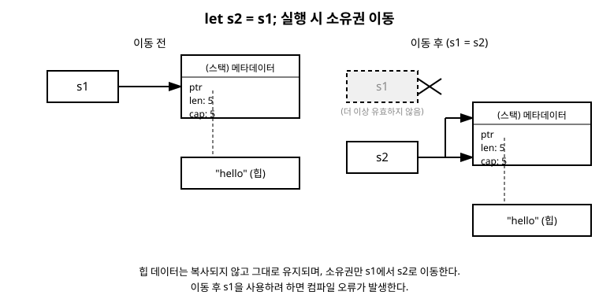

# 8장. 소유권(Ownership)

[◀ 이전: 7장. 함수](ch07-함수.md) | [📖 목차](00-목차.md) | [다음: 9장. 빌림(Borrowing)과 참조 ▶](ch09-빌림과참조.md)

---

7장 마지막 부분에서 `String`을 함수에 넘겼더니 원래 변수를 더 이상 쓸 수 없게 되는 것을 보았습니다. 이 현상이 바로 이번 장의 주제인 **소유권(ownership)**입니다. 소유권은 Rust를 다른 언어와 근본적으로 다르게 만드는 개념이자, Rust가 가비지 컬렉터(GC) 없이도 메모리 안전성을 보장할 수 있는 핵심 원리입니다.

## 왜 소유권이 필요한가

프로그램이 실행되는 동안 메모리를 관리하는 방식은 크게 두 가지로 나뉩니다.

- **가비지 컬렉션(GC)**: Java, Python, Go 같은 언어는 프로그램 실행 중 더 이상 쓰이지 않는 메모리를 런타임이 주기적으로 감시하고 자동으로 회수합니다. 편리하지만 감시 작업에 실행 비용이 들고, 회수 시점을 예측하기 어렵습니다.
- **수동 관리**: C, C++ 같은 언어는 프로그래머가 직접 메모리를 할당(`malloc`)하고 해제(`free`)합니다. 빠르지만 해제를 잊으면 메모리 누수가 생기고, 이미 해제한 메모리를 또 사용하면(use-after-free) 프로그램이 오작동하거나 보안 취약점이 됩니다.

Rust는 세 번째 길을 택했습니다. 런타임에 메모리를 감시하는 GC도 없고, 프로그래머가 직접 `free`를 호출할 필요도 없습니다. 대신 **컴파일 시점에 소유권 규칙을 검사**해서, 메모리 관련 오류가 있는 코드는 애초에 컴파일되지 않도록 막습니다. 이것이 Rust가 "안전하면서도 빠르다"고 이야기되는 이유입니다.

## 소유권의 세 가지 규칙

Rust의 소유권 시스템은 다음 세 가지 규칙으로 요약할 수 있습니다.

1. Rust의 모든 값은 **정확히 하나의 소유자(owner)** 변수를 가진다.
2. 한 시점에는 오직 하나의 소유자만 존재할 수 있다.
3. 소유자가 **스코프(scope)를 벗어나면** 그 값은 즉시 메모리에서 해제(drop)된다.

말로만 들으면 추상적으로 느껴지니, 코드로 직접 확인해 봅시다.

```rust
fn main() {
    {
        let s = String::from("hello"); // s가 힙에 만들어진 문자열의 소유자가 된다
        println!("{s}");
    } // 이 지점에서 스코프가 끝나고, s가 소유한 값이 자동으로 해제된다
    // println!("{s}"); // 오류! s는 이 스코프 밖에서 존재하지 않는다
}
```

`String::from("hello")`는 힙(heap)에 문자열 데이터를 할당합니다. 5장과 6장에서 다룬 블록 스코프 규칙에 따라, 중괄호 `{ }`가 끝나는 순간 `s`는 스코프를 벗어납니다. 이때 Rust는 `s`가 소유하고 있던 힙 메모리를 자동으로 해제합니다. 마치 C++의 스마트 포인터가 소멸자를 호출하는 것과 비슷한 원리이며, 이 자동 해제 동작을 Rust에서는 **드롭(drop)**이라고 부릅니다.

여기서 중요한 점은, 이 해제가 런타임에 감시자가 판단해서 일어나는 것이 아니라, 컴파일러가 "이 변수의 스코프는 여기서 끝난다"는 것을 컴파일 시점에 미리 알고 그 지점에 해제 코드를 자동으로 삽입해 준다는 것입니다. 추가적인 실행 비용이 거의 들지 않습니다.

## 대입할 때 벌어지는 일: 이동(Move)

정수나 불리언처럼 크기가 고정되어 있고 스택에만 저장되는 타입은 대입할 때 단순히 값이 복사됩니다.

```rust
fn main() {
    let x = 5;
    let y = x; // x의 값이 y로 복사된다
    println!("x = {x}, y = {y}"); // 둘 다 문제없이 사용 가능
}
```

`i32`는 크기가 고정되어 있어 복사 비용이 매우 저렴하므로, Rust는 이런 타입에 대해 `Copy`라는 특별한 성질을 부여합니다. `x`를 `y`에 대입해도 `x`는 여전히 유효합니다.

하지만 `String`처럼 힙에 데이터를 저장하는 타입은 다릅니다.

```rust
fn main() {
    let s1 = String::from("hello");
    let s2 = s1; // 여기서 어떤 일이 벌어질까?

    println!("{s1}, world!"); // 컴파일 오류!
}
```

이 코드를 컴파일하면 다음과 비슷한 오류가 발생합니다.

```text
error[E0382]: borrow of moved value: `s1`
 --> src/main.rs:5:20
  |
2 |     let s1 = String::from("hello");
  |         -- move occurs because `s1` has type `String`, which does not implement the `Copy` trait
3 |     let s2 = s1;
  |              -- value moved here
4 |
5 |     println!("{s1}, world!");
  |                ^^ value borrowed here after move
```

`String`은 내부적으로 세 가지 정보를 스택에 들고 있습니다. 힙 데이터를 가리키는 포인터(`ptr`), 현재 문자열의 길이(`len`), 그리고 할당된 전체 용량(`capacity`)입니다. 실제 문자 데이터 `"hello"`는 힙 어딘가에 저장되어 있습니다.

`let s2 = s1;`을 실행하면, Rust는 이 세 가지 스택 정보만 `s2`로 복사합니다. 힙에 있는 실제 문자열 데이터는 복사하지 않습니다. 만약 여기서 그친다면 `s1`과 `s2`가 동시에 같은 힙 메모리를 가리키게 되고, 두 변수가 모두 스코프를 벗어날 때 같은 메모리를 두 번 해제하려는 시도(double free)가 벌어져 심각한 버그가 됩니다.

Rust는 이 문제를 원천적으로 막기 위해 다른 선택을 합니다. `s1`을 `s2`에 대입하는 순간, **`s1`의 소유권이 `s2`로 이동(move)했다고 간주하고, `s1`을 그 즉시 무효화**합니다. 그래서 이후 `s1`을 사용하려는 코드는 컴파일 자체가 되지 않습니다. 이렇게 하면 소유자가 항상 하나뿐이라는 규칙이 깨지지 않고, 이중 해제 문제도 자연스럽게 사라집니다.

다음 다이어그램은 이 이동 과정을 보여줍니다.



이 그림에서 볼 수 있듯이, 힙에 있는 실제 데이터 `"hello"`는 이동 전후로 전혀 움직이지 않습니다. 바뀌는 것은 오직 "누가 이 데이터의 소유자인가"라는 정보뿐입니다. 다른 언어의 경험에서 "대입은 항상 값을 복사한다" 또는 "대입은 항상 참조를 공유한다"라고 생각했다면, Rust의 이동은 그 둘과는 또 다른 세 번째 방식이라는 점을 기억해야 합니다.

## 함수에 값을 넘길 때도 이동이 일어난다

7장 끝에서 예고했던 부분입니다. 함수를 호출하면서 값을 매개변수로 넘기는 것은 대입(`let`)과 동일하게 동작합니다. 즉, `String`처럼 `Copy`가 아닌 타입을 함수에 넘기면 소유권이 함수 안으로 이동합니다.

```rust
fn main() {
    let s = String::from("Rust");
    print_and_consume(s);
    // println!("{s}"); // 오류! s의 소유권은 이미 함수로 이동했다
}

fn print_and_consume(text: String) {
    println!("전달받은 값: {text}");
} // text가 여기서 스코프를 벗어나며, 그 값(원래 s였던 것)이 해제된다
```

`print_and_consume` 함수 안의 매개변수 `text`가 문자열의 새로운 소유자가 됩니다. 함수가 끝나면 `text`가 스코프를 벗어나므로, 소유권 규칙 3번에 따라 그 값은 즉시 해제됩니다. `main`으로 다시 돌아왔을 때 `s`는 이미 소유권을 잃은 상태이므로 사용할 수 없습니다.

반대로, 함수가 값을 반환하면 소유권이 호출한 쪽으로 다시 이동합니다.

```rust
fn main() {
    let s1 = create_greeting();
    println!("{s1}"); // s1이 소유권을 가지므로 사용 가능
}

fn create_greeting() -> String {
    let greeting = String::from("반갑습니다");
    greeting // 소유권이 호출자에게 이동하며 반환된다
}
```

## 값을 유지하고 싶다면: `Clone`

가끔은 원래 변수도 계속 쓰고 싶고, 다른 변수나 함수에도 값을 넘기고 싶을 때가 있습니다. 이럴 때는 힙 데이터를 실제로 복제하는 `clone` 메서드를 명시적으로 호출하면 됩니다.

```rust
fn main() {
    let s1 = String::from("hello");
    let s2 = s1.clone(); // 힙 데이터까지 통째로 복제한다

    println!("s1 = {s1}, s2 = {s2}"); // 둘 다 유효하다
}
```

`clone()`을 호출하면 Rust는 힙에 새로운 메모리를 할당하고, 원본 데이터를 그대로 복사해 넣습니다. 이제 `s1`과 `s2`는 서로 독립된 힙 메모리를 가리키는 완전히 별개의 값이 되므로, 둘 다 각자의 스코프가 끝날 때 각자의 메모리를 안전하게 해제합니다.

`clone`은 이동과 달리 실제 데이터 복사가 일어나므로 비용이 듭니다. 문자열이 짧다면 무시할 만하지만, 데이터가 크다면 성능에 영향을 줄 수 있습니다. 그래서 Rust 코드를 작성할 때는 "정말 복제가 필요한가, 아니면 소유권을 넘기는 것으로 충분한가"를 항상 생각해보는 습관이 중요합니다. 이런 판단 기준은 18장에서 좋은 Rust 코드를 작성하는 습관을 다룰 때 다시 짚어봅니다.

## 왜 매번 clone 하지 않는가

지금까지 본 예제만 보면 "이동 때문에 변수를 못 쓰게 되는 게 불편하니 그냥 항상 clone을 쓰면 되지 않을까?"라는 생각이 들 수 있습니다. 실제로 그렇게 해도 프로그램은 동작합니다. 하지만 다음과 같은 상황을 생각해 봅시다.

```rust
fn print_length(s: String) -> usize {
    s.len()
}

fn main() {
    let message = String::from("Rust는 안전하다");
    let len = print_length(message.clone()); // 매번 복제해야 한다면?
    println!("메시지: {message}, 길이: {len}");
}
```

단순히 문자열의 길이를 확인하고 싶을 뿐인데, 이 함수에 값을 넘기려면 매번 `clone()`을 호출해서 힙 메모리를 통째로 복제해야 합니다. 함수가 값을 읽기만 하고 딱히 소유할 필요가 없는 경우라면, 이는 명백한 낭비입니다.

Rust는 이 문제를 해결하기 위해 소유권을 이동시키지 않고도 값에 잠깐 접근할 수 있는 방법을 제공합니다. 바로 **빌림(borrowing)**과 **참조(reference)**입니다. 함수에 값 자체가 아니라 그 값을 가리키는 참조(`&String`)를 넘기면, 소유권은 그대로 원래 변수에 남아있고 함수는 잠시 그 값을 "빌려서" 사용할 뿐입니다. 이 개념은 바로 다음 9장에서 자세히 다룹니다.

## 요약

- Rust는 가비지 컬렉터 없이도, 컴파일 시점에 소유권 규칙을 검사하여 메모리 안전성을 보장한다.
- 소유권 규칙은 세 가지다: 모든 값은 정확히 하나의 소유자를 가진다, 한 시점에 소유자는 하나뿐이다, 소유자가 스코프를 벗어나면 값이 즉시 해제(drop)된다.
- `i32`처럼 `Copy` 성질을 가진 스택 기반 타입은 대입 시 단순히 복사되며, 원래 변수도 계속 쓸 수 있다.
- `String`처럼 힙 데이터를 가진 타입은 대입하거나 함수에 넘길 때 소유권이 **이동(move)**하며, 이전 변수는 더 이상 유효하지 않다.
- 힙 데이터를 실제로 복제하려면 `.clone()`을 명시적으로 호출해야 하며, 이는 비용이 드는 작업이다.
- 소유권을 넘기지 않고도 값을 잠시 사용하고 싶다면, 9장에서 다룰 빌림(borrowing)과 참조(reference)를 사용한다.

## 연습문제

1. 다음 코드는 컴파일되지 않습니다. 어떤 오류가 발생하는지, 그리고 왜 발생하는지 설명하고 올바르게 고쳐보세요.
   ```rust
   fn main() {
       let name = String::from("Alice");
       let greeting = name;
       println!("안녕하세요, {name}!");
   }
   ```
2. `i32` 값과 `String` 값을 각각 다른 변수에 대입하는 코드를 작성하고, 두 경우에 원래 변수를 계속 사용할 수 있는지 여부가 왜 다른지 설명해 보세요.
3. `String`을 매개변수로 받아 그 값을 그대로 반환하는 함수 `pass_through`를 작성하고, `main`에서 이 함수를 호출한 뒤에도 원래 변수를 계속 사용할 수 있게 만들어 보세요. (힌트: 반환값을 어떻게 받아야 할까요?)
4. `clone()`을 사용해서 두 개의 독립적인 `String`을 만들고, 하나만 수정(`push_str` 등을 이용)했을 때 다른 하나는 영향을 받지 않는다는 것을 직접 코드로 확인해 보세요.
5. 본문의 `ch08-ownership-move.svg` 다이어그램을 참고하여, `let v2 = v1;`처럼 `Vec<i32>`를 대입하는 경우에도 동일한 이동이 일어나는지 실제 코드로 검증해 보세요. `Vec`은 16장에서 컬렉션으로 자세히 다룹니다.

---

[◀ 이전: 7장. 함수](ch07-함수.md) | [📖 목차](00-목차.md) | [다음: 9장. 빌림(Borrowing)과 참조 ▶](ch09-빌림과참조.md)
