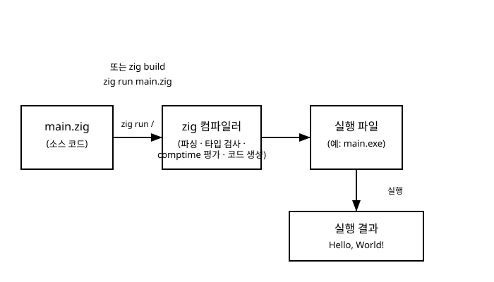

# 2장. 첫 프로그램과 빌드 과정

[◀ 이전: 1장. Zig란 무엇인가](ch01-Zig란무엇인가.md) | [📖 목차](00-목차.md) | [다음: 3장. 변수와 자료형 ▶](ch03-변수와자료형.md)


1장에서 Zig가 어떤 철학을 가진 언어인지 살펴보았다면, 이제는 직접 손을 움직여 볼 시간입니다. 이 장에서는 Zig를 설치하는 방법부터, 아주 짧은 코드 한 줄을 실행해보는 것, 그리고 여러 파일로 이루어진 프로젝트를 만들고 빌드하는 방법까지 순서대로 다룹니다. 앞으로 이 책의 모든 예제를 직접 실행해보려면 이 장의 내용이 꼭 필요하니, 실제로 터미널을 열고 하나씩 따라 해보길 권합니다.

## Zig 설치하기

Zig는 별도의 설치 프로그램이나 패키지 관리자 없이도 쓸 수 있도록, 압축 파일 하나로 배포됩니다. 공식 홈페이지(ziglang.org)의 다운로드 페이지에 들어가면 운영체제와 CPU 아키텍처에 맞는 압축 파일을 받을 수 있습니다.

설치 과정은 대략 다음과 같습니다.

1. 공식 홈페이지에서 사용 중인 운영체제(Windows, macOS, Linux 등)에 맞는 압축 파일을 내려받습니다.
2. 원하는 위치에 압축을 풉니다. 별도의 설치 경로 규칙은 없으므로, 예를 들어 `C:\zig`나 사용자 홈 폴더 아래 어딘가에 풀어도 무방합니다.
3. 압축을 푼 폴더를 시스템의 `PATH` 환경 변수에 추가합니다. 이렇게 해야 터미널 어디에서든 `zig`라는 명령을 바로 실행할 수 있습니다.

설치가 끝나면 터미널(또는 PowerShell)에서 다음 명령으로 제대로 설치되었는지 확인합니다.

```bash
zig version
```

버전 번호가 출력된다면 설치가 정상적으로 끝난 것입니다. Zig는 아직 1.0 이전의 활발한 개발 단계에 있는 언어라, 버전마다 문법이나 표준 라이브러리 API가 조금씩 바뀔 수 있습니다. 이 책의 예제는 최신 안정 버전의 문법을 기준으로 작성되었으니, 만약 여러분이 사용하는 버전에서 일부 함수 이름이 다르게 동작한다면 공식 문서의 변경 내역을 참고하기 바랍니다.

## 주석 문법

본격적으로 코드를 작성하기 전에, 가장 기본적인 문법인 주석부터 짚고 넘어가겠습니다. Zig에서 한 줄 주석은 `//`로 시작합니다. `//` 뒤부터 그 줄의 끝까지는 컴파일러가 무시합니다.

```zig
// 이것은 주석입니다. 컴파일러는 이 줄을 완전히 건너뜁니다.
const x = 10; // 코드 뒤에 붙여서 설명을 남길 수도 있습니다.
```

Zig에는 C나 Java에서 흔히 보는 `/* ... */` 형태의 여러 줄 주석이 없습니다. 여러 줄에 걸쳐 설명을 달고 싶다면 `//`를 줄마다 반복해서 씁니다.

```zig
// 이 함수는 두 정수를 더합니다.
// 오버플로우가 발생하면 컴파일러가 디버그 빌드에서 이를 감지합니다.
fn add(a: i32, b: i32) i32 {
    return a + b;
}
```

참고로 `///`로 시작하는 주석은 문서화 주석(doc comment)으로, 바로 아래에 있는 선언에 대한 설명으로 취급됩니다. 이 문법은 나중에 여러분이 직접 라이브러리를 만들 때 유용하게 쓰이므로, 지금은 존재만 알아두면 충분합니다.

## Hello, World! - zig run으로 빠르게 실행하기

이제 진짜 첫 프로그램을 작성해봅시다. 아무 폴더에 `hello.zig`라는 파일을 만들고 다음 내용을 입력합니다.

```zig
const std = @import("std");

pub fn main() void {
    std.debug.print("Hello, World!\n", .{});
}
```

이 짧은 코드에 이미 몇 가지 중요한 개념이 담겨 있습니다.

- `const std = @import("std");`는 Zig의 표준 라이브러리를 가져오는 코드입니다. `@import`는 컴파일러가 제공하는 내장 함수로, 다른 파일이나 모듈을 현재 파일에서 사용할 수 있게 해줍니다. C의 `#include`와 비슷한 역할을 하지만, 텍스트를 그대로 붙여넣는 방식이 아니라 실제 모듈 시스템으로 동작합니다.
- `pub fn main() void { ... }`는 프로그램의 시작점이 되는 함수를 선언합니다. `pub`은 이 함수를 다른 파일에서도 접근할 수 있게 공개한다는 뜻이고, 컴파일러는 실행 파일을 만들 때 이 `main` 함수를 진입점으로 사용합니다. 반환 타입 `void`는 이 함수가 특별한 값을 돌려주지 않는다는 뜻입니다. 함수 선언 문법은 7장에서 자세히 다룹니다.
- `std.debug.print(...)`는 표준 출력(정확히는 표준 에러 스트림)에 문자열을 출력하는 함수입니다. 첫 번째 매개변수는 형식 문자열이고, 두 번째 매개변수 `.{}`는 형식 문자열에 채워 넣을 값들을 담는 튜플입니다. 여기서는 채워 넣을 값이 없으므로 빈 튜플을 넘겼습니다.

이 파일을 실행하는 가장 빠른 방법은 `zig run` 명령입니다. 프로젝트를 따로 구성하지 않고, 단일 파일 하나를 컴파일해서 즉시 실행해주는 명령입니다.

```bash
zig run hello.zig
```

이 명령을 실행하면 다음과 같은 결과가 출력됩니다.

```
Hello, World!
```

`zig run`은 내부적으로 소스 코드를 컴파일해 임시 실행 파일을 만들고, 그것을 곧바로 실행한 뒤 정리합니다. 짧은 예제 코드를 빠르게 테스트해보고 싶을 때 아주 유용한 명령이며, 이 책의 예제 대부분도 이 방식으로 바로 실행해볼 수 있습니다.

## zig init으로 프로젝트 만들기

`zig run`은 파일 하나를 빠르게 실행해볼 때는 편리하지만, 여러 파일로 구성된 실제 프로젝트를 관리하기에는 적합하지 않습니다. 프로젝트를 제대로 구성하려면 `zig init` 명령을 사용합니다.

빈 폴더를 하나 만들고 그 안에서 다음 명령을 실행합니다.

```bash
mkdir hello_project
cd hello_project
zig init
```

`zig init`을 실행하면 Zig가 몇 가지 기본 파일을 자동으로 만들어 줍니다. 대략적인 구조는 다음과 같습니다(정확한 파일 이름과 내용은 Zig 버전에 따라 조금씩 다를 수 있습니다).

```
hello_project/
├── build.zig
├── build.zig.zon
└── src/
    └── main.zig
```

- `build.zig`는 이 프로젝트를 어떻게 빌드할지 정의하는 파일입니다. Zig는 별도의 Makefile이나 CMake 같은 외부 빌드 도구 없이, Zig 언어 자체로 빌드 스크립트를 작성합니다. 이 내용은 17장에서 본격적으로 다룹니다.
- `build.zig.zon`은 프로젝트의 이름, 버전, 그리고 외부 의존 패키지 정보를 담는 파일입니다. 확장자 `.zon`은 "Zig Object Notation"의 줄임말로, JSON과 비슷하지만 Zig 문법으로 값을 표현하는 데이터 형식입니다.
- `src/main.zig`는 실제 프로그램 코드가 담기는 파일로, `zig run`으로 실행했던 `hello.zig`와 비슷하게 `main` 함수를 포함하고 있습니다.

## zig build와 zig build run

프로젝트 폴더 안에서 다음 명령을 실행하면 `build.zig`에 정의된 대로 소스 코드를 컴파일합니다.

```bash
zig build
```

빌드가 성공하면 보통 `zig-out`이라는 폴더 아래에 실행 파일이 생성됩니다. 컴파일만 하고 실행은 따로 하고 싶을 때 이 명령을 사용합니다.

컴파일과 실행을 한 번에 하고 싶다면 다음 명령을 사용합니다.

```bash
zig build run
```

`zig init`으로 만들어진 기본 `build.zig`에는 보통 `run`이라는 이름의 빌드 단계가 미리 정의되어 있어서, 위 명령 한 줄로 컴파일부터 실행까지 이어서 처리할 수 있습니다. 소스 코드를 수정하고 결과를 바로 확인하고 싶을 때 가장 자주 쓰게 되는 명령이라고 봐도 좋습니다.

정리하면, 지금까지 살펴본 세 가지 실행 방법은 각각 다음과 같은 상황에 어울립니다.

- `zig run 파일명.zig`: 파일 하나짜리 코드를 빠르게 테스트해볼 때
- `zig build`: 프로젝트 전체를 컴파일만 하고 싶을 때
- `zig build run`: 프로젝트를 컴파일한 뒤 바로 실행 결과까지 확인하고 싶을 때

## 빌드 파이프라인 한눈에 보기

지금까지 다룬 과정, 즉 소스 코드가 실행 파일로 바뀌고 그것이 실제로 실행되기까지의 흐름을 그림으로 정리하면 다음과 같습니다.



소스 코드 파일(`main.zig`)은 `zig run`이나 `zig build` 명령을 통해 Zig 컴파일러에 전달됩니다. 컴파일러는 코드를 파싱하고, 타입을 검사하고, `comptime` 코드를 미리 계산한 뒤, 최종적으로 여러분이 사용하는 운영체제에서 실행 가능한 실행 파일을 만들어냅니다. 이 실행 파일을 실제로 실행하면 우리가 눈으로 확인하는 출력 결과, 즉 `Hello, World!` 같은 문자열이 화면에 나타납니다.

여기서 눈여겨볼 점은, Zig 컴파일러가 하는 일이 단순히 문법을 기계어로 바꾸는 것 이상이라는 사실입니다. 1장에서 짧게 살펴본 `comptime` 계산도 바로 이 컴파일 단계에서 함께 처리됩니다. 즉 여러분이 작성한 `comptime` 코드는 오른쪽의 "실행 결과" 단계가 아니라, 왼쪽의 "zig 컴파일러" 단계에서 이미 끝나 있는 것입니다. 이 차이는 14장에서 `comptime`을 본격적으로 다룰 때 다시 짚어보겠습니다.

## 요약

- Zig는 공식 홈페이지에서 압축 파일을 내려받아 `PATH`에 등록하는 방식으로 설치합니다. `zig version`으로 설치를 확인할 수 있습니다.
- 한 줄 주석은 `//`로 작성하며, Zig에는 여러 줄 주석 문법이 따로 없습니다.
- `zig run 파일명.zig`는 파일 하나를 빠르게 컴파일하고 실행해주는 명령입니다.
- "Hello, World!" 프로그램은 `@import("std")`로 표준 라이브러리를 가져오고, `pub fn main() void`를 진입점으로 삼아 `std.debug.print`로 문자열을 출력합니다.
- `zig init`은 `build.zig`, `build.zig.zon`, `src/main.zig`를 갖춘 프로젝트 구조를 만들어줍니다.
- `zig build`는 프로젝트를 컴파일하고, `zig build run`은 컴파일 후 곧바로 실행까지 이어서 처리합니다.
- 소스 코드는 Zig 컴파일러를 거쳐 실행 파일이 되고, 그 실행 파일을 실행해야 비로소 눈으로 확인할 수 있는 결과가 나옵니다.

## 연습문제

1. `zig run`과 `zig build run`의 차이를 자신의 말로 설명해 보세요. 각각 어떤 상황에서 더 적합한지도 함께 적어 보세요.
2. 여러분의 컴퓨터에 Zig를 설치하고 `zig version` 명령으로 설치된 버전을 확인해 보세요.
3. `hello.zig` 파일을 직접 작성하고 `zig run`으로 실행해서 "Hello, World!"가 출력되는지 확인해 보세요. 그런 다음 출력 문자열을 다른 문장으로 바꿔서 다시 실행해 보세요.
4. `zig init`으로 새 프로젝트를 만들고, 생성된 `src/main.zig` 파일의 내용을 살펴본 뒤 `zig build run`으로 실행해 보세요.
5. `std.debug.print`의 두 번째 매개변수로 넘긴 `.{}`는 어떤 역할을 하는 것일까요? 형식 문자열 안에 `{}`를 하나 추가하고 두 번째 매개변수에 값을 하나 넣어 실행해보면서 결과를 확인해 보세요.

---

[◀ 이전: 1장. Zig란 무엇인가](ch01-Zig란무엇인가.md) | [📖 목차](00-목차.md) | [다음: 3장. 변수와 자료형 ▶](ch03-변수와자료형.md)
