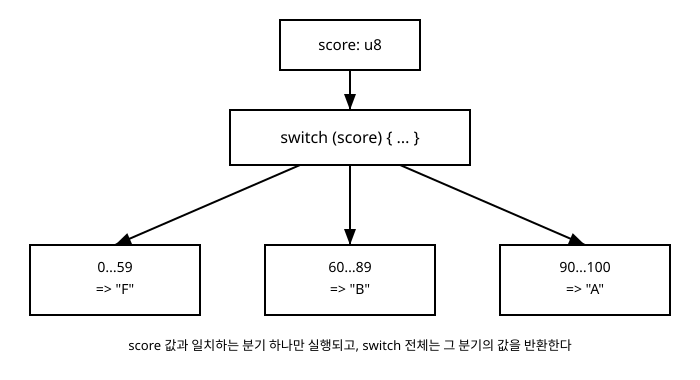

# 5장. 제어문

[◀ 이전: 4장. 연산자와 표현식](ch04-연산자와표현식.md) | [📖 목차](00-목차.md) | [다음: 6장. 반복문 ▶](ch06-반복문.md)


## 이 장에서 다루는 내용

프로그램은 대부분 위에서 아래로 한 줄씩 실행되지만, 어떤 조건에 따라 실행할 코드를 갈라야 할 때가 있습니다. 이런 분기를 처리하는 문법을 제어문(control flow statement)이라고 부릅니다. Zig의 `if`와 `switch`에는 다른 언어를 사용해 본 사람이라면 눈여겨볼 만한 특징이 하나 있습니다. 이 둘은 단순히 코드 흐름을 바꾸는 "문(statement)"일 뿐만 아니라, 그 자체로 값을 만들어내는 "표현식(expression)"으로도 쓸 수 있습니다. 이 특징 덕분에 Zig에는 C나 JavaScript에 있는 삼항 연산자(`?:`)가 존재하지 않습니다. 이 장에서는 다음을 다룹니다.

- `if`/`else`/`else if`를 이용한 조건 분기
- 값을 반환하는 표현식으로서의 `if`, 그리고 삼항 연산자가 없는 이유
- 여러 값과 범위를 매칭하는 `switch`문
- 값을 반환하는 표현식으로서의 `switch`
- 10장과 11장에서 다시 만날, 옵셔널·에러를 언랩하는 `if`의 또 다른 용법 예고

## if / else / else if

`if`문의 기본 형태는 3장과 4장에서 다룬 불(bool) 값을 조건으로 받아 실행 경로를 나눕니다.

```zig
const std = @import("std");

pub fn main() void {
    const temperature: i32 = 28;

    if (temperature > 30) {
        std.debug.print("무더운 날씨입니다.\n", .{});
    } else if (temperature > 20) {
        std.debug.print("따뜻한 날씨입니다.\n", .{});
    } else {
        std.debug.print("쌀쌀한 날씨입니다.\n", .{});
    }
}
```

`if` 뒤의 조건은 반드시 괄호로 감싸며, 그 안의 표현식은 반드시 `bool` 타입이어야 합니다. C 계열 언어처럼 정수 `0`을 거짓으로, 그 외의 값을 참으로 취급하는 암묵적 변환은 Zig에는 없습니다. 예를 들어 `if (temperature)`처럼 정수를 그대로 조건에 넣으면 컴파일 오류가 발생합니다. 조건은 언제나 4장에서 다룬 비교·논리 연산자를 통해 명시적으로 `bool` 값을 만들어야 합니다.

`else if`는 별도의 문법이 아니라, `else` 블록 안에 다시 `if`문을 쓴 것을 줄여 쓴 형태입니다. 조건은 위에서부터 순서대로 검사되며, 참인 조건을 처음 만나는 블록만 실행됩니다. 어떤 조건도 참이 아니라면 마지막 `else` 블록이 실행됩니다. `else`는 생략할 수 있으며, 이 경우 조건이 거짓이면 아무 일도 하지 않고 다음 코드로 넘어갑니다.

## 표현식으로서의 if

Zig의 `if`는 값을 반환하는 표현식으로도 쓸 수 있습니다. 이때는 `if`와 `else`가 항상 함께 있어야 하며, 두 분기가 만들어내는 값의 타입이 서로 호환되어야 합니다.

```zig
const x: i32 = -7;
const abs_x = if (x < 0) -x else x;
// abs_x == 7
```

문(statement)으로 쓸 때는 각 블록에서 값을 만들지 않아도 되지만, 표현식으로 쓸 때는 두 분기 모두 값을 내야 하고 그 값의 타입이 일치해야 합니다. 다음처럼 `else`를 생략하거나 한쪽 분기만 값을 반환하면 컴파일 오류가 됩니다.

```zig
// 컴파일 오류: else가 없으면 조건이 거짓일 때 값을 만들 수 없다
// const y = if (x < 0) -x;
```

분기 안에서 여러 줄의 계산이 필요하다면 블록 `{}`을 사용하고, 블록의 마지막 줄에 세미콜론 없는 표현식을 두어 그 값을 블록의 결과로 만듭니다.

```zig
const grade_point: f64 = if (score >= 90) blk: {
    std.debug.print("최우수 등급입니다.\n", .{});
    break :blk 4.5;
} else blk: {
    break :blk 3.0;
};
```

위 코드에서 `blk: { ... }`처럼 레이블이 붙은 블록과 `break :blk 값;`을 사용하면 블록 중간에 부수적인 작업(여기서는 출력)을 하면서도 마지막에 원하는 값을 결과로 만들어낼 수 있습니다. 레이블이 붙은 블록과 `break`의 자세한 동작은 6장에서 반복문을 다루며 다시 살펴보겠습니다. 지금은 `if` 표현식의 각 분기가 반드시 같은 타입의 값 하나를 만들어야 한다는 점만 기억해 두면 충분합니다.

### 삼항 연산자가 없는 이유

C, JavaScript, Java 같은 언어에는 `조건 ? 참일때값 : 거짓일때값` 형태의 삼항 연산자가 있습니다. Zig는 언어 문법의 개수를 늘리지 않는 것을 중요한 설계 원칙으로 삼고 있고, `if` 표현식이 삼항 연산자와 정확히 같은 역할을 할 수 있기 때문에 별도의 삼항 연산자를 두지 않았습니다.

```zig
// 다른 언어라면: max = (a > b) ? a : b;
const max = if (a > b) a else b;
```

한 줄로 쓰든 여러 줄로 쓰든, Zig에서 조건에 따라 값을 고르는 방법은 언제나 `if` 표현식 하나로 통일되어 있습니다.

## switch문

여러 개의 값 중 하나와 비교해서 분기해야 할 때 `if`-`else if`를 길게 늘어놓을 수도 있지만, Zig는 이런 다중 분기를 위해 `switch`문을 제공합니다.

```zig
const std = @import("std");

fn dayName(day: u8) []const u8 {
    return switch (day) {
        1 => "월요일",
        2 => "화요일",
        3 => "수요일",
        4 => "목요일",
        5 => "금요일",
        6, 7 => "주말",
        else => "알 수 없는 요일",
    };
}

pub fn main() void {
    std.debug.print("{s}\n", .{dayName(6)});
}
```

`switch (day)`는 `day`의 값을 각 분기(prong)의 값과 순서대로 비교합니다. `6, 7 => "주말"`처럼 쉼표로 여러 값을 나열하면 그 값들 중 하나라도 일치하면 같은 분기가 실행됩니다. 위 예제의 `else`는 앞선 어떤 분기와도 일치하지 않을 때 실행되는 기본 분기입니다.

### 범위 매칭

연속된 범위의 값을 하나의 분기로 묶고 싶다면 `...`을 사용합니다. 이 범위는 양 끝을 모두 포함하는 폐구간입니다.

```zig
fn describeAge(age: u8) []const u8 {
    return switch (age) {
        0...12 => "어린이",
        13...19 => "청소년",
        20...64 => "성인",
        else => "노인",
    };
}
```

`0...12`는 0부터 12까지(0과 12 포함)를 뜻합니다. 슬라이스 문법에서 사용하는 `..`(13장에서 다룰 반열림 범위)와 혼동하지 않도록 주의하세요. `switch`의 범위 매칭은 항상 세 개의 점 `...`을 쓰고, 양 끝을 포함합니다.

### switch는 모든 경우를 다뤄야 한다

Zig의 `switch`문은 원칙적으로 검사 대상이 가질 수 있는 모든 값을 어느 분기에서든 다루어야 합니다. `u8`처럼 값의 범위가 넓은 정수 타입을 검사할 때 모든 값을 일일이 나열하는 것은 현실적이지 않으므로, 위 예제들처럼 `else` 분기를 두어 "그 외의 모든 경우"를 처리하는 것이 일반적입니다. `else`나 나머지 값을 모두 포괄하는 범위가 없다면 컴파일러는 오류를 발생시켜, 미처 생각하지 못한 값이 조용히 누락되는 것을 막아 줍니다. (16장에서 다룰 열거형처럼 가능한 값의 개수가 정해져 있는 타입은 모든 값을 나열하면 `else` 없이도 컴파일할 수 있습니다.)

아래 그림은 `score` 값이 세 범위 중 하나와 비교되어, 그중 일치하는 분기 하나만 실행되는 과정을 보여줍니다.



## 표현식으로서의 switch

`if`와 마찬가지로 `switch`도 값을 만들어내는 표현식으로 쓸 수 있습니다. 앞서 본 `dayName`, `describeAge` 함수의 `return switch (...) { ... };`가 바로 그 예입니다. 각 분기는 `=>` 뒤에 값 하나를 두거나, 블록을 사용해 여러 문장을 실행한 뒤 마지막에 값을 만들어낼 수 있습니다.

```zig
const std = @import("std");

fn scoreToGrade(score: u8) u8 {
    const grade: u8 = switch (score) {
        90...100 => 'A',
        80...89 => 'B',
        70...79 => 'C',
        else => blk: {
            std.debug.print("주의: {d}점은 낮은 점수입니다.\n", .{score});
            break :blk 'F';
        },
    };
    return grade;
}

pub fn main() void {
    const grade = scoreToGrade(65);
    std.debug.print("등급: {c}\n", .{grade});
}
```

`else` 분기처럼 블록이 필요한 경우에는 `blk: { ... break :blk 값; }` 형태로 값을 만들어야 합니다. `switch` 표현식의 모든 분기는 결국 같은 타입의 값을 만들어야 하며, 그 값이 전체 `switch` 표현식의 결과가 됩니다.

### if와 switch, 언제 무엇을 쓸까

두 값이 같은지 다른지, 또는 부등식 몇 개만 확인하면 되는 단순한 조건이라면 `if`-`else if` 체인이 읽기 편합니다. 반면 하나의 값을 여러 개의 후보와 비교해야 하거나, 정수·문자의 여러 범위를 한꺼번에 다뤄야 한다면 `switch`가 의도를 더 명확하게 드러냅니다. 특히 `switch`는 모든 경우를 다뤄야 한다는 규칙 덕분에, 나중에 새로운 값이 추가되었을 때 처리를 빠뜨리는 실수를 컴파일 시점에 잡아낼 수 있다는 실질적인 장점이 있습니다.

## 미리보기: 옵셔널과 에러를 언랩하는 if

지금까지 본 `if`는 `bool` 조건을 검사했지만, Zig의 `if`에는 한 가지 용법이 더 있습니다. 10장에서 다룰 옵셔널 타입(`?T`)과 11장에서 다룰 에러 유니언 타입(`!T`) 값을 다룰 때, `if`는 그 값이 존재하는지(또는 에러인지)를 검사하는 동시에 안의 값을 꺼내는 역할도 합니다.

```zig
var maybe_name: ?[]const u8 = null;

if (maybe_name) |name| {
    std.debug.print("이름: {s}\n", .{name});
} else {
    std.debug.print("이름이 없습니다.\n", .{});
}
```

여기서 `|name|`은 `maybe_name`이 `null`이 아닐 때 그 안에 들어 있는 실제 값을 `name`이라는 이름으로 꺼내는 캡처(capture) 문법입니다. 에러를 반환할 수 있는 값에 대해서도 비슷한 문법이 있습니다.

```zig
if (readNumber()) |value| {
    std.debug.print("값: {d}\n", .{value});
} else |err| {
    std.debug.print("에러 발생: {}\n", .{err});
}
```

지금 단계에서는 이 문법이 존재한다는 것만 기억해 두세요. `if`가 단순한 조건 분기 이상의 역할을 한다는 점, 즉 "값이 있는지 확인하면서 동시에 그 값을 꺼내는" 용도로도 쓰인다는 점은 10장과 11장에서 옵셔널과 에러 처리를 본격적으로 배우면서 자세히 다루겠습니다.

## 요약

- `if`/`else`/`else if`는 `bool` 조건에 따라 실행 경로를 나눈다. Zig의 조건은 반드시 `bool` 타입이어야 하며, 정수의 암묵적 변환은 없다.
- `if`는 문으로도, 값을 만들어내는 표현식으로도 쓸 수 있다. 표현식으로 쓸 때는 `else`가 필수이며 두 분기의 값 타입이 일치해야 한다.
- Zig에는 삼항 연산자가 없다. `if` 표현식이 그 역할을 대신한다.
- `switch`문은 하나의 값을 여러 후보와 비교한다. 쉼표로 여러 값을, `...`으로 폐구간 범위를 한 분기에 묶을 수 있다.
- `switch`는 원칙적으로 모든 경우를 다뤄야 하며, 보통 `else` 분기로 나머지 경우를 처리한다.
- `switch`도 표현식으로 쓸 수 있으며, 각 분기는 `=>` 뒤에 값을 두거나 레이블 블록으로 여러 문장을 실행한 뒤 값을 만들 수 있다.
- `if`는 10장의 옵셔널 타입과 11장의 에러 유니언 타입을 다룰 때, 값의 존재 여부를 확인하면서 동시에 값을 꺼내는 언랩 문법으로도 쓰인다.

## 연습문제

1. 정수 `n`을 입력받아 3의 배수이면서 5의 배수이면 `"FizzBuzz"`, 3의 배수이면 `"Fizz"`, 5의 배수이면 `"Buzz"`, 그 외에는 숫자 자체를 문자열로 출력하는 로직을 `if`-`else if` 체인으로 작성해 보세요.
2. 위 1번 문제를 `switch`문을 사용해 다시 작성해 보세요. (힌트: `n % 15 == 0`처럼 조건을 미리 계산한 값을 `switch`의 대상으로 쓸 수 있습니다.)
3. 월(1~12)을 나타내는 `u8` 값을 받아 계절 이름("봄", "여름", "가을", "겨울")을 반환하는 함수를 `switch` 표현식과 범위 매칭(`...`)으로 작성해 보세요.
4. 두 정수 `a`, `b`를 받아 더 큰 값을 반환하는 `max` 함수를, 첫째로 `if` 표현식으로, 둘째로 일반 `if`문으로 각각 작성해 보고 두 방식의 코드량과 가독성을 비교해 보세요.
5. `switch` 표현식의 `else` 분기에서 `blk` 레이블 블록을 사용해, 오류 상황에서는 메시지를 출력하고 기본값을 반환하는 함수를 작성해 보세요.

---

[◀ 이전: 4장. 연산자와 표현식](ch04-연산자와표현식.md) | [📖 목차](00-목차.md) | [다음: 6장. 반복문 ▶](ch06-반복문.md)
